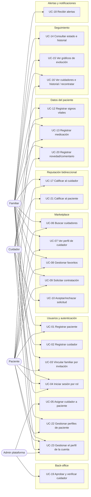

# Keru — Casos de Uso del MVP

> **Fuente:** `Keru-Scope-MVP.docx.pdf` (Alcance del MVP / Scope de Salida) + **decisiones de producto del 2026-07-09**: aprobación previa de cuidadores por el admin, carga de datos clínicos también por familiares, historial de cuidadores con recontratación, reseñas bidireccionales, alertas obligatorias con centro de notificaciones, vínculo familiar–paciente por **código de invitación**, el cuidador **acepta** las solicitudes, el **módulo de pagos queda pendiente de decisión** (fuera de los casos de uso por ahora), y una **cuenta puede administrar varios perfiles de paciente** (p. ej. madre y padre) con búsquedas y contrataciones por perfil.
> **Propósito:** documento de casos de uso listo para alimentar Spec Kit (`/specify`) o una herramienta de IA de diseño de arquitectura.
> Los supuestos de versiones anteriores (UC-03 y UC-10) ya fueron resueltos por decisiones de producto — no quedan supuestos abiertos.
> **Numeración:** UC-20, UC-21, UC-22 y UC-23 fueron agregados por decisiones de producto posteriores al scope original y se ubican dentro de su módulo. **UC-11 queda reservado** para el módulo de pagos (pendiente de decisión).

---

## 1. Visión

Keru es un marketplace de cuidadores ("el Uber de los cuidadores") que conecta pacientes y sus familias con cuidadores profesionales. Permite buscarlos por zona, tipo de cuidado y reputación; contratarlos en línea; registrar las métricas de salud del paciente durante el servicio; y que la familia consulte la evolución desde cualquier lugar.

**Objetivo del MVP:** validar el circuito completo de extremo a extremo — buscar y contratar un cuidador, registrar las métricas del paciente y que la familia pueda ver su estado. *(El pago en línea está pendiente de decisión — ver Módulo C.)*

**Entregable:** aplicación **móvil y web** funcional.

---

## 2. Actores

| Actor | Descripción |
|---|---|
| **Paciente** | Persona que recibe el cuidado. Tiene una ficha con datos clínicos básicos. Una **cuenta** de este tipo puede administrar **varios perfiles de paciente** (p. ej. dar de alta a la madre y al padre) y buscar/contratar cuidadores para cada perfil, ver su historial de cuidadores y reseñar. |
| **Familiar** | Persona vinculada al paciente mediante **código de invitación**. Busca y contrata cuidadores, consulta el estado del paciente y **también carga datos clínicos** (métricas, medicación, novedades), igual que el cuidador. |
| **Cuidador** | Profesional que presta el servicio. Publica su perfil (especialidades, certificaciones, disponibilidad, tarifas), **acepta o rechaza solicitudes**, registra las métricas del paciente durante su turno y reseña al paciente al finalizar el servicio. Su cuenta debe ser aprobada por el administrador antes de ser visible en el marketplace. |
| **Administrador de plataforma** | Rol interno que **aprueba las cuentas nuevas de cuidadores** antes de que sean visibles en el marketplace, ejecuta la verificación manual de credenciales/identidad/antecedentes y otorga las insignias de verificación. |
| **Pasarela de pagos** (externo) | Solo si se incluye el módulo de pagos (pendiente de decisión). |

---

## 3. Mapa general de casos de uso



*(El módulo C — Pagos — no figura en el mapa porque está pendiente de decisión; ver su sección.)*

---

## 4. Casos de uso

### Módulo A — Creación y gestión de usuarios (scope §3.1)

---

#### UC-01 · Registrar paciente
- **Actor principal:** Familiar o Paciente
- **Referencia al scope:** §3.1
- **Descripción:** Dar de alta la ficha (perfil) del paciente con sus datos personales y clínicos básicos. Una misma cuenta puede dar de alta **varios perfiles de paciente** (UC-22) — p. ej. la madre y el padre.
- **Precondiciones:** Ninguna (o usuario autenticado si la ficha la crea una cuenta ya registrada).
- **Flujo principal:**
  1. El usuario ingresa los datos personales: nombre, edad, fecha de nacimiento y foto.
  2. Ingresa la condición principal a asistir.
  3. Ingresa grupo sanguíneo y alergias.
  4. Ingresa el contacto de emergencia.
  5. El sistema valida los datos y crea la ficha del paciente.
- **Flujos alternativos / excepciones:**
  - A1. Datos obligatorios faltantes o inválidos (p. ej. fecha de nacimiento futura): el sistema señala los campos y no persiste.
  - A2. La foto es opcional; la ficha puede crearse sin ella.
- **Postcondiciones:** Existe una ficha de paciente consultable y asociable a familiares y cuidadores. Quien crea la ficha queda vinculado al paciente.
- **Criterios de aceptación:**
  - [ ] La ficha guarda: nombre, edad, fecha de nacimiento, foto, condición principal, grupo sanguíneo, alergias y contacto de emergencia.
  - [ ] La edad puede derivarse de la fecha de nacimiento (evitar inconsistencia entre ambas).
  - [ ] La ficha queda disponible para los flujos de contratación (UC-09) y seguimiento (UC-14).
  - [ ] Una cuenta puede crear y administrar más de un perfil de paciente (UC-22).

---

#### UC-02 · Registrar cuidador (y mantener el perfil aprobado)
- **Actor principal:** Cuidador
- **Referencia al scope:** §3.1, §3.2 + decisión de producto (aprobación previa del admin)
- **Descripción:** Alta del perfil profesional del cuidador. La cuenta nueva queda **pendiente de verificación** y no es visible en el marketplace hasta que el administrador la apruebe (UC-19). Una vez aprobado, el cuidador **mantiene su perfil al día** (foto, disponibilidad, tarifas, zona, modalidades) sin volver a pasar por aprobación (A3).
- **Precondiciones:** Ninguna.
- **Flujo principal:**
  1. El cuidador crea su cuenta e ingresa datos personales, **incluida una foto de perfil opcional** (se muestra en las cards de búsqueda, UC-06).
  2. Selecciona sus especialidades: cuidado de adultos mayores, post-quirúrgico, enfermedad crónica, discapacidad, paliativos, pediátrico, rehabilitación, acompañamiento.
  3. Carga sus estudios y certificaciones (título de enfermería, auxiliar, RCP, cuidado geriátrico, etc.), cada una con institución y año.
  4. Define su disponibilidad horaria.
  5. Define sus tarifas / planes.
  6. Define su zona de trabajo y modalidades que atiende (domicilio u hospital).
  7. El sistema crea el perfil en estado **pendiente de verificación** y lo encola para revisión del administrador (UC-19); el cuidador ve el estado de su solicitud.
- **Flujos alternativos / excepciones:**
  - A1. Certificaciones sin institución o año: el sistema exige completar ambos campos.
  - A2. **Re-postulación tras rechazo:** un cuidador con perfil **rechazado** puede corregir sus datos y re-enviar la postulación; el perfil vuelve a estado **pendiente**, se limpia el motivo de rechazo, las certificaciones vuelven a "no verificada" y entra de nuevo a la cola de revisión del administrador (UC-19).
  - A3. **Edición del perfil aprobado (NFR-03/23):** un cuidador **aprobado** actualiza **foto, disponibilidad, tarifas, zona y modalidades** sin pasar por re-aprobación: el perfil sigue aprobado y visible en el marketplace durante y después del cambio. Las tarifas son **efectivo-fechadas**: cada cambio agrega una nueva versión con su fecha de vigencia al historial de tarifas — **ninguna versión pasada se reescribe**. El marketplace (UC-06/07) muestra la tarifa **vigente**; las solicitudes ya emitidas conservan la tarifa **pinneada** al momento de solicitar (UC-09, NFR-03/23) y la aceptación se evalúa contra esos términos. **Nombre, especialidades y certificaciones no se editan por esta vía**: son parte de lo revisado al aprobar (UC-19); un cambio de credenciales exige re-verificación, cuyo proceso es una **decisión de producto pendiente** (constitution §7) — hasta que se decida, el cuidador aprobado no puede modificarlos. Toda edición queda auditada (quién, cuándo, qué campos).
- **Postcondiciones:** Perfil creado en estado pendiente; recién al ser aprobado por el administrador (UC-19) aparece en los resultados de búsqueda (UC-06) y puede recibir solicitudes (UC-09).
- **Criterios de aceptación:**
  - [ ] El perfil registra especialidades, certificaciones (con institución y año), disponibilidad horaria, tarifas, zona y modalidad.
  - [ ] Una cuenta de cuidador nueva **no es visible en el marketplace** hasta ser verificada y aprobada por el administrador (UC-19).
  - [ ] El cuidador puede ver el estado de su cuenta (pendiente / aprobada / rechazada).
  - [ ] Las certificaciones nacen en estado "no verificada" hasta que el proceso interno las verifique (UC-19).
  - [ ] La re-postulación solo es posible desde el estado **rechazado** (un perfil aprobado o desactivado no se re-envía por esta vía); cada re-envío queda auditado.
  - [ ] Un cuidador **aprobado** edita foto, disponibilidad, tarifas, zona y modalidades **sin re-aprobación** (el perfil sigue aprobado y visible); la edición solo está disponible para el dueño del perfil y solo en estado aprobado (pendiente/rechazado usan el alta o la re-postulación A2).
  - [ ] La tarifa es **efectivo-fechada** (NFR-03/23): cada cambio agrega una versión al historial con su fecha de vigencia; ninguna versión pasada se reescribe, y las solicitudes existentes conservan la tarifa pinneada al crearlas mientras el marketplace muestra la vigente.
  - [ ] Nombre, especialidades y certificaciones **no** son editables con el perfil aprobado (el cambio de credenciales requiere re-verificación — decisión de producto pendiente, constitution §7); toda edición queda auditada.

---

#### UC-03 · Vincular familiar a un paciente por código de invitación
- **Actor principal:** Familiar invitado
- **Actor secundario:** Paciente o familiar ya vinculado (quien invita)
- **Referencia al scope:** §2 (rol Familiar), §3.4 ("familiares vinculados al paciente") + decisión de producto (mecánica de invitación)
- **Descripción:** El vínculo familiar–paciente se establece mediante un **código/link de invitación** que se comparte por WhatsApp, mail u otro canal. Si el invitado no tiene la app, el link abre la **web de Keru** para confirmar el vínculo. Al confirmar, si no está registrado, se lo envía al registro para crear su usuario y el vínculo se completa al terminar. Las invitaciones emitidas se **gestionan** desde la ficha del paciente: cualquier vinculado puede ver cuáles están vivas (estado y vencimiento) y una invitación pendiente emitida por error puede **revocarse** (solo el emisor o un `consent-holder`), dejándola inutilizable.
- **Precondiciones:** Existe la ficha del paciente (UC-01).
- **Flujo principal:**
  1. El paciente o un familiar ya vinculado genera un código/link de invitación desde la ficha del paciente.
  2. Comparte el link por WhatsApp, mail u otro canal. **Además, el sistema envía automáticamente el link por email al invitado nombrado** (mejor esfuerzo: si el envío falla, la invitación sigue siendo válida y compartible a mano).
  3. El invitado abre el link: si tiene la app instalada se abre en la app; si no, el link lo lleva a la **web de Keru**.
  4. La pantalla muestra la invitación a vincularse con el paciente y pide confirmación.
  5. El invitado presiona "Sí, confirmo".
  6. Si ya está registrado, inicia sesión y el sistema establece el vínculo.
- **Flujos alternativos / excepciones:**
  - A1. **Invitado no registrado — el alta define la contraseña en el primer acceso (UC-04 A5):** al aceptar la invitación, el sistema **crea la cuenta directamente desde la invitación** (email = el invitado nombrado, rol `family`) **sin contraseña propia**: la cuenta nace en estado **"pendiente de definir contraseña"** (`MUST_SET_PASSWORD`) y el vínculo con el paciente se establece en el mismo acto (la invitación se consume, un solo uso). El primer acceso lo lleva de inmediato a la pantalla **"Definí tu contraseña"** y **no puede usar la app** hasta setearla (los endpoints de negocio responden `403 MUST_SET_PASSWORD`). Al definirla, la cuenta queda como cualquier otra (login normal en adelante) y entra a su círculo. Si el invitado **ya tiene cuenta**, no se crea otra: inicia sesión con su email y usa la confirmación normal (flujo principal, paso 6). La contraseña se valida con la misma fuerza que el alta (UC-01/02) y el evento queda auditado.
  - A2. Código/link inválido, vencido o **revocado**: el sistema lo informa y no crea el vínculo.
  - A3. El invitado no confirma (cierra o rechaza): no se crea ningún vínculo.
  - A4. **Listar invitaciones emitidas:** cualquier vinculado al paciente ve, desde la ficha/modal de invitar, las invitaciones emitidas con invitado, rol a otorgar, estado (`pending`/`accepted`/`revoked`) y vencimiento. Quien no está vinculado recibe 403.
  - A5. **Revocar una invitación:** el **emisor** de la invitación o un vinculado **`consent-holder`** puede revocar una invitación **pendiente** (con confirmación previa en la UI). Queda en estado `revoked`, el link deja de ser válido (la previsualización la muestra inválida y la confirmación falla) y la acción queda **auditada**. Otro vinculado (p. ej. un `viewer` o un `manager` que no la emitió) recibe 403. Una invitación ya **aceptada** no puede revocarse (el vínculo creado se gestiona desde el círculo); re-revocar una ya revocada no cambia nada.
- **Postcondiciones:** El familiar queda vinculado al paciente: puede buscar/contratar cuidadores para él, consultar su estado y cargar datos clínicos.
- **Criterios de aceptación:**
  - [ ] El código/link de invitación es único y está asociado a un paciente concreto.
  - [ ] El sistema envía el link por email al invitado (mejor esfuerzo, no bloquea la emisión); la UI ofrece igualmente copiar/compartir el link.
  - [ ] El link funciona como deep link: abre la app si está instalada y la web si no (misma confirmación en ambos casos).
  - [ ] Si el invitado no está registrado, aceptar la invitación **crea su cuenta sin contraseña** (estado `MUST_SET_PASSWORD`) y la vincula al paciente en el mismo acto; su primer acceso lo obliga a **definir la contraseña** antes de usar la app (UC-04 A5). Si ya tiene cuenta, inicia sesión y confirma con el flujo normal.
  - [ ] Un paciente puede tener uno o más familiares vinculados.
  - [ ] El familiar solo accede a datos de pacientes a los que está vinculado.
  - [ ] Cualquier vinculado puede **listar** las invitaciones emitidas del paciente con estado y vencimiento; quien no está vinculado recibe 403.
  - [ ] Solo el **emisor** o un **`consent-holder`** puede **revocar** una invitación pendiente; otro vinculado recibe 403. La revocación queda auditada.
  - [ ] Una invitación **revocada queda inutilizable**: la previsualización devuelve `valid=false` y la confirmación falla; una aceptada no puede revocarse.
  - **Resuelto (OQ-2 / NFR-19):** el código vence a los **30 minutos** y es de **un solo uso**.

---

#### UC-04 · Iniciar sesión y autenticación por rol
- **Actor principal:** Paciente, Familiar, Cuidador, Administrador
- **Referencia al scope:** §3.1
- **Descripción:** Autenticación básica; la sesión determina el rol y con él las capacidades y vistas disponibles. La sesión es **revocable server-side** (NFR-41): cerrar sesión invalida el token al instante, no al expirar. Las operaciones admin sensibles exigen **step-up** (re-confirmación de identidad con token corto, NFR-33) — un guard de rol no alcanza. Si el usuario **olvida su contraseña**, la recupera con un flujo de **reset por email** (token de un solo uso y corta vida, patrón NFR-19) que, al confirmarse, **revoca todas las sesiones vigentes de la cuenta** (A4). Una cuenta que **aún no definió su contraseña** —hoy solo las creadas al **aceptar una invitación sin estar registrado** (UC-03 A1)— nace en estado **`MUST_SET_PASSWORD`** y su **primer acceso la obliga a definirla** antes de dejarla usar la app (A5).
- **Precondiciones:** Cuenta creada (UC-01/02/03).
- **Flujo principal:**
  1. El usuario ingresa sus credenciales.
  2. El sistema valida y crea la sesión con el rol correspondiente; el token emitido lleva **identidad propia (`jti`)** para poder revocarlo.
  3. El sistema muestra la interfaz propia del rol (marketplace y seguimiento para familiar/paciente; agenda y registro de métricas para cuidador; back-office para administrador).
  4. **Cerrar sesión (logout server-side, NFR-41):** el sistema revoca el token (denylist por `jti` hasta su expiración natural) y las **push subscriptions de la sesión** (la del device que cierra sesión si el cliente la identifica; si no, todas las de la cuenta — la higiene le gana a la comodidad). La campana (UC-18) no se toca: es historial de la cuenta, no de la sesión. El logout queda auditado.
- **Flujos alternativos / excepciones:**
  - A1. Credenciales inválidas: mensaje de error, sin sesión.
  - A2. **Token revocado:** cualquier request con un token deslistado recibe 401, igual que uno expirado — un token robado deja de valer en cuanto la sesión se cierra.
  - A3. **Operación sensible sin step-up (NFR-33):** aprobar/rechazar cuidadores (UC-19) y liberar cuarentena (UC-12 A3) exigen, además de la sesión, un **token de step-up**: el usuario re-confirma su password y el sistema emite un token corto (~5 min, claim `step_up`) que acompaña la operación. Sin él: 403 con código `STEP_UP_REQUIRED` (el cliente sabe que debe pedir la re-confirmación, no que le falta permiso). Cada **emisión** y cada **uso** del step-up quedan auditados.
  - A4. **Recuperación de contraseña (forgot/reset password):** el usuario que olvidó su contraseña la restablece sin intervención de soporte, en dos pasos:
    1. **Pedido (`request`):** desde el login, el link "Olvidé mi contraseña" lleva a ingresar el email de la cuenta. El sistema responde **SIEMPRE con éxito neutro** — no revela si el email existe (**anti-enumeración**): la respuesta es idéntica para un email registrado y uno que no. Si la cuenta existe, el sistema emite un **token de recuperación de un solo uso y corta vida** (patrón NFR-19: alto entropía, TTL corto —30 min por defecto—, un solo uso) y le envía por email un link con el token (mejor esfuerzo: un fallo del proveedor de mail no rompe el flujo). La **emisión** queda auditada.
    2. **Confirmación (`confirm`):** el link del email abre la pantalla de nueva contraseña con el token en el query param. El usuario define una contraseña nueva (misma validación de fuerza que el alta, UC-01/02). El sistema valida el token (no expirado, no usado); si es inválido/expirado/reusado lo **rechaza** (410, sin revelar cuál de las tres). Con token válido: setea el hash nuevo, **marca el token usado** (single-use) y **revoca todas las sesiones vigentes de la cuenta** (denylist por cuenta, NFR-41: un reset expulsa cualquier sesión abierta con la contraseña vieja, y limpia las push subscriptions de la cuenta). El **uso** queda auditado. La idempotencia (NFR-34) la garantiza el propio token de un solo uso (at-most-once por precondición de estado, ADR-0002), sin operationId aparte.
  - A5. **Definir contraseña en el primer acceso (first-login, MUST_SET_PASSWORD):** una cuenta creada **sin contraseña propia** —hoy solo por aceptar una invitación sin estar registrado (UC-03 A1); no existe otro camino de alta sin contraseña— nace **pendiente de definir contraseña**. El estado se **deriva de no tener hash de contraseña** (no hay columna de estado aparte). Su sesión inicial es **limitada**: el token lleva un claim `mustSetPassword` y el guard responde **`403 MUST_SET_PASSWORD`** a **cualquier endpoint de negocio** (no se expone la app) salvo el propio `set-password` (y el logout). En el primer acceso el sistema fuerza la pantalla **"Definí tu contraseña"**:
    1. El usuario define su contraseña (misma validación de fuerza que el alta, UC-01/02). `POST /auth/set-password` (con la sesión limitada) setea el hash, **audita** el evento (`auth.first-login.password-set`) y devuelve una **sesión nueva y completa** (auto-login) sin el claim `mustSetPassword`. La idempotencia (NFR-34) la garantiza la **precondición de estado** (una cuenta que ya tiene hash responde 409): at-most-once sin operationId aparte (ADR-0002).
    2. Con la contraseña definida, la cuenta es **normal**: login/acceso sin restricción y entra al home de su rol. Si intenta `login` antes de definirla, recibe `401` (no puede loguearse sin contraseña; si perdió el link de invitación, la recupera por el reset de contraseña A4, que también le sirve para setearla).
- **Postcondiciones:** Sesión activa con rol asignado; al cerrar sesión, token y push subscriptions revocados. Tras un reset de contraseña: la contraseña queda actualizada, el token de reset consumido, y **toda sesión previa de la cuenta revocada** (sus tokens reciben 401). Tras definir la contraseña en el primer acceso (A5): la cuenta deja el estado `MUST_SET_PASSWORD`, obtiene una sesión completa y accede con normalidad.
- **Criterios de aceptación:**
  - [ ] Cada endpoint/pantalla valida el rol y el vínculo: un cuidador solo opera sobre pacientes que tiene asignados; un familiar solo sobre pacientes a los que está vinculado.
  - [ ] El familiar puede consultar y también **cargar** datos clínicos de sus pacientes vinculados (UC-12, UC-13, UC-20).
  - [ ] **Logout revoca server-side:** tras cerrar sesión, el mismo token recibe 401 en cualquier endpoint protegido (NFR-41), y las push subscriptions de la sesión quedan revocadas (device notificado ≠ sesión viva).
  - [ ] **Step-up en operaciones sensibles:** aprobar/rechazar cuidador y liberar cuarentena sin token de step-up → 403 `STEP_UP_REQUIRED`; con re-confirmación de password válida (token corto, claim `step_up`) → proceden; emisión y uso auditados (NFR-33).
  - [ ] **Reset · pedido anti-enumeración (A4.1):** `POST /auth/password-reset/request` responde 200 tanto para un email registrado como para uno inexistente (misma respuesta, sin filtrar existencia); si la cuenta existe se emite un token de un solo uso con TTL corto, se dispara el email y la emisión queda auditada.
  - [ ] **Reset · confirmación (A4.2):** `POST /auth/password-reset/confirm` con token válido setea la contraseña nueva (misma validación de fuerza que el alta), consume el token y revoca todas las sesiones vigentes de la cuenta; con token expirado o ya usado → 410 (rechazado); el uso queda auditado.
  - [ ] **Reset · revocación de sesiones (A4.2):** tras confirmar el reset, cualquier token de sesión emitido antes recibe 401 en endpoints protegidos (NFR-41), y las push subscriptions de la cuenta quedan revocadas.
  - [ ] **First-login · cuenta pendiente bloquea la app (A5):** una cuenta sin contraseña definida (creada al aceptar una invitación sin registro, UC-03 A1) recibe `403 MUST_SET_PASSWORD` en cualquier endpoint de negocio con su sesión limitada; el `login` con esa cuenta responde `401`.
  - [ ] **First-login · setear contraseña (A5):** `POST /auth/set-password` con la sesión limitada valida la fuerza (igual que el alta), setea el hash, audita el evento y devuelve una sesión completa (auto-login); repetirlo sobre una cuenta que ya definió contraseña responde `409`. Tras setearla, los endpoints de negocio y el login funcionan con normalidad.

---

#### UC-05 · Asignar cuidador a paciente
- **Actor principal:** Sistema (vía automática) / Administrador (vía manual)
- **Referencia al scope:** §3.1
- **Descripción:** Vincular uno o más cuidadores a un paciente. La vía principal es **automática**: cuando el cuidador acepta una solicitud de contratación (UC-09 + UC-10) — iniciada por el paciente o un familiar — el sistema crea la asignación. Adicionalmente, un **administrador puede crear el vínculo en forma manual** (soporte / casos especiales).
- **Precondiciones:** Paciente y cuidador registrados (cuidador con cuenta aprobada).
- **Flujo principal:**
  1. El cuidador acepta la solicitud de contratación (o un administrador crea el vínculo manualmente).
  2. El sistema registra la asignación cuidador–paciente con su período de vigencia.
  3. Al finalizar el servicio, la asignación pasa a estado histórico (se conserva para UC-16).
- **Postcondiciones:** El cuidador ve al paciente en su lista y puede registrar datos (UC-12/13/20); el familiar y el paciente ven al cuidador asignado (UC-16).
- **Criterios de aceptación:**
  - [ ] Un paciente puede tener **uno o más** cuidadores asignados simultáneamente.
  - [ ] Solo un cuidador con asignación vigente puede registrar datos de ese paciente.
  - [ ] Las asignaciones finalizadas se conservan como historial (no se borran).

---

#### UC-22 · Gestionar perfiles de paciente de una cuenta *(agregado por decisión de producto)*
- **Actor principal:** Titular de la cuenta (paciente o familiar)
- **Referencia al scope:** no estaba en el scope original; decisión de producto
- **Descripción:** Una misma cuenta puede administrar **varios perfiles de paciente**. Ejemplo: una persona da de alta a su madre y a su padre como pacientes y contrata cuidadores para cada uno. Toda operación sobre un paciente (búsqueda, contratación, carga de datos, seguimiento, invitaciones) se hace **en el contexto de un perfil seleccionado**.
- **Precondiciones:** Cuenta registrada.
- **Flujo principal:**
  1. El titular ve la lista de sus perfiles de paciente.
  2. Agrega un nuevo perfil (UC-01), edita uno existente o lo selecciona como contexto activo.
  3. El sistema muestra un **selector de perfil** en el encabezado (visible cuando la cuenta administra más de un perfil), con la **identidad visual de la marca** (avatar/inicial + nombre, no un control nativo del navegador) y operable por teclado. El perfil elegido es el **contexto activo** que gobierna las vistas por-paciente (búsqueda, contrataciones, seguimiento).
  4. En **"Mis contrataciones"** el titular ve por default las contrataciones **del perfil activo**; cambiar el selector re-filtra la lista al instante. La página ofrece además una opción **visible "Todos los pacientes"** para la vista global (todas las contrataciones de la cuenta) — cada contratación muestra a qué paciente pertenece. Volver a elegir un perfil en el selector devuelve el contexto a ese paciente.
  5. Desde la ficha del paciente, abre el **círculo**: la lista de cuentas vinculadas al paciente (nombre y email) con el **rol de su vínculo** (`consent-holder` / `manager` / `viewer`).
- **Flujos alternativos / excepciones:**
  - A1. El titular es también paciente: puede tener su propio perfil ("yo") junto a los de otras personas.
  - A2. Un solo perfil: no se muestra el selector ni la opción "Todos los pacientes" (no hay ambigüedad de contexto); "Mis contrataciones" muestra las de ese único paciente.
- **Postcondiciones:** Perfiles disponibles como contexto para el resto de los casos de uso.
- **Criterios de aceptación:**
  - [ ] Una cuenta puede tener 1..n perfiles de paciente.
  - [ ] Cada contratación, registro clínico, invitación y reseña queda asociado a **un perfil concreto**, nunca a la cuenta en general.
  - [ ] Cambiar de perfil cambia el contexto de búsqueda, contrataciones y seguimiento sin cerrar sesión.
  - [ ] El selector de perfil respeta la **identidad de la marca** (no es un `<select>` nativo), es **accesible por teclado** y pasa la auditoría axe (WCAG AA).
  - [ ] **"Mis contrataciones" respeta el perfil activo** por default: cambiar el selector filtra la lista a las contrataciones de ese paciente. Se ofrece una opción **visible "Todos los pacientes"** para la vista global de la cuenta; en esa vista cada contratación indica su paciente.
  - [ ] Cualquier vinculado puede **ver la ficha completa** del paciente (datos de UC-01); la **edición** de la ficha queda reservada a los vínculos `consent-holder` y `manager` (un `viewer` solo lee).
  - [ ] Cualquier vinculado (cualquier rol) puede **ver el círculo** del paciente: por cada cuenta vinculada muestra **nombre visible, email y rol del vínculo**. Quien **no** está vinculado al paciente recibe **403** (no ve ni la existencia del círculo).
  - [ ] Toda edición de la ficha queda **auditada** (quién, cuándo, qué campos) — principio de trazabilidad (constitution §2.3).

---

#### UC-23 · Gestionar el perfil de la cuenta *(agregado por decisión de producto)*
- **Actor principal:** Titular de la cuenta autenticada (cualquier rol: paciente, familiar, cuidador, administrador)
- **Referencia al scope:** no estaba en el scope original; decisión de producto (feedback de usuario 2026-07-23)
- **Descripción:** Toda cuenta, sea del rol que sea, tiene un **perfil propio** — el nombre visible y la **foto de la cuenta** que la identifican en la aplicación (avatar del encabezado, menú de cuenta). Es distinto de la ficha del **paciente** (UC-01/UC-22) y del perfil profesional del **cuidador** (UC-02): esos describen a *un paciente* o *un profesional del marketplace*; este describe a **la persona detrás del login**. El titular ve sus datos (nombre, email, rol, foto) y edita **nombre y foto**; el **email no se edita** (es la identidad de login, UC-04). El cambio es inmediato y se refleja al instante en el avatar del encabezado sin recargar.
- **Precondiciones:** Cuenta creada y sesión activa (UC-04).
- **Flujo principal:**
  1. El titular abre el **menú de cuenta** desde el **avatar** del encabezado (siempre visible, con su foto real; si no tiene foto, muestra la inicial de su nombre con un color derivado de su identidad). El menú lista su nombre, su email, "Mi perfil" y "Cerrar sesión".
  2. Elige **"Mi perfil"** y llega a la página de perfil de la cuenta, donde ve nombre, email, rol y foto.
  3. Edita su **nombre** y/o su **foto** (la foto se sube y se previsualiza de inmediato antes de guardar).
  4. Guarda. El sistema valida y persiste los cambios; el **avatar del encabezado se actualiza al instante** (sin recargar) y se muestra una confirmación de éxito.
- **Flujos alternativos / excepciones:**
  - A1. **Nombre vacío o inválido:** el sistema señala el campo y no persiste.
  - A2. **Foto opcional:** el perfil funciona sin foto; en ese caso el avatar cae al fallback inicial+color. Quitar la foto vuelve al fallback.
  - A3. **Email no editable:** el email se muestra como dato de solo lectura; no es modificable por esta vía (es la identidad de login, UC-04).
  - A4. **URL de foto inválida:** si la foto no corresponde a una imagen subida por la vía oficial (UC de infraestructura `POST /files/images`), el sistema la rechaza (validación de patrón) — no se aceptan URLs arbitrarias.
  - A5. **Cerrar sesión desde el menú:** "Cerrar sesión" ejecuta el logout server-side (UC-04, NFR-41) desde el mismo menú de cuenta.
- **Postcondiciones:** El nombre y/o la foto de la cuenta quedan actualizados y se ven en todas las vistas que muestran la identidad de la cuenta (empezando por el avatar del encabezado). El rol y el email permanecen intactos.
- **Criterios de aceptación:**
  - [ ] El **encabezado muestra siempre el avatar** de la cuenta con su **foto real**; sin foto, el fallback es la **inicial + un color determinístico** por identidad. Visible en todos los roles.
  - [ ] El avatar abre un **menú de cuenta accesible** (navegable por teclado, roles ARIA, foco atrapado, cierre con Escape/click afuera) con **nombre, email, "Mi perfil" y "Cerrar sesión"**. El logout vive en este menú.
  - [ ] La página **"Mi perfil"** muestra nombre, email, rol y foto, y permite **editar nombre y foto con previsualización inmediata**; el **email es de solo lectura**.
  - [ ] Al **guardar**, el avatar del encabezado **se actualiza sin recargar**; el guardado da feedback de éxito (toast) y estados de carga.
  - [ ] La **foto** solo se acepta si fue subida por la vía oficial (`POST /files/images`): la URL se **valida contra su patrón** (misma regla que el perfil del cuidador). El **email nunca** cambia por esta vía.
  - [ ] La página nueva respeta el **brand book** y mantiene **accesibilidad AA** (auditoría axe verde).

> **Nota de dominio (Membership):** el perfil de la cuenta se expone con `GET /accounts/me` (datos propios: id, email, name, photoUrl, role) y se edita con `PATCH /accounts/me` (name?, photoUrl?). El **dueño único de escritura** de la cuenta es **Membership** (`MembershipManager` → `AccountAccess`); la mutación respeta las Call Rules y valida `photoUrl` contra el patrón de `/files/images`. `PATCH` es naturalmente idempotente (fija el estado del nombre/foto): sigue el criterio de NFR-34/ADR-0002 (los verbos idempotentes no requieren *operation-identity*).

---

### Módulo B — Marketplace de cuidadores (scope §3.2)

---

#### UC-06 · Buscar cuidadores con filtros
- **Actor principal:** Familiar o Paciente
- **Referencia al scope:** §3.2
- **Descripción:** Eje central de la plataforma: buscador de cuidadores con filtros combinables.
- **Precondiciones:** Usuario autenticado como familiar o paciente.
- **Flujo principal:**
  1. El usuario abre el buscador del marketplace y, si su cuenta administra varios perfiles de paciente (UC-22), indica para qué paciente busca — puede hacer **búsquedas separadas por paciente o una sola búsqueda para más de uno**.
  2. Aplica filtros:
     - **Zona / ubicación** del servicio y **modalidad** (domicilio u hospital).
     - **Tipo de enfermedad o cuidado**: adultos mayores, post-quirúrgico, enfermedad crónica, discapacidad, paliativos, pediátrico, rehabilitación, acompañamiento.
     - **Disponibilidad horaria** y **rango de tarifa**.
  3. El sistema devuelve la lista de cuidadores que cumplen los filtros, mostrando por cada uno: nombre, foto, especialidades, calificación promedio, cantidad de reseñas, insignias de verificación y tarifa.
  4. El usuario abre un perfil (UC-07), lo guarda en favoritos (UC-08) o inicia una contratación (UC-09).
- **Flujos alternativos / excepciones:**
  - A1. Sin resultados: el sistema lo indica y sugiere relajar filtros.
- **Postcondiciones:** Ninguna (consulta).
- **Criterios de aceptación:**
  - [ ] Solo aparecen cuidadores con **cuenta aprobada** por el administrador (UC-19).
  - [ ] Los filtros son combinables (zona + tipo de cuidado + disponibilidad + tarifa + modalidad).
  - [ ] La reputación (calificación y reseñas) y las insignias de verificación son visibles ya desde el listado, porque son criterio de elección.
  - [ ] La búsqueda opera en el contexto de uno o más perfiles de paciente (UC-22); al contratar para varios pacientes se genera una solicitud por paciente (UC-09).

---

#### UC-07 · Ver perfil de cuidador
- **Actor principal:** Familiar o Paciente
- **Referencia al scope:** §3.2
- **Descripción:** Perfil completo del cuidador con toda la información necesaria para decidir la contratación.
- **Precondiciones:** Cuidador con cuenta aprobada y publicada en el marketplace.
- **Flujo principal:**
  1. El usuario abre el perfil desde el buscador, desde favoritos o desde el historial de cuidadores del paciente (UC-16).
  2. El sistema muestra:
     - Estudios y **certificaciones** con institución y año.
     - **Insignias de verificación**: certificaciones verificadas por la plataforma, identidad validada y antecedentes — distintos niveles de verificación.
     - **Reseñas y calificación** de otros pacientes/familias.
     - Especialidades, experiencia, disponibilidad y tarifas.
- **Postcondiciones:** Ninguna (consulta).
- **Criterios de aceptación:**
  - [ ] Se distingue visualmente qué certificaciones están verificadas por la plataforma y cuáles no.
  - [ ] Los niveles de verificación (certificaciones / identidad / antecedentes) se muestran como insignias diferenciadas.
  - [ ] Las reseñas muestran calificación y comentario de servicios reales (creadas vía UC-17).

---

#### UC-08 · Gestionar favoritos
- **Actor principal:** Familiar o Paciente
- **Referencia al scope:** §3.2
- **Descripción:** Guardar cuidadores de interés para comparar y decidir más tarde.
- **Precondiciones:** Usuario autenticado.
- **Flujo principal:**
  1. El usuario marca un cuidador como favorito desde el listado o el perfil.
  2. El sistema lo agrega a su lista de favoritos.
  3. El usuario consulta su lista de favoritos y desde ella abre perfiles o inicia contrataciones.
  4. El usuario puede quitar un cuidador de favoritos.
- **Postcondiciones:** Lista de favoritos persistida por usuario.
- **Criterios de aceptación:**
  - [ ] Los favoritos persisten entre sesiones y dispositivos (móvil y web).
  - [ ] Marcar/desmarcar es idempotente y visible de inmediato.

---

#### UC-09 · Crear solicitud de contratación (booking)
- **Actor principal:** Familiar o Paciente
- **Referencia al scope:** §3.2
- **Descripción:** Solicitar la contratación de un cuidador para un paciente (primera vez o **recontratación** desde el historial, UC-16). Si la cuenta administra varios perfiles (UC-22), la solicitud indica para **qué paciente** es; para contratar al mismo cuidador para dos pacientes se genera **una solicitud por paciente**.
- **Precondiciones:** Ficha de paciente existente (UC-01); cuidador elegido.
- **Flujo principal:**
  1. El usuario inicia la solicitud desde el perfil del cuidador.
  2. Completa: **datos del paciente** (selección del perfil, UC-22), **modalidad** (domicilio u hospital), **fechas**, **requerimientos especiales** y **datos de contacto**.
  3. El sistema registra la solicitud y la deja visible para el cuidador.
- **Flujos alternativos / excepciones:**
  - A1. Fechas fuera de la disponibilidad publicada del cuidador: el sistema lo advierte.
  - A2. **Cancelación por el solicitante:** mientras la solicitud está **pendiente**, el solicitante puede cancelarla; queda en estado `cancelada` (terminal) y el cuidador deja de verla como pendiente. Una solicitud aceptada ya no se cancela por esta vía (el cierre pasa por el ciclo de la asignación, A3).
  - A3. **Cancelación de la asignación activa (NFR-15, stressor #27):** con la solicitud **aceptada o en curso**, cualquiera de los tres actores puede cerrar la asignación: el **solicitante**, el **cuidador** o un **administrador** (soporte). El cierre registra la razón terminal estructurada según quién cancela (`cancelled-by-requester` / `cancelled-by-caregiver` / `cancelled-by-admin`), con nota opcional; la asignación pasa a histórica, la acción queda **auditada** (actor, razón, nota) y la **contraparte recibe una notificación en la campana** (UC-18; si cancela el admin, se notifica a ambas partes). Es un verbo mutante con operation-identity (NFR-34); un reintento no duplica el cierre.
  - A4. **No-show del cuidador (NFR-15):** si el cuidador no se presenta, el **solicitante** lo registra sobre la asignación aceptada/en curso, con el **momento del no-show** (timestamp, por defecto el del registro). El registro cierra el servicio con razón terminal `no-show`, persiste el timestamp, queda auditado y notifica al cuidador por la campana. Un servicio cerrado por `no-show` o `cancelled-by-*` **no habilita reseñas** (la elegibilidad exige la razón terminal `completed`, NFR-20).
- **Postcondiciones:** Solicitud creada en estado inicial (pendiente), asociada a paciente, solicitante y cuidador.
- **Criterios de aceptación:**
  - [ ] La solicitud captura: paciente, modalidad, fechas, requerimientos especiales y datos de contacto.
  - [ ] Cada solicitud pertenece a **un único paciente**; contratar para varios pacientes genera solicitudes separadas, y el cuidador acepta o rechaza cada una por separado (UC-10).
  - [ ] La solicitud tiene un ciclo de vida con estados: **pendiente → aceptada / rechazada / cancelada / vencida → en curso → completada**, que habilita los flujos posteriores de asignación, métricas y reseñas. *(Si se incluye el módulo de pagos, se insertará un estado "pagada" entre la aceptación y el inicio del servicio.)*
  - [ ] El **cierre** del servicio registra una **razón terminal** estructurada (`completed`, `cancelled-by-{requester|caregiver|admin}`, `no-show`; el enum es extensible a `end-of-life`). El cierre **no depende del pago** (Decouple row 49).
  - [ ] Tras el cierre, el solicitante puede **declarar el pago** ("pagado", honor-mark) como marca **opcional**: no condiciona el cierre, el historial ni la elegibilidad de reseña (NFR-10/58).
  - [ ] La cancelación de una solicitud **pendiente** es solo del solicitante (A2); la cancelación de la **asignación activa** la puede ejecutar el solicitante, el cuidador o un admin (A3), cada una con su razón terminal, auditada y con campana a la contraparte.
  - [ ] El **no-show** lo registra el solicitante con timestamp (A4): cierra con razón `no-show` y notifica al cuidador; no habilita reseñas.

---

#### UC-10 · Aceptar o rechazar solicitud de contratación
- **Actor principal:** Cuidador
- **Referencia al scope:** implícito en §3.2 (booking); **confirmado por decisión de producto**: el cuidador debe aceptar la solicitud
- **Descripción:** El cuidador recibe la solicitud, evalúa el detalle (incluida la reputación del paciente) y la acepta o rechaza. La aceptación activa el servicio.
- **Precondiciones:** Solicitud pendiente (UC-09).
- **Flujo principal:**
  1. El cuidador ve el detalle de la solicitud (paciente —con su nombre—, modalidad, fechas, requerimientos) junto con la **reputación del paciente** (reseñas de otros cuidadores, UC-21).
  2. Acepta la solicitud.
  3. El sistema notifica al solicitante y crea la asignación cuidador–paciente (UC-05) para el período contratado.
  4. Aceptada la solicitud, el cuidador accede a los **datos de contacto** del solicitante para coordinar el servicio.
- **Flujos alternativos / excepciones:**
  - A1. El cuidador rechaza: la solicitud queda rechazada y se notifica al solicitante.
- **Postcondiciones:** Solicitud aceptada (asignación creada) o rechazada.
- **Criterios de aceptación:**
  - [ ] El solicitante ve el estado actualizado de su solicitud (y recibe la notificación del cambio).
  - [ ] Solo las solicitudes aceptadas generan asignación y habilitan el registro de datos del paciente.
  - [ ] Los **datos de contacto** del solicitante solo son visibles para el cuidador con la solicitud **aceptada o en curso** (antes de aceptar ve paciente, fechas, modalidad y requerimientos, no el contacto).
  - [ ] *(Si se incluye pagos, el pago se insertará entre la aceptación y la activación de la asignación.)*

---

### Módulo C — Pagos por la plataforma (⏸ pendiente de decisión)

> **Decisión de producto (2026-07-09):** aún no está definido si el pago en línea entra o sale del MVP. Se retira de los casos de uso y **queda abierto para una posible implementación futura**. El número **UC-11 queda reservado** para este módulo.
>
> Si se decide incluirlo, el caso de uso a reincorporar es: abono en línea asociado a la contratación aceptada, selección de tarifa según el plan del cuidador, procesamiento vía pasarela de pagos externa, comprobante/confirmación de pago, e idempotencia ante reintentos (sin dobles cobros). En el flujo, el pago se insertaría **entre la aceptación de la solicitud (UC-10) y la activación de la asignación (UC-05)**, agregando el estado "pagada" al ciclo de vida de la contratación.
>
> Mientras tanto, la aceptación del cuidador (UC-10) activa directamente la asignación (UC-05).

---

### Módulo D — Registro de datos del paciente (scope §3.3 — cargan cuidador y familiar)

> **Decisión de producto:** el familiar vinculado puede cargar datos igual que el cuidador (métricas, medicación, novedades). Toda carga queda trazada con su autor y rol.

---

#### UC-12 · Registrar signos vitales
- **Actor principal:** Cuidador o Familiar vinculado
- **Referencia al scope:** §3.3 + decisión de producto (el familiar también carga datos)
- **Descripción:** El cuidador durante su turno — o un familiar vinculado — registra los signos vitales del paciente.
- **Precondiciones:** Cuidador con asignación vigente al paciente (UC-05), o familiar vinculado al paciente (UC-03).
- **Flujo principal:**
  1. El usuario (cuidador o familiar) abre la ficha del paciente.
  2. Carga una medición con uno o más de estos valores:
     - Presión arterial (**sistólica/diastólica**)
     - Frecuencia cardíaca
     - Temperatura
     - Saturación de oxígeno
     - Glucemia
  3. El sistema guarda el registro **fechado (fecha y hora) y asociado al usuario que lo cargó** (cuidador o familiar).
- **Flujos alternativos / excepciones:**
  - A1. Valores fuera de rango fisiológico plausible (error de tipeo): el sistema advierte antes de guardar.
  - A2. Valor fuera del rango aplicable: se dispara la alerta a los familiares (UC-18). El rango aplicable se resuelve en la **versión de rango vigente al tiempo de medición** (`measuredAt`), eligiendo el **estrato etario** del paciente si existe uno más específico (NFR-17); la alerta persiste **qué versión de rango aplicó** (NFR-28), para que "por qué disparó / no disparó a esa hora" siempre tenga respuesta.
  - A3. **Llegada tardía no autorizada → cuarentena (NFR-30).** La autoridad se evalúa al **tiempo de medición** (`measuredAt`), no al de llegada. Si quien registra es un cuidador con relación de cuidado con el paciente (alguna asignación, vigente o histórica) pero **ninguna asignación cubre el tiempo de medición** (p. ej. sincronización tardía después del fin del turno), el registro **no se descarta ni se rechaza en silencio**: el sistema persiste el intento completo (valores, tiempo de medición, autor con rol) en **cuarentena**, se lo comunica a quien registró y notifica al círculo del paciente (UC-18).
    - El círculo del paciente ve los items en cuarentena. **Resuelven** el consent-holder o un manager del vínculo (UC-03); los viewers solo los ven.
    - **Aprobar**: el registro entra al historial (UC-14) con su **tiempo de medición original** (NFR-36) y su autor original; si corresponde, se evalúan las alertas (A2) al ingresar. Liberar cuarentena es una **operación sensible**: exige re-confirmación **step-up** (UC-04 A3, NFR-33) — mete en el historial clínico un dato que la autorización normal rechazó, así que pide una segunda confirmación de identidad.
    - **Descartar**: el item queda marcado como descartado — nunca se borra (trazabilidad).
    - Ambas resoluciones quedan auditadas: quién resolvió, cuándo y qué decidió.
  - A4. Quien registra no tiene **ninguna** relación con el paciente (ni vínculo ni asignación alguna): se rechaza (403). No es una llegada tardía; no entra en cuarentena.
  - A5. **Corrección de un registro (NFR-38).** Un registro nunca se edita: una corrección es un **registro nuevo** append-only que referencia al original (`supersedesRecordId`) con **autor con su rol y razón de corrección**; el original queda **intacto y legible**, marcado `superseded` con la traza de qué versión lo reemplazó. Solo se corrige la **versión vigente**: corregir un registro ya corregido se rechaza (la corrección va sobre la versión vigente). La corrección **re-evalúa**: las alertas abiertas disparadas por el registro corregido quedan **resueltas-por-corrección** y el círculo lo ve por campana (UC-18); si el valor corregido queda fuera de rango, dispara una alerta **nueva** que referencia la versión nueva. Toda alerta referencia la **versión del registro** que la disparó (NFR-38). La corrección corre con la **misma autoridad y cuarentena que el alta** (NFR-30: autoridad al tiempo de medición; una corrección tardía no autorizada queda en cuarentena y el círculo la resuelve como en A3 — al aprobarla se aplica la corrección) y es idempotente por `operationId` (NFR-34). Las lecturas de estado actual y series (UC-14/15) usan solo las **versiones vigentes**; el historial muestra también las superseded, legibles y con su marca (NFR-36: el replay es determinista usando la versión vigente a cada as-of). Aplica igual a UC-13 y UC-20 (medicación y novedades se corrigen por el mismo camino).
- **Postcondiciones:** Registro disponible de inmediato en el historial y los gráficos del paciente (UC-14/15) — o en cuarentena a la espera de resolución del círculo (A3).
- **Criterios de aceptación:**
  - [ ] Cada registro persiste: valores, fecha/hora y **autor con su rol** (trazabilidad).
  - [ ] Solo pueden registrar: cuidadores con asignación vigente y familiares vinculados al paciente.
  - [ ] Los registros no se editan silenciosamente: cualquier corrección conserva la trazabilidad.
  - [ ] Corregir un registro crea una **versión nueva** con referencia al original, autor y razón; el original queda intacto y marcado superseded; las alertas abiertas del original quedan **resueltas-por-corrección** (con campana al círculo) y el valor corregido se re-evalúa — puede disparar una alerta nueva que referencia la versión nueva (NFR-38).
  - [ ] Una llegada tardía no autorizada queda en cuarentena — nunca se descarta en silencio (NFR-30) — y el círculo la resuelve (aprueba/descarta) con auditoría; un registro aprobado conserva su tiempo de medición original (NFR-36).

---

#### UC-13 · Registrar medicación administrada
- **Actor principal:** Cuidador o Familiar vinculado
- **Referencia al scope:** §3.3 + decisión de producto (el familiar también carga datos)
- **Descripción:** Registrar cada administración de medicación al paciente, tanto durante el turno del cuidador como por un familiar.
- **Precondiciones:** Cuidador con asignación vigente, o familiar vinculado al paciente.
- **Flujo principal:**
  1. El usuario (cuidador o familiar) abre la ficha del paciente.
  2. Registra: **medicamento, dosis, horario y observaciones**.
  3. El sistema guarda el registro fechado y asociado al usuario que lo cargó.
- **Flujos alternativos / excepciones:**
  - A1. Llegada tardía no autorizada → cuarentena, con la misma resolución por el círculo que UC-12 A3 (NFR-30).
- **Postcondiciones:** Registro visible en el historial del paciente (UC-14), o en cuarentena (UC-12 A3).
- **Criterios de aceptación:**
  - [ ] Cada registro persiste: medicamento, dosis, horario, observaciones, fecha/hora y autor con su rol.
  - [ ] Mismas reglas de trazabilidad y permisos que UC-12, incluida la cuarentena de llegadas tardías (UC-12 A3).

---

#### UC-20 · Registrar novedad / comentario del paciente *(agregado por decisión de producto)*
- **Actor principal:** Cuidador o Familiar vinculado
- **Referencia al scope:** §3.7 ("el cuidador registra una novedad") + decisión de producto
- **Descripción:** Registrar observaciones libres sobre el paciente (estado de ánimo, comidas, episodios, indicaciones), complementarias a los signos vitales y la medicación.
- **Precondiciones:** Cuidador con asignación vigente, o familiar vinculado al paciente.
- **Flujo principal:**
  1. El usuario abre la ficha del paciente.
  2. Escribe la novedad/comentario.
  3. El sistema la guarda fechada y asociada al autor, y la integra al historial cronológico (UC-14).
- **Flujos alternativos / excepciones:**
  - A1. Llegada tardía no autorizada → cuarentena, con la misma resolución por el círculo que UC-12 A3 (NFR-30).
- **Postcondiciones:** Novedad visible en el historial (o en cuarentena, UC-12 A3); dispara una alerta a los familiares (UC-18).
- **Criterios de aceptación:**
  - [ ] La novedad persiste: texto, fecha/hora y autor con su rol.
  - [ ] Aparece intercalada cronológicamente con signos vitales y medicación en el historial.
  - [ ] Mismas reglas de cuarentena de llegadas tardías que UC-12 (A3).

---

### Módulo E — Visualización del estado del paciente (scope §3.4)

---

#### UC-14 · Consultar estado e historial del paciente
- **Actor principal:** Familiar
- **Referencia al scope:** §3.4 — **modificado por decisión de producto**: el familiar no es de solo lectura; también carga datos (UC-12/13/20)
- **Descripción:** Vista del estado del paciente con el historial de signos vitales, medicación y novedades, accesible desde cualquier lugar.
- **Precondiciones:** Familiar vinculado al paciente (UC-03).
- **Flujo principal:**
  1. El familiar abre la vista del paciente.
  2. El sistema muestra el estado actual (últimas mediciones) y el historial cronológico de signos vitales, medicación y novedades, cada registro con fecha/hora y autor (cuidador o familiar).
- **Flujos alternativos / excepciones:**
  - A1. Usuario no vinculado al paciente: acceso denegado.
- **Postcondiciones:** Ninguna (consulta).
- **Criterios de aceptación:**
  - [ ] Desde esta vista el familiar también puede iniciar la carga de datos (UC-12, UC-13, UC-20).
  - [ ] Un registro cargado por el cuidador o por otro familiar aparece en la vista sin demoras perceptibles (seguimiento "en tiempo real" según §1).
  - [ ] Funciona igual en móvil y web.

---

#### UC-15 · Ver gráficos de evolución
- **Actor principal:** Familiar
- **Referencia al scope:** §3.4
- **Descripción:** Gráficos de evolución de las métricas del paciente en el tiempo.
- **Precondiciones:** Familiar vinculado; existen registros de métricas.
- **Flujo principal:**
  1. El familiar abre la sección de evolución.
  2. El sistema grafica cada métrica (presión sistólica/diastólica, frecuencia cardíaca, temperatura, saturación, glucemia) a lo largo del tiempo.
  3. El familiar ajusta el período visualizado.
- **Postcondiciones:** Ninguna (consulta).
- **Criterios de aceptación:**
  - [ ] Cada métrica es graficable en el tiempo; la presión muestra sistólica y diastólica.
  - [ ] Con pocos o ningún dato, la vista lo comunica claramente (estado vacío).

---

#### UC-16 · Ver cuidadores del paciente (actuales e históricos) y recontratar
- **Actor principal:** Familiar o Paciente
- **Referencia al scope:** §3.4 + decisión de producto (historial de cuidadores y recontratación)
- **Descripción:** Ver los cuidadores actualmente asignados al paciente y también el **historial de todos los cuidadores que lo atendieron**, con acceso a sus perfiles actuales para poder **recontratarlos**.
- **Precondiciones:** Familiar vinculado o el propio paciente; existe al menos una asignación (vigente o histórica).
- **Flujo principal:**
  1. El usuario abre la vista del paciente.
  2. El sistema muestra los cuidadores con asignación vigente y, separado, el **historial de cuidadores anteriores** con el período en que atendieron al paciente.
  3. Desde cualquiera de ellos, el usuario accede al perfil actual del cuidador (UC-07).
  4. Desde el perfil puede iniciar una nueva contratación (UC-09) para recontratarlo.
- **Flujos alternativos / excepciones:**
  - A1. Un cuidador histórico ya no está activo en la plataforma: se muestra en el historial pero sin opción de recontratar.
  - A2. **Recontratación urgente (rehire, NFR-15/23):** ante una cancelación o no-show (UC-09 A3/A4), el solicitante puede **re-contratar directo a un cuidador que ya atendió al paciente**, sin pasar por la búsqueda completa (UC-06): emite una re-solicitud dirigida (mismo ciclo de UC-09/10). La nueva solicitud **re-pinnea la tarifa vigente** del cuidador (NFR-03/21) y la respuesta muestra el **diff mínimo de tarifa**: la vigente que se pinnea vs la de la última contratación previa (NFR-23), para decidir con los términos a la vista. Si el cuidador nunca atendió al paciente, la vía urgente no aplica (se usa UC-09 normal).
- **Postcondiciones:** Ninguna (consulta); puede derivar en una recontratación (UC-09) o en un rehire urgente (A2).
- **Criterios de aceptación:**
  - [ ] Se muestran todos los cuidadores con asignación vigente y todos los históricos, con sus períodos de servicio.
  - [ ] Desde el historial se accede al **perfil actual** del cuidador y se puede iniciar una recontratación (UC-09).
  - [ ] El paciente y el familiar tienen acceso a esta vista.
  - [ ] El **rehire urgente** (A2) solo aplica a cuidadores con asignación previa (vigente o histórica) con ese paciente; re-pinnea la tarifa vigente y la respuesta incluye tarifa anterior vs vigente.

---

### Módulo F — Reseñas y reputación bidireccional (scope §3.6 + decisión de producto)

---

#### UC-17 · Calificar y reseñar al cuidador
- **Actor principal:** Familiar o Paciente
- **Referencia al scope:** §3.6
- **Descripción:** Tras el servicio, el familiar/paciente califica al cuidador; las reseñas alimentan la reputación visible en el marketplace.
- **Precondiciones:** Servicio contratado y **completado** con ese cuidador (razón terminal `completed`; la declaración de pago no influye — NFR-20, Decouple row 49).
- **Flujo principal:**
  1. El usuario abre la contratación completada.
  2. Ingresa una calificación (puntaje) y una reseña (comentario).
  3. El sistema guarda la reseña asociada al servicio y recalcula la reputación del cuidador (promedio y cantidad).
  4. La reseña queda visible en el perfil (UC-07) y la reputación en el listado (UC-06).
- **Flujos alternativos / excepciones:**
  - A1. Intento de reseñar sin servicio completado con ese cuidador: no permitido (evita reseñas falsas).
  - A2. Intento de segunda reseña sobre el mismo servicio: no permitido (o edita la existente — **a definir**).
- **Postcondiciones:** Reputación del cuidador actualizada.
- **Criterios de aceptación:**
  - [ ] Solo usuarios con servicio **completado** pueden reseñar a ese cuidador; haber declarado el pago no es requisito.
  - [ ] La calificación promedio y la cantidad de reseñas se actualizan al publicar.

---

#### UC-21 · Calificar y reseñar al paciente *(agregado por decisión de producto — reseña bidireccional)*
- **Actor principal:** Cuidador
- **Referencia al scope:** no estaba en el scope original; decisión de producto
- **Descripción:** Tras finalizar el servicio, el cuidador califica y reseña al paciente/familia, igual que ellos lo califican a él. La reputación del paciente es información útil para el cuidador al evaluar futuras solicitudes.
- **Precondiciones:** Servicio **completado** con ese paciente (razón terminal `completed`, igual que UC-17).
- **Flujo principal:**
  1. El cuidador abre la contratación completada.
  2. Ingresa calificación y reseña del paciente/familia.
  3. El sistema guarda la reseña y recalcula la reputación del paciente.
  4. La reputación del paciente se muestra al cuidador en el detalle de nuevas solicitudes (UC-10).
- **Flujos alternativos / excepciones:**
  - A1. Mismas restricciones que UC-17: solo con servicio completado, una reseña por servicio.
- **Postcondiciones:** Reputación del paciente actualizada.
- **Criterios de aceptación:**
  - [ ] Solo cuidadores con servicio **completado** con ese paciente pueden reseñarlo.
  - [ ] La reputación del paciente es visible para el cuidador en el detalle de la solicitud (UC-10).
  - [ ] Cada parte reseña a la otra en forma independiente (una reseña no requiere la otra).

---

### Módulo G — Alertas y notificaciones (scope §3.7 — **obligatorio** por decisión de producto)

---

#### UC-18 · Recibir alertas y notificaciones del paciente
- **Actor principal:** Familiar (receptor); disparado por registros del Cuidador o de otro Familiar
- **Referencia al scope:** §3.7, elevado de opcional a **obligatorio** por decisión de producto
- **Descripción:** Aviso al familiar cuando un signo vital queda fuera de rango o cuando se registra una novedad. Al instalar/abrir la app por primera vez, Keru pide permiso para enviar notificaciones push; si el usuario acepta, recibe push; si no, las alertas quedan disponibles en un **centro de notificaciones dentro de la app (campana)**. La campana existe siempre; el push es adicional.
- **Precondiciones:** Familiar vinculado; rangos de referencia **versionados** por métrica (defaults del sistema sembrados desde el catálogo; estratos etarios opcionales).
- **Flujo principal:**
  1. En el primer inicio, la app solicita permiso para enviar notificaciones (flujo nativo de iOS/Android; permiso del navegador en web).
  2. El cuidador o un familiar registra un signo vital (UC-12) o una novedad (UC-20).
  3. El sistema evalúa el valor contra la **versión de rango aplicable** — el estrato etario del paciente si existe, vigente al tiempo de medición — y registra qué versión aplicó (NFR-17/28); o detecta la novedad.
  4. El sistema genera la alerta y la deposita **siempre** en el centro de notificaciones (campana) de cada familiar vinculado, con contador de no leídas. El fan-out es **idempotente por destinatario**: una misma alerta nunca produce dos notificaciones para el mismo destinatario (NFR-27).
  5. Si el familiar aceptó el permiso, además recibe la notificación push.
  6. El sistema registra el **outcome de entrega por destinatario y canal** (NFR-26): la campana queda `delivered` al persistir la notificación; el push registra el resultado real del envío (`delivered` / `failed`), nunca "aceptado por el proveedor" como entregado. Entregada ≠ vista (NFR-11).
  7. El familiar abre la notificación (push o campana) y aterriza en la vista del paciente (UC-14). Marcarla como leída registra el **acuse** (NFR-11).
- **Flujos alternativos / excepciones:**
  - A1. Permiso de push rechazado: las alertas se ven solo en la campana; el usuario puede activar el permiso más tarde desde los ajustes de la app.
  - A2. **Escalación de críticas no acusadas (NFR-11/26).** Una alerta **crítica** (signo fuera de rango) que nadie del círculo acusó dentro del umbral configurado (`ALERT_ESCALATION_MINUTES`, default 15) se **re-notifica** una vez al círculo por push, y la escalación queda registrada en la alerta. Las alertas informativas (novedades, eventos de contratación) no escalan.
  - A3. **Supersede / age-out (anti-T7).** Una alerta más nueva del **mismo tipo y paciente** reemplaza (supersede) a la anterior no acusada: la vieja queda marcada como reemplazada y **sale del circuito de escalación** — un backlog o una recuperación del proveedor de push nunca inunda al círculo con alertas obsoletas. La notificación en la campana no se borra (la campana es la garantía).
- **Puntos a definir:** quién configura los rangos por métrica y sus valores por defecto (NFR-18, decisión abierta); ampliación de destinatarios más allá del círculo en escalaciones repetidas (el MVP re-notifica al círculo, no amplía). Hasta decidir NFR-18 **no existe endpoint de configuración de rangos**: un cambio de rango es configuración crítica de seguridad (NFR-29) y queda diferido; los defaults del sistema viven **versionados en la base (append-only, efectivo-fechados)** sembrados desde el catálogo de métricas.
- **Postcondiciones:** Alerta persistida en el centro de notificaciones con estado leída/no leída, versión de rango aplicada, outcome de entrega por destinatario y canal, y acuse/escalación/supersede registrados.
- **Criterios de aceptación:**
  - [ ] La alerta identifica paciente, métrica, valor registrado y hora (o el texto de la novedad).
  - [ ] Se notifica a todos los familiares vinculados al paciente.
  - [ ] Toda alerta queda en el centro de notificaciones aunque el push esté deshabilitado; el push es adicional, nunca el único registro.
  - [ ] La campana muestra el contador de notificaciones no leídas.
  - [ ] El receptor puede marcar una notificación como leída o **todas de una vez**; ambas operaciones son idempotentes.
  - [ ] Cada notificación persiste su outcome de entrega por canal (campana: `delivered` al persistir; push: resultado real del envío) — entregada ≠ vista (NFR-11/26).
  - [ ] Una alerta crítica sin acuse de nadie del círculo dentro del umbral se re-notifica al círculo y registra la escalación (NFR-11).
  - [ ] Una alerta más nueva del mismo tipo/paciente supersede a la anterior no acusada; las superseded no escalan ni se re-envían (anti-T7).
  - [ ] El fan-out es idempotente por constraint único (alerta, destinatario) (NFR-27).

---

### Módulo H — Back-office: aprobación y verificación de cuidadores

---

#### UC-19 · Aprobar cuenta de cuidador, verificar credenciales y otorgar insignias
- **Actor principal:** Administrador de plataforma
- **Referencia al scope:** §3.2 (insignias de verificación) y §4 ("en el MVP la verificación es un proceso interno/manual"); la **aprobación previa de cuentas nuevas** es decisión de producto
- **Descripción:** Proceso interno/manual con dos resultados: (1) **aprobar la cuenta nueva del cuidador**, requisito para que sea visible en el marketplace; (2) verificar certificaciones, identidad y antecedentes, otorgando las insignias correspondientes.
- **Precondiciones:** Cuidador registrado con perfil en estado pendiente (UC-02).
- **Flujo principal:**
  1. El administrador ve la cola de cuidadores pendientes de aprobación.
  2. Revisa la documentación del cuidador (certificaciones, identidad, antecedentes).
  3. **Aprueba la cuenta**: el perfil pasa a publicado y visible en el marketplace (UC-06).
  4. Marca cada nivel de verificación como verificado o rechazado: **certificaciones verificadas**, **identidad validada**, **antecedentes**.
  5. El sistema actualiza las insignias del perfil, visibles en listado y perfil (UC-06/07).
- **Flujos alternativos / excepciones:**
  - A1. El administrador rechaza la cuenta: el perfil no se publica y se informa el motivo al cuidador.
- **Postcondiciones:** Cuenta aprobada (o rechazada) e insignias actualizadas.
- **Criterios de aceptación:**
  - [ ] **Ningún cuidador aparece en el marketplace sin aprobación previa del administrador.**
  - [ ] Los tres niveles de verificación son independientes entre sí.
  - [ ] El cambio de insignias se refleja de inmediato en el marketplace.
  - [ ] Queda registro de quién aprobó/verificó y cuándo (trazabilidad interna).
  - [ ] **Aprobar y rechazar exigen step-up (NFR-33):** además del rol admin, la operación lleva un token corto de re-confirmación de password (UC-04 A3); sin él → 403 `STEP_UP_REQUIRED`. La emisión y cada uso del step-up quedan auditados.

---

## 5. Modelo de dominio (entidades principales)

| Entidad | Atributos clave | Relaciones |
|---|---|---|
| **Usuario (Cuenta)** | credenciales, rol (paciente / familiar / cuidador / admin) | 1..n Perfiles de Paciente administrados (UC-22, para cuentas paciente/familiar) |
| **Paciente (perfil)** | nombre, edad, fecha de nacimiento, foto, condición principal, grupo sanguíneo, alergias, contacto de emergencia, reputación (reseñas de cuidadores) | pertenece a una Cuenta titular; 1..n Familiares; 0..n Asignaciones (vigentes e históricas); 0..n Reseñas recibidas |
| **Familiar** | datos personales | n..n Pacientes (vínculo con permiso de lectura y carga, creado por invitación) |
| **InvitaciónFamiliar** | código/link único, paciente, emisor, estado (pendiente / aceptada / vencida), fecha | Paciente → Familiar invitado |
| **Cuidador** | **estado de cuenta (pendiente / aprobada / rechazada)**, especialidades, experiencia, disponibilidad horaria, tarifas/planes (**efectivo-fechadas**: la vigente + historial de versiones con fecha de vigencia, UC-02 A3), zona, modalidades | 1..n Certificaciones; 0..n Insignias; 0..n Reseñas recibidas; 0..n VersionesDeTarifa |
| **Certificación** | tipo (enfermería, auxiliar, RCP, geriátrico…), institución, año, estado de verificación | pertenece a Cuidador |
| **InsigniaVerificación** | nivel: certificaciones verificadas / identidad validada / antecedentes | pertenece a Cuidador |
| **Favorito** | — | Usuario ↔ Cuidador |
| **Contratación (Booking)** | paciente, solicitante, cuidador, modalidad (domicilio/hospital), fechas, requerimientos especiales, datos de contacto, estado (pendiente / aceptada / rechazada / en curso / completada), razón terminal del cierre (`completed` / `cancelled-by-*` / `no-show` / `end-of-life`), timestamp del no-show (si aplica, UC-09 A4), declaración de pago opcional post-cierre (honor-mark) | 0..2 Reseñas (una de cada parte); 0..1 Pago *(solo si se incluye el módulo de pagos)* |
| **Pago** *(pendiente de decisión)* | monto, tarifa/plan elegido, estado, comprobante, fecha | pertenece a Contratación — solo si se incluye el módulo de pagos |
| **RegistroSignosVitales** | PA sistólica, PA diastólica, frecuencia cardíaca, temperatura, saturación O₂, glucemia, fecha/hora, autor (cuidador o familiar) | pertenece a Paciente |
| **RegistroMedicación** | medicamento, dosis, horario, observaciones, fecha/hora, autor (cuidador o familiar) | pertenece a Paciente |
| **Novedad/Comentario** | texto, fecha/hora, autor (cuidador o familiar) | pertenece a Paciente |
| **Reseña** | calificación, comentario, autor, destinatario (cuidador o paciente), fecha | pertenece a Contratación; **bidireccional** |
| **VersiónDeRango** | métrica, alcance (default del sistema; override por paciente pendiente de NFR-18), estrato etario opcional (edad mín/máx en años), mín/máx/unidad, vigencia desde, autor con rol | CareRecord es el dueño de escritura; **append-only efectivo-fechada: nunca se sobrescribe ni se borra** (NFR-17/28); las Alertas referencian la versión aplicada |
| **Alerta / Notificación** | tipo (signo fuera de rango / novedad / evento de contratación — cancelación o no-show, UC-09 A3/A4), severidad (crítica / informativa, NFR-27), métrica, valor, **versión de rango aplicada** (NFR-28), fecha/hora, destinatarios, estado leída/no leída (leída = acuse, NFR-11), **outcome de entrega por destinatario y canal** (campana / push: delivered / failed, NFR-26), escalación (timestamp si se re-notificó) y supersede (alerta más nueva del mismo tipo/paciente que la reemplazó, anti-T7); **única por (alerta, destinatario)** | Paciente → Familiares (o contraparte de la contratación); vive en el centro de notificaciones (campana) |
| **Asignación** | cuidador, paciente, período (inicio/fin), vigente o histórica | Cuidador ↔ Paciente; conserva el historial para UC-16 |

---

## 6. Requisitos no funcionales derivados

| Requisito | Origen |
|---|---|
| Aplicación **móvil y web** | §6 Entregable |
| Seguimiento del estado del paciente "**en tiempo real**" (los registros se ven sin demora perceptible) | §1 |
| **Trazabilidad** de todo registro clínico: fecha/hora + autor con su rol | §3.3 + decisión de producto |
| **Control de acceso por rol y por vínculo**: cuidador solo sobre pacientes asignados; familiar solo sobre pacientes vinculados (lectura y carga de datos) | §3.1, §3.4 + decisión de producto |
| Notificaciones **push** (iOS / Android / web) + **centro de notificaciones in-app (campana)** con estado leída/no leída | UC-18 (decisión de producto) |
| **Entrega observable y escalación de alertas**: outcome de entrega por destinatario y canal (entregada ≠ vista), alerta crítica no acusada se re-notifica al círculo tras un umbral, con supersede de alertas obsoletas (anti-T7) y fan-out idempotente por (alerta, destinatario) | NFR-11 / NFR-26 / NFR-27 (UC-18 A2/A3) |
| **Deep links** de invitación: el mismo link abre la app si está instalada o la web si no (UC-03) | decisión de producto |
| Datos de salud sensibles → privacidad y protección de datos (cifrado en tránsito y reposo, mínimos privilegios) | derivado de la naturaleza del dominio |
| Pagos: integridad ante reintentos (sin dobles cobros), comprobante persistente | §3.5 — *solo si se incluye el módulo de pagos* |

---

## 7. Fuera del alcance del MVP (guardarraíles para el diseño)

No incluir en la especificación ni en la arquitectura del MVP:

- Mensajería en tiempo real (chat) entre familiar y cuidador.
- Integración con dispositivos médicos / wearables.
- Facturación electrónica y reportes fiscales.
- Verificación automatizada de antecedentes con organismos externos (la verificación es interna/manual → UC-19).

**Pendiente de decisión (ni incluido ni excluido — no diseñar todavía, pero no bloquear su incorporación futura):**

- Pagos por la plataforma (Módulo C, UC-11 reservado): abono en línea, tarifa según plan, pasarela externa, comprobante.

---

## 8. Cómo usar este documento con Spec Kit

1. **`/constitution`** — fijar principios: app móvil + web, control de acceso por rol y vínculo, trazabilidad clínica, aprobación previa de cuidadores, y pegar la sección 7 como restricciones de alcance (incluido el estado "pendiente de decisión" de pagos).
2. **`/specify`** — una spec por módulo (recomendado), pegando los casos de uso del módulo. Ejemplo:

   ```
   /specify Marketplace de cuidadores de Keru: búsqueda con filtros por zona,
   modalidad (domicilio/hospital), tipo de cuidado, disponibilidad y rango de
   tarifa; solo cuidadores aprobados por el admin son visibles; perfil del
   cuidador con certificaciones, insignias de verificación y reseñas;
   favoritos; solicitud de contratación con ciclo de estados y aceptación
   por parte del cuidador. [pegar aquí UC-06 a UC-10 completos]
   ```

3. **`/plan`** — indicar el stack elegido y las integraciones (push notifications, deep links; pasarela de pagos solo si se decide incluir el módulo).
4. **`/tasks` → `/implement`** — generar y ejecutar las tareas.

**Orden sugerido de módulos** (respeta las dependencias del circuito E2E que el MVP quiere validar):
A (usuarios e invitaciones) → H (aprobación de cuidadores — necesaria antes de que el marketplace muestre resultados) → B (marketplace con aceptación de solicitudes) → D (datos del paciente) → E (seguimiento) → F (reseñas bidireccionales) → G (alertas y notificaciones).
*C (pagos) queda fuera de la secuencia hasta que se decida; si entra, se ubica inmediatamente después de B.*

Para una herramienta de IA de arquitectura: pegar el documento completo — las secciones 5 (dominio), 6 (NFR) y 7 (fuera de alcance / pendiente) son las que más condicionan el diseño.
