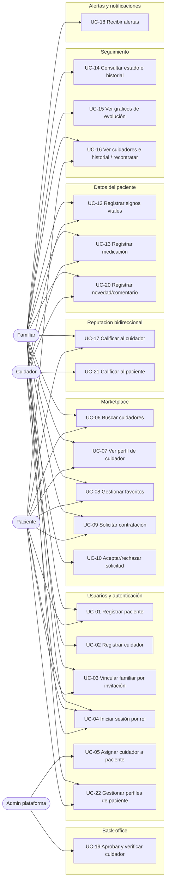

# Keru — Casos de Uso del MVP

> **Fuente:** `Keru-Scope-MVP.docx.pdf` (Alcance del MVP / Scope de Salida) + **decisiones de producto del 2026-07-09**: aprobación previa de cuidadores por el admin, carga de datos clínicos también por familiares, historial de cuidadores con recontratación, reseñas bidireccionales, alertas obligatorias con centro de notificaciones, vínculo familiar–paciente por **código de invitación**, el cuidador **acepta** las solicitudes, el **módulo de pagos queda pendiente de decisión** (fuera de los casos de uso por ahora), y una **cuenta puede administrar varios perfiles de paciente** (p. ej. madre y padre) con búsquedas y contrataciones por perfil.
> **Propósito:** documento de casos de uso listo para alimentar Spec Kit (`/specify`) o una herramienta de IA de diseño de arquitectura.
> Los supuestos de versiones anteriores (UC-03 y UC-10) ya fueron resueltos por decisiones de producto — no quedan supuestos abiertos.
> **Numeración:** UC-20, UC-21 y UC-22 fueron agregados por decisiones de producto posteriores al scope original y se ubican dentro de su módulo. **UC-11 queda reservado** para el módulo de pagos (pendiente de decisión).

---

## 1. Visión

Keru es un marketplace de cuidadores ("el Uber de los cuidadores") que conecta pacientes y sus familias con cuidadores profesionales. Permite buscarlos por zona, tipo de cuidado y reputación; contratarlos en línea; registrar las métricas de salud del paciente durante el servicio; y que la familia consulte la evolución desde cualquier lugar.

**Objetivo del MVP:** validar el circuito completo de extremo a extremo — buscar y contratar un cuidador, registrar las métricas del paciente y que la familia pueda ver su estado. *(El pago en línea está pendiente de decisión — ver Módulo C.)*

**Entregable:** aplicación **móvil y web** funcional.

---

## 2. Actores

| Actor | Descripción |
|---|---|
| **Paciente** | Persona que recibe el cuidado. Tiene una ficha con datos clínicos básicos. Una **cuenta** de este tipo puede administrar **varios perfiles de paciente** (p. ej. dar de alta a la madre y al padre) y buscar/contratar cuidadores para cada perfil, ver su historial de cuidadores y reseñar. |
| **Familiar** | Persona vinculada al paciente mediante **código de invitación**. Busca y contrata cuidadores, consulta el estado del paciente y **también carga datos clínicos** (métricas, medicación, novedades), igual que el cuidador. |
| **Cuidador** | Profesional que presta el servicio. Publica su perfil (especialidades, certificaciones, disponibilidad, tarifas), **acepta o rechaza solicitudes**, registra las métricas del paciente durante su turno y reseña al paciente al finalizar el servicio. Su cuenta debe ser aprobada por el administrador antes de ser visible en el marketplace. |
| **Administrador de plataforma** | Rol interno que **aprueba las cuentas nuevas de cuidadores** antes de que sean visibles en el marketplace, ejecuta la verificación manual de credenciales/identidad/antecedentes y otorga las insignias de verificación. |
| **Pasarela de pagos** (externo) | Solo si se incluye el módulo de pagos (pendiente de decisión). |

---

## 3. Mapa general de casos de uso



*(El módulo C — Pagos — no figura en el mapa porque está pendiente de decisión; ver su sección.)*

---

## 4. Casos de uso

### Módulo A — Creación y gestión de usuarios (scope §3.1)

---

#### UC-01 · Registrar paciente
- **Actor principal:** Familiar o Paciente
- **Referencia al scope:** §3.1
- **Descripción:** Dar de alta la ficha (perfil) del paciente con sus datos personales y clínicos básicos. Una misma cuenta puede dar de alta **varios perfiles de paciente** (UC-22) — p. ej. la madre y el padre.
- **Precondiciones:** Ninguna (o usuario autenticado si la ficha la crea una cuenta ya registrada).
- **Flujo principal:**
  1. El usuario ingresa los datos personales: nombre, edad, fecha de nacimiento y foto.
  2. Ingresa la condición principal a asistir.
  3. Ingresa grupo sanguíneo y alergias.
  4. Ingresa el contacto de emergencia.
  5. El sistema valida los datos y crea la ficha del paciente.
- **Flujos alternativos / excepciones:**
  - A1. Datos obligatorios faltantes o inválidos (p. ej. fecha de nacimiento futura): el sistema señala los campos y no persiste.
  - A2. La foto es opcional; la ficha puede crearse sin ella.
- **Postcondiciones:** Existe una ficha de paciente consultable y asociable a familiares y cuidadores. Quien crea la ficha queda vinculado al paciente.
- **Criterios de aceptación:**
  - [ ] La ficha guarda: nombre, edad, fecha de nacimiento, foto, condición principal, grupo sanguíneo, alergias y contacto de emergencia.
  - [ ] La edad puede derivarse de la fecha de nacimiento (evitar inconsistencia entre ambas).
  - [ ] La ficha queda disponible para los flujos de contratación (UC-09) y seguimiento (UC-14).
  - [ ] Una cuenta puede crear y administrar más de un perfil de paciente (UC-22).

---

#### UC-02 · Registrar cuidador
- **Actor principal:** Cuidador
- **Referencia al scope:** §3.1, §3.2 + decisión de producto (aprobación previa del admin)
- **Descripción:** Alta del perfil profesional del cuidador. La cuenta nueva queda **pendiente de verificación** y no es visible en el marketplace hasta que el administrador la apruebe (UC-19).
- **Precondiciones:** Ninguna.
- **Flujo principal:**
  1. El cuidador crea su cuenta e ingresa datos personales.
  2. Selecciona sus especialidades: cuidado de adultos mayores, post-quirúrgico, enfermedad crónica, discapacidad, paliativos, pediátrico, rehabilitación, acompañamiento.
  3. Carga sus estudios y certificaciones (título de enfermería, auxiliar, RCP, cuidado geriátrico, etc.), cada una con institución y año.
  4. Define su disponibilidad horaria.
  5. Define sus tarifas / planes.
  6. Define su zona de trabajo y modalidades que atiende (domicilio u hospital).
  7. El sistema crea el perfil en estado **pendiente de verificación** y lo encola para revisión del administrador (UC-19); el cuidador ve el estado de su solicitud.
- **Flujos alternativos / excepciones:**
  - A1. Certificaciones sin institución o año: el sistema exige completar ambos campos.
- **Postcondiciones:** Perfil creado en estado pendiente; recién al ser aprobado por el administrador (UC-19) aparece en los resultados de búsqueda (UC-06) y puede recibir solicitudes (UC-09).
- **Criterios de aceptación:**
  - [ ] El perfil registra especialidades, certificaciones (con institución y año), disponibilidad horaria, tarifas, zona y modalidad.
  - [ ] Una cuenta de cuidador nueva **no es visible en el marketplace** hasta ser verificada y aprobada por el administrador (UC-19).
  - [ ] El cuidador puede ver el estado de su cuenta (pendiente / aprobada / rechazada).
  - [ ] Las certificaciones nacen en estado "no verificada" hasta que el proceso interno las verifique (UC-19).

---

#### UC-03 · Vincular familiar a un paciente por código de invitación
- **Actor principal:** Familiar invitado
- **Actor secundario:** Paciente o familiar ya vinculado (quien invita)
- **Referencia al scope:** §2 (rol Familiar), §3.4 ("familiares vinculados al paciente") + decisión de producto (mecánica de invitación)
- **Descripción:** El vínculo familiar–paciente se establece mediante un **código/link de invitación** que se comparte por WhatsApp, mail u otro canal. Si el invitado no tiene la app, el link abre la **web de Keru** para confirmar el vínculo. Al confirmar, si no está registrado, se lo envía al registro para crear su usuario y el vínculo se completa al terminar.
- **Precondiciones:** Existe la ficha del paciente (UC-01).
- **Flujo principal:**
  1. El paciente o un familiar ya vinculado genera un código/link de invitación desde la ficha del paciente.
  2. Comparte el link por WhatsApp, mail u otro canal.
  3. El invitado abre el link: si tiene la app instalada se abre en la app; si no, el link lo lleva a la **web de Keru**.
  4. La pantalla muestra la invitación a vincularse con el paciente y pide confirmación.
  5. El invitado presiona "Sí, confirmo".
  6. Si ya está registrado, inicia sesión y el sistema establece el vínculo.
- **Flujos alternativos / excepciones:**
  - A1. **Invitado no registrado:** al confirmar, el sistema lo envía al registro para crear su usuario; al completarlo, el vínculo con el paciente se establece automáticamente (la invitación no se pierde durante el registro).
  - A2. Código/link inválido o vencido: el sistema lo informa y no crea el vínculo.
  - A3. El invitado no confirma (cierra o rechaza): no se crea ningún vínculo.
- **Postcondiciones:** El familiar queda vinculado al paciente: puede buscar/contratar cuidadores para él, consultar su estado y cargar datos clínicos.
- **Criterios de aceptación:**
  - [ ] El código/link de invitación es único y está asociado a un paciente concreto.
  - [ ] El link funciona como deep link: abre la app si está instalada y la web si no (misma confirmación en ambos casos).
  - [ ] Si el invitado no está registrado, tras crear su usuario el vínculo se establece sin pasos adicionales.
  - [ ] Un paciente puede tener uno o más familiares vinculados.
  - [ ] El familiar solo accede a datos de pacientes a los que está vinculado.
  - **A definir:** vigencia/expiración del código y si es de un solo uso o reutilizable.

---

#### UC-04 · Iniciar sesión y autenticación por rol
- **Actor principal:** Paciente, Familiar, Cuidador, Administrador
- **Referencia al scope:** §3.1
- **Descripción:** Autenticación básica; la sesión determina el rol y con él las capacidades y vistas disponibles.
- **Precondiciones:** Cuenta creada (UC-01/02/03).
- **Flujo principal:**
  1. El usuario ingresa sus credenciales.
  2. El sistema valida y crea la sesión con el rol correspondiente.
  3. El sistema muestra la interfaz propia del rol (marketplace y seguimiento para familiar/paciente; agenda y registro de métricas para cuidador; back-office para administrador).
- **Flujos alternativos / excepciones:**
  - A1. Credenciales inválidas: mensaje de error, sin sesión.
- **Postcondiciones:** Sesión activa con rol asignado.
- **Criterios de aceptación:**
  - [ ] Cada endpoint/pantalla valida el rol y el vínculo: un cuidador solo opera sobre pacientes que tiene asignados; un familiar solo sobre pacientes a los que está vinculado.
  - [ ] El familiar puede consultar y también **cargar** datos clínicos de sus pacientes vinculados (UC-12, UC-13, UC-20).

---

#### UC-05 · Asignar cuidador a paciente
- **Actor principal:** Sistema (vía automática) / Administrador (vía manual)
- **Referencia al scope:** §3.1
- **Descripción:** Vincular uno o más cuidadores a un paciente. La vía principal es **automática**: cuando el cuidador acepta una solicitud de contratación (UC-09 + UC-10) — iniciada por el paciente o un familiar — el sistema crea la asignación. Adicionalmente, un **administrador puede crear el vínculo en forma manual** (soporte / casos especiales).
- **Precondiciones:** Paciente y cuidador registrados (cuidador con cuenta aprobada).
- **Flujo principal:**
  1. El cuidador acepta la solicitud de contratación (o un administrador crea el vínculo manualmente).
  2. El sistema registra la asignación cuidador–paciente con su período de vigencia.
  3. Al finalizar el servicio, la asignación pasa a estado histórico (se conserva para UC-16).
- **Postcondiciones:** El cuidador ve al paciente en su lista y puede registrar datos (UC-12/13/20); el familiar y el paciente ven al cuidador asignado (UC-16).
- **Criterios de aceptación:**
  - [ ] Un paciente puede tener **uno o más** cuidadores asignados simultáneamente.
  - [ ] Solo un cuidador con asignación vigente puede registrar datos de ese paciente.
  - [ ] Las asignaciones finalizadas se conservan como historial (no se borran).

---

#### UC-22 · Gestionar perfiles de paciente de una cuenta *(agregado por decisión de producto)*
- **Actor principal:** Titular de la cuenta (paciente o familiar)
- **Referencia al scope:** no estaba en el scope original; decisión de producto
- **Descripción:** Una misma cuenta puede administrar **varios perfiles de paciente**. Ejemplo: una persona da de alta a su madre y a su padre como pacientes y contrata cuidadores para cada uno. Toda operación sobre un paciente (búsqueda, contratación, carga de datos, seguimiento, invitaciones) se hace **en el contexto de un perfil seleccionado**.
- **Precondiciones:** Cuenta registrada.
- **Flujo principal:**
  1. El titular ve la lista de sus perfiles de paciente.
  2. Agrega un nuevo perfil (UC-01), edita uno existente o lo selecciona como contexto activo.
  3. El sistema muestra un selector de perfil visible en las secciones por-paciente (búsqueda, contrataciones, seguimiento).
- **Flujos alternativos / excepciones:**
  - A1. El titular es también paciente: puede tener su propio perfil ("yo") junto a los de otras personas.
- **Postcondiciones:** Perfiles disponibles como contexto para el resto de los casos de uso.
- **Criterios de aceptación:**
  - [ ] Una cuenta puede tener 1..n perfiles de paciente.
  - [ ] Cada contratación, registro clínico, invitación y reseña queda asociado a **un perfil concreto**, nunca a la cuenta en general.
  - [ ] Cambiar de perfil cambia el contexto de búsqueda, contrataciones y seguimiento sin cerrar sesión.

---

### Módulo B — Marketplace de cuidadores (scope §3.2)

---

#### UC-06 · Buscar cuidadores con filtros
- **Actor principal:** Familiar o Paciente
- **Referencia al scope:** §3.2
- **Descripción:** Eje central de la plataforma: buscador de cuidadores con filtros combinables.
- **Precondiciones:** Usuario autenticado como familiar o paciente.
- **Flujo principal:**
  1. El usuario abre el buscador del marketplace y, si su cuenta administra varios perfiles de paciente (UC-22), indica para qué paciente busca — puede hacer **búsquedas separadas por paciente o una sola búsqueda para más de uno**.
  2. Aplica filtros:
     - **Zona / ubicación** del servicio y **modalidad** (domicilio u hospital).
     - **Tipo de enfermedad o cuidado**: adultos mayores, post-quirúrgico, enfermedad crónica, discapacidad, paliativos, pediátrico, rehabilitación, acompañamiento.
     - **Disponibilidad horaria** y **rango de tarifa**.
  3. El sistema devuelve la lista de cuidadores que cumplen los filtros, mostrando por cada uno: nombre, foto, especialidades, calificación promedio, cantidad de reseñas, insignias de verificación y tarifa.
  4. El usuario abre un perfil (UC-07), lo guarda en favoritos (UC-08) o inicia una contratación (UC-09).
- **Flujos alternativos / excepciones:**
  - A1. Sin resultados: el sistema lo indica y sugiere relajar filtros.
- **Postcondiciones:** Ninguna (consulta).
- **Criterios de aceptación:**
  - [ ] Solo aparecen cuidadores con **cuenta aprobada** por el administrador (UC-19).
  - [ ] Los filtros son combinables (zona + tipo de cuidado + disponibilidad + tarifa + modalidad).
  - [ ] La reputación (calificación y reseñas) y las insignias de verificación son visibles ya desde el listado, porque son criterio de elección.
  - [ ] La búsqueda opera en el contexto de uno o más perfiles de paciente (UC-22); al contratar para varios pacientes se genera una solicitud por paciente (UC-09).

---

#### UC-07 · Ver perfil de cuidador
- **Actor principal:** Familiar o Paciente
- **Referencia al scope:** §3.2
- **Descripción:** Perfil completo del cuidador con toda la información necesaria para decidir la contratación.
- **Precondiciones:** Cuidador con cuenta aprobada y publicada en el marketplace.
- **Flujo principal:**
  1. El usuario abre el perfil desde el buscador, desde favoritos o desde el historial de cuidadores del paciente (UC-16).
  2. El sistema muestra:
     - Estudios y **certificaciones** con institución y año.
     - **Insignias de verificación**: certificaciones verificadas por la plataforma, identidad validada y antecedentes — distintos niveles de verificación.
     - **Reseñas y calificación** de otros pacientes/familias.
     - Especialidades, experiencia, disponibilidad y tarifas.
- **Postcondiciones:** Ninguna (consulta).
- **Criterios de aceptación:**
  - [ ] Se distingue visualmente qué certificaciones están verificadas por la plataforma y cuáles no.
  - [ ] Los niveles de verificación (certificaciones / identidad / antecedentes) se muestran como insignias diferenciadas.
  - [ ] Las reseñas muestran calificación y comentario de servicios reales (creadas vía UC-17).

---

#### UC-08 · Gestionar favoritos
- **Actor principal:** Familiar o Paciente
- **Referencia al scope:** §3.2
- **Descripción:** Guardar cuidadores de interés para comparar y decidir más tarde.
- **Precondiciones:** Usuario autenticado.
- **Flujo principal:**
  1. El usuario marca un cuidador como favorito desde el listado o el perfil.
  2. El sistema lo agrega a su lista de favoritos.
  3. El usuario consulta su lista de favoritos y desde ella abre perfiles o inicia contrataciones.
  4. El usuario puede quitar un cuidador de favoritos.
- **Postcondiciones:** Lista de favoritos persistida por usuario.
- **Criterios de aceptación:**
  - [ ] Los favoritos persisten entre sesiones y dispositivos (móvil y web).
  - [ ] Marcar/desmarcar es idempotente y visible de inmediato.

---

#### UC-09 · Crear solicitud de contratación (booking)
- **Actor principal:** Familiar o Paciente
- **Referencia al scope:** §3.2
- **Descripción:** Solicitar la contratación de un cuidador para un paciente (primera vez o **recontratación** desde el historial, UC-16). Si la cuenta administra varios perfiles (UC-22), la solicitud indica para **qué paciente** es; para contratar al mismo cuidador para dos pacientes se genera **una solicitud por paciente**.
- **Precondiciones:** Ficha de paciente existente (UC-01); cuidador elegido.
- **Flujo principal:**
  1. El usuario inicia la solicitud desde el perfil del cuidador.
  2. Completa: **datos del paciente** (selección del perfil, UC-22), **modalidad** (domicilio u hospital), **fechas**, **requerimientos especiales** y **datos de contacto**.
  3. El sistema registra la solicitud y la deja visible para el cuidador.
- **Flujos alternativos / excepciones:**
  - A1. Fechas fuera de la disponibilidad publicada del cuidador: el sistema lo advierte.
- **Postcondiciones:** Solicitud creada en estado inicial (pendiente), asociada a paciente, solicitante y cuidador.
- **Criterios de aceptación:**
  - [ ] La solicitud captura: paciente, modalidad, fechas, requerimientos especiales y datos de contacto.
  - [ ] Cada solicitud pertenece a **un único paciente**; contratar para varios pacientes genera solicitudes separadas, y el cuidador acepta o rechaza cada una por separado (UC-10).
  - [ ] La solicitud tiene un ciclo de vida con estados: **pendiente → aceptada / rechazada → en curso → finalizada**, que habilita los flujos posteriores de asignación, métricas y reseñas. *(Si se incluye el módulo de pagos, se insertará un estado "pagada" entre la aceptación y el inicio del servicio.)*

---

#### UC-10 · Aceptar o rechazar solicitud de contratación
- **Actor principal:** Cuidador
- **Referencia al scope:** implícito en §3.2 (booking); **confirmado por decisión de producto**: el cuidador debe aceptar la solicitud
- **Descripción:** El cuidador recibe la solicitud, evalúa el detalle (incluida la reputación del paciente) y la acepta o rechaza. La aceptación activa el servicio.
- **Precondiciones:** Solicitud pendiente (UC-09).
- **Flujo principal:**
  1. El cuidador ve el detalle de la solicitud (paciente, modalidad, fechas, requerimientos) junto con la **reputación del paciente** (reseñas de otros cuidadores, UC-21).
  2. Acepta la solicitud.
  3. El sistema notifica al solicitante y crea la asignación cuidador–paciente (UC-05) para el período contratado.
- **Flujos alternativos / excepciones:**
  - A1. El cuidador rechaza: la solicitud queda rechazada y se notifica al solicitante.
- **Postcondiciones:** Solicitud aceptada (asignación creada) o rechazada.
- **Criterios de aceptación:**
  - [ ] El solicitante ve el estado actualizado de su solicitud (y recibe la notificación del cambio).
  - [ ] Solo las solicitudes aceptadas generan asignación y habilitan el registro de datos del paciente.
  - [ ] *(Si se incluye pagos, el pago se insertará entre la aceptación y la activación de la asignación.)*

---

### Módulo C — Pagos por la plataforma (⏸ pendiente de decisión)

> **Decisión de producto (2026-07-09):** aún no está definido si el pago en línea entra o sale del MVP. Se retira de los casos de uso y **queda abierto para una posible implementación futura**. El número **UC-11 queda reservado** para este módulo.
>
> Si se decide incluirlo, el caso de uso a reincorporar es: abono en línea asociado a la contratación aceptada, selección de tarifa según el plan del cuidador, procesamiento vía pasarela de pagos externa, comprobante/confirmación de pago, e idempotencia ante reintentos (sin dobles cobros). En el flujo, el pago se insertaría **entre la aceptación de la solicitud (UC-10) y la activación de la asignación (UC-05)**, agregando el estado "pagada" al ciclo de vida de la contratación.
>
> Mientras tanto, la aceptación del cuidador (UC-10) activa directamente la asignación (UC-05).

---

### Módulo D — Registro de datos del paciente (scope §3.3 — cargan cuidador y familiar)

> **Decisión de producto:** el familiar vinculado puede cargar datos igual que el cuidador (métricas, medicación, novedades). Toda carga queda trazada con su autor y rol.

---

#### UC-12 · Registrar signos vitales
- **Actor principal:** Cuidador o Familiar vinculado
- **Referencia al scope:** §3.3 + decisión de producto (el familiar también carga datos)
- **Descripción:** El cuidador durante su turno — o un familiar vinculado — registra los signos vitales del paciente.
- **Precondiciones:** Cuidador con asignación vigente al paciente (UC-05), o familiar vinculado al paciente (UC-03).
- **Flujo principal:**
  1. El usuario (cuidador o familiar) abre la ficha del paciente.
  2. Carga una medición con uno o más de estos valores:
     - Presión arterial (**sistólica/diastólica**)
     - Frecuencia cardíaca
     - Temperatura
     - Saturación de oxígeno
     - Glucemia
  3. El sistema guarda el registro **fechado (fecha y hora) y asociado al usuario que lo cargó** (cuidador o familiar).
- **Flujos alternativos / excepciones:**
  - A1. Valores fuera de rango fisiológico plausible (error de tipeo): el sistema advierte antes de guardar.
  - A2. Valor fuera del rango configurado: se dispara la alerta a los familiares (UC-18).
- **Postcondiciones:** Registro disponible de inmediato en el historial y los gráficos del paciente (UC-14/15).
- **Criterios de aceptación:**
  - [ ] Cada registro persiste: valores, fecha/hora y **autor con su rol** (trazabilidad).
  - [ ] Solo pueden registrar: cuidadores con asignación vigente y familiares vinculados al paciente.
  - [ ] Los registros no se editan silenciosamente: cualquier corrección conserva la trazabilidad.

---

#### UC-13 · Registrar medicación administrada
- **Actor principal:** Cuidador o Familiar vinculado
- **Referencia al scope:** §3.3 + decisión de producto (el familiar también carga datos)
- **Descripción:** Registrar cada administración de medicación al paciente, tanto durante el turno del cuidador como por un familiar.
- **Precondiciones:** Cuidador con asignación vigente, o familiar vinculado al paciente.
- **Flujo principal:**
  1. El usuario (cuidador o familiar) abre la ficha del paciente.
  2. Registra: **medicamento, dosis, horario y observaciones**.
  3. El sistema guarda el registro fechado y asociado al usuario que lo cargó.
- **Postcondiciones:** Registro visible en el historial del paciente (UC-14).
- **Criterios de aceptación:**
  - [ ] Cada registro persiste: medicamento, dosis, horario, observaciones, fecha/hora y autor con su rol.
  - [ ] Mismas reglas de trazabilidad y permisos que UC-12.

---

#### UC-20 · Registrar novedad / comentario del paciente *(agregado por decisión de producto)*
- **Actor principal:** Cuidador o Familiar vinculado
- **Referencia al scope:** §3.7 ("el cuidador registra una novedad") + decisión de producto
- **Descripción:** Registrar observaciones libres sobre el paciente (estado de ánimo, comidas, episodios, indicaciones), complementarias a los signos vitales y la medicación.
- **Precondiciones:** Cuidador con asignación vigente, o familiar vinculado al paciente.
- **Flujo principal:**
  1. El usuario abre la ficha del paciente.
  2. Escribe la novedad/comentario.
  3. El sistema la guarda fechada y asociada al autor, y la integra al historial cronológico (UC-14).
- **Postcondiciones:** Novedad visible en el historial; dispara una alerta a los familiares (UC-18).
- **Criterios de aceptación:**
  - [ ] La novedad persiste: texto, fecha/hora y autor con su rol.
  - [ ] Aparece intercalada cronológicamente con signos vitales y medicación en el historial.

---

### Módulo E — Visualización del estado del paciente (scope §3.4)

---

#### UC-14 · Consultar estado e historial del paciente
- **Actor principal:** Familiar
- **Referencia al scope:** §3.4 — **modificado por decisión de producto**: el familiar no es de solo lectura; también carga datos (UC-12/13/20)
- **Descripción:** Vista del estado del paciente con el historial de signos vitales, medicación y novedades, accesible desde cualquier lugar.
- **Precondiciones:** Familiar vinculado al paciente (UC-03).
- **Flujo principal:**
  1. El familiar abre la vista del paciente.
  2. El sistema muestra el estado actual (últimas mediciones) y el historial cronológico de signos vitales, medicación y novedades, cada registro con fecha/hora y autor (cuidador o familiar).
- **Flujos alternativos / excepciones:**
  - A1. Usuario no vinculado al paciente: acceso denegado.
- **Postcondiciones:** Ninguna (consulta).
- **Criterios de aceptación:**
  - [ ] Desde esta vista el familiar también puede iniciar la carga de datos (UC-12, UC-13, UC-20).
  - [ ] Un registro cargado por el cuidador o por otro familiar aparece en la vista sin demoras perceptibles (seguimiento "en tiempo real" según §1).
  - [ ] Funciona igual en móvil y web.

---

#### UC-15 · Ver gráficos de evolución
- **Actor principal:** Familiar
- **Referencia al scope:** §3.4
- **Descripción:** Gráficos de evolución de las métricas del paciente en el tiempo.
- **Precondiciones:** Familiar vinculado; existen registros de métricas.
- **Flujo principal:**
  1. El familiar abre la sección de evolución.
  2. El sistema grafica cada métrica (presión sistólica/diastólica, frecuencia cardíaca, temperatura, saturación, glucemia) a lo largo del tiempo.
  3. El familiar ajusta el período visualizado.
- **Postcondiciones:** Ninguna (consulta).
- **Criterios de aceptación:**
  - [ ] Cada métrica es graficable en el tiempo; la presión muestra sistólica y diastólica.
  - [ ] Con pocos o ningún dato, la vista lo comunica claramente (estado vacío).

---

#### UC-16 · Ver cuidadores del paciente (actuales e históricos) y recontratar
- **Actor principal:** Familiar o Paciente
- **Referencia al scope:** §3.4 + decisión de producto (historial de cuidadores y recontratación)
- **Descripción:** Ver los cuidadores actualmente asignados al paciente y también el **historial de todos los cuidadores que lo atendieron**, con acceso a sus perfiles actuales para poder **recontratarlos**.
- **Precondiciones:** Familiar vinculado o el propio paciente; existe al menos una asignación (vigente o histórica).
- **Flujo principal:**
  1. El usuario abre la vista del paciente.
  2. El sistema muestra los cuidadores con asignación vigente y, separado, el **historial de cuidadores anteriores** con el período en que atendieron al paciente.
  3. Desde cualquiera de ellos, el usuario accede al perfil actual del cuidador (UC-07).
  4. Desde el perfil puede iniciar una nueva contratación (UC-09) para recontratarlo.
- **Flujos alternativos / excepciones:**
  - A1. Un cuidador histórico ya no está activo en la plataforma: se muestra en el historial pero sin opción de recontratar.
- **Postcondiciones:** Ninguna (consulta); puede derivar en una recontratación (UC-09).
- **Criterios de aceptación:**
  - [ ] Se muestran todos los cuidadores con asignación vigente y todos los históricos, con sus períodos de servicio.
  - [ ] Desde el historial se accede al **perfil actual** del cuidador y se puede iniciar una recontratación (UC-09).
  - [ ] El paciente y el familiar tienen acceso a esta vista.

---

### Módulo F — Reseñas y reputación bidireccional (scope §3.6 + decisión de producto)

---

#### UC-17 · Calificar y reseñar al cuidador
- **Actor principal:** Familiar o Paciente
- **Referencia al scope:** §3.6
- **Descripción:** Tras el servicio, el familiar/paciente califica al cuidador; las reseñas alimentan la reputación visible en el marketplace.
- **Precondiciones:** Servicio contratado y finalizado con ese cuidador.
- **Flujo principal:**
  1. El usuario abre la contratación finalizada.
  2. Ingresa una calificación (puntaje) y una reseña (comentario).
  3. El sistema guarda la reseña asociada al servicio y recalcula la reputación del cuidador (promedio y cantidad).
  4. La reseña queda visible en el perfil (UC-07) y la reputación en el listado (UC-06).
- **Flujos alternativos / excepciones:**
  - A1. Intento de reseñar sin servicio finalizado con ese cuidador: no permitido (evita reseñas falsas).
  - A2. Intento de segunda reseña sobre el mismo servicio: no permitido (o edita la existente — **a definir**).
- **Postcondiciones:** Reputación del cuidador actualizada.
- **Criterios de aceptación:**
  - [ ] Solo usuarios con servicio finalizado pueden reseñar a ese cuidador.
  - [ ] La calificación promedio y la cantidad de reseñas se actualizan al publicar.

---

#### UC-21 · Calificar y reseñar al paciente *(agregado por decisión de producto — reseña bidireccional)*
- **Actor principal:** Cuidador
- **Referencia al scope:** no estaba en el scope original; decisión de producto
- **Descripción:** Tras finalizar el servicio, el cuidador califica y reseña al paciente/familia, igual que ellos lo califican a él. La reputación del paciente es información útil para el cuidador al evaluar futuras solicitudes.
- **Precondiciones:** Servicio finalizado con ese paciente.
- **Flujo principal:**
  1. El cuidador abre la contratación finalizada.
  2. Ingresa calificación y reseña del paciente/familia.
  3. El sistema guarda la reseña y recalcula la reputación del paciente.
  4. La reputación del paciente se muestra al cuidador en el detalle de nuevas solicitudes (UC-10).
- **Flujos alternativos / excepciones:**
  - A1. Mismas restricciones que UC-17: solo con servicio finalizado, una reseña por servicio.
- **Postcondiciones:** Reputación del paciente actualizada.
- **Criterios de aceptación:**
  - [ ] Solo cuidadores con servicio finalizado con ese paciente pueden reseñarlo.
  - [ ] La reputación del paciente es visible para el cuidador en el detalle de la solicitud (UC-10).
  - [ ] Cada parte reseña a la otra en forma independiente (una reseña no requiere la otra).

---

### Módulo G — Alertas y notificaciones (scope §3.7 — **obligatorio** por decisión de producto)

---

#### UC-18 · Recibir alertas y notificaciones del paciente
- **Actor principal:** Familiar (receptor); disparado por registros del Cuidador o de otro Familiar
- **Referencia al scope:** §3.7, elevado de opcional a **obligatorio** por decisión de producto
- **Descripción:** Aviso al familiar cuando un signo vital queda fuera de rango o cuando se registra una novedad. Al instalar/abrir la app por primera vez, Keru pide permiso para enviar notificaciones push; si el usuario acepta, recibe push; si no, las alertas quedan disponibles en un **centro de notificaciones dentro de la app (campana)**. La campana existe siempre; el push es adicional.
- **Precondiciones:** Familiar vinculado; rangos de referencia definidos por métrica.
- **Flujo principal:**
  1. En el primer inicio, la app solicita permiso para enviar notificaciones (flujo nativo de iOS/Android; permiso del navegador en web).
  2. El cuidador o un familiar registra un signo vital (UC-12) o una novedad (UC-20).
  3. El sistema evalúa el valor contra el rango configurado (o detecta la novedad).
  4. El sistema genera la alerta y la deposita **siempre** en el centro de notificaciones (campana) de cada familiar vinculado, con contador de no leídas.
  5. Si el familiar aceptó el permiso, además recibe la notificación push.
  6. El familiar abre la notificación (push o campana) y aterriza en la vista del paciente (UC-14).
- **Flujos alternativos / excepciones:**
  - A1. Permiso de push rechazado: las alertas se ven solo en la campana; el usuario puede activar el permiso más tarde desde los ajustes de la app.
- **Puntos a definir:** quién configura los rangos por métrica y sus valores por defecto.
- **Postcondiciones:** Alerta persistida en el centro de notificaciones con estado leída/no leída.
- **Criterios de aceptación:**
  - [ ] La alerta identifica paciente, métrica, valor registrado y hora (o el texto de la novedad).
  - [ ] Se notifica a todos los familiares vinculados al paciente.
  - [ ] Toda alerta queda en el centro de notificaciones aunque el push esté deshabilitado; el push es adicional, nunca el único registro.
  - [ ] La campana muestra el contador de notificaciones no leídas.

---

### Módulo H — Back-office: aprobación y verificación de cuidadores

---

#### UC-19 · Aprobar cuenta de cuidador, verificar credenciales y otorgar insignias
- **Actor principal:** Administrador de plataforma
- **Referencia al scope:** §3.2 (insignias de verificación) y §4 ("en el MVP la verificación es un proceso interno/manual"); la **aprobación previa de cuentas nuevas** es decisión de producto
- **Descripción:** Proceso interno/manual con dos resultados: (1) **aprobar la cuenta nueva del cuidador**, requisito para que sea visible en el marketplace; (2) verificar certificaciones, identidad y antecedentes, otorgando las insignias correspondientes.
- **Precondiciones:** Cuidador registrado con perfil en estado pendiente (UC-02).
- **Flujo principal:**
  1. El administrador ve la cola de cuidadores pendientes de aprobación.
  2. Revisa la documentación del cuidador (certificaciones, identidad, antecedentes).
  3. **Aprueba la cuenta**: el perfil pasa a publicado y visible en el marketplace (UC-06).
  4. Marca cada nivel de verificación como verificado o rechazado: **certificaciones verificadas**, **identidad validada**, **antecedentes**.
  5. El sistema actualiza las insignias del perfil, visibles en listado y perfil (UC-06/07).
- **Flujos alternativos / excepciones:**
  - A1. El administrador rechaza la cuenta: el perfil no se publica y se informa el motivo al cuidador.
- **Postcondiciones:** Cuenta aprobada (o rechazada) e insignias actualizadas.
- **Criterios de aceptación:**
  - [ ] **Ningún cuidador aparece en el marketplace sin aprobación previa del administrador.**
  - [ ] Los tres niveles de verificación son independientes entre sí.
  - [ ] El cambio de insignias se refleja de inmediato en el marketplace.
  - [ ] Queda registro de quién aprobó/verificó y cuándo (trazabilidad interna).

---

## 5. Modelo de dominio (entidades principales)

| Entidad | Atributos clave | Relaciones |
|---|---|---|
| **Usuario (Cuenta)** | credenciales, rol (paciente / familiar / cuidador / admin) | 1..n Perfiles de Paciente administrados (UC-22, para cuentas paciente/familiar) |
| **Paciente (perfil)** | nombre, edad, fecha de nacimiento, foto, condición principal, grupo sanguíneo, alergias, contacto de emergencia, reputación (reseñas de cuidadores) | pertenece a una Cuenta titular; 1..n Familiares; 0..n Asignaciones (vigentes e históricas); 0..n Reseñas recibidas |
| **Familiar** | datos personales | n..n Pacientes (vínculo con permiso de lectura y carga, creado por invitación) |
| **InvitaciónFamiliar** | código/link único, paciente, emisor, estado (pendiente / aceptada / vencida), fecha | Paciente → Familiar invitado |
| **Cuidador** | **estado de cuenta (pendiente / aprobada / rechazada)**, especialidades, experiencia, disponibilidad horaria, tarifas/planes, zona, modalidades | 1..n Certificaciones; 0..n Insignias; 0..n Reseñas recibidas |
| **Certificación** | tipo (enfermería, auxiliar, RCP, geriátrico…), institución, año, estado de verificación | pertenece a Cuidador |
| **InsigniaVerificación** | nivel: certificaciones verificadas / identidad validada / antecedentes | pertenece a Cuidador |
| **Favorito** | — | Usuario ↔ Cuidador |
| **Contratación (Booking)** | paciente, solicitante, cuidador, modalidad (domicilio/hospital), fechas, requerimientos especiales, datos de contacto, estado (pendiente / aceptada / rechazada / en curso / finalizada) | 0..2 Reseñas (una de cada parte); 0..1 Pago *(solo si se incluye el módulo de pagos)* |
| **Pago** *(pendiente de decisión)* | monto, tarifa/plan elegido, estado, comprobante, fecha | pertenece a Contratación — solo si se incluye el módulo de pagos |
| **RegistroSignosVitales** | PA sistólica, PA diastólica, frecuencia cardíaca, temperatura, saturación O₂, glucemia, fecha/hora, autor (cuidador o familiar) | pertenece a Paciente |
| **RegistroMedicación** | medicamento, dosis, horario, observaciones, fecha/hora, autor (cuidador o familiar) | pertenece a Paciente |
| **Novedad/Comentario** | texto, fecha/hora, autor (cuidador o familiar) | pertenece a Paciente |
| **Reseña** | calificación, comentario, autor, destinatario (cuidador o paciente), fecha | pertenece a Contratación; **bidireccional** |
| **Alerta / Notificación** | tipo (signo fuera de rango / novedad), métrica, valor, fecha/hora, destinatarios, estado leída/no leída | Paciente → Familiares; vive en el centro de notificaciones (campana) |
| **Asignación** | cuidador, paciente, período (inicio/fin), vigente o histórica | Cuidador ↔ Paciente; conserva el historial para UC-16 |

---

## 6. Requisitos no funcionales derivados

| Requisito | Origen |
|---|---|
| Aplicación **móvil y web** | §6 Entregable |
| Seguimiento del estado del paciente "**en tiempo real**" (los registros se ven sin demora perceptible) | §1 |
| **Trazabilidad** de todo registro clínico: fecha/hora + autor con su rol | §3.3 + decisión de producto |
| **Control de acceso por rol y por vínculo**: cuidador solo sobre pacientes asignados; familiar solo sobre pacientes vinculados (lectura y carga de datos) | §3.1, §3.4 + decisión de producto |
| Notificaciones **push** (iOS / Android / web) + **centro de notificaciones in-app (campana)** con estado leída/no leída | UC-18 (decisión de producto) |
| **Deep links** de invitación: el mismo link abre la app si está instalada o la web si no (UC-03) | decisión de producto |
| Datos de salud sensibles → privacidad y protección de datos (cifrado en tránsito y reposo, mínimos privilegios) | derivado de la naturaleza del dominio |
| Pagos: integridad ante reintentos (sin dobles cobros), comprobante persistente | §3.5 — *solo si se incluye el módulo de pagos* |

---

## 7. Fuera del alcance del MVP (guardarraíles para el diseño)

No incluir en la especificación ni en la arquitectura del MVP:

- Mensajería en tiempo real (chat) entre familiar y cuidador.
- Integración con dispositivos médicos / wearables.
- Facturación electrónica y reportes fiscales.
- Verificación automatizada de antecedentes con organismos externos (la verificación es interna/manual → UC-19).

**Pendiente de decisión (ni incluido ni excluido — no diseñar todavía, pero no bloquear su incorporación futura):**

- Pagos por la plataforma (Módulo C, UC-11 reservado): abono en línea, tarifa según plan, pasarela externa, comprobante.

---

## 8. Cómo usar este documento con Spec Kit

1. **`/constitution`** — fijar principios: app móvil + web, control de acceso por rol y vínculo, trazabilidad clínica, aprobación previa de cuidadores, y pegar la sección 7 como restricciones de alcance (incluido el estado "pendiente de decisión" de pagos).
2. **`/specify`** — una spec por módulo (recomendado), pegando los casos de uso del módulo. Ejemplo:

   ```
   /specify Marketplace de cuidadores de Keru: búsqueda con filtros por zona,
   modalidad (domicilio/hospital), tipo de cuidado, disponibilidad y rango de
   tarifa; solo cuidadores aprobados por el admin son visibles; perfil del
   cuidador con certificaciones, insignias de verificación y reseñas;
   favoritos; solicitud de contratación con ciclo de estados y aceptación
   por parte del cuidador. [pegar aquí UC-06 a UC-10 completos]
   ```

3. **`/plan`** — indicar el stack elegido y las integraciones (push notifications, deep links; pasarela de pagos solo si se decide incluir el módulo).
4. **`/tasks` → `/implement`** — generar y ejecutar las tareas.

**Orden sugerido de módulos** (respeta las dependencias del circuito E2E que el MVP quiere validar):
A (usuarios e invitaciones) → H (aprobación de cuidadores — necesaria antes de que el marketplace muestre resultados) → B (marketplace con aceptación de solicitudes) → D (datos del paciente) → E (seguimiento) → F (reseñas bidireccionales) → G (alertas y notificaciones).
*C (pagos) queda fuera de la secuencia hasta que se decida; si entra, se ubica inmediatamente después de B.*

Para una herramienta de IA de arquitectura: pegar el documento completo — las secciones 5 (dominio), 6 (NFR) y 7 (fuera de alcance / pendiente) son las que más condicionan el diseño.
