# Developer FLOW -- gate tracker

Live state showing **where we are** implementing a landed architecture release through
spec-kit under governance, **what is approved**, and **what is blocked**. This is a
**template** copied per project (into the consumer repo's `docs/developer/`) and updated as
each gate is produced and approved.

This file tracks the **gate-approval state** of the Developer chain (D1..D5) so an
orchestrator (ADDL) can render and drive it. The spec-kit artifacts' own CONTENT
(`specs/NNN-<slug>/spec.md|plan.md|tasks.md` + code) is the workflow's source of truth and
is read live via `scripts/fragment-checks/gate_driver.py` -- it is NEVER copied into this
file. The two are complementary: this table is the **operator's review gate**; `gate_driver`
is the **deterministic router**.

## Current session

Fill this block when starting the Developer for a landed release and update it as each gate
is approved.

```
Project: <landed release pin / consumer name>
Iteration: <N>
Current step: <gate ID>
Last update: <YYYY-MM-DD HH:MM>
Open blockers: <none | description>
```

### Gate tracker (the operative checklist)

This compact table is the **authoritative gate state** -- the thing the orchestrator parses
and the operator approves against. Mark a gate `[x] approved` ONLY after the operator
explicitly signs off on that gate. A gate must NOT be produced until its prior gate is
`[x] approved` here (see root `SKILL.md` §Orchestration).

| Gate | Fragment | State | Approved on |
|---|---|---|---|
| D1 | intake.md | `[ ]` | -- |
| D2 | specs/NNN-<slug>/spec.md | `[ ]` | -- |
| D3 | specs/NNN-<slug>/plan.md | `[ ]` | -- |
| D4 | specs/NNN-<slug>/tasks.md | `[ ]` | -- |
| D5 | code + tests (consumer repo) | `[ ]` | -- |

States: `[ ]` pending | `[~]` in progress | `[?]` awaiting review | `[x]` approved | `[!]` blocked | `[i]` iterating. The Mermaid diagram below is the visual companion; if the two ever disagree, this table wins.

**D1 is once per landed release; D2..D5 repeat once per feature (`UC-NNN`).** D1 establishes
the constitution (`/speckit-constitution`, CHK-01, Q1-Q6 wired, **APPROVED**) and selects
the target UC. When a feature's D2..D5 complete, control returns to D1's UC-selection
interaction point and D2..D5 re-run for the next UC (the fragment cells carry the
`NNN-<slug>` placeholder until a UC is selected).

**Disk is the source of truth.** A gate marked `[?]` / `[x]` / `[i]` whose named artifact is
absent on disk is degraded to `[ ]` by the orchestrator. D1's `intake.md` is a simple file;
D2..D5 resolve their `specs/NNN-<slug>/` artifacts from the selected feature.

**The handoff in is not a gate.** The landed `architecture/arch-X.Y.Z/` +
`.specify/memory/constitution.md` that the SAD's S8b step wrote are **binding input**: the
Developer reads them and NEVER edits them.

**Integration out is not a gate.** Approving D5 does NOT integrate. After D5 `[x]` the
feature lives on its `NNN-<slug>` branch until the **operator explicitly authorizes**
Integrate -- a PR via the remote, or a local `--no-ff` merge into the base (mirror of the
SAD S8b land: never auto). Integration is a git act the orchestrator performs, not a
D-gate: it adds **no row** to this table, clears the active feature, and returns control to
D1's UC-selection for the next `UC-NNN`. See root `SKILL.md` -- the Consumer-repo git
lifecycle section.

## State legend

| State | Label mark | Meaning |
|---|---|---|
| Pending | `[ ]` | Not started; waiting on dependencies or turn |
| In Progress | `[~]` | Gate producing now (spec-kit invoked) |
| Awaiting Review | `[?]` | Artifact produced; awaiting operator approval |
| Approved | `[x]` | Artifact validated and approved |
| Blocked | `[!]` | Blocked by error, decision pending, or missing input |
| Iterating | `[i]` | Operator requested changes; gate re-running |

## State diagram (template)

```mermaid
flowchart TD
    F0["[ ] Foundation<br/>architecture/arch-X.Y.Z/ landed + .specify/memory/constitution.md present<br/>OUT: docs/developer/FLOW.md tracker initialized"]:::pending

    D1["[ ] D1 - intake<br/>IN: landed release (binding)<br/>OUT: docs/developer/intake.md<br/>(constitution completed + APPROVED, Q1-Q6 wired, release pinned, UC selected)"]:::pending
    D2["[ ] D2 - specify<br/>IN: D1 approved + target UC-NNN<br/>OUT: specs/NNN-slug/spec.md (/speckit-specify)"]:::pending
    D3["[ ] D3 - plan<br/>IN: D2 approved<br/>OUT: specs/NNN-slug/plan.md + Constitution Check Q1-Q6 (/speckit-plan)"]:::pending
    D4["[ ] D4 - tasks<br/>IN: D3 approved (Q1-Q6 all yes)<br/>OUT: specs/NNN-slug/tasks.md (TDD-first, /speckit-tasks)"]:::pending
    D5["[ ] D5 - implement<br/>IN: D4 approved<br/>OUT: code + tests (/speckit-analyze then /speckit-implement)"]:::pending

    G1{"[ ] Gate D1<br/>Constitution APPROVED + UC selected?"}:::pending
    G2{"[ ] Gate D2<br/>Spec approved? (arch context verbatim)"}:::pending
    G3{"[ ] Gate D3<br/>Plan approved? (Q1-Q6 pass)"}:::pending
    G4{"[ ] Gate D4<br/>Tasks approved? (TDD-first)"}:::pending
    G5{"[ ] Gate D5<br/>Implemented? (tests green + conformance)"}:::pending

    AUD["[ ] developer-auditor (cross-cutting)<br/>by-gate | end-to-end | diff<br/>OUT: audit-iter-N.md / audit-drift-&lt;ref&gt;.md"]:::pending

    F0 --> D1
    D1 --> G1
    G1 -->|No: iterate| D1
    G1 -->|Yes: select UC| D2
    D2 --> G2
    G2 -->|No: iterate| D2
    G2 -->|Yes| D3
    D3 --> G3
    G3 -->|No / Q1-Q6 fail: back-channel| D3
    G3 -->|Yes| D4
    D4 --> G4
    G4 -->|No: iterate| D4
    G4 -->|Yes| D5
    D5 --> G5
    G5 -->|No: iterate| D5
    G5 -->|Yes| DONE["[ ] Feature implemented (D5 approved; on NNN-slug branch)"]:::pending
    DONE --> INT{"Integrate (operator-authorized, NOT a gate)<br/>PR via remote, or local --no-ff merge into base"}:::pending
    INT -.authorized.-> NEXT["base advanced; active feature cleared"]:::pending
    NEXT -.next UC.-> D2

    AUD -.audits any gate.-> D1
    AUD -.audits any gate.-> D3

    classDef pending fill:#f1f3f5,stroke:#868e96,color:#212529,stroke-width:1px
    classDef in_progress fill:#fff3bf,stroke:#f59f00,color:#212529,stroke-width:3px
    classDef awaiting_review fill:#d0ebff,stroke:#1971c2,color:#212529,stroke-width:2px
    classDef approved fill:#b2f2bb,stroke:#2b8a3e,color:#212529,stroke-width:1px
    classDef blocked fill:#ffc9c9,stroke:#c92a2a,color:#212529,stroke-width:2px
    classDef iterating fill:#ffd8a8,stroke:#e8590c,color:#212529,stroke-width:2px
```



## How to update state

When a gate starts: change to `[~]` + `:::in_progress` and update the "Current session"
block. When the artifact is produced: change to `[?]` + `:::awaiting_review`. When the
operator approves: change to `[x]` + `:::approved`, stamp the date, advance "Current
session" to the next gate. If the operator requests changes: change to `[i]` +
`:::iterating` and re-run with the feedback; when the new artifact lands, go back to `[?]`.

**Reopen rule (general).** Reopening any gate `Dn` marks every downstream gate back to
`[ ]` pending (stale, not deleted) AND moves the cursor back to `Dn`. The single
in-workflow reopen trigger is **constitution drift** (a constitution change can invalidate
already-generated spec/plan/tasks/code); adding a UC/ADR is a Phase-A activity, never an
in-workflow reopen. Prior iterations are preserved as `Dn.iter-N.md` for the auditor and
drift comparison.

## Cross-references

| Document | When to open it |
|---|---|
| **FLOW.md** (this) | To see where you are and what to validate before/after the current gate |
| `SKILL.md` (root) | The router, gate machine, the spec-kit mapping, and the Constitution Check Q1-Q6 |
| `shared/constitution.md` | The rules D-01..D-03 |
| `developer/templates/` | The output templates (intake / impact-assessment / back-channel-request) |
| `scripts/fragment-checks/gate_driver.py` | The deterministic router for the live Phase-B `/speckit-*` call |
