# FLOW.md -- Runtime state of the recon production

Live state showing **where we are** in reverse-engineering a specific target system into Phase-0 evidence, **what is approved**, and **what is blocked**. This is a **template** copied per project (into the target's `docs/reverse-engineer/`) and updated as each sub-skill produces its fragment.

This file tracks the **runtime flow** of the meta-skill (one sub-skill at a time, one fragment, then STOP). It does NOT track the build of the meta-skill itself.

## Current session

Fill this block when starting a recon for a target and update it as each fragment is approved.

```
Target: <repo name / path>
Iteration: <N>
Current step: <gate ID>
Last update: <YYYY-MM-DD HH:MM>
Open blockers: <none | description>
```

### Gate tracker (the operative checklist)

This compact table is the **authoritative gate state** -- faster to update than the Mermaid diagram, and the thing a sub-skill checks before it produces. Mark a gate `[x] approved` ONLY after the operator explicitly signs off on that fragment. A sub-skill must NOT produce its fragment until its prior gate is `[x] approved` here (see root `SKILL.md` §Gate approval protocol).

| Gate | Fragment | State | Approved on |
|---|---|---|---|
| R1 | system-cartography.md | `[ ]` | -- |
| R2 | behavior-reconstruction.md | `[ ]` | -- |
| R3 | reconstructed-business-view.md | `[ ]` | -- |
| R4 | asbuilt-stressors.md | `[ ]` | -- |

States: `[ ]` pending | `[~]` in progress | `[?]` awaiting review | `[x]` approved | `[!]` blocked | `[i]` iterating. The Mermaid diagram below is the visual companion; if the two ever disagree, this table wins.

**Disk is the source of truth.** A gate marked `[?]` / `[x]` / `[i]` whose named fragment is absent on disk is automatically degraded to `[ ]` by the router (`SKILL.md` §Orchestration Step 1). The tracker is a working note; update it only when the fragment actually exists.

**Tracker coherence (RE-05 -- NON-NEGOTIABLE).** Three invariants on every read: (1) the chain of `[x]` is contiguous from R1; (2) every active gate (`[~]` / `[?]` / `[i]`) has all priors `[x]`; (3) at most ONE gate is active at any time -- only the first gate after the last `[x]`. Any violation is a tracker inconsistency: the router refuses to advance (`SKILL.md` §Orchestration Step 1) and the auditor flags it (`recon-auditor` always-on check). Fix is binary: revert the offending gate to `[ ]`, or approve every prior. No `--force`.

**The handoff is not a gate.** Once R4 is `[x]`, the content of R3 (business framing) + R1/R2/R4 (audit + stressors) **is** the SAD's three-plane Phase-0 evidence. The optional `handoff-assembler` packages it into `phase0-evidence.md`; that is an assembly step, not a fifth gate.

## State legend

| State | Label mark | Color (classDef) | Meaning |
|---|---|---|---|
| Pending | `[ ]` | Grey | Not started; waiting on dependencies or turn |
| In Progress | `[~]` | Yellow (thick border) | Sub-skill running now |
| Awaiting Review | `[?]` | Blue | Fragment produced; awaiting operator approval |
| Approved | `[x]` | Green | Fragment validated and approved |
| Blocked | `[!]` | Red | Blocked by error, decision pending, or missing input |
| Iterating | `[i]` | Orange | Operator requested changes; sub-skill re-running on the same fragment |

## State diagram (template)

```mermaid
flowchart TD
    %% =====================================================
    %% FOUNDATION (per-project setup)
    %% =====================================================
    F0["[ ] Foundation<br/>target repo readable + workspace docs/reverse-engineer/ created<br/>OUT: FLOW.md tracker initialized"]:::pending

    %% =====================================================
    %% SEQUENTIAL SUB-SKILLS (R1 to R4)
    %% =====================================================
    R1["[ ] R1 - system-cartography<br/>IN: target repo (read-only)<br/>OUT: system-cartography.md<br/>(entry points, modules, data stores, integrations, build/deploy, runtimes)"]:::pending

    R2["[ ] R2 - behavior-reconstruction<br/>IN: system-cartography.md (approved)<br/>OUT: behavior-reconstruction.md<br/>(observed use cases / flows from routes, handlers, jobs, tests)"]:::pending

    R3["[ ] R3 - business-reconstruction<br/>IN: R1 + R2 (approved)<br/>OUT: reconstructed-business-view.md<br/>(inferred objective/users/pains/goals + confidence + evidence)"]:::pending

    R4["[ ] R4 - asbuilt-stressors<br/>IN: R3 (approved)<br/>OUT: asbuilt-stressors.md<br/>(IDesign typing of as-built + observed coupling/contagion + observed stressors)"]:::pending

    %% =====================================================
    %% APPROVAL GATES
    %% =====================================================
    G1{"[ ] Gate R1<br/>Cartography approved?<br/>(every claim anchored RE-01)"}:::pending
    G2{"[ ] Gate R2<br/>Behavior approved?"}:::pending
    G3{"[ ] Gate R3<br/>Business view approved?<br/>(intent labelled + confidence RE-02)"}:::pending
    G4{"[ ] Gate R4<br/>As-built + stressors approved?<br/>(observed stressors anchored RE-04)"}:::pending

    %% =====================================================
    %% AUDITOR (cross-cutting)
    %% =====================================================
    AUD["[ ] recon-auditor (cross-cutting)<br/>by-gate | end-to-end | diff(drift)<br/>OUT: audit-iter-N.md / audit-drift-&lt;ref&gt;.md"]:::pending

    %% =====================================================
    %% HANDOFF (assembly, not a gate)
    %% =====================================================
    HO["[ ] handoff-assembler (optional)<br/>IN: R1-R4 approved<br/>OUT: phase0-evidence.md (three labelled planes)"]:::pending

    %% =====================================================
    %% FLOW
    %% =====================================================
    F0 --> R1
    R1 --> G1
    G1 -->|No: iterate| R1
    G1 -->|Yes| R2
    R2 --> G2
    G2 -->|No: iterate| R2
    G2 -->|Backtrack: R1 missed an entry point / data store| R1
    G2 -->|Yes| R3
    R3 --> G3
    G3 -->|No: iterate| R3
    G3 -->|Backtrack: need a flow R2 skimmed| R2
    G3 -->|Yes| R4
    R4 --> G4
    G4 -->|No: iterate| R4
    G4 -->|Backtrack: coupling reveals R1 inventory gap| R1
    G4 -->|Yes| DONE["[ ] Phase-0 evidence ready"]:::pending
    DONE -.assemble for SAD.-> HO
    HO -.copy into a new SAD project (mode beta / gamma).-> SAD["[ ] SAD S1a (business-discovery)<br/>consumes the three planes"]:::pending

    AUD -.audits any gate.-> R1
    AUD -.audits any gate.-> R3
    AUD -.end-to-end after R4.-> DONE
    AUD -.diff vs prior SAD/recon = drift.-> SAD

    %% =====================================================
    %% STYLES
    %% =====================================================
    classDef pending fill:#f1f3f5,stroke:#868e96,color:#212529,stroke-width:1px
    classDef in_progress fill:#fff3bf,stroke:#f59f00,color:#212529,stroke-width:3px
    classDef awaiting_review fill:#d0ebff,stroke:#1971c2,color:#212529,stroke-width:2px
    classDef approved fill:#b2f2bb,stroke:#2b8a3e,color:#212529,stroke-width:1px
    classDef blocked fill:#ffc9c9,stroke:#c92a2a,color:#212529,stroke-width:2px
    classDef iterating fill:#ffd8a8,stroke:#e8590c,color:#212529,stroke-width:2px
```



## How to update state

To move a node between states, edit **two things**: the label mark and the class.

**Mark R1 as In Progress:**

```diff
- R1["[ ] R1 - system-cartography<br/>..."]:::pending
+ R1["[~] R1 - system-cartography<br/>..."]:::in_progress
```

**Mark R1 as Awaiting Review (fragment produced, operator not yet looked at it):**

```diff
- R1["[~] R1 - system-cartography<br/>..."]:::in_progress
+ R1["[?] R1 - system-cartography<br/>..."]:::awaiting_review
```

**Mark R1 as Approved (operator signed off -- only now may R2 begin):**

```diff
- R1["[?] R1 - system-cartography<br/>..."]:::awaiting_review
+ R1["[x] R1 - system-cartography<br/>..."]:::approved
```

**Mark R2 as Iterating (operator requested changes after first pass):**

```diff
- R2["[?] R2 - behavior-reconstruction<br/>..."]:::awaiting_review
+ R2["[i] R2 - behavior-reconstruction<br/>..."]:::iterating
```

When a sub-skill starts: change to `[~]` + `:::in_progress` and update the "Current session" block with the gate ID. When the fragment is produced: change to `[?]` + `:::awaiting_review`. When the operator approves: change to `[x]` + `:::approved` and advance "Current session" to the next gate (also update the gate-tracker table's `Approved on` cell with the date). If the operator requests changes: change to `[i]` + `:::iterating` and re-run with the feedback; when the new fragment lands, go back to `[?]`.

## Per-step input/output validation

Compact table of what to check before and after each gate.

| Step | Pre-condition (Input) | Output to validate |
|---|---|---|
| **F0** | Target repo readable; `docs/reverse-engineer/` workspace created; this `FLOW.md` copied | Tracker initialized with R1-R4 all `[ ]` |
| **R1** | Foundation closed; target repo accessible | `system-cartography.md` + `r1-inventory.json`; **Step 0 census** run (`repo-census.py`) so the typed file inventory is exhaustive; every inventory claim anchored to `file:line` / command output (RE-01); every censused file referenced or listed in `## Census coverage` exclusions (coverage clean); doc-only structural claims marked `⚑ declared (not observed)` (RE-01 §6); no redesign (RE-03). **STOP at gate R1.** |
| **R2** | R1 approved | `behavior-reconstruction.md`; every observed flow / use case traced to a route / handler / job / test with anchors (RE-01); documentation swept (command + count) with declared-but-unbuilt flows in `## Declared use cases (not observed)` as `⚑` (RE-01 §6); descriptive only (RE-03) |
| **R3** | R1 + R2 approved | `reconstructed-business-view.md`; every intent claim has `Confidence` (high/med/low) + `Evidence` (RE-02); nothing stated as fact when inferred |
| **R4** | R3 approved | `asbuilt-stressors.md`; IDesign typing of the as-built (descriptive, RE-03); `## Observed stressors` (each anchored, RE-04) separate from `## Anticipated (not observed)` |
| **Auditor** | At least one fragment exists (by-gate / e2e); a prior SAD or recon (diff) | `audit-iter-N.md` / `audit-drift-<ref>.md` citing RE-NN; fix proposals as diffs; advisory; no `--force` |

## Hard violations enforced by the auditor

If the auditor finds any of these, the affected gate gets `[!] Blocked` (or the finding is reported for the operator to resolve):

- A claim-bearing row with no anchor and no `⚠ unverified` mark (RE-01).
- An R3 intent claim with no `Confidence` level or no `Evidence` (RE-02).
- A prescriptive statement in R1/R2/R4 -- a `should` / refactor proposal / target-state redesign / a component name that does not exist in the code (RE-03).
- An observed stressor with no evidence anchor, or an anticipated stressor sitting in the `## Observed stressors` section (RE-04).
- A false anchor -- a `file:line` that does not support the claim it is attached to (RE-01). Deterministic when the anchor is past EOF or carries a `~ token` snippet not on its cited line (`check-anchors.py`); heuristic for unsnippeted anchors.
- An *audit-plane* (R1/R2) claim resting only on a documentation anchor (`docs/`/`*.md`/`*.puml`/README) without a code anchor and not marked `⚑ declared (not observed)`; or a `⚑ declared (not observed)` item mixed into the observed facts instead of its segregated section; or a missing documentation-sweep command + count (RE-01 §6).
- A censused file left **`UNCOVERED`** in R1 -- present in the repo but neither inventoried nor listed in `## Census coverage` exclusions (`repo-census.py coverage` exit 1). Nothing in the repo may be silently omitted (RE-01 §6, mechanical).
- A count / enumeration claim whose ```` ```verify ```` command, re-run by `check-counts.py`, returns a number different from the pasted one (`MISMATCH`, exit 1) -- the prose count drifted from the truth (RE-01, mechanical).
- Tracker incoherence -- a non-contiguous `[x]` chain, an active gate above an unapproved prior, or two active gates (RE-05).
- A **misplaced** recon artifact -- `FLOW.md`, a fragment, `r1-inventory.json`, an `audit-iter-N.md` / `audit-drift-<ref>.md`, or `phase0-evidence.md` written outside `docs/reverse-engineer/` (the canonical case: leaked into the SAD's `docs/architecture/`, colliding by name). `check-workspace.py` flags it `MISPLACED` (exit 1); recon writes only under its own role folder (RE-05, mechanical).

## Iteration patterns

| Loop | When it fires | When it closes |
|---|---|---|
| **Within-step iteration** (`[i]`) | Operator rejects a fragment with feedback | New fragment satisfies the feedback and operator approves |
| **Backtrack from R2 to R1** | Reading the flows reveals R1 missed an entry point, module, or data store | Cartography updated, R2 re-runs |
| **Backtrack from R3 to R2** | Reconstructing intent needs a flow R2 skimmed | Behavior fragment extended, R3 re-runs |
| **Backtrack from R4 to R1** | Coupling / contagion analysis reveals an inventory gap (a whole subsystem uncatalogued) | Cartography updated; downstream re-walks |
| **Operator reopen of `Rn`** | Operator decides an earlier approved gate needs re-work (UI button or manual edit) | `Rn` and downstream are pending; cursor at `Rn`; new iteration produced and approved -> state walks back |
| **Drift re-pass** (`recon-auditor` diff) | The code evolved after a SAD/recon was produced; periodic honesty check | `audit-drift-<ref>.md` written; operator decides whether to reopen a gate or a SAD gate |

**Reopen rule (general).** Reopening any gate `Rn` marks every downstream gate that consumed its output back to `[ ]` pending (stale, not deleted) AND moves the "Current session" cursor back to `Rn`. Forward motion resumes from `Rn` and re-traverses every stale gate in order. When a loop fires, do NOT delete approved fragments from prior iterations -- annotate them `(iter N)`. The history is valuable for the auditor and for drift comparison.

## Cross-references

| Document | When to open it |
|---|---|
| **FLOW.md** (this) | To see where you are in the recon and what to validate before/after the current gate |
| `SKILL.md` (root) | The router, gate machine, and doctrine table |
| `shared/constitution.md` | The 5 rules RE-01..RE-05 |
| `shared/evidence-anchoring.md` | How to anchor claims, calibrate confidence, quarantine the unverified |
| `templates/` | The fragment templates each producer fills |

Typical flow when a sub-skill starts a gate:

1. Open FLOW.md -> identify the gate, read IN/OUT.
2. Open the sub-skill `SKILL.md` -> read the output contract + refusal conditions.
3. Mark the gate `[~] in_progress` in FLOW.md.
4. Execute against the target repo. Produce the one fragment (every claim anchored).
5. Mark the gate `[?] awaiting_review`.
6. Run `recon-auditor` in by-gate mode.
7. Operator reviews. Approves or requests changes.
8. On approval: mark `[x] approved`, stamp the date, advance "Current session" to the next gate.
9. On change request: mark `[i] iterating`, re-run with the feedback.
