# FLOW.md -- Runtime state of the SAD production

Live state diagram showing **where we are** in producing a SAD for a specific project, **what is approved**, and **what is blocked**. This is a **template** that gets copied per project and updated as each sub-skill produces its fragment.

This file describes the **runtime flow** of the meta-skill (one sub-skill at a time, fragment by fragment, until the SAD is assembled). It does NOT track the build of the meta-skill itself -- that lives in `CHECKLIST.md`.

## Current session

Fill this block when starting a SAD for a project and update it as each fragment is approved.

```
Project: <project name>
Iteration: <N>
Current step: <node ID>
Last update: <YYYY-MM-DD HH:MM>
Open blockers: <none | description>
```

### Gate tracker (the operative checklist)

This compact table is the **authoritative gate state** -- faster to update than the Mermaid diagram, and the thing a sub-skill checks before it produces. Mark a gate `[x] approved` ONLY after the user explicitly signs off on that fragment. A sub-skill must NOT produce its fragment until its prior gate is `[x] approved` here (see root `SKILL.md` §Gate approval protocol).

| Gate | Fragment | State | Approved on |
|---|---|---|---|
| S1a | business-view.md | `[ ]` | -- |
| S1b | naive-architecture.md | `[ ]` | -- |
| S2 | flow-analysis.md | `[ ]` | -- |
| S3 | stressor-catalog.md | `[ ]` | -- |
| S4 | contagion-analysis.md | `[ ]` | -- |
| S5 | residual-design.md | `[ ]` | -- |
| S6 | empirical-test.md | `[ ]` | -- |
| S7 | sad.md | `[ ]` | -- |
| S8a | handoff/arch-X.Y.Z/ (staging; emit only -- never touches consumer) -- downstream, optional | `[ ]` | -- |
| S8b | consumer landed (architecture/arch-X.Y.Z/ + .specify/ + plan-template wiring) -- gated by S8a `[x]` + explicit operator authorization | `[ ]` | -- |

States: `[ ]` pending | `[~]` in progress | `[?]` awaiting review | `[x]` approved | `[!]` blocked | `[i]` iterating. The Mermaid diagram below is the visual companion; if the two ever disagree, this table wins.

**Disk is the source of truth.** A gate marked `[?]` / `[x]` / `[i]` whose named artifact(s) are absent on disk is automatically degraded to `[ ]` by the router (`SKILL.md` §Orchestration Step 1). The tracker is a working note; it cannot claim emission a re-emission has erased. Update the tracker only when the artifact actually exists.

**Tracker coherence (R-26 -- NON-NEGOTIABLE).** Three invariants on every read: (1) the chain of `[x]` is contiguous; (2) every active gate (`[~]` / `[?]` / `[i]`) has all priors `[x]`; (3) at most ONE gate is active at any time -- only the first gate after the last `[x]`. Any violation is a tracker inconsistency: the router refuses to advance (`SKILL.md` §Orchestration Step 1) and the auditor flags it (`sad-auditor` §2.7b). The single-active-gate rule keeps the workflow single-threaded -- only one decision pending at a time. Fix is binary: revert the offending gate to `[ ]`, or approve every prior. No `--force`.

**S8 is split into S8a (emit) + S8b (land)** -- two gates with a human checkpoint between, the same pattern as S1a/S1b. Include them only when the assembled SAD is being handed to a Spec-Driven Development consumer (e.g. spec-kit). **S8a** (gated on S7 `[x]` + S6 Ri passing) emits the handoff to `handoff/arch-X.Y.Z/` and **never touches the consumer**. **S8b** (gated on S8a `[x]` + explicit operator authorization) lands the staged release into the consumer (`architecture/arch-X.Y.Z/` + `.specify/memory/constitution.md` scaffold + `plan-template-constitution-check.md` wiring). The executor never emits S8a and S8b in the same turn.

## State legend

| State | Label mark | Color (classDef) | Meaning |
|---|---|---|---|
| Pending | `[ ]` | Grey | Not started; waiting on dependencies or turn |
| In Progress | `[~]` | Yellow (thick border) | Sub-skill running now |
| Awaiting Review | `[?]` | Blue | Fragment produced; awaiting user approval |
| Approved | `[x]` | Green | Fragment validated and approved |
| Blocked | `[!]` | Red | Blocked by error, decision pending, or missing input |
| Iterating | `[i]` | Orange | User requested changes; sub-skill re-running on the same fragment |

## State diagram (template)

```mermaid
flowchart TD
    %% =====================================================
    %% FOUNDATION (per-project setup)
    %% =====================================================
    F0["[ ] Foundation<br/>shared/ doctrine + template + examples in place<br/>OUT: project workspace ready"]:::pending

    %% =====================================================
    %% SEQUENTIAL SUB-SKILLS (S1 to S7)
    %% =====================================================
    S1a["[ ] S1a - business-discovery (Business View)<br/>IN: PRD/SRD or stakeholders<br/>OUT: business-view.md"]:::pending

    S1b["[ ] S1b - business-discovery (Naive Architecture)<br/>IN: business-view.md (approved)<br/>OUT: naive-architecture.md"]:::pending

    S2["[ ] S2 - flow-analysis<br/>IN: naive-architecture.md<br/>OUT: flow-analysis.md"]:::pending

    S3["[ ] S3 - stressor-analysis<br/>IN: flow-analysis.md<br/>OUT: stressor-catalog.md (typed)"]:::pending

    S4["[ ] S4 - contagion-analysis<br/>IN: stressor-catalog.md<br/>OUT: contagion-analysis.md<br/>(matrix + topology + business + looping)"]:::pending

    S5["[ ] S5 - residual-design<br/>IN: contagion-analysis.md<br/>OUT: residual-design.md<br/>(NFRs + Static IDesign + Use Cases + diagrams)"]:::pending

    S6["[ ] S6 - empirical-test<br/>IN: residual-design.md + fresh test stressors<br/>OUT: empirical-test.md (Ri value)"]:::pending

    S7["[ ] S7 - sad-assembler<br/>IN: 6 approved fragments<br/>OUT: sad.md (final integrated SAD)"]:::pending

    %% =====================================================
    %% APPROVAL GATES (between sub-skills)
    %% =====================================================
    G1a{"[ ] Gate 1a<br/>Business View approved?"}:::pending
    G1b{"[ ] Gate 1b<br/>Naive Arch approved?"}:::pending
    G2{"[ ] Gate 2<br/>Fragment approved?"}:::pending
    G3{"[ ] Gate 3<br/>Fragment approved?"}:::pending
    G4{"[ ] Gate 4<br/>Fragment approved?"}:::pending
    G5{"[ ] Gate 5<br/>Fragment approved?"}:::pending
    G6{"[ ] Gate 6<br/>Ri > 0 AND<br/>unstressed surfaces<br/>declared?"}:::pending
    G7{"[ ] Gate 7<br/>SAD passes auditor?"}:::pending

    %% =====================================================
    %% AUDITOR (cross-cutting)
    %% =====================================================
    AUD["[ ] sad-auditor (cross-cutting)<br/>by-fragment | end-to-end | diff<br/>OUT: audit findings + fix proposals"]:::pending

    %% =====================================================
    %% FLOW
    %% =====================================================
    F0 --> S1a
    S1a --> G1a
    G1a -->|No: iterate| S1a
    G1a -->|Yes| S1b
    S1b --> G1b
    G1b -->|No: iterate| S1b
    G1b -->|Yes| S2
    S2 --> G2
    G2 -->|No: iterate| S2
    G2 -->|Yes| S3
    S3 --> G3
    G3 -->|No: iterate| S3
    G3 -->|Yes| S4
    S4 --> G4
    G4 -->|No: iterate S4| S4
    G4 -->|Backtrack: stressor gap| S3
    G4 -->|Yes| S5
    S5 --> G5
    G5 -->|No: iterate S5| S5
    G5 -->|Backtrack: matrix re-read| S4
    G5 -->|Yes| S6
    S6 --> G6
    G6 -->|Ri <= 0: more analysis needed| S3
    G6 -->|Unstressed surfaces are next round| S3
    G6 -->|Yes: criticality reached| S7
    S7 --> G7
    G7 -->|No: auditor findings| S5
    G7 -->|Yes| DONE["[ ] SAD shipped"]:::pending
    DONE -.handoff to a spec-kit consumer.-> S8a["[ ] S8a - speckit-handoff EMIT (downstream)<br/>IN: assembled SAD + passing Ri<br/>OUT: handoff/arch-X.Y.Z/ (staging; never touches consumer)"]:::pending
    S8a --> G8a{"[ ] Gate S8a<br/>Staged handoff approved?"}:::pending
    G8a -->|No: iterate| S8a
    G8a -->|Yes + authorized| S8b["[ ] S8b - speckit-handoff LAND (gated)<br/>IN: approved staging + operator authorization<br/>OUT: consumer landed (architecture/arch-X.Y.Z/ + .specify/ + plan-template wiring)"]:::pending

    AUD -.audits any time.-> S1a
    AUD -.audits any time.-> S4
    AUD -.audits any time.-> S5
    AUD -.audits any time.-> S7

    %% =====================================================
    %% STYLES
    %% =====================================================
    classDef pending fill:#f1f3f5,stroke:#868e96,color:#212529,stroke-width:1px
    classDef in_progress fill:#fff3bf,stroke:#f59f00,color:#212529,stroke-width:3px
    classDef awaiting_review fill:#d0ebff,stroke:#1971c2,color:#212529,stroke-width:2px
    classDef approved fill:#b2f2bb,stroke:#2b8a3e,color:#212529,stroke-width:1px
    classDef blocked fill:#ffc9c9,stroke:#c92a2a,color:#212529,stroke-width:2px
    classDef iterating fill:#ffd8a8,stroke:#e8590c,color:#212529,stroke-width:2px
```



## How to update state

To move a node between states, edit **two things**: the label and the class.

**Mark S1a as In Progress:**

```diff
- S1a["[ ] S1a - business-discovery (Business View)<br/>..."]:::pending
+ S1a["[~] S1a - business-discovery (Business View)<br/>..."]:::in_progress
```

**Mark S1a as Awaiting Review (fragment produced, user not yet looked at it):**

```diff
- S1a["[~] S1a - business-discovery (Business View)<br/>..."]:::in_progress
+ S1a["[?] S1a - business-discovery (Business View)<br/>..."]:::awaiting_review
```

**Mark S1a as Approved (user signed off -- only now may S1b begin):**

```diff
- S1a["[?] S1a - business-discovery (Business View)<br/>..."]:::awaiting_review
+ S1a["[x] S1a - business-discovery (Business View)<br/>..."]:::approved
```

**Mark S2 as Iterating (user requested changes after first pass):**

```diff
- S2["[?] S2 - flow-analysis<br/>..."]:::awaiting_review
+ S2["[i] S2 - flow-analysis<br/>..."]:::iterating
```

**Mark S2 as Blocked:**

```diff
- S2["[ ] S2 - flow-analysis<br/>..."]:::pending
+ S2["[!] S2 - flow-analysis<br/>..."]:::blocked
```

When a sub-skill starts: change to `[~]` + `:::in_progress` and update the "Current session" block above with the node ID.

When the fragment is produced: change to `[?]` + `:::awaiting_review`.

When the user approves: change to `[x]` + `:::approved` and advance "Current session" to the next node.

If the user requests changes: change to `[i]` + `:::iterating` and re-run the sub-skill with the feedback. When the new fragment lands, go back to `[?]`.

## Per-step input/output validation

Compact table of what to check before and after each node. Detailed contracts in TASK.md.

| Step | Pre-condition (Input) | Output to validate |
|---|---|---|
| **F0** | `shared/` populated; `sad/template.md` and `examples/` present | Project workspace folder ready, references to template wired |
| **S1a** | Foundation closed; PRD/SRD or stakeholder access | `business-view.md` (objective + pain points + goals + invariants); Step 1.1 hygiene pass. **STOP at gate S1a; do not begin S1b until approved.** |
| **S1b** | S1a (Business View) approved | `naive-architecture.md` (IDesign-compliant minimal decomposition + "explicitly ignores"); R-05 hygiene + R-06 naming pass |
| **S2** | S1b (Naive Architecture) approved | `flow-analysis.md` (table: From / To / Information / Trigger); every flow has a trigger declared |
| **S3** | S2 approved | `stressor-catalog.md`; every stressor has a Type (Structural / Topological / Business / Combined); no probability or cost columns; at least one "ridiculous" stressor included |
| **S4** | S3 approved with at least one Structural residue | `contagion-analysis.md`; matrix has Σ rows and columns; topology map has cross-boundary constraints per row; business log has rationale per row; looping signals have explicit "survived by combination of" trace; no cross-layer merges proposed |
| **S5** | S4 approved | `residual-design.md`; every NFR has Source column; every component has residue # justifying it; static architecture respects R-02/R-03/R-04; deployment units trace to topology rows |
| **S6** | S5 approved; fresh test stressor list disjoint from S3 catalog | `empirical-test.md`; Ri computed; unstressed surfaces explicitly listed |
| **G6** | S6 emitted | If Ri > 0 and unstressed surfaces declared as "next round" -> open S7. If Ri <= 0 -> loop to S3 |
| **S7** | All six fragments approved | `sad.md`; cross-references between fragments resolve; executive summary present; template sections all populated |
| **G7** | sad.md emitted | Auditor end-to-end pass with zero R-NN violations and zero guardrail violations |
| **Auditor** | At least one fragment exists | Audit report citing R-NN or guardrail #, fix proposals in unified-diff format, no `--force` |

## Hard violations enforced by the auditor

If the auditor finds any of these, the affected step gets `[!] Blocked`:

- Stressor without a Type (R-13).
- NFR without a Source (R-15).
- Cross-layer merge proposed in matrix readings (R-14, guardrail 7).
- New structural component without a Structural residue (R-18, guardrail 1).
- New deployment unit without a Topological residue (R-19, guardrail 2).
- Use case as the source of a decomposition decision (R-16, guardrail 5).
- Probability or cost column appearing before matrix closure (R-20, guardrail 6).
- Combined residue without "survived by combination of" trace (R-17, guardrail 8).
- Component name with technology vocabulary (R-05).
- Component name not in two-part Pascal case with valid suffix (R-06).
- Atomic business verb appearing as service name prefix (R-07).
- Calling-up violation in dependency graph (R-03).
- Empirical test stressor list overlapping with the original Stressor Catalog (R-15 + R-21 spirit).

## Iteration patterns

| Loop | When it fires | When it closes |
|---|---|---|
| **Within-step iteration** (`[i]`) | User rejects a fragment with feedback | New fragment satisfies the feedback and user approves |
| **Backtrack from S4 to S3** | Matrix reveals stressor gap (entire row would be empty / a stressor that should have been there is absent) | Stressor catalog updated, S4 re-runs |
| **Backtrack from S5 to S4** | Matrix re-read needed (e.g., IDesign override missed in first pass) | Matrix re-read, S5 re-runs |
| **Backtrack from S6 to S3** | Ri <= 0 (residual architecture is not better than naive); analysis was not deep enough | New round of stressor analysis; entire downstream chain re-runs |
| **Backtrack from S7 to S5** | Auditor finds violations in the assembled SAD that trace to design choices | Design fixed, S5 re-emits, S7 re-assembles |
| **Operator reopen of `Sn`** | Operator decides an earlier approved gate needs re-work (UI button or manual edit). External trigger -- distinct from the SAD-internal backtracks above. | `Sn` and downstream are pending; cursor at `Sn`; new iteration of the fragment is produced and approved -> state walks back to where it was |
| **Post-S5 amendment** (`[x] -> [i]` at the frontier) | A Create-ADR / Add-Use-Case action (`SKILL.md` Post-S5 actions) lands an `Outcome: iterating Sn` -- legal ONLY when `Sn` is the last `[x]` with nothing downstream beyond `[ ]`; otherwise the outcome escalates to a reopen | Amended fragment re-emitted -> `[?]` -> operator approves -> `[x]`; no cascade |

**Reopen rule (general).** Reopening any gate `Sn` marks every downstream gate that consumed its output back to `[ ]` pending (stale, not deleted) AND moves the "Current session" cursor back to `Sn`. Forward motion resumes from `Sn` and re-traverses every stale gate in order -- you cannot jump back to the front, the cursor re-walks down so each affected fragment is regenerated against the corrected upstream. The loops below are the specific instances of this rule; the router operationalizes it in `SKILL.md` §Orchestration Step 6.

When a loop fires: do NOT delete approved nodes from prior iterations -- annotate them with `(iter N)` or note the iteration count in "Current session". The history is valuable for the auditor and for explaining the architectural reasoning later.

## Cross-references

| Document | When to open it |
|---|---|
| **FLOW.md** (this) | To see where you are in the SAD production and what to validate before/after the current step |
| `TASK.md` | To see the concrete steps and acceptance criteria of the current node |
| `PLAN.md` | To understand why doctrine asks for that result |
| `CHECKLIST.md` | To see meta-skill build status (different from per-project SAD production tracked here) |
| `CLAUDE.md` | Style and general conventions |
| `sad/template.md` | The normative SAD structure |
| `sad/synthesis-explanation.md` | The doctrine behind the synthesis |
| `sad/examples/` | Worked examples (EV charging, TradeMe) |

Typical flow when a sub-skill starts a step:

1. Open FLOW.md -> identify node, read IN/OUT.
2. Open TASK.md -> read context + execution steps + AC of the relevant sub-skill.
3. Mark the node `[~] in_progress` in FLOW.md.
4. Execute. Produce the fragment.
5. Mark the node `[?] awaiting_review`.
6. Run auditor in by-fragment mode (optional but recommended).
7. User reviews fragment. Approves or requests changes.
8. On approval: mark `[x] approved`. Advance "Current session" to next node.
9. On change request: mark `[i] iterating`, re-run with feedback.
