# TradeMe -- Software Architecture Document

TradeMe is a marketplace brokering tradesmen to construction projects across multiple jurisdictions, replacing a legacy MFC/C++ system across nine call centers with a platform built to absorb regulatory, geographic, and technological change without rewrite. Stressor analysis covers 22 stressors (11 Structural, 2 Topological, 7 Business, 2 Combined) producing 12 Hyperliminal Couplings, 2 Looping Signals, and a per-jurisdiction deployment topology. Iteration 1 NKP triple is N=30, K=53, P=medium; the empirical Ri on 12 disjoint test stressors is **0.83**. The residual architecture is a per-jurisdiction microservices deployment with workflow-Manager pattern applied per Lowy's "in theory just another Manager" framing (R-24; workflow state in domain Resources via extended ResourceAccess, not a separate Workflows engine) and event-driven Manager-to-Manager via Dapr Pub/Sub; criticality positive on iteration 1 with two unstressed surfaces (T10 state surveillance demands + T12 cross-jurisdiction tradesman mobility) marked for the next iteration.

**Version note:** v1.1 (2026-05-17) corrects v1.0's misapplied workflow Manager pattern. v1.0 introduced `Workflows` Resource + `WorkflowsAccess` per Lowy TradeMe Figure 5-14 mechanically; review identified this as an R-24 violation (smallest-set residue discipline). v1.1 removes those components and absorbs stressors #4, #6, #7, #9, #13 by extending `ProjectsAccess` with workflow-state atomic verbs. NKP triple shifts from (N=31, K=53, P=medium) to (N=30, K=53, P=medium). Ri unchanged at 0.83.

---

## Methodological Note

This SAD is the integrated output of the `sad` meta-skill, fusing Lowy's IDesign and O'Reilly's Residuality Theory. The synthesis decisions are documented in `sad/synthesis-explanation.md`; rules enforced live in `shared/constitution.md` (R-01 through R-24). Per R-22 lateral cognitive mode is mandated. Per R-24 workflow patterns default to "in theory just another Manager" (Lowy L2167); third-party workflow engines require additional justification beyond long-running + durable + replayable.

---

## Business View

### Objective

TradeMe is a marketplace that brokers tradesmen (plumbers, electricians, carpenters, welders, surveyors, painters, telephone network technicians, gardeners, solar installers, etc.) to general contractors running construction projects. The platform handles tradesman registration with skills and rates, contractor registration with projects and required trades, matching of tradesmen to projects, scheduling, payment collection and disbursement, and reporting to regulatory authorities across multiple jurisdictions. The company's revenue model is the spread between the tradesmen's asking rates and the contractors' bid rates; profit grows with transaction volume rather than per-transaction margin. The new platform replaces a 15-20 year old MFC/C++ application deployed across nine call centers with a system designed to support new geographies, new device types, new revenue lines, and new regulatory regimes without requiring rebuild.

### Pain Points

- **End-of-life technology.** Current system is MFC/C++ (not even COM) against SQL Server; no clear upgrade path. Multiple failed attempts to replace it.
- **Silo'd application landscape.** Five distinct applications that users (220 reps across 9 call centers) must reconcile manually. Each subsystem has its own repository; cross-application consistency is not enforced anywhere except by human attention.
- **Insecure by accident, not design.** Multiple ad-hoc vectors of attack; "borderline insecure"; security was never an architectural concern but a fix-on-discovery activity.
- **No accommodation for change.** The system cannot absorb new features the business wants: mobile devices, automation, cloud, fraud detection, quality-of-work surveys, integration with contractors' Accounts Payable systems, market expansion (e.g., marine yards, oil fields), demand projection.
- **Cross-locale legislative friction.** New workers legislation cannot be supported without code change. Every locale (state / country) brings different regulations, certifications, taxes, wage rules, reporting requirements. The current system was designed for one locale and grew brittle as more were added.
- **Responsiveness.** Throughput is not the bottleneck (the platform is profitable today) but interactive responsiveness is poor, likely an artifact of legacy architecture.
- **Distrust between management and engineering.** Management has not historically invested in software process or resources; engineering feels constrained; both sides agree something must change but disagree on what.
- **No data migration plan.** The new system must work alongside the old during transition; running side-by-side is acknowledged as challenging.

### Goals

1. **Unify the repositories and applications.** Replace the five silos with a coherent platform that does not require human reconciliation.
2. **Quick turnaround for new requirements.** Reduce the latency between a business decision and a deployed feature; allow customization at the level of a specific skill, time of week, project type, or combination thereof, ideally with deployment automation reaching from code change to production.
3. **High degree of customization across countries and markets.** Localization, language, currency, regulation, and legislation differences must be a runtime / configuration concern, not a fork of the codebase.
4. **Full business visibility and accountability.** Fraud detection, audit trails, monitoring -- all explicitly required and absent from the legacy. Every architectural component must be designable with these in mind.
5. **Forward-looking on technology and regulations.** The system should anticipate change rather than react. Defeating competitors by being early on regulatory and technological shifts is part of the strategic case for the rebuild.
6. **Integrate well with external systems.** Contractors' Accounts Payable, payment processors, certification bodies, regulatory reporting endpoints. Integration is a primary use case, not an afterthought.
7. **Streamline security.** Every component is designed with security in mind. Security activities (audits, threat modeling) become part of the software life cycle rather than reactive.

**Note.** Development cost is explicitly NOT a stated objective. The legacy is profitable; the company can afford an expensive rebuild that addresses the seven goals above. Cost will re-enter later via FMEA / ATAM after the residual architecture is closed (per R-20: no cost discussion until matrix complete).

---

## Architectural Stress Analysis

### Naïve Architecture

The minimal IDesign-compliant decomposition that solves the problem as described in §Business View. Two Manager workflows (membership and marketplace), one Engine for the matching activity, three ResourceAccess components, three Resources (one of which is external), one Client app, two Utilities. Deliberately narrow: no per-locale regulation handling, no separate regulatory data store, no external system integrations beyond payment, no asynchronous workflows. Per R-22 (lateral mindset) and `shared/architectural-walking.md`: this is the first walk; it is wrong on purpose. The "explicitly ignores" subsection at the end is the first set of differences observed, the menu for S3 stressor analysis.

#### Component Taxonomy

| Layer | Component | Responsibility |
|---|---|---|
| Client | `TradeMeApp` | Single end-user application used by tradesmen, contractors, and reps to register, request matches, manage projects, and view payments. |
| Business Logic (Manager) | `MembershipManager` | Workflow for adding tradesmen, adding contractors, processing membership fees, terminating members. Stateful per membership workflow instance. |
| Business Logic (Manager) | `MarketplaceManager` | Workflow for creating / activating projects, requesting tradesmen, matching, assigning, terminating tradesman-project bindings, closing projects, scheduling payments. Stateful per market workflow instance. |
| Business Logic (Engine) | `MatchingEngine` | Stateless activity: given a project's required trades, skills, location, rates, duration, and a candidate pool of tradesmen, return ranked candidates. |
| ResourceAccess | `MembersAccess` | Stateless atomic-verb interface to the members store. Operations: `Register`, `Update`, `Terminate`, `LookupByCriteria`, `Charge` (membership fee). |
| ResourceAccess | `ProjectsAccess` | Stateless atomic-verb interface to the projects store. Operations: `CreateProject`, `Activate`, `Close`, `RecordAssignment`, `RecordTermination`. |
| ResourceAccess | `PaymentsAccess` | Stateless atomic-verb interface to the external payment processor. Operations: `Disburse` (pay tradesman), `Collect` (charge contractor), `Refund`. |
| Resource | `MembersDB` | Internal store: tradesman and contractor records, skills, rates, certifications, addresses, banking details. |
| Resource | `ProjectsDB` | Internal store: projects, required trades, assignments, status, budgets. |
| Resource | `Payments` | External system: the payment processor (a third-party service the system integrates with, not a database the system owns). |
| Utility | `Logging` | Cross-cutting log writes. Callable from MembershipManager / MarketplaceManager / MatchingEngine / all ResourceAccess components per R-04 (a) tightened. |
| Utility | `Security` | Authentication and authorization for all Manager entry points. Callable from BL / RA per R-04 (a) tightened. |

#### Static Architecture diagram (Mermaid)

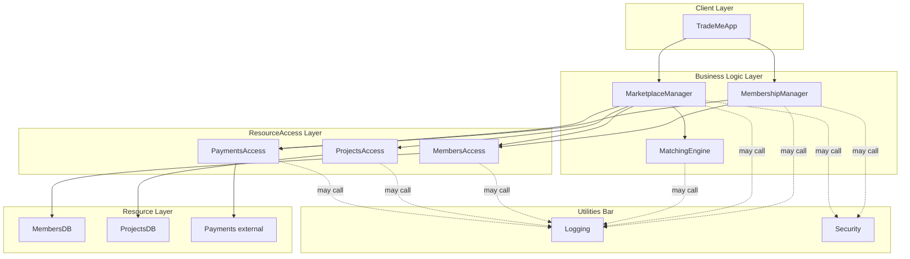

Call topology respects R-03 (closed architecture) and R-04 (the four legitimate exceptions). Specifically: Client calls Manager only (R-03); Manager calls Engine (R-04 (c)) and ResourceAccess (R-04 (b)); ResourceAccess is the only layer touching Resources (R-03); Manager-to-Manager calls are absent in this naïve baseline (Membership and Marketplace operate independently in the naïve view -- a stress point that S3 will probably surface); BL and RA call Utilities (R-04 (a) tightened: Clients and Resources do not call Utilities directly).

#### Constitution validation (S1 Step 3)

| Rule | Result |
|---|---|
| R-02 (typing) | Every component is typed (Client / Manager / Engine / ResourceAccess / Resource / Utility). |
| R-03 (closed architecture) | All edges in the diagram are top-down within the four layers; Utilities are called from BL + RA only. |
| R-04 (relaxing the rules) | Three exceptions applied: (a) Utilities from BL/RA; (b) Managers and Engines call RA; (c) Manager-to-Engine. (d) queued M-to-M absent in naïve. |
| R-05 (hygiene) | No technology vocabulary (no Lambda, REST, gRPC, Postgres, Kafka, etc.) in any component name. |
| R-06 (naming) | All Managers / Engines / Access names are two-part Pascal case with the correct suffix. |
| R-07 (atomic business verbs) | Verbs (`Register`, `Update`, `CreateProject`, `Disburse`, etc.) appear only in ResourceAccess contract operations, never as service-name prefixes. |
| R-11 (almost-expendable Manager) | Both Managers orchestrate Engines + ResourceAccess; they do not contain business logic of their own (matching belongs to MatchingEngine). |
| R-16 (use cases document, not drive) | Component names are residue-named, not use-case-named. (No `RequestTradesmanManager` or `MatchTradesmanManager`.) |

Compliant. No refusal conditions triggered.

#### What the naïve architecture explicitly ignores

This list is the first set of differences observed during the first walk. It is the menu S3 will stress-test:

- **Regulation per locale.** Each country / state has different worker certifications, wage laws, tax rules, reporting requirements. The naïve architecture has no Regulation component, no `RegulationsAccess`, no `Regulations` resource. Regulation is folded silently into Membership and Marketplace workflows.
- **Continued education / certification tracking.** Tradesmen need ongoing certifications and recertifications. The naïve architecture has no Education Manager, no `EducationAccess`, no `Education` resource. Education is implicit.
- **Tradesman / Contractor as distinct populations.** The naïve architecture lumps both into `MembersDB`. The book and the interview both treat them as distinct, with different data, different fees, different lifecycle events.
- **Continued education portal / Tradesman portal / Contractors portal / Marketplace app as distinct clients.** The naïve architecture has one Client; the resolved architecture will surface that different user populations need different entry points.
- **Asynchronous workflows.** Pay Tradesmen is timer-triggered; Match Tradesman triggers Assign asynchronously; some Manager-to-Manager communication is inherently temporal. The naïve has no Pub/Sub Utility, no queued M-to-M.
- **Data residency / multi-jurisdiction deployment.** The interview explicitly flags PII subject to legislation that varies by country. The naïve architecture is single-deployment.
- **Multi-currency.** The interview confirms multi-currency is in scope. The naïve has no notion of currency in `PaymentsAccess`.
- **External system integration beyond payment.** Contractors' Accounts Payable, certification bodies, regulatory reporting endpoints. None modeled.
- **Quality / fraud / safety scoring.** Mentioned as desired features; absent from the naïve.
- **Market expansion to new industries (marine yards, oil fields, IT services).** The naïve assumes construction trades only.
- **Side-by-side operation with the legacy.** Acknowledged as a transition concern; no architectural accommodation in the naïve.
- **Mobile device support.** A specific desired feature; the naïve has one generic Client.

The naïve architecture is deliberately narrow. The Ri test in S6 will measure how much survival improvement the residual architecture buys over this baseline.
### Flow Analysis

External-actor flows for TradeMe. Seven actor categories: Tradesman, Contractor, Rep (internal admin user), Education Center (external partner), Payment Processor (external), Regulatory Authority (external, multiple per locale), Timer (external scheduler). 33 flows enumerated; bidirectional channels split into two flows per `flow-analysis` SKILL.md Step 2. Coverage notes below flag flows whose naïve architecture has no obvious component to handle -- these become S3 stressor starting menu items.

#### Flow table

| # | From (Actor) | To (Actor) | Information / Payload | Trigger |
|---|---|---|---|---|
| F1 | Tradesman | System | Registration application (skills, certifications, rate, area of availability, banking details) | Tradesman initiates registration |
| F2 | System | Tradesman | Application result (approved / rejected with reason) | F1 processed |
| F3 | System | Payment Processor | Membership fee collection request (member id, amount, currency) | F2 approval |
| F4 | Payment Processor | System | Fee collection confirmation (transaction id, status) | F3 processed |
| F5 | Contractor | System | Registration application (company details, project capacity estimate, billing arrangement) | Contractor initiates registration |
| F6 | System | Contractor | Application result (approved / rejected with reason) | F5 processed |
| F7 | System | Payment Processor | Membership fee collection request (member id, amount, currency) | F6 approval |
| F8 | Payment Processor | System | Fee collection confirmation | F7 processed |
| F9 | Contractor | System | Project creation request (required trades, skills, location, duration, bid rates, project terms) | Contractor creates project |
| F10 | System | Contractor | Project active confirmation (project id, status) | F9 processed |
| F11 | Contractor | System | Request tradesman for project (project id, required trade, optional preferred tradesman, urgency) | Contractor demands resources |
| F12 | System | Tradesman | Match offer (project id, dates, agreed rate, location) | F11 produces a candidate match |
| F13 | Tradesman | System | Match response (accept / decline) | F12 received |
| F14 | System | Contractor | Assignment confirmation (tradesman id, dates, rate, project id) | F13 accept |
| F15 | Tradesman | System | Voluntary termination request (project id, effective date, reason) | Tradesman initiates termination |
| F16 | Contractor | System | Termination request (tradesman id, project id, reason) | Contractor initiates termination |
| F17 | System | Tradesman | Termination confirmation + outstanding payment summary | F15 or F16 processed |
| F18 | System | Contractor | Termination confirmation + final billing for that tradesman | F15 or F16 processed |
| F19 | Timer | System | Scheduled payment trigger (cycle id, target date) | Periodic per project terms (daily / weekly) |
| F20 | System | Payment Processor | Disbursement request (tradesman bank, amount, currency, breakdown) | F19 + outstanding hours / contracts |
| F21 | Payment Processor | System | Disbursement confirmation (transaction id, status, failure reason if any) | F20 processed |
| F22 | System | Tradesman | Payment notification (amount, period, transaction id) | F21 success |
| F23 | System | Payment Processor | Contractor collection request (contractor billing, amount, currency, breakdown) | Project costs accrued |
| F24 | Payment Processor | System | Collection confirmation (transaction id, status, failure reason if any) | F23 processed |
| F25 | Contractor | System | Close project request (project id) | Contractor closes project |
| F26 | System | Contractor | Project closure confirmation + final billing summary | F25 processed |
| F27 | Tradesman | System | Continued education enrollment (course id, requested start date) | Tradesman enrolls in mandatory or elective course |
| F28 | System | Education Center | Enrollment forwarding (tradesman id, course id, scheduling preferences) | F27 |
| F29 | Education Center | System | Certification status update (tradesman id, course id, status: enrolled / in-progress / passed / failed / expired) | Education Center reports progress or completion |
| F30 | System | Tradesman | Certification status notification | F29 |
| F31 | System | Regulatory Authority | Periodic compliance report (wages paid, taxes withheld, hours by certification class, fraud incidents, worker counts by locale) | Periodic per locale rules (monthly / quarterly / annually) |
| F32 | Rep | System | Administrative action (dispute resolution decision, manual override of a match, member adjustment, fraud flag) | Rep initiates admin task |
| F33 | System | Rep | Pending workflow / dispute / fraud-suspicion notification | System detects condition warranting Rep attention |

#### Coverage notes

Flows whose naïve architecture has no obvious component to handle. These are the S3 stressor starting menu items derived from this analysis (in addition to the "explicitly ignores" list in §Naïve Architecture):

- **F19 -- Timer.** The naïve has no scheduler-driven workflow handler. Pay Tradesmen is a fundamentally async / scheduled use case. -> S3 candidate stressor: "scheduled work cycles not in naïve".
- **F22, F26, F30, F33 -- system-to-actor notifications.** The naïve has no notification mechanism. Confirmation responses to synchronous requests (F2, F6, F10, F14, F17, F18) can be inline returns, but asynchronous notifications (post-payment, post-closure, post-certification, fraud detection) need a Pub/Sub Utility absent from the naïve. -> S3 candidate stressor: "asynchronous notifications".
- **F27-F30 -- Continued education.** No Education Manager / EducationAccess / Education resource in the naïve. -> S3 candidate stressor: "continued education workflow ignored".
- **F31 -- Regulatory reporting.** No Regulation Engine, no `RegulationsAccess`, no `Regulations` resource. The naïve cannot produce locale-specific compliance reports. -> S3 candidate stressor: "cross-locale regulatory reporting".
- **F32, F33 -- Rep administrative actions.** The naïve treats Rep as just another user of `TradeMeApp`. Dispute resolution, fraud flagging, manual overrides are real workflows; they may need their own Manager or distinct Client. -> S3 candidate stressor: "admin / dispute / fraud workflows".
- **F11 -> F12 -> F13 -- multi-step interactive match.** This is a chain: contractor requests, system proposes, tradesman accepts. The naïve treats each as independent calls; in reality this is a long-running workflow with possible delays, partial states, cancellations between F11 and F13. -> S3 candidate stressor: "long-running workflow management" (suggests Workflow Manager pattern, Lowy L2163-2186).
- **F3, F4, F7, F8, F20, F21, F23, F24 -- payment processor interactions.** The naïve has `PaymentsAccess` to one external Payments processor. Multi-currency, jurisdiction-specific payment regulations, processor failover -- none modeled. -> S3 candidate stressor: "payment processor diversity and failure".

These coverage gaps are intentional. The naïve baseline is the control; S3 will systematically stress-test it and S5 will produce the residual architecture that absorbs the stress.
### Stressor Catalog

Frameworks used: PESTLE, Porter's 5 Forces, Business Model Canvas, abstraction-stressing on Tradesman / Contractor / Project / Membership / Match / Certification, flow-stressing on F1-F33 from §Flow Analysis. **22 stressors total**: 11 Structural, 2 Topological, 7 Business, 2 Combined. Looping signal: stressors #21 and #22 emerge as Combined, indicating the catalog is approaching the attractor space the early residues already absorb.

#### Stressor table

| # | Type | Stressor (narrative) | Detection | Attractor | Business Reaction | Technical Change to Residue (IDesign) |
|---|---|---|---|---|---|---|
| 1 | Structural | A locale's worker certification body mandates that platform-matched tradesmen carry a specific accreditation. The naïve system has no notion of certifications; reps start manually checking certificates on registration. As locales multiply, the reps cannot keep up; non-certified tradesmen slip through and the company is fined. The business shifts toward an attractor where compliance officers triage matches instead of system rules. | Regulator notification + Rep escalations | Compliance-officer-driven matching, no automated certification check | Implement certification as an architectural concern, not a process patch | New `RegulationEngine` (encapsulates per-locale compliance rules); new `RegulationsAccess` + `Regulations` Resource (rules store, possibly externally sourced) |
| 2 | Structural | Continued education becomes mandatory for several trades. Tradesmen must enroll, attend, pass, and recertify periodically. Without integration, tradesmen forget, certifications lapse, matches go to lapsed tradesmen, contractors file complaints. The business attractor is reactive cleanup -- canceling matches, refunding, manually tracking recerts. | Complaint volume + lapsed certification audit | Manual education-cycle tracking with reactive cleanup | Bring education into the architecture as a first-class workflow | New `EducationManager` (orchestrates enrollment, progress tracking, recertification cycles); new `EducationAccess` + `Education` Resource; integration flow with Education Center external partner |
| 3 | Structural | A small construction firm registers as a "tradesman" -- one legal entity with multiple workers behind it. Membership model assumed a person; rate-setting assumed a person; the "tradesman" can present multiple people for one match and route payments internally. The system has no concept of company-tradesman, and contractors get matched with a "name" who never shows up because the firm sent someone else. | Contractor complaints + audit of registered tradesmen | Hidden-team contracting, ambiguous identity in disputes | Recognize tradesman as a role, not necessarily a person | Split `Members` Resource into `Tradesmen` + `Contractors` with distinct schemas; introduce role abstraction (`TradesmanIdentity` may be person or firm); `MembershipManager` workflow extended with team-membership state |
| 4 | Structural | The matching workflow is long-running. Contractor requests at 09:00; system finds three candidates; offers go out; one tradesman accepts at 11:00; one declines at 14:00; one never responds. The contractor watches a half-assigned project for hours. The naïve has no notion of multi-step workflow state; each call is synchronous and loses context between F11 -> F12 -> F13. The business attractor is reps manually shepherding requests. | Time-from-request to assignment exceeds SLA repeatedly | Rep-orchestrated, manually-tracked matches | Make workflow state explicit and durable | Per R-24 (smallest set) and `shared/idesign-vocabulary.md` §9 ("in theory just another Manager"), extend `ProjectsAccess` with atomic verbs `RecordPendingMatchState`, `QueryPendingMatches`, `ResumeMatch`. `MarketplaceManager` workflow state persists into the project record via these verbs; on restart, `QueryPendingMatches` lists in-flight workflows for re-instantiation. No new Resource. No third-party engine. If future stressors surface visual-editing or distributed-saga needs, a Workflows engine becomes ADR-worthy then |
| 5 | Structural | Pay Tradesmen is timer-triggered (F19 in §Flow Analysis), but the naïve has no scheduler, no Pub/Sub, no message queue. Reps fire payment runs manually; one Friday the rep is on leave and tradesmen miss payday; tradesmen quit; the business loses supply-side capacity. The attractor is unhappy tradesmen, churning supply, broken reputation. | Tradesman churn rate spikes after a missed payroll | Manual payroll runs by reps | Decouple scheduled work from human operators | Introduce `Pub/Sub` Utility (Message Bus); a scheduler / timer is an external Client that posts to the bus; `MarketplaceManager` subscribes to `PayCycle` events; queued M-to-M (R-04 (d)) enabled |
| 6 | Structural | A tradesman accepts a match (F13), but the system loses the acknowledgment due to a transient network failure between F13 and the assignment write (F14). The tradesman thinks they're assigned; the contractor sees no assignment. They argue. With volume, this happens dozens of times a day. Naïve has no idempotency, no replay. Attractor: dispute backlog. | Dispute filings + log replay | Reactive dispute resolution by reps | Make match acceptance atomic + idempotent + replayable | Match acceptance becomes an event posted to the Message Bus; `MarketplaceManager` consumes idempotently; the workflow state in `ProjectsAccess` (workflow-state atomic verbs per R-24) is authoritative; NFR contract on Manager + ResourceAccess pair |
| 7 | Structural | A contractor disputes a tradesman's hours after payment has cleared. Today's `PaymentsAccess` has no notion of clawback; the system has no audit trail of paid hours linked to project events. Reps spend hours reconstructing what happened from logs. Attractor: high cost of dispute resolution. | Dispute backlog age | Forensic dispute resolution from raw logs | Make payment-hours-project linkage queryable and reversible | `PaymentsAccess` extended with `Hold` / `Reverse` / `Clawback` atomic verbs; `MarketplaceManager` workflow records project-hour-payment linkage via `ProjectsAccess` (workflow-state atomic verbs per R-24) |
| 8 | Structural | Fraud emerges: a contractor and a tradesman collude to bill hours that were never worked; the spread looks normal but the work was fake. With manual matching, reps spotted patterns; automated matching cannot. The naïve has no fraud signal. Attractor: undetected fraud erodes margin. | Margin trend deterioration vs project volume | Reactive investigation by reps after pattern noticed | Make fraud signals explicit and continuously evaluated | New `FraudDetectionEngine` (stateless, evaluates patterns over project / member / payment data); `MarketplaceManager` consults engine before payment release; events to `MessageBus` for Rep notification |
| 9 | Structural | A major construction client requires that match decisions be explainable to its own audit team -- which tradesmen were considered, why one was chosen over others, what the rate was based on. Naïve `MatchingEngine` returns a ranked list with no explanation. Attractor: company loses the client and similar contracts. | Audit failure with major client | Lose the contract or rebuild trust manually | Match decisions must produce explanations as a first-class output | `MatchingEngine` contract extended with `ExplainMatch` operation; `ProjectsAccess.RecordExplanation` persists snapshots into the Projects Resource (per R-24, no separate Workflows Resource); auditor-friendly NFR contract |
| 10 | Structural | Quality / safety scoring becomes a required input to matching (interview L75 lists this as desired). Each tradesman accumulates ratings across completed projects; future matches must weight by safety record + quality. Naïve has no rating storage, no rating evaluation. Attractor: contractors switch to competitors that visibly rate tradesmen. | Customer churn to rating-driven competitors | Rep-mediated reputation, ad-hoc | Make ratings explicit and integrated into matching | New `RatingEngine` (stateless, computes weighted score); `RatingAccess` + `Ratings` Resource; `MatchingEngine` consults ratings during match |
| 11 | Structural | Mobile-first becomes the dominant tradesman channel; the desktop-oriented `TradeMeApp` is unusable on a phone for the workflows tradesmen actually do (check assignments, accept matches, submit hours). Tradesmen miss assignments. Attractor: supply-side churn to mobile-native competitors. | Tradesman session metrics + churn | Build mobile from scratch | Split client per persona / device class | Decompose `TradeMeApp` Client into `TradesmanPortal` (mobile-first), `ContractorsPortal`, `EducationPortal`, `MarketplaceApp` (Rep console); per-portal volatility encapsulated |
| 12 | Topological | The system is deployed in the UK; the company expands to Canada. GDPR-style privacy regulation in the UK plus Canadian PIPEDA requirements mean tradesman personal data cannot move between the two jurisdictions. The single `MembersDB` cannot satisfy both. Attractor: regulatory fine in one jurisdiction, or geo-fenced features that confuse users. | Legal investigation + cross-border data audit | Hire compliance officers, manually segregate data | Architect deployment to respect jurisdictional boundaries | Per-jurisdiction deployment unit; `MembersAccess` instances bounded to home country `MembersDB`; `JurisdictionEngine` routes calls based on member home country; Topological residue feeds Deployment Diagram |
| 13 | Topological | A major Canadian incident requires a partial regional failover. Naïve has one region; failover takes hours. Tradesmen and contractors in the region cannot transact. Business attractor: SLA breaches + reputational damage. | Region-level health alerts + SLA dashboards | Manual failover with extended downtime | Make region a first-class deployment dimension | Per-region active-active replication of `Workflows` + `Projects` Resources; cross-region routing of in-flight workflows; latency-zone partitioning; flows F22 / F30 use eventual-consistency contract |
| 14 | Business | Construction sector enters a deep recession; project volume drops 60% over six months. The company is profitable but its profit depends on transaction volume. Cost-cutting alone does not solve it. The business attractor is "we are no longer primarily a construction broker". | Macroeconomic indicators + project intake trend | Diversify into adjacent markets (IT services, marine yards, oil fields); reduce locale footprint | (n/a) no software change; the architecture's polymorphism on "tradesman" + "project" should already accommodate. If it does not, escalate. | (n/a) |
| 15 | Business | Tradesman training pipeline collapses (boomer retirement faster than millennial intake). Supply-side capacity declines structurally. The business attractor is "we no longer have enough tradesmen to match demand". | Tradesman registration rate + retirement rate | Invest in education + apprenticeships; partner with vocational schools; lobby for immigration of skilled trades | (n/a) software change. The Education residue (#2) already absorbs the operational layer; the business response is policy / investment. | (n/a) |
| 16 | Business | A FAANG-scale competitor launches a tradesman platform with deep pockets, undercutting on price for the first year. Some tradesmen migrate. The business attractor is "we are no longer the cheapest"; we must defend on quality / reputation. | Competitor analysis + tradesman churn | Defend on quality, certification, safety record, contractor relationships; consider acquisition / merger | (n/a) software. Quality-ratings residue (#10) and certification residues (#1, #2) are what enable the defense. | (n/a) |
| 17 | Business | A major contractor (30% of revenue) leaves the platform. Cash flow is impacted; sales team scrambles for replacement contracts. The business attractor is "we are more dependent on a few clients than we realized". | Revenue concentration analysis after the loss | Diversify customer base; offer enterprise tier with custom SLAs; defensive sales investments | (n/a) software change. Membership tiering may emerge as Structural in a future iteration, but the immediate response is commercial. | (n/a) |
| 18 | Business | Insurance for the platform's liability (matching tradesmen who then cause damage on projects) becomes prohibitively expensive after an industry incident elsewhere. The business attractor is "every match is a liability we must underwrite". | Insurance premium jump + claims trend | Re-underwrite the platform's role (broker not employer); require contractor insurance attestations; reduce platform-liability exposure | (n/a) software primarily, though Quality-ratings residue (#10) supports underwriting defense. | (n/a) |
| 19 | Business | Government enacts a "platform worker rights" law reclassifying tradesmen as employees in some jurisdictions. The business model assumes contractor-of-contractor relationships. Attractor: "we are an employer in jurisdiction X, a broker in jurisdiction Y". | Legislation tracking + legal counsel | Restructure jurisdictional entities; possibly exit unfavorable jurisdictions; comply with employer obligations where required | (n/a) software architecture (the deployment-per-jurisdiction residue #12 supports differential treatment), but business / legal response is primary. | (n/a) |
| 20 | Business | A tradesman fraud scandal hits the press (cooked-up credentials, fake projects, money laundering through the platform). Public trust collapses; regulators investigate. The business attractor is "we must demonstrate our controls". | Press cycle + regulatory subpoena | Public response + transparency commitments; possibly restructure executive team; demonstrate fraud-detection architecture | (n/a) software change; the Fraud-detection residue (#8) is what enables the demonstration. The business decision is response posture, not new architecture. | (n/a) |
| 21 | Combined | The EU enacts an "Algorithmic Decision Transparency for Worker-Matching Platforms" regulation requiring that every match decision be auditable, explainable, and reversible by a human within 24 hours. This is the kind of regulation that did not exist when the architecture was designed; in 2026 it would be ridiculous. Yet some version of this is increasingly likely. | (Combined; not a stress on the residual architecture) | (Already-survived attractor) | (n/a) | Survived by combination of #1 (RegulationEngine), #2 (Education / certifications), #4 (Workflow Manager state), #8 (FraudDetectionEngine), #9 (ExplainMatch on MatchingEngine). The residual architecture already produces auditable, explainable, reversible matches; the regulation is absorbed without architectural rewrite. |
| 22 | Combined | Autonomous / robotic tradesmen emerge -- a brick-laying robot or welding rig registers as a "tradesman" with skills, rates, and certifications. In 2026 this seems speculative; in 2031 it may be ordinary. The system has no notion of a non-human tradesman; rate-setting assumes hourly labor; matching assumes location + availability. | (Combined; absorbed by existing residues) | (Already-survived attractor) | (n/a) | Survived by combination of #3 (Tradesman as role / abstraction, not necessarily person; team / firm / robot all slot in), #4 (workflow state independent of actor type), #10 (rating system treats actors uniformly). The residual architecture already supports it; no new components needed. |

#### Stop condition

Stressors #21 and #22 emerged as Combined -- absorbed by combinations of existing residues without new components or deployment changes. This is the looping signal (O'Reilly L1812-1816) that the catalog has reached useful breadth for this iteration: the residues identified so far cover attractor families beyond the specific stressors that motivated them. Per `architectural-walking.md` §4.6, the architecture is "less wrong than the naïve baseline" by enough that some unforeseen pressures are absorbed for free.

**Framework coverage:** PESTLE (rows 1, 12, 14, 18, 19, 20, 21); Porter (rows 16, 17, 18); BMC (rows 2, 7, 10, 11, 15, 17, 18); abstraction-stressing (rows 3, 4, 6, 22); flow-stressing (rows 5, 6, 7, 8, 13).

**Lateral mode signals (R-22):** Stressors #14-#20 are mostly Business -- the catalog deliberately includes contextual / market / regulatory stressors that a technically-framed catalog would have missed. Stressors #21 and #22 are deliberately "ridiculous" today and would be filtered out by a probability column (R-20 forbidden). Their inclusion is the diversity that lets Combined residues emerge as criticality evidence.


13 rows in the matrix (11 Structural + 2 Topological with component impact marked `(T)`) by 17 component columns. K = 53. N = 30 (13 stressors + 17 components). P = medium (5 of 7 consistency axes met). Hyperliminal Coupling Map captures all multi-1 rows (12 entries). Topological Residue Map has 2 rows. Business Residues Log has 7 entries. Looping Signals has 2 entries. IDesign Override fires once (TradesmenAccess + ContractorsAccess identical signatures, valid within-layer merge candidate but rejected for domain reasons).

**Doctrinal note (2026-05-17):** an earlier draft of this fragment included a `WorkflowsAccess` column + `Workflows` Resource, following Lowy TradeMe Figure 5-14 mechanically. Per R-24 (smallest-set residue discipline) and `shared/idesign-vocabulary.md` §9, the workflow-state needs of stressors #4, #6, #7, #9, #13 are absorbed by extending `ProjectsAccess` with workflow-state atomic verbs rather than introducing a separate Workflows Resource. The matrix below reflects the corrected residue.

### Contagion Matrix (Structural Residues)

Component column abbreviations: MemMgr = MembershipManager, MktMgr = MarketplaceManager, EduMgr = EducationManager, MatchEng = MatchingEngine, RegEng = RegulationEngine, FraudEng = FraudDetectionEngine, RateEng = RatingEngine, JurEng = JurisdictionEngine, TradAcc = TradesmenAccess, ContAcc = ContractorsAccess, ProjAcc = ProjectsAccess (extended with workflow-state atomic verbs), PayAcc = PaymentsAccess, RegAcc = RegulationsAccess, EduAcc = EducationAccess, RateAcc = RatingAccess, Portals = TradesmanPortal + ContractorsPortal + EducationPortal + MarketplaceApp, MBus = MessageBus.

| Stressor | MemMgr | MktMgr | EduMgr | MatchEng | RegEng | FraudEng | RateEng | JurEng | TradAcc | ContAcc | ProjAcc | PayAcc | RegAcc | EduAcc | RateAcc | Portals | MBus | **Σ Row** |
|---|---|---|---|---|---|---|---|---|---|---|---|---|---|---|---|---|---|---|
| #1 Regulation per-locale | 1 | 1 | 0 | 1 | 1 | 0 | 0 | 0 | 0 | 0 | 0 | 0 | 1 | 0 | 0 | 0 | 0 | **5** |
| #2 Continued education | 1 | 0 | 1 | 1 | 1 | 0 | 0 | 0 | 0 | 0 | 0 | 0 | 1 | 1 | 0 | 0 | 0 | **6** |
| #3 Tradesman-as-firm | 1 | 0 | 0 | 0 | 0 | 0 | 0 | 0 | 1 | 1 | 0 | 1 | 0 | 0 | 0 | 0 | 0 | **4** |
| #4 Workflow Manager pattern (corrected) | 1 | 1 | 1 | 0 | 0 | 0 | 0 | 0 | 0 | 0 | 1 | 0 | 0 | 0 | 0 | 0 | 1 | **5** |
| #5 Pub/Sub Utility | 1 | 1 | 1 | 0 | 0 | 0 | 0 | 0 | 0 | 0 | 0 | 0 | 0 | 0 | 0 | 1 | 1 | **5** |
| #6 Idempotency for match | 0 | 1 | 0 | 0 | 0 | 0 | 0 | 0 | 0 | 0 | 1 | 1 | 0 | 0 | 0 | 0 | 1 | **4** |
| #7 Clawback / reversal | 0 | 1 | 0 | 0 | 0 | 0 | 0 | 0 | 0 | 0 | 1 | 1 | 0 | 0 | 0 | 0 | 0 | **3** |
| #8 Fraud detection | 0 | 1 | 0 | 1 | 0 | 1 | 0 | 0 | 1 | 1 | 1 | 1 | 0 | 0 | 0 | 0 | 1 | **8** |
| #9 ExplainMatch | 0 | 0 | 0 | 1 | 0 | 0 | 0 | 0 | 0 | 0 | 1 | 0 | 0 | 0 | 0 | 0 | 0 | **2** |
| #10 Rating / quality | 0 | 0 | 0 | 1 | 0 | 0 | 1 | 0 | 0 | 0 | 0 | 0 | 0 | 0 | 1 | 0 | 0 | **3** |
| #11 Multi-portal | 0 | 0 | 0 | 0 | 0 | 0 | 0 | 0 | 0 | 0 | 0 | 0 | 0 | 0 | 0 | 1 | 0 | **1** |
| #12 Data residency *(T)* | 1 | 0 | 0 | 0 | 0 | 0 | 0 | 1 | 1 | 1 | 0 | 0 | 0 | 0 | 0 | 0 | 0 | **4** |
| #13 Multi-region failover *(T)* | 0 | 1 | 0 | 0 | 0 | 0 | 0 | 0 | 0 | 0 | 1 | 0 | 0 | 0 | 0 | 0 | 1 | **3** |
| **Σ Column** | **6** | **7** | **3** | **5** | **2** | **1** | **1** | **1** | **3** | **3** | **6** | **4** | **2** | **1** | **1** | **2** | **5** | |

*(T) = Topological residue with component-level impact; also appears in §Topological Residue Map.*

#### NKP Totals

| Parameter | Value | How |
|---|---|---|
| **N** | 13 stressors + 17 components = **30** | Bipartite friction network (O'Reilly L2522). One fewer component than the pre-correction matrix (Workflows Resource + WorkflowsAccess removed per R-24). |
| **K** | **53** | Sum of `1` cells across the matrix (L2520). Unchanged from pre-correction; the 5 cells previously in WflAcc redistributed to ProjAcc rather than disappearing -- the coupling is still there, just relocated to the appropriate domain RA. |
| **P** | **medium** | Same 5 of 7 axes met. Removing the third-party engine slightly raises P (one less external integration to handle inconsistently); still classified as medium pending a uniform-retry-policy Utility wrapper. |

**Reading direction** (O'Reilly L2526-2528): reduce K, optimize N, optimize P. N dropped from 31 to 30 via R-24 correction; K unchanged. ProjectsAccess is now hotter (Σ Column = 6, second only to MktMgr Σ=7) -- a real signal worth noting: ProjectsAccess absorbs workflow state for matching + idempotency + clawback + explanation + multi-region. If future stressor analysis surfaces project-entity fragmentation (per the abstraction-stressing #3 lineage), splitting ProjectsAccess by concern (e.g., project-records vs project-workflow-state) becomes a candidate.

#### Reading the matrix

1. **Hot row #8 -- Fraud detection (Σ=8).** Unchanged from pre-correction. Single stressor reshapes 8 components; pivotal residue for the SAD. Fraud signal inherently crosses layers because fraud manifests in interactions.

2. **Hot row #2 -- Continued education (Σ=6).** Unchanged. Education couples regulation + membership + matching + new ResourceAccess stack.

3. **Hot columns -- MktMgr (Σ=7), ProjAcc (Σ=6, NEW), MemMgr (Σ=6), MatchEng (Σ=5), MBus (Σ=5).** ProjectsAccess emerges as the second-hottest column post-correction. This reflects R-24-aligned design: workflow state, idempotency, clawback linkage, and replay snapshots all persist via ProjectsAccess into the Projects Resource. If ProjectsAccess Σ reaches 8+ in future iterations as new stressors load it further, splitting becomes worth considering.

4. **Multi-1 row #4 -- Workflow Manager pattern (Σ=5, corrected).** All three Managers + ProjAcc + MBus react together. The corrected residue: the Managers ARE workflow Managers per Lowy L2167 "in theory" framing; their workflow state persists into domain Resources (ProjectsAccess for marketplace, MembersAccess analogously for membership workflows, EducationAccess for education workflows). MBus carries cross-Manager events. NFR contract: each Manager's workflow state is durable + replayable via its respective domain RA; no separate Workflows Resource needed.

5. **Multi-1 row #5 -- Pub/Sub Utility (Σ=5).** All three Managers + Portals + MBus. Unchanged.

6. **Identical column signatures -- TradAcc and ContAcc.** Both have the signature `(0,0,1,0,0,0,0,0,0,0,0,1,0,0,0,0,0)` across the 13 rows. IDesign Override check: same layer (both ResourceAccess); override does NOT fire. Decision: keep separate (domain rationale -- residue #3 motivated the split; merging would undo it).

7. **Globally K = 53 across 13 rows × 17 columns = 221 cells = 24.0% density.** Slight increase from pre-correction 22.6% because the same K is now packed into one fewer component column. Not catastrophic; the increase reflects appropriate consolidation of workflow state into the domain RA that owns the entity (ProjectsAccess).

8. **Zero-total columns:** none. Every component has at least one Structural stressor justifying it (R-18 / guardrail #1 satisfied).

9. **Stressor combinations -- #8 + #4 (fraud during long-running matching).** Both touch MktMgr + MBus, and post-correction both touch ProjAcc. Implication: fraud signaling must be workflow-state-aware AND queryable from ProjectsAccess in real time. NFR contract carries forward unchanged.

#### Hyperliminal Coupling Map

Every matrix row with Σ Row >= 2 (12 entries; #11 with Σ=1 not in map). WflAcc references replaced by ProjAcc per R-24:

| # | Affected Components | Coupling Nature | Architectural Response | NFR Source |
|---|---|---|---|---|
| 1 | MemMgr + MktMgr + MatchEng + RegEng + RegAcc | intrinsic | Document NFR contract | Hyperliminal Coupling #1 |
| 2 | MemMgr + EduMgr + MatchEng + RegEng + RegAcc + EduAcc | intrinsic | Document NFR contract | Hyperliminal Coupling #2 |
| 3 | MemMgr + TradAcc + ContAcc + PayAcc | intrinsic | Document NFR contract | Hyperliminal Coupling #3 |
| 4 | MemMgr + MktMgr + EduMgr + ProjAcc + MBus | intrinsic | Document NFR contract | Hyperliminal Coupling #4 |
| 5 | MemMgr + MktMgr + EduMgr + Portals + MBus | intrinsic | Document NFR contract | Hyperliminal Coupling #5 |
| 6 | MktMgr + PayAcc + ProjAcc + MBus | intrinsic | Document NFR contract | Hyperliminal Coupling #6 |
| 7 | MktMgr + PayAcc + ProjAcc | intrinsic | Document NFR contract | Hyperliminal Coupling #7 |
| 8 | MktMgr + MatchEng + FraudEng + TradAcc + ContAcc + ProjAcc + PayAcc + MBus | intrinsic | Document NFR contract | Hyperliminal Coupling #8 |
| 9 | MatchEng + ProjAcc | intrinsic | Document NFR contract | Hyperliminal Coupling #9 |
| 10 | MatchEng + RateEng + RateAcc | intrinsic | Document NFR contract | Hyperliminal Coupling #10 |
| 12 | MemMgr + JurEng + TradAcc + ContAcc | intrinsic | Document NFR contract | Hyperliminal Coupling #12 |
| 13 | MktMgr + ProjAcc + MBus | intrinsic | Document NFR contract | Hyperliminal Coupling #13 |

All 12 couplings remain classified **intrinsic**. No `Decouple` decisions; the residues are accepted as architectural facts and S5 derives non-functional contracts from them.

#### IDesign Override on Merge Signals

The matrix-reading identified TradAcc + ContAcc as having identical column signatures. IDesign Override check: both components are ResourceAccess (same layer); cross-layer prohibition does NOT apply. Decision: do not merge. Domain rationale unchanged (residue #3 motivated the split; merging would undo).

### Topological Residue Map

| Residue # | Topology Driver | Deployment Decision | Affected Components | Cross-Boundary Constraints |
|---|---|---|---|---|
| 12 | Privacy regulation (GDPR / PIPEDA / equivalent per jurisdiction): personal data of members must remain within home jurisdiction | Per-jurisdiction deployment unit. Each jurisdiction runs its own data plane (Tradesmen + Contractors + their RA instances + JurisdictionEngine). Stateless layers (RegulationEngine, MatchingEngine, FraudDetectionEngine, RatingEngine, MessageBus regional) may share regional deployment. | TradesmenAccess, ContractorsAccess, Tradesmen, Contractors, JurisdictionEngine, MembershipManager | **Allowed:** project metadata (no PII), aggregate analytics, FX rates, software releases, regulation rule updates, anonymized fraud signals. **Forbidden:** any flow carrying member PII (name, contact, banking, location) across jurisdiction boundaries. Cross-border matching is not allowed if both parties' jurisdictions forbid (regulation rule). |
| 13 | High availability requirement: a single-region outage must not disable transactions in unaffected regions | Active-active replication across regions within a jurisdiction. Workflow state replicated via Projects (since #4 corrected to use ProjectsAccess); message bus regional with cross-region propagation for non-PII events; FX-rate and regulation-rule replicas in each region. | MarketplaceManager (workflow state), ProjectsAccess, Projects, MessageBus | **Allowed:** project + workflow-state replication (within-jurisdiction); fraud signal propagation (non-PII); event replay. **Forbidden:** synchronous cross-region calls (R-04 (d) preferred -- queued M-to-M only); cross-region PII propagation (covered by #12). |

### Business Residues Log

| Residue # | Stressor | Attractor | Business Decision | Rationale for No Software Change |
|---|---|---|---|---|
| 14 | Construction sector recession; project volume drops 60% | Company is no longer primarily a construction broker | Diversify into adjacent markets (IT services, marine yards, oil fields); reduce locale footprint to weather the cycle | Software does not solve a demand collapse; the polymorphism on "tradesman" + "project" in residues #3 and #4 is what permits market entry without rewrite |
| 15 | Tradesman training pipeline collapses; supply-side capacity declines | Insufficient tradesmen to match contractor demand | Invest in education + apprenticeships; partner with vocational schools; lobby for skilled-trades immigration; possibly acquire training providers | Education residue #2 absorbs operational integration; the structural decision is policy and capital, not architecture |
| 16 | FAANG-scale competitor enters with deep pockets, undercutting prices | We are no longer the cheapest broker | Defend on quality (residue #10), certification (residue #1, #2), safety record, contractor relationships; consider acquisition / merger / partnership | Quality, certification, and rating residues already provide the defensive moat. The business decision is positioning, not platform |
| 17 | Major contractor (30% of revenue) leaves the platform | Company more dependent on a few clients than realized | Diversify customer base via marketing + sales investment; offer enterprise tier with custom SLAs; defensive account retention program | Membership tiering may emerge as Structural in a future iteration. The immediate response is commercial; software does not solve customer concentration |
| 18 | Platform liability insurance becomes prohibitively expensive after industry incident | Every match is a liability we must underwrite | Re-underwrite the platform's role (broker, not employer); require contractor insurance attestations; reduce platform-liability exposure via terms-of-service changes; explore captive insurance | Quality-ratings residue #10 supports underwriting defense; the residue does not solve the insurance market collapse |
| 19 | Government enacts "platform worker rights" law reclassifying tradesmen as employees in some jurisdictions | We are an employer in jurisdiction X, a broker in jurisdiction Y | Restructure jurisdictional entities; possibly exit unfavorable jurisdictions; comply with employer obligations where required | Per-jurisdiction deployment residue #12 supports differential legal treatment; the business decision is corporate structure, not architecture |
| 20 | Tradesman fraud scandal hits the press | Public trust collapses; regulators investigate | Public response + transparency commitments; possibly restructure executive team; demonstrate fraud-detection architecture; voluntary regulatory disclosures | Fraud-detection residue #8 enables the demonstration; the business decision is communication posture and possibly leadership change |

### Looping Signals (Combined Residues)

| Residue # | Stressor | Survived by Combination of | Notes |
|---|---|---|---|
| 21 | EU "Algorithmic Decision Transparency for Worker-Matching Platforms" regulation requires every match to be auditable, explainable, and reversible by a human within 24 hours | #1 (RegulationEngine encapsulates jurisdiction-specific compliance rules), #2 (Education tracks certifications relevant to matching), #4 (MarketplaceManager workflow state durable + replayable via ProjectsAccess; Lowy "in theory just another Manager" baseline), #7 (Clawback / Reversal operations on PaymentsAccess + ProjectsAccess audit trail enable financial reversal), #8 (FraudDetectionEngine produces explanations for held matches), #9 (ExplainMatch on MatchingEngine + audit snapshots in Projects Resource via ProjectsAccess) | **Anticipated regulation absorbed for free.** The residues identified for unrelated 2026-era stressors (dispute resolution, fraud detection, audit explainability) produce a residual architecture whose Match decisions are already auditable, explainable, and reversible. The regulation does not require new components, only the activation of explanation-export endpoints. |
| 22 | Autonomous / robotic tradesmen emerge -- a brick-laying robot or welding rig registers as a "tradesman" with skills, rates, and certifications | #3 (Tradesman split with role-not-person identity model: firm, team, robot all slot in as "tradesman identity"), #4 (workflow state independent of actor type, persisted via ProjectsAccess), #10 (RatingEngine treats all actors uniformly by performance, not by ontology) | **Future stressor absorbed for free.** The residue identified for "tradesman-as-firm" (#3) explicitly motivates a role-not-person identity model. A robot's "tradesman identity" is just another configuration. No new components needed. |

Both Combined residues confirm the looping signal post-correction: even with the simplified residue #4 (no Workflows engine), the combination of residues still absorbs the EU algorithmic transparency law and the robotic tradesmen scenario. Mathematical leverage (L1819-1840) is preserved by the R-24 corrected design.
### Derived Non-Functional Requirements

24 NFRs traced to upstream artifacts. Sources: 16 to Hyperliminal Coupling Map rows, 4 to Topology Map rows, 4 to Business Residues Log. No NFR without traceability (R-15 / guardrail #4).

| NFR | Source | Specification |
|---|---|---|
| Regulation evaluation latency | Hyperliminal Coupling #1 | RegulationEngine evaluation completes in < 50ms p99 during match flows; rule cache miss < 200ms p99 |
| Regulation rule propagation | Hyperliminal Coupling #1 | Rule changes propagate to all jurisdictions and Engine caches within 5 minutes (eventual consistency window) |
| Certification queryability | Hyperliminal Coupling #2 | EducationAccess returns valid certifications for a tradesman within 100ms p99; MatchingEngine receives filtered candidate set with certification status |
| Certification expiration propagation | Hyperliminal Coupling #2 | Certification lapse triggers a MessageBus event consumed by MarketplaceManager + MatchingEngine within the same business day |
| Member identity polymorphism | Hyperliminal Coupling #3 | TradesmenAccess + ContractorsAccess + PaymentsAccess support member identities of types {person, firm, team}; future identity types (robot, AI agent) require no schema migration |
| Workflow state durability | Hyperliminal Coupling #4 | Per R-24, workflow state for each Manager persists via its domain ResourceAccess (MarketplaceManager via ProjectsAccess; MembershipManager via TradesmenAccess + ContractorsAccess; EducationManager via EducationAccess). Writes durable + recoverable; state survives Manager restart with zero loss; replay deterministic from persisted snapshots. |
| Workflow state replayability | Hyperliminal Coupling #4 | A workflow can be re-executed from any committed snapshot for audit / dispute resolution; replay window >= 24 months. Snapshots persist via the domain ResourceAccess that owns the workflow state. |
| At-least-once delivery | Hyperliminal Coupling #5 | MessageBus delivers events at-least-once; consumers idempotent per consumer-event-key pair |
| Notification eventual consistency | Hyperliminal Coupling #5 | Actor-visible notifications (Tradesman, Contractor, Education Center, Rep) eventual consistency window <= 30s under normal load; <= 5min during incidents |
| Match-acceptance idempotency | Hyperliminal Coupling #6 | F13 (Tradesman match response) processed exactly-once from the contractor's perspective even if duplicate events arrive; idempotency key = workflow instance + tradesman id + offer id |
| Payment idempotency | Hyperliminal Coupling #6 | PaymentsAccess Disburse + Collect operations idempotent per transaction id; safe to retry on transient failure |
| Payment reversibility window | Hyperliminal Coupling #7 | Clawback + Reverse operations supported within 90 days of original transaction; audit trail preserved indefinitely |
| Project-payment linkage queryability | Hyperliminal Coupling #7 | For every payment, the originating project + hours + workflow instance is queryable in < 100ms p99 |
| Fraud signal availability | Hyperliminal Coupling #8 | FraudDetectionEngine produces signal within 5s of fraud-indicator data arriving; signal exposed as MessageBus event to MarketplaceManager + Rep |
| Fraud-triggered payment hold | Hyperliminal Coupling #8 | Fraud signal of severity >= medium places a Hold on outstanding payments via PaymentsAccess within 1 second of signal emission |
| Match explanation persistence | Hyperliminal Coupling #9 | Every match produces an explanation snapshot stored in Projects Resource (via ProjectsAccess) for >= 24 months; snapshot includes candidate set, ranking factors, regulation filters applied |
| Match explanation exportability | Hyperliminal Coupling #9 | ExplainMatch operation on MatchingEngine returns explanation in human-readable + machine-readable format within 200ms p99 |
| Rating evaluation latency | Hyperliminal Coupling #10 | RatingEngine returns weighted score during match flow within 50ms p99 |
| Rating-weight propagation | Hyperliminal Coupling #10 | Rating weight updates propagate to MatchingEngine cache within 5 minutes |
| Per-jurisdiction data residency | Topology row 12 | Member PII never crosses jurisdiction boundary; TradesmenAccess + ContractorsAccess instances bounded to home-country Resource instances |
| Cross-jurisdiction non-PII allowed flows | Topology row 12 | Project metadata, aggregate analytics, FX rates, software releases, regulation rule updates may cross jurisdictions; member PII may not |
| Single-region outage tolerance | Topology row 13 | A single-region outage in jurisdiction X does not disable transactions in unaffected regions of X; RTO <= 5min, RPO <= 30s for workflow state |
| Cross-region workflow propagation | Topology row 13 | In-flight workflows in a failed region resume on the failover region within RTO; replayable from MessageBus events + ProjectsAccess durable workflow-state snapshots |
| Operational diversification readiness | Business Residue #14 | Architecture supports new tradesman categories (IT services, marine yards, oil fields) without schema migration; only configuration changes |
| Capacity-aware supply provisioning | Business Residue #15 | System exposes tradesman supply metrics (registrations, churn, certification pipeline) for business consumption; metric latency <= 1hr |
| Quality-defended pricing | Business Residue #16 | RatingEngine score is exposed via MarketplaceManager as a pricing input; rating-driven match preference is configurable per contractor preference |
| Audit demonstration capacity | Business Residue #20 | FraudDetectionEngine produces an audit-ready report of detection rate, false-positive rate, and remediation actions on demand for regulators |

### Empirical Test (Residual Index)

Iteration 1. Test set size S = 12 fresh stressors, all verified disjoint from the 22-stressor catalog (§Stressor Catalog) verbatim and semantically per S6 Step 2. Applied to both architectures: naïve fails all 12 (X = 0; naïve was deliberately narrow). Residual survives 10 of 12 (Y = 10). **Ri = (10 - 0) / 12 ~ 0.83.** Positive movement toward criticality; two unstressed surfaces (T10 state surveillance demands + T12 cross-jurisdiction tradesman) marked for the next iteration of stressor analysis.

#### Test stressor table

| # | Test Stressor (narrative) | Naïve survives? | Residual survives? | Rationale |
|---|---|---|---|---|
| T1 | A coordinated attack chain compromises a developer credential, pivots into production, and exfiltrates 200K tradesman records before detection. Press picks it up. Regulators in three jurisdictions launch investigations. Attractor: the business becomes an incident-response operation until trust is rebuilt. | 0 | 1 | Per-jurisdiction data residency (Topology #12) limits blast radius; FraudDetectionEngine (#8) detection patterns include anomalous access; audit trail in ProjectsAccess + RegulationsAccess (workflow-state snapshots persist via ProjectsAccess per R-24) supports regulator response. The architecture continues to operate per business intent (loss bounded by jurisdiction). |
| T2 | A retired tradesman files a formal GDPR Article 17 "right to be forgotten" request for all data the platform holds about them. The 30-day clock starts. The platform must locate, delete, and produce audit-trail proof of deletion across all systems including backups and analytics derivatives. | 0 | 1 | TradesmenAccess.Terminate already supports member removal; extension to right-to-be-forgotten is a small contract addition; RegulationEngine handles jurisdictional variation in retention rules; audit trail via ProjectsAccess (workflow-state snapshots per R-24). |
| T3 | A new fiscal-year regulation requires consolidated multi-currency financial reports showing all cross-jurisdiction transactions normalized to a reporting currency at audit-defined FX rates. | 0 | 1 | PaymentsAccess multi-currency (residue #3 + Business Residue #14 derived NFR); FX conversion supported; RegulationsAccess + RegulationEngine produce per-jurisdiction reports. |
| T4 | Investigation reveals two registered tradesmen working in different cities under different names are actually the same person, likely evading certification limits or double-collecting membership benefits. | 0 | 1 | FraudDetectionEngine (#8) detection patterns over member + project data surface duplicates; identity model (#3 supports merging person identities); MembershipManager workflow handles merge. |
| T5 | New EU and Canadian ESG legislation mandates that platforms brokering construction work track and report scope-3 emissions (worker transportation, equipment usage). Non-compliance carries fines proportional to project volume. | 0 | 1 | RegulationEngine extends with emissions rules; new EmissionsAccess as ResourceAccess (small architectural addition per established pattern); project location data is already collected. |
| T6 | A hurricane devastates a region. Demand for tradesmen explodes 10x. Standard match rates feel exploitative but fixed rates leave contractors unable to attract supply. The business wants disaster-mode dynamic pricing within ethical bounds. | 0 | 1 | MatchingEngine + RatingEngine + RegulationEngine compose: MatchingEngine inputs include rate; RegulationEngine constrains ethical bounds; RatingEngine weights for emergency-response capability. Small extensions to existing engines. |
| T7 | A bank proposes a partnership where TradeMe earnings data + work history underwrite micro-loans for tradesmen. The platform would route loan offers via existing notifications and loan disbursements via PaymentsAccess. | 0 | 1 | PaymentsAccess pattern extends to new external partner; MessageBus delivers loan-offer events as new event types; new LoanProcessorAccess as ResourceAccess for the partner integration. No structural change. |
| T8 | A tradesman matched via the platform performs substandard work on a high-profile renovation. The contractor sues both the tradesman and the platform. Defense requires producing the full match record + rating history at the time of match + regulatory compliance status + payment trail. | 0 | 1 | ExplainMatch on MatchingEngine (#9) produces the match record; ProjectsAccess preserves the snapshot (#4 corrected per R-24); RatingEngine tracks history at time of match (#10); RegulationEngine records compliance status (#1); PaymentsAccess audit trail (#7 clawback infrastructure). The architecture surfaces the legal-defense evidence as a query. |
| T9 | An industry partner introduces smart helmets emitting real-time signals when a worker falls or is incapacitated. The business wants to ingest these to trigger automated safety incident response: notify supervisors, alert nearby tradesmen, pause project workflows. | 0 | 1 | MessageBus (#5) absorbs new event types; FraudDetectionEngine pattern generalizes to safety incidents (signal evaluation over patterns); new SafetyEventAccess or IoTSignalAccess as ResourceAccess for the partner; MarketplaceManager workflow extends to handle safety-pause states. Pattern-based extension, not architectural change. |
| T10 | A government in a deployed jurisdiction enacts a law requiring platforms to provide warrantless access to all member data for "national security investigations" with no judicial oversight. The platform must either comply (violating its privacy commitments and data residency posture) or exit the market. | 0 | **0** | **Unstressed surface.** The residual architecture's per-jurisdiction data residency (Topology #12) is designed against accidental leakage and regulatory compliance, NOT against state-level coercive demands. Comply means architectural integrity loss; exit means business loss. Neither preserves the original business intent per the survival definition. The architecture has no residue for this. |
| T11 | Insurers and regulators introduce climate risk zones (flood, fire) where new construction is restricted or requires special permits and tradesman certifications. The platform must filter matches by zone and project type, and record evidence of compliance per project. | 0 | 1 | RegulationEngine extends with zone-based rules; MatchingEngine filter integrates zones; ProjectsAccess records zone metadata; existing residues compose. |
| T12 | A UK-registered tradesman wants to take a short-term gig on a Canadian project (legal under a bilateral agreement). The platform must facilitate matching, payment, and certification verification across jurisdictions while complying with both UK and Canadian data residency rules. | 0 | **0** | **Unstressed surface.** Residual architecture's Topology #12 explicitly forbids PII crossing the jurisdiction boundary. The current JurisdictionEngine routes calls to home jurisdiction; it does NOT model cross-border tradesman workflows. Options would require: (a) PII replication (forbidden), (b) cross-jurisdictional routing of matching (not modeled), (c) new identity in Canada (functionally a different person, not the same tradesman). None preserves the cross-jurisdiction tradesman as a single identity. The architecture has no residue for cross-border worker mobility. |

#### Ri computation

`Ri = (Y - X) / S = (10 - 0) / 12 = 0.833...`

X = 0 (naïve fails all 12; the naïve was deliberately narrow and "explicitly ignores" most categories these stressors stress).

Y = 10 (residual survives T1-T9 and T11; fails T10 and T12).

S = 12 (test set size; all disjoint from the catalog).

#### Interpretation

**Positive movement toward criticality.** Ri = 0.83 indicates the residual architecture absorbs roughly 5 of every 6 fresh stressors -- including stressors that did not inform any of the 22 catalog residues. This is mathematical leverage in action (O'Reilly L1068-1078, L1819-1840): residues identified for the catalog's specific stressors (broken plastic key fob -- wait, that is EV charging; for TradeMe it is the regulation residue #1 and the workflow Manager pattern #4 (corrected per R-24 to use domain ResourceAccess) and the data residency #12 -- the same kind of leverage) cover attractors that the test stressors happen to share. T8 (legal liability case) is an especially clear example: the residue chain (ExplainMatch #9, ProjectsAccess #4 snapshots, RatingEngine #10 history, RegulationEngine #1 compliance, PaymentsAccess #7 audit) was built for unrelated stressors and now collectively absorbs a legal-defense scenario that was not in the catalog.

The two unstressed surfaces (T10 state surveillance, T12 cross-jurisdiction tradesman) are honest gaps. Both involve cross-jurisdictional dynamics that the current Topology #12 deliberately does not address. They are the most valuable output of this iteration: the next round of stressor analysis (S3 iteration 2) starts from these two surfaces.

#### Unstressed Surfaces

The two test stressors with `Residual survives = 0` mark the architecture's current edges. Each is documented as a next-iteration stressor candidate.

**Surface 1 -- T10 (state surveillance demands).**

- **Failure mode in residual:** Topology #12 is designed against accidental leakage and routine regulatory compliance. State-level warrantless demands sit outside the threat model. The architecture has no residue that lets the platform comply technically while preserving the privacy commitment, nor a residue that automates the exit decision.
- **Candidate residue for next iteration:** a `StateRequestManager` workflow + `StateDemandAccess` (perhaps wrapping legal counsel + executive approval); jurisdictional risk scoring as a Business Residue input to expansion decisions; explicit deployment-architecture options for client-side encryption with keys outside the demanding jurisdiction. Likely Type: Business + Topological + Structural.

**Surface 2 -- T12 (cross-jurisdiction tradesman).**

- **Failure mode in residual:** JurisdictionEngine routes to the member's HOME jurisdiction. The architecture has no concept of a tradesman temporarily working under another jurisdiction's project, which would require (a) cross-jurisdictional PII flow under bilateral agreement OR (b) a "guest identity" model in the host jurisdiction linked to a "home identity" via a privacy-preserving link OR (c) extending Topology #12 to permit defined cross-border PII flows under specific bilateral conditions.
- **Candidate residue for next iteration:** a `CrossJurisdictionMobilityManager` (workflow handling guest assignments); extension to identity model (#3) to support "home + guest" identity pairs; Topology Residue Map row 12 amendment to define bilateral-agreement-permitted flows. Likely Type: Structural + Topological.

#### Iteration history

This is iteration 1; no prior Ri to compare against. Future iterations will compare against this baseline:

| Iteration | Date | S | X | Y | Ri | Notes |
|---|---|---|---|---|---|---|
| 1 | 2026-05-16 | 12 | 0 | 10 | 0.83 | Two unstressed surfaces marked: T10 state surveillance, T12 cross-jurisdiction tradesman |

#### Hygiene checks (S6 Step 7)

| Check | Result |
|---|---|
| Test set disjoint from catalog (verbatim) | Pass. No T# stressor's narrative is a literal repetition of a catalog stressor. |
| Test set disjoint from catalog (semantic) | Pass. T1 cybersecurity ≠ #8 fraud (different attack class); T2 GDPR forget ≠ #12 data residency (deletion vs storage); T4 identity collision ≠ #3 tradesman-as-firm (collision detection vs role model); T5 emissions ≠ #1 regulation (new domain); T6 dynamic pricing ≠ #10 rating (rate vs score); T11 climate zones ≠ #14 recession (climate vs macroecon); T12 cross-jurisdiction tradesman ≠ #12 data residency (worker mobility vs data location). |
| No probability column on test set | Pass. No Probability / Likelihood / Risk / Cost / Priority columns. |
| Each test stressor has narrative | Pass. Each row has cause + propagation + attractor in the Stressor column. |
| No technical-only stressors | Pass. Each stressor is framed contextually (business consequence + propagation), not as a technology failure. |
| X and Y are integers | Pass. X = 0, Y = 10 (binary survival; no partial credit). |
| Ri formula present | Pass. `Ri = (10 - 0) / 12 = 0.83`. |
| Unstressed surfaces enumerated | Pass. T10 + T12 documented with failure modes and candidate residues for next iteration. |
| Ri sign reported | Pass. Positive (0.83 > 0). |

---

## Analysis and Design

### Behavioral Diagrams

Three core use cases documented per R-16 (use cases document, not drive). The remaining 5 use cases (Add Contractor symmetric to Add Tradesman, Request Tradesman, Assign Tradesman, Create Project, Close Project, Terminate Tradesman) follow patterns derivable from these three.

#### UC-1: Match Tradesman (core use case)

**Scenarios.**

- **Main:** Contractor requests a tradesman for project (F11); MarketplaceManager loads workflow state from ProjectsAccess (workflow-state atomic verbs); consults RegulationEngine for jurisdiction-permitted candidates; consults MatchingEngine (with RatingEngine + EducationAccess + RegulationsAccess filtering); generates explanation snapshot; sends offer to selected tradesman (F12); receives acceptance (F13); records assignment (F14); persists workflow state.
- **Alternative:** Tradesman declines; MarketplaceManager iterates with next candidate; explanation snapshot updated.
- **Exceptional 1:** RegulationEngine returns no permitted candidates -> MarketplaceManager notifies contractor via MessageBus; workflow remains open pending manual intervention or regulation update.
- **Exceptional 2:** FraudDetectionEngine flags a candidate; MatchingEngine excludes; explanation records the exclusion reason for audit (R-21).

Activity diagram:

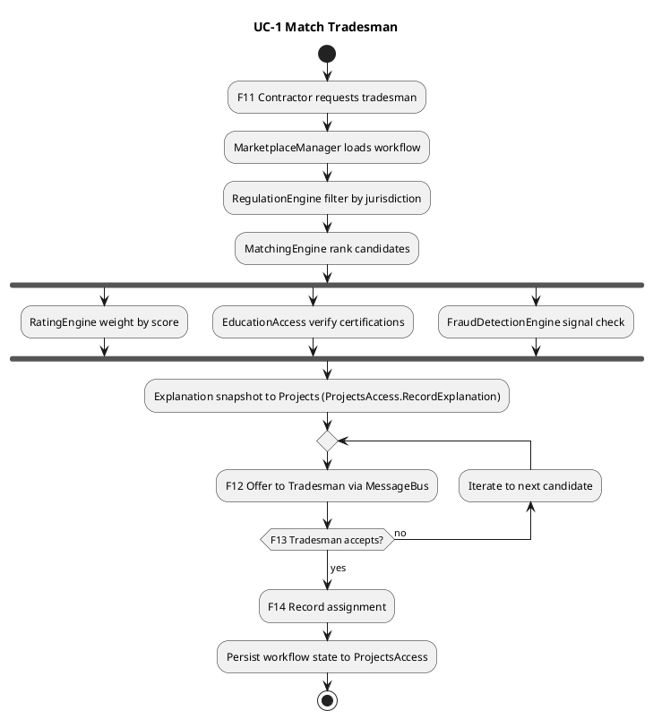

Residue Mapping:

| Residue # | Type | Relevance |
|---|---|---|
| 1 | Structural | RegulationEngine applies jurisdiction filter |
| 2 | Structural | EducationAccess verifies certifications |
| 4 | Structural | MarketplaceManager is the workflow Manager loading workflow state via ProjectsAccess |
| 5 | Structural | MessageBus delivers offer F12 + acceptance F13 |
| 6 | Structural | Idempotent acceptance |
| 8 | Structural | FraudDetectionEngine excludes flagged candidates |
| 9 | Structural | MatchingEngine produces explanation snapshot |
| 10 | Structural | RatingEngine weights candidates |
| 12 | Topological | Per-jurisdiction matching respects data residency |

Per-use-case NFRs:

| Attribute | Specification | Source |
|---|---|---|
| Latency | Match request to first offer: p99 < 30s under normal load | Hyperliminal Coupling #1 (Regulation) + #10 (Rating) NFRs |
| Availability | Match flow continues across single-region outage within jurisdiction | Topology row 13 |
| Auditability | Every match produces a snapshot retained >= 24 months | Hyperliminal Coupling #9 |

#### UC-2: Pay Tradesmen (scheduled)

**Scenarios.**

- **Main:** TimerScheduler emits `PayCycle` event to MessageBus; MarketplaceManager subscribes, loads pay-cycle workflow, queries ProjectsAccess for completed-hours-with-no-payment; for each: FraudDetectionEngine clears or holds; PaymentsAccess disburses; F22 notification to Tradesman.
- **Alternative:** PaymentsAccess returns Hold (fraud flag) -> MarketplaceManager records hold in workflow; F33 notifies Rep via MessageBus.
- **Exceptional 1:** Payment processor returns failure (sanctions, bank reject) -> MarketplaceManager retries up to N times per idempotency contract; if exhausted, marks payment for Rep review.
- **Exceptional 2:** Tradesman bank account is in different currency than project -> PaymentsAccess routes through currency conversion; multi-currency NFR applies.

Activity diagram:

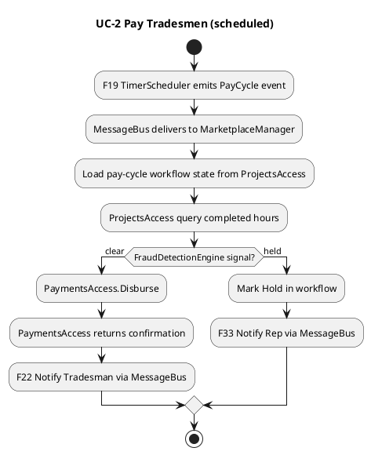

Residue Mapping:

| Residue # | Type | Relevance |
|---|---|---|
| 4 | Structural | Workflow Manager pattern for scheduled cycles |
| 5 | Structural | TimerScheduler emits via MessageBus; F22 notification via MessageBus |
| 6 | Structural | Idempotent payment events |
| 8 | Structural | FraudDetectionEngine holds suspicious payments |

Per-use-case NFRs:

| Attribute | Specification | Source |
|---|---|---|
| Throughput | Process 10K pay events per cycle | Capacity-aware provisioning (Business Residue #15) |
| Idempotency | Duplicate PayCycle event produces no double-payment | Hyperliminal Coupling #6 |
| Multi-currency | Disbursement respects tradesman bank currency; FX rate applied at disbursement timestamp | Operational diversification (Business Residue #14) |

#### UC-3: Continued Education / Recertification

**Scenarios.**

- **Main:** Tradesman enrolls in a course (F27); EducationManager validates against RegulationEngine (jurisdiction-required cert?); EducationAccess records enrollment; F28 forwards to Education Center; F29 status updates from Education Center; on pass, EducationAccess issues certification; F30 notifies tradesman; EducationManager publishes `CertificationIssued` to MessageBus; MatchingEngine receives, updates eligible candidate pool.
- **Alternative:** Tradesman fails course; EducationAccess records failed attempt; re-enrollment workflow.
- **Exceptional:** Certification expires while tradesman has an in-flight match; EducationManager emits `CertificationExpired` to MessageBus; MarketplaceManager workflow detects, suspends future offers to that tradesman pending recertification.

Activity diagram:

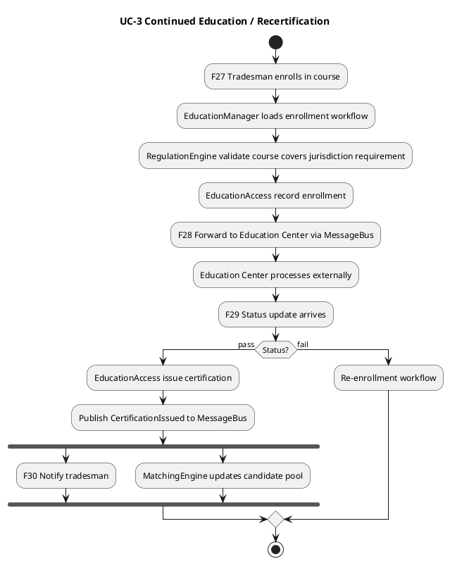

Residue Mapping:

| Residue # | Type | Relevance |
|---|---|---|
| 1 | Structural | RegulationEngine validates required certifications |
| 2 | Structural | EducationManager is the core of this use case |
| 4 | Structural | EducationManager is a workflow Manager |
| 5 | Structural | MessageBus delivers F28, certification events, F30 |

Per-use-case NFRs:

| Attribute | Specification | Source |
|---|---|---|
| Certification propagation | Within same business day from F29 to MatchingEngine candidate update | Hyperliminal Coupling #2 |
| Expiration grace | Tradesman receives notification N days before expiration (configurable per jurisdiction) | Education domain rule |

#### UC-4: Add Tradesman / Contractor (membership registration)

**Scenarios.**

- **Main:** Person or firm submits registration via TradesmanPortal or ContractorsPortal (F1 or F5); MembershipManager loads enrollment workflow; RegulationEngine validates jurisdictional eligibility (certifications required, banking compliance); TradesmenAccess or ContractorsAccess records the registration in the home-country Resource; PaymentsAccess.Charge collects the yearly membership fee (F3 or F7); F2 or F6 confirmation back to the actor.
- **Alternative -- Tradesman-as-firm:** Registration identifies as a firm rather than a person. The identity model (residue #3) accepts the firm as a tradesman-of-record with internal members managed by the firm. Payment routing follows firm bank account.
- **Exceptional 1:** RegulationEngine returns ineligible (e.g., missing required certification for the trade in this jurisdiction) -- MembershipManager records the rejection reason; F2 returns guidance on remediation (which certification to obtain via EducationManager).
- **Exceptional 2:** PaymentsAccess returns failure -- MembershipManager places registration in pending-payment state; retry per idempotency contract.

Activity diagram:

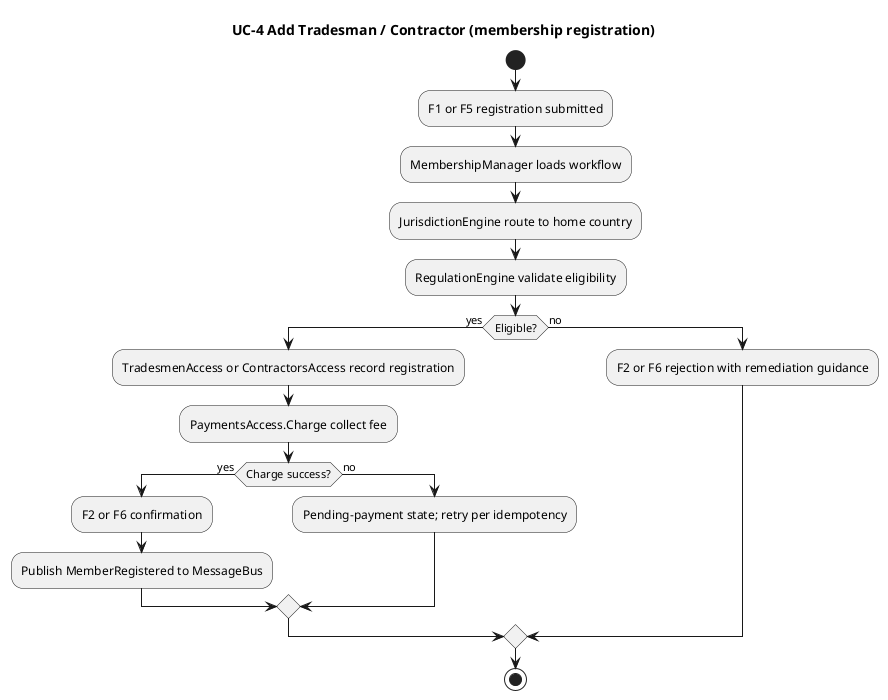

Residue Mapping:

| Residue # | Type | Relevance |
|---|---|---|
| 1 | Structural | RegulationEngine validates eligibility per jurisdiction |
| 2 | Structural | Required-certification baseline via EducationAccess (cross-reference at registration time) |
| 3 | Structural | Identity model supports person / firm / team registrations |
| 4 | Structural | MembershipManager is a workflow Manager |
| 5 | Structural | MessageBus publishes MemberRegistered |
| 6 | Structural | Idempotent fee charge |
| 12 | Topological | JurisdictionEngine routes to home-country TradesmenAccess / ContractorsAccess instance |

Per-use-case NFRs:

| Attribute | Specification | Source |
|---|---|---|
| Registration latency | F1 to F2 (or F5 to F6): p95 < 3s under normal load (PaymentsAccess external call is the dominant cost) | Hyperliminal Coupling #6 + payment processor SLA |
| Jurisdictional routing correctness | 0 false-positive cross-jurisdiction registrations | Topology row 12 |

#### UC-5: Request Tradesman

**Scenarios.**

- **Main:** Contractor requests a tradesman for a specific active project (F11); MarketplaceManager creates a pending-match workflow instance via ProjectsAccess.RecordPendingMatchState; the workflow synchronously invokes UC-1 (Match Tradesman) flow as its first activity.
- **Alternative -- preferred tradesman specified:** Contractor names a specific tradesman in the request; MatchingEngine treats the preference as a ranking weight, not a hard constraint (per interview L41: "Contractors can even request (but not insist) on specific tradesmen").
- **Exceptional 1:** Project not active -- MarketplaceManager rejects the request with explanation.
- **Exceptional 2:** Contractor account is fraud-flagged -- FraudDetectionEngine signals; MarketplaceManager places request on hold pending Rep review.

Activity diagram:

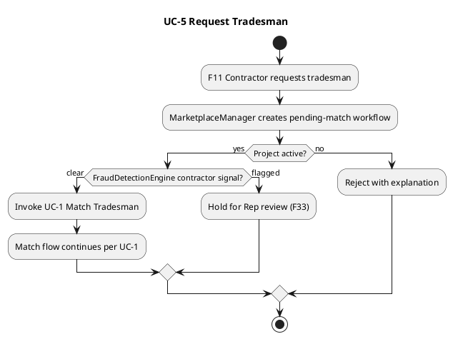

Residue Mapping:

| Residue # | Type | Relevance |
|---|---|---|
| 1 | Structural | RegulationEngine constraints carried into match request |
| 4 | Structural | MarketplaceManager creates workflow state |
| 5 | Structural | F33 hold notification via MessageBus when fraud flagged |
| 8 | Structural | FraudDetectionEngine evaluates requester signal |
| 12 | Topological | JurisdictionEngine ensures the request stays within jurisdiction unless cross-border is permitted |

Per-use-case NFRs:

| Attribute | Specification | Source |
|---|---|---|
| Request acceptance latency | F11 to workflow-created acknowledgment: p99 < 1s | Hyperliminal Coupling #4 |
| Fraud check inline latency | < 500ms p99 at request time | Hyperliminal Coupling #8 |

#### UC-6: Assign Tradesman

**Scenarios.**

- **Main:** Following a successful Match (UC-1), MarketplaceManager moves the workflow to assignment state; ProjectsAccess.RecordAssignment commits the binding (tradesman id, project id, dates, agreed rate); TradesmenAccess.UpdateAvailability marks the tradesman's calendar; F14 confirmation to contractor; MessageBus publishes `AssignmentRecorded` event consumed by EducationManager (to verify cert validity through assignment dates) and the FraudDetectionEngine baseline.
- **Alternative -- tradesman has overlapping commitment:** TradesmenAccess.UpdateAvailability returns conflict; MarketplaceManager workflow re-iterates the match search (returns to UC-1 with the conflicting tradesman excluded).
- **Exceptional 1:** Race condition -- two contractors successfully match the same tradesman within milliseconds. Idempotency contract (residue #6): first commit wins; the second workflow receives the conflict and re-iterates.
- **Exceptional 2:** Certification expires between Match offer and Assignment commit (long-running workflow gap). EducationManager event triggers MarketplaceManager to invalidate the assignment and re-iterate.

Activity diagram:

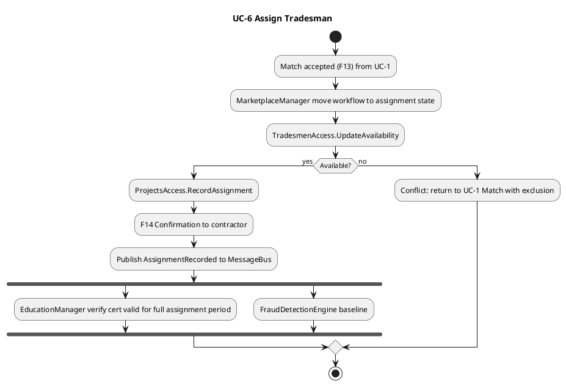

Residue Mapping:

| Residue # | Type | Relevance |
|---|---|---|
| 2 | Structural | EducationManager verifies cert validity for assignment dates |
| 4 | Structural | Workflow state advances from match to assignment |
| 5 | Structural | AssignmentRecorded event via MessageBus |
| 6 | Structural | Idempotent assignment commit handles race condition |
| 7 | Structural | Project-tradesman-hours linkage established for future clawback |
| 8 | Structural | FraudDetectionEngine baseline updated |

Per-use-case NFRs:

| Attribute | Specification | Source |
|---|---|---|
| Assignment commit atomicity | TradesmenAccess + ProjectsAccess writes committed atomically or rolled back together | Hyperliminal Coupling #6 |
| Race-condition resolution | Idempotent commit ensures exactly-one wins; loser receives clear conflict signal within 2s | Hyperliminal Coupling #6 |

#### UC-7: Terminate Tradesman

**Scenarios.**

- **Main:** Tradesman (F15) or contractor (F16) initiates termination of a specific tradesman-project assignment; MarketplaceManager loads termination workflow; RegulationEngine evaluates contract-honoring rules per jurisdiction (e.g., notice period, penalty for early termination); ProjectsAccess.RecordTermination commits; PaymentsAccess computes outstanding hours up to termination date and disburses; F17 confirmation to tradesman + outstanding payment summary; F18 confirmation to contractor + final billing for that tradesman.
- **Alternative -- contract-honoring violation:** Tradesman attempts to terminate before honoring committed duration. RegulationEngine signals penalty applicable; MarketplaceManager records penalty in workflow; PaymentsAccess withholds the penalty amount; tradesman receives notification of withheld sum + appeal path.
- **Alternative -- contractor terminates due to performance:** Contractor cites cause; the termination triggers a rating event (residue #10); RatingEngine records contractor-side rating for the tradesman.
- **Exceptional 1:** Termination flagged by fraud (e.g., contractor terminating to avoid paying for delivered hours). FraudDetectionEngine signals; PaymentsAccess places Hold; F33 to Rep for review before disbursement.
- **Exceptional 2:** Termination during regulatory audit -- MarketplaceManager defers final settlement until audit clears.

Activity diagram:

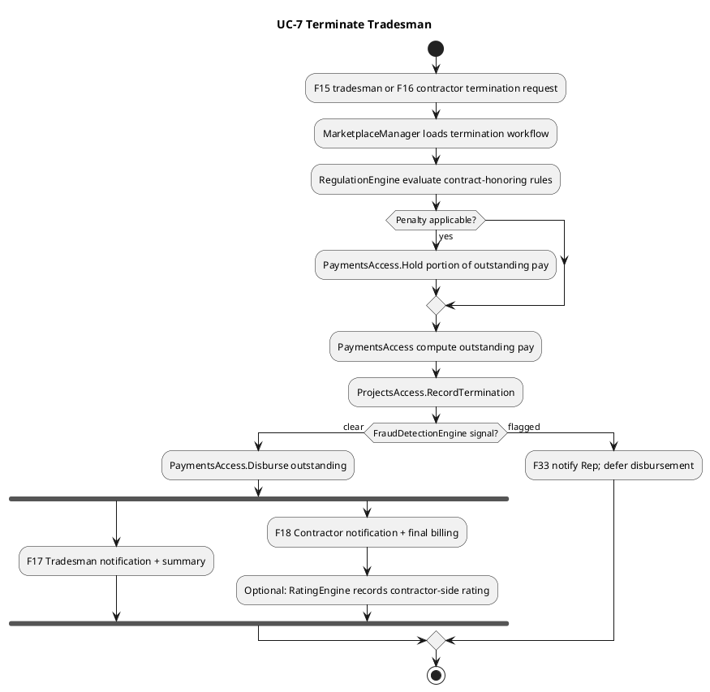

Residue Mapping:

| Residue # | Type | Relevance |
|---|---|---|
| 1 | Structural | RegulationEngine evaluates jurisdiction-specific contract-honoring rules |
| 4 | Structural | Workflow Manager handles termination state |
| 5 | Structural | F17 / F18 / F33 via MessageBus |
| 7 | Structural | PaymentsAccess Hold + Clawback support |
| 8 | Structural | FraudDetectionEngine evaluates termination signal |
| 10 | Structural | RatingEngine records performance rating |

Per-use-case NFRs:

| Attribute | Specification | Source |
|---|---|---|
| Final settlement latency | Termination to outstanding disbursement: < 24 hours unless held by fraud or audit | Hyperliminal Coupling #7 |
| Penalty correctness | RegulationEngine-computed penalty applied without ambiguity; auditable | Hyperliminal Coupling #1 + #9 |

#### UC-8: Create Project

**Scenarios.**

- **Main:** Contractor submits project creation request via ContractorsPortal (F9) with required trades, skills, location, duration, bid rates, terms; MarketplaceManager loads project-creation workflow; ContractorsAccess.UpdateProfile may be touched if project data implies membership-level changes; RegulationEngine validates project terms permitted in jurisdiction (e.g., trade licenses, project size limits, wage minimum compliance); ProjectsAccess.CreateProject + Activate records the project; F10 confirmation; if project activation includes auto-request flag, UC-5 (Request Tradesman) is triggered.
- **Alternative -- contractor membership expired:** ContractorsAccess returns expired-membership state; MarketplaceManager halts workflow; F10 redirects to renewal flow.
- **Alternative -- multi-trade, multi-month project:** ProjectsAccess records structured terms per trade; each trade has independent assignment lifecycle.
- **Exceptional 1:** Jurisdiction-forbidden project type (e.g., a trade not licensed in this country) -- RegulationEngine rejects; F10 returns explanation.
- **Exceptional 2:** Bid rates outside jurisdictional wage floor -- RegulationEngine rejects; F10 returns required range.

Activity diagram:

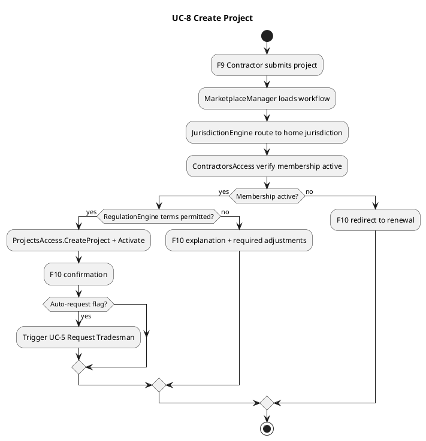

Residue Mapping:

| Residue # | Type | Relevance |
|---|---|---|
| 1 | Structural | RegulationEngine validates jurisdiction-permitted terms |
| 4 | Structural | Workflow Manager pattern |
| 5 | Structural | MessageBus for confirmations and downstream UC-5 trigger |
| 12 | Topological | JurisdictionEngine routes to home-country contractors plane |

Per-use-case NFRs:

| Attribute | Specification | Source |
|---|---|---|
| Project creation latency | F9 to F10: p95 < 2s | Hyperliminal Coupling #4 |
| Regulatory rejection clarity | Rejection F10 includes the specific rule and required remediation | Hyperliminal Coupling #1 |

#### UC-9: Close Project

**Scenarios.**

- **Main:** Contractor requests project close via ContractorsPortal (F25); MarketplaceManager loads close-project workflow; ProjectsAccess returns currently-assigned tradesmen; for each tradesman, UC-7 (Terminate Tradesman) is invoked; final billing computed (sum of disbursements + platform spread); PaymentsAccess.Collect from contractor; ProjectsAccess.Close commits; F26 confirmation + final billing summary.
- **Alternative -- early close with penalties:** RegulationEngine evaluates per-tradesman contract-honoring penalties; reflected in final billing.
- **Alternative -- partial close:** Contractor closes only one trade slot on a multi-trade project; ProjectsAccess records partial close; remaining trade slots continue.
- **Exceptional 1:** Pending dispute on the project -- MarketplaceManager records project as `closed-pending-dispute`; final settlement deferred until UC-7 termination workflows resolve.
- **Exceptional 2:** Outstanding hours not yet reported by all tradesmen -- MarketplaceManager places close in `awaiting-hours` state; reminders to tradesmen via MessageBus; final close when all hours submitted or grace period expires.

Activity diagram:

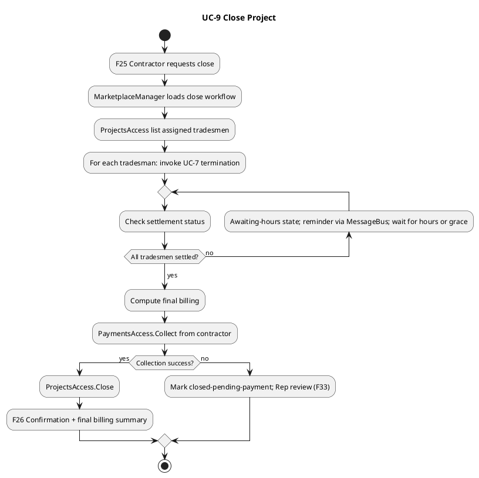

Residue Mapping:

| Residue # | Type | Relevance |
|---|---|---|
| 1 | Structural | RegulationEngine evaluates per-tradesman contract-honoring |
| 4 | Structural | Long-running workflow Manager state (awaiting-hours may take days) |
| 5 | Structural | Reminders + confirmations via MessageBus |
| 6 | Structural | Idempotent collection |
| 7 | Structural | Per-tradesman terminations cascade through UC-7 |
| 8 | Structural | FraudDetectionEngine evaluates pre-close (already evaluated in UC-7 cascade) |

Per-use-case NFRs:

| Attribute | Specification | Source |
|---|---|---|
| Close-to-final-billing latency | F25 to F26 when all tradesmen already settled: < 1 hour. With awaiting-hours, dependent on grace period configured per jurisdiction. | Hyperliminal Coupling #4 |
| Awaiting-hours visibility | Contractor sees outstanding-hours count in real time | Hyperliminal Coupling #5 |

### General Non-functional Requirements

| Attribute | Requirements | Source |
|---|---|---|
| **Scalability** | Horizontal scaling per Manager + Engine + ResourceAccess instance; throughput meets transaction volume across jurisdictions | Capacity-aware provisioning (Business Residue #15) |
| **Availability** | Core matching + payment workflows: 99.9% per jurisdiction; tolerable single-region outage within jurisdiction | Topology row 13 |
| **Performance** | Per-use-case latencies per UC-1, UC-2, UC-3 NFR tables | Hyperliminal Coupling NFRs |
| **Reliability** | No loss of workflow state under Manager restart or region failover; at-least-once event delivery with idempotent consumers | Hyperliminal Coupling #4 + #5 + #6 |
| **Interoperability** | Dapr-based service mesh; CloudEvents standard for MessageBus envelope; OpenTelemetry tracing across all components | Style convention + R-12 |
| **Auditability** | Match decisions retained >= 24 months with full explanation snapshots; payment audit trail indefinite; fraud audit reports on demand | Hyperliminal Coupling #9 + Business Residue #20 |
| **Compliance** | Per-jurisdiction data residency (Topology #12); regulation rule updates within 5min propagation (Hyperliminal Coupling #1) | Topology + Coupling #1 |


### Structural Diagrams

#### Static Architecture (IDesign)

Component Taxonomy:

| Layer | Component | Stereotype | Responsibility | State |
|---|---|---|---|---|
| **Client** | TradesmanPortal | Client | Mobile-first portal: registration, match offers (F12), accept/decline (F13), termination requests (F15), payment notifications (F22), certification status (F30) | -- |
| **Client** | ContractorsPortal | Client | Project creation (F9), request tradesman (F11), assignment confirmations (F14), close project (F25) | -- |
| **Client** | EducationPortal | Client | Education center interface: enrollment forwarding (F28), certification updates (F29) | -- |
| **Client** | MarketplaceApp | Client | Rep / admin console: dispute resolution (F32), fraud flag review (F33), manual overrides | -- |
| **Client** | TimerScheduler | Client (external) | Scheduled triggers (F19 pay cycles, regulatory reporting cycles per F31) -- not part of the system, modeled as a Client per Lowy convention | -- |
| **Manager** | MembershipManager | Manager | Workflow: add/update/terminate tradesman + contractor; membership fees; identity model (person/firm/team); jurisdiction routing | Stateful per workflow instance (workflow Manager pattern) |
| **Manager** | MarketplaceManager | Manager | Workflow: create/activate/close projects, request/match/assign tradesmen, payment cycles, dispute resolution; cross-jurisdiction allowed-flow enforcement | Stateful per workflow instance |
| **Manager** | EducationManager | Manager | Workflow: enrollment, progress tracking, recertification cycles, education provider integration; certification-expiration eventing | Stateful per workflow instance |
| **Engine** | MatchingEngine | Engine | Stateless: produce ranked tradesman candidates given project requirements + regulation filter + rating weights; produces explanation snapshots | Stateless |
| **Engine** | RegulationEngine | Engine | Stateless: evaluate per-jurisdiction compliance rules (certification requirements, wage rules, taxation, reporting); cross-country regulation queries | Stateless |
| **Engine** | FraudDetectionEngine | Engine | Stateless: evaluate patterns over project / member / payment data; produce fraud signals via MessageBus; supports audit-report generation | Stateless |
| **Engine** | RatingEngine | Engine | Stateless: compute weighted quality/safety score per tradesman from rating history; expose pricing-input scores | Stateless |
| **Engine** | JurisdictionEngine | Engine | Stateless: routes calls based on member home jurisdiction; enforces cross-boundary constraints from Topology Residue Map | Stateless |
| **ResourceAccess** | TradesmenAccess | ResourceAccess | Atomic verbs: Register, UpdateProfile, Terminate, LookupByCriteria, ChargeFee. Per-country instance bounded to home-country Tradesmen Resource | Stateless |
| **ResourceAccess** | ContractorsAccess | ResourceAccess | Atomic verbs: Register, UpdateProfile, Terminate, LookupByCriteria, ChargeFee, BillProject. Per-country instance bounded to home-country Contractors Resource | Stateless |
| **ResourceAccess** | ProjectsAccess | ResourceAccess | Atomic verbs: CreateProject, Activate, Close, RecordAssignment, RecordTermination, RecordHours, **RecordPendingMatchState**, **QueryPendingMatches**, **ResumeMatch**, **RecordExplanation** (workflow-state and audit-snapshot verbs added per R-24 to absorb stressors #4, #6, #7, #9, #13 without a separate Workflows Resource) | Stateless |
| **ResourceAccess** | PaymentsAccess | ResourceAccess | Atomic verbs: Charge, Disburse, Collect, Refund, Hold, Reverse, Clawback. Multi-currency aware; routes through Payments external system | Stateless |
| **ResourceAccess** | RegulationsAccess | ResourceAccess | Atomic verbs: GetRules (by jurisdiction + topic), UpdateRules, AuditCompliance, RecordReport | Stateless |
| **ResourceAccess** | EducationAccess | ResourceAccess | Atomic verbs: Enroll, RecordProgress, IssueCertification, RevokeCertification, QueryStatus | Stateless |
| **ResourceAccess** | RatingAccess | ResourceAccess | Atomic verbs: GetRating, RecordRating, UpdateWeights, QueryHistory | Stateless |
| **Resource** | Tradesmen | Resource | Per-country database of tradesman records (identity, skills, rates, banking, certifications references) | -- |
| **Resource** | Contractors | Resource | Per-country database of contractor records (company details, billing, project portfolios) | -- |
| **Resource** | Projects | Resource | Database of projects: required trades, assignments, status, budgets, hours | -- |
| **Resource** | Payments | Resource (external) | Payment processor system(s); the system integrates but does not own | -- |
| **Resource** | Regulations | Resource | Rule store per-jurisdiction; possibly externally sourced from regulatory bodies | -- |
| **Resource** | Education | Resource | Certification records + course progress; partially externally sourced from Education Centers | -- |
| **Resource** | Ratings | Resource | Rating history + weight definitions per tradesman | -- |
| **Utility** | Security | Utility | Authentication + authorization for Manager entry points; jurisdiction-aware authorization | Stateless |
| **Utility** | Logging | Utility | Cross-cutting structured logging via OpenTelemetry | Stateless |
| **Utility** | MessageBus | Utility | Pub/Sub via Dapr + CloudEvents; queued M-to-M (R-04 (d)); cross-region propagation for non-PII events | Stateless |

Call Rules:

| From -> To | Allowed | Notes |
|---|---|---|
| Client -> Manager | yes | Entry point. Prefer async via MessageBus for long-running workflows |
| Manager -> Manager (sync) | no | Forbidden by R-03 |
| Manager -> Manager (queued via MessageBus) | yes | R-04 (d). MarketplaceManager publishes `ChargeCompleted` consumed by MembershipManager fees; EducationManager publishes `CertificationExpired` consumed by MarketplaceManager |
| Manager -> Engine | yes | R-04 (c) |
| Manager -> ResourceAccess | yes | R-04 (b) |
| Manager -> Resource | no | Always through ResourceAccess |
| Engine -> Engine | no | R-03 |
| Engine -> ResourceAccess | yes | R-04 (b) |
| Engine -> Resource | no | Always through ResourceAccess |
| ResourceAccess -> Resource | yes | Only RA touches Resources |
| ResourceAccess -> ResourceAccess | no | R-03; joins happen inside one RA |
| Manager / Engine / ResourceAccess -> Utility | yes | R-04 (a) |
| Client -> Utility | no | Synthesis-tightened R-04 (a); Clients do not call Utilities directly |
| Resource -> Utility | no | Resources are passive |
| Upward calls (Engine -> Manager, RA -> Engine, RA -> Manager, Resource -> anything) | no | Hard rule. R-03 |

Static Architecture diagram:

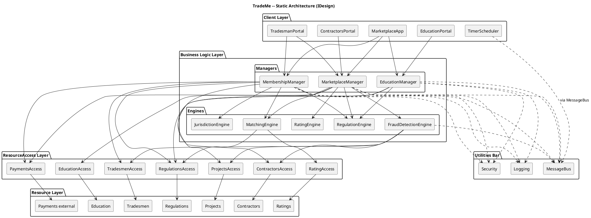

Solid arrows = synchronous calls. Dashed arrows = queued / async via MessageBus or Utility access.

#### C4 Model (Structurizr DSL)

Per R-23, all C4 architecture for TradeMe is expressed as one Structurizr DSL `workspace.dsl`: a single `model` (people, the TradeMe `softwareSystem` with its service / store / queue `container`s nesting IDesign `component`s tagged by layer, the external systems, the relationships, and a per-jurisdiction `deploymentEnvironment`) from which the System Context, Container, per-service Component, and Deployment views are derived. The §Static Architecture (IDesign) diagram above is NOT C4 -- it is PlantUML (`style-conventions` §6.2); the S1b naive baseline is the only Mermaid in a SAD. See `shared/style-conventions.md` §6.1 for the DSL vocabulary, per-level scope, and the IDesign-layer tag/style mapping.

##### Service Grouping Map

Per R-25 (actor-style default: one Manager, one service), the container decomposition in the workspace below is read from this map, not chosen freely. Each Manager is its own service with its private Engines/ResourceAccess co-located inside it; a shared Engine (used by 2+ Managers) becomes its own service only with an operational Topological residue.

| Service / Deployable Unit | IDesign components | Grouping basis |
|---|---|---|
| MembershipService | MembershipManager + MembershipAccess (per-country) | residue #1 (membership / registration volatility) -- Manager service |
| MarketplaceService | MarketplaceManager + ProjectsAccess + PaymentsAccess | residue #5 (marketplace volatility) -- Manager service |
| EducationService | EducationManager + EducationAccess | residue #9 (certification volatility) -- Manager service |
| MatchingService | MatchingEngine | shared by Membership + Marketplace; operational Topological residue (`resource-profile`: matching is compute-heavy and recomputed in bursts, distinct from the workflow services) -> promoted to its own service |
| RegulationService | RegulationEngine + RegulationsAccess | shared by all three Managers; operational Topological residue (`change-cadence`: per-jurisdiction rules change far more often than the workflows) -> its own service |
| JurisdictionRouter | JurisdictionEngine | shared by Membership + Marketplace; operational Topological residue (`security-zone` + topology-aware routing across per-country deployments, ties to Topology residue #13) -> its own service |
| FraudDetectionService | FraudDetectionEngine | called by Marketplace but operates across tradesmen + contractors + projects data with an ML/CPU-bound profile distinct from the I/O-bound workflow; operational Topological residue (`resource-profile`) -> its own service |
| RatingService | RatingEngine + RatingAccess | called by Marketplace but recomputes weighted scores in large bursts independently of request volume; operational Topological residue (`independent-scaling`) -> its own service |

> **R-25 reading.** The three Managers are each their own service (justified by their Structural residues). The five Engine services are each justified by an operational Topological residue: Matching / Regulation / Jurisdiction are shared by 2+ Managers; FraudDetectionEngine and RatingEngine, though called only by Marketplace, carry a distinct runtime profile (`resource-profile` / `independent-scaling`) that a boundary-stressing pass surfaces -- which is why they are separate services rather than co-located in MarketplaceService. Each split traces to a stated cause; none is microservices-by-default. The workspace below matches this map exactly: one service `container` per row.

##### The workspace (`workspace.dsl`)

The container decomposition is read from the §Service Grouping Map (one service `container` per row); each Manager / Engine and its private ResourceAccess are `component`s nested inside their service container, tagged by IDesign layer. Resources are their own `container`s tagged `"Database"`; the message bus is a `container` tagged `"Queue"`. Cross-cutting Security / Logging / Pub-Sub Utilities are represented per service by a single `PubSubUtility` `component` (the Dapr sidecar) tagged `"Utility"`, wired to the Message Bus. The relationships obey the Call Rules (R-03/R-04): Clients reach only Managers; Managers call Engines and ResourceAccess; no Client -> Engine / Client -> ResourceAccess / Engine -> Engine / synchronous Manager -> Manager edge appears.

```dsl
workspace "TradeMe Platform" "Marketplace matching tradesmen to construction projects across jurisdictions" {

    model {
        tradesman = person "Tradesman" "Skilled worker registered on the platform"
        contractor = person "Contractor" "General contractor seeking tradesmen for projects"
        rep = person "Rep / Admin" "Internal TradeMe administrator"

        educationCenter = softwareSystem "Education Center" "External partner providing certifications and continued education" "External"
        paymentProcessor = softwareSystem "Payment Processor" "External infrastructure for disbursements and collections" "External"
        regulator = softwareSystem "Regulatory Authority" "Per-jurisdiction compliance and reporting body" "External"
        timer = softwareSystem "Timer / Scheduler" "External scheduler for pay cycles and periodic reporting" "External"

        trademe = softwareSystem "TradeMe Platform" "Marketplace for matching tradesmen to construction projects across jurisdictions" {

            // --- Client apps (one Client component each) ---
            tradesmanApp = container "Tradesman Mobile App" "Mobile-first portal for tradesmen" "iOS / Android native" {
                tradesmanPortal = component "TradesmanPortal" "Tradesman client" "Mobile" "Client"
            }
            contractorWeb = container "Contractor Web App" "Contractor portal" "React SPA" {
                contractorsPortal = component "ContractorsPortal" "Contractor client" "React" "Client"
            }
            educationWeb = container "Education Web App" "Education center interface" "Web app" {
                educationPortal = component "EducationPortal" "Education center client" "Web" "Client"
            }
            adminConsole = container "Admin / Rep Console" "Internal admin UI" "Web app" {
                marketplaceApp = component "MarketplaceApp" "Internal admin / rep client" "Web" "Client"
            }

            // --- Manager services (Manager + private ResourceAccess + Pub/Sub Utility) ---
            membershipService = container "Membership Service" "Hosts MembershipManager + private ResourceAccess for member data" "API service (Dapr-enabled)" {
                membershipManager = component "MembershipManager" "Orchestrates membership workflows; stateful per workflow instance" ".NET" "Manager"
                tradesmenAccess = component "TradesmenAccess" "Atomic verbs: Register, UpdateProfile, Terminate, LookupByCriteria, ChargeFee" "Library" "ResourceAccess"
                contractorsAccess = component "ContractorsAccess" "Atomic verbs: Register, UpdateProfile, Terminate, LookupByCriteria, ChargeFee, BillProject" "Library" "ResourceAccess"
                membershipPaymentsAccess = component "PaymentsAccess (Membership)" "Membership fee charges; multi-currency" "Library" "ResourceAccess"
                membershipPubSub = component "PubSubUtility (Membership)" "Security + Logging + Pub/Sub via Dapr sidecar" "Dapr" "Utility"
            }

            marketplaceService = container "Marketplace Service" "Hosts MarketplaceManager + ResourceAccess for projects, payments, workflows" "API service (Dapr-enabled)" {
                marketplaceManager = component "MarketplaceManager" "Orchestrates marketplace workflows; stateful per workflow instance" ".NET" "Manager"
                projectsAccess = component "ProjectsAccess" "Atomic verbs: CreateProject, Activate, Close, RecordAssignment, RecordTermination, RecordHours" "Library" "ResourceAccess"
                paymentsAccess = component "PaymentsAccess" "Atomic verbs: Charge, Disburse, Collect, Refund, Hold, Reverse, Clawback; multi-currency" "Library" "ResourceAccess"
                marketplaceRatingAccess = component "RatingAccess (client)" "Read-only verbs against Rating Service: GetRating, QueryHistory" "Library" "ResourceAccess"
                marketplacePubSub = component "PubSubUtility (Marketplace)" "Security + Logging + Pub/Sub via Dapr sidecar" "Dapr" "Utility"
            }

            educationService = container "Education Service" "Hosts EducationManager + ResourceAccess for education" "API service (Dapr-enabled)" {
                educationManager = component "EducationManager" "Orchestrates enrollment + certification lifecycle; cert-expiration eventing" ".NET" "Manager"
                educationAccess = component "EducationAccess" "Atomic verbs: Enroll, RecordProgress, IssueCertification, RevokeCertification, QueryStatus" "Library" "ResourceAccess"
                educationPubSub = component "PubSubUtility (Education)" "Security + Logging + Pub/Sub via Dapr sidecar" "Dapr" "Utility"
            }

            // --- Engine services (each promoted by an operational Topological residue) ---
            matchingService = container "Matching Service" "Hosts MatchingEngine (reused by Membership + Marketplace)" "Stateless API service" {
                matchingEngine = component "MatchingEngine" "Ranks candidates; consults regulation + rating + education filters" ".NET" "Engine"
                matchingRatingAccess = component "RatingAccess (read-only)" "Calls Rating Service for weighted scores" "Library" "ResourceAccess"
                matchingRegulationsAccess = component "RegulationsAccess (read-only)" "Calls Regulation Service for filter rules" "Library" "ResourceAccess"
                matchingEducationAccess = component "EducationAccess (read-only)" "Queries Education DB for cert validity" "Library" "ResourceAccess"
                matchingPubSub = component "PubSubUtility (Matching)" "Security + Logging + Pub/Sub via Dapr sidecar" "Dapr" "Utility"
            }

            regulationService = container "Regulation Service" "Hosts RegulationEngine + RegulationsAccess (rule store)" "Stateless API service" {
                regulationEngine = component "RegulationEngine" "Evaluates per-jurisdiction rules; cross-country queries" ".NET" "Engine"
                regulationsAccess = component "RegulationsAccess" "Atomic verbs: GetRules, UpdateRules, AuditCompliance, RecordReport" "Library" "ResourceAccess"
                regulationPubSub = component "PubSubUtility (Regulation)" "Security + Logging + Pub/Sub via Dapr sidecar" "Dapr" "Utility"
            }

            fraudService = container "Fraud Detection Service" "Hosts FraudDetectionEngine" "Stateless API service" {
                fraudEngine = component "FraudDetectionEngine" "Evaluates patterns across project + member + payment data; produces fraud signals" ".NET" "Engine"
                fraudTradesmenAccess = component "TradesmenAccess (read-only)" "Read access for fraud heuristics" "Library" "ResourceAccess"
                fraudContractorsAccess = component "ContractorsAccess (read-only)" "Read access for fraud heuristics" "Library" "ResourceAccess"
                fraudProjectsAccess = component "ProjectsAccess (read-only)" "Read access for project fraud heuristics" "Library" "ResourceAccess"
                fraudPubSub = component "PubSubUtility (Fraud)" "Security + Logging + Pub/Sub via Dapr sidecar" "Dapr" "Utility"
            }

            ratingService = container "Rating Service" "Hosts RatingEngine + RatingAccess" "Stateless API service" {
                ratingEngine = component "RatingEngine" "Computes weighted quality / safety scores" ".NET" "Engine"
                ratingAccess = component "RatingAccess" "Atomic verbs: GetRating, RecordRating, UpdateWeights, QueryHistory" "Library" "ResourceAccess"
                ratingPubSub = component "PubSubUtility (Rating)" "Security + Logging + Pub/Sub via Dapr sidecar" "Dapr" "Utility"
            }

            jurisdictionRouter = container "Jurisdiction Router" "Hosts JurisdictionEngine; topology-aware routing" "Stateless API service" {
                jurisdictionEngine = component "JurisdictionEngine" "Routes calls based on member home jurisdiction; enforces cross-boundary constraints" ".NET" "Engine"
                jurisdictionPubSub = component "PubSubUtility (Jurisdiction)" "Security + Logging + Pub/Sub via Dapr sidecar" "Dapr" "Utility"
            }

            // --- Resource containers ---
            tradesmenDb = container "Tradesmen DB" "Tradesman records + PII (bounded to home jurisdiction)" "Per-country relational DB" "Database"
            contractorsDb = container "Contractors DB" "Contractor records + PII (bounded to home jurisdiction)" "Per-country relational DB" "Database"
            projectsDb = container "Projects DB" "Projects, assignments, hours" "Relational DB" "Database"
            regulationsDb = container "Regulations Store" "Per-jurisdiction rule store" "Document DB" "Database"
            educationDb = container "Education DB" "Cert + course records" "Relational DB" "Database"
            ratingsDb = container "Ratings DB" "Rating history + weights" "Relational DB" "Database"

            messageBus = container "Message Bus" "Event broker for queued M-to-M and notifications" "Dapr Pub/Sub on Kafka / NATS + CloudEvents" "Queue"
        }

        // --- People -> Clients ---
        tradesman -> tradesmanPortal "Registers, accepts matches, submits hours, receives payments"
        contractor -> contractorsPortal "Creates projects, requests tradesmen, settles billing"
        rep -> marketplaceApp "Resolves disputes, reviews fraud flags, manual overrides"
        educationCenter -> educationPortal "Submits certification updates"
        timer -> messageBus "Posts pay-cycle + reporting events"

        // --- Clients -> Manager entry points (Client -> Manager only) ---
        tradesmanPortal -> membershipManager "Registration + profile" "HTTPS"
        tradesmanPortal -> marketplaceManager "Match accept / hours / payments" "HTTPS"
        contractorsPortal -> marketplaceManager "Project + request flows" "HTTPS"
        educationPortal -> educationManager "Enrollment + status" "HTTPS"
        marketplaceApp -> membershipManager "Admin" "HTTPS"
        marketplaceApp -> marketplaceManager "Admin + dispute review (incl. fraud + audit)" "HTTPS"
        marketplaceApp -> educationManager "Admin" "HTTPS"

        // --- Manager -> Engine (synchronous business logic) ---
        membershipManager -> matchingEngine "Validation at registration" "HTTPS"
        membershipManager -> regulationEngine "Eligibility check" "HTTPS"
        membershipManager -> jurisdictionEngine "Routing" "HTTPS"
        marketplaceManager -> matchingEngine "Ranked candidates" "HTTPS"
        marketplaceManager -> regulationEngine "Filter + contract rules" "HTTPS"
        marketplaceManager -> fraudEngine "Fraud check" "HTTPS"
        marketplaceManager -> jurisdictionEngine "Topology routing" "HTTPS"
        educationManager -> regulationEngine "Required certs per jurisdiction" "HTTPS"

        // --- Manager / Engine -> ResourceAccess (library) ---
        membershipManager -> tradesmenAccess "Library"
        membershipManager -> contractorsAccess "Library"
        membershipManager -> membershipPaymentsAccess "Library"
        marketplaceManager -> projectsAccess "Library"
        marketplaceManager -> paymentsAccess "Library"
        marketplaceManager -> marketplaceRatingAccess "Library"
        educationManager -> educationAccess "Library"
        matchingEngine -> matchingRatingAccess "Library"
        matchingEngine -> matchingRegulationsAccess "Library"
        matchingEngine -> matchingEducationAccess "Library"
        regulationEngine -> regulationsAccess "Library"
        fraudEngine -> fraudTradesmenAccess "Library"
        fraudEngine -> fraudContractorsAccess "Library"
        fraudEngine -> fraudProjectsAccess "Library"
        ratingEngine -> ratingAccess "Library"

        // --- Cross-service read-only RA clients -> owning service Engine (remote read) ---
        marketplaceRatingAccess -> ratingEngine "Read weighted scores" "HTTPS"
        matchingRatingAccess -> ratingEngine "Read weighted scores" "HTTPS"
        matchingRegulationsAccess -> regulationEngine "Read filter rules" "HTTPS"

        // --- ResourceAccess -> Resource ---
        tradesmenAccess -> tradesmenDb "Reads / writes (per-country instance)"
        contractorsAccess -> contractorsDb "Reads / writes (per-country instance)"
        membershipPaymentsAccess -> paymentProcessor "Integrates" "HTTPS"
        projectsAccess -> projectsDb "Reads / writes"
        paymentsAccess -> paymentProcessor "Disburse + collect" "HTTPS"
        educationAccess -> educationDb "Reads / writes"
        educationAccess -> educationCenter "Enrollment forwarding + status pull"
        matchingEducationAccess -> educationDb "Reads cert validity"
        regulationsAccess -> regulationsDb "Reads / writes"
        regulationsAccess -> regulator "Submit compliance reports"
        ratingAccess -> ratingsDb "Reads / writes"
        fraudTradesmenAccess -> tradesmenDb "Reads"
        fraudContractorsAccess -> contractorsDb "Reads"
        fraudProjectsAccess -> projectsDb "Reads"

        // --- Pub/Sub Utilities <-> Message Bus ---
        membershipPubSub -> messageBus "Pub / sub events"
        marketplacePubSub -> messageBus "Pub / sub events"
        educationPubSub -> messageBus "Pub / sub events"
        matchingPubSub -> messageBus "Pub / sub events"
        regulationPubSub -> messageBus "Pub / sub events"
        fraudPubSub -> messageBus "Publishes fraud alerts"
        ratingPubSub -> messageBus "Pub / sub events"
        jurisdictionPubSub -> messageBus "Pub / sub events"
        messageBus -> tradesmanPortal "Notifications"
        messageBus -> contractorsPortal "Notifications"
        messageBus -> marketplaceApp "Notifications"

        // --- Deployment: per-jurisdiction (Topology #12), dual-region (Topology #13), shared non-PII plane ---
        deploymentEnvironment "Production" {
            deploymentNode "AWS UK Jurisdiction" "Cloud provider account" {
                deploymentNode "eu-west-2 (London)" "Primary region" {
                    deploymentNode "EKS Cluster (primary)" "Kubernetes 1.30" {
                        containerInstance membershipService
                        containerInstance marketplaceService
                        containerInstance educationService
                        containerInstance matchingService
                        containerInstance fraudService
                        containerInstance ratingService
                        containerInstance jurisdictionRouter
                    }
                    deploymentNode "RDS UK primary" "Aurora PostgreSQL" {
                        containerInstance tradesmenDb
                        containerInstance contractorsDb
                    }
                }
                deploymentNode "eu-west-1 (Ireland)" "Secondary region (DR)" {
                    deploymentNode "RDS UK secondary" "Aurora PostgreSQL read replica" {
                        containerInstance tradesmenDb
                        containerInstance contractorsDb
                    }
                }
            }
            deploymentNode "AWS Canada Jurisdiction" "Cloud provider account" {
                deploymentNode "ca-central-1 (Montreal)" "Primary region" {
                    deploymentNode "EKS Cluster (primary)" "Kubernetes 1.30" {
                        containerInstance membershipService
                        containerInstance marketplaceService
                        containerInstance educationService
                        containerInstance matchingService
                        containerInstance fraudService
                        containerInstance ratingService
                        containerInstance jurisdictionRouter
                    }
                    deploymentNode "RDS CA primary" "Aurora PostgreSQL" {
                        containerInstance tradesmenDb
                        containerInstance contractorsDb
                    }
                }
                deploymentNode "us-east-1 (CA data-residency exemption)" "Secondary region (DR)" {
                    deploymentNode "RDS CA secondary" "Aurora PostgreSQL read replica" {
                        containerInstance tradesmenDb
                        containerInstance contractorsDb
                    }
                }
            }
            deploymentNode "Shared Plane (non-PII)" "Cross-jurisdiction shared infrastructure" {
                deploymentNode "Shared EKS Cluster" "Kubernetes 1.30" {
                    containerInstance projectsDb
                    containerInstance regulationsDb
                    containerInstance educationDb
                    containerInstance ratingsDb
                    containerInstance messageBus
                }
            }
        }
    }

    views {
        systemContext trademe "SystemContext" {
            include *
            autoLayout
        }
        container trademe "Containers" {
            include *
            autoLayout
        }
        component membershipService "MembershipComponents" {
            include *
            autoLayout
        }
        component marketplaceService "MarketplaceComponents" {
            include *
            autoLayout
        }
        component educationService "EducationComponents" {
            include *
            autoLayout
        }
        component matchingService "MatchingComponents" {
            include *
            autoLayout
        }
        component regulationService "RegulationComponents" {
            include *
            autoLayout
        }
        component fraudService "FraudComponents" {
            include *
            autoLayout
        }
        component ratingService "RatingComponents" {
            include *
            autoLayout
        }
        component jurisdictionRouter "JurisdictionComponents" {
            include *
            autoLayout
        }

        deployment trademe "Production" "ProductionDeployment" {
            include *
            autoLayout
        }

        styles {
            element "Client" {
                background #438dd5
                color #ffffff
            }
            element "Manager" {
                background #c9285b
                color #ffffff
            }
            element "Engine" {
                background #e08a1e
                color #ffffff
            }
            element "ResourceAccess" {
                background #5c9e31
                color #ffffff
            }
            element "Utility" {
                background #6b6b6b
                color #ffffff
            }
            element "Database" {
                shape Cylinder
                background #438dd5
                color #ffffff
            }
            element "Queue" {
                shape Pipe
                background #438dd5
                color #ffffff
            }
            element "External" {
                background #999999
                color #ffffff
            }
        }
    }
}
```

##### Container <-> Component mapping

The `IDesign components inside` column determines which containers need a `component` view: every container with 2+ IDesign components has one (the eight service containers below). The four Client apps host a single Client component each, and the Resource / Queue containers host none, so they are covered by this table alone.

| Container | Technology | IDesign components inside (Level 3) |
|---|---|---|
| Tradesman Mobile App | iOS / Android | TradesmanPortal (Client) |
| Contractor Web App | React SPA | ContractorsPortal (Client) |
| Education Web App | Web app | EducationPortal (Client) |
| Admin / Rep Console | Web app | MarketplaceApp (Client) |
| Membership Service | API (Dapr) | MembershipManager (Manager) + TradesmenAccess + ContractorsAccess + PaymentsAccess (ResourceAccess) + PubSubUtility (Utility) |
| Marketplace Service | API (Dapr) | MarketplaceManager (Manager) + ProjectsAccess + PaymentsAccess + RatingAccess (ResourceAccess) + PubSubUtility (Utility) |
| Education Service | API (Dapr) | EducationManager (Manager) + EducationAccess (ResourceAccess) + PubSubUtility (Utility) |
| Matching Service | Stateless API | MatchingEngine (Engine) + RatingAccess + RegulationsAccess + EducationAccess (read-only ResourceAccess) + PubSubUtility (Utility) |
| Regulation Service | Stateless API | RegulationEngine (Engine) + RegulationsAccess (ResourceAccess) + PubSubUtility (Utility) |
| Fraud Detection Service | Stateless API | FraudDetectionEngine (Engine) + TradesmenAccess + ContractorsAccess + ProjectsAccess (read-only ResourceAccess) + PubSubUtility (Utility) |
| Rating Service | Stateless API | RatingEngine (Engine) + RatingAccess (ResourceAccess) + PubSubUtility (Utility) |
| Jurisdiction Router | Stateless API | JurisdictionEngine (Engine) + PubSubUtility (Utility) |
| Tradesmen / Contractors / Projects DB, Regulations Store, Education / Ratings DB | per Resource | Resources (one `"Database"` container per Resource) |
| Message Bus | Dapr Pub/Sub on Kafka | `"Queue"` container (the Pub/Sub broker the per-service PubSubUtility components front) |

##### Deployment topology

The `deployment` view's top-level `deploymentNode`s correspond to jurisdictional boundaries from Topology Residue #12. Within each jurisdiction, two AWS regions provide active-active replication per Topology Residue #13. Member PII stays in per-jurisdiction `"Database"` containers (Tradesmen / Contractors DB instanced per region); the non-PII stores (Projects, Regulations, Education, Ratings) and the Message Bus live in the shared plane.


Deployment Unit Boundaries:

| Boundary | Topological Residue # | Allowed Cross-Boundary Flows | Forbidden Cross-Boundary Flows |
|---|---|---|---|
| Per-jurisdiction | 12 | Project metadata, FX rates, software releases, regulation rule updates, aggregate analytics, anonymized fraud signals | Member PII (name, contact, banking, location); cross-border matching when both jurisdictions forbid |
| Per-region within jurisdiction | 13 | Workflow state replication; non-PII event propagation; replay events | Synchronous cross-region calls (prefer queued M-to-M); cross-region PII (covered by #12) |

---

## Technical Considerations

| Consideration | Details |
|---|---|
| **Service-oriented approach** | Microservices, each from a Structural residue. |
| **Event-driven architecture** | Dapr Pub/Sub on Kafka/NATS, CloudEvents envelope, queued M-to-M per R-04 (d). |
| **Development technology** | C# / .NET; Dapr sidecar mesh. |
| **Design Patterns** | Circuit Breaker (Dapr); Pub/Sub (Dapr); workflow Manager pattern per Lowy "in theory just another Manager" baseline (R-24); workflow state via domain ResourceAccess. |
| **Deployment** | Per-jurisdiction microservices on EKS; active-active replication intra-jurisdiction (Topology #13). |
| **Documentation and testing** | All services documented; unit + integration tests; sad-auditor at each gate. |
| **Criticality discipline** | Architecture optimizes criticality (R-21) over correctness. Ri=0.83 on iteration 1. |

---

## Restrictions

### Pub/Sub
Only Dapr Pub/Sub component. No external SDKs.

### Event Schema
CloudEvents standard; schemas registered in Backstage.

### Decomposition Discipline (R-13 to R-24)

1. No new structural component without a Structural residue (R-18).
2. No new deployment unit without a Topological residue (R-19).
3. Business decisions documented in Business Residues Log.
4. NFRs traceable to matrix cell / topology row / business residue (R-15).
5. Use cases document, never drive decomposition (R-16).
6. No probability / cost before matrix closure (R-20).
7. No cross-layer merges by signature alone (R-14).
8. Combined residues recorded (R-17).
9. C4 diagrams use Mermaid official syntax + per-level scope (R-23).
10. Lateral cognitive mode is the architect's mindset (R-22).
11. **Residue smallest-set: extend ResourceAccess before introducing new Resources (R-24).**

---

## Appendices

### References

- PRD / SRD (project-specific links).
- Lowy, J. (2019). *Righting Software.* Addison-Wesley. Especially L2163-2186 + L2167 informed R-24.
- O'Reilly, B. M. (2024). *Residues.* Leanpub.
- Kauffman, S. A. (1995). *At Home in the Universe.* Oxford University Press.
- Parnas, D. L. (1972). CACM 15(12).
- Evans, E. (2003). *Domain-Driven Design.* Addison-Wesley.
- IDesign Inc. (2015). *Virtual Method on TradeMe.* Held in `training/`.

### Architecture Decision Records (ADRs)
Future ADRs may cover: cloud provider per jurisdiction; workflow engine introduction (deferred per R-24); message bus broker.

| ADR | Title | Status | Referenced from |
|---|---|---|---|
| | | | |

### Audit Status

| Iteration | Audit date | Mode | Status | Open Violations | Accepted Exceptions | Report |
|---|---|---|---|---|---|---|
| 1 | (pending) | (pending) | (pending) | -- | -- | -- |

### Stressor Source Frameworks
PESTLE / Porter / BMC / abstraction-stressing / flow-stressing. Detail in `shared/stressor-frameworks.md`.

### Glossary
Full vocabulary in `shared/glossary.md`.
