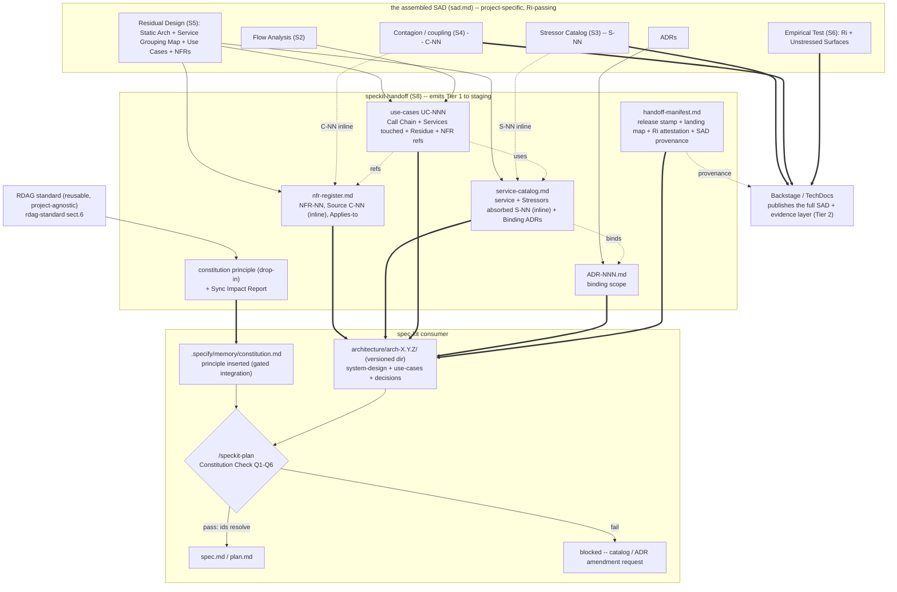

# speckit-handoff (S8)

The handoff sub-skill. It is the **last mile**: it translates an assembled SAD
into the artifacts a Spec-Driven Development project consumes, so that every
generated `spec` and `plan` respects the architecture. It implements the RDAG
standard (`sdd-interface/standard/`) and the per-artifact contracts
(`sdd-interface/contracts/`).

S8 is downstream of the seven sequential sub-skills, not one of them: it does not
do architecture, it **transcribes** a finished architecture into the consumer's
shape. Its discipline mirrors the assembler's: it does not reinterpret the SAD,
it derives each artifact mechanically per its contract, and it refuses rather
than invent. The decomposition driver it carries forward is the **residue**, not
volatility -- every emitted service traces to a Structural stressor, every NFR to
a coupling.

S8 is **split into two gates with a human checkpoint between them**, the same
pattern as S1a/S1b:

- **S8a -- emit (Steps 1-8).** S8a writes the whole handoff to a **staging
  directory** (`<workspace>/handoff/arch-X.Y.Z/`) and **never touches the
  consumer repo**. Emission is self-contained and idempotent. **Stop at gate
  S8a** for operator review.
- **S8b -- land (Step 9, gated).** Only after S8a is `[x] approved` **AND** the
  operator explicitly authorizes landing, S8b copies the staging release into
  the consumer (`architecture/arch-X.Y.Z/`) and applies the constitution
  (scaffold mode: writes `.specify/memory/constitution.md`; insert/replace mode:
  a human inserts the principle -- S8b never clobbers existing implementation
  principles) and the `plan-template` Constitution-Check wiring. Landing runs
  the CHK-01 verbatim diff and leaves an explicit **integration status**.

The executor **never emits S8a and S8b in the same turn**. "Leave the
environment ready" = run S8b **with sign-off**, not silently inside S8a. The
project is never half-integrated without saying so.

---

## When to invoke

- A SAD has been assembled (S7) and its S6 Residual Index is **passing**.
- The architecture is to be handed to a development team running spec-kit (or
  another constitution-gated SDD framework).
- A re-emission is needed after a new SAD iteration changed the architecture.

## When NOT to invoke

- S7 has not produced `sad.md`, or any prior gate is unapproved. Emit nothing
  from an incomplete SAD.
- The S6 Ri is negative or absent (CHK-15). An un-validated architecture has no
  right to generate downstream artifacts.
- The user wants S8 to edit the consumer's repository directly. S8 emits files;
  application to the consumer is the integration step (gated, human-confirmed).
- The user wants to add a service or change the decomposition. That is
  architecture work (S1-S5), not handoff. S8 transcribes; it does not decompose.

## Pre-conditions

**For S8a (emit):**

- The **S7 gate is `[x] approved`** in the gate tracker (`FLOW.md`), and through
  it all of S1-S6 (root `SKILL.md` §Gate approval protocol).
- The S6 Residual Index verdict is **Passing** (CHK-15).
- The assembled `sad.md` (or the six approved fragments) is available, plus any
  ADRs.

**For S8b (land) -- additional:**

- The **S8a gate is `[x] approved`** in the tracker (the staged handoff was
  reviewed and approved by the operator).
- The operator has **explicitly authorized landing** ("apply the handoff" /
  equivalent). S8b never lands implicitly.
- The target release directory `architecture/arch-X.Y.Z/` does **not yet
  exist** in the consumer (a published release is immutable; emit a new version
  to change an existing release).

## Handoff contract

- **Consumes:** the assembled `sad.md` (or its fragments) -- specifically the
  Stressor Catalog (S3), Contagion Matrix + Coupling/Topology/Business readings
  (S4), Static Architecture + Service Grouping Map + Use Cases + Derived NFRs
  (S5), Empirical Test + Unstressed Surfaces (S6), and any ADRs. Plus the RDAG
  standard and contracts (read-only).
- **Produces:** the RDAG handoff set (see Output contract): seven artifact types
  + handoff-manifest + the drop-in principle block + a Sync Impact Report draft,
  in the consumer's landing-zone layout, written to a staging directory.
- **Lateral context to carry forward:** none new -- S8 is transcription. The job
  is fidelity (residue lineage resolves, naming is Lowy, ids are append-only),
  not reasoning.

## Workflow

The workflow is split across two gates with a human checkpoint between them.

### S8a -- emit (Steps 1-8; produces the staged handoff, never touches consumer)

### Step 1 -- Verify the emission precondition (CHK-15)

Confirm S7 assembled and S6 Ri is Passing. If not, refuse (Refusal #1/#2). This
is the producer-side strength gate: no handoff from an un-validated SAD.

### Step 2 -- Establish ids (append-only)

Per `sdd-interface/standard/rdag-id-scheme.md`. Mint/confirm the global ids:
`S-NN` (stressors), `C-NN` (couplings), `NFR-NN`, service names (Lowy suffix),
`UC-NNN`, `ADR-NNN`, `U-NN`. If a prior handoff exists, ids are **append-only**:
add or deprecate, never renumber or reuse. Normalize SAD service names to the
Lowy suffix convention (`*Manager` / `*Engine` / `*Access`); record any
`old -> new` rename mapping.

> S8 does **not** emit the SAD's evidence layer (stressor catalog, coupling map,
> criticality certificate). That is **Tier 2**, published via Backstage. The
> handoff carries the resolvable conclusions **inline** (the catalog's
> Stressors-absorbed `S-NN`; the nfr-register's Source `C-NN`).

### Step 3 -- Emit the NFR register

1. **`nfr-register.md`** (per `nfr-register-contract.md`) from S5 NFRs (derived
   from the SAD's S4 coupling analysis): one register, every NFR `NFR-NN` with
   `Source` = a `C-NN` recorded **inline** and `Applies-to` = `System` or an
   enumerated UC set (scope follows the inducing coupling's reach).

### Step 4 -- Emit the architecture layer

2. **`service-catalog.md`** (per `catalog-contract.md`) from Static Architecture
   + Service Grouping Map: Lowy names; per service record **Stressors absorbed**
   (the `S-NN` it is the residue of -- Structural by R-18, the resolvable
   conclusion; full stressor analysis is SAD-side) and **Residue (narrative)**
   derived from those stressors (NOT a "volatility" judgment); call rules (May
   call / May NOT call); Binding ADRs.
3. **ADRs** (`ADR-NNN.md`, per `adr-contract.md`): for each runtime/protocol/
   middleware decision, set `Binding: Yes` and state Claims / Constrains /
   Conformance check. Per-project ADRs may name technology (the agnosticism
   boundary).

### Step 5 -- Emit the use cases (primary only)

4. **`uc-NNN-*.md`** (per `use-case-contract.md`): emit the **primary** use cases
   that shaped the architecture (derive them from S5 Use Cases / S2 Flow
   Analysis if the SAD has no formal UC section). Each has the verbatim
   Architectural Context block (Call Chain + Services touched + Residue), every
   touched service present in the catalog, NFRs referenced by id. The UC set is
   open -- the team adds more later (use-case-contract §6).

### Step 6 -- Emit the anchor

5. **`handoff-manifest.md`** (per `handoff-manifest-contract.md`): one release
   stamp across the Tier-1 set; artifact inventory with landing zones; binding
   ADRs enumerated; back-channels; the **Ri-passing attestation** (the Ri value
   from S6) and a **provenance pointer to the SAD on Backstage** (where the
   evidence layer lives). The criticality certificate itself is not emitted.

### Step 7 -- Emit the integration inputs (still S8a; to staging)

S8 writes the integration artifacts into `handoff/arch-X.Y.Z/integration/`. It
does **not** touch the consumer here -- that is Phase 2 (Step 9).

- `principle-decomposition-by-residue.md` -- the **agnostic** drop-in principle:
  the normative text of `rdag-standard.md` §6 **verbatim**. It names **no
  concrete technology** (CHK-05). Concrete bindings (Dapr, a broker, ...) live in
  the **Current Architecture** record, NEVER inside the principle's clauses.
- `constitution.scaffold.md` (scaffold mode) -- the full consumer constitution,
  ready to drop: a `PENDING` banner; the **Current Architecture** record (this is
  where the concrete binding ADRs are named); the principle **copied
  byte-for-byte** from the block above as a clearly bounded section; and the
  implementation half as `[TODO]` stubs.
- `plan-template-constitution-check.md` -- the **gate wiring** that makes CHK-03
  true (see below).
- `sync-impact-report.md` -- the integration diff/guide; in **insert/replace**
  mode it carries the **reconciliations table** (see below).

**The CHK-03 wiring (#2).** RDAG requires Q1-Q6 to be **NON-WAIVABLE**, but
spec-kit's stock `plan-template.md` has a generic Complexity Tracking section
that lets any violation be "justified" -- including an architecture one. So S8
emits a `plan-template` Constitution-Check block split into two tiers:

- **Tier 1 (Q1-Q6, architecture, NON-WAIVABLE):** a "no" is a hard stop ->
  catalog/ADR amendment request; **excluded** from Complexity Tracking.
- **Tier 2 (implementation):** waivable via Complexity Tracking as usual.

Phase 2 applies this. Without it CHK-03 is merely assumed; with it the gate is
true by construction.

**Insert/replace: merge an existing constitution (#1).** When the consumer has a
real implementation constitution, S8 runs the **merge sub-flow** (it does NOT
overwrite):

1. **Classify** each host principle as architecture-half or implementation-half.
2. **Detect a competing decomposition principle.** The canonical clash is a host
   "Service Decomposition by **Volatility**" (IDesign-by-volatility shops adopting
   RDAG-by-residue -- the most likely real-world conflict). It is a **CHK-04
   conflict**: mark it **superseded** by the Residue principle (Architecture
   Supremacy); do NOT merge the two.
3. **Emit the Sync Impact Report with a pre-skeletoned reconciliations table**:
   naming (`Mgr*/Eng*/RA*` -> `*Manager/*Engine/*Access`), catalog (flat ->
   versioned release), messaging (-> binding ADR), authz (-> residue) -- one row
   each to confirm. Implementation-half principles (Tech Stack, I-VI, ...) import
   verbatim; only the competing decomposition principle is superseded.

### Step 8 -- Conformance self-check on the staged set (closes S8a; STOP at gate)

Run **CHK-06..15** + the completeness test **CHK-T** over the staged set. Also
verify the principle in `constitution.scaffold.md` is **byte-identical** to
`principle-decomposition-by-residue.md` (CHK-01 at emission) and carries no
concrete technology in its clauses (CHK-05). If any fails, refuse -- do not stage
a non-conformant handoff. On pass, present the staged handoff and **stop**:
landing needs explicit authorization.

> **Run the deterministic gate before declaring S8a complete.** The mechanical
> core of CHK-11/12/14 is a tested script, not prose to eyeball
> (`shared/mechanical-determinism-snippet.md`). Run
> `python3 scripts/fragment-checks/check_handoff.py handoff/arch-X.Y.Z` over the
> staged dir: it reconciles the manifest Artifact-inventory against the files
> actually emitted (both directions), every recited "N services" / "N binding
> ADRs" count against its enumerated tally, and every enumerated binding ADR
> against a locatable `decisions/ADR-*.md`. A non-zero exit is a hard stop on S8a
> -- fix the manifest/inventory or emit the missing artifact; do not stage a
> handoff that fails it. (It is self-contained over the staged set; it never
> opens the SAD.) The remaining CHK-NN (naming, lineage, call rules, CHK-T) stay
> heuristic review above.

### S8b -- land (Step 9; gated by S8a `[x]` + operator authorization)

### Step 9 -- Land into the consumer (writes the consumer; never runs in the same turn as S8a)

Only after the operator **authorizes** landing:

1. **Copy** the staged release `handoff/arch-X.Y.Z/` -> the consumer's
   `architecture/arch-X.Y.Z/`. If that release directory already exists, refuse
   (a published release is immutable; emit a new version instead).
2. **Constitution.** *Scaffold mode:* drop `constitution.scaffold.md` ->
   `.specify/memory/constitution.md` as a **mechanical copy** (never a rewrite),
   preserving any SAD-workflow constitution found there aside
   (`docs/architect/sad-workspace-constitution.md`). *Insert/replace mode:* a
   human inserts the principle per the Sync Impact Report; S8 never clobbers
   existing implementation principles.
3. **Gate wiring.** Apply `plan-template-constitution-check.md` to the consumer's
   `plan-template.md` (two-tier Constitution Check; Q1-Q6 out of Complexity
   Tracking).
4. **CHK-01 diff at landing (#3).** `diff` the principle as landed in
   `.specify/memory/constitution.md` against the emitted block. A mismatch fails
   **now**, at landing -- not only if someone later runs the auditor.
5. Verify **CHK-01..05** and leave the explicit integration status (`PENDING`
   until the implementation half is filled / the principle inserted).

Phase 2 is the only step that writes the consumer; it runs once, authorized, and
is auditable (`sad-auditor` `handoff` mode).

## Output contract

Written to a **staging directory** (default `<sad-workspace>/handoff/`, or a
target path given at invocation), in the consumer's landing-zone layout:

```text
handoff/
  arch-X.Y.Z/                 # the immutable, versioned release directory
    handoff-manifest.md
    system-design/
      service-catalog.md
      nfr-register.md
    use-cases/
      uc-NNN-*.md
    decisions/
      ADR-NNN.md
    integration/
      principle-decomposition-by-residue.md   # agnostic drop-in block (CHK-05)
      constitution.scaffold.md                 # scaffold mode: ready-to-drop consumer constitution
      plan-template-constitution-check.md      # the CHK-03 gate wiring (two tiers)
      sync-impact-report.md                    # integration diff; carries the reconciliations table in insert/replace
```

The SAD's evidence layer (stressor catalog, coupling map, criticality
certificate) is **not** in this set -- it is published via Backstage.

Each artifact conforms to its contract in `sdd-interface/contracts/`.

**Phase 1 (Steps 1-8) writes only to staging.** S8 never touches the consumer
during emission -- not the `architecture/` tree, not `.specify/`, not
`plan-template.md`. The staged release is self-contained and auditable.

**Phase 2 (Step 9) lands into the consumer**, only on explicit authorization: it
copies `handoff/arch-X.Y.Z/` -> `architecture/arch-X.Y.Z/` (a new release is a
new directory, never an in-place rewrite -- `Current`/`Target` coexist physically
during a migration); applies the constitution (scaffold mode: mechanical copy of
`constitution.scaffold.md` -> `.specify/memory/constitution.md`; insert/replace
mode: human-applied); applies the `plan-template-constitution-check.md` wiring;
runs the CHK-01 verbatim diff at landing. Phase 2 always leaves an explicit
integration status (`PENDING` until the implementation half is filled / the
principle inserted).

## Mapping diagram

How a SAD becomes the artifacts a consumer's constitution gates against -- the
whole picture in one view: emission (SAD fragment -> artifact), id traces (what
makes the handoff resolvable), landing (staging -> consumer, gated), and the
gate that resolves it.



**Reading the diagram.**

- **Solid arrows (`-->`) = emission.** The **Tier-1** artifacts derive from the
  one assembled SAD (Step 3-6): S5 feeds the NFR register, the catalog, and the
  use cases; use cases also draw their call chains from S2 Flow Analysis; ADRs
  feed the binding-ADR files.
- **Dotted "inline" arrows = the resolvable lineage carried inside Tier 1.** The
  SAD's `S-NN` (S3) live inline in the catalog's Stressors-absorbed field; the
  `C-NN` (S4) live inline in the nfr-register's Source field. That inline id is
  exactly what the gate resolves -- the full stressor / coupling analysis is not
  shipped.
- **Tier 2 is published, not emitted.** The evidence layer (stressor catalog,
  coupling map, criticality certificate) goes to **Backstage / TechDocs** as part
  of the published SAD; it is **not** in the handoff. The manifest carries a
  `provenance` pointer to it.
- **Two things do NOT come from the project SAD.** The **constitution principle**
  comes from the reusable **RDAG standard** (`rdag-standard` sect.6) -- the same
  architecture-half doctrine for every project, only versioned. The
  **handoff-manifest** is emission-generated by S8 (release stamp + landing map +
  Ri attestation + SAD provenance).
- **Dotted id traces inside the handoff:** use cases `use` catalog services and
  `ref` `NFR-NN`; the catalog `binds` ADRs.
- **Thick arrows (`==>`) = landing / publishing.** S8 writes Tier 1 to
  **staging** in Phase 1 (never to the consumer). **Phase 2 (gated,
  authorized)** copies staging -> the consumer's `architecture/arch-X.Y.Z/` and,
  in **scaffold mode**, copies the principle into `.specify/memory/constitution.md`
  (never the `architecture/governance/` mirror); in **insert/replace mode** a
  human inserts the principle (S8 never clobbers existing implementation
  principles). The evidence layer publishes to Backstage.
- **The gate.** At `/speckit-plan`, the Constitution Check (Q1-Q6) reads the
  constitution and resolves the cited ids against the landed Tier-1 artifacts --
  it passes to `spec.md`/`plan.md`, or blocks into a catalog/ADR amendment request.

## Refusal conditions

| # | Trigger | Returned message |
|---|---|---|
| 1 | S7 has not assembled `sad.md`, or a prior gate is unapproved. | Name the missing/unapproved gate. Complete the SAD chain first. |
| 2 | S6 Ri is negative or absent (CHK-15). | Refuse. An un-validated SAD produces no handoff. Direct the user to S6 (or to backtrack). |
| 3 | A service has no Structural `S-NN` (R-18 / CHK-07). | Name the service. Either it traces to a Structural residue or it is not a service -- fix in S5/S4, not here. |
| 4 | An NFR has no `C-NN` source (R-15 / CHK-08). | Name the NFR. Every NFR traces to a coupling; an ungrounded NFR is fixed in S5/S4. |
| 5 | A service name violates the Lowy suffix convention (CHK-06). | Name it. S8 normalizes to `*Manager`/`*Engine`/`*Access`; an irreducible functional/verb name is an upstream naming error (R-06). |
| 6 | A cited id does not resolve at the release stamp (CHK-11). | Name the broken trace. The handoff is not coherent until it resolves. |
| 7 | A binding ADR is not locatable from the catalog/manifest (CHK-12). | Name the ADR. Question 6 of the gate could not enumerate it. |
| 8 | The inline lineage (catalog Stressors-absorbed / nfr-register Source) would carry probability or cost (R-20). | Refuse. Probability/cost belong to downstream FMEA/ATAM, never the handoff the gate reads. |
| 9 | Ids would be renumbered/reused vs a prior handoff (CHK-13). | Refuse. Ids are append-only; deprecate, never reuse. |
| 9b | The existing `.specify/memory/constitution.md` carries implementation principles and would be overwritten. | Refuse the overwrite. S8 scaffolds only a *greenfield* constitution; an existing one with impl principles is **insert/replace** (human-applied): emit the principle block + Sync Impact Report, never clobber. |
| 9c | The existing constitution is a **SAD-workflow constitution** (governs SAD production, not implementation). | Treat it as "no consumer constitution": preserve it aside (`docs/architect/sad-workspace-constitution.md`) and scaffold the consumer one. Do NOT use it as the consumer's gate constitution. |
| 10 | Phase 2 would edit an already-published release directory (`architecture/arch-X.Y.Z/` that exists). | Refuse. A published release is immutable; emit a NEW `arch-X.Y.Z+1/` with a migration delta instead (rdag-standard sect.11). |
| 10b | Phase 1 (emit) would write into the consumer (`architecture/`, `.specify/`, `plan-template.md`). | Refuse. Phase 1 is staging-only; consumer writes belong to Phase 2 (authorized). |
| 10c | Phase 2 (land) invoked without explicit operator authorization. | Refuse. Landing is gated -- requires sign-off. |
| 10d | CHK-01 diff at landing fails (the principle as landed is not byte-identical to the emitted block). | Refuse. The principle is a mechanical copy, not a rewrite. Re-land from `integration/principle-decomposition-by-residue.md`. |
| 11 | The completeness test fails (CHK-T): an operation cannot be implemented from the emitted set alone. | Name the gap. A missing field or artifact -- fix the emission, not the consumer. |

## Worked example

`sdd-interface/examples/ev-charging/` is the **golden output** of this sub-skill:
the Tier-1 handoff emitted from `sad/examples/ev-charging-sad.md`. It demonstrates
every Step above -- the Lowy-named catalog with its `S-01..S-15` lineage inline,
the nfr-register (`NFR-01..08`) with `C-01..C-08` Source inline, the Dapr binding
ADR (`ADR-001`), two primary use cases derived from the Flow Analysis, and the
manifest -- in the consumer's landing-zone layout. The SAD's evidence layer (the
full stressor catalog, coupling map, and Ri=0.67 certificate with `U-01`) is
Tier 2: referenced inline by id, published via Backstage, not in the handoff. It
also shows the discipline holding: `GridReportingAccess` stayed out of the active
catalog because it traced to a test stressor, not a design `S-NN`.

## Why these rules

- **Transcription, not reasoning.** S8 deriving artifacts mechanically (never
  inventing a service, an NFR, or a name) is what keeps the handoff faithful to
  the audited SAD. Any new reasoning belongs upstream.
- **Residue lineage by id.** Carrying resolvable `S-NN`/`C-NN` ids inline (in
  the catalog and nfr-register) upgrades the consumer's gate from "is this
  credible?" (judgment) to a mechanical check -- without shipping the full
  evidence layer (that is on Backstage). It is the whole point of the handoff
  being strong.
- **Emit, do not apply.** Keeping application to the consumer a separate gated
  step honors that the consumer repository is owned by the dev team; S8 produces
  inputs for an integration the team approves.
- **Passing Ri precondition.** The handoff is the moment the architecture leaves
  the architect's hands; gating it on a validated SAD prevents an untested
  architecture from shaping implementation.

## References

- `sdd-interface/standard/rdag-standard.md` -- the doctrine, the drop-in
  principle (§6), Architecture Supremacy (§4), the completeness test (§8).
- `sdd-interface/standard/rdag-id-scheme.md` -- ids and the append-only rule.
- `sdd-interface/standard/rdag-conformance.md` -- CHK-06..15 + CHK-T (Step 8).
- `scripts/fragment-checks/check_handoff.py` -- the tested hard-fail script that
  makes the deterministic subset of CHK-11/12/14 mechanical at the close of S8a.
- `sdd-interface/contracts/` -- one contract per emitted artifact (schema + the
  field-by-field mapping from the SAD).
- `sdd-interface/examples/ev-charging/` -- the golden output.
- `shared/constitution.md` -- R-15, R-18, R-20, R-24, R-25 (the rules the
  emitted artifacts carry forward).
- `shared/style-conventions.md` -- US-ASCII, mermaid, naming, frontmatter.
