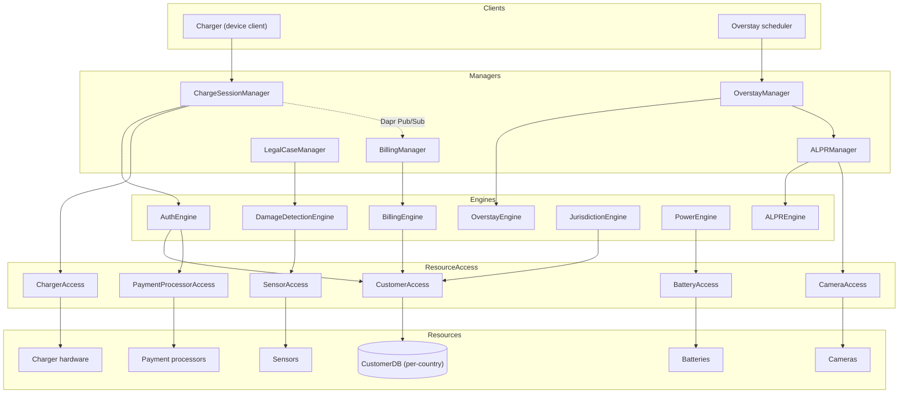

# Service Catalog -- EV Charging Network

| | |
|---|---|
| **Architecture Release** | arch 1.0.0 (Status: Current; worked example) |
| **Owner** | Architecture Team |
| **Status** | Worked example -- emitted from `sad/examples/ev-charging-sad.md` §10 + §4 |
| **Constitutional reference** | RDAG "Service Decomposition by Residue" |

> Worked example exercising `../../../../contracts/catalog-contract.md`. Names use the
> Lowy suffix convention. Every entry lists the Structural `S-NN` it is the
> residue of (R-18) -- the resolvable conclusion inline; the full stressor
> analysis is SAD-side (published via Backstage), not in the handoff.

## Changelog

- **arch 1.0.0** (Current) -- Initial release from the EV Charging residual
  architecture; an immutable snapshot in `architecture/arch-1.0.0/`. No prior
  release, so no migration delta and no migration in progress (rdag-standard
  sect.11). All entries `Active`.

## Conventions

`<Thing>Manager` (orchestration residue), `<Thing>Engine` (stateless rule set),
`<Thing>Access` (I/O to one Resource), Resource (leaf). Functional/verb names are
review blockers.

## Static Diagram

> Manager-to-Manager communication is async via Dapr Pub/Sub only (dotted edge),
> never synchronous -- see `ADR-001` (binding).

## Catalog Entries

### Managers

#### `ChargeSessionManager`
| Field | Value |
|---|---|
| Category | Manager |
| Status | Active |
| Introduced in | UC-001 (residue S-09) |
| Stressors absorbed | S-03, S-09 |
| Residue (narrative) | The charge-session workflow (authenticate -> start -> stop -> unlock) and its resumability when the cloud fails mid-session. The residue is the orchestration order and its degraded-mode recovery -- what survives stressors S-03 and S-09 -- isolated here so a server failure is a workflow concern, not a hardware one. |
| Used by | UC-001 |
| May call | AuthEngine, ChargerAccess (downward); BillingManager via Dapr Pub/Sub (`ChargeCompleted`). |
| May NOT call | Any Manager synchronously; any Resource directly. |
| State | Stateless service; workflow state is per-session and resumable. |
| Binding ADRs | ADR-001 (Dapr Pub/Sub for cross-Manager events). |

#### `ALPRManager`
| Field | Value |
|---|---|
| Category | Manager |
| Status | Active |
| Introduced in | UC-001 (residue S-03) |
| Stressors absorbed | S-03, S-12 |
| Residue (narrative) | The license-plate-recognition auth/identification path, added when the key fob broke (S-03) and reused for abandoned-car detection (S-12). |
| Used by | UC-001, UC-002 |
| May call | ALPREngine, CameraAccess (downward). |
| May NOT call | Any Manager synchronously; any Resource directly. |
| State | Stateless. |

#### `BillingManager`
| Field | Value |
|---|---|
| Category | Manager |
| Status | Active |
| Introduced in | UC-001 (residue S-10) |
| Stressors absorbed | S-03, S-09, S-10, S-12, S-13 |
| Residue (narrative) | The billing/reconciliation workflow, decoupled from authentication (S-03) so the payer identity is swappable. Absorbs billing-error reconciliation (S-10) and respects per-country data residency (S-13). |
| Used by | UC-001, UC-002 |
| May call | BillingEngine (downward); receives `ChargeCompleted` via Dapr Pub/Sub. |
| May NOT call | Any Manager synchronously; any Resource directly. |
| State | Stateless. |
| Binding ADRs | ADR-001. |

#### `OverstayManager`
| Field | Value |
|---|---|
| Category | Manager |
| Status | Active |
| Introduced in | UC-002 (residue S-12) |
| Stressors absorbed | S-12 |
| Residue (narrative) | The async, time-based overstay workflow (a car left in a slot after charging). Isolated (matrix Sigma=1) so it stays safely evolvable. |
| Used by | UC-002 |
| May call | OverstayEngine (downward); ALPRManager via Dapr Pub/Sub for plate identification. |
| May NOT call | Any Manager synchronously; any Resource directly. |
| State | Stateless. |
| Binding ADRs | ADR-001. |

#### `LegalCaseManager`
| Field | Value |
|---|---|
| Category | Manager |
| Status | Active |
| Introduced in | UC-002 (residue S-08) |
| Stressors absorbed | S-08 |
| Residue (narrative) | The damage / abuse case workflow (evidence assembly for accidents, criminal damage, ICE-ing). Builds the legal trail S-14 relies on. |
| Used by | UC-002 |
| May call | DamageDetectionEngine (downward). |
| May NOT call | Any Manager synchronously; any Resource directly. |
| State | Stateless. |

### Engines

#### `AuthEngine`
| Field | Value |
|---|---|
| Category | Engine |
| Status | Active |
| Introduced in | UC-001 (residue S-03) |
| Stressors absorbed | S-03, S-15 |
| Residue (narrative) | The auth method set: RFID, plate (S-03), card (S-15, AFIR). Auth mechanism is a runtime parameter, not a structural decision -- adding a method is local here. |
| Used by | UC-001 |
| May call | CustomerAccess, PaymentProcessorAccess (downward). |
| May NOT call | Any Manager. |
| State | Stateless. |

#### `ALPREngine`
| Field | Value |
|---|---|
| Category | Engine |
| Status | Active |
| Introduced in | UC-001 (residue S-03) |
| Stressors absorbed | S-03, S-12 |
| Residue (narrative) | Plate-recognition rules (match, confidence, normalization). |
| Used by | UC-001, UC-002 |
| May call | CameraAccess (downward). |
| May NOT call | Any Manager. |
| State | Stateless. |

#### `BillingEngine`
| Field | Value |
|---|---|
| Category | Engine |
| Status | Active |
| Introduced in | UC-001 (residue S-10) |
| Stressors absorbed | S-06, S-10, S-12 |
| Residue (narrative) | Pricing and waive rules, per-minute overstay fees (S-12), waive policy for billing errors (S-10), and non-charging revenue pricing (S-06, config-driven). |
| Used by | UC-001, UC-002 |
| May call | CustomerAccess (downward). |
| May NOT call | Any Manager. |
| State | Stateless. |

#### `OverstayEngine`
| Field | Value |
|---|---|
| Category | Engine |
| Status | Active |
| Introduced in | UC-002 (residue S-12) |
| Stressors absorbed | S-12 |
| Residue (narrative) | Per-minute overstay-fee rules. Isolated (matrix Sigma=1). |
| Used by | UC-002 |
| May call | -- (rule-only). |
| May NOT call | Any Manager. |
| State | Stateless. |

#### `JurisdictionEngine`
| Field | Value |
|---|---|
| Category | Engine |
| Status | Active |
| Introduced in | UC-001 (residue S-13) |
| Stressors absorbed | S-13 |
| Residue (narrative) | Per-jurisdiction data-handling rules driving which country instance serves a customer (paired with topological residue S-13). |
| Used by | UC-001 |
| May call | CustomerAccess (downward). |
| May NOT call | Any Manager. |
| State | Stateless. |

#### `PowerEngine`
| Field | Value |
|---|---|
| Category | Engine |
| Status | Active |
| Introduced in | UC-001 (residue S-02) |
| Stressors absorbed | S-02 |
| Residue (narrative) | Power-source selection rules (prefer grid, fall back to battery). |
| Used by | UC-001 |
| May call | BatteryAccess (downward). |
| May NOT call | Any Manager. |
| State | Stateless. |

#### `DamageDetectionEngine`
| Field | Value |
|---|---|
| Category | Engine |
| Status | Active |
| Introduced in | UC-002 (residue S-08) |
| Stressors absorbed | S-08 |
| Residue (narrative) | Damage-classification rules from sensor/impact signals. |
| Used by | UC-002 |
| May call | SensorAccess (downward). |
| May NOT call | Any Manager. |
| State | Stateless. |

### ResourceAccess

#### `CustomerAccess`
| Field | Value |
|---|---|
| Category | ResourceAccess |
| Status | Active |
| Introduced in | UC-001 (residues S-03, S-13) |
| Stressors absorbed | S-03, S-13 |
| Residue (narrative) | Subscription/customer persistence, deployed **per country** for data residency (S-13). Replacing the store or the residency partitioning is confined here. |
| Used by | UC-001, UC-002 |
| Resource | CustomerDB (per-country). |
| May call | Its Resource only. |
| May NOT call | Any Manager, Engine, or other ResourceAccess. |
| State | Stateless (Resource holds state). |

#### `ChargerAccess`
| Field | Value |
|---|---|
| Category | ResourceAccess |
| Status | Active |
| Introduced in | UC-001 (residues S-01, S-02, S-08, S-09) |
| Stressors absorbed | S-01, S-02, S-08, S-09 |
| Residue (narrative) | Hardware abstraction (`StartCharge`/`StopCharge`/`Unlock`/`EndSession`), polymorphic over connector/protocol/firmware (S-01) and capable of degraded local unlock when the cloud is unreachable (S-09). The hottest surface (boundary to the physical world). |
| Used by | UC-001 |
| Resource | Charger hardware. |
| May call | Its Resource only. |
| May NOT call | Any Manager, Engine, or other ResourceAccess. |
| State | Stateless service; may cache a time-bounded unlock credential at the device. |

#### `CameraAccess`
| Field | Value |
|---|---|
| Category | ResourceAccess |
| Status | Active |
| Introduced in | UC-001 (residues S-03, S-08, S-12) |
| Stressors absorbed | S-03, S-08, S-12 |
| Residue (narrative) | Camera I/O: plate-capture frames (S-03/S-12) and security feed (S-08). |
| Used by | UC-001, UC-002 |
| Resource | Cameras. |
| May call | Its Resource only. |
| May NOT call | Any Manager, Engine, or other ResourceAccess. |
| State | Stateless. |

#### `SensorAccess`
| Field | Value |
|---|---|
| Category | ResourceAccess |
| Status | Active |
| Introduced in | UC-002 (residue S-08) |
| Stressors absorbed | S-08 |
| Residue (narrative) | Impact/tilt sensor I/O for damage detection. |
| Used by | UC-002 |
| Resource | Sensors. |
| May call | Its Resource only. |
| May NOT call | Any Manager, Engine, or other ResourceAccess. |
| State | Stateless. |

#### `BatteryAccess`
| Field | Value |
|---|---|
| Category | ResourceAccess |
| Status | Active |
| Introduced in | UC-001 (residue S-02) |
| Stressors absorbed | S-02 |
| Residue (narrative) | Battery I/O for fallback power when grid fails. |
| Used by | UC-001 |
| Resource | Batteries. |
| May call | Its Resource only. |
| May NOT call | Any Manager, Engine, or other ResourceAccess. |
| State | Stateless. |

#### `PaymentProcessorAccess`
| Field | Value |
|---|---|
| Category | ResourceAccess |
| Status | Active |
| Introduced in | UC-001 (residue S-15, AFIR) |
| Stressors absorbed | S-15 |
| Residue (narrative) | I/O to external payment processors for card-based payment, added by AFIR. Swapping processors is confined here. |
| Used by | UC-001 |
| Resource | Payment processors (external). |
| May call | Its Resource only. |
| May NOT call | Any Manager, Engine, or other ResourceAccess. |
| State | Stateless. |

### Resources

| Resource | Type | Accessed by | Notes |
|---|---|---|---|
| CustomerDB (per-country) | Resource | `CustomerAccess` only | One instance per jurisdiction (S-13). Technology per implementation half. |
| Charger hardware | Resource | `ChargerAccess` only | Physical device; polymorphic over connector/protocol. |
| Cameras | Resource | `CameraAccess` only | -- |
| Sensors | Resource | `SensorAccess` only | -- |
| Batteries | Resource | `BatteryAccess` only | -- |
| Payment processors | Resource (external) | `PaymentProcessorAccess` only | Third-party; contract owned, system not. |

## Amendment Process

Adding / renaming / removing a service is an architecture-team amendment, never
inline invention in `plan.md`. A `/speckit-plan` needing an absent service raises
a catalog amendment request (the back-channel).

## Anticipated Future Services (NOT yet in catalog)

| Likely service | Trigger | Notes |
|---|---|---|
| `GridReportingAccess` | Test stressor T2 (real-time grid reporting) | Consumes `ChargeSessionManager`'s charge events. Not yet residue-justified by a design `S-NN` -- it traces to a test stressor, so it waits for the next residue analysis, not this catalog. |
| (dynamic-pricing residue) | Test stressors T5/T6 (`U-01` dynamic energy economics) | Unstressed surface; needs a new round of stress analysis before any service is added. |
