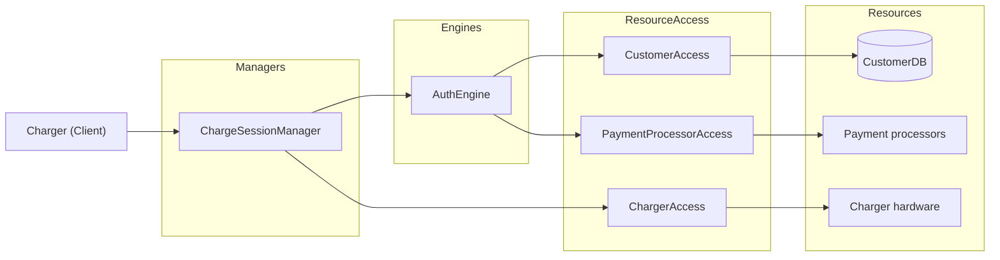

# UC-001 -- Charge Session

| | |
|---|---|
| **Use Case ID** | UC-001 |
| **Title** | Charge Session |
| **Status** | Primary use case (architecture-seeded) |
| **Owner** | Product + Architecture |
| **Classification** | Core synchronous use case (with degraded-mode recovery) |
| **Architecture Release** | arch 1.0.0 (Current) |

> Worked example exercising `../../../../contracts/use-case-contract.md`. Derived from
> the SAD Flow Analysis (F1-F5). A **primary** use case: it shaped the
> architecture. The team may add more (the UC set is open).

## 1. Business Context

A customer identifies at a charger, charges their car, and is released and
billed. This is the smallest end-to-end slice and the one that surfaced the
pivotal residue (S-03) when the key-fob auth was stressed.

## 2. Actors

| Actor | Type | Interaction |
|---|---|---|
| Customer | Human (via charger) | Presents identity, charges, departs |
| Charger | Device (Client) | Sends authenticate / charge-complete events |

## 3. Operations in Scope

- **Op-A -- Authenticate and start.** Identify the customer (RFID / plate / card) and start delivering energy.
- **Op-B -- Stop and release.** Stop charging and unlock, atomically from the customer's perspective, even if the cloud fails mid-session.

## 4. Architectural Context

*Preserved verbatim into `spec.md` per RDAG (Service Decomposition by Residue).
`/speckit-plan` MUST NOT introduce a service absent from "Services touched".*

### Call Chain

### Services touched

| Service | Category | Role |
|---|---|---|
| `ChargeSessionManager` | Manager | Orchestrates Op-A and Op-B; resumable on cloud failure |
| `AuthEngine` | Engine | Resolves identity across RFID / plate / card |
| `CustomerAccess` | ResourceAccess | Reads subscription, bounded to home country |
| `ChargerAccess` | ResourceAccess | Hardware abstraction: start / stop / unlock / degraded unlock |
| `PaymentProcessorAccess` | ResourceAccess | Card-based auth (AFIR) |

All five are in `service-catalog.md`. No new or renamed services introduced.

### Residue

| Service | Absorbs `S-NN` |
|---|---|
| `ChargeSessionManager` | S-03, S-09 |
| `AuthEngine` | S-03, S-15 |
| `CustomerAccess` | S-03, S-13 |
| `ChargerAccess` | S-01, S-02, S-08, S-09 |
| `PaymentProcessorAccess` | S-15 |

## 5. Main Flows

### Op-A -- Authenticate and start
1. Charger sends an authenticate request (identity token).
2. `ChargeSessionManager` calls `AuthEngine`, which resolves the identity against `CustomerAccess` (or `PaymentProcessorAccess` for card).
3. On success, `ChargeSessionManager` calls `ChargerAccess.StartCharge`.

### Op-B -- Stop and release
1. Charger reports charge complete.
2. `ChargeSessionManager` calls `ChargerAccess` to stop and unlock as one logical operation (atomic `EndSession`, or resumable retry on unlock).
3. `ChargeSessionManager` emits `ChargeCompleted` (Dapr Pub/Sub) for `BillingManager`.

## 6. Alternative Flows

- **6.1 Auth fails (key fob broken):** fall back to plate auth via `ALPRManager`; charge allowed, billed on later registration (S-03 decoupling).
- **6.2 Cloud fails mid-session:** `ChargerAccess` unlocks locally with a cached time-bounded credential (NFR-02); the session resumes (NFR-01).
- **6.3 Grid power fails:** `PowerEngine` falls back to `BatteryAccess` (S-02).

## 7. Postconditions

- Op-A success: energy is being delivered; an open session exists.
- Op-B success: charging stopped, customer released, `ChargeCompleted` emitted.

## 8. Business Rules

| Id | Rule |
|---|---|
| BR-1 | Stop and unlock are one logical operation from the customer's perspective. |
| BR-2 | Authentication method does not determine billing identity (decoupled). |
| BR-3 | Customer data is read from the home-country instance only. |

## 9. Acceptance Criteria

| Id | Criterion |
|---|---|
| AC-1 | A valid identity starts a charge; an invalid one does not. |
| AC-2 | If the cloud fails between stop and unlock, the customer is still released. |
| AC-3 | Adding a card auth path does not change `BillingEngine`. |

## 10. Applicable NFRs

Referenced from `nfr-register.md` (by id): **NFR-01, NFR-02, NFR-05**
(UC-001-scoped); **NFR-03, NFR-04, NFR-06** (System-wide, apply here).

## 11. NEEDS CLARIFICATION

- **NC-1** -- Exact cached-credential validity window for offline unlock (NFR-02 states >= 60 s; upper bound TBD).
- **NC-2** -- Identity-token format across RFID / plate / card (unify or per-method).

## 12. Related Documents

- `service-catalog.md`, `nfr-register.md`, `ADR-001.md`. (Full stressor analysis: the SAD on Backstage.)
- `uc-002-overstay-billing.md`.
