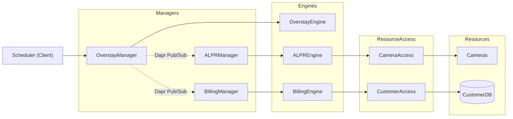

# UC-002 -- Overstay Billing

| | |
|---|---|
| **Use Case ID** | UC-002 |
| **Title** | Overstay Billing |
| **Status** | Primary use case (architecture-seeded) |
| **Owner** | Product + Architecture |
| **Classification** | Asynchronous, time-based use case |
| **Architecture Release** | arch 1.0.0 (Current) |

> Worked example exercising `../../../../contracts/use-case-contract.md`. Derived from
> residue S-12 (abandoned car). Demonstrates residue chaining: it is not
> implementable without the mechanisms S-03 already added (ALPR).

## 1. Business Context

A car left in a charging slot after charging blocks a revenue-generating asset.
The system identifies the vehicle and applies a per-minute overstay fee --
which also turns ICE-ing (S-14) from a disaster into a billing event.

## 2. Actors

| Actor | Type | Interaction |
|---|---|---|
| Scheduler | Internal trigger (Client) | Fires the overstay-detection cycle |
| Customer | Human | Billed for overstay |

## 3. Operations in Scope

- **Op-A -- Detect and bill overstay.** On a schedule, detect slots occupied past charge completion, identify the vehicle by plate, and apply the per-minute fee.

## 4. Architectural Context

*Preserved verbatim into `spec.md`. `/speckit-plan` MUST NOT introduce a service
absent from "Services touched".*

### Call Chain

### Services touched

| Service | Category | Role |
|---|---|---|
| `OverstayManager` | Manager | Orchestrates the time-based detect-and-bill cycle |
| `OverstayEngine` | Engine | Per-minute overstay-fee rules |
| `ALPRManager` | Manager | Plate identification (via Dapr Pub/Sub) |
| `ALPREngine` | Engine | Plate-recognition rules |
| `CameraAccess` | ResourceAccess | Plate-capture frames |
| `BillingManager` | Manager | Applies the fee (via Dapr Pub/Sub) |
| `BillingEngine` | Engine | Pricing / fee computation |
| `CustomerAccess` | ResourceAccess | Customer record, home-country bounded |

All present in `service-catalog.md`. Manager-to-Manager hops are Dapr Pub/Sub
(`ADR-001`), never synchronous.

### Residue

| Service | Absorbs `S-NN` |
|---|---|
| `OverstayManager` | S-12 |
| `OverstayEngine` | S-12 |
| `ALPRManager` | S-03, S-12 |
| `ALPREngine` | S-03, S-12 |
| `CameraAccess` | S-03, S-08, S-12 |
| `BillingManager` | S-10, S-12 |
| `BillingEngine` | S-06, S-10, S-12 |
| `CustomerAccess` | S-03, S-13 |

## 5. Main Flows

### Op-A -- Detect and bill overstay
1. Scheduler fires the detection cycle.
2. `OverstayManager` identifies slots occupied past charge completion.
3. It requests plate identification from `ALPRManager` (Dapr Pub/Sub), which uses `ALPREngine` over `CameraAccess`.
4. `OverstayEngine` computes the per-minute fee.
5. `OverstayManager` hands the fee to `BillingManager` (Dapr Pub/Sub).

## 6. Alternative Flows

- **6.1 Plate unreadable:** retain evidence frames; defer billing, flag for review.
- **6.2 ICE-ing (non-customer vehicle, S-14):** the same flow applies; the plate + camera evidence becomes a legal trail (handed to `LegalCaseManager`).

## 7. Postconditions

- Op-A: overstaying vehicles are identified and an overstay fee is applied (or deferred with evidence).

## 8. Business Rules

| Id | Rule |
|---|---|
| BR-1 | Overstay fee accrues per minute past charge completion. |
| BR-2 | The fee applies regardless of vehicle type (covers ICE-ing). |
| BR-3 | PII used for billing stays in the home country (S-13). |

## 9. Acceptance Criteria

| Id | Criterion |
|---|---|
| AC-1 | A car left past completion accrues a per-minute fee. |
| AC-2 | A non-customer (ICE-ing) vehicle is identified and an evidence trail is produced. |
| AC-3 | No PII crosses a country boundary during billing. |

## 10. Applicable NFRs

Referenced from `nfr-register.md` (by id): **NFR-04, NFR-06, NFR-08**
(all System-wide, apply here). No UC-002-only NFR at this iteration.

## 11. NEEDS CLARIFICATION

- **NC-1** -- Grace period before overstay billing starts.
- **NC-2** -- Evidence retention window for deferred / disputed cases.

## 12. Related Documents

- `service-catalog.md`, `nfr-register.md`, `ADR-001.md`. (Full stressor analysis: the SAD on Backstage.)
- `uc-001-charge-session.md`.
