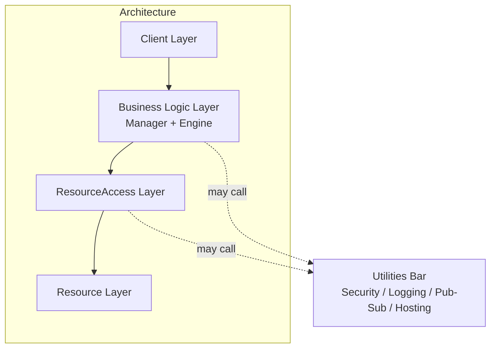

# IDesign Vocabulary

Single source of truth for the IDesign component taxonomy, call rules, and the IDesign override on residuality merge signals. Used by `business-discovery`, `residual-design`, and `sad-auditor` sub-skills. Source authority: Juval Lowy, *Righting Software* (Addison-Wesley, 2019), preserved in `righting-software-md/`.

This document expands what `shared/constitution.md` enforces as rules R-02, R-03, R-04, R-05, R-06, R-07, R-11, R-14. Constitution is the rule statement; this is the working reference with examples and edge cases.

---

## 1. The four layers + Utilities Bar

The Method requires four layers in the system architecture (Lowy L981-983), each encapsulating its own volatilities from layers above and below. A vertical Utilities Bar sits to the side of the four layers, callable from any of them.



### 1.1 Client layer

End-user applications, external systems, schedulers, partner integrations. The most volatile part of a typical software system: clients use different technologies, deploy independently, version on their own cycles, and may be developed by different teams.

A Client triggers a Manager workflow. A Client never calls an Engine, a ResourceAccess, or a Resource directly. A Client never publishes events or subscribes to events directly (in the closed architecture; Pub/Sub goes through a Utility).

Cited Lowy L985-1003.

### 1.2 Business Logic layer (Managers + Engines)

Encapsulates the volatility of the system's business logic. Two component types share this layer:

- **Manager** -- encapsulates volatility in the *sequence* (the workflow). Stateful per workflow instance (it carries the state of one running workflow). Orchestrates Engines and ResourceAccess. The only stateful workflow holder. Cited Lowy L1027.

- **Engine** -- encapsulates volatility in the *activity* (rules, calculations, transformations, strategies). Stateless. May be shared between Managers when the same activity is needed in different workflows. Cited Lowy L1027, L1043-1045.

Both Manager and Engine may call ResourceAccess (Lowy L1329-1331). This is standard within Business Logic, not an exception to the closed architecture.

A Manager that uses no Engines may still call ResourceAccess directly. An Engine never calls another Engine (Lowy L1391; constitution R-03).

### 1.3 ResourceAccess layer

Encapsulates the volatility of *accessing* a Resource. The contract exposed to Business Logic is in the language of atomic business verbs (R-07). The implementation translates these verbs into operations against the Resource (CRUD for a database, send/receive for a queue, REST/gRPC calls for an external API, file I/O for a file system).

Stateless. The only layer that touches Resources directly. May be shared between Managers and Engines accessing the same Resource (Lowy L1063).

A ResourceAccess never calls another ResourceAccess (Lowy L1393). If two Resources need to be joined, a single ResourceAccess does the join (1:1 mapping is not required between ResourceAccess and Resource).

Cited Lowy L1049-1063.

### 1.4 Resource layer

The actual physical state holders or external systems: databases, file systems, caches, message queues, external APIs, hardware. Internal to the system or external to it. Resources do not publish or receive events (Lowy L1387-1389).

Cited Lowy L1069-1071.

### 1.5 Utilities Bar

Cross-cutting infrastructure: Security, Logging, Diagnostics, Instrumentation, Pub/Sub, Message Bus, Hosting, Configuration, Caching as a service, etc. Callable from any layer.

The litmus test: a component qualifies as a Utility only if it could plausibly be used in any other system, including a smart cappuccino machine (Lowy L1325-1327). A Security service for the cappuccino machine to check who can drink coffee: yes, it qualifies as a Utility. A mortgage interest calculator for the cappuccino machine: no, it is a domain Engine, not a Utility.

Cited Lowy L1073-1075, L1325-1327.

---

## 2. Component taxonomy table

| Layer | Type | Naming pattern | State | Encapsulates | Examples (EV charging) |
|---|---|---|---|---|---|
| Client | Client | domain noun (no required suffix) | -- | Volatility of who triggers the system | `Customer mobile app`, `OperatorConsole`, `ChargerFirmware` |
| Business Logic | Manager | `<Noun>Manager` | Stateful per workflow instance | Volatility of the workflow / sequence | `ChargeSessionManager`, `BillingManager`, `OverstayManager`, `ALPRManager` |
| Business Logic | Engine | `<Noun>Engine` (often gerund) | Stateless | Volatility of the activity | `AuthEngine`, `BillingEngine`, `ALPREngine`, `JurisdictionEngine` |
| ResourceAccess | ResourceAccess | `<Noun>Access` | Stateless | Volatility of accessing a Resource | `CustomerAccess`, `ChargerAccess`, `CameraAccess`, `BatteryAccess`, `PaymentProcessorAccess` |
| Resource | Resource | domain noun (no required suffix) | -- | Underlying physical state / external system | `CustomerDB`, `Charger hardware`, `Camera`, `Payment processor API` |
| Utilities Bar | Utility | descriptive name | typically stateless | Cross-cutting infrastructure | `Dapr Pub/Sub`, `Security`, `Logging`, `OpenTelemetry collector` |

### 2.1 Edge cases on type selection

- **A "Service" with mixed responsibilities** is almost always a misclassified Manager + Engine pair. Split it: workflow into the Manager, activities into the Engine(s).
- **A Manager with no Engines and minimal workflow** that just calls one ResourceAccess is borderline expendable. Either there really is workflow volatility hidden in the use case (keep it as Manager) or the Client should call ResourceAccess via a thin facade (rare; usually a sign you need an Engine after all).
- **A Resource that "has logic"** is a misnamed Engine. Resources hold state and respond to operations; they do not run business rules.
- **A Utility that is actually domain-specific** fails the cappuccino test. Reclassify as Engine or ResourceAccess.

---

## 3. Call rules

The closed architecture (Lowy L1281-1295) constrains every call. The matrix below summarizes what is allowed, with reference to constitution rules.

| From -> To | Allowed? | Notes / constitution rule |
|---|---|---|
| Client -> Manager | Allowed | Entry point. Prefer queued/async via Pub/Sub for long-running workflows. R-03. |
| Client -> Engine | Forbidden | Clients never call Engines directly (Lowy L1369). R-03. |
| Client -> ResourceAccess | Forbidden | Clients never bypass Business Logic. R-03. |
| Client -> Resource | Forbidden | Same. R-03. |
| Client -> Utility | Forbidden | Utilities are internal infrastructure of the system, used by Manager / Engine / ResourceAccess. A Client that calls Utilities directly leaks system concerns into the entry point and conflicts with Lowy L1381 (Clients do not publish events). Synthesis stricter than Lowy's literal "any layer" L1317. |
| Manager -> Manager (sync) | Forbidden | Sideways within layer. Use queued M-to-M instead. R-03. |
| Manager -> Manager (queued) | Allowed | Via queue Resource through Pub/Sub Utility. The proxy is a ResourceAccess (call DOWN), the listener is another Client (call DOWN). R-04 (d). |
| Manager -> Engine | Allowed | Engines are an orthogonal plane (Strategy pattern). R-04 (c). |
| Manager -> ResourceAccess | Allowed | Standard within Business Logic. R-04 (b). |
| Manager -> Resource | Forbidden | Always go through ResourceAccess. R-03. |
| Manager -> Utility | Allowed | Cross-cutting access. R-04 (a). |
| Engine -> Manager | Forbidden | Calling up. Worst kind of violation. R-03. |
| Engine -> Engine | Forbidden | Sideways within layer. If two activities need to share, refactor: have the Manager invoke both, or extract a shared Engine. R-03. |
| Engine -> ResourceAccess | Allowed | Standard within Business Logic. R-04 (b). |
| Engine -> Resource | Forbidden | Always through ResourceAccess. R-03. |
| Engine -> Utility | Allowed | R-04 (a). |
| ResourceAccess -> Manager | Forbidden | Calling up. R-03. |
| ResourceAccess -> Engine | Forbidden | Calling up. R-03. |
| ResourceAccess -> ResourceAccess | Forbidden | Sideways within layer. If two Resources need a join, do it inside one ResourceAccess. R-03. |
| ResourceAccess -> Resource | Allowed | The only layer that touches Resources. R-03. |
| ResourceAccess -> Utility | Allowed | R-04 (a). |
| Resource -> anything | Forbidden | Resources are passive. R-03. |
| Resource -> Utility | Forbidden | Resources are passive. Any Utility-like services consumed by a Resource (e.g., a database's internal logging) are infrastructure-level concerns, not architectural call relationships. |
| Utility -> anything | Allowed (with discipline) | Utilities are typically called, not callers. When a Utility must call something (e.g., a Pub/Sub listener invoking a Manager), the listener is treated as a Client. R-04 (a). |

> **Note on the synthesis stricter rule.** Lowy L1317-1327 literally says Utilities are callable from "any layer". This synthesis adopts the stricter interpretation: Utilities are internal infrastructure of the system, called by Manager / Engine / ResourceAccess. Clients (entry points) and Resources (passive) do not call Utilities. This is consistent with Lowy L1381 (Clients do not publish events), which would otherwise create a contradiction if a Client called the Pub/Sub Utility.

### 3.1 Publication / subscription rules

In the closed architecture, only Managers publish events (via the Pub/Sub Utility) and only Managers subscribe to events (via the Pub/Sub Utility, with the listener being treated as a Client).

| Component | Publishes events? | Subscribes to events? |
|---|---|---|
| Client | No (Lowy L1381) | No (closed architecture; clients are triggered, not driven by events) |
| Manager | Yes (via Pub/Sub Utility) | Yes (via Pub/Sub Utility, listener-as-Client) |
| Engine | No (Lowy L1383) | No (Lowy L1389) |
| ResourceAccess | No (Lowy L1385) | No (Lowy L1389) |
| Resource | No (Lowy L1387) | No (Lowy L1389) |
| Utility | The Pub/Sub Utility itself routes events; it does not "publish" semantically | -- |

---

## 4. The four legitimate exceptions to the closed architecture (R-04)

Any apparent violation of the closed architecture must be reframed as one of these four exceptions. If it cannot be reframed, it is a real R-03 violation.

### 4.1 R-04 (a) -- Utilities are callable by Manager / Engine / ResourceAccess

Litmus test: cappuccino machine. If the component plausibly belongs in any other system, it is a Utility.

**Allowed callers:** Manager, Engine, ResourceAccess. **Forbidden callers:** Client, Resource.

This synthesis adopts a stricter interpretation than Lowy L1317-1327's literal "any layer". Reason: Utilities are internal infrastructure of the system. A Client that calls a Utility directly is leaking system concerns into the entry point; a Resource is passive and does not initiate calls. The stricter rule also avoids the contradiction with Lowy L1381 (Clients do not publish events) that would arise if a Client could call the Pub/Sub Utility.

Cited Lowy L1311-1327, L1381 (synthesis tighter rule).

### 4.2 R-04 (b) -- Both Managers and Engines call ResourceAccess

Lowy L1329-1331 frames this as "in the same layer", though Figure 3-4 shows ResourceAccess as a distinct layer below Business Logic. The practical interpretation: both component types in Business Logic may jump directly to ResourceAccess; this is standard, not an exception. The reason the rule exists: a Manager that uses no Engines must still be able to access Resources.

### 4.3 R-04 (c) -- Manager-to-Engine is not a sideways call

Engines are an orthogonal plane to Managers (Lowy L1333-1335). They implement the Strategy pattern; a Manager invokes Engine strategies as part of its workflow. The Manager-Engine relationship is part of Business Logic, not a sideways call within a single layer.

### 4.4 R-04 (d) -- Queued Manager-to-Manager

Synchronous Manager-to-Manager is forbidden (Lowy L1283-1289). Queued Manager-to-Manager is allowed (Lowy L1337-1351). The technical justification: the queue proxy is a ResourceAccess to the queue Resource (call DOWN), and the queue listener is effectively another Client (call DOWN to receiving Manager). The semantic justification: business systems commonly have one use case that triggers latent execution of another use case.

In practice (e.g., EV charging), this means using Pub/Sub: `ChargeSessionManager` publishes `ChargeCompleted` to the Pub/Sub Utility; `BillingManager` subscribes to `ChargeCompleted` via a listener that calls `BillingManager.Process(...)`. Neither Manager directly references the other.

---

## 5. Atomic business verbs (R-07 expanded)

Atomic business verbs are the lowest-level activities of the business that cannot be expressed by other business activities (Lowy L1055-1059). They are practically immutable because they relate to the nature of the business -- they survive technology change, framework change, scale change.

Examples by domain:

- **Banking:** `Credit`, `Debit`, `Transfer`, `Reconcile`, `Hold`, `Release`.
- **EV charging:** `Authenticate`, `StartCharge`, `StopCharge`, `Unlock`, `MeterReading`, `BillSession`.
- **Marketplace (TradeMe):** `RegisterMember`, `AddProject`, `MatchTradesman`, `AssignTradesman`, `TerminateTradesman`.

### 5.1 Where atomic verbs appear

- **In ResourceAccess contracts** (allowed). `ChargerAccess.StartCharge(sessionId)`.
- **In Manager workflow steps as method calls** (allowed). The Manager workflow may invoke `chargerAccess.StartCharge(...)`.
- **As Engine method names for the encapsulated activity** (allowed but check). `AuthEngine.Authenticate(credentials)` is fine; the verb describes the activity the Engine encapsulates.

### 5.2 Where atomic verbs must NOT appear

- **As service name prefix** (R-07 violation). `StartChargeManager` -- the prefix should describe the volatility encapsulated, not the verb.
- **As Manager workflow names presented to clients.** A Manager named for what it does (e.g., `ChargingWorkflowManager`) is functional decomposition disguised; rename to encapsulate the volatility (e.g., `ChargeSessionManager`).

---

## 6. The IDesign override (R-14 expanded)

The contagion matrix in residuality reveals merge candidates by identical or similar column signatures. This signal is correct *within a layer* and dangerous *across layers*. The override rule:

> Two components proposed for merge based on identical Contagion Matrix column signatures may be merged only if both belong to the same IDesign layer. Cross-layer merges are forbidden regardless of matrix similarity.

### 6.1 Valid merges from matrix signature

| Pair | Same layer? | Merge allowed if signatures match? | Reason |
|---|---|---|---|
| Engine + Engine in the same volatility bounded context | Yes | Allowed | Two activities in the same domain may be one |
| ResourceAccess + ResourceAccess for the same Resource family | Yes | Allowed | Two access patterns to related data may consolidate |
| Manager + Manager that own the same logical workflow | Yes | Allowed (rare) | Indicates they were split prematurely |

### 6.2 Invalid cross-layer merge proposals

| Pair | Reason override fires |
|---|---|
| Manager + Engine | Stateful workflow vs stateless logic. Different roles in closed arch. R-02 typing collapses; R-11 almost-expendable Manager violated. |
| Manager + ResourceAccess | Workflow vs resource access. Closed architecture would collapse. |
| Engine + ResourceAccess | Activity logic vs resource access. R-07 atomic-verb discipline violated. |
| ResourceAccess + Resource | Access layer vs underlying resource. R-03 collapses. |
| Anything + Utility | Cross-cutting role lost; cappuccino test fails for the merged result. |

### 6.3 Walkthrough -- EV charging false positive

In the EV charging Contagion Matrix, `BillingMgr` and `BillingEngine` both have Σ = 4 with similar response patterns to stressors #3 (failed login), #9 (server failure), #10 (billing errors), #12 (abandoned car). The matrix-reading section flags them as merge candidates.

**Without the override:** the architect merges them into `BillingService` -- a stateful + stateless hybrid. This collapses R-02 (no longer cleanly typed), violates R-11 (the merged service contains both workflow and business logic), and gives up the criticality benefit of layering.

**With the override:** the architect notices the cross-layer pair, applies R-14, documents the override inline ("Manager-Engine pairs are not merged on signature similarity alone"), and keeps the two components separate. The matrix similarity is *expected* -- a Manager and its dedicated Engine see the same stressors -- and is not, by itself, a refactor signal.

---

## 7. The four questions (Lowy L1107-1129)

A discovery and validation tool. Useful for `business-discovery` (S1) and for `sad-auditor` heuristic checks.

> "Who interacts with the system is in the Clients, what is required of the system is in Managers, how the system performs business activities is in Engines, how the system accesses Resources is in ResourceAccess, and where the system state is in Resources."

**During discovery (initiate):** make a list of all the "who" (candidates for Clients), all the "what" (candidates for Managers), all the "how" -- both for activities (Engine candidates) and for resource access (ResourceAccess candidates) -- and all the "where" (Resource candidates).

**During validation (close):** for the proposed Static Architecture, ask:

- Are all Clients "who", with no trace of "what" in them?
- Are all Managers "what", without "who" or "where" in them?
- Are all Engines "how" for activities, without "what" or "where"?
- Are all ResourceAccess "how" for resource access, without "what" or "who"?
- Are all Resources "where", without "how" or "what"?

A "yes" to all five suggests good typing discipline. A "no" anywhere suggests a misclassified component.

---

## 8. Anti-patterns to recognize

These are the failure modes the IDesign vocabulary helps you spot. Each one is a specific kind of misclassification or misnaming.

### 8.1 Functional decomposition

Components named for functions: `BillingManager`, `ShippingManager`, `InvoicingManager`. The names look right (they have `Manager` suffix) but the prefix is a verb (functions: billing, shipping, invoicing). When the business behavior shifts (e.g., subscriptions replace one-off invoicing), the components fragment.

**Detection:** prefix is a gerund or verb-form noun. Counter-example test: would the component name make sense if the business shifted (subscriptions vs invoicing)? If the answer is "we'd need a `SubscriptionManager`", the original is functional.

### 8.2 Domain decomposition

Components named for domains: `BankingManager`, `AccountingManager`, `SalesManager`. Even worse than functional, because each domain devolves into a grab bag (Lowy L355).

**Detection:** prefix is a business domain noun rather than a volatility noun. Are activities and workflows mixed inside the same Manager? Does cross-domain communication look like CRUD? Both are signs.

### 8.3 The monolith

One Manager with many Engines and many ResourceAccess underneath, doing everything. The architecture diagram looks IDesign-compliant on paper but the Manager has 50 workflows and 200 atomic operations.

**Detection:** count workflows per Manager. If one Manager owns more than ~5 workflows, split.

### 8.4 Granular service explosion

Every activity becomes its own component. `AuthenticationManager`, `ValidationManager`, `LookupManager`, `DispatchManager` for what should be one workflow.

**Detection:** look for components that exist only because they were "called from one place once". If a component has no reuse and no clear volatility, it is granularity for granularity's sake.

### 8.5 The misclassified Manager

A "Manager" that has no workflow, just delegates calls. Either it should not exist (the Client could call ResourceAccess via a thin facade) or it actually has workflow volatility that has not been articulated yet. Lowy calls this "expendable" (L1163-1171).

**Detection:** can you remove the Manager and replace it with a single function call? If yes, it is expendable.

### 8.6 The pseudo-Engine

A "Engine" that is actually a wrapper around a Resource. `CustomerEngine` that just calls `CustomerAccess`. It has no business activity to encapsulate.

**Detection:** does the Engine contain rules / calculations / strategies, or just translation calls? If only translation, fold it into the Manager and let the Manager call ResourceAccess directly (R-04 (b)).

### 8.7 The talkative Client

A Client that orchestrates multiple Managers in the same use case (forbidden by Lowy L1367 / R-03). The Client has become the architecture; the system has been moved up into the Client.

**Detection:** in any single use case sequence diagram, does the Client appear in more than one place coordinating Managers? If yes, the orchestration belongs in a single Manager (possibly with Pub/Sub for asynchronous handoff between Managers).

---

## 9. The workflow Manager pattern -- baseline vs elaboration

The workflow Manager pattern (Lowy L2163-2186) is one of the most-cited and most-misapplied patterns in IDesign-influenced architectures. The misapplication arises from reading "All Managers in TradeMe are workflow Managers" (Lowy L2167, in TradeMe's resolved architecture) as a license to introduce a workflow engine Resource + WorkflowsAccess in every architecture with long-running flows. This section codifies the correct reading.

### 10.1 The "in theory just another Manager" baseline

Lowy L2167 (literal): "A workflow Manager is a service that enables you to create, store, retrieve, and execute workflows. **In theory, it is just another Manager.** In practice, however, such Managers almost always utilize some sort of third-party workflow execution tool and workflow storage."

The key phrase is "in theory, it is just another Manager". Read this carefully:

- Every IDesign Manager (R-02) is stateful per workflow instance. A Manager IS a workflow Manager by virtue of being a Manager.
- The workflow LOGIC lives in the Manager's code (the orchestration of activities, decisions, branches, async waits).
- The workflow STATE (current step, accumulated context, in-flight offers, awaited responses) is per-instance state that the Manager holds.
- That state must be persisted somewhere. The Manager persists via its ResourceAccess components. **The default is to persist into domain-relevant Resources** (e.g., a project's workflow state into the Projects Resource via ProjectsAccess) -- NOT into a separate Workflows Resource.

A Manager that holds workflow state in-instance and persists via existing ResourceAccess components IS a workflow Manager in Lowy's sense. **No third-party engine is required.** This is the baseline.

### 10.2 The "in practice" elaboration

Lowy's "in practice, however, such Managers almost always utilize some sort of third-party workflow execution tool and workflow storage" describes the elaboration: introducing a Workflows Resource (the engine) + WorkflowsAccess (the wrapper) that handles workflow execution and persistence as an external service.

This elaboration is justified when:

| Justification | Example |
|---|---|
| **Visual editing by non-developers.** | Product owners or business analysts edit workflow definitions in a visual editor (Camunda Modeler, Temporal UI). The engine's primary value is the editor, not the storage. |
| **Multi-process coordination beyond DB transactions.** | Distributed sagas with cross-region compensation. Database transactions cannot span the coordination boundary; the engine provides explicit saga primitives. |
| **Complex temporal semantics built-in.** | Timers measured in days/weeks (e.g., "wait 30 days then auto-close"). Re-implementing these timers over a DB requires non-trivial custom code (cron + state machine + retry); the engine provides them natively. |
| **Operational tooling beyond DB capability.** | Workflow inspection (current state of all in-flight instances), debugging (step into a workflow), replay from arbitrary points. Domain DBs do not provide this; the engine does. |

These are concrete capability gaps that domain ResourceAccess cannot reasonably fill. When the stressor analysis surfaces one of these as a genuine need, the workflow engine elaboration is justified.

### 10.3 What is NOT a sufficient justification

The most common over-engineering trap:

- **"Workflows are long-running."** Not sufficient. Long-running state lives in domain Resources via existing RAs.
- **"State must survive Manager restart."** Not sufficient. Standard ResourceAccess persistence does this.
- **"Workflows must be replayable for audit."** Not sufficient. Audit snapshots persist in domain Resources via the same RAs that persist state; replay is a Manager-side feature that reads the snapshots and re-instantiates the state machine.
- **"Workflows must be idempotent."** Not sufficient. Idempotency keys persist in domain Resources via existing RAs.
- **"We anticipate workflow volatility."** Not sufficient. Vague future-proofing is R-09 speculative design.

All these are absorbed by extending ResourceAccess with new atomic verbs (`RecordPendingState`, `LoadInflight`, `ResumeFromCheckpoint`, etc.) within the existing Resource scope. R-24 codifies this discipline.

### 10.4 Worked example -- TradeMe stressor #4 (corrected)

The original (incorrect) interpretation: stressor #4 (long-running matching workflow) introduced `Workflows` Resource + `WorkflowsAccess` per Lowy TradeMe Figure 5-14. This was an over-engineered residue (R-24 violation): the stressor's needs (durability + replay + idempotency) are standard ResourceAccess territory; no engine-specific capability was required.

The corrected interpretation: stressor #4 is absorbed by extending `ProjectsAccess` with atomic verbs `RecordPendingMatchState`, `QueryPendingMatches`, `ResumeMatch`. `MarketplaceManager` workflow state lives in the Projects Resource (alongside the project record); on Manager restart, `ProjectsAccess.QueryPendingMatches` lists in-flight match workflows and the Manager re-instantiates them. No new Resource. No third-party engine dependency. The MarketplaceManager IS the workflow Manager in Lowy's "in theory" sense.

If the project later requires visual workflow editing (product owners want to tune match offer timeouts without code change) or complex temporal semantics (multi-day reminders to non-responding tradesmen) that domain-DB cron cannot reasonably support, an ADR introduces the workflow engine as a deliberate technical decision, NOT as a residue from stressor #4.

### 10.5 The decision tree for "do we need a Workflows Resource?"

```
Stressor identifies long-running / durable / replayable workflow need.

Q1: Does the Manager already persist its state via its existing ResourceAccess components?
    -> If yes: extend those ResourceAccess components with state-of-workflow atomic verbs.
       Done. No Workflows Resource.
    -> If no: continue.

Q2: Does the workflow need visual editing by non-developers?
    -> If yes: a workflow engine with a visual editor is justified.
       Introduce Workflows Resource + WorkflowsAccess. ADR documents the engine choice.
    -> If no: continue.

Q3: Does the workflow require multi-process coordination beyond DB transactions?
    -> If yes: distributed-saga capability is justified.
       Introduce Workflows Resource + WorkflowsAccess.
    -> If no: continue.

Q4: Does the workflow require complex temporal semantics (timers measured in days/weeks)
    that re-implementing over DB cron + state machine would require non-trivial code?
    -> If yes: engine timers are justified.
       Introduce Workflows Resource + WorkflowsAccess.
    -> If no: continue.

Q5: Does the workflow require operational tooling (inspection, debugging, replay UI)
    that the team cannot afford to build from scratch?
    -> If yes: engine operational tooling is justified.
       Introduce Workflows Resource + WorkflowsAccess.
    -> If no: stop. Extend existing ResourceAccess. The Manager IS the workflow Manager
       in Lowy's "in theory" sense, with state persisted to its domain Resources.
```

R-24 enforces this decision tree. The `stressor-analysis` (S3) and `residual-design` (S5) sub-skills should apply it when residues mention "workflow", "long-running", or "durable state". The `sad-auditor` (cross-cutting) flags violations.

---

## 10. References

- `shared/constitution.md` -- canonical rule statements (R-02, R-03, R-04, R-05, R-06, R-07, R-11, R-14).
- `shared/glossary.md` -- single-line definitions of each term.
- `shared/decomposition-discipline.md` -- the eight guardrail rules that complement these IDesign rules.
- `sad/template.md` §Static Architecture (IDesign) -- the SAD section that puts this vocabulary to work.
- `sad/examples/ev-charging-sad.md` -- worked example using this vocabulary throughout.
- `righting-software-md/righting-software-juval-lowy-only-need.md` -- source book. Citations in this document use `Lowy L#-L#`.
