# FLOW.md -- Runtime state of the SAD production

Live state diagram showing **where we are** in producing a SAD for a specific project, **what is approved**, and **what is blocked**. This is the per-project copy of the meta-skill's FLOW.md template, updated as each sub-skill produces its fragment.

This file describes the **runtime flow** of the meta-skill (one sub-skill at a time, fragment by fragment, until the SAD is assembled).

## Current session

```
Project: Keru -- caregiver marketplace MVP
Iteration: 1
Current step: S1b
Last update: 2026-07-10
Open blockers: none
Input corpus: docs/documents/Keru-Casos-de-Uso-MVP.md (Spanish; rich documentation input --
  one use-case corpus layering the original scope (Keru-Scope-MVP.docx.pdf) with
  product decisions of 2026-07-09; 21 use cases, domain model, derived NFRs,
  out-of-scope guardrails; payments module pending decision, UC-11 reserved)
```

### Gate tracker (the operative checklist)

This compact table is the **authoritative gate state** -- faster to update than the Mermaid diagram, and the thing a sub-skill checks before it produces. Mark a gate `[x] approved` ONLY after the user explicitly signs off on that fragment. A sub-skill must NOT produce its fragment until its prior gate is `[x] approved` here (see root `SKILL.md` §Gate approval protocol).

| Gate | Fragment | State | Approved on |
|---|---|---|---|
| S1a | business-view.md | `[x]` | 2026-07-10 |
| S1b | naive-architecture.md | `[?]` | -- |
| S2 | flow-analysis.md | `[ ]` | -- |
| S3 | stressor-catalog.md | `[ ]` | -- |
| S4 | contagion-analysis.md | `[ ]` | -- |
| S5 | residual-design.md | `[ ]` | -- |
| S6 | empirical-test.md | `[ ]` | -- |
| S7 | sad.md | `[ ]` | -- |
| S8a | handoff/arch-X.Y.Z/ (staging; emit only -- never touches consumer) -- downstream, optional | `[ ]` | -- |
| S8b | consumer landed (architecture/arch-X.Y.Z/ + .specify/ + plan-template wiring) -- gated by S8a `[x]` + explicit operator authorization | `[ ]` | -- |

States: `[ ]` pending | `[~]` in progress | `[?]` awaiting review | `[x]` approved | `[!]` blocked | `[i]` iterating. The Mermaid diagram below is the visual companion; if the two ever disagree, this table wins.

**Disk is the source of truth.** A gate marked `[?]` / `[x]` / `[i]` whose named artifact(s) are absent on disk is automatically degraded to `[ ]` by the router (`SKILL.md` §Orchestration Step 1). The tracker is a working note; it cannot claim emission a re-emission has erased. Update the tracker only when the artifact actually exists.

**Tracker coherence (R-26 -- NON-NEGOTIABLE).** Three invariants on every read: (1) the chain of `[x]` is contiguous; (2) every active gate (`[~]` / `[?]` / `[i]`) has all priors `[x]`; (3) at most ONE gate is active at any time -- only the first gate after the last `[x]`. Any violation is a tracker inconsistency: the router refuses to advance (`SKILL.md` §Orchestration Step 1) and the auditor flags it (`sad-auditor` §2.7b). The single-active-gate rule keeps the workflow single-threaded -- only one decision pending at a time. Fix is binary: revert the offending gate to `[ ]`, or approve every prior. No `--force`.

**S8 is split into S8a (emit) + S8b (land)** -- two gates with a human checkpoint between, the same pattern as S1a/S1b. Include them only when the assembled SAD is being handed to a Spec-Driven Development consumer (e.g. spec-kit). **S8a** (gated on S7 `[x]` + S6 Ri passing) emits the handoff to `handoff/arch-X.Y.Z/` and **never touches the consumer**. **S8b** (gated on S8a `[x]` + explicit operator authorization) lands the staged release into the consumer (`architecture/arch-X.Y.Z/` + `.specify/memory/constitution.md` scaffold + `plan-template-constitution-check.md` wiring). The executor never emits S8a and S8b in the same turn.

## State legend

| State | Label mark | Color (classDef) | Meaning |
|---|---|---|---|
| Pending | `[ ]` | Grey | Not started; waiting on dependencies or turn |
| In Progress | `[~]` | Yellow (thick border) | Sub-skill running now |
| Awaiting Review | `[?]` | Blue | Fragment produced; awaiting user approval |
| Approved | `[x]` | Green | Fragment validated and approved |
| Blocked | `[!]` | Red | Blocked by error, decision pending, or missing input |
| Iterating | `[i]` | Orange | User requested changes; sub-skill re-running on the same fragment |

## State diagram

```mermaid
flowchart TD
    %% =====================================================
    %% FOUNDATION (per-project setup)
    %% =====================================================
    F0["[x] Foundation<br/>shared/ doctrine + template + examples in place<br/>OUT: project workspace ready"]:::approved

    %% =====================================================
    %% SEQUENTIAL SUB-SKILLS (S1 to S7)
    %% =====================================================
    S1a["[x] S1a - business-discovery (Business View)<br/>IN: PRD/SRD or stakeholders<br/>OUT: business-view.md"]:::approved

    S1b["[?] S1b - business-discovery (Naive Architecture)<br/>IN: business-view.md (approved)<br/>OUT: naive-architecture.md"]:::awaiting_review

    S2["[ ] S2 - flow-analysis<br/>IN: naive-architecture.md<br/>OUT: flow-analysis.md"]:::pending

    S3["[ ] S3 - stressor-analysis<br/>IN: flow-analysis.md<br/>OUT: stressor-catalog.md (typed)"]:::pending

    S4["[ ] S4 - contagion-analysis<br/>IN: stressor-catalog.md<br/>OUT: contagion-analysis.md<br/>(matrix + topology + business + looping)"]:::pending

    S5["[ ] S5 - residual-design<br/>IN: contagion-analysis.md<br/>OUT: residual-design.md<br/>(NFRs + Static IDesign + Use Cases + diagrams)"]:::pending

    S6["[ ] S6 - empirical-test<br/>IN: residual-design.md + fresh test stressors<br/>OUT: empirical-test.md (Ri value)"]:::pending

    S7["[ ] S7 - sad-assembler<br/>IN: 6 approved fragments<br/>OUT: sad.md (final integrated SAD)"]:::pending

    %% =====================================================
    %% APPROVAL GATES (between sub-skills)
    %% =====================================================
    G1a{"[x] Gate 1a<br/>Business View approved?"}:::approved
    G1b{"[ ] Gate 1b<br/>Naive Arch approved?"}:::pending
    G2{"[ ] Gate 2<br/>Fragment approved?"}:::pending
    G3{"[ ] Gate 3<br/>Fragment approved?"}:::pending
    G4{"[ ] Gate 4<br/>Fragment approved?"}:::pending
    G5{"[ ] Gate 5<br/>Fragment approved?"}:::pending
    G6{"[ ] Gate 6<br/>Ri > 0 AND<br/>unstressed surfaces<br/>declared?"}:::pending
    G7{"[ ] Gate 7<br/>SAD passes auditor?"}:::pending

    %% =====================================================
    %% AUDITOR (cross-cutting)
    %% =====================================================
    AUD["[ ] sad-auditor (cross-cutting)<br/>by-fragment | end-to-end | diff<br/>OUT: audit findings + fix proposals"]:::pending

    %% =====================================================
    %% FLOW
    %% =====================================================
    F0 --> S1a
    S1a --> G1a
    G1a -->|No: iterate| S1a
    G1a -->|Yes| S1b
    S1b --> G1b
    G1b -->|No: iterate| S1b
    G1b -->|Yes| S2
    S2 --> G2
    G2 -->|No: iterate| S2
    G2 -->|Yes| S3
    S3 --> G3
    G3 -->|No: iterate| S3
    G3 -->|Yes| S4
    S4 --> G4
    G4 -->|No: iterate S4| S4
    G4 -->|Backtrack: stressor gap| S3
    G4 -->|Yes| S5
    S5 --> G5
    G5 -->|No: iterate S5| S5
    G5 -->|Backtrack: matrix re-read| S4
    G5 -->|Yes| S6
    S6 --> G6
    G6 -->|Ri <= 0: more analysis needed| S3
    G6 -->|Unstressed surfaces are next round| S3
    G6 -->|Yes: criticality reached| S7
    S7 --> G7
    G7 -->|No: auditor findings| S5
    G7 -->|Yes| DONE["[ ] SAD shipped"]:::pending
    DONE -.handoff to a spec-kit consumer.-> S8a["[ ] S8a - speckit-handoff EMIT (downstream)<br/>IN: assembled SAD + passing Ri<br/>OUT: handoff/arch-X.Y.Z/ (staging; never touches consumer)"]:::pending
    S8a --> G8a{"[ ] Gate S8a<br/>Staged handoff approved?"}:::pending
    G8a -->|No: iterate| S8a
    G8a -->|Yes + authorized| S8b["[ ] S8b - speckit-handoff LAND (gated)<br/>IN: approved staging + operator authorization<br/>OUT: consumer landed (architecture/arch-X.Y.Z/ + .specify/ + plan-template wiring)"]:::pending

    AUD -.audits any time.-> S1a
    AUD -.audits any time.-> S4
    AUD -.audits any time.-> S5
    AUD -.audits any time.-> S7

    %% =====================================================
    %% STYLES
    %% =====================================================
    classDef pending fill:#f1f3f5,stroke:#868e96,color:#212529,stroke-width:1px
    classDef in_progress fill:#fff3bf,stroke:#f59f00,color:#212529,stroke-width:3px
    classDef awaiting_review fill:#d0ebff,stroke:#1971c2,color:#212529,stroke-width:2px
    classDef approved fill:#b2f2bb,stroke:#2b8a3e,color:#212529,stroke-width:1px
    classDef blocked fill:#ffc9c9,stroke:#c92a2a,color:#212529,stroke-width:2px
    classDef iterating fill:#ffd8a8,stroke:#e8590c,color:#212529,stroke-width:2px
```



## Iteration patterns

| Loop | When it fires | When it closes |
|---|---|---|
| **Within-step iteration** (`[i]`) | User rejects a fragment with feedback | New fragment satisfies the feedback and user approves |
| **Backtrack from S4 to S3** | Matrix reveals stressor gap (entire row would be empty / a stressor that should have been there is absent) | Stressor catalog updated, S4 re-runs |
| **Backtrack from S5 to S4** | Matrix re-read needed (e.g., IDesign override missed in first pass) | Matrix re-read, S5 re-runs |
| **Backtrack from S6 to S3** | Ri <= 0 (residual architecture is not better than naive); analysis was not deep enough | New round of stressor analysis; entire downstream chain re-runs |
| **Backtrack from S7 to S5** | Auditor finds violations in the assembled SAD that trace to design choices | Design fixed, S5 re-emits, S7 re-assembles |
| **Operator reopen of `Sn`** | Operator decides an earlier approved gate needs re-work (UI button or manual edit). External trigger -- distinct from the SAD-internal backtracks above. | `Sn` and downstream are pending; cursor at `Sn`; new iteration of the fragment is produced and approved -> state walks back to where it was |
| **Post-S5 amendment** (`[x] -> [i]` at the frontier) | A Create-ADR / Add-Use-Case action (`SKILL.md` Post-S5 actions) lands an `Outcome: iterating Sn` -- legal ONLY when `Sn` is the last `[x]` with nothing downstream beyond `[ ]`; otherwise the outcome escalates to a reopen | Amended fragment re-emitted -> `[?]` -> operator approves -> `[x]`; no cascade |

**Reopen rule (general).** Reopening any gate `Sn` marks every downstream gate that consumed its output back to `[ ]` pending (stale, not deleted) AND moves the "Current session" cursor back to `Sn`. Forward motion resumes from `Sn` and re-traverses every stale gate in order. When a loop fires: do NOT delete approved nodes from prior iterations -- rename the prior fragment to `Sn.iter-N.md` and note the iteration count in "Current session".

## Session log

| Date | Event |
|---|---|
| 2026-07-09 | Bootstrap: workspace initialized (docs/architect/ + docs/sad/), gate tracker created, S1a started in rich-documentation mode over docs/documents/Keru-Casos-de-Uso-MVP.md |
| 2026-07-09 | S1a fragment emitted by Architect subagent (business-view.md, passes check_fragment.py); parked at gate `[?]` awaiting operator review — 8 Open Questions require R-27 acknowledgment or resolution |
| 2026-07-10 | R-27 resolution pass 1: operator answered 8 OQs (5 Resolved, OQ-5 Open, OQ-6/OQ-7 Open partial); fragment updated in place, DV-11 added |
| 2026-07-10 | R-27 resolution pass 2: OQ-6 Resolved (3-5 s bound extends to alert delivery), OQ-5/OQ-7 Closed by operator decision; DV-2 extended, DV-12 added; no OQ gates S1a |
| 2026-07-10 | Operator approved S1a (UI mutation); cursor advanced to S1b; S1b started -- Architect subagent producing naive-architecture.md |
| 2026-07-10 | S1b fragment emitted (naive-architecture.md: 19 components -- 3 Clients / 4 Managers / 3 Engines / 7 ResourceAccess / 2 Resources; R-05/R-06 pass, check_fragment.py OK); parked at gate `[?]` awaiting operator review |
