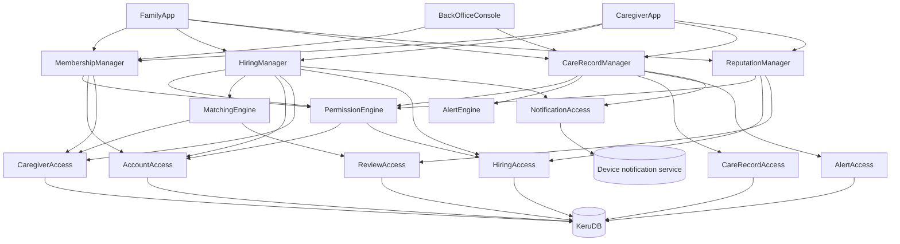

## Naïve Architecture

> The minimal IDesign-compliant architecture that solves the problem exactly as the approved Business View states it (`business-view.md §Objective`, `§Goals G1–G11`), with no consideration of stress, change, or future-proofing. This is the **control baseline** against which the residual architecture will be measured in the empirical Ri test (S6). Per the rich-documentation-mode rule recorded in `business-view.md §Carry-forward` ("Phase-0 evidence, never the baseline", R-09), this decomposition is derived from the synthesized framing **only** — the source document's own use-case map (`§3`) and domain model (`§5`) were deliberately not consulted as design inputs; they remain Phase-0 evidence held for S6.

In IDesign terms: three **Clients** (the family-side application, the caregiver-side application, the administrator's back-office console) trigger four **Managers**, one per workflow family the Business View names — joining and leaving the platform (`§Goals G2, G8, G9`), the search-to-hire-to-closure lifecycle (`§Goals G1, G3, G10, G11`), the record-evaluate-alert-consult loop over the clinical record (`§Goals G4, G5, G6`), and the post-service bidirectional review (`§Goals G7`). Three stateless **Engines** hold the business activities those workflows share or delegate: matching caregivers to search criteria, evaluating a recorded value against its applicable alert range, and deciding role-and-link permission (`§Invariants I3`). Seven **ResourceAccess** components expose atomic business verbs over two **Resources**: one operational database holding all platform state, and one external device-notification channel (`§Invariants I6` — a device notification is additional, never the only record). There is no Utilities Bar in the naïve baseline: no Pub/Sub (queued M-to-M per R-04 (d) is residue-driven, not naïve — alert delivery runs inline and synchronously inside the recording workflow), and the 3–5 s configurable freshness bound (`§Goals G5, G6`, OQ-6 answer) is assumed satisfied by client-initiated reads. Each Manager is almost-expendable (R-11): workflow sequence only, with rules in Engines and persistence verbs in ResourceAccess.

### Component Taxonomy

| Layer | Component | Responsibility | Volatility encapsulated (anchor) |
|---|---|---|---|
| Client | FamilyApp | Family members and patients on mobile and web: search and hire caregivers, mark a hiring as paid, manage patient profiles, share family invitations, record and follow the patient's state, review caregivers. | Who triggers the demand side (`business-view.md §Objective`, `§Goals G11` — mobile and web) |
| Client | CaregiverApp | Caregivers on mobile and web: publish professional profile, see and accept/decline hiring requests (with the patient's reputation), record clinical data during an assignment, review the patient/family. | Who triggers the supply side (`§Goals G2, G3, G4, G7`) |
| Client | BackOfficeConsole | Administrators: review and approve caregiver accounts, deactivate users or hide them from the marketplace, configure the platform-wide per-metric alert ranges. | Who operates curation and configuration (`§Goals G2, G6`; OQ-4/OQ-8 answers) |
| Manager | MembershipManager | Orchestrates joining/leaving workflows: caregiver registration → administrator approval → marketplace visibility; self-deactivation and back-office deactivation/hiding; patient-profile creation under one account; family-invitation issuance (30-minute, single-use) and confirmation → link. | Sequence volatility of platform membership (`§Goals G2, G8, G9`; `§Invariants I1, I4`) |
| Manager | HiringManager | Orchestrates the hiring lifecycle: search (delegates matching), per-patient hiring-request fan-out, caregiver acceptance/decline, assignment activation, off-platform payment marked as paid → operation closure, caregiver history and rehire. | Sequence volatility of the hiring lifecycle (`§Goals G1, G3, G10, G11`; `§Invariants I7`) |
| Manager | CareRecordManager | Orchestrates the clinical-record workflows: permission check → persist record with author, role, and timestamp → evaluate alert condition → persist alert → notify linked family members; the consult workflow (current state, chronological history, per-metric evolution); administrator range configuration. | Sequence volatility of capture–evaluate–alert–consult (`§Goals G4, G5, G6`; `§Invariants I2, I6`) |
| Manager | ReputationManager | Orchestrates the post-service review workflow: verify the reviewer participated in a real, finished service; accept exactly one immutable review per side; reject a second attempt. | Sequence volatility of bidirectional reviewing (`§Goals G7`; `§Invariants I5`) |
| Engine | MatchingEngine | Filters and ranks approved, visible caregivers by zone, modality, type of care, availability, and rate range; surfaces rating, review count, and verification badges in the result. | Activity volatility of matching rules (`§Goals G1, G2`) |
| Engine | AlertEngine | Decides whether a recorded vital sign breaches its applicable range — the per-patient range when present, otherwise the administrator's platform-wide default — or whether a recorded note triggers an alert. Pure evaluation; the Manager supplies the value and the applicable ranges. | Activity volatility of alerting rules (`§Goals G6`; OQ-4 answer) |
| Engine | PermissionEngine | Decides whether an actor may read or write for a patient: caregivers only with a current assignment, family members only with an established link. | Activity volatility of role-and-link access rules (`§Invariants I3`) |
| ResourceAccess | AccountAccess | Atomic verbs over accounts, patient profiles, family links, and invitations: `RegisterAccount`, `CreatePatientProfile`, `IssueInvitation`, `ConfirmInvitation`, `LinkFamilyMember`, `DeactivateAccount`. | Access volatility of membership state (`§Goals G8, G9`) |
| ResourceAccess | CaregiverAccess | Atomic verbs over caregiver professional profiles, verification badges, availability, work zones, and marketplace visibility: `PublishProfile`, `ApproveCaregiver`, `SetVisibility`, `FindCaregivers`. | Access volatility of supply-side state (`§Goals G1, G2`) |
| ResourceAccess | HiringAccess | Atomic verbs over hiring requests, assignments, and history: `SubmitRequest`, `AcceptRequest`, `DeclineRequest`, `ActivateAssignment`, `MarkPaid`, `ListCaregiverHistory`. | Access volatility of hiring state (`§Goals G3, G10`; `§Invariants I7`) |
| ResourceAccess | CareRecordAccess | Atomic verbs over vitals, medication administrations, notes (with author, role, timestamp, correction trace) and per-metric ranges: `RecordVitals`, `RecordMedication`, `RecordNote`, `CorrectRecord`, `ReadHistory`, `ReadRanges`, `SetRanges`. | Access volatility of the clinical record (`§Goals G4, G5`; `§Invariants I2`) |
| ResourceAccess | ReviewAccess | Atomic verbs over immutable bidirectional reviews and their aggregates: `SubmitReview`, `ReadReputation`. | Access volatility of reputation state (`§Goals G7`; `§Invariants I5`) |
| ResourceAccess | AlertAccess | Atomic verbs over the in-app alert record with read/unread state and unread count: `RecordAlert`, `MarkRead`, `ListAlerts`. | Access volatility of the alert record (`§Goals G6`; `§Invariants I6`) |
| ResourceAccess | NotificationAccess | Atomic verb over the external device-notification channel: `NotifyDevice`. | Access volatility of device notification delivery (`§Goals G3, G6`) |
| Resource | KeruDB | The single operational store: accounts, patient profiles, links, invitations, caregiver profiles, hirings, clinical records, ranges, reviews, alerts. | Where all platform state lives |
| Resource | Device notification service | External channel that delivers immediate notifications to user devices, when the user has allowed it. | Where device-push delivery lives (`§Invariants I6` — additional, never the only record) |

### Call topology (closed architecture, R-03)

Every edge points downward (Client → Manager → Engine / ResourceAccess → Resource). Engines call ResourceAccess where they read state themselves (R-04 (b)); `AlertEngine` is a pure evaluator with no downward edges. No Manager-to-Manager, no Engine-to-Engine, no ResourceAccess-to-ResourceAccess, no Pub/Sub.

### What the naïve architecture explicitly ignores

The naïve baseline is intentionally narrow. It does NOT account for:

- **Every deferred volatility routed to S3** (`business-view.md §Open Questions`, DV-1..DV-12): the asymmetric cost of a missed or delayed alert (DV-1 — alert delivery here is a synchronous step inside the recording workflow, with no delivery guarantee, retry, or failure handling); health-data concentration, breach, and the undecided regulation/jurisdiction/consent substance left by the OQ-5 closure (DV-2 — a single shared database, no data-protection engineering beyond the role-and-link check); a future online-payment landing (DV-3 — the hiring lifecycle has a `MarkPaid` closure and nothing else); booking contention and stale availability (DV-4 — requests are processed as they arrive); reputation gaming and retaliation (DV-5); the manual approval queue as a growth bottleneck (DV-6 — approval is a single admin step); invitation leakage beyond the stated 30-minute/single-use rule (DV-7); concurrent authorship of the clinical record (DV-8 — records are appended in arrival order, no ordering/duplication semantics); caregiver profile drift across rehires (DV-9 — rehire simply opens the current profile); out-of-scope items returning (DV-10); back-office deactivation/hiding landing mid-lifecycle (DV-11 — deactivation just flips visibility, with no treatment of in-flight assignments, requests, or invitations); per-province zone-definition variability (DV-12 — a zone is a flat named-area attribute, CABA-neighborhood style, no external geographic service).
- **The Phase-0 evidence held for S6** (R-09): the source document's own use-case map (`Keru-Casos-de-Uso-MVP.md §3`) and domain model (`§5`) were deliberately ignored as design inputs; they are a residual candidate S6 measures, never this control.
- **Freshness and delivery engineering:** the 3–5 s configurable bound for visibility and alerts (OQ-6 answer) is assumed met by inline synchronous writes plus client-initiated reads; there is no eventing, streaming, or push architecture for it.
- **Failure, scale, geography, deployment:** no server-failure behavior, no degraded modes, no replication or tenancy topology, no deployment view at all.
- **Structural guarantee of the invariants:** I1–I7 are treated as happy-path behavior of the workflows above, not structurally enforced properties; S6 verifies them against the residual under test stressors.
- **Cross-cutting infrastructure:** no Utilities Bar — no Pub/Sub, no security/logging/diagnostics services, no audit trail of back-office actions.

### Why the naïve was kept deliberately narrow (carry-forward, lateral context)

This baseline is the **control arm of S6's empirical Ri test**: cleverness here would raise the naïve's survival score and destroy the measurement (R-09). Three deliberate narrowing choices, recorded so downstream gates inherit the "why": (1) the decomposition was derived from `business-view.md` alone — the source corpus's §3/§5 structure was excluded so that S6 can compare the residual against a genuinely unreflective baseline; (2) use cases were not used as decomposition sources (R-16) — Managers are named for the volatility of a workflow family, not for any UC; (3) every sensed stressor (DV-1..DV-12) was left unabsorbed on purpose — they are S3's starting menu, and absorbing any of them now would blur the line between the control and the residual. This is the first walk (R-22): a map, not the territory; the "explicitly ignores" list above is the first set of observed differences deliberately not yet addressed.
