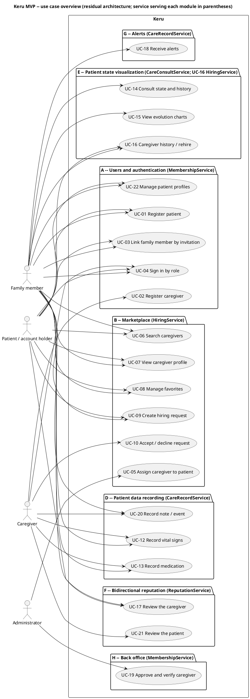
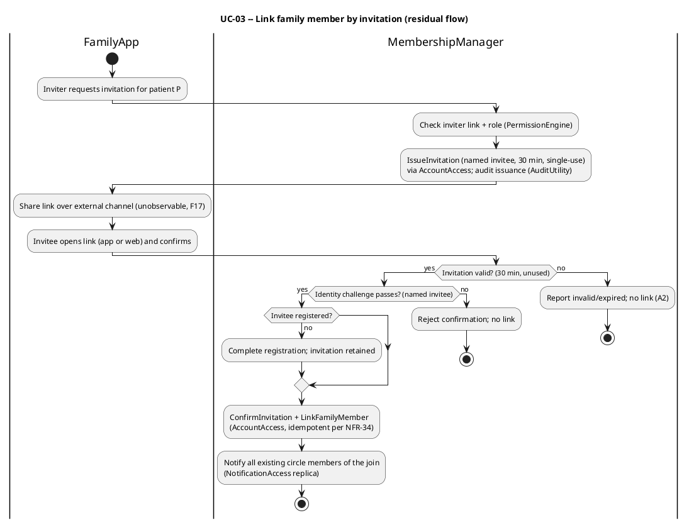
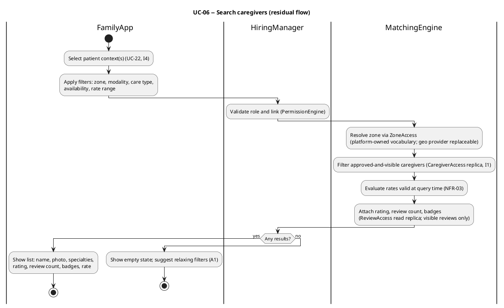
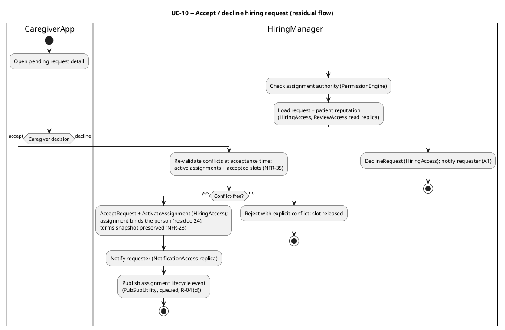
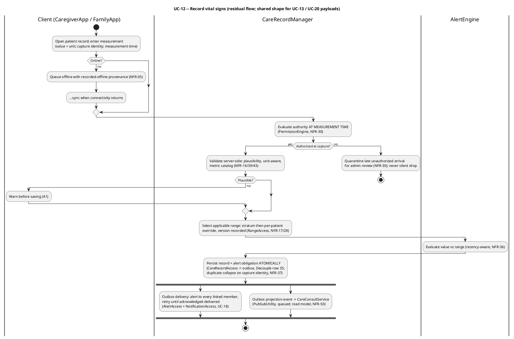
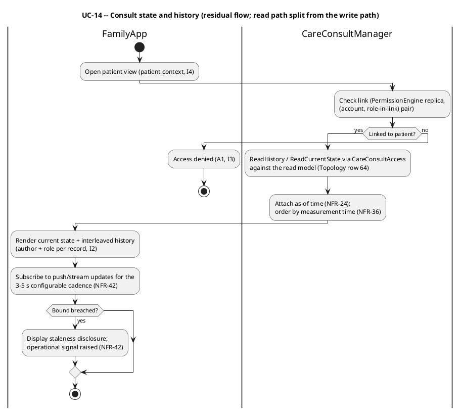
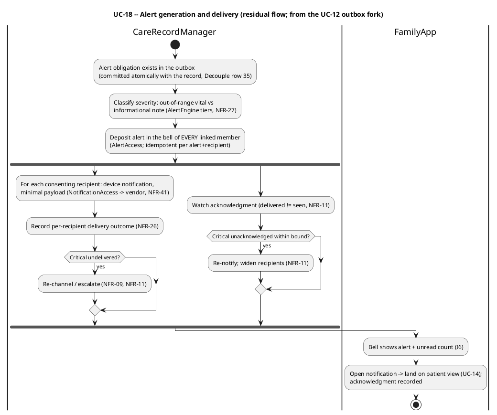
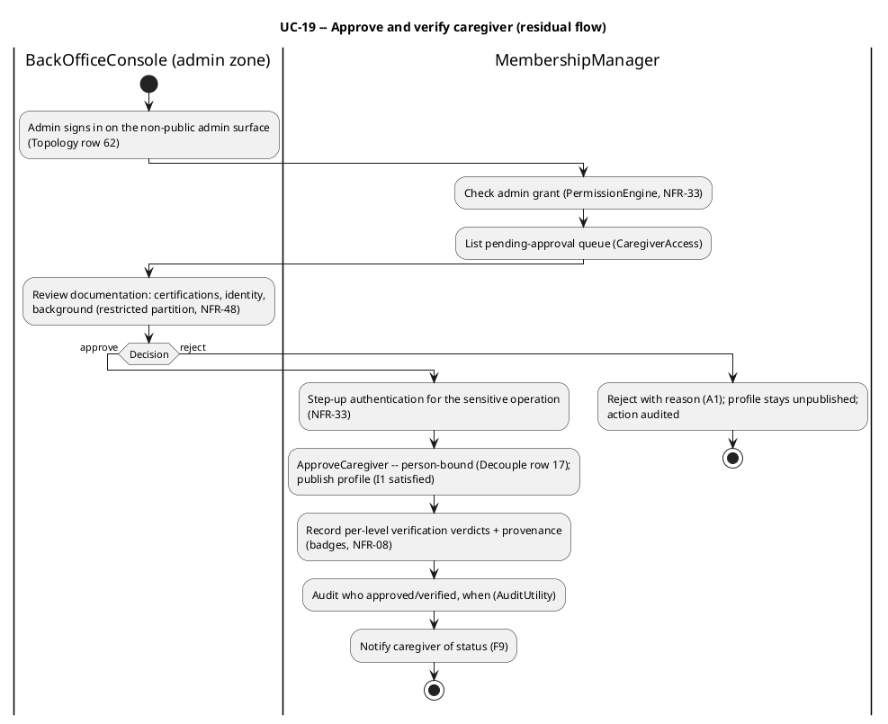
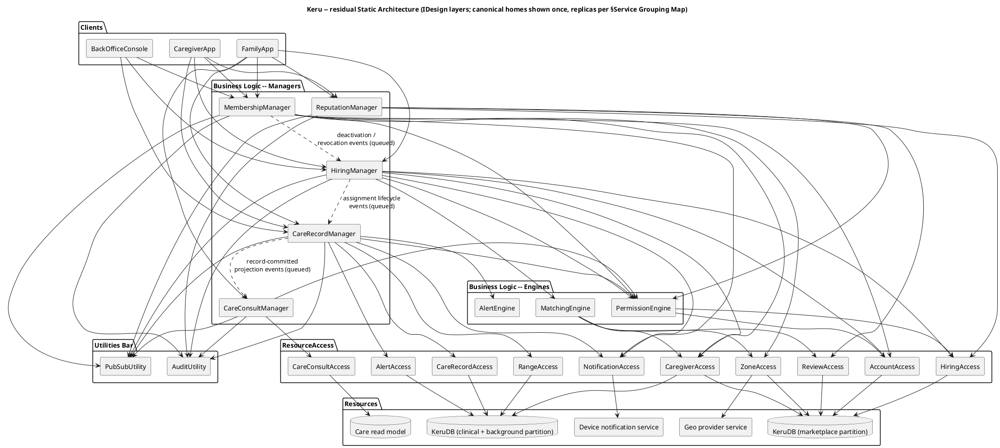

## Residual Design

> Expression of the residual architecture decided upstream (`stressor-catalog.md` -> `contagion-analysis.md`), in IDesign vocabulary, with the NFRs the Hyperliminal Coupling Map dictates (R-15) and the use cases as documentation only (R-16). This fragment contains: **58 derived NFRs** (44 sourced from the Coupling Map's `Document NFR contract` rows, 7 from the Topological Residue Map, 7 from the Business Residues Log -- every row with a resolvable Source); a residual static architecture of **28 components** (3 Clients, 5 Managers, 3 Engines, 10 ResourceAccess, 2 Utilities, 5 Resources) that applies exactly the **9 Decouple closures** of the Coupling Map (rows 10, 11, 14, 17, 18, 28, 30, 35, 49) and adds nothing else (R-18); **21 use cases** seeded verbatim-in-meaning from `Keru-Casos-de-Uso-MVP.md` (UC-01..UC-10, UC-12..UC-22; UC-11 reserved for the suspended payments module), each with its Residue Mapping; and **10 deployable units** (one C4 container per S4 §Service Grouping Map row, names verbatim per R-25) whose **7 deployment boundaries** each trace to a Topological Residue (R-19). The service grouping -- five Manager services including the S4-promoted `CareConsultManager` read path -- is consumed from S4, not re-decided here. No S4 backtrack candidate was found: every Decouple row is implementable under R-03/R-04, and no matrix re-read surfaced a missed IDesign override.

### Derived Non-Functional Requirements

Every NFR traces to a Hyperliminal Coupling Map row, a Topological Residue Map row, or a Business Residues Log entry in `contagion-analysis.md` (R-15 / guardrail #4). The nine Coupling Map rows whose response is `Decouple` produce **no** NFR here -- they are structural refactors applied in §Static Architecture (rows 10, 11, 14, 17, 18, 28, 30, 35, 49). NFR-01..NFR-44 follow the Coupling Map in row order; NFR-45..NFR-51 follow the Topological Residue Map; NFR-52..NFR-58 follow the Business Residues Log.

| NFR | Source (Matrix Cell / Topology Row / Business Residue #) | Specification |
|---|---|---|
| NFR-01 -- Lawful basis per patient | Hyperliminal Coupling #1 (S1) | Consent is captured and readable per patient (`RecordConsent` / `ReadConsentBasis` on `AccountAccess`); clinical and background-check data reside in-country (NFR-45); erasure is tombstone-with-trace, never a hard delete (I2). The governing regulation / jurisdiction / consent basis remain undecided (OQ-5 closure, DV-2): this contract is parameterized on that decision and blocks nothing meanwhile -- consent records and the residency boundary exist regardless of which regime is chosen. |
| NFR-02 -- Badge semantics | Hyperliminal Coupling #2 (S3) | Verification is time-decaying, registry-anchored, and revocable: every badge carries an issue basis and expiry posture; approval state and badge state may never disagree silently -- any divergence surfaces as an explicit reconciliation item in the back office. |
| NFR-03 -- Rate validity | Hyperliminal Coupling #3 (S4) | `MatchingEngine` evaluates the rate valid at query time (rates are effective-dated in `CaregiverAccess`); a hiring request pins the terms it was made against, and acceptance is evaluated against those pinned terms (with NFR-23's snapshot). |
| NFR-04 -- Non-human authorship readiness | Hyperliminal Coupling #4 (S6) | The I2 authorship contract admits `device identity + attesting human` as an author tuple for ingested records. Contract readiness only: no device-ingestion component is built (the S3 `DeviceIngestAccess` candidate was closed as an NFR contract in S4; wearables stay out of MVP scope). |
| NFR-05 -- Offline capture | Hyperliminal Coupling #5 (S8) | Clients capture offline and sync deferred; synced records carry explicit recorded-offline provenance; the degraded alerting bound is disclosed to the family (an alert bound that cannot hold is stated, never implied). Offline sync composes with NFR-30 (authority at measurement time), NFR-34/NFR-37 (idempotency / replay collapse), and NFR-36 (time semantics) as ONE offline-sync contract (matrix Reading #10a). |
| NFR-06 -- Export completeness | Hyperliminal Coupling #6 (S9) | A patient export (`ExportPatientRecord` on `CareConsultAccess`) is complete, attributable, and readable outside the platform; exports run only through the audited export path (with NFR-44/NFR-51). |
| NFR-07 -- Delegated authority | Hyperliminal Coupling #7 (S11) | Payer / manager / clinical-authority are roles on links, never account types; range authority is delegable under NFR-18's governance contract; bulk hiring fans out per patient through the existing per-patient request pattern. |
| NFR-08 -- Verification provenance | Hyperliminal Coupling #8 (S14) | Every badge records who or what verified it and when; the approval workflow admits a hybrid auto-verdict + human-escalation shape without contract change (the S3 `BackgroundCheckAccess` candidate was closed as an NFR contract in S4). |
| NFR-09 -- Channel independence | Hyperliminal Coupling #9 (S15) | Recording and the notification center are fully functional on web; loss of a device-push channel degrades to alternate channels, never to silence -- the in-app alert record is the guarantee (I6). |
| NFR-10 -- Payment integrity readiness | Hyperliminal Coupling #12 (S19) | The assignment state machine holds an explicit `paid` state distinct from closure (structural via Decouple row 49); payment verbs are idempotent under NFR-34; receipts persist. Keeps the DV-3 payments landing unblocked without building `PaymentAccess` now (closed as an NFR contract in S4). |
| NFR-11 -- Acknowledgment and escalation | Hyperliminal Coupling #13 (S20) | Delivered is distinct from seen: `AlertAccess` records per-recipient acknowledgment; an unacknowledged critical alert re-notifies and widens recipients within a stated bound; severity tiers (NFR-27) decide what escalates. |
| NFR-12 -- End-of-life state | Hyperliminal Coupling #15 (S22) | A patient end-of-life state freezes recording, suppresses alerting, and preserves read access (I2/I7); open assignments close with a terminal reason distinct from `finished`; review eligibility for the terminal case is an explicit recorded decision. |
| NFR-13 -- Patient agency | Hyperliminal Coupling #16 (S23) | Consent-holder vs manager vs viewer are distinguishable roles per link; the patient's own account is linkable to their profile with the consent-holder role; consent records anchor to the patient, not to the creating account. |
| NFR-14 -- Lifecycle clock | Hyperliminal Coupling #19 (S26) | Every assignment state has an owning driver (actor or timer); service periods may be fixed, recurring, or open-ended; completion never starves on a missing actor -- timer-driven transitions in `HiringManager` sweep due assignments via `QueryDueTransitions` on `HiringAccess`. |
| NFR-15 -- Cancellation and no-show | Hyperliminal Coupling #20 (S27) | Cancellation and no-show are first-class transitions by requester, caregiver, or administrator; urgent rehire re-runs matching scoped to the failed slot; no-show marks feed reputation only under an explicit recorded policy. |
| NFR-16 -- Metric catalog | Hyperliminal Coupling #21 (S28) | Metrics are data: definition, unit, plausibility bounds, and range semantics live in the catalog (`RangeAccess` / `CareRecordAccess`); `AlertEngine` evaluates against metric definitions, not hardcoded types; adding a metric is a catalog entry, not a platform project. |
| NFR-17 -- Stratified range selection | Hyperliminal Coupling #22 (S29) | Range selection resolves the applicable stratum (age band / condition) and then the per-patient override; the selection order is deterministic and every evaluation records which range was selected (with NFR-28). |
| NFR-18 -- Range authorship | Hyperliminal Coupling #23 (S30) | `SetRanges` is authored-with-role exactly like a clinical record (I2 discipline extended to configuration); the change history of every range is readable; `PermissionEngine` carries an explicit range-authority rule. WHO may set a per-patient range remains a business gap (`NEEDS CLARIFICATION`, UC-18) -- the contract binds whoever is named. |
| NFR-19 -- Invitation identity binding | Hyperliminal Coupling #24 (S31) | Confirmation challenges the named invitee (phone / mail challenge before the link lands); a circle join notifies all existing members through the alert path; circle membership is reviewable and revocable; issuance and confirmation are audited. The 30-minute single-use rule (OQ-2) is enforced at confirmation time. |
| NFR-20 -- Review eligibility evidence | Hyperliminal Coupling #25 (S32) | Before `SubmitReview` is accepted, service authenticity is checked against activity signals recorded on the hiring (recording happened during the period; distinct devices / identities); integrity flags on reviews and accounts are actionable by the back office. |
| NFR-21 -- Simultaneous reveal | Hyperliminal Coupling #26 (S33) | Reviews are sealed until both sides have submitted or the reveal window closes; I5 is untouched (still once, still immutable). |
| NFR-22 -- Moderation with trace | Hyperliminal Coupling #27 (S34) | Review visibility states (published / withheld-by-order / withheld-by-moderation) preserve the original content under restricted access; aggregates recompute over visible reviews only; every moderation action is audited. |
| NFR-23 -- Terms snapshot | Hyperliminal Coupling #29 (S36) | Assignment history preserves the served-under terms snapshot (I7 extended to terms); the rehire flow surfaces the snapshot-vs-current diff; a request pins the terms it was made against (with NFR-03). |
| NFR-24 -- Freshness disclosure | Hyperliminal Coupling #31 (S38) | Every consult response carries an as-of time; the client displays staleness rather than implying currency; alert evaluation always runs against the authoritative write path, never a replica or the read model. |
| NFR-25 -- Clinical durability | Hyperliminal Coupling #32 (S39) | Record-and-alert writes carry a durability posture stronger than the general store (outbox persistence, Decouple row 35): they survive restore divergence; any gap is disclosed explicitly in the history ("records between T1-T2 may be missing"), never silent. |
| NFR-26 -- Delivery observability | Hyperliminal Coupling #33 (S40) | Per-recipient delivery outcome is recorded in `AlertAccess`; an undelivered critical alert is detected and escalated or re-channeled (with NFR-09/NFR-11); "accepted by the vendor" is never treated as delivered. |
| NFR-27 -- Alarm relevance | Hyperliminal Coupling #34 (S41) | Delivery is idempotent per alert + recipient; severity tiers separate out-of-range vitals from informational notes; routing and escalation are severity-aware so the channel's noise floor never mutes the signal. |
| NFR-28 -- Evaluation provenance | Hyperliminal Coupling #36 (S43) | Ranges are effective-dated and never overwritten; every alert evaluation records the range version applied, so "why did no alert fire at 21:47" always has an answer. |
| NFR-29 -- Safety-critical configuration | Hyperliminal Coupling #37 (S44) | Platform-wide range changes carry plausibility bounds on the configuration itself, second-administrator confirmation, staged rollout, and change audit -- a settings write is treated as a clinical event for every patient at once. |
| NFR-30 -- Authority at measurement time | Hyperliminal Coupling #38 (S45) | `PermissionEngine` evaluates authority at measurement time, not sync time, with grace semantics for in-flight work; revocations propagate to clients promptly; genuinely unauthorized late arrivals are quarantined for administrator review, never silently dropped. |
| NFR-31 -- Moderation ripple | Hyperliminal Coupling #39 (S46) | Deactivation enumerates in-flight state (assignments, requests, invitations), notifies affected circles, and transitions each item to an explicit terminal or handover state; the ripple runs as a queued MembershipManager -> HiringManager workflow (R-04 (d)). |
| NFR-32 -- Approval revocation | Hyperliminal Coupling #40 (S47) | Revoke-approval is a first-class transition with exposure-window accounting: which searches and requests touched the account during the erroneous-approval window is answerable from the query trace. |
| NFR-33 -- Admin least privilege | Hyperliminal Coupling #41 (S48) | Administrators are subjects of `PermissionEngine` (read-clinical is a distinct, justified grant); sensitive operations require step-up authentication; every administrator action is audited through `AuditUtility`. |
| NFR-34 -- Platform idempotency | Hyperliminal Coupling #42 (S49) | Every mutating verb on every ResourceAccess takes a client-supplied operation identity; effect is at-most-once; duplicate collapse is defined per verb. This is the single highest-leverage P-raising contract in the system (matrix Reading #1). |
| NFR-35 -- Acceptance-time revalidation | Hyperliminal Coupling #43 (S50) | Acceptance re-checks conflicts against active assignments and pending accepted slots; availability is recomputed from assignments, not self-declaration alone; pending requests carry hold / expiry semantics. |
| NFR-36 -- Time semantics | Hyperliminal Coupling #44 (S51) | Measurement time is distinct from arrival time on every clinical record; current state and charts order by measurement time; alert evaluation is recency-aware (an hours-old out-of-range value alerts differently than a live one). |
| NFR-37 -- Clinical replay collapse | Hyperliminal Coupling #45 (S52) | Every measurement / administration carries a capture identity; duplicate collapse preserves the trace that a replay occurred (I2); rides NFR-34's idempotency contract with clinical rigor. |
| NFR-38 -- Alert-record linkage | Hyperliminal Coupling #46 (S53) | An alert references the record version that triggered it; correcting an alerting record re-evaluates and notifies resolution through the same delivery path, so the alert and the record never tell two stories about one event. |
| NFR-39 -- Unit-aware values | Hyperliminal Coupling #47 (S54) | Recording verbs take value + unit and normalize with trace; plausibility bounds and ranges evaluate unit-aware; unit definitions live in the metric catalog (NFR-16). |
| NFR-40 -- Manual-assignment provenance | Hyperliminal Coupling #48 (S55) | Administrator-initiated assignments are explicit, audited, consent-aware (they traverse caregiver acceptance, or record a documented consent-override state), and notified to both sides; every assignment records how it came to exist. |
| NFR-41 -- Token hygiene | Hyperliminal Coupling #50 (S57) | Device-notification bindings expire, are re-verified on device change, and are revoked on sign-out; the device notification carries a minimal payload ("you have an alert") -- clinical content lives behind authentication in the app (I6). |
| NFR-42 -- Witnessed freshness | Hyperliminal Coupling #51 (S58) | The configurable 3-5 s bound (OQ-6) is instrumented end-to-end: record-commit -> visible and record-commit -> delivered timestamps are measured; a breach surfaces as staleness disclosure to the client (NFR-24) and as an operational signal. |
| NFR-43 -- Server authority over the fleet | Hyperliminal Coupling #52 (S59) | Server-side validation is authoritative (never client-only); capability negotiation runs per client version; clinically breaking contract changes gate behind forced upgrade. |
| NFR-44 -- Jurisdiction routing | Hyperliminal Coupling #53 (S65) | Province-resident clinical data is mirrorable / hostable per provincial mandate; provincial audit access runs exclusively through the audited export path (NFR-06); routing rules co-locate with `ZoneAccess`'s per-province knowledge. |
| NFR-45 -- In-country residency | Topology row 1 | Clinical records and caregiver background documentation reside in the governing jurisdiction; consent and erasure semantics ride the same boundary; only aggregate / pseudonymized telemetry may leave; audited exports are the only cross-boundary read path; no cross-boundary read bypasses the recorded consent basis. |
| NFR-46 -- Independent scaling | Topology row 60 | The clinical loop (recording + alerting + consult) scales on active care shifts and watching families, independently of marketplace units; no shared autoscaling pool or shared process across the boundary; marketplace load can never throttle the clinical write / alert path. |
| NFR-47 -- Failure isolation | Topology row 61 | The recording / alerting path is the protected unit: it continues capture, evaluation, and delivery in degraded mode when marketplace units are down; no runtime dependency from the record -> evaluate -> deliver chain on marketplace, membership, or reputation availability; no shared fate (host or process) between clinical and commercial units. |
| NFR-48 -- Security zones | Topology row 62 | Three zones: public marketplace (holds only what search needs -- approved-profile projections and reputation aggregates), restricted clinical (clinical records + background documents, own keys and access paths), non-public admin (own authentication surface). Clinical-partition keys are never present in the marketplace zone; the back office is unreachable from the public network. |
| NFR-49 -- Change cadence | Topology row 63 | Marketplace components release at product speed without redeploying the clinical unit; the clinical record contract evolves additively, versioned, and slow; no lockstep release couples the two cadences; no marketplace deploy may mutate the clinical record, range, or alert semantics. |
| NFR-50 -- Resource profile split | Topology row 64 | Chart / history / consult reads are served from the read-optimized store fed asynchronously from the clinical write store, with staleness disclosed per NFR-24; chart scans never run against the transactional write store; alert evaluation never reads the read model. |
| NFR-51 -- Per-province sovereignty | Topology row 65 | The clinical store supports per-province residency / mirroring; a provincial mirror is never the platform's authoritative write path; provincial endpoints are served through the export / portability path (NFR-06). |
| NFR-52 -- Legal-posture readiness | Business residue #2 | The commercial relationship (terms, periods, payment declarations) is carried as recorded data, and no component encodes an employment stance -- if a court reclassifies the intermediation model, the restructuring is a legal / policy change over data the platform already holds. |
| NFR-53 -- Trust-response readiness | Business residue #5 | Verification, approval, and audit evidence (NFR-02, NFR-08, NFR-32, NFR-33) is composable on demand into publishable verification statistics and an externally certifiable approval-process package; the PR response never requires new instrumentation. |
| NFR-54 -- Modality vocabulary as data | Business residue #7 | Care modality (home / hospital) is data on profiles, requests, and assignments -- never structure -- so a modality-mix inversion is absorbable as vocabulary change pending the business pivot decision. |
| NFR-55 -- Approval throughput as operational SLA | Business residue #10 | Approval-queue throughput is a staffing / policy SLA measured operationally (signup-to-approval funnel); provisional marketplace visibility is forbidden absent an explicit business decision to relax I1. |
| NFR-56 -- Retention-tether continuity | Business residue #12 | The clinical record, alerting, and caregiver history remain complete and operable across rehires the platform does not observe -- history completeness never depends on monetized activity. |
| NFR-57 -- Segment-posture restraint | Business residue #13 | No monitoring / device offering is built ahead of the segment decision; the technical convergence path stays cataloged (stressor #6, NFR-04) and unblocked, nothing more (R-09). |
| NFR-58 -- Monetization instrument readiness | Business residue #18 | The completion / payment decoupling (Decouple row 49) keeps the payments landing (#19) unblocked; infrastructure cost is attributable to care activity in operational telemetry so the eventual instrument choice (subscription / listing / payments) is informed. |

### Behavioral Diagrams

The 21 input use cases of `Keru-Casos-de-Uso-MVP.md` (UC-01..UC-10, UC-12..UC-22; **UC-11 is reserved** in the source for the suspended payments module and is therefore absent here) SEED this section per `business-discovery` §Rich documentation input. Each use case below preserves the source's Main Flow, Alternative Flows / Exceptions, Preconditions / Postconditions, Business Rules, and Acceptance Criteria **faithfully and completely in English** (the source is Spanish; meaning is rendered exactly, nothing added), anchored `Keru-Casos-de-Uso-MVP.md §UC-NN`, with gaps marked `NEEDS CLARIFICATION`. Where an approved Open Question resolution amended a use case (OQ-1 mark-as-paid closure, OQ-2 30-minute single-use invitation, OQ-3 immutable one-time reviews, OQ-4 admin defaults + per-patient ranges, OQ-6 3-5 s configurable freshness for visibility and alerts, OQ-8 self-deactivation + back-office deactivation / hiding), the amendment is stated explicitly and sourced to `business-view.md §Open Questions` -- the original text is never silently altered. To each use case this section ADDS what the source cannot supply: the **Residue Mapping** (R-16 -- which residues shaped the components serving it), the residual **component mapping per flow step**, and the per-use-case NFRs (R-15).

Use cases document the resolved architecture; they drove **no** decomposition decision (R-16 / guardrail #5). No component below exists "because a use case needs it" -- every component cites its residues in §Static Architecture.

**Diagram policy.** All diagrams are PlantUML (`style-conventions` §6.2). One use-case overview diagram covers the actor-to-use-case map; full activity diagrams are drawn for the seven use cases that carry the MVP's end-to-end circuit and its critical loops (UC-03, UC-06, UC-10, UC-12, UC-14, UC-18, UC-19); sibling use cases whose control flow is shape-identical reference the shared diagram explicitly (e.g. UC-13 and UC-20 traverse UC-12's diagram with a different payload) -- this keeps the fragment reviewable without diluting the seeded fidelity, which lives in the text, not the picture.

#### Use case overview



---

#### UC-01 -- Register patient

**Source:** `Keru-Casos-de-Uso-MVP.md §UC-01` (scope §3.1). **Primary actor:** Family member or Patient. **Serving components:** FamilyApp -> `MembershipManager` -> `PermissionEngine`, `AccountAccess` -> KeruDB (marketplace partition).

**Description (seeded).** Create the patient's record (profile) with personal and basic clinical data. One account may create **several patient profiles** (UC-22) -- e.g. the mother and the father.

**Preconditions.** None (or an authenticated user when the profile is created by an already-registered account).

**Main flow (seeded; component per step).**

1. The user enters the personal data: name, age, date of birth, and photo. *(FamilyApp)*
2. Enters the main condition to be cared for. *(FamilyApp)*
3. Enters blood group and allergies. *(FamilyApp)*
4. Enters the emergency contact. *(FamilyApp)*
5. The system validates the data and creates the patient profile. *(`MembershipManager` -> `AccountAccess.CreatePatientProfile`; duplicate-candidate detection per residue #21 runs as a workflow step; the operation carries a client-supplied identity per NFR-34)*

**Alternative flows / exceptions (seeded).**

- A1. Missing or invalid mandatory data (e.g. a future date of birth): the system flags the fields and does not persist.
- A2. The photo is optional; the profile can be created without it.

**Postconditions (seeded).** A patient profile exists, consultable and linkable to family members and caregivers. Whoever creates the profile is linked to the patient.

**Acceptance criteria (seeded).**

- The profile stores: name, age, date of birth, photo, main condition, blood group, allergies, and emergency contact.
- Age can be derived from the date of birth (avoiding inconsistency between the two).
- The profile is available to the hiring (UC-09) and follow-up (UC-14) flows.
- One account can create and manage more than one patient profile (UC-22).

**Scenarios (residual).** *Main:* profile created; creator linked with the creating link's roles (consent-holder per NFR-13 pending the OQ-5 substance). *Alternative:* second sibling registers the same human -- duplicate-candidate detection (residue #21) surfaces a merge/link proposal instead of silently accepting a second clinical identity. *Exceptional:* validation failure (A1) persists nothing; a retried submit collapses onto the same operation identity (NFR-34).

##### Residue Mapping

| Residue # | Type | Relevance to this Use Case |
|---|---|---|
| 21 | Structural | Patient identity distinct from patient profile -- duplicate registration of the same human is detected and mergeable, so one human has one clinical history (Decouple row 14) |
| 23 | Structural | Patient agency -- the profile is created by another person; consent-holder vs manager vs viewer roles per link anchor to the patient (NFR-13) |
| 49 | Structural | Duplicate submission on flaky networks collapses idempotently (NFR-34) |
| 1 | Topological | Consent basis and residency ride profile creation (NFR-01 / NFR-45) |

##### Non-functional Requirements (per Use Case)

| Attribute | Specification | Source |
|---|---|---|
| Reliability | Profile creation is idempotent under retry (client-supplied operation identity) | Hyperliminal Coupling #42 (NFR-34) |
| Compliance | Consent capture and in-country residency apply from the first record | Hyperliminal Coupling #1 / Topology row 1 (NFR-01, NFR-45) |
| Integrity | Duplicate patient identities are detectable and mergeable without losing either history | Hyperliminal Coupling #14-adjacent Decouple row 14 (structural); trace preserved per I2 |

---

#### UC-02 -- Register caregiver

**Source:** `Keru-Casos-de-Uso-MVP.md §UC-02` (scope §3.1, §3.2 + product decision: prior admin approval). **Primary actor:** Caregiver. **Serving components:** CaregiverApp -> `MembershipManager` -> `AccountAccess`, `CaregiverAccess`, `ZoneAccess` (replica) -> KeruDB.

**Description (seeded).** Registration of the caregiver's professional profile. The new account remains **pending verification** and is not visible in the marketplace until the administrator approves it (UC-19).

**Preconditions.** None.

**Main flow (seeded; component per step).**

1. The caregiver creates their account and enters personal data. *(`MembershipManager` -> `AccountAccess`)*
2. Selects specialties: elder care, post-surgical, chronic illness, disability, palliative, pediatric, rehabilitation, companionship. *(`CaregiverAccess`)*
3. Uploads studies and certifications (nursing degree, auxiliary, CPR, geriatric care, etc.), each with institution and year. *(`CaregiverAccess`)*
4. Defines their time availability. *(`CaregiverAccess`)*
5. Defines their rates / plans. *(`CaregiverAccess.PublishRates` -- effective-dated per NFR-03)*
6. Defines their work zone and the modalities they serve (home or hospital). *(`ZoneAccess` resolves the zone against the platform-owned vocabulary -- residue #16)*
7. The system creates the profile in **pending verification** state and queues it for administrator review (UC-19); the caregiver sees the status of their application. *(`MembershipManager`)*

**Alternative flows / exceptions (seeded).**

- A1. Certifications missing institution or year: the system requires both fields.

**Postconditions (seeded).** Profile created in pending state; only when approved by the administrator (UC-19) does it appear in search results (UC-06) and become able to receive requests (UC-09).

**Acceptance criteria (seeded).**

- The profile records specialties, certifications (with institution and year), time availability, rates, zone, and modality.
- A new caregiver account is **not visible in the marketplace** until verified and approved by the administrator (UC-19).
- The caregiver can see their account status (pending / approved / rejected).
- Certifications are born "unverified" until the internal process verifies them (UC-19).

**Scenarios (residual).** *Main:* profile pending, queued. *Alternative:* the registering account is an agency fronting several humans -- person-level identity under the account (residue #24) keeps verification and assignment bound to the individual. *Exceptional:* the declared work zone belongs to a province with no defined zone scheme (DV-12) -- `ZoneAccess` isolates the per-province variability; registration proceeds against the platform-owned vocabulary.

##### Residue Mapping

| Residue # | Type | Relevance to this Use Case |
|---|---|---|
| 24 | Structural | Caregiver person distinct from caregiver account: badges, assignment, and reputation bind the person (Decouple row 17) |
| 16 | Structural | Work-zone declaration resolves through the platform-owned zone vocabulary, not the geo provider's (Decouple row 10) |
| 4 | Structural | Rates are effective-dated so published terms stay honest under inflation (NFR-03) |
| 3 | Structural | Badge semantics: verification is time-decaying, registry-anchored, revocable (NFR-02) |
| 49 | Structural | Registration retries collapse idempotently (NFR-34) |

##### Non-functional Requirements (per Use Case)

| Attribute | Specification | Source |
|---|---|---|
| Integrity | I1 structurally upheld: a pending profile is invisible to search and requests | Hyperliminal Coupling #2 (NFR-02); Business residue #10 (NFR-55) |
| Compliance | Background documentation lands in the restricted partition, in-country | Topology rows 62 / 1 (NFR-48, NFR-45) |
| Evolvability | Rates and zones are data (effective-dated rates; platform-owned zone vocabulary) | Hyperliminal Coupling #3 (NFR-03); Decouple row 10 |

---

#### UC-03 -- Link a family member to a patient by invitation

**Source:** `Keru-Casos-de-Uso-MVP.md §UC-03` (§2, §3.4 + product decision: invitation mechanics). **Primary actor:** invited family member. **Secondary actor:** patient or already-linked family member (the inviter). **Serving components:** FamilyApp -> `MembershipManager` -> `PermissionEngine`, `AccountAccess`, `NotificationAccess` (replica) -> KeruDB.

**Description (seeded).** The family-patient link is established through an **invitation code/link** shared over WhatsApp, mail, or another channel. If the invitee does not have the app, the link opens the Keru web to confirm the link. On confirmation, if not registered, the invitee is sent to registration and the link completes when it finishes.

**Preconditions.** The patient profile exists (UC-01).

**Main flow (seeded; component per step).**

1. The patient or an already-linked family member generates an invitation code/link from the patient's profile. *(`MembershipManager` -> `AccountAccess.IssueInvitation`; issuance audited per NFR-19)*
2. Shares the link over WhatsApp, mail, or another channel. *(outside the system -- flow F17, unobservable)*
3. The invitee opens the link: with the app installed it opens in the app; otherwise the link leads to the Keru web.
4. The screen shows the invitation to link with the patient and asks for confirmation.
5. The invitee presses "Yes, I confirm".
6. If already registered, they sign in and the system establishes the link. *(`AccountAccess.ConfirmInvitation` + `LinkFamilyMember`; identity challenge per NFR-19; circle-join notification to all existing members)*

**Alternative flows / exceptions (seeded).**

- A1. **Unregistered invitee:** on confirmation the system sends them to registration to create their user; on completion, the link with the patient is established automatically (the invitation is not lost during registration).
- A2. Invalid or expired code/link: the system reports it and creates no link.
- A3. The invitee does not confirm (closes or declines): no link is created.

**Postconditions (seeded).** The family member is linked to the patient: they can search / hire caregivers for them, consult their state, and record clinical data.

**Acceptance criteria (seeded).**

- The invitation code/link is unique and bound to one concrete patient.
- The link works as a deep link: opens the app when installed, the web when not (same confirmation in both).
- If the invitee is not registered, after creating their user the link is established with no extra steps.
- A patient can have one or more linked family members.
- A family member only accesses data of patients they are linked to.
- **Amendment (OQ-2 answer, `business-view.md §Open Questions`):** the source marks validity / reuse "to be defined"; resolved -- the invitation is valid **30 minutes** and **single-use** (not reusable), evaluated at confirmation time.

**Scenarios (residual).** *Main:* named invitee confirms within 30 minutes; challenge passes; circle notified of the join. *Alternative:* unregistered invitee -- invitation survives the registration detour (A1). *Exceptional:* forwarded / intercepted link -- the identity challenge (NFR-19) blocks a holder who is not the named invitee; a stranger who somehow joins is visible to the whole circle (join notification) and revocable (membership review).

##### Activity Diagram



##### Residue Mapping

| Residue # | Type | Relevance to this Use Case |
|---|---|---|
| 31 | Structural | Invitation interception / forwarding: identity binding, join notification, membership review, issuance audit (NFR-19) |
| 25 | Structural | The link carries roles; permission decides on (account, role-in-link) pairs (Decouple row 18) |
| 23 | Structural | Consent-holder vs manager vs viewer distinction attaches at link creation (NFR-13) |
| 49 | Structural | Confirmation retries collapse idempotently (NFR-34) |
| 1 | Topological | Link grants clinical read/write access -- consent basis recorded per NFR-01 |

##### Non-functional Requirements (per Use Case)

| Attribute | Specification | Source |
|---|---|---|
| Security | Confirmation challenges the named invitee; joins are visible to and revocable by the circle | Hyperliminal Coupling #24 (NFR-19) |
| Integrity | 30-minute single-use validity enforced at confirmation time | Hyperliminal Coupling #24 (NFR-19); OQ-2 answer |
| Auditability | Issuance and confirmation audited | Hyperliminal Coupling #24 (NFR-19); Coupling #41 (NFR-33) |

---

#### UC-04 -- Sign in and role-based authentication

**Source:** `Keru-Casos-de-Uso-MVP.md §UC-04` (scope §3.1). **Primary actor:** Patient, Family member, Caregiver, Administrator. **Serving components:** all Clients -> `MembershipManager` -> `PermissionEngine`, `AccountAccess`; the admin surface authenticates on its own zone (Topology row 62).

**Description (seeded).** Basic authentication; the session determines the role and, with it, the available capabilities and views.

**Preconditions.** Account created (UC-01/02/03).

**Main flow (seeded; component per step).**

1. The user enters their credentials. *(Client)*
2. The system validates and creates the session with the corresponding role. *(`MembershipManager` -> `AccountAccess`)*
3. The system shows the role's own interface (marketplace and follow-up for family/patient; agenda and metric recording for caregiver; back office for administrator). *(Client; per-context views for dual roles per Decouple row 18)*

**Alternative flows / exceptions (seeded).**

- A1. Invalid credentials: error message, no session.

**Postconditions (seeded).** Active session with assigned role.

**Acceptance criteria (seeded).**

- Every endpoint/screen validates role and link: a caregiver operates only on patients assigned to them; a family member only on patients they are linked to.
- The family member can consult and also **record** clinical data for their linked patients (UC-12, UC-13, UC-20).

**Scenarios (residual).** *Main:* session established; capabilities derive from (account, role-in-link/assignment) pairs, not a global account role. *Alternative:* the same human is both caregiver and family member (residue #25) -- both contexts are available in one identity, presented per context. *Exceptional:* administrator sign-in reaches the non-public admin zone only; sensitive admin operations demand step-up authentication (NFR-33).

##### Residue Mapping

| Residue # | Type | Relevance to this Use Case |
|---|---|---|
| 25 | Structural | Dual roles structural, not conditional: permission on (account, role-in-link/assignment) pairs (Decouple row 18) |
| 57 | Structural | Session / token hygiene: expiry, device-change re-verification, revoke-on-signout (NFR-41) |
| 48 | Structural | Administrators are subjects of `PermissionEngine`; step-up authentication (NFR-33) |
| 62 | Topological | The admin authentication surface is non-public (NFR-48) |

##### Non-functional Requirements (per Use Case)

| Attribute | Specification | Source |
|---|---|---|
| Security | Role-and-link enforcement on every operation (I3); admin least privilege with step-up | Hyperliminal Coupling #41 (NFR-33); Decouple row 18 |
| Security | Token lifecycle hygiene across devices | Hyperliminal Coupling #50 (NFR-41) |

---

#### UC-05 -- Assign caregiver to patient

**Source:** `Keru-Casos-de-Uso-MVP.md §UC-05` (scope §3.1). **Primary actor:** System (automatic path) / Administrator (manual path). **Serving components:** `HiringManager` -> `HiringAccess` -> KeruDB; manual path from BackOfficeConsole -> `HiringManager` (audited per NFR-40).

**Description (seeded).** Link one or more caregivers to a patient. The main path is **automatic**: when the caregiver accepts a hiring request (UC-09 + UC-10) -- initiated by the patient or a family member -- the system creates the assignment. Additionally, an **administrator can create the link manually** (support / special cases).

**Preconditions.** Patient and caregiver registered (caregiver with approved account).

**Main flow (seeded; component per step).**

1. The caregiver accepts the hiring request (or an administrator creates the link manually). *(`HiringManager`; the manual path is an explicit, audited workflow that still traverses caregiver acceptance or records a documented consent-override state -- NFR-40)*
2. The system registers the caregiver-patient assignment with its validity period. *(`HiringAccess.ActivateAssignment`; the assignment binds the **person**, not just the account -- residue #24; provenance recorded)*
3. When the service ends, the assignment transitions to historical state (kept for UC-16). *(assignment state machine; timer-driven transitions per NFR-14)*

**Postconditions (seeded).** The caregiver sees the patient in their list and can record data (UC-12/13/20); the family member and the patient see the assigned caregiver (UC-16).

**Acceptance criteria (seeded).**

- A patient can have **one or more** caregivers assigned simultaneously.
- Only a caregiver with a current assignment can record data for that patient.
- Finished assignments are preserved as history (never deleted) (I7).

**Notes.** `NEEDS CLARIFICATION` (source gap, flow-analysis coverage note 1 / residue #55): the source does not state **when** support may assign manually nor what consent still applies -- the residual contract (NFR-40) makes every manual assignment explicit, audited, consent-aware, and notified to both sides, but the business policy naming the allowed cases remains open.

**Scenarios (residual).** *Main:* acceptance activates the assignment; both sides notified. *Alternative:* manual admin assignment -- audited, provenance-recorded, both sides notified (NFR-40). *Exceptional:* the patient dies mid-assignment -- assignments close with a terminal reason distinct from `finished` (NFR-12); deactivation of the caregiver mid-assignment triggers the moderation-ripple workflow (NFR-31).

##### Residue Mapping

| Residue # | Type | Relevance to this Use Case |
|---|---|---|
| 55 | Structural | Manual assignment as an explicit, audited, consent-aware workflow (NFR-40) |
| 26 | Structural | Lifecycle clock: states with owning drivers; recurring / open-ended periods (NFR-14) |
| 24 | Structural | The assignment binds the person at the bedside, not an agency account (Decouple row 17) |
| 22 | Structural | End-of-life terminal reason distinct from `finished` (NFR-12) |
| 46 | Structural | Mid-flight deactivation transitions the assignment to an explicit terminal / handover state (NFR-31) |

##### Non-functional Requirements (per Use Case)

| Attribute | Specification | Source |
|---|---|---|
| Auditability | Every assignment records how it came to exist (provenance); manual paths audited | Hyperliminal Coupling #48 (NFR-40) |
| Reliability | Lifecycle transitions are timer-owned; completion never starves on a missing actor | Hyperliminal Coupling #19 (NFR-14) |
| Integrity | History preservation (I7) with terms snapshot | Hyperliminal Coupling #29 (NFR-23) |

---

#### UC-06 -- Search caregivers with filters

**Source:** `Keru-Casos-de-Uso-MVP.md §UC-06` (scope §3.2). **Primary actor:** Family member or Patient. **Serving components:** FamilyApp -> `HiringManager` -> `MatchingEngine` -> `CaregiverAccess` (replica), `ReviewAccess` (read replica), `ZoneAccess` -> KeruDB (marketplace partition).

**Description (seeded).** The platform's central axis: a caregiver search engine with combinable filters.

**Preconditions.** User authenticated as family member or patient.

**Main flow (seeded; component per step).**

1. The user opens the marketplace search and, if their account manages several patient profiles (UC-22), indicates which patient the search is for -- they may run **separate searches per patient or one search for more than one**. *(FamilyApp; patient context per I4)*
2. Applies filters: **zone / location** of the service and **modality** (home or hospital); **type of illness or care**: elder care, post-surgical, chronic illness, disability, palliative, pediatric, rehabilitation, companionship; **time availability** and **rate range**. *(`MatchingEngine`; zone resolves through `ZoneAccess` -- residue #16; rate filter evaluates the rate valid at query time -- NFR-03)*
3. The system returns the list of caregivers matching the filters, showing for each: name, photo, specialties, average rating, review count, verification badges, and rate. *(`MatchingEngine` over `CaregiverAccess` + `ReviewAccess`; aggregates computed over visible reviews only -- NFR-22)*
4. The user opens a profile (UC-07), saves it to favorites (UC-08), or starts a hiring (UC-09). *(FamilyApp)*

**Alternative flows / exceptions (seeded).**

- A1. No results: the system says so and suggests relaxing filters.

**Postconditions (seeded).** None (query).

**Acceptance criteria (seeded).**

- Only caregivers with an account **approved** by the administrator appear (UC-19) (I1).
- Filters are combinable (zone + care type + availability + rate + modality).
- Reputation (rating and reviews) and verification badges are visible from the listing itself, because they are choice criteria.
- The search operates in the context of one or more patient profiles (UC-22); hiring for several patients generates one request per patient (UC-09).
- **Amendment (OQ-7 closure, `business-view.md §Open Questions`):** zones are defined via the stakeholder's geographic-service decision; in CABA zones are neighborhoods; what a zone is in each other province is **accepted as not yet defined** (DV-12) -- structurally isolated inside `ZoneAccess`.

**Scenarios (residual).** *Main:* filtered result list with badges, rating, rate. *Alternative:* multi-patient search fans out into per-patient contexts. *Exceptional:* the geo provider is unavailable or its terms change -- matching survives on the platform-owned zone vocabulary persisted in KeruDB (Decouple row 10); a caregiver whose approval was revoked mid-window is absent, and the exposure window is accountable (NFR-32).

##### Activity Diagram



##### Residue Mapping

| Residue # | Type | Relevance to this Use Case |
|---|---|---|
| 16 | Structural | Zone resolution behind `ZoneAccess`; per-province variability isolated (Decouple row 10) |
| 4 | Structural | Rate filter matches on the rate valid at query time (NFR-03) |
| 3 | Structural | Badges shown mean something defined: time-decaying, registry-anchored (NFR-02) |
| 47 | Structural | Revoked approvals leave the result set with exposure-window accounting (NFR-32) |
| 32 | Structural | The rating shown is defensible: eligibility-evidenced reviews only (NFR-20) |
| 60 | Topological | Search runs in the marketplace scaling pool, never contending with the clinical loop (NFR-46) |

##### Non-functional Requirements (per Use Case)

| Attribute | Specification | Source |
|---|---|---|
| Availability | Search degrades independently of the clinical unit and never throttles it | Topology rows 60 / 61 (NFR-46, NFR-47) |
| Integrity | I1: only approved-and-visible caregivers in results | Hyperliminal Coupling #2 (NFR-02) |
| Evolvability | Zone vocabulary survives geo-provider loss | Decouple row 10 (structural); Topology row 63 (NFR-49) |

---

#### UC-07 -- View caregiver profile

**Source:** `Keru-Casos-de-Uso-MVP.md §UC-07` (scope §3.2). **Primary actor:** Family member or Patient. **Serving components:** FamilyApp -> `HiringManager` -> `CaregiverAccess` (replica), `ReviewAccess` (read replica).

**Description (seeded).** The caregiver's full profile with all the information needed to decide the hiring.

**Preconditions.** Caregiver with an approved account, published in the marketplace.

**Main flow (seeded; component per step).**

1. The user opens the profile from the search, from favorites, or from the patient's caregiver history (UC-16). *(FamilyApp)*
2. The system shows: studies and **certifications** with institution and year; **verification badges**: platform-verified certifications, validated identity, and background -- distinct verification levels; **reviews and rating** from other patients/families; specialties, experience, availability, and rates. *(`CaregiverAccess` + `ReviewAccess`; badge provenance per NFR-08)*

**Postconditions (seeded).** None (query).

**Acceptance criteria (seeded).**

- Which certifications are platform-verified and which are not is visually distinguished.
- The verification levels (certifications / identity / background) appear as differentiated badges.
- Reviews show rating and comment from real services (created via UC-17).

**Scenarios (residual).** *Main:* full profile. *Alternative:* profile opened from history during a rehire -- the snapshot-vs-current diff is surfaced (NFR-23). *Exceptional:* a review withheld by moderation or court order is absent from the visible set while its original is preserved under restricted access (NFR-22).

##### Residue Mapping

| Residue # | Type | Relevance to this Use Case |
|---|---|---|
| 3 | Structural | Badge meaning is published and time-decaying (NFR-02) |
| 14 | Structural | Every badge carries verification provenance (NFR-08) |
| 34 | Structural | Reviews shown are the visible set; withheld ones preserved under trace (NFR-22) |
| 36 | Structural | Rehire entry surfaces profile drift against the served-under snapshot (NFR-23) |

##### Non-functional Requirements (per Use Case)

| Attribute | Specification | Source |
|---|---|---|
| Integrity | Badge and approval state never disagree silently | Hyperliminal Coupling #2 (NFR-02) |
| Auditability | Badge provenance (who/what verified, when) is readable | Hyperliminal Coupling #8 (NFR-08) |

---

#### UC-08 -- Manage favorites

**Source:** `Keru-Casos-de-Uso-MVP.md §UC-08` (scope §3.2). **Primary actor:** Family member or Patient. **Serving components:** FamilyApp -> `HiringManager` -> `CaregiverAccess` (replica; favorites verbs) -> KeruDB (marketplace partition).

**Description (seeded).** Save caregivers of interest to compare and decide later.

**Preconditions.** Authenticated user.

**Main flow (seeded; component per step).**

1. The user marks a caregiver as favorite from the listing or the profile. *(`HiringManager` -> favorites verb; idempotent per NFR-34)*
2. The system adds them to the user's favorites list.
3. The user consults their favorites list and from it opens profiles or starts hirings.
4. The user can remove a caregiver from favorites.

**Postconditions (seeded).** Favorites list persisted per user.

**Acceptance criteria (seeded).**

- Favorites persist across sessions and devices (mobile and web).
- Mark / unmark is idempotent and immediately visible.

**Scenarios (residual).** *Main:* mark, list, unmark. *Alternative:* same favorite marked from two devices -- idempotent collapse. *Exceptional:* favorite caregiver later deactivated -- the favorite persists but hiring entry follows UC-16 A1 semantics (no rehire from an inactive profile). Note: the favorites surface is the catalog's flagged **unstressed surface** (S4 Reading #9); it is carried to S6's fresh test list.

##### Residue Mapping

| Residue # | Type | Relevance to this Use Case |
|---|---|---|
| 49 | Structural | Mark/unmark idempotency -- the source's own acceptance criterion is the idempotency family's shape (NFR-34) |
| 46 | Structural | A favorited-then-deactivated caregiver resolves to explicit visibility semantics (NFR-31) |

##### Non-functional Requirements (per Use Case)

| Attribute | Specification | Source |
|---|---|---|
| Reliability | Idempotent mark/unmark with immediate visibility across devices | Hyperliminal Coupling #42 (NFR-34) |

---

#### UC-09 -- Create hiring request (booking)

**Source:** `Keru-Casos-de-Uso-MVP.md §UC-09` (scope §3.2). **Primary actor:** Family member or Patient. **Serving components:** FamilyApp -> `HiringManager` -> `PermissionEngine`, `HiringAccess` -> KeruDB (marketplace partition).

**Description (seeded).** Request the hiring of a caregiver for a patient (first time or **rehire** from the history, UC-16). If the account manages several profiles (UC-22), the request states **which patient** it is for; hiring the same caregiver for two patients generates **one request per patient**.

**Preconditions.** Patient profile exists (UC-01); caregiver chosen.

**Main flow (seeded; component per step).**

1. The user starts the request from the caregiver's profile. *(FamilyApp)*
2. Completes: **patient data** (profile selection, UC-22), **modality** (home or hospital), **dates**, **special requirements**, and **contact data**. *(FamilyApp)*
3. The system registers the request and makes it visible to the caregiver. *(`HiringManager` -> `HiringAccess.SubmitRequest`; the request pins the terms it was made against -- NFR-03/NFR-23; hold/expiry semantics attach -- NFR-35; idempotent under retry -- NFR-34)*

**Alternative flows / exceptions (seeded).**

- A1. Dates outside the caregiver's published availability: the system warns.

**Postconditions (seeded).** Request created in initial (pending) state, bound to patient, requester, and caregiver.

**Acceptance criteria (seeded).**

- The request captures: patient, modality, dates, special requirements, and contact data.
- Each request belongs to **exactly one patient**; hiring for several patients generates separate requests, and the caregiver accepts or rejects each separately (UC-10) (I4).
- The request has a lifecycle with states: **pending -> accepted / declined -> in progress -> finished**, enabling the downstream assignment, metrics, and review flows. *(Source note preserved: if the payments module is included, a "paid" state is inserted between acceptance and service start.)*
- **Amendment (OQ-1 answer, `business-view.md §Open Questions`):** payment is outside the MVP -- the patient pays off-platform and **marks the operation as paid on the platform, which closes it**. The residual state machine additionally separates **service completion** from the **payment-declared** mark (Decouple row 49), so closure never rides the honor signal alone.

**Notes.** `NEEDS CLARIFICATION` (source gap, flow-analysis coverage note 2): the source names no owner for the `accepted -> in progress` and `in progress -> finished` transitions. The residual design assigns them timer-driven owners in `HiringManager` (NFR-14); the underlying business definition of the service-period model (fixed / recurring / open-ended) remains a stated product decision.

**Scenarios (residual).** *Main:* pending request visible to the caregiver, terms pinned. *Alternative:* rehire from history -- the snapshot-vs-current diff shown before submitting (NFR-23); one search for two patients fans out into two requests. *Exceptional:* double-tap on a flaky network -- one request (NFR-34); the requester cancels a pending request -- a first-class transition (NFR-15).

##### Residue Mapping

| Residue # | Type | Relevance to this Use Case |
|---|---|---|
| 4 | Structural | The request pins the rate/terms it was made against (NFR-03) |
| 36 | Structural | Rehire surfaces the served-under snapshot vs the current profile (NFR-23) |
| 50 | Structural | Hold/expiry semantics on pending requests; availability contention handled at acceptance (NFR-35) |
| 27 | Structural | Requester-side cancellation is a first-class transition (NFR-15) |
| 49 | Structural | Duplicate submissions collapse (NFR-34) |
| 26 | Structural | The request enters the explicit assignment state machine with owned transitions (NFR-14) |

##### Non-functional Requirements (per Use Case)

| Attribute | Specification | Source |
|---|---|---|
| Integrity | One request per patient (I4); terms pinned at submission | Hyperliminal Coupling #3 (NFR-03); Coupling #29 (NFR-23) |
| Reliability | Idempotent submission; holds expire deterministically | Hyperliminal Coupling #42 (NFR-34); Coupling #43 (NFR-35) |

---

#### UC-10 -- Accept or decline a hiring request

**Source:** `Keru-Casos-de-Uso-MVP.md §UC-10` (implicit in scope §3.2; **confirmed by product decision**: the caregiver must accept). **Primary actor:** Caregiver. **Serving components:** CaregiverApp -> `HiringManager` -> `PermissionEngine`, `HiringAccess`, `ReviewAccess` (read replica), `NotificationAccess` (replica).

**Description (seeded).** The caregiver receives the request, evaluates its detail (including the patient's reputation) and accepts or declines it. Acceptance activates the service.

**Preconditions.** Pending request (UC-09).

**Main flow (seeded; component per step).**

1. The caregiver sees the request detail (patient, modality, dates, requirements) together with the **patient's reputation** (reviews from other caregivers, UC-21). *(`HiringManager` -> `HiringAccess` + `ReviewAccess` read replica)*
2. Accepts the request. *(`HiringManager`: acceptance-time conflict re-check against active assignments and pending accepted slots -- NFR-35)*
3. The system notifies the requester and creates the caregiver-patient assignment (UC-05) for the contracted period. *(`HiringAccess.AcceptRequest` + `ActivateAssignment`; requester notified via `NotificationAccess` replica)*

**Alternative flows / exceptions (seeded).**

- A1. The caregiver declines: the request becomes declined and the requester is notified.

**Postconditions (seeded).** Request accepted (assignment created) or declined.

**Acceptance criteria (seeded).**

- The requester sees the updated status of their request (and receives the change notification).
- Only accepted requests generate an assignment and enable patient-data recording.
- *(Source note preserved: if payments are included, payment inserts between acceptance and assignment activation.)* **Amendment (OQ-1):** in the MVP, acceptance directly activates the assignment; closure happens later via the mark-as-paid declaration, with completion tracked separately (Decouple row 49).

**Scenarios (residual).** *Main:* accept -> assignment active -> requester notified. *Alternative:* decline (A1). *Exceptional:* two families race for the same slot -- the acceptance-time re-check rejects the second with an explicit conflict (NFR-35); a duplicated accept tap collapses (NFR-34); the accepting account is an agency -- the assignment binds the person who will serve (residue #24).

##### Activity Diagram



##### Residue Mapping

| Residue # | Type | Relevance to this Use Case |
|---|---|---|
| 50 | Structural | Acceptance-time revalidation defeats the availability race (NFR-35) |
| 24 | Structural | The assignment binds the bedside person (Decouple row 17) |
| 26 | Structural | Acceptance enters the explicit state machine with owned drivers (NFR-14) |
| 27 | Structural | No-show after acceptance has a first-class exit and urgent-rehire path (NFR-15) |
| 33 | Structural | The patient reputation shown is reveal-disciplined, informative (NFR-21) |
| 49 | Structural | Duplicate accept taps collapse (NFR-34) |

##### Non-functional Requirements (per Use Case)

| Attribute | Specification | Source |
|---|---|---|
| Integrity | Accepted means conflict-free at acceptance time | Hyperliminal Coupling #43 (NFR-35) |
| Reliability | Requester notification rides observable delivery | Hyperliminal Coupling #33 (NFR-26) |

---

#### UC-12 -- Record vital signs

**Source:** `Keru-Casos-de-Uso-MVP.md §UC-12` (scope §3.3 + product decision: the family member also records). **Primary actor:** Caregiver or linked Family member. **Serving components:** CaregiverApp / FamilyApp -> `CareRecordManager` -> `PermissionEngine`, `AlertEngine`, `CareRecordAccess`, `RangeAccess`, `AlertAccess`, `NotificationAccess` -> KeruDB (clinical partition + outbox).

**Description (seeded).** The caregiver during their shift -- or a linked family member -- records the patient's vital signs.

**Preconditions.** Caregiver with a current assignment to the patient (UC-05), or family member linked to the patient (UC-03).

**Main flow (seeded; component per step).**

1. The user (caregiver or family member) opens the patient's record. *(Client)*
2. Enters a measurement with one or more of these values: blood pressure (**systolic/diastolic**), heart rate, temperature, oxygen saturation, blood glucose. *(Client; offline capture queues locally with recorded-offline provenance -- NFR-05; values carry units -- NFR-39)*
3. The system saves the record **dated (date and time) and bound to the user who recorded it** (caregiver or family member). *(`CareRecordManager`: `PermissionEngine` evaluates authority at measurement time (NFR-30) -> `CareRecordAccess.RecordVitals` persists record + alert obligation atomically in the transactional outbox (Decouple row 35); measurement time distinct from arrival time -- NFR-36; capture identity collapses replays -- NFR-37; server-side validation authoritative -- NFR-43)*

**Alternative flows / exceptions (seeded).**

- A1. Values outside physiologically plausible bounds (typing error): the system warns before saving. *(plausibility bounds come from the metric catalog, unit-aware -- NFR-16/NFR-39)*
- A2. Value outside the configured range: the alert to family members fires (UC-18). *(evaluation by `AlertEngine` against the applicable range version, recorded -- NFR-17/NFR-28)*

**Postconditions (seeded).** The record is immediately available in the patient's history and charts (UC-14/15). *(visible within the 3-5 s configurable bound -- OQ-6 amendment, instrumented per NFR-42; projection to the read model is asynchronous with disclosed staleness -- NFR-50)*

**Acceptance criteria (seeded).**

- Each record persists: values, date/time, and **author with role** (traceability, I2).
- Only caregivers with a current assignment and family members linked to the patient may record.
- Records are never silently edited: any correction preserves traceability (I2).

**Scenarios (residual).** *Main:* record committed + alert obligation persisted atomically; visible to the family within the instrumented bound. *Alternative:* offline shift -- capture queues, syncs later with offline provenance, measurement-time ordering, and replay collapse (Reading #10a's ONE offline-sync contract). *Exceptional:* link revoked mid-shift -- capture-time authority governs; genuinely unauthorized late arrivals quarantine for review, never silently dropped (NFR-30).

##### Activity Diagram



##### Residue Mapping

| Residue # | Type | Relevance to this Use Case |
|---|---|---|
| 42 | Structural | Transactional outbox: record-commit and alert obligation are one atomic fact (Decouple row 35) |
| 49 / 52 | Structural | Idempotent capture; replay collapse preserving the replay trace (NFR-34, NFR-37) |
| 51 | Structural | Measurement time vs arrival time; ordering and recency-aware evaluation (NFR-36) |
| 54 | Structural | Unit-aware values and plausibility (NFR-39) |
| 8 | Structural | Offline capture with provenance and disclosed degraded alerting (NFR-05) |
| 45 | Structural | Authority at measurement time; quarantine for late unauthorized arrivals (NFR-30) |
| 28 / 29 | Structural | Metric catalog and stratified range selection (NFR-16, NFR-17) |
| 59 | Structural | Server authority over an aging client fleet (NFR-43) |
| 60 / 61 | Topological | The recording path runs in the protected, independently scaled clinical unit (NFR-46, NFR-47) |

##### Non-functional Requirements (per Use Case)

| Attribute | Specification | Source |
|---|---|---|
| Reliability | Record and alert obligation committed atomically; no silent alert loss | Hyperliminal Coupling #35-adjacent Decouple row 35; Coupling #32 (NFR-25) |
| Performance | Record-commit -> visible and -> delivered within the configurable 3-5 s bound, instrumented | Hyperliminal Coupling #51 (NFR-42) |
| Integrity | I2 authorship + correction trace; capture-time authority | Hyperliminal Coupling #38 (NFR-30); Coupling #45 (NFR-37) |

---

#### UC-13 -- Record administered medication

**Source:** `Keru-Casos-de-Uso-MVP.md §UC-13` (scope §3.3 + product decision: the family member also records). **Primary actor:** Caregiver or linked Family member. **Serving components:** same chain as UC-12.

**Description (seeded).** Record each medication administration to the patient, whether during the caregiver's shift or by a family member.

**Preconditions.** Caregiver with a current assignment, or family member linked to the patient.

**Main flow (seeded; component per step).**

1. The user (caregiver or family member) opens the patient's record. *(Client)*
2. Records: **medication, dose, time, and observations**. *(Client)*
3. The system saves the record dated and bound to the user who recorded it. *(`CareRecordManager` -> `CareRecordAccess.RecordMedication`; same atomic-outbox, capture-identity, and measurement-time contract as UC-12)*

**Postconditions (seeded).** Record visible in the patient's history (UC-14).

**Acceptance criteria (seeded).**

- Each record persists: medication, dose, time, observations, date/time, and author with role.
- Same traceability and permission rules as UC-12 (I2, I3).

**Scenarios (residual).** *Main:* administration recorded. *Alternative:* offline replay of an afternoon's queue -- duplicate administrations collapse on capture identity while preserving the replay trace, so the record never says the patient received a double dose it cannot substantiate (NFR-37). *Exceptional:* as UC-12 (quarantine path).

**Activity diagram:** traverses UC-12's diagram with the medication payload (no range evaluation branch; a medication record does not alert by itself in the source -- alerts attach to vitals (UC-12 A2) and notes (UC-20)).

##### Residue Mapping

| Residue # | Type | Relevance to this Use Case |
|---|---|---|
| 52 | Structural | Duplicate medication administrations are clinically dangerous misinformation; replay collapse with trace (NFR-37) |
| 49 | Structural | Idempotent mutating verbs (NFR-34) |
| 51 | Structural | Measurement-time ordering of the administration timeline (NFR-36) |
| 45 | Structural | Capture-time authority for offline shifts (NFR-30) |

##### Non-functional Requirements (per Use Case)

| Attribute | Specification | Source |
|---|---|---|
| Integrity | The medication timeline misinforms no next clinical decision: replay-collapsed, measurement-ordered, author-traced | Hyperliminal Coupling #45 (NFR-37); Coupling #44 (NFR-36) |

---

#### UC-14 -- Consult the patient's state and history

**Source:** `Keru-Casos-de-Uso-MVP.md §UC-14` (scope §3.4 -- **modified by product decision**: the family member is not read-only; they also record data, UC-12/13/20). **Primary actor:** Family member. **Serving components:** FamilyApp -> `CareConsultManager` -> `PermissionEngine` (replica), `CareConsultAccess` -> Care read model (fed from the clinical partition).

**Description (seeded).** View of the patient's state with the history of vital signs, medication, and notes, accessible from anywhere.

**Preconditions.** Family member linked to the patient (UC-03).

**Main flow (seeded; component per step).**

1. The family member opens the patient view. *(FamilyApp)*
2. The system shows the current state (latest measurements) and the chronological history of vital signs, medication, and notes, each record with date/time and author (caregiver or family member). *(`CareConsultManager` -> `CareConsultAccess.ReadHistory` against the read model; ordered by measurement time -- NFR-36; response carries as-of time -- NFR-24)*

**Alternative flows / exceptions (seeded).**

- A1. User not linked to the patient: access denied. *(`PermissionEngine` replica on (account, role-in-link) pairs)*

**Postconditions (seeded).** None (query).

**Acceptance criteria (seeded).**

- From this view the family member can also start data entry (UC-12, UC-13, UC-20).
- A record entered by the caregiver or by another family member appears in the view without perceptible delay (the source's "real-time" follow-up per its §1). **Amendment (OQ-6 answer, `business-view.md §Open Questions`):** quantified -- the refresh interval is **3 to 5 seconds and configurable**, kept configurable for future analysis; the residual serves the cadence by push/stream from the projection rather than raw polling (residue #37/#58).
- Works identically on mobile and web.

**Scenarios (residual).** *Main:* fresh state within the bound, as-of disclosed. *Alternative:* two siblings on two devices -- both read the same projection with the same disclosed as-of time, so "which screen is true" has an answer (residue #38). *Exceptional:* projection lag exceeds the bound -- the client displays staleness instead of implying currency, and the breach raises an operational signal (NFR-42).

##### Activity Diagram



##### Residue Mapping

| Residue # | Type | Relevance to this Use Case |
|---|---|---|
| 37 | Structural | Consult served from the read-optimized projection; the watching crowd never crowds out the care record (Decouple row 30) |
| 38 | Structural | Freshness disclosed as-of; one answer to "which screen is true" (NFR-24) |
| 58 | Structural | The 3-5 s bound is witnessed end-to-end, not assumed (NFR-42) |
| 51 | Structural | Current state ordered by measurement time, not arrival (NFR-36) |
| 21 | Structural | The history read is the merged clinical identity's, not a fragment's (Decouple row 14) |
| 64 / 60 | Topological | Scan-heavy consult workload on its own resource and scaling curve (NFR-50, NFR-46) |

##### Non-functional Requirements (per Use Case)

| Attribute | Specification | Source |
|---|---|---|
| Performance | Record visible within the configurable 3-5 s bound; served by push/stream from the projection | Hyperliminal Coupling #51 (NFR-42); Topology row 64 (NFR-50) |
| Scalability | Consult scales on watching families, isolated from bedside writes | Topology row 60 (NFR-46) |
| Integrity | As-of disclosure; alert evaluation never reads this path | Hyperliminal Coupling #31 (NFR-24) |

---

#### UC-15 -- View evolution charts

**Source:** `Keru-Casos-de-Uso-MVP.md §UC-15` (scope §3.4). **Primary actor:** Family member. **Serving components:** FamilyApp -> `CareConsultManager` -> `CareConsultAccess` -> Care read model.

**Description (seeded).** Evolution charts of the patient's metrics over time.

**Preconditions.** Linked family member; metric records exist.

**Main flow (seeded; component per step).**

1. The family member opens the evolution section. *(FamilyApp)*
2. The system charts each metric (systolic/diastolic pressure, heart rate, temperature, saturation, blood glucose) over time. *(`CareConsultAccess.ReadSeries` over the read model -- scan-heavy work on the analytics resource profile, Topology row 64)*
3. The family member adjusts the displayed period. *(FamilyApp)*

**Postconditions (seeded).** None (query).

**Acceptance criteria (seeded).**

- Each metric is chartable over time; blood pressure shows systolic and diastolic.
- With little or no data, the view communicates it clearly (empty state).

**Scenarios (residual).** *Main:* per-metric series over an adjustable period, measurement-time ordered. *Alternative:* metric added later via the catalog -- charts are generic over metric definitions (NFR-16). *Exceptional:* no data -- explicit empty state; a disclosed history gap (NFR-25) renders as a gap, never as an uneventful stretch.

**Activity diagram:** traverses UC-14's diagram with `ReadSeries` in place of `ReadHistory` (same permission gate, same read-model path, same as-of disclosure).

##### Residue Mapping

| Residue # | Type | Relevance to this Use Case |
|---|---|---|
| 37 | Structural | Chart scans run on the read model, never the transactional write store (Decouple row 30) |
| 28 | Structural | Charts generic over the metric catalog (NFR-16) |
| 54 | Structural | Series render normalized, unit-traced values (NFR-39) |
| 39 | Structural | Restore gaps disclosed in the series, never silent (NFR-25) |
| 64 | Topological | Time-series workload on its own resource profile (NFR-50) |

##### Non-functional Requirements (per Use Case)

| Attribute | Specification | Source |
|---|---|---|
| Performance | Scan-heavy chart queries isolated from the alert path | Topology row 64 (NFR-50) |
| Integrity | Gaps disclosed explicitly in the rendered series | Hyperliminal Coupling #32 (NFR-25) |

---

#### UC-16 -- View the patient's caregivers (current and historical) and rehire

**Source:** `Keru-Casos-de-Uso-MVP.md §UC-16` (scope §3.4 + product decision: caregiver history and rehire). **Primary actor:** Family member or Patient. **Serving components:** FamilyApp -> `HiringManager` -> `HiringAccess.ListCaregiverHistory`, `CaregiverAccess` (replica).

**Description (seeded).** See the caregivers currently assigned to the patient and also the **history of all caregivers who attended them**, with access to their current profiles to **rehire** them.

**Preconditions.** Linked family member or the patient themself; at least one assignment exists (current or historical).

**Main flow (seeded; component per step).**

1. The user opens the patient view. *(FamilyApp)*
2. The system shows the caregivers with a current assignment and, separately, the **history of previous caregivers** with the period in which they attended the patient. *(`HiringAccess.ListCaregiverHistory`; history preserves the served-under terms snapshot -- NFR-23; I7)*
3. From any of them, the user opens the caregiver's current profile (UC-07). *(rehire entry surfaces the snapshot-vs-current diff -- NFR-23)*
4. From the profile they can start a new hiring (UC-09) to rehire.

**Alternative flows / exceptions (seeded).**

- A1. A historical caregiver is no longer active on the platform: shown in the history but without the rehire option. **Amendment (OQ-8 answer, `business-view.md §Open Questions`):** "no longer active" is now defined -- any user can self-deactivate (for a caregiver this ends marketplace visibility), and the administrator can deactivate a user or hide them from the marketplace through the back office.

**Postconditions (seeded).** None (query); may lead to a rehire (UC-09).

**Acceptance criteria (seeded).**

- All caregivers with a current assignment and all historical ones are shown, with their service periods.
- From the history the user reaches the caregiver's **current profile** and can start a rehire (UC-09).
- The patient and the family member both have access to this view.

**Scenarios (residual).** *Main:* current + historical with periods. *Alternative:* rehire of "the caregiver from March" -- the diff between remembered terms and today's profile is explicit (NFR-23). *Exceptional:* a deactivated caregiver is later reinstated -- history knits back together and rehire re-enables (Looping Signal #68: the state machine runs backwards over existing transitions).

##### Residue Mapping

| Residue # | Type | Relevance to this Use Case |
|---|---|---|
| 36 | Structural | Terms-snapshot history; rehire diff (NFR-23) |
| 22 | Structural | Terminal reasons distinct from `finished` render honestly in history (NFR-12) |
| 46 / 47 | Structural | Deactivated / revoked caregivers shown without rehire, with explicit lifecycle semantics (NFR-31, NFR-32) |
| 26 | Structural | Periods exist because the lifecycle clock closes assignments (NFR-14) |
| 68 | Combined | Reinstatement is the inverse traversal of existing transitions -- no new structure |

##### Non-functional Requirements (per Use Case)

| Attribute | Specification | Source |
|---|---|---|
| Integrity | History complete and never deleted (I7), independent of platform-observed activity | Hyperliminal Coupling #29 (NFR-23); Business residue #12 (NFR-56) |

---

#### UC-17 -- Rate and review the caregiver

**Source:** `Keru-Casos-de-Uso-MVP.md §UC-17` (scope §3.6). **Primary actor:** Family member or Patient. **Serving components:** FamilyApp -> `ReputationManager` -> `PermissionEngine` (replica), `HiringAccess` (read replica), `ReviewAccess` -> KeruDB (marketplace partition).

**Description (seeded).** After the service, the family member/patient rates the caregiver; reviews feed the reputation visible in the marketplace.

**Preconditions.** Service contracted and finished with that caregiver.

**Main flow (seeded; component per step).**

1. The user opens the finished hiring. *(FamilyApp)*
2. Enters a rating (score) and a review (comment). *(FamilyApp)*
3. The system saves the review bound to the service and recalculates the caregiver's reputation (average and count). *(`ReputationManager`: eligibility checked against completion state and activity evidence -- NFR-20, Decouple row 49; review sealed until both sides submit or the window closes -- NFR-21; `ReviewAccess.SubmitReview` idempotent -- NFR-34)*
4. The review becomes visible on the profile (UC-07) and the reputation on the listing (UC-06). *(aggregates recompute over visible reviews -- NFR-22)*

**Alternative flows / exceptions (seeded).**

- A1. Attempt to review without a finished service with that caregiver: not allowed (prevents fake reviews) (I5).
- A2. Attempt at a second review of the same service: not allowed. **Amendment (OQ-3 answer, `business-view.md §Open Questions`):** the source left "reject or edit" to be defined; resolved -- each side reviews **exactly once and the review is immutable**; a second attempt is rejected, never treated as an edit.

**Postconditions (seeded).** Caregiver reputation updated.

**Acceptance criteria (seeded).**

- Only users with a finished service can review that caregiver.
- The average rating and review count update on publication. *(residual nuance: "publication" is the reveal event under NFR-21's sealing)*

**Scenarios (residual).** *Main:* eligible review sealed, revealed, aggregated. *Alternative:* the counterpart never reviews -- the reveal window closes and the single review publishes. *Exceptional:* review-farm fabrication attempt -- eligibility evidence (activity signals on the hiring) blocks it, and review eligibility keys to **completion**, not the honor mark (Decouple row 49), so mark-as-paid alone fabricates nothing (NFR-20); a court-ordered takedown moves the review to a withheld visibility state preserving the original and the aggregates' honesty (NFR-22).

##### Residue Mapping

| Residue # | Type | Relevance to this Use Case |
|---|---|---|
| 32 | Structural | Eligibility evidence defeats zero-cost fabrication (NFR-20) |
| 33 | Structural | Simultaneous reveal defeats retaliation dynamics (NFR-21) |
| 34 | Structural | Moderation with trace reconciles I5 with legal takedown (NFR-22) |
| 56 | Structural | Review eligibility keyed to completion, not the paid mark (Decouple row 49) |
| 49 | Structural | One review per side per service, idempotent under retry (NFR-34; I5) |

##### Non-functional Requirements (per Use Case)

| Attribute | Specification | Source |
|---|---|---|
| Integrity | I5 upheld: real finished service, once, immutable; sealed until reveal | Hyperliminal Coupling #25 / #26 (NFR-20, NFR-21) |
| Auditability | Moderation actions audited; originals preserved under restricted access | Hyperliminal Coupling #27 (NFR-22) |

---

#### UC-18 -- Receive patient alerts and notifications

**Source:** `Keru-Casos-de-Uso-MVP.md §UC-18` (scope §3.7, elevated from optional to **mandatory** by product decision). **Primary actor:** Family member (recipient); triggered by records from the Caregiver or another Family member. **Serving components:** `CareRecordManager` -> `AlertEngine`, `RangeAccess`, `AlertAccess`, `NotificationAccess` -> Device notification service; notification-center reads: FamilyApp -> `CareRecordManager` -> `AlertAccess`.

**Description (seeded).** Notice to the family member when a vital sign goes out of range or when a note is recorded. On first install/open, Keru asks permission to send device notifications; if the user accepts, they receive them; if not, alerts remain available in an **in-app notification center (bell)**. The bell always exists; the device notification is additional.

**Preconditions.** Linked family member; reference ranges defined per metric.

**Main flow (seeded; component per step).**

1. On first launch, the app requests notification permission (native iOS/Android flow; browser permission on web). *(Client; F49)*
2. The caregiver or a family member records a vital sign (UC-12) or a note (UC-20).
3. The system evaluates the value against the configured range (or detects the note). *(`AlertEngine`; applicable range = stratum then per-patient override, version recorded -- NFR-17/NFR-28; always against the authoritative write path -- NFR-24)*
4. The system generates the alert and **always** deposits it in the notification center (bell) of every linked family member, with an unread counter. *(alert obligation persisted atomically with the record -- Decouple row 35; `AlertAccess`; per alert+recipient idempotent -- NFR-27)*
5. If the family member granted permission, they additionally receive the device notification. *(`NotificationAccess` -> vendor; minimal payload -- NFR-41; per-recipient delivery outcome recorded -- NFR-26)*
6. The family member opens the notification (device or bell) and lands on the patient view (UC-14). *(acknowledgment recorded -- NFR-11)*

**Alternative flows / exceptions (seeded).**

- A1. Device-notification permission declined: alerts are seen only in the bell; the user can enable the permission later from the app settings.

**Points to define (seeded).** The source leaves open who configures per-metric ranges and their defaults. **Amendment (OQ-4 answer, `business-view.md §Open Questions`):** the **administrator configures platform-wide per-metric defaults for everyone** (some ranges are globally homogeneous -- e.g. low-grade fever from 37 degC, fever from 38 degC); each patient record carries the default unless a **per-patient range** overrides it. `NEEDS CLARIFICATION` (remaining gap, flow-analysis coverage note 4 / residue #30): WHO may set a per-patient range (family member? caregiver? clinician?) is still unnamed -- the residual contract (NFR-18) binds whoever the business names, with authored-with-role governance either way.

**Postconditions (seeded).** Alert persisted in the notification center with read/unread state.

**Acceptance criteria (seeded).**

- The alert identifies patient, metric, recorded value, and time (or the note's text).
- Every family member linked to the patient is notified.
- Every alert remains in the notification center even with device notifications disabled; the device notification is additional, never the only record (I6).
- The bell shows the unread-notification counter.
- **Amendment (OQ-6 answer, `business-view.md §Open Questions`):** alert delivery is bounded by the same **configurable 3-5 s** interval that bounds visibility freshness, instrumented end-to-end (NFR-42).

**Scenarios (residual).** *Main:* out-of-range vital -> alert deposited for every linked member -> device notification to consenting recipients -> acknowledgment recorded. *Alternative:* permission declined (A1) -- bell-only; vendor degrades silently -- delivery observability detects undelivered-critical and re-channels/escalates (NFR-26). *Exceptional:* nobody acknowledges a critical alert -- re-notify and widen recipients within the stated bound (NFR-11); the triggering record is corrected -- re-evaluate and notify resolution through the same path (NFR-38); an alert storm from a config error is bounded by the safety-critical configuration contract (NFR-29) and severity tiers (NFR-27) -- the config-blast chain (matrix Reading #10b) is designed against as a chain.

##### Activity Diagram



##### Residue Mapping

| Residue # | Type | Relevance to this Use Case |
|---|---|---|
| 42 | Structural | No silent alert loss: obligation atomic with the record, delivery retried from the outbox (Decouple row 35) |
| 20 | Structural | Acknowledgment and escalation beyond delivery (NFR-11) |
| 40 / 41 | Structural | Delivery observability; idempotent, severity-tiered delivery (NFR-26, NFR-27) |
| 29 / 30 / 43 / 44 | Structural | Range stratification, authorship, versioning, and safety-critical configuration (NFR-17, NFR-18, NFR-28, NFR-29) |
| 53 | Structural | Alert-record linkage under correction (NFR-38) |
| 57 | Structural | Minimal-payload device notification; token hygiene (NFR-41) |
| 58 | Structural | The 3-5 s delivery bound witnessed (NFR-42) |
| 61 / 60 | Topological | Alerting lives in the protected clinical unit with its own scaling (NFR-47, NFR-46) |
| 66 | Combined | The audit package (who was alerted, who saw it, which range applied) composes from these traces for free |

##### Non-functional Requirements (per Use Case)

| Attribute | Specification | Source |
|---|---|---|
| Reliability | G6 structurally: no alert lost, delivery observable, retry until acknowledged-delivered | Decouple row 35; Hyperliminal Coupling #33 (NFR-26) |
| Performance | Alert delivery within the configurable 3-5 s bound, instrumented | Hyperliminal Coupling #51 (NFR-42) |
| Safety | Severity tiers + escalation defeat alarm fatigue; config changes staged and audited | Hyperliminal Coupling #34 / #37 (NFR-27, NFR-29) |

---

#### UC-19 -- Approve caregiver account, verify credentials, and grant badges

**Source:** `Keru-Casos-de-Uso-MVP.md §UC-19` (scope §3.2 badges, §4 "in the MVP verification is an internal/manual process"; **prior approval of new accounts** is a product decision). **Primary actor:** Platform administrator. **Serving components:** BackOfficeConsole (admin zone) -> `MembershipManager` -> `PermissionEngine`, `CaregiverAccess`, `AuditUtility`.

**Description (seeded).** Internal/manual process with two outcomes: (1) **approve the caregiver's new account**, required for marketplace visibility; (2) verify certifications, identity, and background, granting the corresponding badges.

**Preconditions.** Caregiver registered with a pending profile (UC-02).

**Main flow (seeded; component per step).**

1. The administrator sees the queue of caregivers pending approval. *(`MembershipManager`; admin authority via `PermissionEngine` -- administrators are subjects too, NFR-33)*
2. Reviews the caregiver's documentation (certifications, identity, background). *(`CaregiverAccess` reads the restricted partition -- background documents never leave the clinical/background zone, NFR-48)*
3. **Approves the account**: the profile becomes published and visible in the marketplace (UC-06). *(`CaregiverAccess.ApproveCaregiver`; action audited via `AuditUtility` -- NFR-33)*
4. Marks each verification level as verified or rejected: **verified certifications**, **validated identity**, **background**. *(badges bind the person -- Decouple row 17; provenance recorded -- NFR-08)*
5. The system updates the profile's badges, visible in listing and profile (UC-06/07).

**Alternative flows / exceptions (seeded).**

- A1. The administrator rejects the account: the profile is not published and the reason is reported to the caregiver.

**Postconditions (seeded).** Account approved (or rejected) and badges updated.

**Acceptance criteria (seeded).**

- **No caregiver appears in the marketplace without prior administrator approval** (I1).
- The three verification levels are independent of each other.
- Badge changes reflect immediately in the marketplace.
- A record remains of who approved/verified and when (internal traceability). *(residual: this source criterion generalizes into the platform-wide audit discipline -- NFR-33, Looping Signal #66)*

**Scenarios (residual).** *Main:* review -> approve -> badge -> audit trail. *Alternative:* rejection with reason (A1); hybrid auto-verification later lands as provenance-recorded verdicts without contract change (NFR-08). *Exceptional:* wrong caregiver approved by misclick -- revoke-approval is a first-class transition with exposure-window accounting (NFR-32); a phished admin credential meets least privilege, step-up authentication, and a full action audit (NFR-33) -- the admin-trust chain (matrix Reading #10c) is defended at its converging residue.

##### Activity Diagram



##### Residue Mapping

| Residue # | Type | Relevance to this Use Case |
|---|---|---|
| 47 | Structural | Approval revocation with exposure-window accounting (NFR-32) |
| 48 | Structural | Admin least privilege, step-up, full action audit (NFR-33) |
| 14 | Structural | Verification provenance; hybrid automation readiness (NFR-08) |
| 3 | Structural | Badge semantics: time-decaying, registry-anchored (NFR-02) |
| 24 | Structural | Verification binds the person, not the account (Decouple row 17) |
| 17 | Structural | Background documents live in the restricted partition (Decouple row 11) |
| 62 | Topological | The back office is a separate, non-public unit (NFR-48) |
| 10 | Business | Approval throughput is an operational SLA; provisional visibility needs an explicit I1 decision (NFR-55) |

##### Non-functional Requirements (per Use Case)

| Attribute | Specification | Source |
|---|---|---|
| Security | Non-public admin surface; least privilege; step-up on sensitive operations | Topology row 62 (NFR-48); Hyperliminal Coupling #41 (NFR-33) |
| Auditability | Every approval/verification action attributable (who, what, when) | Hyperliminal Coupling #40 / #41 (NFR-32, NFR-33) |
| Operability | Queue throughput measured against the staffing SLA | Business residue #10 (NFR-55) |

---

#### UC-20 -- Record a patient note / event

**Source:** `Keru-Casos-de-Uso-MVP.md §UC-20` (scope §3.7 "the caregiver records an event" + product decision). **Primary actor:** Caregiver or linked Family member. **Serving components:** same chain as UC-12.

**Description (seeded).** Record free-text observations about the patient (mood, meals, episodes, instructions), complementary to vital signs and medication.

**Preconditions.** Caregiver with a current assignment, or family member linked to the patient.

**Main flow (seeded; component per step).**

1. The user opens the patient's record. *(Client)*
2. Writes the note/comment. *(Client)*
3. The system saves it dated and bound to the author, and integrates it into the chronological history (UC-14). *(`CareRecordManager` -> `CareRecordAccess.RecordNote`; same atomic-outbox contract as UC-12)*

**Postconditions (seeded).** Note visible in the history; it triggers an alert to family members (UC-18).

**Acceptance criteria (seeded).**

- The note persists: text, date/time, and author with role (I2).
- It appears chronologically interleaved with vital signs and medication in the history.

**Scenarios (residual).** *Main:* note recorded, informational-tier alert deposited. *Alternative:* every meal note alerting every member is exactly the alarm-fatigue attractor -- severity tiers route notes below out-of-range vitals (NFR-27). *Exceptional:* as UC-12 (offline, quarantine).

**Activity diagram:** traverses UC-12's diagram with the note payload; the range-evaluation branch is replaced by note detection, and severity classification (NFR-27) decides the delivery tier.

##### Residue Mapping

| Residue # | Type | Relevance to this Use Case |
|---|---|---|
| 41 | Structural | Notes alert at an informational severity tier -- the channel's noise floor stays below the signal (NFR-27) |
| 49 | Structural | Idempotent note submission (NFR-34) |
| 51 | Structural | Measurement-time interleaving in the history (NFR-36) |
| 45 | Structural | Capture-time authority (NFR-30) |

##### Non-functional Requirements (per Use Case)

| Attribute | Specification | Source |
|---|---|---|
| Safety | Informational notes never mute critical alerts (severity separation) | Hyperliminal Coupling #34 (NFR-27) |

---

#### UC-21 -- Rate and review the patient

**Source:** `Keru-Casos-de-Uso-MVP.md §UC-21` (not in the original scope; product decision -- bidirectional review). **Primary actor:** Caregiver. **Serving components:** CaregiverApp -> `ReputationManager` -> `PermissionEngine` (replica), `HiringAccess` (read replica), `ReviewAccess`.

**Description (seeded).** After the service ends, the caregiver rates and reviews the patient/family, just as they are rated. The patient's reputation is useful information for the caregiver when evaluating future requests.

**Preconditions.** Finished service with that patient.

**Main flow (seeded; component per step).**

1. The caregiver opens the finished hiring. *(CaregiverApp)*
2. Enters a rating and review of the patient/family. *(CaregiverApp)*
3. The system saves the review and recalculates the patient's reputation. *(`ReputationManager` -> `ReviewAccess`; same eligibility, sealing, and immutability contract as UC-17)*
4. The patient's reputation is shown to the caregiver in the detail of new requests (UC-10).

**Alternative flows / exceptions (seeded).**

- A1. Same restrictions as UC-17: only with a finished service, one review per service. **Amendment (OQ-3):** exactly once, immutable, second attempt rejected.

**Postconditions (seeded).** Patient reputation updated.

**Acceptance criteria (seeded).**

- Only caregivers with a finished service with that patient can review them.
- The patient's reputation is visible to the caregiver in the request detail (UC-10).
- Each side reviews the other independently (one review does not require the other) (I5).

**Scenarios (residual).** *Main:* review sealed until the counterpart submits or the window closes (NFR-21). *Alternative:* the reviewer is also a family member elsewhere (dual role, residue #25) -- direction is derived from the assignment role, not the account type. *Exceptional:* fabricated finished service -- same eligibility evidence as UC-17 (NFR-20); review bound to exactly one patient profile (I4).

**Activity diagram:** mirrors UC-17's flow with reversed direction (same `ReputationManager` sequence; the reveal seal covers both directions of one service).

##### Residue Mapping

| Residue # | Type | Relevance to this Use Case |
|---|---|---|
| 33 | Structural | Simultaneous reveal -- the whole point of the seal is the bidirectional pair (NFR-21) |
| 32 | Structural | Eligibility evidence applies to both directions (NFR-20) |
| 34 | Structural | Moderation-with-trace covers patient-directed reviews too (NFR-22) |
| 25 | Structural | Dual-role humans review in the role the assignment gives them (Decouple row 18) |

##### Non-functional Requirements (per Use Case)

| Attribute | Specification | Source |
|---|---|---|
| Integrity | I5 for both directions; reveal-sealed to defeat retaliation | Hyperliminal Coupling #26 (NFR-21) |

---

#### UC-22 -- Manage an account's patient profiles

**Source:** `Keru-Casos-de-Uso-MVP.md §UC-22` (not in the original scope; product decision). **Primary actor:** Account holder (patient or family member). **Serving components:** FamilyApp -> `MembershipManager` -> `PermissionEngine`, `AccountAccess`.

**Description (seeded).** One account can manage **several patient profiles**. Example: a person registers their mother and their father as patients and hires caregivers for each. Every operation on a patient (search, hiring, data entry, follow-up, invitations) happens **in the context of a selected profile**.

**Preconditions.** Registered account.

**Main flow (seeded; component per step).**

1. The holder sees the list of their patient profiles. *(`AccountAccess`)*
2. Adds a new profile (UC-01), edits an existing one, or selects it as the active context. *(FamilyApp)*
3. The system shows a visible profile selector in the per-patient sections (search, hirings, follow-up). *(Client)*

**Alternative flows / exceptions (seeded).**

- A1. The holder is also a patient: they can have their own profile ("me") alongside other people's.

**Postconditions (seeded).** Profiles available as context for the rest of the use cases.

**Acceptance criteria (seeded).**

- An account can have 1..n patient profiles.
- Every hiring, clinical record, invitation, and review is bound to **one concrete profile**, never to the account in general (I4).
- Switching profiles switches the search, hiring, and follow-up context without signing out.

**Scenarios (residual).** *Main:* multi-profile management with context switching. *Alternative:* the holder is themself a patient (A1) -- patient-as-actor with the consent-holder role on their own profile (NFR-13). *Exceptional:* the managing account holder becomes unavailable (hospitalized) -- management is a **role on the link**, grantable and transferable, so care decisions do not stall behind one login (Decouple row 28).

##### Residue Mapping

| Residue # | Type | Relevance to this Use Case |
|---|---|---|
| 35 | Structural | Management authority is a link role, grantable/transferable -- not a property of the creating account (Decouple row 28) |
| 21 | Structural | Two accounts registering the same human resolves to one clinical identity (Decouple row 14) |
| 23 | Structural | The patient's own voice attaches to their profile (NFR-13) |
| 25 | Structural | Per-context views for accounts holding several roles (Decouple row 18) |

##### Non-functional Requirements (per Use Case)

| Attribute | Specification | Source |
|---|---|---|
| Integrity | I4: every operation bound to exactly one profile | Hyperliminal Coupling #7 / #16 (NFR-07, NFR-13) |
| Continuity | Management succession never blocks care operations | Decouple row 28 (structural); Hyperliminal Coupling #15 (NFR-12) |

---

### General Non-functional Requirements

System-wide NFRs at platform scope, each with a resolvable Source (R-15). These generalize the per-row Derived NFRs into the P-raising program the matrix reading demanded (`contagion-analysis.md` §NKP Totals: the five absent P axes are exactly these rows).

| Attribute | Requirements | Source |
|---|---|---|
| Reliability | Platform-wide idempotency: every mutating verb takes a client-supplied operation identity, effects are at-most-once, duplicate collapse is defined per verb. No clinical or lifecycle data is lost or duplicated under retry, replay, or restore; restore divergence is disclosed, never silent. | Hyperliminal Coupling #42 (NFR-34); Coupling #32 (NFR-25) |
| Availability | The clinical unit (recording + alerting + consult) is the protected core: it survives marketplace failures in degraded mode and scales on its own curve; marketplace units degrade independently. | Topology rows 60 / 61 (NFR-46, NFR-47) |
| Performance | The configurable 3-5 s freshness bound governs both visibility (record-commit -> visible) and alert delivery (record-commit -> delivered), instrumented end-to-end with breach disclosure. | Hyperliminal Coupling #51 (NFR-42); OQ-6 answer |
| Security | Three security zones (public marketplace / restricted clinical / non-public admin); per-domain encryption keys; least-privilege access paths; administrators are permission subjects with step-up authentication. | Topology row 62 (NFR-48); Hyperliminal Coupling #41 (NFR-33) |
| Auditability | ONE cross-cutting trace discipline (authorship, range versioning, evaluation trace, delivery outcome, acknowledgment, admin action) via `AuditUtility` -- composable into a regulator-grade evidence package with no new instrumentation. | Hyperliminal Coupling #23 / #36 / #33 / #13 / #41; Looping Signal #66 |
| Compliance | Clinical and background data reside in the governing jurisdiction with per-province mirroring capability; consent basis recorded per patient; erasure is tombstone-with-trace; audited export is the only cross-boundary read path. | Topology rows 1 / 65 (NFR-45, NFR-51); Hyperliminal Coupling #1 (NFR-01) |
| Evolvability | Marketplace and clinical units release on independent cadences; the clinical contract is versioned, additive, and slow; server-side validation is authoritative over an aging client fleet with capability negotiation and a forced-upgrade gate. | Topology row 63 (NFR-49); Hyperliminal Coupling #52 (NFR-43) |
| Interoperability | Cross-service interaction is queued and contract-stable (atomic business verbs, R-07; one event envelope through the outbox seam); the device-notification vendor and the geo provider are replaceable behind their access seams. | Hyperliminal Coupling #9 (NFR-09); Decouple rows 10 / 35 |
| Monitoring | Delivery outcomes, freshness-bound compliance, alert-volume anomalies (config-blast detection), and approval-queue throughput are first-class operational signals. | Hyperliminal Coupling #33 / #51 / #37 (NFR-26, NFR-42, NFR-29); Business residue #10 (NFR-55) |

### Structural Diagrams

#### Static Architecture (IDesign)

The residual decomposition = the naive baseline (`naive-architecture.md`, 19 components) + exactly the **nine Decouple closures** of the Hyperliminal Coupling Map (rows 10, 11, 14, 17, 18, 28, 30, 35, 49), expressed in IDesign vocabulary. Every component traces to Structural residues (R-18 / guardrail #1); the 44 `Document NFR contract` rows changed **no** structure -- they are the §Derived NFRs. The taxonomy raises P (per `shared/kauffman-nkp.md` §5) exactly where the matrix found it absent.

##### Component Taxonomy

| Layer | Component | Stereotype / Type | Responsibility | State | Residue justification (R-18) |
|---|---|---|---|---|---|
| Client | FamilyApp | Client | Family members and patients (mobile + web): search, hire, mark paid, manage profiles, invite, record, follow, review; offline capture queue; per-context views for dual roles. | -- | #15 (web parity), #8 (offline capture), #25 (per-context views), #59 (capability negotiation) |
| Client | CaregiverApp | Client | Caregivers (mobile + web): profile, requests, bedside recording with offline queue, reviews. | -- | #15, #8, #52 (capture identity), #59 |
| Client | BackOfficeConsole | Client | Administrators on the non-public admin surface: approval queue, verification, deactivation/hiding, platform ranges, quarantine and dispute review; step-up authentication. | -- | #48 (admin surface hardening), #44 (staged config), #47 (revocation), #55 (manual assignment) -- deployed per Topological #62 |
| Manager | MembershipManager | Manager | Orchestrates joining/leaving: registration, approval + revocation workflow, deactivation ripple initiation, patient profiles + duplicate-candidate detection, invitations (30-min single-use, identity challenge), link-role grants. | Stateful per workflow | #3, #14, #21, #23, #24, #31, #35, #46, #47 |
| Manager | HiringManager | Manager | Orchestrates the hiring lifecycle: search delegation, per-patient request fan-out, acceptance-time revalidation, the explicit assignment state machine with timer-owned transitions, cancellation/no-show + urgent rehire, completion vs paid-mark closure, disputes, manual (audited) assignment, history + rehire diff. | Stateful per workflow | #4, #19, #26, #27, #36, #50, #55, #56 |
| Manager | CareRecordManager | Manager | Orchestrates capture-evaluate-persist-notify: measurement-time permission, unit-aware validation, range selection, atomic record+alert-obligation commit (outbox), delivery + acknowledgment + escalation, correction re-evaluation; range-governance workflow (admin defaults, per-patient overrides) as a distinct workflow seam; alert-center reads and acknowledgments. | Stateful per workflow | #6, #8, #20, #22, #28, #30, #41, #42, #44, #45, #51, #53, #54, #58, #59 |
| Manager | CareConsultManager | Manager | Entry Manager of the promoted read path (decided in S4 §9.3.1): consult workflows (current state, history, charts, export) over the read model; as-of disclosure; projection intake from the clinical outbox. | Stateful per workflow | #37, #38, #58 (+ #9 export) -- promoted by Topological #64/#60 |
| Manager | ReputationManager | Manager | Orchestrates bidirectional review: eligibility evidence, completion-keyed eligibility, simultaneous-reveal sealing, immutable one-time acceptance, moderation-with-trace, aggregate recomputation. | Stateful per workflow | #32, #33, #34 (+ #56 eligibility keying) |
| Engine | MatchingEngine | Engine | Filters and ranks approved, visible caregivers by zone, modality, care type, availability, and query-time-valid rate; surfaces rating, review count, badges. | Stateless | #4 (rate validity), #16 (zone vocabulary), #24 (person-level results) |
| Engine | AlertEngine | Engine | Pure evaluation: value vs applicable range version (stratum then per-patient override), unit- and recency-aware; severity classification (out-of-range vs informational). | Stateless | #28, #29, #41, #51, #54 |
| Engine | PermissionEngine | Engine | Role-and-link decision on (account, role-in-link/assignment) pairs at a stated evaluation time; range authority; admin grants (least privilege). Synchronous gate with externalized config (§Gates below); replicated per service, canonical home CareRecordService. | Stateless | #25 (Decouple row 18), #35 (row 28), #45, #48, #30 |
| ResourceAccess | AccountAccess | ResourceAccess | Atomic verbs over accounts, patient identities + profiles (merge/link), family links + roles (grant/transfer), invitations (issue/challenge/confirm/revoke), consent records, sessions. Home MembershipService; read replicas with `PermissionEngine`. | Stateless | #21 (row 14), #23, #25 (row 18), #31, #35 (row 28), #1, #57 |
| ResourceAccess | CaregiverAccess | ResourceAccess | Atomic verbs over caregiver persons + accounts (roster under an organization), profiles, effective-dated rates, badges + provenance, approval lifecycle incl. revocation, visibility, favorites. Home MembershipService; replicas in HiringService. | Stateless | #24 (row 17), #3, #4, #14, #47 |
| ResourceAccess | HiringAccess | ResourceAccess | Atomic verbs over the assignment state machine: requests (pinned terms, holds), acceptance, activation, cancellation/no-show, completion state, paid-declared state, disputes, terminal reasons, provenance, terms-snapshot history, due-transition queries. The S4 operation columns (Lifecycle / MarkPaid / History) are verb families of this one access (folded -- see change ledger). Home HiringService; read replicas in ReputationService, CareConsultService, and with `PermissionEngine`. | Stateless | #19, #26, #27, #36, #50, #55, #56 (row 49) |
| ResourceAccess | CareRecordAccess | ResourceAccess | Atomic verbs over the clinical write path: record vitals/medication/notes with author+role, measurement vs arrival time, value+unit normalization, capture identity, correction-with-trace, quarantine, tombstone erasure; commits record + alert obligation atomically to the outbox. (= the S4 column `CareRecordAccess.Write`.) | Stateless | #42 (row 35), #8, #39, #45, #49, #51, #52, #54, #1 |
| ResourceAccess | CareConsultAccess | ResourceAccess | Atomic verbs over the read model: read current state / history / series with as-of time, patient export (complete, attributable, readable outside), projection intake. (= the S4 column `CareRecordAccess.Read`, expressed as its own access by Decouple row 30.) | Stateless | #37 (row 30), #38, #9, #65 |
| ResourceAccess | RangeAccess | ResourceAccess | Atomic verbs over the metric catalog and ranges: definitions, units, plausibility bounds; effective-dated, never-overwritten range versions; stratified defaults + per-patient overrides; authored-with-role change history. (= the S4 column `CareRecordAccess.Ranges`.) | Stateless | #28, #29, #30, #43, #44 |
| ResourceAccess | ReviewAccess | ResourceAccess | Atomic verbs over sealed/revealed immutable reviews, visibility states (published / withheld) preserving originals, integrity flags, aggregates over visible reviews. Home ReputationService; read replicas in HiringService. | Stateless | #32, #33, #34, #49 |
| ResourceAccess | AlertAccess | ResourceAccess | Atomic verbs over the alert record: outbox-driven alert obligations, per alert+recipient delivery outcomes, read/unread + acknowledgment, escalation state, evaluation trace (range version applied), alert-record linkage. | Stateless | #20, #39, #40, #41, #42 (row 35), #43, #53, #58 |
| ResourceAccess | NotificationAccess | ResourceAccess | Atomic verbs over device-notification delivery: channel-abstracted send, minimal payload, token hygiene, per-recipient receipts. Home CareRecordService (delivery discipline owner); replicas in MembershipService and HiringService, never inside the alert path's dependency chain (Topological #61). | Stateless | #15, #40, #41, #57 |
| ResourceAccess | ZoneAccess | ResourceAccess | Atomic verbs over zone resolution: resolve/list/match zones against the platform-owned vocabulary; geo-provider adapter; per-province scheme variability and jurisdiction-routing knowledge. Home HiringService; replica in MembershipService. | Stateless | #16 (row 10), #65 |
| Resource | KeruDB (marketplace partition) | Resource | Accounts, links, invitations, caregiver profiles, hirings, reviews, favorites, zone vocabulary; per-domain schema ownership (writes only via the owning service). | -- | #17 (row 11) -- partitioned per Topological #62 |
| Resource | KeruDB (clinical + background partition) | Resource | Clinical records, ranges + versions, alerts, transactional outbox, consent records, background-check documents; own encryption keys; in-country. | -- | #17 (row 11), #42 (row 35) -- placed per Topological #1/#62/#65 |
| Resource | Care read model | Resource | Read-optimized projection of the clinical record for consult/chart workloads, fed asynchronously from the clinical partition's outbox. | -- | #37 (row 30) -- profiled per Topological #64 |
| Resource | Device notification service | Resource | External vendor channel delivering device notifications; reached exclusively through `NotificationAccess`. | -- | #40 (the delivery-observability seam is the only contract with it) |
| Resource | Geo provider service | Resource | External geographic service consulted by `ZoneAccess`; replaceable without touching matching. | -- | #16 (row 10) |
| Utility | PubSubUtility | Utility | Queued Manager-to-Manager eventing (R-04 (d)) whose durable channel is the transactional outbox tables in the owning partition: publish/subscribe with listener-as-Client dispatch, retry until acknowledged. One event envelope platform-wide (P axis). | Stateless | #42 (row 35), #46, #27, #22 -- async-only cross-boundary interaction per Topological #60/#61 |
| Utility | AuditUtility | Utility | The single cross-cutting trace discipline: authorship, configuration versioning, evaluation, delivery, acknowledgment, and admin-action traces recorded uniformly; composable into the audit evidence package. | Stateless | #30, #43, #47, #48 (convergence residue; Looping Signal #66) |

##### Structural change ledger (naive -> residual; Step 2.6 lockstep)

| Change | Kind | Driven by |
|---|---|---|
| `CareConsultManager` added -- entry Manager of the Client-reachable read path | Add (S4-decided) | Decouple row 30 (#37) + Topological #60/#64; entry Manager per R-03/R-04 (a), decided in S4 §9.3.1, consumed here |
| `CareRecordAccess` split: write path stays `CareRecordAccess`; read path expressed as `CareConsultAccess`; ranges as `RangeAccess` | Split (rename note: S4 columns `CareRecordAccess.Write/.Read/.Ranges`) | Decouple row 30 (#37) for the read/write split; the ranges family separates on its own residue cluster #29/#30/#43/#44 (configuration-write discipline distinct from clinical-event appends) |
| `HiringAccess` operation columns (`.Lifecycle` / `.MarkPaid` / `.History`) folded back into ONE `HiringAccess` | Fold (annotation: the S4 columns are verb families of one access) | R-24 smallest-set: Decouple row 49 (#56) lands as distinct **states** (completion vs paid-declared) inside one assignment state machine, not as separate components; the matrix split was analytical granularity |
| `ZoneAccess` + `Geo provider service` added | Add | Decouple row 10 (#16): platform-owned zone vocabulary behind a replaceable geo seam |
| `KeruDB` partitioned (marketplace vs clinical+background, per-domain keys) + `Care read model` added | Partition / Add | Decouple rows 11 (#17) and 30 (#37); Topological #1/#62/#64/#65 place them |
| `PubSubUtility`, `AuditUtility` added (the naive had no Utilities Bar) | Add | #42/#46 (queued M-to-M, outbox delivery); #30/#43/#47/#48 (one trace discipline; Looping #66) |
| `AccountAccess` extended: identity merge/link, per-link roles, grant/transfer, consent, challenge verbs | Extend (R-24) | Decouple rows 14 (#21), 18 (#25), 28 (#35); NFR-01/13/19 |
| `CaregiverAccess` extended: person-level identity, effective-dated rates, badge provenance, revocation | Extend (R-24) | Decouple row 17 (#24); NFR-02/03/08/32 |
| `AssignmentLifecycleManager` (S3 #26 candidate) NOT built -- timer-driven workflow stays inside `HiringManager` | Discarded candidate (folded into HiringManager) | R-24 + `idesign-vocabulary` §9 decision tree Q1: state persists via `HiringAccess` (`QueryDueTransitions`); no engine capability gap |
| `LicenseRegistryAccess` (#3), `DeviceIngestAccess` (#6), `BackgroundCheckAccess` (#14), `PaymentAccess` (#19) NOT built | Discarded candidates (closed as NFR contracts in S4) | Coupling rows 2, 4, 8, 12 are `Document NFR contract`: NFR-02/04/08/10 record contract readiness; building them now would be R-09 speculation |

**Hot-Manager check (Step 2.5).** The naive `CareRecordManager` column (Sigma = 19) was the matrix's hottest; S4 already split the consult workflow out (`CareConsultManager`). The remaining families inside `CareRecordManager` (capture-evaluate-persist-notify; range governance) share the clinical volatility and the protected-unit topology; range governance is kept as a **distinct workflow seam** inside the service per S4 Reading #3 -- not split further (its stress is governance of the same evaluation the recording chain runs, not a heterogeneous workflow). `HiringAccess.Lifecycle` (Sigma = 14) is answered by the explicit assignment state machine; the S4 **PoC recommendations** (clinical chain end-to-end under the #37 storm profile; the assignment state machine) are carried forward unchanged. No if-cascade residue survived into the taxonomy (Step 2.4): metrics, ranges, roles, zones, and lifecycle variants are all data/catalog/state-machine structure, not conditionals.

##### Call Rules

| From -> To | Allowed | Notes |
|---|---|---|
| Client -> Manager | yes | Entry point; every Client-reachable service has an entry Manager (Step 2.8: consult lands on `CareConsultManager`, never on the RA) |
| Client -> Engine / ResourceAccess / Resource / Utility | no | R-03 / R-04 (a) tightened; identity and security are not exceptions |
| Manager -> Manager (sync) | no | R-03; cross-workflow handoff is queued only |
| Manager -> Manager (queued) | yes | Via `PubSubUtility` over the outbox channel (R-04 (d)): deactivation ripple (MM -> HM), assignment lifecycle events (HM -> CRM), projection events (CRM -> CCM) |
| Manager -> Engine | yes | R-04 (c); `AlertEngine` and `PermissionEngine` are in-line gates on their Managers' execution paths |
| Manager -> ResourceAccess | yes | R-04 (b) |
| Engine -> ResourceAccess | yes | R-04 (b); `MatchingEngine` -> `CaregiverAccess`/`ReviewAccess`/`ZoneAccess`; `PermissionEngine` -> `AccountAccess`/`HiringAccess` (read replicas) |
| Engine -> Engine / Manager / Resource | no | R-03; `AlertEngine` is a pure evaluator with no downward edges |
| ResourceAccess -> Resource | yes | The only layer touching Resources; `CaregiverAccess` joins the marketplace and restricted partitions internally (no RA -> RA) |
| ResourceAccess -> ResourceAccess | no | R-03 |
| Manager / Engine / ResourceAccess -> Utility | yes | R-04 (a): `PubSubUtility`, `AuditUtility` |
| Client -> Utility, Resource -> Utility | no | R-04 (a) tightened; Resources are passive |
| Upward calls (any) | no | Hard rule (R-03); the outbox listener dispatches as a Client (call DOWN into the subscribing Manager) |

##### Synchronous gates and shared read-only state (Step 2.7)

`PermissionEngine` is the system's synchronous gate: every Manager's execution path checks role-and-link authority in-line, so the gate logic is **co-located as an Engine replica inside each service** (never a permission service -- that would be a sync cross-service call, R-03). Its configuration -- link roles, assignment state, admin grants -- is **externalized shared state read through read-only `AccountAccess`/`HiringAccess` replicas**; writes stay with the owning Managers (`MembershipManager` for links/roles, `HiringManager` for assignments). The same pattern covers `MatchingEngine`'s reads of `ReviewAccess` (aggregates; writes only by `ReputationManager`) and `ReputationManager`'s reads of `HiringAccess` (eligibility; writes only by `HiringManager`). Every such cross-service read is a **documented hyperliminal coupling** (Coupling rows 7, 16, 25, 38, 43 among others), read-only for non-owners -- a non-owner write is an R-25 violation, and the fitness functions below assert it. The single shared `PermissionEngine` artifact keeps the authorization P axis uniform across replicas (S4 §9.3).

##### Static Architecture diagram



Dashed edges are the queued Manager-to-Manager handoffs (R-04 (d)) riding `PubSubUtility` over the outbox channel; `CaregiverAccess` -> ClinicalDB is the background-documents join (one RA, two Resources -- no RA-to-RA). `AccountAccess` also persists consent records into the clinical partition's residency boundary per Topology row 1 (omitted above for legibility; documented in NFR-01/NFR-45).

#### C4 Model (Structurizr DSL)

One `workspace.dsl` (R-23): the model declares people, the Keru system with **one `container` per §Service Grouping Map row (S4), names verbatim**, each service container nesting its IDesign components tagged by layer; external vendors are external software systems (the map's `Device notification service` row is realized as an external `softwareSystem` per its own "not platform-deployed" clause). Views: one System Context, one Container, one Component view per container with 2+ IDesign components (the five services), one Deployment. Relationships obey the Call Rules; queued Manager-to-Manager handoffs carry a `queued` technology marker.

```dsl
workspace "Keru" "Caregiver marketplace with a protected clinical record and alerting loop -- residual architecture (S5)" {
    model {
        familyMember = person "Family member" "Linked to one or more patients: hires, records, follows, is alerted"
        patientHolder = person "Patient / account holder" "Receives care; an account manages 1..n patient profiles"
        caregiverPerson = person "Caregiver" "Approved professional: publishes profile, accepts requests, records care, reviews"
        administrator = person "Administrator" "Back-office operator: approval, verification, moderation, platform ranges"

        keru = softwareSystem "Keru" "Caregiver marketplace + traceable clinical record + guaranteed alerting" {
            familyApp = container "FamilyApp" "Family/patient client with offline capture queue and per-context views" "Mobile + web app" "Client"
            caregiverApp = container "CaregiverApp" "Caregiver client with offline bedside capture" "Mobile + web app" "Client"
            backOffice = container "BackOfficeConsole" "Admin console on the non-public admin surface (Topology row 62)" "Web app" "Client"

            membership = container "MembershipService" "Joining/leaving, approval + revocation, identity, links, invitations" "Manager service" {
                mmManager = component "MembershipManager" "Membership workflows: registration, approval/revocation, deactivation ripple, profiles + duplicate detection, invitations, link-role grants" "" "Manager"
                mmPermission = component "PermissionEngine" "Role-and-link gate (replica; home CareRecordService)" "" "Engine"
                mmAccount = component "AccountAccess" "Accounts, identities, links + roles, invitations, consent (home)" "" "ResourceAccess"
                mmCaregiver = component "CaregiverAccess" "Caregiver persons, profiles, badges, approval lifecycle (home)" "" "ResourceAccess"
                mmZone = component "ZoneAccess" "Zone vocabulary resolution (replica; home HiringService)" "" "ResourceAccess"
                mmNotification = component "NotificationAccess" "Circle notifications (replica; home CareRecordService)" "" "ResourceAccess"
                mmPubSub = component "PubSubUtility" "Queued M-to-M over the outbox channel" "" "Utility"
                mmAudit = component "AuditUtility" "Uniform action/trace discipline" "" "Utility"
            }
            hiring = container "HiringService" "Search-to-hire lifecycle: matching, requests, acceptance, assignment state machine, closure, history" "Manager service" {
                hmManager = component "HiringManager" "Hiring workflows: fan-out, acceptance revalidation, timer-owned lifecycle, cancellation/no-show, completion vs paid mark, disputes, manual assignment, rehire" "" "Manager"
                hmMatching = component "MatchingEngine" "Filter + rank approved caregivers (zone, modality, care type, availability, query-time rate)" "" "Engine"
                hmPermission = component "PermissionEngine" "Role-and-link gate (replica)" "" "Engine"
                hmHiring = component "HiringAccess" "Assignment state machine verbs (home)" "" "ResourceAccess"
                hmAccount = component "AccountAccess" "Read replica" "" "ResourceAccess"
                hmCaregiver = component "CaregiverAccess" "Replica" "" "ResourceAccess"
                hmReview = component "ReviewAccess" "Read replica (ratings in results)" "" "ResourceAccess"
                hmZone = component "ZoneAccess" "Zone vocabulary + geo adapter (home)" "" "ResourceAccess"
                hmNotification = component "NotificationAccess" "Hiring-status notifications (replica)" "" "ResourceAccess"
                hmPubSub = component "PubSubUtility" "Queued M-to-M" "" "Utility"
                hmAudit = component "AuditUtility" "Trace discipline" "" "Utility"
            }
            careRecord = container "CareRecordService" "Protected clinical unit: capture-evaluate-persist-notify + range governance + alert center" "Manager service" {
                crManager = component "CareRecordManager" "Clinical workflows: measurement-time permission, validation, range selection, atomic record+alert commit, delivery + acknowledgment + escalation, correction re-evaluation, range governance" "" "Manager"
                crAlert = component "AlertEngine" "Pure evaluation: value vs range version, unit- and recency-aware; severity tiers" "" "Engine"
                crPermission = component "PermissionEngine" "Role-and-link gate (canonical home: measurement-time authority, admin-as-subject)" "" "Engine"
                crRecord = component "CareRecordAccess" "Clinical write path + transactional outbox" "" "ResourceAccess"
                crRange = component "RangeAccess" "Metric catalog + effective-dated, authored range versions" "" "ResourceAccess"
                crAlertAccess = component "AlertAccess" "Alert record: obligations, delivery outcomes, acknowledgment, evaluation trace" "" "ResourceAccess"
                crNotification = component "NotificationAccess" "Device-notification delivery discipline (home)" "" "ResourceAccess"
                crAccount = component "AccountAccess" "Read replica (links for permission)" "" "ResourceAccess"
                crHiring = component "HiringAccess" "Read replica (assignments for permission)" "" "ResourceAccess"
                crPubSub = component "PubSubUtility" "Outbox-driven eventing" "" "Utility"
                crAudit = component "AuditUtility" "Trace discipline" "" "Utility"
            }
            careConsult = container "CareConsultService" "Promoted read path: consult, history, charts, export over the read model" "Manager service" {
                ccManager = component "CareConsultManager" "Consult workflows with as-of disclosure; projection intake; audited export" "" "Manager"
                ccPermission = component "PermissionEngine" "Role-and-link gate (replica)" "" "Engine"
                ccConsult = component "CareConsultAccess" "Read-model verbs: current state, history, series, export, projection intake" "" "ResourceAccess"
                ccAccount = component "AccountAccess" "Read replica (links for permission)" "" "ResourceAccess"
                ccHiring = component "HiringAccess" "Read replica (assignments for permission)" "" "ResourceAccess"
                ccPubSub = component "PubSubUtility" "Projection-event subscription" "" "Utility"
                ccAudit = component "AuditUtility" "Export audit" "" "Utility"
            }
            reputation = container "ReputationService" "Bidirectional review: eligibility evidence, sealed reveal, immutability, moderation with trace" "Manager service" {
                rpManager = component "ReputationManager" "Review workflows: eligibility, sealing/reveal, one-time immutable acceptance, moderation, aggregates" "" "Manager"
                rpPermission = component "PermissionEngine" "Role-and-link gate (replica)" "" "Engine"
                rpReview = component "ReviewAccess" "Sealed/revealed immutable reviews, visibility states, aggregates (home)" "" "ResourceAccess"
                rpHiring = component "HiringAccess" "Read replica (completion-keyed eligibility)" "" "ResourceAccess"
                rpAccount = component "AccountAccess" "Read replica" "" "ResourceAccess"
                rpPubSub = component "PubSubUtility" "Queued M-to-M" "" "Utility"
                rpAudit = component "AuditUtility" "Moderation audit" "" "Utility"
            }
            keruDB = container "KeruDB" "Partitioned store: marketplace partition; restricted clinical + background partition (own keys, in-country) with transactional outbox; care read model fed from the clinical partition (Topology rows 1/62/64/65)" "Operational data store" "Database"
        }

        pushVendor = softwareSystem "Device notification service" "External vendor delivering device notifications; reached only through NotificationAccess (the map's not-platform-deployed row)" "External"
        geoProvider = softwareSystem "Geo provider service" "External geographic service behind ZoneAccess; replaceable" "External"

        familyMember -> familyApp "Searches, hires, records, follows, acknowledges alerts"
        patientHolder -> familyApp "Manages profiles, hires, invites, reviews"
        caregiverPerson -> caregiverApp "Publishes profile, accepts requests, records care, reviews"
        administrator -> backOffice "Approves, verifies, moderates, configures ranges"

        familyApp -> mmManager "Registration, profiles, invitations, links" "HTTPS"
        familyApp -> hmManager "Search, requests, mark-as-paid, history, rehire" "HTTPS"
        familyApp -> crManager "Record vitals/medication/notes; alert center; acknowledgments" "HTTPS"
        familyApp -> ccManager "Consult state, history, charts, export" "HTTPS + push/stream"
        familyApp -> rpManager "Review caregiver" "HTTPS"
        caregiverApp -> mmManager "Registration, profile, deactivation" "HTTPS"
        caregiverApp -> hmManager "Request inbox, accept/decline, agenda" "HTTPS"
        caregiverApp -> crManager "Bedside recording (offline-capable)" "HTTPS"
        caregiverApp -> rpManager "Review patient" "HTTPS"
        backOffice -> mmManager "Approval queue, verification, deactivation/hiding" "HTTPS"
        backOffice -> hmManager "Manual assignment, dispute resolution" "HTTPS"
        backOffice -> crManager "Platform range defaults, quarantine review" "HTTPS"

        mmManager -> mmPermission "Checks authority"
        mmManager -> mmAccount "Membership verbs"
        mmManager -> mmCaregiver "Approval/badge verbs"
        mmManager -> mmZone "Work-zone resolution"
        mmManager -> mmNotification "Circle notifications"
        mmManager -> mmPubSub "Publishes deactivation/revocation events"
        mmManager -> mmAudit "Records admin/membership actions"
        mmPermission -> mmAccount "Reads links/roles"

        hmManager -> hmPermission "Checks authority"
        hmManager -> hmMatching "Delegates matching"
        hmManager -> hmHiring "Lifecycle verbs"
        hmManager -> hmAccount "Reads profiles/links"
        hmManager -> hmNotification "Hiring-status notifications"
        hmManager -> hmPubSub "Publishes assignment lifecycle events; subscribes to membership events"
        hmManager -> hmAudit "Records lifecycle/admin actions"
        hmMatching -> hmCaregiver "Filters approved caregivers"
        hmMatching -> hmReview "Reads rating aggregates"
        hmMatching -> hmZone "Resolves zones"
        hmPermission -> hmAccount "Reads links/roles"
        hmPermission -> hmHiring "Reads assignments"

        crManager -> crPermission "Measurement-time authority"
        crManager -> crAlert "Evaluates value vs range version"
        crManager -> crRecord "Atomic record + alert-obligation commit"
        crManager -> crRange "Range selection + governance"
        crManager -> crAlertAccess "Alert record, delivery outcomes, acknowledgment"
        crManager -> crNotification "Device notifications (minimal payload)"
        crManager -> crPubSub "Outbox-driven delivery + projection events; subscribes to assignment events"
        crManager -> crAudit "Evaluation/config/admin traces"
        crPermission -> crAccount "Reads links/roles"
        crPermission -> crHiring "Reads assignments"

        ccManager -> ccPermission "Checks link"
        ccManager -> ccConsult "Reads current state / history / series; projects intake"
        ccManager -> ccPubSub "Subscribes to record-committed projection events"
        ccManager -> ccAudit "Audits exports"
        ccPermission -> ccAccount "Reads links/roles"
        ccPermission -> ccHiring "Reads assignments"

        rpManager -> rpPermission "Checks authority"
        rpManager -> rpHiring "Completion-keyed eligibility reads"
        rpManager -> rpReview "Review verbs"
        rpManager -> rpPubSub "Queued M-to-M"
        rpManager -> rpAudit "Moderation audit"
        rpPermission -> rpAccount "Reads links/roles"

        mmAccount -> keruDB "Marketplace partition (+ consent records on the residency boundary)"
        mmCaregiver -> keruDB "Marketplace partition + background documents (restricted partition)"
        hmHiring -> keruDB "Marketplace partition"
        rpReview -> keruDB "Marketplace partition"
        hmZone -> keruDB "Platform-owned zone vocabulary"
        crRecord -> keruDB "Clinical partition + outbox"
        crRange -> keruDB "Clinical partition (range versions)"
        crAlertAccess -> keruDB "Clinical partition (alert record)"
        ccConsult -> keruDB "Care read model"
        crNotification -> pushVendor "Sends device notifications; records receipts"
        mmNotification -> pushVendor "Sends notifications"
        hmNotification -> pushVendor "Sends notifications"
        hmZone -> geoProvider "Resolves geography (replaceable)"

        membership -> hiring "Deactivation / revocation ripple" "queued (PubSubUtility over outbox)"
        hiring -> careRecord "Assignment lifecycle events" "queued (PubSubUtility over outbox)"
        careRecord -> careConsult "Record-committed projection events" "queued (PubSubUtility over outbox)"

        deploymentEnvironment "Production" {
            deploymentNode "User devices" "Family, patient, caregiver devices" "iOS / Android / browser" {
                containerInstance familyApp
                containerInstance caregiverApp
            }
            deploymentNode "In-country cloud region -- governing jurisdiction" "Residency boundary (Topology row 1)" "Cloud region" {
                deploymentNode "Marketplace zone" "Public-facing zone; fast release lane; marketplace scaling pool (Topology rows 62, 63, 60)" "Cluster" {
                    deploymentNode "Marketplace service pool" "Scales on marketplace activity" "Autoscaling pool" {
                        containerInstance membership
                        containerInstance hiring
                        containerInstance reputation
                    }
                    deploymentNode "Marketplace store" "KeruDB marketplace partition" "Store node" {
                        containerInstance keruDB
                    }
                }
                deploymentNode "Restricted clinical zone" "Own keys and access paths; protected unit; slow release lane; clinical scaling pool (Topology rows 62, 61, 63, 60)" "Cluster" {
                    deploymentNode "Clinical service pool" "Scales on active care shifts; minimized dependencies" "Autoscaling pool" {
                        containerInstance careRecord
                    }
                    deploymentNode "Consult pool" "Scales on watching families (Topology rows 60, 64)" "Autoscaling pool" {
                        containerInstance careConsult
                    }
                    deploymentNode "Clinical store" "KeruDB clinical + background partition, own keys, transactional outbox (Topology rows 1, 62)" "Store node" {
                        containerInstance keruDB
                    }
                    deploymentNode "Care read model store" "Read-optimized time-series store fed from the clinical outbox (Topology row 64)" "Store node" {
                        containerInstance keruDB
                    }
                }
                deploymentNode "Admin zone" "Non-public; own authentication surface (Topology row 62)" "Cluster" {
                    containerInstance backOffice
                }
            }
            deploymentNode "Provincial infrastructure" "Per mandating province (Topology row 65); mirror only, never the authoritative write path" "Provincial data center" {
                deploymentNode "Provincial clinical mirror" "Province-resident records mirrored; provincial audit via the audited export path" "Store node" {
                    containerInstance keruDB
                }
            }
            deploymentNode "Vendor cloud" "External delivery vendor" "SaaS" {
                softwareSystemInstance pushVendor
            }
        }
    }
    views {
        systemContext keru "SystemContext" {
            include *
            autoLayout
        }
        container keru "Containers" {
            include *
            autoLayout
        }
        component membership "MembershipServiceComponents" {
            include *
            autoLayout
        }
        component hiring "HiringServiceComponents" {
            include *
            autoLayout
        }
        component careRecord "CareRecordServiceComponents" {
            include *
            autoLayout
        }
        component careConsult "CareConsultServiceComponents" {
            include *
            autoLayout
        }
        component reputation "ReputationServiceComponents" {
            include *
            autoLayout
        }
        deployment keru "Production" "ProductionDeployment" {
            include *
            autoLayout
        }
        styles {
            element "Manager" {
                background #1168bd
                color #ffffff
            }
            element "Engine" {
                background #2e7d32
                color #ffffff
            }
            element "ResourceAccess" {
                background #f9a825
                color #000000
            }
            element "Utility" {
                background #6a1b9a
                color #ffffff
            }
            element "Client" {
                background #607d8b
                color #ffffff
            }
            element "Database" {
                shape Cylinder
                background #455a64
                color #ffffff
            }
            element "External" {
                background #9e9e9e
                color #000000
            }
        }
    }
}
```

#### Container <-> Component mapping

One row per §Service Grouping Map row (S4, R-25 -- names verbatim; the map is the naming authority). Shared stateless components appear as replicas per S4 §9.3, with the canonical home owning the contract; every replica is the same artifact. Containers with 2+ IDesign components have a `component` view above (R-23 coverage): the five Manager services. The client apps and KeruDB nest no IDesign components (exempt).

| Container | Type | Role | IDesign components inside | Grouping basis |
|---|---|---|---|---|
| MembershipService | service | Joining/leaving, approval + revocation, identity, links, invitations | MembershipManager; PermissionEngine (replica); AccountAccess (home); CaregiverAccess (home); ZoneAccess (replica); NotificationAccess (replica); PubSubUtility; AuditUtility | Structural #46/#47 (also #3, #14, #21, #31, #35) -- Manager service (R-18/R-25) |
| HiringService | service | Search-to-hire lifecycle and history | HiringManager; MatchingEngine (HM-private); PermissionEngine (replica); HiringAccess (home); AccountAccess (replica); CaregiverAccess (replica); ReviewAccess (read replica); ZoneAccess (home); NotificationAccess (replica); PubSubUtility; AuditUtility | Structural #26/#27/#50/#56 (also #19, #36, #55) -- Manager service |
| CareRecordService | service | Protected clinical unit: capture-evaluate-persist-notify + range governance + alert center | CareRecordManager; AlertEngine (CRM-private); PermissionEngine (home); CareRecordAccess; RangeAccess; AlertAccess; NotificationAccess (home); AccountAccess (read replica); HiringAccess (read replica); PubSubUtility; AuditUtility | Structural #42 (chain-defining; also #20, #28-#30, #39-#45, #51-#54, #58); protected per Topological #60/#61 |
| CareConsultService | service | Client-reachable read path: consult, history, charts, export | CareConsultManager (entry Manager, S4 §9.3.1); PermissionEngine (replica); CareConsultAccess; AccountAccess (read replica); HiringAccess (read replica); PubSubUtility; AuditUtility | Operational Topological #64 + #60 promoting the consult residues #37/#38/#58 |
| ReputationService | service | Bidirectional review integrity | ReputationManager; PermissionEngine (replica); ReviewAccess (home); HiringAccess (read replica); AccountAccess (read replica); PubSubUtility; AuditUtility | Structural #32/#33/#34 -- Manager service |
| FamilyApp | app | Demand-side client (mobile + web) | -- (Client deployable) | Structural #15 (channel independence / web parity) |
| CaregiverApp | app | Supply-side client (mobile + web) | -- (Client deployable) | Structural #15 |
| BackOfficeConsole | app | Admin client, non-public | -- (Client deployable) | Topological #62 (own authentication surface, separate unit) |
| KeruDB | database | Partitioned store | -- (Resources, not components: marketplace partition; clinical + background partition with outbox; care read model) | Topological #62 + Structural #17 (partition), #64 read model, #1/#65 placement |
| Device notification service | external | Device-notification vendor | -- (external `softwareSystem` in the model, per the map row's "not platform-deployed") | Structural #40 -- reached only through NotificationAccess |

The external `Geo provider service` (Structural #16) is post-matrix residual infrastructure behind `ZoneAccess`; it is an external `softwareSystem`, not a Keru container, and therefore adds no grouping-map row.

#### Deployment Unit Boundaries

Every boundary traces to a Topological Residue (R-19 / guardrail #2); the `deployment` view of the `workspace.dsl` visualizes them. Constraints are condensed from `contagion-analysis.md §Topological Residue Map` -- that table remains the full authority.

| Boundary | Topological Residue # | Allowed Cross-Boundary Flows | Forbidden Cross-Boundary Flows |
|---|---|---|---|
| In-country residency (clinical + background data inside the governing jurisdiction) | 1 | Non-clinical marketplace data unconstrained; aggregate/pseudonymized telemetry; audited exports (NFR-06) | Storing/replicating clinical records or background documents outside the jurisdiction; consent-bypassing cross-boundary reads; hard deletes (erasure = tombstone-with-trace) |
| Clinical scaling pool vs marketplace scaling pool | 60 | Asynchronous, queued interaction; clinical unit reading assignment/link state through stable read-replica contracts | Shared autoscaling pool or process; marketplace load throttling the clinical write/alert path; provisioning the crisis workload on the marketplace's curve |
| Protected clinical unit (failure isolation) | 61 | Clinical unit continuing capture/evaluation/delivery in degraded mode; marketplace units failing independently | Any runtime dependency from the record -> evaluate -> deliver chain on marketplace/membership/reputation availability; shared fate (host/process); a marketplace deploy reaching alert evaluation/delivery |
| Three security zones (public marketplace / restricted clinical / non-public admin) | 62 | Marketplace zone holding approved-profile projections + reputation aggregates; admin zone reaching other zones through audited, least-privilege, step-up paths | Internet-facing surface with direct access to the clinical/background partition; back office reachable from the public network; clinical keys in the marketplace zone |
| Fast vs slow release lanes | 63 | Weekly-or-faster marketplace releases without redeploying the clinical unit; additive, versioned clinical-contract evolution | Lockstep releases; a marketplace deploy mutating clinical record, range, or alert semantics |
| Read-model split (transactional clinical writes vs scan-heavy consult reads) | 64 | Asynchronous projection from the write store with as-of staleness disclosed (NFR-24) | Chart/history scans on the transactional write store; alert evaluation reading the replica/read model |
| Per-province sovereignty (provincial clinical mirror) | 65 | Province-mandated mirroring of that province's residents' records; provincial audit via the audited export path | Cross-province consolidation where a province mandates residency; a provincial mirror acting as the authoritative write path |

#### Architectural Fitness Functions

CI assertions the implementation team wires in so the code cannot drift from this architecture (design -> implementation bridge; derived one per Call Rule and per Service Grouping Map row).

| Fitness function (CI assertion) | Enforces | Fails the build when |
|---|---|---|
| No module imports a layer above it (Engine -> Manager, RA -> Engine/Manager, Resource -> anything) | R-03 closed architecture | An upward dependency exists |
| No Engine references another Engine; no RA references another RA | R-03 (no sideways) | A same-layer call exists outside R-04 |
| Client modules reference only Manager entry points (consult included: FamilyApp -> CareConsultManager, never CareConsultAccess) | R-04 (a) tightened + Step 2.8 | A Client imports an Engine / RA / Utility |
| Manager-to-Manager communication goes through PubSubUtility (outbox channel) only | R-04 (d) | A synchronous Manager -> Manager call exists |
| Each service deployable contains exactly one Manager + its private Engines/RAs, matching the §Service Grouping Map | R-25 actor-style | A service hosts 2+ Managers, or a single-Manager Engine gets its own service without a Topological driver |
| Non-owner services hold read-only access to shared state: only MembershipService writes links/roles, only HiringService writes assignments, only ReputationService writes reviews, only CareRecordService writes clinical records/ranges/alerts | R-25 / Step 2.7 | A non-owner module references a write verb of another service's domain |
| Every mutating RA verb signature requires an operation-identity parameter | NFR-34 (Coupling #42) | A mutating verb without idempotency identity is introduced |
| Alert evaluation code paths resolve reads to the clinical write store, never the read model | NFR-24 / Topology row 64 | An AlertEngine input is wired to CareConsultAccess or the read model |
| Clinical record + alert obligation are written in one transaction (outbox) | Decouple row 35 | A code path commits a record without its evaluation/obligation trace |
| Component names match this taxonomy (Pascal two-part + suffix, no technology vocabulary) | R-05 / R-06 | A name drifts from the catalog |
| Marketplace and clinical deployables build/release on separate pipelines | Topology row 63 | A pipeline change couples the two lanes |

### Carry-forward (lateral context for S6)

- **Why each residue exists is preserved:** every taxonomy row cites its Structural residues (R-18) and every NFR its Coupling/Topology/Business row (R-15), so S6's fresh stressors can re-stress the same seams -- especially the outbox seam (row 35), the read-path seam (row 30), the identity/role plane (rows 14/17/18/28), and the assignment state machine (row 49).
- **Gate-vs-config split:** `PermissionEngine` is the in-line gate replicated per service; its config (links, roles, assignments) is shared read-only state written solely by the owning Managers. S6 should stress the staleness of that externalized config (revocation propagation, #45's grace semantics).
- **Grouping rationale consumed from S4:** five Manager services (R-25), `CareConsultManager` promoted by #64/#60 -- not re-litigated; alert evaluation never reads its store.
- **Regression targets:** invariants I1-I7 (`business-view.md`) are the S6 invariant-preservation checklist; G6 ("no alert is lost") is now structural (outbox), not behavioral.
- **Unstressed surface reminder:** favorites (F24-F26, UC-08) reached this design only through the #49 idempotency family -- carry it into S6's fresh test-stressor list (S4 Reading #9).
- **PoC recommendations carried:** clinical chain end-to-end (outbox + read model + instrumented 3-5 s bound under the #37 storm profile) and the assignment state machine (S4 Readings #3/#4).
- **S4 backtrack candidates: none.** All nine Decouple rows were implementable under R-03/R-04 without re-reading the matrix; no missed IDesign override surfaced (the two S4 overrides -- RM+RvA, CRM+AlA -- stand as documented).


