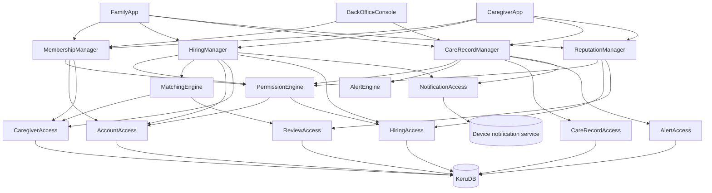
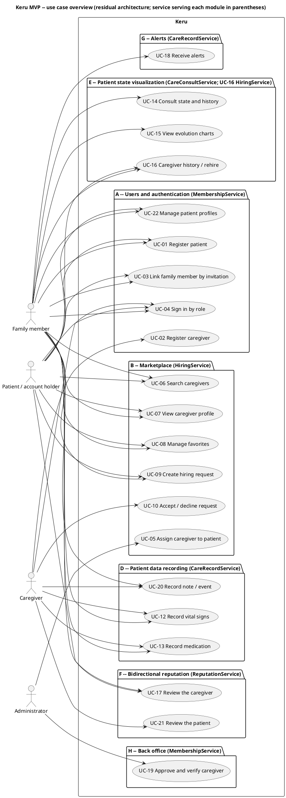
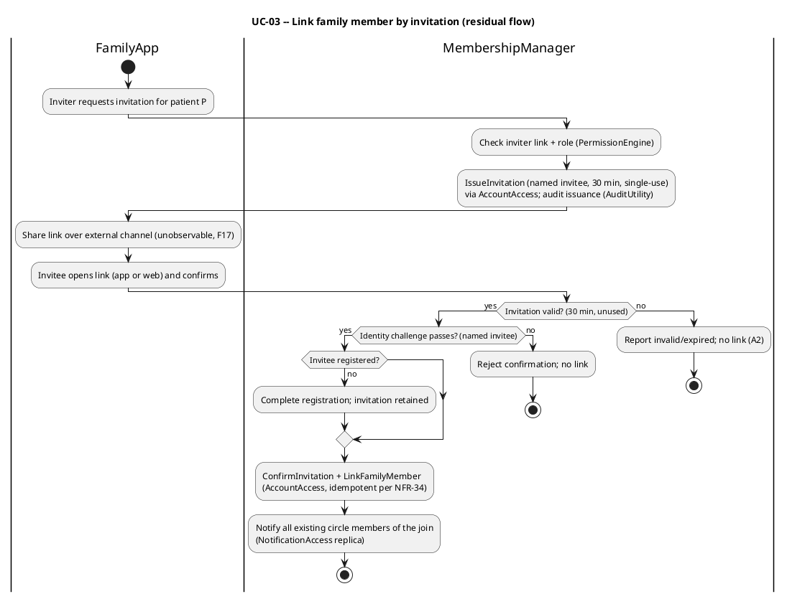
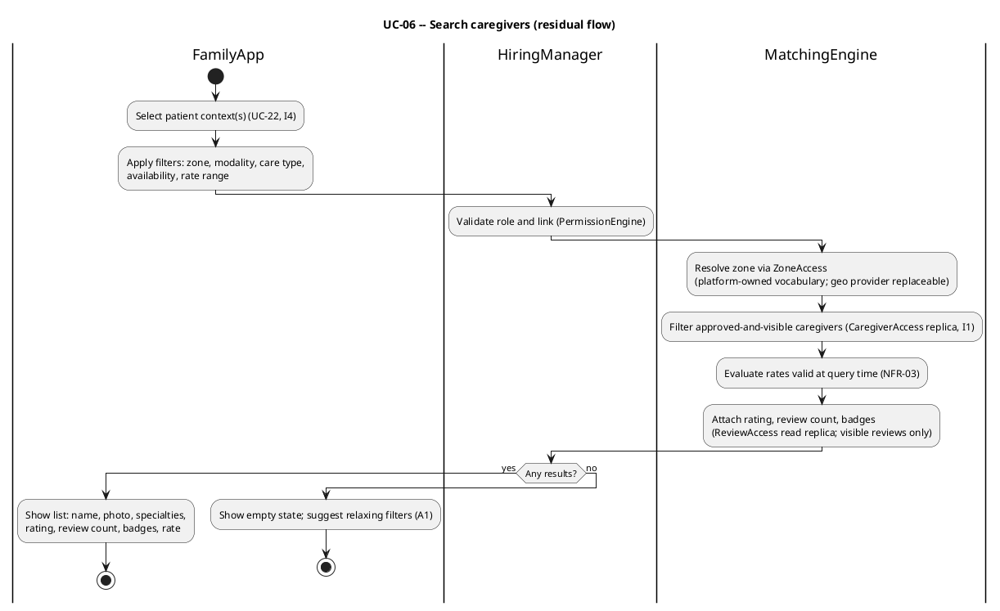
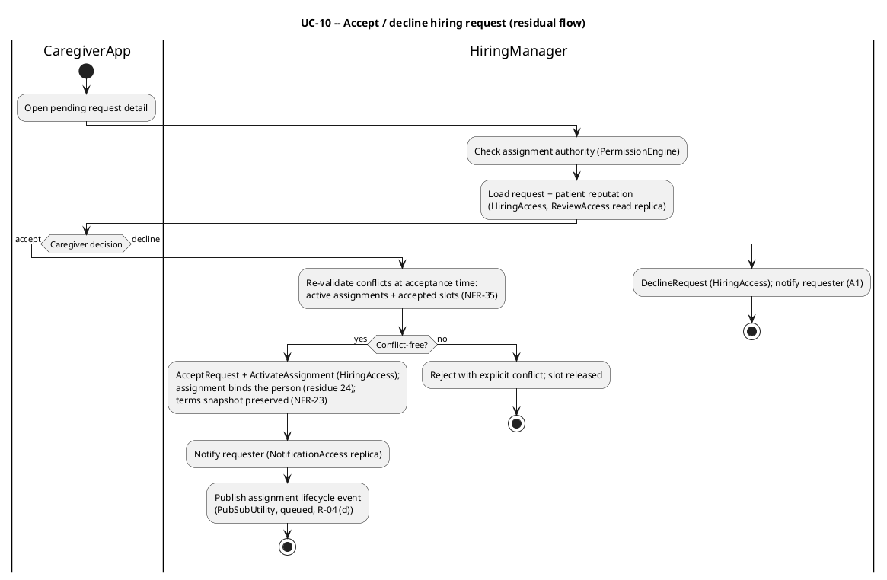
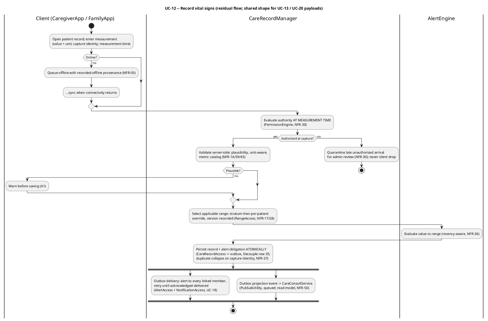
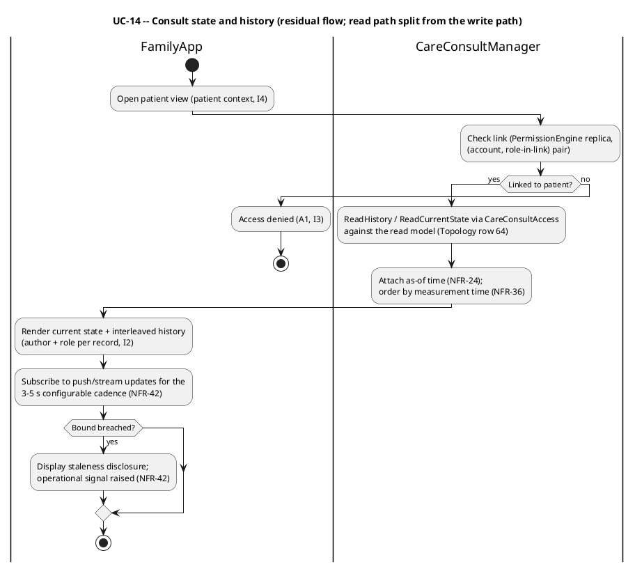
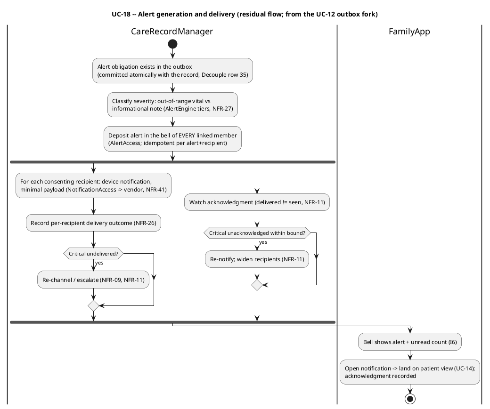
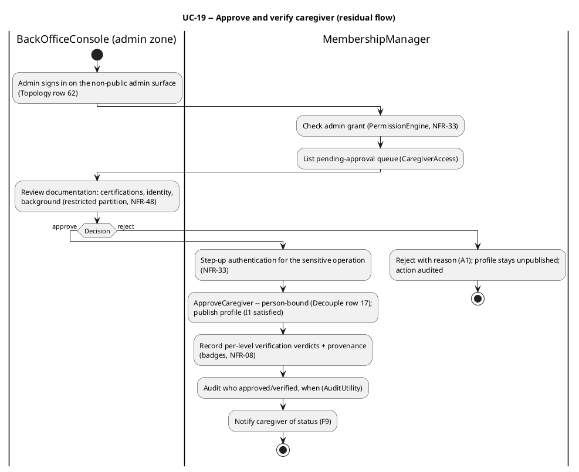
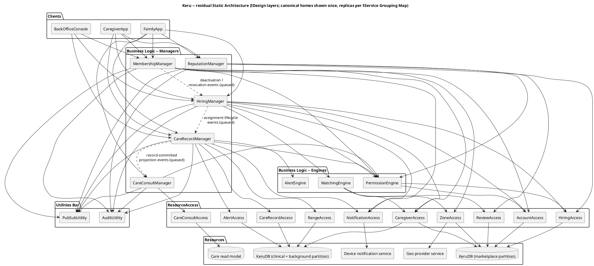

# Keru -- Software Architecture Document

> **Executive summary.** Keru is a caregiver marketplace ("the Uber of caregivers") that connects patients and their families with professional caregivers: families find and hire admin-approved caregivers by zone, care type, and reputation; clinical data is recorded at the bedside into one traceable record; and the family follows the patient's state and receives alerts from anywhere -- with payment outside the MVP (off-platform payment marked as paid on the platform closes the operation). The stress analysis examined **69 stressors** (51 Structural, 7 Topological, 7 Business, 4 Combined) against the naive 19-component baseline, with the 4 Combined stressors recorded as Looping Signals (#66-#69) -- the empirical signature of the catalog approaching criticality. The contagion matrix yields the NKP triple **N = 76, K = 199, P = low**, and the iteration-1 empirical test scored **Ri = (11 - 2) / 16 = 0.56** (positive, read against a deliberately weak control), with all seven business invariants I1-I7 preserved and 5 unstressed surfaces declared for the next round. The residual architecture is five Manager services (28 IDesign components, 58 derived NFRs, 10 deployable units over 7 topology-traced boundaries) with a protected clinical unit whose transactional outbox makes "no alert is lost" structural, a promoted consult read path, three security zones, and in-country residency of clinical data -- criticality positive on iteration 1.

## Methodological Note

This document fuses three architectural lineages:

- **Structural backbone** -- from the original Analysis & Design Engineering Template: UML behavioral diagrams, C4, deployment.
- **Decomposition method** -- from Residuality Theory: stressor analysis, contagion matrix, residual integration, empirical Ri test.
- **Component taxonomy and communication rules** -- from IDesign: Managers, Engines, ResourceAccess, Resources, Utilities, with strict call rules.

The intent is that residuality drives **discovery** (which residues exist, where the architecture is brittle), IDesign provides the **vocabulary and communication discipline** that expresses the result (raising P, restricting K in Kauffman terms), and UML/C4 **documents** the final residual architecture for stakeholders.

Use cases and activity diagrams are deliberately repositioned: they are *documentation of the resolved architecture*, never drivers of decomposition. Decomposition is driven by the contagion matrix, the topological residue map, and IDesign discipline.

This SAD was assembled (S7) from the seven approved fragments of the `sad` meta-skill chain -- Business View (S1a), Naive Architecture (S1b), Flow Analysis (S2), Stressor Catalog (S3), Contagion Analysis (S4), Residual Design (S5), and Empirical Test (S6) -- each inlined below without content edits.

## Business View

> **Source corpus:** `Keru-Casos-de-Uso-MVP.md` (single document, Spanish). It merges two initiative layers: the **original scope** (`Keru-Scope-MVP.docx.pdf`, cited throughout as `§3.x`) and a batch of **product decisions dated 2026-07-09** that modify or supersede parts of that scope (admin pre-approval of caregivers, family members also record clinical data, caregiver history with rehire, bidirectional reviews, mandatory alerts with an always-available in-app record, invitation-based family linking, caregiver acceptance of requests, payments module suspended pending decision, multi-patient-profile accounts). Where the two layers speak to the same point, the 2026-07-09 decision governs (`Keru-Casos-de-Uso-MVP.md` header note). This Business View is ONE synthesized framing across both layers; genuine unresolved conflicts are logged in §Open Questions, not silently merged.
>
> **Changelog — Open Questions resolution pass (R-27), 2026-07-10.** Operator (stakeholder) answers were recorded against the open-question cards: OQ-1, OQ-2, OQ-3, OQ-4, and OQ-8 are resolved; OQ-6 and OQ-7 are partially answered and stay open; OQ-5 was explicitly deferred by the operator and stays open. The answers were rippled into the Objective, goals G1, G2, G3, G5, G6, G7, G9, G10, G11, invariant I5, deferred volatilities DV-3, DV-7, and new DV-11, and the carry-forward notes.
>
> **Changelog — Open Questions resolution pass 2 (R-27), 2026-07-10.** Second pass on operator (stakeholder) directives: OQ-6 is resolved — the 3-to-5-second configurable expectation also governs alert delivery (UC-18). OQ-5 and OQ-7 were explicitly closed by operator decision: OQ-5 with its substance (governing regulation, jurisdiction, consent basis) still undecided, carried forward as an unresolved compliance/consent input in DV-2; OQ-7 with the per-province zone definition accepted as not yet defined, carried forward as new DV-12. Ripple: G1, G6, and the carry-forward notes. No open question gates S1a after this pass.

### Objective

Keru is a caregiver marketplace ("the Uber of caregivers") that connects patients and their families with professional caregivers. Families and patients find caregivers by zone, type of care, and reputation, and hire them online; during the service, caregivers — and linked family members — record the patient's health metrics; the family follows the patient's state and evolution from anywhere. The platform curates the caregiver side: a caregiver becomes visible only after an internal review approves the account, and verification badges make credential, identity, and background checks visible to the demand side. The MVP's objective is to validate the complete end-to-end circuit — find and hire a caregiver, record the patient's metrics, and have the family see the patient's state; payment is outside the MVP: the patient pays the caregiver off-platform and marks the operation as paid on the platform, which closes it (OQ-1, resolved by the stakeholder 2026-07-10). (`Keru-Casos-de-Uso-MVP.md §1`, `§2`, `§UC-19`, `§Módulo C`)

### Pain Points

Pain points are synthesized from the product vision and the problems the documented capabilities exist to remove (`Keru-Casos-de-Uso-MVP.md §1`, `§2`, `§4`):

- Families cannot reliably find a trustworthy professional caregiver matched to their situation — by zone, care modality (home or hospital), type of care, availability, and rate — and today have no way to verify a candidate's credentials, identity, or background before letting them care for a vulnerable person. (`§1`, `§UC-06`, `§UC-07`, `§UC-19`)
- A family whose relative is cared for at home or in hospital has no remote visibility into the patient's condition; they depend on being physically present or on ad-hoc word of mouth from whoever is with the patient. (`§1`, `§UC-14`)
- Clinical observations made during care — vital signs, medication given, day-to-day events — are not captured in one shared, dated, attributable record, so there is no trustworthy history, no view of evolution over time, and no answer to "who recorded what, when". (`§UC-12`, `§UC-13`, `§UC-20`, `§6`)
- When a vital sign goes out of range or something notable happens to the patient, the family learns about it late or not at all. (`§UC-18`)
- Caregivers lack a channel to publish their professional profile (specialties, certifications, availability, rates, work zone) and to be found and hired on the strength of a verifiable reputation; they also take on clients blind, with no view of the patient/family's track record and no say before a hiring is imposed on them. (`§UC-02`, `§UC-10`, `§UC-21`)
- When a family wants to bring back a caregiver who served them well, there is no record of who cared for the patient and when, so rehiring a known, trusted person is needlessly hard. (`§UC-16`)
- One person often cares for more than one relative (e.g. both parents), and juggling searches, hirings, and clinical records for several patients without per-patient separation invites dangerous mix-ups. (`§UC-22`)

### Goals

Each goal is an observable outcome; success is verifiable without reference to any particular implementation.

- **G1 — Find a matching caregiver.** A family member or patient can find caregivers by combining filters — service zone, modality (home or hospital), type of care, availability, and rate range — and sees, already in the result list, each caregiver's rating, review count, and verification badges, because those are the choice criteria. A zone is a recognized geographic area; in the city of Buenos Aires (CABA) zones are neighborhoods, while what a zone is in each other Argentine province is not yet defined — an unknown the stakeholder explicitly accepted when closing OQ-7 (2026-07-10), carried forward as DV-12. (`§UC-06`)
- **G2 — Only approved caregivers are findable.** A newly registered caregiver is not visible to the demand side until an administrator has reviewed and approved the account; approved profiles show which certifications are platform-verified and which verification levels (certifications / identity / background) were granted. An approved caregiver ceases to be findable when they deactivate their own account, or when an administrator deactivates the account or hides it from the marketplace (OQ-8 answer). (`§UC-02`, `§UC-19`, `§UC-07`)
- **G3 — Hire with the caregiver's consent.** A hiring request for a specific patient (capturing modality, dates, special requirements, contact data) reaches the caregiver, who sees its detail — including the patient's reputation — and accepts or declines it; acceptance activates the care assignment, and the requester sees the status change and is notified of it. Payment stays off-platform: the patient pays the caregiver directly, then marks the operation as paid on the platform, and that closes the operation (OQ-1 answer). (`§UC-09`, `§UC-10`, `§UC-05`)
- **G4 — A traceable clinical record.** Caregivers with a current assignment and linked family members can record the patient's vital signs (blood pressure systolic/diastolic, heart rate, temperature, oxygen saturation, blood glucose), medication administrations (medication, dose, time, observations), and free-text notes; every record carries date/time and its author with role, and corrections never erase who recorded what. (`§Módulo D`, `§UC-12`, `§UC-13`, `§UC-20`)
- **G5 — The family sees the patient from anywhere.** A linked family member can consult the patient's current state, the chronological history interleaving vitals, medication, and notes, and per-metric evolution charts over an adjustable period, from any location and device; a record made by the caregiver or by another family member becomes visible within a refresh interval of 3 to 5 seconds, and that interval remains configurable for future analysis (OQ-6 answer). (`§UC-14`, `§UC-15`, `§6`)
- **G6 — The family is alerted, and no alert is lost.** When a recorded vital sign falls outside its applicable range — the platform-wide per-metric default the administrator configures for everyone, unless the patient's record carries a per-patient range that overrides the general default (OQ-4 answer) — or a note is recorded, every family member linked to the patient is alerted within the same 3-to-5-second interval that bounds visibility freshness — the stakeholder's stated bound, kept configurable (OQ-6 answer); every alert identifies the patient, metric, value, and time (or the note's text), remains retrievable in the application with a read/unread state and an unread count, and an immediate device notification — when the user has allowed it — is additional, never the only record. (`§UC-18`, `§Módulo G`)
- **G7 — Reputation cuts both ways.** After a finished service, the family/patient can rate and review the caregiver, and the caregiver can rate and review the patient/family — each independently of the other; caregiver reputation is visible in search results and profiles, and patient reputation is visible to the caregiver when evaluating new requests. Only participants of a real, finished service can review each other, each side reviews exactly once, and a review cannot be edited afterwards (OQ-3 answer). (`§UC-17`, `§UC-21`, `§Módulo F`)
- **G8 — One account, several patients, no mix-ups.** One account can create and manage multiple patient profiles (e.g. mother and father) and operate — search, hire, record, follow, invite, review — in the context of a selected profile; every hiring, clinical record, invitation, and review is tied to exactly one patient profile, and hiring one caregiver for two patients produces one request per patient. (`§UC-22`, `§UC-01`, `§UC-06`, `§UC-09`)
- **G9 — Joining the family circle is one shared invitation away.** A patient or an already-linked family member can invite a new family member by sharing a unique, patient-specific invitation through any channel; the same invitation works whether or not the invitee already uses Keru — an unregistered invitee completes registration and the link is established without additional steps, and a linked family member gains access only to the patients they are linked to. An invitation is valid for 30 minutes and is single-use — not reusable (OQ-2 answer). (`§UC-03`)
- **G10 — Known caregivers can be brought back.** A family member or patient can see the patient's currently assigned caregivers and the full history of past caregivers with their service periods, reach each one's current profile, and start a rehire from it; a past caregiver no longer active on the platform — whether they deactivated their own account or an administrator deactivated or hid them through the back office (OQ-8 answer) — still appears in the history, without a rehire option. (`§UC-16`)
- **G11 — MVP success criterion.** The complete end-to-end circuit is validated in real use: a family finds and hires a caregiver, the patient's metrics get recorded during the service, and the family sees the patient's state — on both mobile and web; the circuit counts as validated without money moving through the platform, closing each hiring via off-platform payment marked as paid on the platform (OQ-1 answer). (`§1`)

### Invariants (non-negotiables)

Regression guards for the empirical test (S6) — observable properties that must hold under every stressor. They are acceptance criteria, not units of decomposition (R-01/R-21).

| # | Invariant | Source |
|---|---|---|
| I1 | No caregiver ever appears in marketplace search results or receives hiring requests without prior administrator approval of the account. | `Keru-Casos-de-Uso-MVP.md §UC-19` (acceptance criteria), `§UC-02`, `§UC-06` |
| I2 | Every clinical record (vital signs, medication, note) permanently carries its date/time and its author with role; a correction never silently replaces a record — traceability is preserved. | `§UC-12` (acceptance criteria), `§UC-13`, `§UC-20`, `§6` |
| I3 | Access follows role and link: a caregiver can record data only for patients with a current assignment to them; a family member can read and record only for patients they are linked to. | `§UC-04` (acceptance criteria), `§UC-12`, `§UC-03`, `§6` |
| I4 | Every hiring request, clinical record, invitation, and review is bound to exactly one specific patient profile, never to the account in general. | `§UC-22` (acceptance criteria), `§UC-09` |
| I5 | A review exists only for a real, finished service between its author and its subject; each side reviews the other independently, at most once, and a review is never edited after it is made. | `§UC-17` (A1), `§UC-21` (A1, acceptance criteria); OQ-3 answer (operator, 2026-07-10) |
| I6 | Every alert reaches all family members linked to the patient and remains retrievable with read/unread state; an immediate device notification is never the only record of an alert. | `§UC-18` (acceptance criteria) |
| I7 | Finished assignments are preserved as history — never deleted — so the patient's caregiver history stays complete. | `§UC-05` (acceptance criteria), `§UC-16` |

### Open Questions

Unresolved business inputs surfaced by the multi-lens discovery pass (R-27), run **cross-layer** over the original-scope layer and the 2026-07-09 product-decision layer. Premises the document itself already resolves (family read-only → family also records, `§UC-14`; alerts optional → mandatory, `§Módulo G`; assignment manual → automatic on acceptance, `§UC-05`; caregiver must accept, `§UC-10`) are NOT logged — only what remains genuinely open. `Open` and `Open (partial)` questions gate S1a until the operator explicitly acknowledges proceeding.

Two **Open Questions resolution passes** (R-27) ran on 2026-07-10 with operator (stakeholder) input. After the first pass, OQ-1, OQ-2, OQ-3, OQ-4, and OQ-8 were resolved. The second pass closed the remainder: OQ-6 is resolved (the 3-to-5-second configurable bound also governs alert delivery); OQ-5 and OQ-7 were explicitly closed by operator decision — OQ-5 with its substance undecided (carried forward in DV-2), OQ-7 with the per-province zone definition accepted as undefined (carried forward as DV-12). **No question is in `Open` or `Open (partial)` status; nothing gates S1a.**

#### OQ-1 - Resolved (Answered) -- Payments module: in or out of the MVP

**Question:** Is online payment part of the MVP or not? The original scope (`§3.5`, and `§1`'s "complete end-to-end circuit") premised the validated circuit on hiring through the platform including payment; the 2026-07-09 decision suspends the module ("pending decision", UC-11 reserved, Module C withdrawn from the use cases). Until decided: does the MVP's "complete circuit" count as validated without money moving? If payments later land, the hiring lifecycle gains a "paid" state between acceptance (UC-10) and assignment activation (UC-05), and an external payment gateway becomes a dependency — with the stated integrity demands (no double charges on retries, persistent receipt).

**Answer:** Payment is outside the MVP: the patient pays the caregiver off-platform, but marks the operation as paid on the platform, and that is how the operation is closed. The MVP's "complete circuit" is therefore validated without money moving through the platform.

<sub>**Affects:** G3, G11 (what "end-to-end validated" means); hiring-request lifecycle; external-dependency set — **PRD:** `Keru-Casos-de-Uso-MVP.md §Módulo C` + `§7` (product decision 2026-07-09) vs original scope `§3.5` / `§1` — **Source:** operator (stakeholder), 2026-07-10</sub>

#### OQ-2 - Resolved (Answered) -- Invitation lifetime and reuse

**Question:** What is the family-invitation code/link's validity period, and is it single-use or reusable? UC-03 marks this explicitly "to be defined", and the domain model (`§5`) already gives the invitation an "expired" state with no rule for how it is reached. Note the internal conflict: the document's header asserts "no open assumptions remain", yet this item is still marked open in UC-03.

**Answer:** The validity period is 30 minutes, and the invitation is single-use — not reusable.

<sub>**Affects:** G9; I3 (link-scoped access — an over-live or freely reusable invitation widens who can read and write a patient's clinical data) — **PRD:** `Keru-Casos-de-Uso-MVP.md §UC-03` ("A definir") vs header note ("no quedan supuestos abiertos"); `§5` (InvitaciónFamiliar) — **Source:** operator (stakeholder), 2026-07-10</sub>

#### OQ-3 - Resolved (Answered) -- Second review of the same service: edit or forbid

**Question:** When a reviewer attempts a second review of the same finished service, is it rejected outright (one immutable review per side per service) or does it edit the existing review? UC-17 A2 marks this "to be defined"; UC-21 inherits the same restrictions for the caregiver-to-patient direction.

**Answer:** The review is made exactly once and cannot be edited later — one immutable review per side per service; a second attempt is rejected, not treated as an edit.

<sub>**Affects:** G7; I5 (whether "one review per side per service" is immutable-once-published or editable) — **PRD:** `Keru-Casos-de-Uso-MVP.md §UC-17` (A2, "a definir"), `§UC-21` (A1) — **Source:** operator (stakeholder), 2026-07-10</sub>

#### OQ-4 - Resolved (Answered) -- Who configures alert metric ranges, and what are the defaults

**Question:** Who defines the per-metric reference ranges that trigger out-of-range alerts (platform-wide defaults? per-patient by a family member? by the caregiver? by a clinician?), and what are the default values? UC-18 lists this explicitly under "points to define", while its precondition already assumes "reference ranges defined per metric". In a care context this is not a settings detail: whoever sets the ranges decides when a family is or is not warned about a health event.

**Answer:** Ranges depend on the metric being recorded; some ranges are homogeneous anywhere in the world (for example, low-grade fever starts at 37 °C and fever at 38 °C globally). The administrator configures the ranges on the platform for everyone, and beyond that general default — which each patient record carries by default — there can be per-patient ranges that differ from the general one.

<sub>**Affects:** G6; I6 (alert correctness — an alert can only be guaranteed if the triggering ranges have a defined owner and value) — **PRD:** `Keru-Casos-de-Uso-MVP.md §UC-18` ("Puntos a definir") — **Source:** operator (stakeholder), 2026-07-10</sub>

#### OQ-5 - Closed, not answered (deferred by operator decision, 2026-07-10; substance undecided) -- Governing health-data regulation, jurisdiction, and patient consent

**Question:** Which data-protection / health-data regulation governs the platform, in which jurisdiction(s) does it operate, and on what consent basis is a patient's clinical data processed? The document derives a generic sensitivity requirement from "the nature of the domain" (`§6`) but is silent on the governing legal constraint — and the product's own structure sharpens the question: patient profiles are created and managed by *other people* (the account holder registers their mother and father, `§UC-22`), specialties include pediatric and palliative care (`§UC-02`), and administrators manually process caregivers' identity and background/criminal-record documentation (`§UC-19`). Who consents on the patient's behalf, and what may the platform lawfully hold about caregivers' backgrounds?

**Answer:** None — the substance remains undecided. On 2026-07-10 the operator explicitly closed this question as a stakeholder decision to defer it: no governing regulation, no jurisdiction(s), and no patient-consent basis have been decided. This closure is a decision to stop gating S1a on the question, not an answer to it. The undecided substance stays visible downstream as an unresolved compliance/consent input recorded in DV-2, which S5's NFR derivation will hit; no regulatory content is assumed in the meantime.

<sub>**Affects:** I2, I3 (what traceability and access control must legally guarantee); G4, G5; caregiver-verification obligations (G2); DV-2 (carries the unresolved compliance/consent input forward) — **PRD:** `Keru-Casos-de-Uso-MVP.md §6` (silent on governing constraint), `§UC-19`, `§UC-22` — **Source:** operator (stakeholder), 2026-07-10 — closed as deferred; substance undecided</sub>

#### OQ-6 - Resolved (Answered) -- Quantify "real-time" / "no perceptible delay"

**Question:** What concrete freshness does the family-visibility promise require? The scope says the family follows the patient "in real time" (`§1`) and UC-14 accepts "visible without perceptible delay", but no number is given anywhere — seconds? a minute? And is the expectation the same for alert delivery (UC-18), where lateness has health consequences?

**Answer:** The refresh may occur every 3 to 5 seconds, and the interval is to be left configurable for future analysis. The same 3-to-5-second expectation also governs alert delivery (UC-18): an alert reaches the linked family members within that same configurable interval.

<sub>**Affects:** G5, G6 (measurability of the visibility and alerting goals; the thresholds downstream NFRs must commit to) — **PRD:** `Keru-Casos-de-Uso-MVP.md §1`, `§UC-14` (acceptance criteria), `§UC-18` — **Source:** operator (stakeholder), 2026-07-10</sub>

#### OQ-7 - Closed, partially answered (by operator decision, 2026-07-10; per-province zone definition remains undefined) -- What is a "zone"

**Question:** How is the "zone" that drives matching defined — a named neighborhood/city from a fixed list, a radius around a point, a drawn area? The term anchors both the caregiver's declared work zone (`§UC-02`) and the search's zone/location filter (`§UC-06`) but is never defined, and it admits materially different readings that change what "a caregiver serves this patient's zone" means.

**Answer:** Zones will be defined using the Google Maps API (the stakeholder's stated decision); in the city of Buenos Aires (CABA), for example, zones are neighborhoods. The known remainder: what a zone is for each other Argentine province is not yet defined — the stakeholder states it may differ per province and is not yet known. On 2026-07-10 the operator closed the question by decision, explicitly accepting that unknown; the per-province zone-definition variability is routed forward to S3 as DV-12.

<sub>**Affects:** G1 (whether search-by-zone is verifiable); caregiver profile content (G2); DV-12 (carries the accepted per-province unknown forward) — **PRD:** `Keru-Casos-de-Uso-MVP.md §UC-02` (flow step 6), `§UC-06` (filters) — **Source:** operator (stakeholder), 2026-07-10 — closed by decision; per-province definition remains undefined</sub>

#### OQ-8 - Resolved (Answered) -- How does a caregiver stop being active

**Question:** By what path does an approved caregiver become "no longer active on the platform", and who drives it? UC-16 A1 presumes such a state (a historical caregiver shown without a rehire option), but the documented caregiver account lifecycle is only pending → approved / rejected (`§UC-02`, `§5`) — there is no use case for voluntary departure, suspension, or revocation of approval (e.g. after serious negative reviews), and no owner named for it.

**Answer:** All users can deactivate their own accounts — in the caregiver's case, deactivation means they stop being visible in the marketplace. In addition, the administrator has access through the back office to all data and operations, and can deactivate users or make them not visible in the marketplace for some reason.

<sub>**Affects:** G10 (rehire availability); G2 / I1 (whether approval is revocable and by whom) — **PRD:** `Keru-Casos-de-Uso-MVP.md §UC-16` (A1) vs `§UC-02` / `§5` (account states) — **Source:** operator (stakeholder), 2026-07-10</sub>

> **Deferred volatilities (sensed now, routed to S3 -- non-gating).** Stressors the architect already senses and will deliberately address in stressor-analysis (S3). Carry-forward context only; they do NOT gate S1a.
>
> - **DV-1 — Clinically critical values and alert urgency.** An out-of-range vital is a potential health emergency; the cost of a missed, delayed, or silently dropped alert is asymmetric to everything else in the system (`§UC-12` A2, `§UC-18`).
> - **DV-2 — Health-data concentration and breach.** The platform accumulates sensitive clinical histories for many patients; exposure, leakage, or cross-patient disclosure is a domain-defining stressor (`§6`). Additionally, per the OQ-5 closure (deferred by operator decision, 2026-07-10), the governing data-protection / health-data regulation, the operating jurisdiction(s), and the patient-consent basis remain undecided — an unresolved compliance/consent input that S5's NFR derivation will hit; no regulatory content is assumed here.
> - **DV-3 — Payments landing later.** Online payment is now confirmed outside the MVP (OQ-1 answer): the hiring closes via off-platform payment marked as paid on the platform. The design must still not block a future online-payment landing — a "paid" state in the hiring lifecycle, an external gateway, retry integrity (no double charges), and receipts (`§Módulo C`, `§7` "do not design yet, do not block").
> - **DV-4 — Booking contention.** Overlapping requests to one caregiver, availability going stale after an acceptance, and the one-search-for-several-patients flow fanning out into per-patient requests (`§UC-06`, `§UC-09`, `§UC-10`).
> - **DV-5 — Reputation gaming and retaliation.** Fake or coerced reviews, and tit-for-tat dynamics that bidirectional reviewing invites (`§UC-17`, `§UC-21`).
> - **DV-6 — The manual approval queue as a growth bottleneck.** Caregiver supply is throttled by internal manual verification; a spike in signups stresses the back-office (`§UC-19`, `§4` of the scope).
> - **DV-7 — Invitation leakage.** An invitation shared through arbitrary channels can be forwarded or intercepted; whoever confirms it gains clinical-data access — now bounded by the OQ-2 answer (30-minute validity, single-use), which narrows but does not eliminate the window (`§UC-03`).
> - **DV-8 — Concurrent authorship of the clinical record.** A caregiver and several family members can record for the same patient at once; ordering, duplication, and correction semantics under concurrency (`§Módulo D`, `§UC-14`).
> - **DV-9 — Caregiver profile drift across rehires.** The historical caregiver's *current* profile (rates, zone, availability, active status) may differ from the one the family remembers (`§UC-16` A1).
> - **DV-10 — Out-of-scope items returning.** Chat between family and caregiver, wearable/medical-device integration, automated background checks, e-invoicing — excluded from the MVP but plausible next initiatives (`§7`).
> - **DV-11 — Back-office moderation ripple.** The OQ-8 answer defines two deactivation paths — any user can self-deactivate, and the administrator can deactivate a user or hide them from the marketplace through the back office. Either action landing mid-lifecycle (an active assignment, a pending hiring request, an unexpired invitation, a rehire in progress) stresses visibility, history, and rehire semantics (`§UC-16` A1; OQ-8 answer, operator 2026-07-10).
> - **DV-12 — Per-province zone-definition variability.** OQ-7 was closed by operator decision (2026-07-10) with zones defined via the Google Maps API and, in CABA, zones being neighborhoods — while explicitly accepting that what a zone is in each other Argentine province is not yet defined and may differ per province. That variability stresses zone-based matching (G1) and caregiver work-zone declarations (G2): a "zone" whose granularity or shape shifts by province changes what "a caregiver serves this patient's zone" means (`§UC-02`, `§UC-06`; OQ-7 closure, operator 2026-07-10).

#### Lens Coverage Ledger

| Lens | Verdict (OQ IDs, or `none`) |
|---|---|
| L1 Marker (TBC / TBD / unconfirmed / ?) | OQ-1 ("pendiente de decisión"), OQ-2 ("A definir"), OQ-3 ("a definir"), OQ-4 ("Puntos a definir") |
| L2 Hedge (maybe / assume / likely / should) | none — the parenthetical hedges found (e.g. `§UC-01` preconditions "none, or authenticated if...") resolve from a careful reading of the surrounding flow |
| L3 Unquantified target (~ / indicative / no number) | OQ-6 ("real time", "no perceptible delay" — no number anywhere) |
| L4 Undefined term (used but not defined; >1 reading) | OQ-7 ("zone") |
| L5 Silent actor / ownership (who triggers / approves / owns) | OQ-4 (range owner unnamed), OQ-8 (deactivation owner unnamed) |
| L6 Lifecycle / state gap (state with no entry/exit; flag semantics) | OQ-2 ("expired" state with no expiry rule), OQ-8 ("no longer active" state with no entry transition) |
| L7 Edge / failure silence (empty / negative / concurrent / failure) | none — candidates found were triaged to deferred volatilities (DV-4 booking contention, DV-8 concurrent authorship), since caregiver acceptance (`§UC-10`) is itself the documented conflict-resolution step and the rest is S3 material, not a stakeholder blocker |
| L8 Scope boundary (in/out unclear; deferrals; per-tenant divergence) | OQ-1 (Module C neither in nor out; UC-11 reserved) |
| L9 External / in-flight dependency (status unconfirmed) | OQ-1 (payment gateway is the only external dependency whose inclusion is unconfirmed) |
| L10 Conflict / measurability (contradictions; non-measurable goals) | OQ-2 (header "no open assumptions remain" vs UC-03's explicit "to define"), OQ-6 (the "real-time" goal is not measurable as stated) |
| L11 Stale / unexamined premise (settled decision on a stale/unverified premise) | OQ-1 (the scope-era premise that the validated E2E circuit includes online payment, `§3.5`/`§1`, is superseded-in-suspense by the 2026-07-09 decision). All other scope-era premises the 2026-07-09 layer touched are resolved *inside the document* (family read-only → also records; alerts optional → mandatory; manual assignment → automatic on acceptance; caregiver acceptance confirmed) and are therefore not open |
| L12 Regulatory / compliance / privacy silence (data/money/consent/AML/jurisdiction unaddressed) | OQ-5 (governing regulation, jurisdiction, patient consent basis, background-check data lawfulness) |

### Carry-forward (lateral context for downstream gates)

- **Two initiative layers, one framing.** Original scope (`§3.x` references) vs product decisions of 2026-07-09; the decisions govern where the layers overlap. The one genuinely unresolved cross-layer conflict — payments (OQ-1) — was resolved by the stakeholder on 2026-07-10: payment is outside the MVP (off-platform payment, marked as paid on-platform to close the operation); everything else the document reconciles itself.
- **Use-case inventory (module → UCs → layer).** The 21 use cases stay in the source document at full fidelity; they are NOT compressed into this view.

  | Module | Use cases | Layer origin |
  |---|---|---|
  | A — Users and authentication | UC-01, UC-02, UC-03, UC-04, UC-05, UC-22 | Scope §3.1; UC-03 mechanics, UC-02 pre-approval, and UC-22 are 2026-07-09 decisions |
  | B — Marketplace | UC-06, UC-07, UC-08, UC-09, UC-10 | Scope §3.2; UC-10 caregiver acceptance confirmed by decision |
  | C — Payments | (UC-11 reserved) | Outside the MVP (OQ-1 resolved 2026-07-10): off-platform payment, marked as paid on-platform to close the operation; UC-11 stays reserved |
  | D — Patient data recording | UC-12, UC-13, UC-20 | Scope §3.3/§3.7; family-also-records and UC-20 are decisions |
  | E — Patient state visualization | UC-14, UC-15, UC-16 | Scope §3.4; UC-16 history+rehire is a decision |
  | F — Bidirectional reputation | UC-17, UC-21 | Scope §3.6; UC-21 is a decision |
  | G — Alerts and notifications | UC-18 | Scope §3.7, elevated to mandatory by decision |
  | H — Back-office | UC-19 | Scope §3.2/§4; account pre-approval is a decision |

- **S2 (flow-analysis):** the use cases' main/alternative flows are the flow evidence; the E2E dependency order the document itself suggests (A → H → B → D → E → F → G, `§8`) is a reading aid, not a design commitment.
- **S5 (residual-design):** the source document is the **verbatim seed** for Use Cases with Residue Mapping — preserve each UC's flows, business rules, and acceptance criteria verbatim (anchored `Keru-Casos-de-Uso-MVP.md §UC-NN`, gaps marked `NEEDS CLARIFICATION`), and add the Residue Mapping the source cannot supply. The derived-NFR table (`§6`) seeds S5's NFR derivation; the OQ-6 answer supplies one measurable freshness bound for both visibility refresh and alert delivery (3–5 s, interval configurable). S5's NFR work will also hit the unresolved compliance/consent input left by the OQ-5 closure (governing regulation, jurisdiction, consent basis undecided — see DV-2).
- **Phase-0 evidence, never the baseline (R-09):** the document's mermaid use-case map (`§3`) and domain-model table (`§5`) describe the product's own domain/design structuring. S1b's naïve architecture MUST stay deliberately naïve — derived from this synthesized framing while *ignoring* that structure; the map and domain model are held as evidence for later gates (S5 reference, S6 residual-candidate comparison), never adopted as the control.
- **Invariant-backed vs ordinary goals:** G2↔I1, G4↔I2/I3, G8↔I4, G7↔I5, G6↔I6, G10↔I7 are invariant-backed; G1, G3, G5, G9, G11 are ordinary goals (no non-negotiable behind them beyond the shared access rule I3).
- **Out-of-scope guardrails (`§7`):** chat, medical-device/wearable integration, e-invoicing/fiscal reporting, automated background verification — excluded from MVP design; online payment is now excluded from the MVP too (OQ-1 answer: off-platform payment + on-platform mark-as-paid closes the operation), while a future online-payment landing stays unblocked (DV-3).
- **Deferred volatilities DV-1..DV-12** (above) route to S3 per the handoff contract; they are sensed stressors, not gating questions.

## Architectural Stress Analysis

> **Purpose**
> This section captures the design-time residuality work that drives the rest of the SAD. Outputs are: (a) a residual decomposition expressed in IDesign terms, (b) a deployment topology derived from topological residues, (c) a log of business-only decisions, and (d) a set of empirically-grounded non-functional requirements traceable to specific residues.

### Naïve Architecture

> The minimal IDesign-compliant architecture that solves the problem exactly as the approved Business View states it (`business-view.md §Objective`, `§Goals G1–G11`), with no consideration of stress, change, or future-proofing. This is the **control baseline** against which the residual architecture will be measured in the empirical Ri test (S6). Per the rich-documentation-mode rule recorded in `business-view.md §Carry-forward` ("Phase-0 evidence, never the baseline", R-09), this decomposition is derived from the synthesized framing **only** — the source document's own use-case map (`§3`) and domain model (`§5`) were deliberately not consulted as design inputs; they remain Phase-0 evidence held for S6.

In IDesign terms: three **Clients** (the family-side application, the caregiver-side application, the administrator's back-office console) trigger four **Managers**, one per workflow family the Business View names — joining and leaving the platform (`§Goals G2, G8, G9`), the search-to-hire-to-closure lifecycle (`§Goals G1, G3, G10, G11`), the record-evaluate-alert-consult loop over the clinical record (`§Goals G4, G5, G6`), and the post-service bidirectional review (`§Goals G7`). Three stateless **Engines** hold the business activities those workflows share or delegate: matching caregivers to search criteria, evaluating a recorded value against its applicable alert range, and deciding role-and-link permission (`§Invariants I3`). Seven **ResourceAccess** components expose atomic business verbs over two **Resources**: one operational database holding all platform state, and one external device-notification channel (`§Invariants I6` — a device notification is additional, never the only record). There is no Utilities Bar in the naïve baseline: no Pub/Sub (queued M-to-M per R-04 (d) is residue-driven, not naïve — alert delivery runs inline and synchronously inside the recording workflow), and the 3–5 s configurable freshness bound (`§Goals G5, G6`, OQ-6 answer) is assumed satisfied by client-initiated reads. Each Manager is almost-expendable (R-11): workflow sequence only, with rules in Engines and persistence verbs in ResourceAccess.

#### Component Taxonomy

| Layer | Component | Responsibility | Volatility encapsulated (anchor) |
|---|---|---|---|
| Client | FamilyApp | Family members and patients on mobile and web: search and hire caregivers, mark a hiring as paid, manage patient profiles, share family invitations, record and follow the patient's state, review caregivers. | Who triggers the demand side (`business-view.md §Objective`, `§Goals G11` — mobile and web) |
| Client | CaregiverApp | Caregivers on mobile and web: publish professional profile, see and accept/decline hiring requests (with the patient's reputation), record clinical data during an assignment, review the patient/family. | Who triggers the supply side (`§Goals G2, G3, G4, G7`) |
| Client | BackOfficeConsole | Administrators: review and approve caregiver accounts, deactivate users or hide them from the marketplace, configure the platform-wide per-metric alert ranges. | Who operates curation and configuration (`§Goals G2, G6`; OQ-4/OQ-8 answers) |
| Manager | MembershipManager | Orchestrates joining/leaving workflows: caregiver registration → administrator approval → marketplace visibility; self-deactivation and back-office deactivation/hiding; patient-profile creation under one account; family-invitation issuance (30-minute, single-use) and confirmation → link. | Sequence volatility of platform membership (`§Goals G2, G8, G9`; `§Invariants I1, I4`) |
| Manager | HiringManager | Orchestrates the hiring lifecycle: search (delegates matching), per-patient hiring-request fan-out, caregiver acceptance/decline, assignment activation, off-platform payment marked as paid → operation closure, caregiver history and rehire. | Sequence volatility of the hiring lifecycle (`§Goals G1, G3, G10, G11`; `§Invariants I7`) |
| Manager | CareRecordManager | Orchestrates the clinical-record workflows: permission check → persist record with author, role, and timestamp → evaluate alert condition → persist alert → notify linked family members; the consult workflow (current state, chronological history, per-metric evolution); administrator range configuration. | Sequence volatility of capture–evaluate–alert–consult (`§Goals G4, G5, G6`; `§Invariants I2, I6`) |
| Manager | ReputationManager | Orchestrates the post-service review workflow: verify the reviewer participated in a real, finished service; accept exactly one immutable review per side; reject a second attempt. | Sequence volatility of bidirectional reviewing (`§Goals G7`; `§Invariants I5`) |
| Engine | MatchingEngine | Filters and ranks approved, visible caregivers by zone, modality, type of care, availability, and rate range; surfaces rating, review count, and verification badges in the result. | Activity volatility of matching rules (`§Goals G1, G2`) |
| Engine | AlertEngine | Decides whether a recorded vital sign breaches its applicable range — the per-patient range when present, otherwise the administrator's platform-wide default — or whether a recorded note triggers an alert. Pure evaluation; the Manager supplies the value and the applicable ranges. | Activity volatility of alerting rules (`§Goals G6`; OQ-4 answer) |
| Engine | PermissionEngine | Decides whether an actor may read or write for a patient: caregivers only with a current assignment, family members only with an established link. | Activity volatility of role-and-link access rules (`§Invariants I3`) |
| ResourceAccess | AccountAccess | Atomic verbs over accounts, patient profiles, family links, and invitations: `RegisterAccount`, `CreatePatientProfile`, `IssueInvitation`, `ConfirmInvitation`, `LinkFamilyMember`, `DeactivateAccount`. | Access volatility of membership state (`§Goals G8, G9`) |
| ResourceAccess | CaregiverAccess | Atomic verbs over caregiver professional profiles, verification badges, availability, work zones, and marketplace visibility: `PublishProfile`, `ApproveCaregiver`, `SetVisibility`, `FindCaregivers`. | Access volatility of supply-side state (`§Goals G1, G2`) |
| ResourceAccess | HiringAccess | Atomic verbs over hiring requests, assignments, and history: `SubmitRequest`, `AcceptRequest`, `DeclineRequest`, `ActivateAssignment`, `MarkPaid`, `ListCaregiverHistory`. | Access volatility of hiring state (`§Goals G3, G10`; `§Invariants I7`) |
| ResourceAccess | CareRecordAccess | Atomic verbs over vitals, medication administrations, notes (with author, role, timestamp, correction trace) and per-metric ranges: `RecordVitals`, `RecordMedication`, `RecordNote`, `CorrectRecord`, `ReadHistory`, `ReadRanges`, `SetRanges`. | Access volatility of the clinical record (`§Goals G4, G5`; `§Invariants I2`) |
| ResourceAccess | ReviewAccess | Atomic verbs over immutable bidirectional reviews and their aggregates: `SubmitReview`, `ReadReputation`. | Access volatility of reputation state (`§Goals G7`; `§Invariants I5`) |
| ResourceAccess | AlertAccess | Atomic verbs over the in-app alert record with read/unread state and unread count: `RecordAlert`, `MarkRead`, `ListAlerts`. | Access volatility of the alert record (`§Goals G6`; `§Invariants I6`) |
| ResourceAccess | NotificationAccess | Atomic verb over the external device-notification channel: `NotifyDevice`. | Access volatility of device notification delivery (`§Goals G3, G6`) |
| Resource | KeruDB | The single operational store: accounts, patient profiles, links, invitations, caregiver profiles, hirings, clinical records, ranges, reviews, alerts. | Where all platform state lives |
| Resource | Device notification service | External channel that delivers immediate notifications to user devices, when the user has allowed it. | Where device-push delivery lives (`§Invariants I6` — additional, never the only record) |

#### Call topology (closed architecture, R-03)



Every edge points downward (Client → Manager → Engine / ResourceAccess → Resource). Engines call ResourceAccess where they read state themselves (R-04 (b)); `AlertEngine` is a pure evaluator with no downward edges. No Manager-to-Manager, no Engine-to-Engine, no ResourceAccess-to-ResourceAccess, no Pub/Sub.

#### What the naïve architecture explicitly ignores

The naïve baseline is intentionally narrow. It does NOT account for:

- **Every deferred volatility routed to S3** (`business-view.md §Open Questions`, DV-1..DV-12): the asymmetric cost of a missed or delayed alert (DV-1 — alert delivery here is a synchronous step inside the recording workflow, with no delivery guarantee, retry, or failure handling); health-data concentration, breach, and the undecided regulation/jurisdiction/consent substance left by the OQ-5 closure (DV-2 — a single shared database, no data-protection engineering beyond the role-and-link check); a future online-payment landing (DV-3 — the hiring lifecycle has a `MarkPaid` closure and nothing else); booking contention and stale availability (DV-4 — requests are processed as they arrive); reputation gaming and retaliation (DV-5); the manual approval queue as a growth bottleneck (DV-6 — approval is a single admin step); invitation leakage beyond the stated 30-minute/single-use rule (DV-7); concurrent authorship of the clinical record (DV-8 — records are appended in arrival order, no ordering/duplication semantics); caregiver profile drift across rehires (DV-9 — rehire simply opens the current profile); out-of-scope items returning (DV-10); back-office deactivation/hiding landing mid-lifecycle (DV-11 — deactivation just flips visibility, with no treatment of in-flight assignments, requests, or invitations); per-province zone-definition variability (DV-12 — a zone is a flat named-area attribute, CABA-neighborhood style, no external geographic service).
- **The Phase-0 evidence held for S6** (R-09): the source document's own use-case map (`Keru-Casos-de-Uso-MVP.md §3`) and domain model (`§5`) were deliberately ignored as design inputs; they are a residual candidate S6 measures, never this control.
- **Freshness and delivery engineering:** the 3–5 s configurable bound for visibility and alerts (OQ-6 answer) is assumed met by inline synchronous writes plus client-initiated reads; there is no eventing, streaming, or push architecture for it.
- **Failure, scale, geography, deployment:** no server-failure behavior, no degraded modes, no replication or tenancy topology, no deployment view at all.
- **Structural guarantee of the invariants:** I1–I7 are treated as happy-path behavior of the workflows above, not structurally enforced properties; S6 verifies them against the residual under test stressors.
- **Cross-cutting infrastructure:** no Utilities Bar — no Pub/Sub, no security/logging/diagnostics services, no audit trail of back-office actions.

#### Why the naïve was kept deliberately narrow (carry-forward, lateral context)

This baseline is the **control arm of S6's empirical Ri test**: cleverness here would raise the naïve's survival score and destroy the measurement (R-09). Three deliberate narrowing choices, recorded so downstream gates inherit the "why": (1) the decomposition was derived from `business-view.md` alone — the source corpus's §3/§5 structure was excluded so that S6 can compare the residual against a genuinely unreflective baseline; (2) use cases were not used as decomposition sources (R-16) — Managers are named for the volatility of a workflow family, not for any UC; (3) every sensed stressor (DV-1..DV-12) was left unabsorbed on purpose — they are S3's starting menu, and absorbing any of them now would blur the line between the control and the residual. This is the first walk (R-22): a map, not the territory; the "explicitly ignores" list above is the first set of observed differences deliberately not yet addressed.

### Flow Analysis

> Information flows between actors and the system, per O'Reilly's heuristic that flows replace process or use-case mapping (L2745). The actors are drawn from the approved naïve architecture (`naive-architecture.md §Component Taxonomy`): the three Clients resolve to their human operators — **Family member** and **Patient / account holder** (via FamilyApp; "Family member / Patient" where both act, "Family member" where only linked family members do, per `Keru-Casos-de-Uso-MVP.md §2`), **Caregiver** (via CaregiverApp), **Administrator** (via BackOfficeConsole) — plus the **Invitee** (a prospective family member reached through an out-of-band channel, `§UC-03`) and the external **Device notification service** (the naïve's second Resource). "Keru" denotes the system as a whole; internal components (Managers, Engines, ResourceAccess) are never flow endpoints. The table below has **62 flows**; bidirectional channels are split into request/response pairs; every flow carries a concrete trigger. The source corpus's main and alternative flows (UC-01..UC-22) were walked to verify no information path is missed; they inform coverage only and were not used to restructure the naïve baseline (R-16).

#### Flow table

| # | From (Actor) | To (Actor) | Information / Payload | Trigger |
|---|---|---|---|---|
| F1 | Family member / Patient | Keru | Demand-side account registration: credentials + personal data (`Keru-Casos-de-Uso-MVP.md §UC-01`, `§UC-04`) | A person decides to arrange care for a relative or for themselves |
| F2 | Keru | Family member / Patient | Registration outcome: account created, or field-level validation errors (missing/invalid data, `§UC-01` A1) | F1 |
| F3 | Family member / Patient / Caregiver / Administrator | Keru | Sign-in credentials (`§UC-04`) | User opens the app or console to operate |
| F4 | Keru | Family member / Patient / Caregiver / Administrator | Session with role-scoped interface: marketplace + follow-up for demand side; agenda + recording for caregiver; back-office for administrator (`§UC-04`) | F3 credentials valid |
| F5 | Family member / Patient | Keru | Patient-profile data — create or edit: name, age, date of birth, photo, main condition, blood group, allergies, emergency contact (`§UC-01`, `§UC-22`) | Account holder adds or updates a person under care |
| F6 | Keru | Family member / Patient | Profile validation outcome + updated list of the account's patient profiles (`§UC-01` A1, `§UC-22`) | F5 |
| F7 | Family member / Patient | Keru | Active patient-profile selection — the context that scopes every subsequent per-patient operation (`§UC-22`; `business-view.md §Invariants I4`) | User switches which patient they are operating on |
| F8 | Caregiver | Keru | Professional profile: personal data, specialties, certifications with institution + year, availability, rates/plans, work zone, modalities (`§UC-02`) | A caregiver decides to offer services on the platform |
| F9 | Keru | Caregiver | Account status: pending / approved / rejected, with rejection reason (`§UC-02`, `§UC-19` A1) | F8 registered; re-issued whenever F12 changes the status |
| F10 | Administrator | Keru | Pending-approval queue request (`§UC-19`) | Administrator starts a review session |
| F11 | Keru | Administrator | Pending queue + per-caregiver documentation: certifications, identity, background (`§UC-19`) | F10 |
| F12 | Administrator | Keru | Approval or rejection decision + per-level verification verdicts (certifications / identity / background badges) (`§UC-19`; `naive-architecture.md §MembershipManager`) | Documentation review concluded |
| F13 | Family member / Patient / Caregiver | Keru | Self-deactivation request (for a caregiver this ends marketplace visibility) (OQ-8 answer; `business-view.md §Goals G2, G10`) | User decides to leave the platform |
| F14 | Administrator | Keru | Deactivate-user or hide-from-marketplace directive (OQ-8 answer; `business-view.md §Goals G2, G10`) | Administrator moderation decision |
| F15 | Patient / linked Family member | Keru | Invitation issuance request for a specific patient (`§UC-03`) | Family decides to add a member to the patient's circle |
| F16 | Keru | Patient / linked Family member | Unique, patient-specific, single-use invitation link, valid 30 minutes (OQ-2 answer; `§UC-03`) | F15 |
| F17 | Patient / linked Family member | Invitee | Invitation link, shared over an external channel (WhatsApp, mail, other) — not system-mediated (`§UC-03` step 2; see Coverage notes) | F16 received; issuer shares the link |
| F18 | Invitee | Keru | Link open + explicit confirmation; plus registration data when the invitee has no account yet (`§UC-03` A1) | Invitee opens the shared link and confirms |
| F19 | Keru | Invitee | Link established (patient access granted) or invalid/expired notice (30-minute validity, single-use) (`§UC-03` A2/A3) | F18; validity evaluated at confirmation time |
| F20 | Family member / Patient | Keru | Search query: zone, modality (home/hospital), type of care, availability window, rate range; one or more patient contexts (`§UC-06`) | Family needs a caregiver for a selected patient (or several) |
| F21 | Keru | Family member / Patient | Matching approved-and-visible caregivers: name, photo, specialties, average rating, review count, verification badges, rate — or a no-results hint to relax filters (`§UC-06` A1; `business-view.md §Invariants I1`) | F20 |
| F22 | Family member / Patient | Keru | Caregiver profile request — from results, favorites, or the patient's caregiver history (`§UC-07`, `§UC-16`) | A candidate is shortlisted for evaluation |
| F23 | Keru | Family member / Patient | Full caregiver profile: studies, certifications with verified/unverified marks, badge levels, reviews + rating, specialties, experience, availability, rates (`§UC-07`) | F22 |
| F24 | Family member / Patient | Keru | Favorite mark / unmark for a caregiver (`§UC-08`) | User saves or discards a candidate of interest |
| F25 | Family member / Patient | Keru | Favorites list request (`§UC-08` step 3) | User compares saved candidates |
| F26 | Keru | Family member / Patient | Favorites list, persisted across sessions and devices (`§UC-08`) | F25 |
| F27 | Family member / Patient | Keru | Hiring request: selected patient profile, modality, dates, special requirements, contact data — one request per patient (`§UC-09`; rehire entry `§UC-16`) | Hire initiated from a caregiver profile (first hire or rehire) |
| F28 | Keru | Family member / Patient | Request registered as pending; availability-mismatch warning when dates fall outside the caregiver's published availability (`§UC-09` A1) | F27 |
| F29 | Caregiver | Keru | Pending-request list / detail query (`§UC-10`) | Caregiver reviews incoming requests |
| F30 | Keru | Caregiver | Request detail (patient, modality, dates, requirements, contact) + the patient/family's reputation (`§UC-10` step 1, `§UC-21`) | F29 |
| F31 | Caregiver | Keru | Accept or decline decision on a pending request (`§UC-10`; `business-view.md §Goals G3`) | Caregiver has evaluated the request detail |
| F32 | Keru | Family member / Patient | Request-status update: accepted (assignment activated) or declined (`§UC-10` step 3, A1) | F31 |
| F33 | Administrator | Keru | Manual caregiver–patient assignment (support / special cases) (`§UC-05` main flow, step 1 alternative; see Coverage notes) | Support intervention on a special case |
| F34 | Family member / Patient | Caregiver | Off-platform payment (cash / transfer — outside Keru) (OQ-1 answer; see Coverage notes) | Service delivered per the agreed terms |
| F35 | Family member / Patient | Keru | Mark-operation-as-paid — closes the hiring (OQ-1 answer; `business-view.md §Goals G3, G11`) | F34 completed |
| F36 | Family member / Patient | Keru | Current-and-historical caregivers query for a patient (`§UC-16`) | Family reviews who cares / cared for the patient, or wants a rehire |
| F37 | Keru | Family member / Patient | Active assignments + full caregiver history with service periods; inactive caregivers shown without a rehire option (`§UC-16` A1; `business-view.md §Invariants I7`) | F36 |
| F38 | Caregiver | Keru | Assigned-patients / agenda query (`§UC-05` postconditions, `§UC-04` step 3) | Caregiver starts or plans a shift |
| F39 | Keru | Caregiver | Active assignments + the patient's record data: main condition, blood group, allergies, emergency contact (`§UC-05`, `§UC-01`) | F38 |
| F40 | Caregiver / linked Family member | Keru | Vital-signs measurement: systolic/diastolic blood pressure, heart rate, temperature, oxygen saturation, blood glucose — for a specific patient (`§UC-12`) | A measurement is taken at the patient's side |
| F41 | Keru | Caregiver / linked Family member | Plausibility warning before save: value outside physiologically plausible bounds (typo guard) (`§UC-12` A1) | F40 value fails the plausibility check |
| F42 | Caregiver / linked Family member | Keru | Medication-administration record: medication, dose, time, observations (`§UC-13`) | A dose is administered |
| F43 | Caregiver / linked Family member | Keru | Free-text note / event: mood, meals, episodes, instructions (`§UC-20`) | A notable event is observed |
| F44 | Caregiver / linked Family member | Keru | Correction of a prior clinical record — original stays traceable (`§UC-12` acceptance criteria; `business-view.md §Invariants I2`) | An error is discovered in an already-persisted record |
| F45 | Family member | Keru | Patient current-state + chronological-history query (`§UC-14`) | Family member opens the patient view; re-issued on a periodic cadence (3–5 s configurable refresh: see Coverage notes) |
| F46 | Keru | Family member | Current state (latest measurements) + interleaved history of vitals, medication, and notes, each with author, role, and timestamp (`§UC-14`; `business-view.md §Goals G5`) | F45 |
| F47 | Family member | Keru | Evolution-chart query: metric + adjustable period (`§UC-15`) | Family reviews a metric's trend |
| F48 | Keru | Family member | Per-metric time series (blood pressure as systolic + diastolic); explicit empty state when no data (`§UC-15` A/C) | F47 |
| F49 | Family member / Patient / Caregiver | Keru | Push-permission decision: granted or declined; changeable later in settings (`§UC-18` step 1, A1) | First app launch (native permission flow) or a later settings change |
| F50 | Keru | Family member | Alert delivered to the in-app notification center: patient, metric, value, time — or the note's text; unread counter incremented; to every family member linked to the patient (`§UC-18` step 4; `business-view.md §Goals G6`, `§Invariants I6`) | F40 value breaches its applicable range (per-patient override, else platform default — OQ-4 answer) or F43 note recorded; delivery bound 3–5 s (cadence: see Coverage notes) |
| F51 | Family member | Keru | Notification-center query (opening the bell) (`§UC-18`) | Family member opens the in-app notification center |
| F52 | Keru | Family member | Alert list with read/unread state + unread count (`§UC-18` acceptance criteria) | F51 |
| F53 | Family member | Keru | Alert open / mark-as-read — landing on the patient view (`§UC-18` step 6) | Family member opens a specific notification (bell or push) |
| F54 | Keru | Device notification service | Alert push request: alert summary + target devices of consenting linked family members (`§UC-18` step 5; `naive-architecture.md §NotificationAccess`) | F50 deposited AND recipient granted push permission (F49) |
| F55 | Device notification service | Family member | Device push notification carrying the alert (`§UC-18` step 5) | F54 |
| F56 | Keru | Device notification service | Hiring-status push request: accepted/declined notification to the requester's device (`§UC-10` step 3; `naive-architecture.md §HiringManager`) | F31 |
| F57 | Device notification service | Family member / Patient | Device push notification carrying the hiring-status change (`§UC-10`) | F56 |
| F58 | Administrator | Keru | Platform-wide per-metric alert ranges — the defaults every patient record carries (OQ-4 answer; `§UC-18` "points to define") | Administrator sets or updates the platform defaults |
| F59 | Family member / Patient | Keru | Caregiver rating + review for a finished service (`§UC-17`) | Hiring reaches *finished* state (lifecycle clock: see Coverage notes) |
| F60 | Keru | Family member / Patient | Review accepted (caregiver reputation recalculated: average + count) or rejected (no finished service with that caregiver / second attempt on the same service) (`§UC-17` A1/A2; `business-view.md §Invariants I5`) | F59 |
| F61 | Caregiver | Keru | Patient/family rating + review for a finished service (`§UC-21`) | Hiring reaches *finished* state (lifecycle clock: see Coverage notes) |
| F62 | Keru | Caregiver | Review accepted (patient reputation recalculated) or rejected (same restrictions as F60) (`§UC-21` A1; `business-view.md §Invariants I5`) | F61 |

#### Coverage notes

Flows and triggers the naïve architecture (`naive-architecture.md`) has no obvious home for, plus flow-level observations for downstream gates. Per discipline: these stay at flow / system–actor altitude — no internal component is nominated to absorb any of them; that is S3+ work.

1. **Administrator-initiated assignment (F33) has no naïve path.** The naïve baseline models assignment creation solely as the outcome of caregiver acceptance (F31); the administrator's console reaches membership and range-configuration workflows only. The documented manual-assignment flow (`Keru-Casos-de-Uso-MVP.md §UC-05` — "un administrador puede crear el vínculo en forma manual") cannot be carried by the naïve flow set as decomposed. Reported, not fixed: it is a stressor candidate for S3, not a baseline amendment.
2. **The hiring lifecycle clock is an out-of-naive-set driver.** The request lifecycle (`§UC-09`: pending → accepted → in progress → finished) contains two transitions no actor in the table triggers: *accepted → in progress* (service start date reached) and *in progress → finished* (service period elapsing — and its relation to the mark-as-paid closure of F35, which OQ-1 says "closes the operation", is itself unspecified in the source). Rows F59 and F61 point here: review eligibility ("finished service", I5) and the historical transition feeding F37 depend on a temporal driver the naïve set does not contain. The naïve has no scheduler, clock, or periodic component.
3. **The 3–5 s freshness/alert bound rides on a periodic driver absent from the naïve set.** The naïve assumes client-initiated reads satisfy the configurable 3–5 s bound (G5/G6, OQ-6 answer), which implies a periodic refresh cadence on the client side — a temporal trigger with no owning actor or component in the naïve. Rows F45 (refresh cadence) and F50 (delivery bound) point here.
4. **Per-patient alert ranges have no owning actor.** The OQ-4 answer establishes that per-patient ranges can override the platform default, and the naïve persists them (`ReadRanges`/`SetRanges`), but no use case and no goal names WHO records a per-patient range (family member? caregiver? a clinician outside the actor set?). No flow can be drawn without inventing an actor; F58 covers only the administrator's platform-wide defaults. This is a genuine gap for S3 (who is trusted to change when a family is warned) and for S5's use-case work.
5. **Two flows the system depends on but cannot observe.** F17 (the invitation link travels over WhatsApp/mail/any channel) and F34 (the off-platform payment) are actor-to-actor flows outside the system, yet system state transitions hang on their outcomes (F18 link confirmation; F35 closure). The system cannot see interception, forwarding, non-payment, or payment disputes — fragile edges for S3's flow-stressing (prevention / delay / duplication / reroute of an unobservable flow), touching carried-forward DV-7 and DV-3.
6. **The administrator's total-access surface is wider than any drawn flow.** The OQ-8 answer grants the administrator "access through the back office to all data and operations"; the table carries only the documented administrative flows (F10–F12, F14, F33, F58). The residual breadth — an administrator reading any patient's clinical record, for instance — is under-specified in the source and is left for S3 to stress (it intersects DV-2's health-data concentration).
7. **Seed, not a closed set (R-22).** The carried-forward volatilities DV-1..DV-12 (`business-view.md §Deferred volatilities`) and the notes above are a starting menu for S3, **not** an exhaustive stressor list. S3 must run its own exhaustive lateral pass over these flows — prevention, delay, duplication, reorder, reroute, corruption, replay, loss on every row — regardless of what is pre-sensed here.

### Stressor Catalog

> Random simulation over the approved Business View (`business-view.md §Goals G1–G11`, `§Invariants I1–I7`), the naïve architecture (`naive-architecture.md` — 19 components), and the Flow Analysis (`flow-analysis.md` — F1–F62 plus coverage notes 1–7). All six frameworks ran (PESTLE, Porter's 5 Forces, Business Model Canvas, abstraction stressing with the exhaustive every-noun pass over every noun of all 19 component names, flow stressing with the eight-mode lateral pass — prevention / delay / duplication / reorder / reroute / corruption / replay / loss — over every one of the 62 flows, and boundary stressing over the naïve component set), plus the eight destruction questions on the central entities (Patient, Caregiver, Account, Invitation, Assignment, Clinical record, Range, Alert, Review, Zone). The catalog has **69 stressors**: **51 Structural, 7 Topological, 7 Business, 4 Combined**. Near-duplicate every-noun and flow-mode families (e.g. the duplication/idempotency shape recurring across F1, F5, F15, F24, F27, F31, F35, F40, F42, F43, F59, F61) are recorded once as a single family-scoped row rather than repeated per flow — this is deduplication of identical shapes, not probability curation; nothing was filtered for likelihood (R-20), and the catalog deliberately keeps "ridiculous" stressors (#5 televised scandal, #7 pandemic modality collapse, #9 court-ordered 48-hour suspension) that a probability column would have killed. No probability, cost, or priority appears anywhere. The Technical Change column records **candidate** residues in IDesign vocabulary — first guesses S5 may re-type (R-24: prefer extending an existing ResourceAccess over inventing Resources), not commitments. The deferred volatilities DV-1..DV-12 routed from S1a and the seven S2 coverage notes were treated as seeds, not a ceiling; their disposition is tabulated after the catalog.

#### Stressor Catalog table

| # | Type | Stressor | Detection | Attractor | Business Reaction | Technical Change to Residue (IDesign) |
|---|---|---|---|---|---|---|
| 1 | Topological | The data-protection authority opens an inquiry: Keru processes clinical histories of patients who never registered themselves (accounts register their parents, G8) and holds caregivers' criminal-record documentation (F11), with the governing regulation, jurisdiction, and consent basis still undecided (OQ-5 closure, DV-2). The inquiry demands a lawful basis per patient, in-country residency for health data, and a right-to-erasure that collides with the never-erase traceability invariant I2. Enrollment freezes while counsel scrambles; the platform drifts into an attractor where every stored record is a liability of unknown size. | Legal notice; regulator inquiry; counsel review | Operating in open legal exposure; growth frozen pending compliance posture | Engage counsel; decide jurisdiction + consent basis (the deferred OQ-5 substance) | Data-residency partitioning of clinical/background data at the Resource layer (in-country deployment of the clinical store); consent capture as verbs on `AccountAccess` (`RecordConsent`, `ReadConsentBasis`); erasure-with-trace semantics on `CareRecordAccess` (tombstone, not delete). Also component-level — enters the S4 matrix marked `(T)` |
| 2 | Business | A labor court reclassifies platform caregivers as employees ("the Uber of caregivers" reading taken literally): the intermediation model itself — caregiver accepts, family pays off-platform (G3, F34) — is ruled an employment relationship with contributions, insurance, and vacation owed. The propagation is commercial, not technical: the marketplace posture must change before any software does. | Legal notice; industry ruling against a peer platform | The matchmaking business is recast as an employer with retroactive liabilities | Legal restructuring: agency model, caregiver-cooperative partnership, or explicit contractor framework; lobbying | (n/a) |
| 3 | Structural | A provincial health ministry mandates that home-care workers hold a registered license, verified against an official registry and re-checked periodically. Keru's verification badges (G2, F11–F12) stop being an internal judgment and become a claim against an external registry that can expire, be revoked, or disagree with the uploaded documents. An approved caregiver whose license lapses is still visible — I1's "approved" no longer means "lawful". | Ministry resolution; registry API published; caregiver complaints | Badges the market cannot trust; approval decoupled from legal reality | Adopt registry verification as the approval baseline; publish what each badge means | New `LicenseRegistryAccess` over the official registry (new external Resource is genuinely new — R-24 respected); verification becomes time-decaying: badge expiry + periodic re-check workflow in `MembershipManager`; revocation path (see #47) |
| 4 | Structural | Triple-digit inflation makes posted caregiver rates stale within weeks: caregivers stop updating profiles or quote "per current index", and the rate-range search filter (G1, F20–F21) matches families to prices nobody will honor. Hiring requests are declined over money, acceptance rates collapse, and the marketplace drifts into an attractor where the published rate is decorative and the real negotiation happens off-platform (feeding #12). | Decline-reason patterns; complaint volume; macro data | Search-by-rate matches on fiction; trust in listed terms erodes | Indexed/effective-dated pricing policy; rate-update prompts | Rates become effective-dated values in `CaregiverAccess` (`PublishRates` with validity); `MatchingEngine` matches on the rate valid at query time; the hiring request (F27) snapshots the rate it was made against (ties #36) |
| 5 | Business | *(Ridiculous, kept per R-20.)* A telenovela-grade televised scandal: an impostor "caregiver" harms a patient — not on Keru, but the news cycle doesn't care. Overnight moral panic halves demand, triples scrutiny of verification claims (G2), and a legislator proposes emergency platform-liability rules. The attractor is a market where trust, not matching, is the product. | Media monitoring; signup/search collapse in analytics | Trust panic: the platform is presumed unsafe until proven otherwise | PR + publish verification statistics; tighten and externally certify the approval process; insurance | (n/a) |
| 6 | Structural | Consumer wearables and home medical devices become the norm for elder care: families expect blood pressure, saturation, and glucose to flow in automatically, and regard manual entry (F40) as error-prone. The clinical record's author-with-role premise (I2) meets a recorder that is not a person; plausibility checks (F41) meet streams instead of keystrokes. Rival platforms ingest devices; Keru's record looks hand-made. (DV-10's wearable item returning as context shift.) | Market scan; family feature demands; competitor releases | The manual record is the untrusted record; demand-side churn to device-integrated rivals | Partner with device vendors; define the device-data clinical stance | New `DeviceIngestAccess` (external device channel Resource); `CareRecordManager` gains a non-interactive recording path; I2 authorship extended to device identity + attesting human; `AlertEngine` unchanged (pure evaluation absorbs the new source) |
| 7 | Business | *(Ridiculous, kept per R-20.)* A pandemic: home-care demand spikes while hospital modality (G1's home/hospital split) collapses, caregivers refuse in-person work, and families demand remote check-ins instead of visits. The modality vocabulary the marketplace is built on stops describing the market. The decision — pivot to remote monitoring / telecare or ride it out — is a business pivot before it is software. | Public-health events; modality mix inversion in search analytics | The marketplace's unit of value (an in-person shift) is suspended | Pivot decision: telecare offering, protective-equipment logistics, or hibernate | (n/a) |
| 8 | Structural | A multi-day province-wide blackout and connectivity collapse: caregivers at patients' homes cannot record vitals (F40) or receive anything, and families cannot see the record (F45) precisely when they are most anxious. When power returns, days of care happened off the record. The attractor: the clinical record has silent gaps exactly at the moments that matter most, and nobody can tell a gap from an uneventful day. | Connectivity monitoring; regional traffic drop; news | The record is least trustworthy when care was most stressed | Communicate degraded-mode expectations; paper-fallback guidance | Offline capture in CaregiverApp/FamilyApp with deferred sync into `CareRecordManager` (measurement time ≠ arrival time — see #51); explicit recorded-offline provenance; degraded-alerting disclosure (an alert bound that cannot hold is said, not implied) |
| 9 | Structural | *(Ridiculous, kept per R-20.)* Following #5, a court orders the platform suspended within 48 hours pending investigation. Families whose patients are mid-care lose the only copy of the clinical history their next caregiver or doctor needs (G4, G5). The attractor: continuity of care is hostage to the platform's legal fate — a harm the court order itself did not intend. | Legal notice | Patients' clinical continuity depends on a switched-off platform | Negotiate continuity carve-out; publish an emergency-export commitment | Patient-data export/portability verbs on `CareRecordAccess` + `HiringAccess` (`ExportPatientRecord` — complete, attributable, readable outside Keru); operational runbook for read-only wind-down mode |
| 10 | Business | A well-funded entrant onboards caregivers instantly — self-declared credentials, verification "in progress" badge — while Keru's manual approval queue (F10–F12, DV-6) takes days. Supply signs up where it goes live today; demand follows supply. The queue, Keru's trust asset, becomes its growth ceiling: every day of review is a day the caregiver earns elsewhere. | Market scan; signup-to-approval funnel metrics; caregiver churn pre-approval | Supply-side migration; the curated marketplace starves | Approval-throughput investment (staffing, SLA); decide whether provisional visibility is acceptable against I1 | (n/a — the structural variant, automation, is #14) |
| 11 | Structural | Health insurers / prepagas arrive as B2B buyers: they hire caregivers at scale for their members, want invoicing and SLAs, and want *their* clinicians to set the alert ranges for *their* patients (coverage note 4). The account model fragments: payer ≠ account holder ≠ patient ≠ range authority. G8's "one account, several patients" was a family; now it is an institution with a medical department. | Sales pipeline; partnership negotiations | Enterprise demand the family-shaped account model cannot represent | B2B commercial decision: pricing, contracts, clinical-governance terms | Role-and-assignment model in `AccountAccess`/`PermissionEngine` (payer, manager, clinical-authority roles as links, not account types); delegated range authority lands on the #30 residue; bulk-hiring fan-out generalizes the F27 per-patient pattern in `HiringManager` |
| 12 | Business | Disintermediation: payment is already off-platform (F34), so after the first hire nothing but goodwill tethers the relationship. Caregiver and family go direct for rehires — the platform sees activity evaporate while care continues invisibly. Top caregivers ask to export their reputation to wherever they work next. The attractor: Keru is a lead-generation service that gets paid (someday) for exactly one transaction per pair. | Rehire rate collapse vs assignment history; caregiver interviews | One-shot matchmaking; lifetime value ≈ first hire | Make the record + alerting the retention tether; loyalty/rehire incentives; reputation-portability policy decision | (n/a) |
| 13 | Business | Substitutes: smart-home monitoring subscriptions plus on-demand nurse networks replace the continuous-caregiver model for the lighter end of the market. Families keep a camera and sensors and hire humans only for episodes. The demand assumption behind zone-based continuous matching (G1) thins out from below. | Market scan; shrinking average assignment duration | The continuous-care marketplace serves only the acute segment | Segment strategy: partner with or offer monitoring; reposition | (n/a) |
| 14 | Structural | A rival ships automated same-day background checks via an API integration; Keru's manual multi-day verification (F10–F12) loses supply to #10 dynamics — and the business decides to adopt automation (DV-10's "automated background checks" returning). The manual review workflow, the badge semantics, and the pending→approved lifecycle all assumed a human reading documents. | Market scan; board decision | Manual curation untenable at competitive speed | Adopt automated verification; keep human review for escalations | New `BackgroundCheckAccess` over the external checking service; `MembershipManager` approval workflow becomes hybrid (auto-verdict + human escalation); badge provenance recorded (who/what verified — feeds #66 audit) |
| 15 | Structural | An app store removes the mobile app over a health-data policy change: the mobile channel and its push-notification path (F54–F55) vanish together. Caregivers record at the bedside on mobile (F40); families receive alerts on mobile (G6). The attractor: the platform's most critical interactions ride on a channel a third party can revoke overnight. | Store policy notice; rejection at review | Bedside recording and alert delivery hostage to one gatekeeper | Web-app parity commitment; store-policy compliance program | Client-channel independence: recording and the notification center fully functional on web (PWA-class); `NotificationAccess` abstracted over delivery channels so push loss degrades to alternate channels (see #42, #67), never to silence (I6 already makes in-app the record) |
| 16 | Structural | Google Maps API terms, pricing, or coverage change — the stated basis of zone definition (OQ-7 answer, DV-12). Zone resolution breaks or becomes uneconomical mid-flight; caregiver work-zone declarations (F8) and search-by-zone (F20) reference a vocabulary the platform no longer controls. Provinces where "zone" was never defined (DV-12) have no fallback vocabulary at all. | Vendor deprecation notice; API error rates; invoice spike | Matching's core filter depends on a partner's roadmap | Renegotiate; select fallback geo provider; define per-province zone vocabulary (the accepted DV-12 unknown) | Zone resolution behind an interface: `ZoneAccess` (resolve, list, match zones) hiding the geo provider; platform-owned zone vocabulary persisted in KeruDB so matching survives provider loss; per-province zone-scheme variability isolated inside `ZoneAccess` |
| 17 | Structural | KeruDB is breached: one store holds every patient's clinical history, every caregiver's identity and criminal-record documentation, every family's contact data (DV-2). A single exfiltration exposes the most sensitive corpus the platform could possibly assemble, plus an extortion surface against vulnerable families. The attractor: the platform's central asset is its central liability. | Security monitoring; extortion contact; data appearing for sale | Domain-defining breach; trust unrecoverable for affected families | Incident response, disclosure, regulator engagement (#1 interacts) | Partition the single store by sensitivity (clinical record and background-check documents separated from marketplace data — Resource-layer split); encryption-at-rest with per-domain keys; least-privilege access paths (no component reads what its verbs don't need); access-audit residue shared with #48 |
| 18 | Business | Monetization arrives on the agenda and hits the honor system: payment happens off-platform and closure is a self-declared mark-as-paid (F34–F35, OQ-1). The platform cannot observe transaction value, so commission is unenforceable and even usage-based pricing is gameable. Meanwhile notification and infrastructure costs grow with alert volume (G6). The attractor: costs scale with care activity while revenue has no instrument to scale with. | Unit-economics review; cost dashboards | A platform that pays for care activity it cannot monetize | Monetization strategy decision: subscription, listing fees, or accelerate payments (DV-3 → #19) | (n/a) |
| 19 | Structural | The suspended payments module lands (DV-3, `§Módulo C`): the hiring lifecycle gains a paid state between acceptance (F31) and closure, an external payment gateway becomes a dependency, and the stated integrity demands activate — no double charge on retry, persistent receipts. Everything currently hinging on mark-as-paid (F35 closing the operation, review eligibility timing) must survive the reinterpretation of "paid". | Product decision (already flagged "do not block") | Money moving through a lifecycle designed around an honor mark | Commercial launch of on-platform payment | `HiringAccess` lifecycle gains explicit `paid` state distinct from closure (#56 prepares this); new `PaymentAccess` over the gateway (new external Resource); idempotent payment verbs (idempotency family, #49); receipt persistence; `HiringManager` sequence extended, no new Manager |
| 20 | Structural | An out-of-range alert is delivered to every linked family member (F50) — and nobody reacts: they are asleep, driving, abroad. The family later asks why the platform, having *known*, did nothing more. G6 guarantees delivery, not acknowledgment; the gap between "alerted" and "acted on" is where the patient was alone with the emergency (DV-1). | Support escalations; post-incident complaints; unread-alert aging metrics | "Delivered" alerts that protected no one; liability debate (#69's audit adjacency) | Define the escalation promise (and its limits) in terms of service; consider on-call cascade offerings | Alert acknowledgment state in `AlertAccess` (who saw it, when — beyond read/unread); escalation semantics in `CareRecordManager`'s alerting sequence (re-notify, widen recipients, mark unacknowledged-critical); severity tiers (with #41) |
| 21 | Structural | Two siblings each register "mom" under their own accounts (G8): the same human exists as two patient profiles. Caregivers record into whichever hired them; alerts fire from one profile's ranges and not the other's; the clinical history — whose value is being *one* trustworthy record (G4) — fragments across accounts that cannot see each other. I4 binds records to a profile, but a profile is not a person. | Support tickets ("my brother's app shows different data"); duplicate-profile heuristics | Two half-records, each confidently wrong about the patient's state | Family-onboarding guidance (invite into one circle, G9, rather than duplicate) | Patient identity distinct from patient profile: profile merge/link verbs on `AccountAccess`; `CareRecordManager` reads/writes against the merged clinical identity; duplicate-candidate detection as a `MembershipManager` workflow step |
| 22 | Structural | The patient dies. Assignments are mid-period, an alert may literally be in flight, reviews are pending, and the family needs the record afterwards — for grief, for doctors, for potential legal questions. Nothing in the lifecycle has an end-of-life state: the profile can only be operated or abandoned. The attractor: the platform keeps behaving as if care continues, which families experience as cruelty (refresh prompts, alert nudges) or as data-hostage anxiety. | Support contact; assignment abandonment patterns | A live-patient state machine running over a deceased patient | Bereavement handling policy; record-retention commitment to families | Patient end-of-life state in `AccountAccess`/patient profile lifecycle; `CareRecordManager` freezes recording, suppresses alerting, preserves read access (I2/I7); `HiringManager` closes open assignments with a terminal reason distinct from "finished" (review eligibility decision recorded); export per #9 |
| 23 | Structural | The patient is an adult with capacity who did not create the account: the daughter registered her father, and he wants a say — who may read his record, which caregiver is hired, whether that cousin stays linked. The naïve model has no patient voice: profiles are objects operated by the account (G8), links grant symmetric access (I3). Consent (OQ-5's deferred substance) has no anchor to attach to. | Patient/family disputes reaching support; #1's inquiry asking "who consented?" | People with full rights represented as passive objects of their relatives' accounts | Define the patient-agency policy (patient-held account linked to own profile; consent recording) | Patient-as-actor: the patient's own account linkable to their profile with a distinguished role in `PermissionEngine` (consent-holder vs manager vs viewer); per-link access scoping verbs on `AccountAccess`; consent records (#1 residue shared) |
| 24 | Structural | A caregiver "account" turns out to be an agency or cooperative: one approved profile, many humans taking shifts. The person at the bedside is not the person whose identity and background were verified (F11–F12) — I1's guarantee silently evaporates at the exact point it matters, and reviews (G7) aggregate the performance of strangers into one rating. | Family reports ("a different person came"); pattern of one profile with impossible concurrent assignments | Verification theater: badges attest someone other than the bedside person | Decide the agency stance: ban, or support as a first-class supply type | Caregiver identity ≠ caregiver account: person-level identity verbs in `CaregiverAccess` (roster under an organization account); assignment binds the *person*; `PermissionEngine` and `ReputationManager` operate per person; verification badges per person (#3 residue shared) |
| 25 | Structural | The same human is both a caregiver and a family member: she professionally cares for a client through Keru and is also linked to her own mother's circle. Role-disjoint assumptions crack: role-scoped interfaces (F4), review directions (G7 — she reviews and is reviewed), permission checks that infer role from account type (I3). Blocking dual roles loses supply; supporting them stresses every role-conditional path. | Registration collisions (same identity, both roles); support requests | People forced to choose between working and caring | Support dual roles explicitly | `PermissionEngine` decides on (account, role-in-link/assignment) pairs, never on a global account role; `AccountAccess` holds multiple role affiliations; client apps present per-context views (Client-layer change) |
| 26 | Structural | The assignment lifecycle clock never ticks (coverage note 2): accepted→in-progress→finished has no owning actor, and real care is open-ended anyway — "until further notice" night care, recurring weekend shifts, overlapping day/night caregivers. Reviews require *finished* (I5, F59/F61), history requires periods (F37), and mark-as-paid closure (F35) relates to "finished" in a way the source never specified. The attractor: reviews and history starve; reputation (G7) never accumulates; the marketplace's trust flywheel never spins. | Review-volume flatline; assignments aging in "accepted" forever | A reputation marketplace where nothing ever finishes | Define the service-period model (fixed, recurring, open-ended) commercially | Temporal driver residue: a schedule/clock component (`AssignmentLifecycleManager`-scoped step or timer-driven workflow inside `HiringManager` — S5 decides placement) driving explicit lifecycle states in `HiringAccess`; recurring/open-ended period model; closure decoupled from payment mark (#56) |
| 27 | Structural | No exit path exists anywhere in the flow table: a family cannot cancel a pending request (F27) or an active assignment, and there is no no-show handling. Then the night caregiver doesn't show up: the family needs to cancel and re-hire *fast*, at midnight, for a patient who cannot be alone. The naïve lifecycle only moves forward on caregiver decisions (F31). The attractor: the platform is useless in exactly the failure it will be remembered by. | Support calls at night; abandoned assignments; furious reviews | Families rescued off-platform by phone calls; Keru present only for the happy path | Define cancellation/no-show policy (notice, penalties, reputation effect); urgent-replacement offering | Cancellation and no-show as first-class lifecycle transitions in `HiringAccess` (by requester, by caregiver, by admin); `HiringManager` urgent-rehire sequence (re-run matching scoped to the failed slot); no-show marks feeding `ReviewAccess` aggregates policy-decision-permitting |
| 28 | Structural | Clinicians and insurers (#11) ask for metrics the record does not have — pain scale, weight, INR, wound photos. The five hardcoded vitals (F40, G4) turn out to be a starter set, not the model; adding "just one metric" ripples through recording, plausibility checks (F41), ranges (F58), alerting (G6), charts (F47–F48). The attractor: each new metric is a platform project instead of a catalog entry. | Feature demands from #11 partners; caregiver workarounds (metrics stuffed into notes, F43) | The clinical record frozen at MVP scope while care needs grow | Clinical advisory input on the metric roadmap | Metric-catalog volatility encapsulated: metrics as data (definition, unit, plausibility bounds, range semantics) in `CareRecordAccess`/`ReadRanges`; `AlertEngine` evaluates against metric definitions, not hardcoded types; charts generic over metric (Client change) |
| 29 | Structural | The platform-wide default range is clinically wrong for a class of patients: a healthy newborn's heart rate (specialties include pediatric care, `§UC-02`) rides permanently above the adult default — endless false alerts — while a bradycardic emergency in that same infant stays "in range". The OQ-4 model (one default per metric, optional per-patient override) assumes an adult; DV-1's asymmetry makes this the most dangerous quiet assumption in the system. | Pediatric false-alert storms; clinician feedback; a missed event post-mortem | Alerting that families learn to ignore for exactly the patients who need it most | Clinical governance: age/condition-stratified defaults, reviewed by a clinician | Range model stratified by patient attributes (age band, condition) in `CareRecordAccess`; `AlertEngine` selects the applicable stratum then the per-patient override; provenance of which range applied (#43) |
| 30 | Structural | Per-patient ranges have no owner (coverage note 4): the OQ-4 answer permits them, `SetRanges` persists them, and no use case names WHO may change when a family gets warned. A caregiver quietly widens a range to stop nagging alerts; a family member narrows one out of anxiety; nobody can later say who changed it or why a warning never came. Whoever writes this value holds a clinical safety decision without a name. | Range-change disputes; #66-style audit question "why didn't it alert?" | Safety thresholds edited anonymously | Name the range authority (family? caregiver? clinician per #11? admin only?) — a product/clinical-governance decision | Range authorship + audit: `SetRanges` requires an authenticated author-with-role recorded like a clinical record (I2 discipline extended to configuration); `PermissionEngine` gains a range-authority rule; change history readable (feeds #43, #66) |
| 31 | Structural | The invitation meets reality (DV-7, F17): the link travels over WhatsApp — forwardable, screenshot-able, interceptable — and whoever confirms first within 30 minutes joins the care circle with full clinical read access and alert delivery (I3, I6). Meanwhile the legitimate invitee, an elderly aunt, takes two hours to register and the link is dead (F19); support pressure mounts to extend validity, widening the same window. The unobservable channel means Keru learns of interception only when a stranger is already inside. | Circle-membership review complaints; unknown-member reports; support tickets about expiry | Clinical intimacy granted to whoever holds a forwarded message | Invitation UX policy (identity hints, expiry balance) | Identity binding on confirmation (invitation names the invitee: phone/mail challenge before link, `AccountAccess`); circle-join notification to all existing members (via the alert path); link revocation + membership review verbs (`AccountAccess`); issuance/confirmation audit |
| 32 | Structural | Reputation gaming becomes free (DV-5 sharpened by OQ-1): because payment is off-platform and closure is self-declared (F35), a "real, finished service" (I5) can be fabricated at zero cost — register a fake family, hire yourself, mark paid, finish, five stars. Caregiver rank (G1 surfaces rating in results) is buyable with patience. The attractor: honest caregivers ranked below review farms, and the trust signal — the product's core (#5) — is counterfeit. | Review-graph anomalies (closed loops, fresh accounts); implausible service patterns | Reputation as pay-to-win; demand-side trust collapse | Marketplace-integrity policy; sanctions | Eligibility hardening in `ReputationManager`: service-authenticity signals recorded on the hiring (activity evidence: recording happened during the period, distinct devices/identities) checked before `SubmitReview`; integrity-flag state on reviews and accounts (`ReviewAccess`, `AccountAccess`) for back-office action |
| 33 | Structural | Retaliation dynamics (DV-5): both sides review after finish (G7), independently — but if one side's review becomes visible before the other side has written theirs, the second review is revenge or reward, not assessment. Caregivers, whose income depends on rating (G1), learn to inflate patient reviews defensively; families learn silence is safer. The attractor: bidirectional reputation converges to mutual 5-star noise. | Rating-distribution collapse toward the maximum; review-timing correlation analysis | Reputation scores that carry no information | Review-policy decision (blind window) | Simultaneous-reveal semantics in `ReputationManager`/`ReviewAccess`: reviews sealed until both submitted or the window closes; I5 untouched (still once, still immutable) |
| 34 | Structural | A review states "this caregiver stole from us"; the caregiver sues, and a court orders removal of defamatory content. I5 says a review is never edited; the legal order says it must effectively disappear. The immutability invariant and the legal system collide head-on, and "just delete the row" would silently falsify the reputation aggregates (F60) and the audit trail. | Legal notice; formal takedown demand | An invariant the platform cannot lawfully keep as absolutely stated | Moderation + legal-response policy | Moderation state that preserves trace: review visibility states (published / withheld-by-order / withheld-by-moderation) in `ReviewAccess`, original content retained under restricted access, aggregates recomputed over visible reviews; moderation actions audited (#48 residue shared) |
| 35 | Structural | The account holder — the daughter who manages both parents' profiles — is hospitalized herself. Linked family members can read and record (I3) but nobody else can hire, cancel (#27), invite, or mark paid: management authority was implicitly welded to the account that created the profile (G8). Care decisions stall behind an unreachable login. | Support escalations requesting account access "for mom's account" | Continuity of care management hangs on one person's availability | Define management-succession policy | Management as a role on the link, not a property of the creating account: `PermissionEngine` distinguishes manage vs record vs view per link; management-role grant/transfer verbs on `AccountAccess` (with #23's roles this is one model) |
| 36 | Structural | Rehire meets profile drift (DV-9, F36–F37): the family rehires "the caregiver from March" — but the current profile has doubled rates (#4), a changed zone, different availability. The rehire request (F27) is built from a memory while the acceptance (F31) is evaluated against the present; both sides feel misled by a mismatch neither can see. | Rehire decline reasons; disputes referencing "last time" | Rehiring a remembered person on today's unseen terms | Rehire UX policy (present the diff) | The assignment history preserves the served-under terms snapshot (`HiringAccess`, extending I7's preservation to terms); rehire flow surfaces snapshot-vs-current diff (`HiringManager` sequence step); request pins the terms it was made against (#4 residue shared) |
| 37 | Structural | *(Every-noun: KeruDB — "DB" fails / is saturated.)* The single store is one failure and one contention domain: the 3–5 s family polling cadence (F45, coverage note 3) multiplied by every linked member of every active patient lands on the same database that must accept bedside clinical writes (F40) and alert writes (F50). During a regional health scare — everyone watching their parents' vitals at once — reads starve the writes: the recording path degrades precisely when recording matters most (DV-1). | Latency/saturation monitoring; write-error spikes correlated with read load | A watching crowd that crowds out the care record | Capacity/priority stance for the clinical path | Read-path decoupling: the consult workflows (F45–F48, F51–F52) served from a read-optimized projection while clinical writes keep a protected path (`CareRecordAccess` split read/write concerns; Resource-layer read model); the 3–5 s cadence served by push/stream rather than poll where possible (with #58) |
| 38 | Structural | *(Every-noun: KeruDB — "DB" multiplies.)* Read replicas or caches are introduced (for #37) and two "current states" exist: the daughter's screen and the son's screen disagree about the latest blood pressure during an emergency (G5). The family's trust question — "which screen is true?" — is exactly the contested-source-of-truth attractor, at the bedside. | Cross-device discrepancy complaints; replica-lag monitoring | The single trustworthy record becomes several plausible ones | Communicate freshness semantics honestly | Freshness/staleness disclosure in the consult contract: responses carry as-of time (`CareRecordAccess` read verbs; Client display); alert evaluation (F50) always against the authoritative write path, never a replica |
| 39 | Structural | *(Every-noun: KeruDB — deleted-in-use / restore.)* A storage failure forces a restore from backup: hours of clinical records vanish — but the alerts they triggered were already delivered (F50, F55) and acted on. The record now contradicts lived events; I2's promise ("who recorded what, when") has a hole nobody declared. Undisclosed gaps are indistinguishable from uneventful care (#8's attractor, caused from inside). | Restore event; families referencing records that no longer exist | A clinical history with silent amnesia | Disclose the gap to affected circles | Durability posture for clinical writes stronger than the general store (write-ahead/outbox on `CareRecordAccess`/`AlertAccess` so records and alerts survive restore divergence); gap-disclosure record (an explicit "records between T1–T2 may be missing" entry in the history) |
| 40 | Structural | *(Every-noun: Device notification service — "notification" fails silently.)* The push vendor degrades without failing: pushes accepted, a fraction never delivered, no error returned (F54–F55). In-app records exist (I6 holds) but nobody opens an app they expect to be pushed into. A family misses the one alert that mattered and learns the platform "worked as designed" (DV-1; the parent-routed F50 delivery-bound seed). | Delivery-receipt reconciliation; complaint post-mortems | Alerting that is technically compliant and practically silent | Alert-delivery transparency commitment | Delivery observability in `NotificationAccess` (delivery receipts, per-recipient outcome recorded in `AlertAccess`); undelivered-critical detection in the alerting sequence triggering fallback channel (#67) or escalation (#20) |
| 41 | Structural | *(Every-noun: Notification — duplicated/replayed.)* Retries and multi-device fan-out duplicate notifications; every note (F43) also alerts by design (G6). Families receive a buzz per meal note and three per real event — and disable push (F49). Alarm fatigue is a documented clinical killer: the channel's noise floor rises until the signal is muted by its own recipients. | Push-disable rate; open-rate collapse | The alert channel trained its audience to ignore it | Alert-content policy (what deserves a buzz) | Idempotent delivery keyed per alert+recipient (`NotificationAccess`/`AlertAccess`); severity tiers separating out-of-range vitals from informational notes (`AlertEngine` classification; `CareRecordManager` routing) — with #20's escalation this forms one severity model |
| 42 | Structural | *(Flow: F50 loss — the naïve's inline chain.)* Recording succeeds, alerting silently doesn't: in the naïve, evaluate→persist-alert→notify runs inline inside the recording workflow with no delivery guarantee; an error after the record commit means the vital is saved and the alert never existed. Nothing detects an absent alert — absence is the one thing the family cannot notice (DV-1; F50 seed). The attractor: the platform's core promise (G6 "no alert is lost") fails invisibly. | Only via audit/reconciliation — inherently silent otherwise; post-incident reconstruction | A guaranteed alert that is only guaranteed on the happy path | (none available to the business — this is purely structural) | Transactional outbox residue: record-commit and alert-obligation persisted atomically (`CareRecordAccess`/`AlertAccess`), delivery driven from the outbox with retry until acknowledged-delivered; evaluation audit (every record has an "evaluated against range R, verdict V" trace — with #43) |
| 43 | Structural | *(Every-noun: Range — changes shape mid-flight.)* An admin updates a default (F58) or a per-patient range (#30) while records stream in: which version evaluated record N? Later — a complaint, an audit (#66), a lawsuit — the question "why did no alert fire at 21:47?" has no answer, because ranges are current-state and evaluations left no trace. | Unanswerable support/audit questions | Clinical decisions justified by configuration that no longer exists | (governance rides on #30) | Versioned ranges (`CareRecordAccess`: ranges are effective-dated, never overwritten); each alert evaluation records the range version applied (`AlertAccess` / evaluation trace with #42) |
| 44 | Structural | *(Flow: F58 corruption.)* An administrator fat-fingers a platform-wide default — fever at 3.8 °C: an alert storm to every family on the platform (compounding #41), or its inverse, platform-wide silence for a real threshold. One typo in a back-office form is a clinical event for every patient at once; the naïve treats safety-critical configuration as an ordinary settings write. | Alert-volume anomaly monitoring; family complaint spike | One admin keystroke re-tuning everyone's safety net | Two-person rule policy for platform-wide clinical config | Validation + staged rollout for range changes (plausibility bounds on the config itself, `MembershipManager`-style review step or second-admin confirmation in the back-office workflow); change audit (#30/#43 residues shared) |
| 45 | Structural | *(Every-noun: Permission — deleted while in use.)* A link is revoked or an assignment ends/deactivates (DV-11) while the caregiver's app is mid-shift — possibly offline (#8): the app keeps capturing against a permission that no longer exists, then syncs. Reject the sync and clinically real measurements are lost (I2's spirit); accept it and I3 is violated. The permission check's *when* was never defined. | Sync-rejection logs; caregiver complaints about lost entries | Real bedside data trapped in a permission paradox | Policy: capture-time authority governs | `PermissionEngine` evaluates authority at measurement time, not sync time (grace semantics for in-flight work); revocation events propagate to clients promptly (with #46); quarantine state for genuinely unauthorized late arrivals (admin review, not silent drop) |
| 46 | Structural | *(Destruction Q1/Q7 on deactivation — DV-11 core.)* The administrator deactivates a caregiver (F14) who has an active assignment tonight, two pending requests, and an unexpired invitation loop in flight: the patient is uncovered without anyone being told, requesters wait on a request that can never be answered, and history/rehire semantics (F37: "inactive shown without rehire") were defined for a settled world, not a mid-flight one. Moderation, done for safety, creates an unsafe gap (DV-11). | Post-moderation support escalations; orphaned-request metrics | Safety moderation that abandons a patient mid-care | Moderation runbook: replacement-first deactivation for active assignments | Moderation ripple workflow in `MembershipManager`+`HiringManager`: deactivation enumerates in-flight state (assignments, requests, invitations via `HiringAccess`/`AccountAccess`), notifies affected circles (alert path), transitions each to an explicit terminal/handover state; urgent-rehire path (#27 residue shared) |
| 47 | Structural | *(Flow: F12 corruption.)* The administrator approves the wrong caregiver from the queue — a misclick between two similar rows: an unvetted account is now visible and hireable (I1 silently violated), and nothing in the model can express "approved in error": the OQ-8 lifecycle has deactivate/hide but no *revoke-approval-and-account-for-the-interval*. Who saw, contacted, or hired them during the window is unknowable. | Post-hoc queue review; a second admin noticing; incident report | A trust guarantee (I1) breached with no detection or repair vocabulary | Approval-process controls (review, two-person for edge cases) | Approval revocation as a first-class transition (`CaregiverAccess` lifecycle + `MembershipManager` workflow); approval-action audit (who approved what, when — with #48); exposure-window accounting (which searches/requests touched the account: `HiringAccess`/`CaregiverAccess` query trace) |
| 48 | Structural | *(Every-noun: BackOffice — "office" compromised; coverage note 6.)* An admin credential is phished. The OQ-8 answer grants the back office "access to all data and operations": one stolen password reads every patient's clinical history, exports caregivers' background files, approves fake caregivers (#32's farm, industrialized), and hides real ones. The admin surface is the platform's root — unaudited, per the naïve's own "no audit trail of back-office actions". | Anomalous admin-activity patterns — only if audit exists; otherwise external disclosure (#17) | Total compromise through the widest, least-observed door | Admin security program (MFA, least privilege, vetting) | Least-privilege admin roles (`PermissionEngine` covers administrators too — read-clinical is a distinct, justified grant); step-up authentication for sensitive operations (Client + `MembershipManager`); comprehensive admin action audit (every F10–F14, F33, F58 traced) — the audit residue #17/#30/#34/#44/#47 converge on |
| 49 | Structural | *(Flow: duplication family — F1, F5, F15, F24, F27, F31, F35, F40, F42, F43, F59, F61.)* Mobile networks at patients' homes are flaky; every submitting flow gets retried by users and by the client runtime. Two hiring requests from one tap (caregiver accepts both — double booking with #50); duplicate vitals firing duplicate alerts (#41); double mark-as-paid; duplicate reviews bouncing off I5 confusingly. One shape, every seam: the naïve has no idempotency anywhere. | Duplicate-row analytics; user confusion reports | Every retry is a coin-flip on data integrity | (n/a — purely structural) | Idempotency keys on all mutating verbs across `HiringAccess`, `CareRecordAccess`, `ReviewAccess`, `AccountAccess`, `AlertAccess` (client-supplied operation identity; at-most-once effect); duplicate-collapse defined per verb (family-scoped residue; S4 will read this as one row touching many columns) |
| 50 | Structural | *(Destruction Q3/flow race on availability — DV-4.)* Two families race for the same caregiver's Tuesday nights: availability (F21) was true at search time for both, both submit (F27), and the caregiver — or the system — faces double-booked acceptance (F31). Published availability goes stale the moment any request is accepted, but nothing updates it or re-checks at acceptance. The attractor: acceptance stops meaning "you have care arranged". | Overlap-detection reports; caregiver complaints; family disputes | Confirmed hires that collide in the caregiver's actual week | Overbooking policy (hold windows, first-accept-wins messaging) | Acceptance-time conflict check in `HiringManager` (re-validate against active assignments + pending accepted slots in `HiringAccess`); availability recomputed from assignments rather than self-declared only (`CaregiverAccess`); hold/expiry semantics on pending requests |
| 51 | Structural | *(Flow: F40 reorder — DV-8.)* The caregiver's offline queue (#8) flushes after the family member at the bedside already recorded newer vitals: older measurements arrive last, and "current state" (F46) regresses — the latest-shown value is not the latest-taken. A family decision ("she's stable, we can sleep") gets made on a stale value presented as current. | Chart saw-toothing; timestamp-vs-arrival skew metrics | The current state that isn't | (n/a) | Measurement time distinct from arrival time throughout `CareRecordAccess` (record carries both); "current state" and charts ordered by measurement time; alert evaluation (F50) considers measurement recency (an hours-old out-of-range value alerts differently than a live one — `AlertEngine` input extended) |
| 52 | Structural | *(Flow: F40/F42/F43 replay — DV-8.)* The offline queue is replayed wholesale after an app crash: an afternoon of vitals and medication records lands twice. Duplicate medication administrations are not cosmetic — the record now says the patient received a double dose (G4's record is what the next caregiver and the doctor read), and duplicate out-of-range vitals re-fire alerts (#41). | Duplicate-record heuristics; family/caregiver reports | A clinical record that misinforms the next clinical decision | (n/a) | Covered by the idempotency family (#49) applied with clinical rigor: client-side capture identity per measurement/administration; server-side duplicate collapse in `CareRecordAccess` preserving the trace that a replay occurred (I2) |
| 53 | Structural | *(Destruction Q1 on Correction — F44.)* The record that fired an alert is corrected (typo: 39.8° → 36.8°): the alert (F50), the push (F55), and possibly a family member already driving to the house all reference a value that no longer stands. The correction trace satisfies I2, but the alert lifecycle has no relationship to it — nothing says "the alert you acted on was founded on a corrected value". | Family confusion ("app says fever, record says normal"); support tickets | Alerts and record diverging into two stories about one event | (n/a) | Alert–record linkage in `AlertAccess` (alert references the record version that triggered it); correction of an alerting record emits a follow-up signal through the same delivery path (`CareRecordManager` sequence: correct → re-evaluate → notify resolution); with #43's evaluation trace this closes the loop |
| 54 | Structural | *(Flow: F40 corruption.)* Unit and locale confusion: a caregiver used to mg/dL enters glucose in mmol/L, a °F temperature arrives from a US-configured device (#6), a decimal comma parses wrong. The values are *plausible* — 6.1 glucose, 98.6 temperature — so the typo guard (F41) passes them, ranges (G6) evaluate them wrongly, and false alerts or false silence follow (DV-1). | Distribution-anomaly analytics; clinician review flags | A record that is numerically fluent and clinically wrong | Recording-UX standards (explicit units) | Units first-class in the record contract (`CareRecordAccess` verbs take value+unit, normalize with trace); plausibility bounds unit-aware (`AlertEngine`/validation input); metric-catalog residue #28 carries the unit definitions |
| 55 | Structural | *(Coverage note 1 — F33.)* Support performs a manual caregiver–patient assignment: documented in the source (`§UC-05`), impossible in the naïve (no path from BackOfficeConsole to hiring), and — more deeply — it bypasses the caregiver-consent goal (G3): an assignment materializes that the caregiver never accepted, the family never requested through F27, and neither side was notified of. Permission (I3) now grants clinical write on the strength of an unaudited admin action (#48 adjacency). | Assignment-provenance review; caregiver "I never accepted this" reports | A consent-based lifecycle with a consent-free back door | Define when support may assign manually and what consent still applies | Manual assignment as an explicit, audited `HiringManager` workflow (admin-initiated request that still traverses caregiver acceptance, or a documented consent-override state); provenance on every assignment (`HiringAccess`: how it came to exist); notification to both sides (F56 path) |
| 56 | Structural | *(Flow: F34/F35 loss — the unobservable payment, coverage note 5.)* The family never marks paid — forgot, or is disputing the service: the operation never closes (OQ-1 makes mark-as-paid *the* closure), so the assignment never reaches the state that feeds history (F37) and review eligibility (F59/F61, I5). Or the inverse: marked paid falsely, closing a disputed service into "finished". A lifecycle keystone rides on an honor signal about an event (F34) the platform cannot see (DV-3 adjacency). | Aging open operations; dispute tickets; caregivers reporting non-payment | Lifecycles stuck open (or falsely closed) at the mercy of memory and honesty | Dispute policy; nudge/auto-close rules | Closure decoupled from the honor mark: service-completion state (from #26's clock) distinct from payment-declared state in `HiringAccess`; disputed state with admin resolution workflow (`HiringManager`); review eligibility keyed to completion, not payment (policy-configurable); prepares #19's real paid state |
| 57 | Structural | *(Flow: F54 reroute.)* Push tokens outlive their owners: a family member's phone is lost, sold, or reassigned, and clinical alerts — patient name, metric, value (F50's payload) — arrive on a stranger's lock screen. The delivery layer faithfully routes health data to whoever holds the hardware; nothing ages or verifies the binding between a person and their token. | Token-age metrics; user reports of a new device not receiving | Clinical data leaking one lock screen at a time | (n/a) | Token hygiene in `NotificationAccess` (expiry, re-verification on device change, revoke-on-signout via `AccountAccess` session events); minimal-payload push (the push says "you have an alert", the content lives behind authentication in the app — I6's in-app record is the source anyway) |
| 58 | Structural | *(Flow: F50/F45 delay — the parent-routed delivery-bound seed; coverage note 3.)* Under load the configurable 3–5 s bound (OQ-6, G5/G6) silently stretches to minutes: polling backoff, queue depth, vendor latency. Nobody notices because the bound is a promise with no witness — the app shows *a* state, just not a fresh one, and an alert arrives, just late. For DV-1's asymmetric stakes, a silently blown bound is a missed emergency wearing a green status light. | Only via instrumentation of the bound itself; otherwise post-incident reconstruction | A real-time promise that degrades without ever failing | Publish the freshness commitment honestly | The bound instrumented end-to-end (record-commit → alert-delivered and record-commit → visible timestamps in `AlertAccess`/read path); breach of bound surfaces as staleness disclosure to the client (#38 residue) and an operational signal; push/stream delivery for F45's cadence rather than poll (with #37) |
| 59 | Structural | *(Destruction Q8 on the Client fleet.)* App versions age in the field: a caregiver's phone runs a six-month-old build with the old plausibility bounds (F41), the old metric set (#28), the old units handling (#54). The server evolves; the bedside device does not. Clinical data quality becomes a function of app-update discipline the platform does not control. | Version-distribution telemetry; data-quality skew by client version | The record's rigor decided by whoever skipped an update | Minimum-version policy | Versioned client contracts: server-side validation is authoritative (never client-only — `CareRecordManager` re-validates), capability negotiation per client version, forced-upgrade gate for clinically breaking changes (Client + Manager contract residue) |
| 60 | Topological | *(Boundary: independent-scaling.)* The clinical loop — bedside writes (F40–F44), the 3–5 s consult cadence (F45–F48), alert fan-out (F50–F55) — scales with active care shifts and watching families: spiky, evening-heavy, crisis-correlated (#37's storm). Membership, hiring, and reviews scale with marketplace activity: flat, business-hours, orders of magnitude lower. One deployment unit means provisioning the marketplace for the crisis and throttling the crisis with the marketplace. | Load-profile divergence in monitoring | Two workloads with incompatible scaling laws welded together | (n/a) | `independent-scaling` boundary: the care-record/alerting path (CareRecordManager + AlertEngine + its accesses) as its own deployment unit, scaled on care activity, separate from marketplace/membership units (R-25 grouping input for S4/S5) |
| 61 | Topological | *(Boundary: failure-isolation.)* A marketplace deploy gone wrong, a review-aggregation bug, a matching-engine memory leak — none of these may take down alert evaluation and delivery (DV-1): the blast radius of the platform's commercial half must not reach its clinical half. In the naïve single unit, every bug anywhere is an alerting outage. | Incident post-mortems crossing domains | Commercial-grade reliability governing a life-adjacent promise | (n/a) | `failure-isolation` boundary: alerting/recording isolated as the protected unit; marketplace failures degrade search and hiring, never F50; the alert path's dependencies minimized (with #42's outbox, delivery survives upstream faults) |
| 62 | Topological | *(Boundary: security-zone.)* Three trust zones cohabit the naïve: public marketplace browsing (F20–F26), the clinical record + caregivers' identity/criminal-record documents (#17's corpus), and the total-access back office (#48). A vulnerability in the internet-facing search surface currently neighbors the most sensitive data the platform holds. | Security architecture review; pen-test findings | One zone's exposure pricing every zone's data | (n/a) | `security-zone` boundaries: clinical + background-check data in a restricted zone with its own access path and keys (#17 partitioning); back office deployed as a separate, non-public unit with its own authentication surface (#48); marketplace zone holds only what search needs |
| 63 | Topological | *(Boundary: change-cadence.)* Marketplace logic — filters, ranking, badges, favorites — iterates weekly as the product finds fit; the clinical record's contract must be stable, conservative, and (per #1, #66) possibly regulated. Coupling their deployment means either freezing product iteration to clinical caution or subjecting the clinical path to weekly deploy risk. | Deploy-frequency vs incident correlation | Product velocity and clinical stability throttling each other | (n/a) | `change-cadence` boundary: marketplace components (MatchingEngine + marketplace-facing accesses) deployable independently of the care-record unit; the clinical contract versioned and slow (with #59) |
| 64 | Topological | *(Boundary: resource-profile.)* Evolution charts (F47–F48) and #37's read projections are scan-heavy, time-series analytic work; bedside writes and alert evaluation are small, latency-critical transactions. Co-locating them on one resource profile (one KeruDB) makes chart queries the noisy neighbor of the alert path. | Query-profile analysis; latency correlation | Analytics starving the emergency path | (n/a) | `resource-profile` boundary: time-series/read-model workload on its own resource (read-optimized store fed from the clinical record — with #37/#38), transactional clinical writes on theirs |
| 65 | Topological | *(Destruction Q5 at province scale.)* A province conditions operating there on integration with its public e-health system: clinical records of residents mirrored into (or hosted on) provincial infrastructure, with provincial audit access. Combined with DV-12's per-province zone variability, "Argentina" stops being one deployment answer — geography enters the architecture per province, not per country (#1's residency now stratified). | Provincial regulation; partnership negotiations | Per-province sovereignty over parts of the clinical record | Province-by-province market-entry decisions | Per-province replication/residency capability at the Resource layer for the clinical store; provincial-endpoint export/mirroring via the #9 portability residue; jurisdiction routing rules co-located with `ZoneAccess`'s per-province knowledge (#16) |
| 66 | Combined | A provincial health authority audits after a family complaint: "prove who recorded each value, which range applied, who was alerted, who saw it, and who changed the configuration." Thrown at the residual set, this demands no new structure — it is *answered* by the correction/authorship trace (I2, #30), versioned ranges + evaluation trace (#43, #42), alert delivery + acknowledgment records (#40, #20), and the admin action audit (#47, #48). The first clear looping signal. | Audit notice | (absorbed) | Produce the audit package | (Survived by combination of #20, #30, #40, #42, #43, #47, #48 — trace formalized in S4 Looping Signals) |
| 67 | Combined | Families demand WhatsApp as an alert channel ("nobody here checks push"): a new delivery channel, not a new alerting model. The channel-abstracted `NotificationAccess` (#15), delivery observability + fallback (#40), idempotent per-recipient delivery (#41), and minimal-payload discipline (#57) absorb it as configuration of an existing seam. | Feature demand; channel-preference surveys | (absorbed) | Channel-partnership decision (WhatsApp Business terms) | (Survived by combination of #15, #40, #41, #57 — new channel adapter only, no new structure) |
| 68 | Combined | A deactivated caregiver disputes the moderation and is reinstated: their history must knit back together — past assignments intact, rehire re-enabled, reputation aggregates restored, the deactivation interval accounted for. The moderation-ripple workflow (#46), approval/revocation lifecycle + audit (#47), history preservation (I7, #36), and moderation-with-trace pattern (#34) already carry every piece. | Appeal through support | (absorbed) | Appeals policy | (Survived by combination of #34, #36, #46, #47 — reinstatement is the inverse traversal of existing transitions) |
| 69 | Combined | A departing caregiver requests a complete export of their own service history and reviews ("my track record belongs to me" — #12's portability pressure arriving as an individual right, and plausibly a legal one under #1's eventual regime). The portability/export residue (#9), terms-snapshot history (#36, I7), and visibility-stated review model (#34) compose the answer without new structure. | Individual request; legal-basis claim | (absorbed) | Portability policy stance | (Survived by combination of #9, #34, #36 — an export composition over existing traces) |

#### Framework provenance

All six frameworks ran; none was skipped for thin output (R-20 spirit, single-framework refusal #5):

- **PESTLE:** #1 (L), #2 (L), #3 (P), #4 (E), #5 (S — ridiculous), #6 (T), #7 (E/S — ridiculous), #8 (Env), #9 (P/L — ridiculous), #65 (L, surfaced at province granularity during the boundary pass).
- **Porter's 5 Forces:** #10 (new entrants), #11 (buyer power), #12 (supplier power — includes reputation-portability pressure), #13 (substitutes), #14 (rivalry).
- **Business Model Canvas:** #15 (channels), #16 (key partnerships), #17 (key resources), #18 (revenue + cost structure), #19 (revenue — payments landing), #20 (customer relationships).
- **Abstraction stressing + 8 destruction questions** (walked, not ticked, on Patient, Caregiver, Account, Invitation, Assignment, Clinical record, Range, Alert, Review, Zone): #21–#36.
- **Every-noun pass** (exhaustive, all 19 components of `naive-architecture.md §Component Taxonomy`; each noun against fails / multiplies / schema-changes / deleted-in-use / replayed): #37–#48 plus contributions inside #28 (record/metric noun), #54 (vitals noun), #57 (notification noun), #59 (app noun). Nouns whose stress reproduced an already-cataloged shape were folded into the family rows rather than repeated — the raw pass produced ~90 candidates across the 19 components; the distinct attractors are what the table records. The hot nouns — **record, alert, range, DB, notification, permission** — drew the most stressors; carried forward as candidate high-K columns for S4.
- **Flow stressing** (eight-mode lateral pass over F1–F62): #42 (F50 loss), #44 (F58 corruption), #49 (duplication family across 12 flows), #50 (F27/F31 race), #51 (F40 reorder), #52 (replay), #53 (F44 × F50 interaction), #54 (F40 corruption), #55 (F33), #56 (F34/F35 loss), #57 (F54 reroute), #58 (F50/F45 delay). Modes that produced no distinct attractor on a flow (e.g. reroute on F10) are covered by the family rows or produced nothing beyond an already-cataloged shape.
- **Boundary stressing** (all five operational drivers, R-25 open cases): #60 (independent-scaling), #61 (failure-isolation), #62 (security-zone), #63 (change-cadence), #64 (resource-profile).

#### Deferred-volatility and coverage-note disposition

Every seed routed from S1a (`business-view.md` DV-1..DV-12) and S2 (`flow-analysis.md` coverage notes) is either absorbed into cataloged stressors or explicitly dispositioned:

| Seed | Disposition |
|---|---|
| DV-1 (clinically critical values, alert urgency) | Absorbed across the alerting cluster: #20, #29, #40, #41, #42, #44, #53, #54, #58, #61 |
| DV-2 (health-data concentration, breach; OQ-5's undecided compliance substance) | Absorbed: #1, #17, #48, #62; the undecided regulation/jurisdiction/consent substance stays flagged inside #1 for S5's NFR derivation |
| DV-3 (payments landing later) | Absorbed: #19 (the landing), #56 (the closure decoupling that keeps it unblocked), #18 (the monetization pressure that triggers it) |
| DV-4 (booking contention) | Absorbed: #50 (availability race), #49 (duplicate requests), #27 (cancellation/no-show as the missing contention release valve) |
| DV-5 (review gaming, retaliation) | Absorbed: #32 (fabricated services — sharpened by OQ-1's honor-mark closure), #33 (retaliation timing), #34 (takedown vs I5) |
| DV-6 (manual approval bottleneck) | Absorbed: #10 (competitive consequence, Business), #14 (automation adoption, Structural), #47 (error mode of a pressured queue) |
| DV-7 (invitation leakage) | Absorbed: #31 (interception/forwarding + the 30-minute reality collision) |
| DV-8 (concurrent clinical authorship) | Absorbed: #51 (ordering), #52 (replay/duplication), #53 (correction semantics), #45 (authority timing under concurrency) |
| DV-9 (caregiver profile drift at rehire) | Absorbed: #36 (with #4 feeding the drift rate) |
| DV-10 (out-of-scope items returning) | Split disposition: wearable/device integration cataloged as #6; automated background checks cataloged inside #14. **Chat** and **e-invoicing/fiscal reporting** are returning *feature requests*, not facts about the context unaccounted for — per refusal condition 10 they are dispositioned OUT of the catalog and route to PRD scope decisions; their eventual landing surfaces no attractor the #15/#63 channel and cadence residues don't already frame |
| DV-11 (back-office moderation ripple) | Absorbed: #46 (mid-lifecycle deactivation), #45 (permission staleness it causes), #68 (reinstatement, Combined) |
| DV-12 (per-province zone variability) | Absorbed: #16 (provider dependency + per-province vocabulary), #65 (province-grade sovereignty escalation) |
| Coverage note 1 (F33 no naïve path) | Absorbed: #55 |
| Coverage note 2 (lifecycle clock) | Absorbed: #26 (with #56 for the paid/closure entanglement) |
| Coverage note 3 (3–5 s periodic driver) | Absorbed: #37 (polling storm), #58 (silently blown bound) |
| Coverage note 4 (per-patient range owner) | Absorbed: #30 (with #29 for the clinical-stratification depth and #11 for the delegated-authority variant) |
| Coverage note 5 (unobservable F17/F34) | Absorbed: #31 (F17), #56 (F34) |
| Coverage note 6 (admin total-access surface) | Absorbed: #48 (with #44, #47, #55 as its operational error modes) |
| Coverage note 7 (seed, not ceiling) | Honored: 39 of the 69 stressors (#2–#5, #7–#10, #12–#13, #15, #18, #20–#28, #33–#35, #37–#44, #49, #51–#54, #57–#64, #66–#67, #69 among them) have no DV/coverage-note parent — the catalog's own passes generated well beyond the seeds |

#### Stop condition

Looping (O'Reilly L1812-1816) appeared at the end of the run: **#66–#69 are Combined** — each new stressor thrown late in the simulation (a provincial audit, a new alert channel, a moderation reversal, an individual data-portability demand) was survived by combinations of residues already in the catalog, with no new component, deployment, or business decision required. Two earlier near-signals reinforced the read: #52 (replay) resolved almost entirely into #49's idempotency family plus I2, and #65 landed as a stratification of #1's residency residue rather than a new shape — the attractor space around delivery integrity, trace/audit, and lifecycle explicitness was visibly saturating before the Combined rows confirmed it. Per Step 8, generation stopped there rather than farming further near-duplicates.

**Lateral carry-forward for S4:** (a) the **hot columns** — the clinical write/alert chain (`CareRecordManager`, `AlertEngine`, `CareRecordAccess`, `AlertAccess`, `NotificationAccess`, KeruDB) drew the densest stress (roughly #20, #28–#30, #37–#45, #51–#54, #58, #60–#61, #64) and are the candidate high-K region; the **audit/trace residue** (#30, #42, #43, #47, #48) recurs across otherwise unrelated stressors and is a candidate hyperliminal coupling. (b) The **ridiculous rows kept** (#5, #7, #9) were nearly discarded twice during generation; #9 in particular produced the portability residue that later absorbed #69 — evidence for keeping them. (c) The **honor-mark closure** (OQ-1's mark-as-paid) turned out to be load-bearing far beyond payments: it surfaced in #12, #18, #26, #32, #56 — S4 should watch its contagion row carefully. (d) `HiringAccess`'s lifecycle states are touched by #19, #26, #27, #36, #46, #50, #55, #56 — a second candidate high-K column outside the clinical cluster.

### Contagion Analysis

> Built from the approved Stressor Catalog (`stressor-catalog.md` — 69 stressors: **51 Structural, 7 Topological, 7 Business, 4 Combined**) against the naïve component set (`naive-architecture.md` — 19 components). The Contagion Matrix has **53 rows** (the 51 Structural residues plus the 2 Topological residues with direct component impact, #1 and #65, marked `(T)`) against **23 component-columns**: the 19 naïve components with two accesses split at operation granularity where the S3 carry-forward showed divergent stress profiles — `HiringAccess` into Lifecycle / MarkPaid / History (the honor-mark closure #12/#18/#26/#32/#56 earns its own column) and `CareRecordAccess` into Write / Read / Ranges (the read/write contention of #37/#64 and the range-governance cluster #29/#30/#43/#44 stress different operations of one access). The five purely operational Topological residues (#60–#64) constrain *where components run*, not what they do — they stay in the §Topological Residue Map only; Business and Combined residues never enter the matrix (R-13). **53 hyperliminal couplings** detected (every matrix row has Σ Row ≥ 2). Summary NKP triple: **N = 76, K = 199, P = low**. No probability, likelihood, or effort annotation appears anywhere in this fragment (R-20). **Backtrack check: no S3 gap found** — no empty matrix row, no zero-total column, and the matrix walk surfaced no stressor absent from the catalog.

**Column legend** (names from `naive-architecture.md §Component Taxonomy`; operation splits noted):

| Key | Component | Key | Component |
|---|---|---|---|
| FA | FamilyApp (Client) | CgA | CaregiverAccess |
| CA | CaregiverApp (Client) | HA.L | HiringAccess.Lifecycle (`SubmitRequest`/`AcceptRequest`/`DeclineRequest`/`ActivateAssignment`) |
| BO | BackOfficeConsole (Client) | HA.P | HiringAccess.MarkPaid (`MarkPaid`) |
| MM | MembershipManager | HA.H | HiringAccess.History (`ListCaregiverHistory`) |
| HM | HiringManager | CRA.W | CareRecordAccess.Write (`RecordVitals`/`RecordMedication`/`RecordNote`/`CorrectRecord`) |
| CRM | CareRecordManager | CRA.R | CareRecordAccess.Read (`ReadHistory`) |
| RM | ReputationManager | CRA.G | CareRecordAccess.Ranges (`ReadRanges`/`SetRanges`) |
| ME | MatchingEngine | RvA | ReviewAccess |
| AE | AlertEngine | AlA | AlertAccess |
| PE | PermissionEngine | NA | NotificationAccess |
| AcA | AccountAccess | DB | KeruDB (Resource) |
| | | PS | Device notification service (Resource) |

#### Contagion Matrix (Structural Residues)

Rows are stressor #s from the catalog (`Sn`; Topological rows with component impact marked `(T)`). A cell is `1` when the stressor affects that component's operation per the catalog's trigger→propagation→attractor narrative and candidate residue.

| # | FA | CA | BO | MM | HM | CRM | RM | ME | AE | PE | AcA | CgA | HA.L | HA.P | HA.H | CRA.W | CRA.R | CRA.G | RvA | AlA | NA | DB | PS | Σ Row |
|---|---|---|---|---|---|---|---|---|---|---|---|---|---|---|---|---|---|---|---|---|---|---|---|---|
| S1 (T) | 0 | 0 | 0 | 1 | 0 | 0 | 0 | 0 | 0 | 0 | 1 | 1 | 0 | 0 | 0 | 1 | 1 | 0 | 0 | 0 | 0 | 1 | 0 | 6 |
| S3 | 0 | 0 | 1 | 1 | 0 | 0 | 0 | 0 | 0 | 0 | 0 | 1 | 0 | 0 | 0 | 0 | 0 | 0 | 0 | 0 | 0 | 0 | 0 | 3 |
| S4 | 0 | 0 | 0 | 0 | 0 | 0 | 0 | 1 | 0 | 0 | 0 | 1 | 1 | 0 | 0 | 0 | 0 | 0 | 0 | 0 | 0 | 0 | 0 | 3 |
| S6 | 0 | 0 | 0 | 0 | 0 | 1 | 0 | 0 | 0 | 0 | 0 | 0 | 0 | 0 | 0 | 1 | 0 | 0 | 0 | 0 | 0 | 0 | 0 | 2 |
| S8 | 1 | 1 | 0 | 0 | 0 | 1 | 0 | 0 | 0 | 0 | 0 | 0 | 0 | 0 | 0 | 1 | 0 | 0 | 0 | 0 | 0 | 0 | 0 | 4 |
| S9 | 0 | 0 | 0 | 0 | 0 | 1 | 0 | 0 | 0 | 0 | 0 | 0 | 0 | 0 | 1 | 0 | 1 | 0 | 0 | 0 | 0 | 0 | 0 | 3 |
| S11 | 0 | 0 | 0 | 0 | 1 | 0 | 0 | 0 | 0 | 1 | 1 | 0 | 0 | 0 | 0 | 0 | 0 | 1 | 0 | 0 | 0 | 0 | 0 | 4 |
| S14 | 0 | 0 | 1 | 1 | 0 | 0 | 0 | 0 | 0 | 0 | 0 | 1 | 0 | 0 | 0 | 0 | 0 | 0 | 0 | 0 | 0 | 0 | 0 | 3 |
| S15 | 1 | 1 | 0 | 0 | 0 | 0 | 0 | 0 | 0 | 0 | 0 | 0 | 0 | 0 | 0 | 0 | 0 | 0 | 0 | 0 | 1 | 0 | 0 | 3 |
| S16 | 0 | 0 | 0 | 0 | 0 | 0 | 0 | 1 | 0 | 0 | 0 | 1 | 0 | 0 | 0 | 0 | 0 | 0 | 0 | 0 | 0 | 1 | 0 | 3 |
| S17 | 0 | 0 | 0 | 0 | 0 | 0 | 0 | 0 | 0 | 0 | 1 | 1 | 0 | 0 | 0 | 1 | 1 | 0 | 0 | 0 | 0 | 1 | 0 | 5 |
| S19 | 0 | 0 | 0 | 0 | 1 | 0 | 0 | 0 | 0 | 0 | 0 | 0 | 1 | 1 | 0 | 0 | 0 | 0 | 0 | 0 | 0 | 0 | 0 | 3 |
| S20 | 1 | 0 | 0 | 0 | 0 | 1 | 0 | 0 | 1 | 0 | 0 | 0 | 0 | 0 | 0 | 0 | 0 | 0 | 0 | 1 | 1 | 0 | 0 | 5 |
| S21 | 0 | 0 | 0 | 1 | 0 | 1 | 0 | 0 | 0 | 0 | 1 | 0 | 0 | 0 | 0 | 0 | 1 | 0 | 0 | 0 | 0 | 0 | 0 | 4 |
| S22 | 0 | 0 | 0 | 0 | 1 | 1 | 1 | 0 | 0 | 0 | 1 | 0 | 1 | 0 | 0 | 0 | 0 | 0 | 0 | 0 | 0 | 0 | 0 | 5 |
| S23 | 0 | 0 | 0 | 1 | 0 | 0 | 0 | 0 | 0 | 1 | 1 | 0 | 0 | 0 | 0 | 0 | 0 | 0 | 0 | 0 | 0 | 0 | 0 | 3 |
| S24 | 0 | 0 | 0 | 1 | 0 | 0 | 1 | 0 | 0 | 1 | 0 | 1 | 1 | 0 | 0 | 0 | 0 | 0 | 1 | 0 | 0 | 0 | 0 | 6 |
| S25 | 1 | 1 | 0 | 0 | 0 | 0 | 0 | 0 | 0 | 1 | 1 | 0 | 0 | 0 | 0 | 0 | 0 | 0 | 0 | 0 | 0 | 0 | 0 | 4 |
| S26 | 0 | 0 | 0 | 0 | 1 | 0 | 0 | 0 | 0 | 0 | 0 | 0 | 1 | 1 | 0 | 0 | 0 | 0 | 0 | 0 | 0 | 0 | 0 | 3 |
| S27 | 0 | 0 | 0 | 0 | 1 | 0 | 0 | 1 | 0 | 0 | 0 | 0 | 1 | 0 | 0 | 0 | 0 | 0 | 1 | 0 | 0 | 0 | 0 | 4 |
| S28 | 1 | 0 | 0 | 0 | 0 | 1 | 0 | 0 | 1 | 0 | 0 | 0 | 0 | 0 | 0 | 1 | 0 | 1 | 0 | 0 | 0 | 0 | 0 | 5 |
| S29 | 0 | 0 | 0 | 0 | 0 | 0 | 0 | 0 | 1 | 0 | 0 | 0 | 0 | 0 | 0 | 0 | 0 | 1 | 0 | 0 | 0 | 0 | 0 | 2 |
| S30 | 0 | 0 | 0 | 0 | 0 | 1 | 0 | 0 | 0 | 1 | 0 | 0 | 0 | 0 | 0 | 0 | 0 | 1 | 0 | 0 | 0 | 0 | 0 | 3 |
| S31 | 0 | 0 | 0 | 1 | 0 | 0 | 0 | 0 | 0 | 0 | 1 | 0 | 0 | 0 | 0 | 0 | 0 | 0 | 0 | 0 | 1 | 0 | 0 | 3 |
| S32 | 0 | 0 | 1 | 0 | 0 | 0 | 1 | 0 | 0 | 0 | 1 | 0 | 1 | 1 | 0 | 0 | 0 | 0 | 1 | 0 | 0 | 0 | 0 | 6 |
| S33 | 0 | 0 | 0 | 0 | 0 | 0 | 1 | 0 | 0 | 0 | 0 | 0 | 0 | 0 | 0 | 0 | 0 | 0 | 1 | 0 | 0 | 0 | 0 | 2 |
| S34 | 0 | 0 | 1 | 0 | 0 | 0 | 1 | 0 | 0 | 0 | 0 | 0 | 0 | 0 | 0 | 0 | 0 | 0 | 1 | 0 | 0 | 0 | 0 | 3 |
| S35 | 0 | 0 | 0 | 1 | 0 | 0 | 0 | 0 | 0 | 1 | 1 | 0 | 0 | 0 | 0 | 0 | 0 | 0 | 0 | 0 | 0 | 0 | 0 | 3 |
| S36 | 0 | 0 | 0 | 0 | 1 | 0 | 0 | 0 | 0 | 0 | 0 | 0 | 1 | 0 | 1 | 0 | 0 | 0 | 0 | 0 | 0 | 0 | 0 | 3 |
| S37 | 0 | 0 | 0 | 0 | 0 | 1 | 0 | 0 | 0 | 0 | 0 | 0 | 0 | 0 | 0 | 1 | 1 | 0 | 0 | 0 | 0 | 1 | 0 | 4 |
| S38 | 1 | 0 | 0 | 0 | 0 | 1 | 0 | 0 | 0 | 0 | 0 | 0 | 0 | 0 | 0 | 0 | 1 | 0 | 0 | 0 | 0 | 0 | 0 | 3 |
| S39 | 0 | 0 | 0 | 0 | 0 | 0 | 0 | 0 | 0 | 0 | 0 | 0 | 0 | 0 | 0 | 1 | 1 | 0 | 0 | 1 | 0 | 1 | 0 | 4 |
| S40 | 0 | 0 | 0 | 0 | 0 | 1 | 0 | 0 | 0 | 0 | 0 | 0 | 0 | 0 | 0 | 0 | 0 | 0 | 0 | 1 | 1 | 0 | 1 | 4 |
| S41 | 0 | 0 | 0 | 0 | 0 | 1 | 0 | 0 | 1 | 0 | 0 | 0 | 0 | 0 | 0 | 0 | 0 | 0 | 0 | 1 | 1 | 0 | 0 | 4 |
| S42 | 0 | 0 | 0 | 0 | 0 | 1 | 0 | 0 | 0 | 0 | 0 | 0 | 0 | 0 | 0 | 1 | 0 | 0 | 0 | 1 | 1 | 1 | 0 | 5 |
| S43 | 0 | 0 | 0 | 0 | 0 | 0 | 0 | 0 | 1 | 0 | 0 | 0 | 0 | 0 | 0 | 0 | 0 | 1 | 0 | 1 | 0 | 0 | 0 | 3 |
| S44 | 0 | 0 | 1 | 0 | 0 | 1 | 0 | 0 | 0 | 0 | 0 | 0 | 0 | 0 | 0 | 0 | 0 | 1 | 0 | 0 | 0 | 0 | 0 | 3 |
| S45 | 0 | 1 | 1 | 0 | 0 | 0 | 0 | 0 | 0 | 1 | 0 | 0 | 0 | 0 | 0 | 1 | 0 | 0 | 0 | 0 | 0 | 0 | 0 | 4 |
| S46 | 0 | 0 | 1 | 1 | 1 | 0 | 0 | 0 | 0 | 0 | 1 | 0 | 1 | 0 | 0 | 0 | 0 | 0 | 0 | 0 | 1 | 0 | 0 | 6 |
| S47 | 0 | 0 | 1 | 1 | 0 | 0 | 0 | 0 | 0 | 0 | 0 | 1 | 1 | 0 | 0 | 0 | 0 | 0 | 0 | 0 | 0 | 0 | 0 | 4 |
| S48 | 0 | 0 | 1 | 1 | 1 | 1 | 0 | 0 | 0 | 1 | 0 | 0 | 0 | 0 | 0 | 0 | 0 | 0 | 0 | 0 | 0 | 0 | 0 | 5 |
| S49 | 1 | 1 | 0 | 0 | 0 | 0 | 0 | 0 | 0 | 0 | 1 | 0 | 1 | 1 | 0 | 1 | 0 | 0 | 1 | 1 | 0 | 0 | 0 | 8 |
| S50 | 0 | 0 | 0 | 0 | 1 | 0 | 0 | 0 | 0 | 0 | 0 | 1 | 1 | 0 | 0 | 0 | 0 | 0 | 0 | 0 | 0 | 0 | 0 | 3 |
| S51 | 0 | 0 | 0 | 0 | 0 | 0 | 0 | 0 | 1 | 0 | 0 | 0 | 0 | 0 | 0 | 1 | 1 | 0 | 0 | 0 | 0 | 0 | 0 | 3 |
| S52 | 0 | 1 | 0 | 0 | 0 | 0 | 0 | 0 | 0 | 0 | 0 | 0 | 0 | 0 | 0 | 1 | 0 | 0 | 0 | 0 | 0 | 0 | 0 | 2 |
| S53 | 0 | 0 | 0 | 0 | 0 | 1 | 0 | 0 | 1 | 0 | 0 | 0 | 0 | 0 | 0 | 0 | 0 | 0 | 0 | 1 | 1 | 0 | 0 | 4 |
| S54 | 0 | 0 | 0 | 0 | 0 | 1 | 0 | 0 | 1 | 0 | 0 | 0 | 0 | 0 | 0 | 1 | 0 | 0 | 0 | 0 | 0 | 0 | 0 | 3 |
| S55 | 0 | 0 | 1 | 0 | 1 | 0 | 0 | 0 | 0 | 0 | 0 | 0 | 1 | 0 | 0 | 0 | 0 | 0 | 0 | 0 | 1 | 0 | 0 | 4 |
| S56 | 0 | 0 | 1 | 0 | 1 | 0 | 1 | 0 | 0 | 0 | 0 | 0 | 1 | 1 | 0 | 0 | 0 | 0 | 0 | 0 | 0 | 0 | 0 | 5 |
| S57 | 1 | 0 | 0 | 0 | 0 | 0 | 0 | 0 | 0 | 0 | 1 | 0 | 0 | 0 | 0 | 0 | 0 | 0 | 0 | 0 | 1 | 0 | 0 | 3 |
| S58 | 1 | 0 | 0 | 0 | 0 | 1 | 0 | 0 | 0 | 0 | 0 | 0 | 0 | 0 | 0 | 0 | 1 | 0 | 0 | 1 | 0 | 0 | 0 | 4 |
| S59 | 1 | 1 | 0 | 0 | 0 | 1 | 0 | 0 | 0 | 0 | 0 | 0 | 0 | 0 | 0 | 0 | 0 | 0 | 0 | 0 | 0 | 0 | 0 | 3 |
| S65 (T) | 0 | 0 | 0 | 0 | 0 | 0 | 0 | 0 | 0 | 0 | 0 | 0 | 0 | 0 | 0 | 0 | 1 | 0 | 0 | 0 | 0 | 1 | 0 | 2 |
| **Σ Col** | 10 | 7 | 11 | 11 | 11 | 19 | 6 | 3 | 8 | 8 | 13 | 9 | 14 | 5 | 2 | 13 | 10 | 6 | 6 | 9 | 10 | 7 | 1 | **K = 199** |

#### NKP Totals

| Parameter | Value | Approximation source |
|---|---|---|
| N | 53 stressors + 23 components = 76 | This matrix (O'Reilly L2522 — N counts both node kinds of the bipartite friction network) |
| K | 199 | This matrix (O'Reilly L2520 — count of `1` cells; each is a stressor-driven link, most invisible in the naïve call graph) |
| P | **low** — 2 of 7 consistency axes present. Present: stable contracts via interfaces (IDesign layering + atomic business verbs on every ResourceAccess, R-07) and a single authorization mechanism (`PermissionEngine` as the one role-and-link decision point). Absent: uniform error model (undefined in the naïve), uniform serialization (undefined), uniform tracing/observability (the naïve explicitly has no Utilities Bar and "no audit trail of back-office actions"), uniform retry/timeout policy (#49 finds "no idempotency anywhere"), uniform event envelope (no events exist — the naïve is fully synchronous/inline). | Cross-cutting consistency assessment (O'Reilly L831-836), 7-axis checklist |

**Reading direction (reduce K, optimize N, optimize P).** K = 199 against a static call graph of ~40 edges means roughly four fifths of the coupling in this system is *hyperliminal* — visible only under stress. The lever order for S5: (1) **reduce K locally** in the two dense regions — the clinical write/alert chain (the S42 outbox decouples record-commit from delivery; the S37/S64 read-path split decouples watchers from recorders) and the hiring lifecycle (the S56 completion/payment decoupling removes the honor-mark weld); (2) **optimize N slightly upward** where residues need their own homes (person-vs-account identity from S21/S24, platform-owned zone vocabulary from S16, the store partition from S17) — each addition is residue-justified, none speculative; (3) **optimize P strongly upward** — the five absent P axes are exactly the recurring residues of the catalog (idempotency contract #49, uniform audit/evaluation trace #30/#42/#43/#47/#48, uniform delivery observability #40, versioned contracts #43/#59), so S5's NFR set is simultaneously the P program that lets the system carry its K without going chaotic.

#### Reading the matrix

Findings per the seven canonical patterns. Refactor **candidates** only — decisions are S5's (R-14 applied before any merge suggestion).

1. **Hot row S49 (Σ = 8) — the idempotency family.** One stressor shape (retry duplication) touches eight components across three layers: every mutating seam is a coin-flip under retry. Candidate: a **platform-wide idempotency contract** (client-supplied operation identity, at-most-once effect per verb) as a derived NFR + per-verb duplicate-collapse semantics — a P-raising uniform contract, not a new component. This is the single highest-leverage row in the matrix.
2. **Hot rows S1, S24, S32, S46 (Σ = 6).** Regulation (S1) couples membership, identity state, and the clinical record — intrinsic, jurisdictional, and the reason the residency topology rows exist. Account-is-not-a-person (S24) and moderation ripple (S46) each cut across both marketplace Managers plus shared state — evidence the identity/role/link model is a shared fault plane. Review fabrication (S32) shows marketplace integrity is a property of the *hiring evidence chain*, not of ReviewAccess alone.
3. **Hot column CareRecordManager (Σ = 19) — the hottest cell region in the system. `PoC recommended`.** Four distinguishable stress families land on one Manager: (a) the capture→evaluate→persist→notify chain (S6, S8, S20, S40–S42, S53, S54, S59), (b) the consult/freshness path (S9, S21, S37, S38, S58), (c) range governance (S28, S30, S44), (d) lifecycle/identity interplay (S21, S22, S48). Candidate: **split the consult workflow out of CareRecordManager** (already reflected as the promoted read path + entry Manager in §Service Grouping Map) and keep range governance as a distinct workflow seam inside the clinical unit. The PoC should validate the chosen residue end-to-end: transactional outbox + read-model projection + the instrumented 3–5 s bound (S42 + S37 + S58) under a watching-crowd load profile (#37's storm).
4. **Hot column HiringAccess.Lifecycle (Σ = 14). `PoC recommended`.** The lifecycle state model absorbs stress from every direction: temporality (S26), cancellation/no-show (S27), person-binding (S24), snapshot terms (S4, S36), provenance (S55), integrity evidence (S32), moderation ripple (S46, S47), contention (S50), payments landing (S19), closure decoupling (S56), idempotency (S49). Candidate: an **explicit, extensible assignment state machine** (states, owners, terminal reasons, provenance) validated by PoC before S5 commits — this column carries the most modeling uncertainty outside the clinical cluster.
5. **Hot columns AccountAccess (Σ = 13) and CareRecordAccess.Write (Σ = 13).** AcA's stress is the identity/role/link cluster (S21, S23, S24, S25, S35 plus consent S1 and token/session S57): five different walks all collapsed the same naïve abstraction — *account = person = role*. Candidate: a role-and-link model where identity, profile, and authority are distinct (feeds the Decouple rows of the Coupling Map). CRA.W's stress is clinical write integrity (offline S8, breach S17, durability S39, outbox S42, quarantine S45, idempotency S49/S52, time semantics S51, units S54): candidate — a **clinical write contract** stronger than the general store's (measurement time + capture identity + unit + authority-at-measurement-time + durability posture), which S5 should derive as one coherent NFR family rather than eight patches.
6. **Hot columns BackOfficeConsole / MembershipManager / HiringManager (Σ = 11 each).** The admin surface is stressed as the platform's root (S44, S45, S47, S48, S55 — the audit/trace residue recurs in all of them). Candidate: least-privilege admin roles + comprehensive action audit as a cross-cutting NFR family (converges with S17/S30/S34; see Coupling Map rows 11, 23, 27, 40, 41).
7. **Pattern 4 — identical column signatures: none exact; two near-identical pairs, both cross-layer, both rejected.** **IDesign Override applied.** The matrix suggests `ReputationManager` and `ReviewAccess` are merge candidates (they share 4 rows — S24, S32, S33, S34 — of their 6 each). They are not merged: Manager + ResourceAccess is a cross-layer pair; the workflow (eligibility, reveal, moderation sequencing) is stateful orchestration, the access is atomic verbs over review state (R-14). **IDesign Override applied.** The matrix suggests `CareRecordManager` and `AlertAccess` co-evolve (6 shared rows — S20, S40, S41, S42, S53, S58). They are not merged: cross-layer (Manager + ResourceAccess); the similarity is the alert chain's intrinsic coupling, documented as NFR contracts in the Coupling Map, not a structure collapse. One same-layer observation, not a merge question: `HiringAccess.MarkPaid`'s signature (S19, S26, S32, S49, S56) is a strict subset of `HiringAccess.Lifecycle`'s — expected for operation columns of one access; the split is retained because the delta (9 rows hit Lifecycle but not MarkPaid) is precisely what shows the honor-mark closure is separable from the rest of the lifecycle (S56's Decouple).
8. **Pattern 5 — global K.** 199 of 1219 cells (~16%): not globally chaotic, but density is strongly concentrated — the clinical cluster (CRM + AE + CRA.* + AlA + NA + DB: 82 of the 199 links) and the hiring lifecycle (HA.* + HM: 32). The naïve decomposition is not wrong in kind; it is under-structured exactly where the S3 carry-forward predicted. Refactoring targets those two regions, not the whole.
9. **Pattern 6 — zero-total columns: none.** Every naïve component is touched by at least one Structural residue — no speculative component (R-09) and no catalog blind spot at column granularity. `Device notification service` (Σ = 1, S40) is legitimately thin: it is an external vendor reached only through NotificationAccess, and its stress rows land on the abstraction (NA), which is the point of the abstraction. One low-signal *surface* noted for S6's fresh test list: the favorites flows (F20-adjacent F24–F26) appear in no stressor and in no naïve access verb — not a matrix gap (no component column is empty), but an unstressed surface the empirical test may probe.
10. **Pattern 7 — stressor combinations (failure trees).** Three chains where individually-survivable stressors compound: (a) **offline chain** S8 → S45 → S51 → S52 — a blackout produces offline queues, which produce stale-permission syncs, out-of-order arrivals, and wholesale replays; the combined attractor is a clinical record that is simultaneously incomplete, mis-ordered, and duplicated. The residues compose (offline provenance + measurement-time authority + measurement-time ordering + capture identity) — S5 must treat them as ONE offline-sync contract, not four features. (b) **config-blast chain** S44 → S41 → S20 — a fat-fingered platform default triggers an alert storm, which raises the noise floor, which produces unacknowledged real alerts; the severity/escalation/staged-rollout residues must be designed against the chain, not each link. (c) **admin-trust chain** S47 → S48 → S32 — an approval error inside a compromised or unaudited admin surface industrializes review farming; the audit residue is the common defense (see Looping Signal #66 — this chain is why the audit package already exists).

#### Hyperliminal Coupling Map

Every matrix row has Σ Row ≥ 2, so every row appears here (O'Reilly L1934-1937). This map is the canonical empirical source of the non-functional requirements S5 will derive (O'Reilly L1114-1120; R-15). Rows are numbered 1–53 in matrix order; `NFR Source` cites this row number.

| # | Stressor # | Affected Components | Coupling Nature | Architectural Response | NFR Source |
|---|---|---|---|---|---|
| 1 | S1 (T) | MM + AcA + CgA + CRA.W + CRA.R + DB | intrinsic | Document NFR contract — lawful-basis-per-patient: consent capture, in-country residency, erasure-with-trace (tombstone) as one compliance contract | Hyperliminal Coupling #1 |
| 2 | S3 | BO + MM + CgA | intrinsic | Document NFR contract — badge semantics: verification is time-decaying, registry-anchored, revocable; approval state and badge state may never disagree silently | Hyperliminal Coupling #2 |
| 3 | S4 | ME + CgA + HA.L | intrinsic | Document NFR contract — rate validity: matching evaluates the rate valid at query time; a request pins the terms it was made against | Hyperliminal Coupling #3 |
| 4 | S6 | CRM + CRA.W | intrinsic | Document NFR contract — non-human authorship: device identity + attesting human satisfy I2 for ingested records | Hyperliminal Coupling #4 |
| 5 | S8 | FA + CA + CRM + CRA.W | intrinsic | Document NFR contract — offline capture: deferred sync with recorded-offline provenance; degraded-alerting bound disclosed, never implied | Hyperliminal Coupling #5 |
| 6 | S9 | CRM + CRA.R + HA.H | intrinsic | Document NFR contract — export completeness: a patient export is complete, attributable, and readable outside the platform | Hyperliminal Coupling #6 |
| 7 | S11 | HM + PE + AcA + CRA.G | intrinsic | Document NFR contract — delegated authority: payer / manager / clinical-authority as link roles; range authority delegable per the S30 governance contract | Hyperliminal Coupling #7 |
| 8 | S14 | BO + MM + CgA | intrinsic | Document NFR contract — verification provenance: every badge records who/what verified it (hybrid auto + human escalation) | Hyperliminal Coupling #8 |
| 9 | S15 | FA + CA + NA | intrinsic | Document NFR contract — channel independence: recording and the notification center fully functional on web; push loss degrades to alternate channels, never to silence (I6) | Hyperliminal Coupling #9 |
| 10 | S16 | ME + CgA + DB | extrinsic | Decouple — platform-owned zone vocabulary behind a zone-resolution seam; the geo provider becomes replaceable | (refactor) |
| 11 | S17 | AcA + CgA + CRA.W + CRA.R + DB | extrinsic | Decouple — partition the single store by sensitivity (clinical + background separated from marketplace); per-domain keys; least-privilege access paths | (refactor) |
| 12 | S19 | HM + HA.L + HA.P | intrinsic | Document NFR contract — payment integrity: explicit `paid` state distinct from closure; idempotent payment verbs; persistent receipts | Hyperliminal Coupling #12 |
| 13 | S20 | FA + CRM + AE + AlA + NA | intrinsic | Document NFR contract — acknowledgment and escalation: delivered ≠ seen; unacknowledged-critical re-notifies / widens recipients within a stated bound | Hyperliminal Coupling #13 |
| 14 | S21 | MM + CRM + AcA + CRA.R | extrinsic | Decouple — patient identity distinct from patient profile; merge/link semantics so one human has one clinical history | (refactor) |
| 15 | S22 | HM + CRM + RM + AcA + HA.L | intrinsic | Document NFR contract — end-of-life state: recording freezes, alerting suppresses, reads persist (I2/I7), assignments close with a terminal reason distinct from "finished" | Hyperliminal Coupling #15 |
| 16 | S23 | MM + PE + AcA | intrinsic | Document NFR contract — patient agency: consent-holder vs manager vs viewer roles per link; consent records anchored to the patient | Hyperliminal Coupling #16 |
| 17 | S24 | MM + RM + PE + CgA + HA.L + RvA | extrinsic | Decouple — caregiver person distinct from caregiver account: assignment, verification, permission, and reputation all bind the person | (refactor) |
| 18 | S25 | FA + CA + PE + AcA | extrinsic | Decouple — permission decided on (account, role-in-link/assignment) pairs, never a global account role; dual roles become structural, not conditional | (refactor) |
| 19 | S26 | HM + HA.L + HA.P | intrinsic | Document NFR contract — lifecycle clock: explicit states with owning drivers; recurring/open-ended periods; completion never starves on a missing actor | Hyperliminal Coupling #19 |
| 20 | S27 | HM + ME + HA.L + RvA | intrinsic | Document NFR contract — cancellation/no-show: first-class transitions by requester/caregiver/admin; urgent-rehire re-runs matching scoped to the failed slot | Hyperliminal Coupling #20 |
| 21 | S28 | FA + CRM + AE + CRA.W + CRA.G | intrinsic | Document NFR contract — metric catalog: metrics are data (definition, unit, plausibility, range semantics); adding a metric is a catalog entry, not a platform project | Hyperliminal Coupling #21 |
| 22 | S29 | AE + CRA.G | intrinsic | Document NFR contract — stratified range selection: applicable stratum (age band / condition) then per-patient override; selection order is deterministic and recorded | Hyperliminal Coupling #22 |
| 23 | S30 | CRM + PE + CRA.G | intrinsic | Document NFR contract — range authorship: `SetRanges` is authored-with-role like a clinical record (I2 discipline extended to configuration); change history readable | Hyperliminal Coupling #23 |
| 24 | S31 | MM + AcA + NA | intrinsic | Document NFR contract — invitation identity binding: confirmation challenges the named invitee; circle-join notifies all members; membership reviewable/revocable | Hyperliminal Coupling #24 |
| 25 | S32 | BO + RM + AcA + HA.L + HA.P + RvA | intrinsic | Document NFR contract — review eligibility evidence: service authenticity checked against activity signals before `SubmitReview`; integrity flags actionable by back office | Hyperliminal Coupling #25 |
| 26 | S33 | RM + RvA | intrinsic | Document NFR contract — simultaneous reveal: reviews sealed until both submitted or the window closes; I5 untouched | Hyperliminal Coupling #26 |
| 27 | S34 | BO + RM + RvA | intrinsic | Document NFR contract — moderation with trace: visibility states preserve the original under restricted access; aggregates recompute over visible reviews; actions audited | Hyperliminal Coupling #27 |
| 28 | S35 | MM + PE + AcA | extrinsic | Decouple — management authority is a role on the link, not a property of the creating account; grantable and transferable | (refactor) |
| 29 | S36 | HM + HA.L + HA.H | intrinsic | Document NFR contract — terms snapshot: history preserves served-under terms (I7 extended); rehire surfaces the snapshot-vs-current diff | Hyperliminal Coupling #29 |
| 30 | S37 | CRM + CRA.W + CRA.R + DB | extrinsic | Decouple — consult served from a read-optimized projection; clinical writes keep a protected path (drives Topology row #64 and the promoted consult unit) | (refactor) |
| 31 | S38 | FA + CRM + CRA.R | intrinsic | Document NFR contract — freshness disclosure: reads carry as-of time; alert evaluation always against the authoritative write path, never a replica | Hyperliminal Coupling #31 |
| 32 | S39 | CRA.W + CRA.R + AlA + DB | intrinsic | Document NFR contract — clinical durability: record-and-alert writes survive restore divergence; gaps disclosed explicitly in the history, never silent | Hyperliminal Coupling #32 |
| 33 | S40 | CRM + AlA + NA + PS | intrinsic | Document NFR contract — delivery observability: per-recipient delivery outcome recorded; undelivered-critical detected and escalated / re-channeled | Hyperliminal Coupling #33 |
| 34 | S41 | CRM + AE + AlA + NA | intrinsic | Document NFR contract — alarm relevance: idempotent per alert+recipient delivery; severity tiers separate out-of-range vitals from informational notes | Hyperliminal Coupling #34 |
| 35 | S42 | CRM + CRA.W + AlA + NA + DB | extrinsic | Decouple — transactional outbox: record-commit and alert-obligation persisted atomically; delivery driven from the outbox with retry until acknowledged-delivered | (refactor) |
| 36 | S43 | AE + CRA.G + AlA | intrinsic | Document NFR contract — evaluation provenance: ranges effective-dated, never overwritten; every evaluation records the range version applied | Hyperliminal Coupling #36 |
| 37 | S44 | BO + CRM + CRA.G | intrinsic | Document NFR contract — safety-critical configuration: plausibility bounds on the config itself, second-admin confirmation, staged rollout, change audit | Hyperliminal Coupling #37 |
| 38 | S45 | CA + BO + PE + CRA.W | intrinsic | Document NFR contract — authority at measurement time: capture-time permission governs; late unauthorized arrivals quarantined for review, never silently dropped | Hyperliminal Coupling #38 |
| 39 | S46 | BO + MM + HM + AcA + HA.L + NA | intrinsic | Document NFR contract — moderation ripple: deactivation enumerates in-flight state, notifies affected circles, transitions each item to an explicit terminal/handover state | Hyperliminal Coupling #39 |
| 40 | S47 | BO + MM + CgA + HA.L | intrinsic | Document NFR contract — approval revocation: revoke-approval is a first-class transition with exposure-window accounting (which searches/requests touched the account) | Hyperliminal Coupling #40 |
| 41 | S48 | BO + MM + HM + CRM + PE | intrinsic | Document NFR contract — admin least privilege: administrators are subjects of `PermissionEngine`; step-up authentication for sensitive operations; every admin action audited | Hyperliminal Coupling #41 |
| 42 | S49 | FA + CA + AcA + HA.L + HA.P + CRA.W + RvA + AlA | intrinsic | Document NFR contract — platform idempotency: client-supplied operation identity on every mutating verb; at-most-once effect; duplicate collapse defined per verb | Hyperliminal Coupling #42 |
| 43 | S50 | HM + CgA + HA.L | intrinsic | Document NFR contract — acceptance-time revalidation: conflicts re-checked against active assignments at acceptance; availability recomputed from assignments; holds expire | Hyperliminal Coupling #43 |
| 44 | S51 | AE + CRA.W + CRA.R | intrinsic | Document NFR contract — time semantics: measurement time distinct from arrival time everywhere; current state and charts ordered by measurement time; evaluation recency-aware | Hyperliminal Coupling #44 |
| 45 | S52 | CA + CRA.W | intrinsic | Document NFR contract — clinical replay collapse: per-measurement capture identity; duplicate collapse preserves the trace that a replay occurred (I2); rides row 42's contract | Hyperliminal Coupling #45 |
| 46 | S53 | CRM + AE + AlA + NA | intrinsic | Document NFR contract — alert–record linkage: an alert references the record version that triggered it; correcting an alerting record re-evaluates and notifies resolution | Hyperliminal Coupling #46 |
| 47 | S54 | CRM + AE + CRA.W | intrinsic | Document NFR contract — unit-aware values: verbs take value+unit and normalize with trace; plausibility and ranges evaluate unit-aware | Hyperliminal Coupling #47 |
| 48 | S55 | BO + HM + HA.L + NA | intrinsic | Document NFR contract — manual-assignment provenance: admin-initiated assignments are explicit, audited, consent-aware, and notified to both sides | Hyperliminal Coupling #48 |
| 49 | S56 | BO + HM + RM + HA.L + HA.P | extrinsic | Decouple — service-completion state distinct from payment-declared state; disputes explicit; review eligibility keyed to completion, not the honor mark | (refactor) |
| 50 | S57 | FA + AcA + NA | intrinsic | Document NFR contract — token hygiene: expiry, re-verification on device change, revoke-on-signout; minimal-payload push (content behind authentication) | Hyperliminal Coupling #50 |
| 51 | S58 | FA + CRM + CRA.R + AlA | intrinsic | Document NFR contract — witnessed freshness: the 3–5 s bound instrumented end-to-end (record-commit → visible; record-commit → delivered); breach surfaces as staleness disclosure and an operational signal | Hyperliminal Coupling #51 |
| 52 | S59 | FA + CA + CRM | intrinsic | Document NFR contract — server authority over the fleet: server-side validation authoritative, capability negotiation per client version, forced-upgrade gate for clinically breaking changes | Hyperliminal Coupling #52 |
| 53 | S65 (T) | CRA.R + DB | intrinsic | Document NFR contract — jurisdiction routing: province-resident clinical data mirrored/hosted per provincial mandate; provincial audit access through the audited export path only | Hyperliminal Coupling #53 |

The nine **Decouple** rows (10, 11, 14, 17, 18, 28, 30, 35, 49) are the matrix's structural refactor candidates in one list: zone vocabulary, store partition, patient identity, person identity, role-per-link, management-as-role, read-path split, transactional outbox, completion/payment split. Each is extrinsic — an artifact of the naïve decomposition that a different decomposition removes — and each lands in S5 as a Structural change, with the NFRs of the neighboring intrinsic rows constraining how it is built.

#### Topological Residue Map

All 7 Topological residues of the catalog. #1 and #65 also appear in the matrix as `(T)` rows (component impact); #60–#64 are pure deployment-boundary residues.

| Residue # | Topology Driver | Deployment Decision | Affected Components | Cross-Boundary Constraints |
|---|---|---|---|---|
| 1 | geographic / jurisdictional (residency + consent, sovereignty pending the OQ-5 substance) | Clinical records and caregiver background-check documentation reside in-country; the clinical partition of the store is deployed inside the governing jurisdiction; consent and erasure semantics ride the same boundary | KeruDB (clinical + background partition), CareRecordAccess.Write/Read, AccountAccess, CaregiverAccess, MembershipManager | **Allowed:** marketplace (non-clinical) data unconstrained; aggregate/pseudonymized operational telemetry may leave the boundary; audited exports via the #9 portability path. **Forbidden:** storing or replicating clinical records or background documents outside the governing jurisdiction; any cross-boundary read that bypasses the recorded consent basis; hard deletes that break I2 (erasure is tombstone-with-trace) |
| 60 | operational — `independent-scaling` | The clinical loop (recording + alerting + consult) runs as its own deployment unit(s), scaled on active care shifts and watching families; marketplace/membership/reputation units scale on marketplace activity | CareRecordManager, AlertEngine, CareRecordAccess.*, AlertAccess, NotificationAccess (clinical side) vs MembershipManager, HiringManager, ReputationManager, MatchingEngine and their accesses | **Allowed:** asynchronous, queued interaction across the boundary; the clinical unit reading assignment/link state through stable contracts. **Forbidden:** shared autoscaling pool or shared process between the two workloads; marketplace load able to throttle the clinical write/alert path; provisioning the crisis workload by the marketplace's curve |
| 61 | operational — `failure-isolation` | The recording/alerting path is the protected unit with minimized dependencies; commercial-half failures degrade search/hiring/reviews only | CareRecordManager, AlertEngine, CareRecordAccess.Write, AlertAccess, NotificationAccess vs all marketplace components | **Allowed:** clinical unit continues capture, evaluation, and delivery when marketplace units are down (degraded mode); marketplace units failing independently. **Forbidden:** any runtime dependency from the F40→F50→F54 chain on marketplace, membership, or reputation availability; a marketplace deploy or bug propagating into alert evaluation/delivery; shared fate (same host/process) between clinical and commercial units |
| 62 | operational — `security-zone` | Three zones: public marketplace zone (search-facing, holds only what search needs); restricted clinical zone (clinical records + background documents, own keys and access paths); non-public admin zone (back office behind its own authentication surface) | KeruDB partitions, CareRecordAccess.*, CaregiverAccess (background documents), BackOfficeConsole, PermissionEngine | **Allowed:** marketplace zone holding approved-profile projections and reputation aggregates; admin zone reaching other zones through audited, least-privilege, step-up-authenticated paths. **Forbidden:** internet-facing marketplace surface with direct access to the clinical/background partition; back office reachable from the public network; clinical-partition keys present in the marketplace zone |
| 63 | operational — `change-cadence` | Marketplace components deploy at product speed, independently of the clinical unit; the clinical record contract is versioned, conservative, slow | MatchingEngine, HiringManager + accesses, ReputationManager + accesses (fast lane) vs CareRecordManager + clinical accesses (slow lane) | **Allowed:** weekly (or faster) marketplace releases without redeploying the clinical unit; additive, versioned evolution of the clinical contract. **Forbidden:** lockstep releases coupling the two cadences; a marketplace deploy that mutates the clinical record contract, range semantics, or alert semantics |
| 64 | operational — `resource-profile` | Time-series/analytic read workload (charts, history, the 3–5 s consult cadence) served from a read-optimized store fed from the clinical write store; small latency-critical transactional writes on their own resource | CareRecordAccess.Read (+ its read-model store), CareRecordAccess.Write, AlertAccess, KeruDB | **Allowed:** asynchronous projection from the write store to the read model with as-of staleness disclosed per Coupling row 31. **Forbidden:** chart/history scans running against the transactional write store; alert evaluation reading from the replica/read model (authoritative write path only) |
| 65 | geographic / jurisdictional (per-province sovereignty) | Per-province residency/mirroring capability for the clinical store; provincial endpoints served through the export/portability residue; jurisdiction routing co-located with the per-province zone knowledge (#16) | KeruDB (clinical partition, per-province stratification), CareRecordAccess.Read | **Allowed:** province-mandated mirroring of that province's residents' records onto provincial infrastructure; provincial audit access via the audited export path. **Forbidden:** cross-province consolidation of a resident's clinical record where the province mandates residency; a provincial mirror acting as the platform's authoritative write path |

#### Business Residues Log

All 7 Business residues — decisions-of-record with no software change (guardrail #3). These entries exist so the "why doesn't the architecture solve this?" question is never relitigated blind.

| Residue # | Stressor | Attractor | Business Decision | Rationale for No Software Change |
|---|---|---|---|---|
| 2 | A labor court reclassifies platform caregivers as employees; the intermediation model is ruled an employment relationship with retroactive obligations | The matchmaking business recast as an employer | Legal restructuring: agency model, caregiver-cooperative partnership, or explicit contractor framework; lobbying | The verdict changes the commercial relationship between the parties, not an information flow; no decomposition alters what a court says the relationship is. Software follows only after the legal posture is chosen — designing for an unknown posture now would be speculative (R-09) |
| 5 | A televised impostor-caregiver scandal (not on Keru) triggers a trust panic; demand halves; emergency platform-liability rules proposed | The platform presumed unsafe until proven otherwise; trust, not matching, becomes the product | PR response; publish verification statistics; externally certify the approval process; insurance | Moral panic attacks perception, not function. The verification evidence the response needs is already recorded by the approval/audit residues (#3, #14, #47, #48); the response itself is communication and certification, which no component change produces |
| 7 | A pandemic inverts the modality mix: in-person care collapses, remote demand explodes; the marketplace's unit of value (an in-person shift) is suspended | The marketplace's core vocabulary stops describing the market | Pivot decision: telecare offering, protective-equipment logistics, or hibernate | A suspended unit of value is a product strategy question. Any pivot (telecare, monitoring) is a new product whose shape is unknowable in advance; pre-building it is speculative design. The modality vocabulary is data the current structure already carries |
| 10 | A well-funded entrant onboards caregivers instantly while Keru's manual approval queue takes days; supply migrates to whoever goes live today | Supply-side migration; the curated marketplace starves | Invest in approval throughput (staffing, SLA); decide whether provisional visibility is acceptable against I1 | The bottleneck is a staffing and policy choice: relaxing I1 (provisional visibility) is a trust-posture decision the business must own explicitly. The structural variant — automated verification — is already cataloged separately as #14 and enters the matrix there |
| 12 | Disintermediation: payment is off-platform, so after the first hire the pair goes direct; the platform becomes one-shot lead generation | Lifetime value ≈ first hire; activity evaporates while care continues invisibly | Make the clinical record + alerting the retention tether; loyalty/rehire incentives; reputation-portability policy decision | Leakage is a value-proposition problem the business chose when it made payment off-platform (OQ-1). No mechanism can force rehires through a platform that does not carry the money; the tether strategy uses capabilities (record, alerts, history) that already exist |
| 13 | Substitutes: smart-home monitoring + on-demand nurse networks replace continuous caregiving at the light end of the market | The continuous-care marketplace serves only the acute segment | Segment strategy: partner with or offer monitoring; reposition | A shrinking segment is market repositioning, not architecture. The eventual technical convergence (device data flowing into the record) is already cataloged as Structural #6; until the business chooses a segment posture there is nothing to build |
| 18 | Monetization meets the honor system: off-platform payment + self-declared closure make commission unenforceable while infrastructure spend grows with care activity | Spend scales with care activity while revenue has no instrument to scale with | Monetization strategy decision: subscription, listing fees, or accelerate the payments landing (DV-3 → #19) | The platform cannot observe off-platform value by construction — no software instrument fixes an observability gap the business model created. The architecture keeps the #19 landing unblocked (via #56's completion/payment decoupling); choosing the instrument is commercial |

#### Looping Signals (Combined Residues)

All 4 Combined residues, each with its explicit survival trace (R-17). These are the empirical signature of approaching criticality: stressors thrown late in the simulation that the residue set absorbed with no new structure.

| Residue # | Stressor | Survived by Combination of | Notes |
|---|---|---|---|
| 66 | A provincial health authority audits after a family complaint: "prove who recorded each value, which range applied, who was alerted, who saw it, and who changed the configuration" | #20, #30, #40, #42, #43, #47, #48 | The audit/trace residues — acknowledgment records (#20), range authorship (#30), delivery outcomes (#40), evaluation trace (#42), versioned ranges (#43), approval audit (#47), admin action audit (#48) — compose into a regulator-grade evidence package. None was added for an audit; the audit is answered for free. This is the hyperliminal-coupling candidate the S3 carry-forward flagged, confirmed: the trace residue couples otherwise unrelated stressors and is the platform's strongest single defense |
| 67 | Families demand WhatsApp as an alert channel ("nobody here checks push") | #15, #40, #41, #57 | Channel abstraction (#15), delivery observability + fallback (#40), idempotent per-recipient delivery (#41), and minimal-payload discipline (#57) make a new channel a configuration of an existing seam — an adapter, not an alerting redesign |
| 68 | A deactivated caregiver disputes the moderation and is reinstated: history knits back together, rehire re-enables, aggregates restore, the interval is accounted for | #34, #36, #46, #47 | Reinstatement is the inverse traversal of transitions that already exist: moderation-with-trace (#34), terms-snapshot history (#36), the moderation-ripple workflow (#46), and the approval lifecycle + audit (#47). Nothing new is built; the state machine runs backwards |
| 69 | A departing caregiver demands a complete export of their own service history and reviews as an individual (plausibly legal) right | #9, #34, #36 | An export composition over existing traces: the portability residue (#9 — added for a "ridiculous" court-ordered-shutdown stressor), visibility-stated reviews (#34), and terms-snapshot history (#36). The kept-ridiculous row earned its keep: a residue created for a 48-hour suspension absorbs a data-portability right years apart in origin |

**Mathematical leverage.** The number of stressors pointing at a given attractor is orders of magnitude larger than the number of attractors (`shared/glossary.md` "Mathematical leverage"; O'Reilly L1819-1840). These four rows are that property observed empirically: residues bought for seven specific stressors (#9, #15, #20, #30, #34, #36, #40–#48 among them) covered four stressors nobody designed for — a provincial audit, a channel demand, a reinstatement, a portability right. Each Combined row is evidence the residue set covers attractors, not enumerated cases.

#### Service Grouping Map

Actor-style default per R-25: one Manager, one service, with its private Engines/ResourceAccess co-located (9.2). Shared stateless components are resolved per 9.3 below. Every matrix component has exactly one canonical home row; S5 draws one C4 container per row, and the `Service / Deployable Unit` names below are the canonical authority for downstream naming.

| Service / Deployable Unit | IDesign components | Grouping basis |
|---|---|---|
| MembershipService | MembershipManager + AccountAccess + CaregiverAccess | Structural residues #46/#47 (moderation ripple, approval revocation; also #3, #14, #21, #31, #35) — Manager service (R-18). AccountAccess and CaregiverAccess home here (dominant consumer; see 9.3) |
| HiringService | HiringManager + MatchingEngine + HiringAccess.Lifecycle + HiringAccess.MarkPaid + HiringAccess.History | Structural residues #26/#27/#50/#56 (lifecycle clock, cancellation, contention, closure decoupling; also #19, #36, #55) — Manager service (R-18); MatchingEngine is HM-private (9.2) |
| CareRecordService | CareRecordManager + AlertEngine + PermissionEngine + CareRecordAccess.Write + CareRecordAccess.Ranges + AlertAccess + NotificationAccess | Structural residue #42 (outbox — the chain's defining residue; also #20, #28–#30, #39–#45, #51–#54, #58) — Manager service (R-18); AlertEngine is CRM-private (9.2). Topological #60 (`independent-scaling`) + #61 (`failure-isolation`) make this the protected clinical unit. PermissionEngine and NotificationAccess home here (see 9.3) |
| CareConsultService | CareConsultManager (entry Manager per 9.3.1) + CareRecordAccess.Read | Operational Topological residue #64 (`resource-profile`: scan-heavy consult/chart workload on its own resource) + #60 (the watching-families cadence scales independently of bedside writes) promote the read path to its own unit. The unit is Client-reachable (F45–F48 consult flows land on it), so R-03/R-04 (a) require an entry Manager owning the consult workflow — decided here, not deferred to S5. CareConsultManager traces to Structural residues #37/#38/#58 (the consult-path residues currently inside the hot CRM column) |
| ReputationService | ReputationManager + ReviewAccess | Structural residues #32/#33/#34 (eligibility evidence, simultaneous reveal, moderation-with-trace) — Manager service (R-18) |
| FamilyApp | FamilyApp | Client deployable (mobile + web); Structural residue #15 (channel independence / web parity) |
| CaregiverApp | CaregiverApp | Client deployable (mobile + web); Structural residue #15 |
| BackOfficeConsole | BackOfficeConsole | Client deployable, non-public: Topological #62 (`security-zone`) requires the admin surface deployed as a separate unit behind its own authentication surface |
| KeruDB | KeruDB | Resource. Partitioned per Topological #62 + Structural #17 (restricted clinical + background partition vs marketplace partition), with the #64 read-model store fed from the clinical partition and residency placement per Topological #1/#65 |
| Device notification service | Device notification service | External vendor Resource (not platform-deployed); reached exclusively through NotificationAccess — the #40 delivery-observability seam is the platform's only contract with it |

**Shared-component resolution (9.3).** No shared Engine/RA carries an operational Topological residue of its own, so none is promoted to a standalone service; each is **duplicated as a stateless replica** (same artifact) into its consuming services, with the canonical home above owning its contract:

| Shared component | Consumers | Resolution and rationale |
|---|---|---|
| PermissionEngine | MembershipManager, HiringManager, CareRecordManager, ReputationManager, CareConsultManager | Duplicate per consuming service — cheap, stateless, pure decision logic. Canonical home CareRecordService, where the safety-critical authority semantics live (#45 measurement-time authority, #48 admin-as-subject). Single shared artifact keeps the authorization P-axis uniform across replicas |
| AccountAccess | MembershipManager, HiringManager, PermissionEngine replicas | Duplicate — stateless verbs over the shared store. Home MembershipService (membership state is its contract owner: #21, #23, #31, #35) |
| CaregiverAccess | MembershipManager, HiringManager (via MatchingEngine) | Duplicate — stateless. Home MembershipService (approval lifecycle #3/#14/#47 defines its contract) |
| HiringAccess (all three operation columns) | HiringManager, ReputationManager (eligibility reads), PermissionEngine replicas (assignment checks) | Read-scope replicas in ReputationService and wherever PermissionEngine runs; home HiringService owns the lifecycle contract (#26/#56) |
| ReviewAccess | ReputationManager, MatchingEngine (ratings in results) | Read-scope replica in HiringService; home ReputationService owns the visibility-state contract (#34) |
| NotificationAccess | CareRecordManager (F54 alerts), HiringManager (F56 hiring pushes), MembershipManager (#31/#46 circle notifications) | Duplicate — stateless channel adapter. Home CareRecordService, where the delivery discipline is defined (#40 observability, #41 idempotent delivery, #57 token hygiene). Per Topological #61, marketplace replicas never sit inside the alert path's dependency chain — alert delivery is driven from the clinical unit's outbox (#42) |

#### Carry-forward (lateral context for S5)

- **The two high-K regions are confirmed, not just suspected.** Clinical chain (82 of 199 links) and hiring lifecycle (32) — S5's Structural work concentrates there; the nine Decouple rows of the Coupling Map are the refactor agenda, and Coupling rows 42 (idempotency), 41 (admin audit), and 33/34/36 (delivery/evaluation trace) are the NFR families every decoupling must respect.
- **The audit/trace residue is the system's strongest hyperliminal coupling** (Looping Signal #66): S5 should design it as one cross-cutting trace discipline (authorship, versioning, evaluation, delivery, admin action), not five per-feature logs — it is the converging defense of the admin-trust failure tree (Reading #10c).
- **CareConsultManager is decided.** The Client-reachable read/consult unit carries its entry Manager from S4 per 9.3.1 (traces to #37/#38/#58); S5 must not re-litigate it into a bare query surface — and must not let the alert-evaluation path read from its store (Coupling row 31, Topology row #64).
- **IDesign overrides on record:** RM+RvA and CRM+AlA near-identical signatures rejected as merges (R-14, Reading #7). No cross-layer merge is proposed anywhere in this fragment.
- **PoC recommended** on the two hottest columns: the clinical chain end-to-end (outbox + read model + instrumented 3–5 s bound under the #37 storm profile) and the assignment lifecycle state machine (Reading #3, #4).
- **For S6:** the favorites surface (F24–F26) is unstressed by the catalog (Reading #9) — a candidate probe for the fresh test-stressor list.

### Derived Non-Functional Requirements

Every NFR traces to a Hyperliminal Coupling Map row, a Topological Residue Map row, or a Business Residues Log entry in `contagion-analysis.md` (R-15 / guardrail #4). The nine Coupling Map rows whose response is `Decouple` produce **no** NFR here -- they are structural refactors applied in §Static Architecture (rows 10, 11, 14, 17, 18, 28, 30, 35, 49). NFR-01..NFR-44 follow the Coupling Map in row order; NFR-45..NFR-51 follow the Topological Residue Map; NFR-52..NFR-58 follow the Business Residues Log.

| NFR | Source (Matrix Cell / Topology Row / Business Residue #) | Specification |
|---|---|---|
| NFR-01 -- Lawful basis per patient | Hyperliminal Coupling #1 (S1) | Consent is captured and readable per patient (`RecordConsent` / `ReadConsentBasis` on `AccountAccess`); clinical and background-check data reside in-country (NFR-45); erasure is tombstone-with-trace, never a hard delete (I2). The governing regulation / jurisdiction / consent basis remain undecided (OQ-5 closure, DV-2): this contract is parameterized on that decision and blocks nothing meanwhile -- consent records and the residency boundary exist regardless of which regime is chosen. |
| NFR-02 -- Badge semantics | Hyperliminal Coupling #2 (S3) | Verification is time-decaying, registry-anchored, and revocable: every badge carries an issue basis and expiry posture; approval state and badge state may never disagree silently -- any divergence surfaces as an explicit reconciliation item in the back office. |
| NFR-03 -- Rate validity | Hyperliminal Coupling #3 (S4) | `MatchingEngine` evaluates the rate valid at query time (rates are effective-dated in `CaregiverAccess`); a hiring request pins the terms it was made against, and acceptance is evaluated against those pinned terms (with NFR-23's snapshot). |
| NFR-04 -- Non-human authorship readiness | Hyperliminal Coupling #4 (S6) | The I2 authorship contract admits `device identity + attesting human` as an author tuple for ingested records. Contract readiness only: no device-ingestion component is built (the S3 `DeviceIngestAccess` candidate was closed as an NFR contract in S4; wearables stay out of MVP scope). |
| NFR-05 -- Offline capture | Hyperliminal Coupling #5 (S8) | Clients capture offline and sync deferred; synced records carry explicit recorded-offline provenance; the degraded alerting bound is disclosed to the family (an alert bound that cannot hold is stated, never implied). Offline sync composes with NFR-30 (authority at measurement time), NFR-34/NFR-37 (idempotency / replay collapse), and NFR-36 (time semantics) as ONE offline-sync contract (matrix Reading #10a). |
| NFR-06 -- Export completeness | Hyperliminal Coupling #6 (S9) | A patient export (`ExportPatientRecord` on `CareConsultAccess`) is complete, attributable, and readable outside the platform; exports run only through the audited export path (with NFR-44/NFR-51). |
| NFR-07 -- Delegated authority | Hyperliminal Coupling #7 (S11) | Payer / manager / clinical-authority are roles on links, never account types; range authority is delegable under NFR-18's governance contract; bulk hiring fans out per patient through the existing per-patient request pattern. |
| NFR-08 -- Verification provenance | Hyperliminal Coupling #8 (S14) | Every badge records who or what verified it and when; the approval workflow admits a hybrid auto-verdict + human-escalation shape without contract change (the S3 `BackgroundCheckAccess` candidate was closed as an NFR contract in S4). |
| NFR-09 -- Channel independence | Hyperliminal Coupling #9 (S15) | Recording and the notification center are fully functional on web; loss of a device-push channel degrades to alternate channels, never to silence -- the in-app alert record is the guarantee (I6). |
| NFR-10 -- Payment integrity readiness | Hyperliminal Coupling #12 (S19) | The assignment state machine holds an explicit `paid` state distinct from closure (structural via Decouple row 49); payment verbs are idempotent under NFR-34; receipts persist. Keeps the DV-3 payments landing unblocked without building `PaymentAccess` now (closed as an NFR contract in S4). |
| NFR-11 -- Acknowledgment and escalation | Hyperliminal Coupling #13 (S20) | Delivered is distinct from seen: `AlertAccess` records per-recipient acknowledgment; an unacknowledged critical alert re-notifies and widens recipients within a stated bound; severity tiers (NFR-27) decide what escalates. |
| NFR-12 -- End-of-life state | Hyperliminal Coupling #15 (S22) | A patient end-of-life state freezes recording, suppresses alerting, and preserves read access (I2/I7); open assignments close with a terminal reason distinct from `finished`; review eligibility for the terminal case is an explicit recorded decision. |
| NFR-13 -- Patient agency | Hyperliminal Coupling #16 (S23) | Consent-holder vs manager vs viewer are distinguishable roles per link; the patient's own account is linkable to their profile with the consent-holder role; consent records anchor to the patient, not to the creating account. |
| NFR-14 -- Lifecycle clock | Hyperliminal Coupling #19 (S26) | Every assignment state has an owning driver (actor or timer); service periods may be fixed, recurring, or open-ended; completion never starves on a missing actor -- timer-driven transitions in `HiringManager` sweep due assignments via `QueryDueTransitions` on `HiringAccess`. |
| NFR-15 -- Cancellation and no-show | Hyperliminal Coupling #20 (S27) | Cancellation and no-show are first-class transitions by requester, caregiver, or administrator; urgent rehire re-runs matching scoped to the failed slot; no-show marks feed reputation only under an explicit recorded policy. |
| NFR-16 -- Metric catalog | Hyperliminal Coupling #21 (S28) | Metrics are data: definition, unit, plausibility bounds, and range semantics live in the catalog (`RangeAccess` / `CareRecordAccess`); `AlertEngine` evaluates against metric definitions, not hardcoded types; adding a metric is a catalog entry, not a platform project. |
| NFR-17 -- Stratified range selection | Hyperliminal Coupling #22 (S29) | Range selection resolves the applicable stratum (age band / condition) and then the per-patient override; the selection order is deterministic and every evaluation records which range was selected (with NFR-28). |
| NFR-18 -- Range authorship | Hyperliminal Coupling #23 (S30) | `SetRanges` is authored-with-role exactly like a clinical record (I2 discipline extended to configuration); the change history of every range is readable; `PermissionEngine` carries an explicit range-authority rule. WHO may set a per-patient range remains a business gap (`NEEDS CLARIFICATION`, UC-18) -- the contract binds whoever is named. |
| NFR-19 -- Invitation identity binding | Hyperliminal Coupling #24 (S31) | Confirmation challenges the named invitee (phone / mail challenge before the link lands); a circle join notifies all existing members through the alert path; circle membership is reviewable and revocable; issuance and confirmation are audited. The 30-minute single-use rule (OQ-2) is enforced at confirmation time. |
| NFR-20 -- Review eligibility evidence | Hyperliminal Coupling #25 (S32) | Before `SubmitReview` is accepted, service authenticity is checked against activity signals recorded on the hiring (recording happened during the period; distinct devices / identities); integrity flags on reviews and accounts are actionable by the back office. |
| NFR-21 -- Simultaneous reveal | Hyperliminal Coupling #26 (S33) | Reviews are sealed until both sides have submitted or the reveal window closes; I5 is untouched (still once, still immutable). |
| NFR-22 -- Moderation with trace | Hyperliminal Coupling #27 (S34) | Review visibility states (published / withheld-by-order / withheld-by-moderation) preserve the original content under restricted access; aggregates recompute over visible reviews only; every moderation action is audited. |
| NFR-23 -- Terms snapshot | Hyperliminal Coupling #29 (S36) | Assignment history preserves the served-under terms snapshot (I7 extended to terms); the rehire flow surfaces the snapshot-vs-current diff; a request pins the terms it was made against (with NFR-03). |
| NFR-24 -- Freshness disclosure | Hyperliminal Coupling #31 (S38) | Every consult response carries an as-of time; the client displays staleness rather than implying currency; alert evaluation always runs against the authoritative write path, never a replica or the read model. |
| NFR-25 -- Clinical durability | Hyperliminal Coupling #32 (S39) | Record-and-alert writes carry a durability posture stronger than the general store (outbox persistence, Decouple row 35): they survive restore divergence; any gap is disclosed explicitly in the history ("records between T1-T2 may be missing"), never silent. |
| NFR-26 -- Delivery observability | Hyperliminal Coupling #33 (S40) | Per-recipient delivery outcome is recorded in `AlertAccess`; an undelivered critical alert is detected and escalated or re-channeled (with NFR-09/NFR-11); "accepted by the vendor" is never treated as delivered. |
| NFR-27 -- Alarm relevance | Hyperliminal Coupling #34 (S41) | Delivery is idempotent per alert + recipient; severity tiers separate out-of-range vitals from informational notes; routing and escalation are severity-aware so the channel's noise floor never mutes the signal. |
| NFR-28 -- Evaluation provenance | Hyperliminal Coupling #36 (S43) | Ranges are effective-dated and never overwritten; every alert evaluation records the range version applied, so "why did no alert fire at 21:47" always has an answer. |
| NFR-29 -- Safety-critical configuration | Hyperliminal Coupling #37 (S44) | Platform-wide range changes carry plausibility bounds on the configuration itself, second-administrator confirmation, staged rollout, and change audit -- a settings write is treated as a clinical event for every patient at once. |
| NFR-30 -- Authority at measurement time | Hyperliminal Coupling #38 (S45) | `PermissionEngine` evaluates authority at measurement time, not sync time, with grace semantics for in-flight work; revocations propagate to clients promptly; genuinely unauthorized late arrivals are quarantined for administrator review, never silently dropped. |
| NFR-31 -- Moderation ripple | Hyperliminal Coupling #39 (S46) | Deactivation enumerates in-flight state (assignments, requests, invitations), notifies affected circles, and transitions each item to an explicit terminal or handover state; the ripple runs as a queued MembershipManager -> HiringManager workflow (R-04 (d)). |
| NFR-32 -- Approval revocation | Hyperliminal Coupling #40 (S47) | Revoke-approval is a first-class transition with exposure-window accounting: which searches and requests touched the account during the erroneous-approval window is answerable from the query trace. |
| NFR-33 -- Admin least privilege | Hyperliminal Coupling #41 (S48) | Administrators are subjects of `PermissionEngine` (read-clinical is a distinct, justified grant); sensitive operations require step-up authentication; every administrator action is audited through `AuditUtility`. |
| NFR-34 -- Platform idempotency | Hyperliminal Coupling #42 (S49) | Every mutating verb on every ResourceAccess takes a client-supplied operation identity; effect is at-most-once; duplicate collapse is defined per verb. This is the single highest-leverage P-raising contract in the system (matrix Reading #1). |
| NFR-35 -- Acceptance-time revalidation | Hyperliminal Coupling #43 (S50) | Acceptance re-checks conflicts against active assignments and pending accepted slots; availability is recomputed from assignments, not self-declaration alone; pending requests carry hold / expiry semantics. |
| NFR-36 -- Time semantics | Hyperliminal Coupling #44 (S51) | Measurement time is distinct from arrival time on every clinical record; current state and charts order by measurement time; alert evaluation is recency-aware (an hours-old out-of-range value alerts differently than a live one). |
| NFR-37 -- Clinical replay collapse | Hyperliminal Coupling #45 (S52) | Every measurement / administration carries a capture identity; duplicate collapse preserves the trace that a replay occurred (I2); rides NFR-34's idempotency contract with clinical rigor. |
| NFR-38 -- Alert-record linkage | Hyperliminal Coupling #46 (S53) | An alert references the record version that triggered it; correcting an alerting record re-evaluates and notifies resolution through the same delivery path, so the alert and the record never tell two stories about one event. |
| NFR-39 -- Unit-aware values | Hyperliminal Coupling #47 (S54) | Recording verbs take value + unit and normalize with trace; plausibility bounds and ranges evaluate unit-aware; unit definitions live in the metric catalog (NFR-16). |
| NFR-40 -- Manual-assignment provenance | Hyperliminal Coupling #48 (S55) | Administrator-initiated assignments are explicit, audited, consent-aware (they traverse caregiver acceptance, or record a documented consent-override state), and notified to both sides; every assignment records how it came to exist. |
| NFR-41 -- Token hygiene | Hyperliminal Coupling #50 (S57) | Device-notification bindings expire, are re-verified on device change, and are revoked on sign-out; the device notification carries a minimal payload ("you have an alert") -- clinical content lives behind authentication in the app (I6). |
| NFR-42 -- Witnessed freshness | Hyperliminal Coupling #51 (S58) | The configurable 3-5 s bound (OQ-6) is instrumented end-to-end: record-commit -> visible and record-commit -> delivered timestamps are measured; a breach surfaces as staleness disclosure to the client (NFR-24) and as an operational signal. |
| NFR-43 -- Server authority over the fleet | Hyperliminal Coupling #52 (S59) | Server-side validation is authoritative (never client-only); capability negotiation runs per client version; clinically breaking contract changes gate behind forced upgrade. |
| NFR-44 -- Jurisdiction routing | Hyperliminal Coupling #53 (S65) | Province-resident clinical data is mirrorable / hostable per provincial mandate; provincial audit access runs exclusively through the audited export path (NFR-06); routing rules co-locate with `ZoneAccess`'s per-province knowledge. |
| NFR-45 -- In-country residency | Topology row 1 | Clinical records and caregiver background documentation reside in the governing jurisdiction; consent and erasure semantics ride the same boundary; only aggregate / pseudonymized telemetry may leave; audited exports are the only cross-boundary read path; no cross-boundary read bypasses the recorded consent basis. |
| NFR-46 -- Independent scaling | Topology row 60 | The clinical loop (recording + alerting + consult) scales on active care shifts and watching families, independently of marketplace units; no shared autoscaling pool or shared process across the boundary; marketplace load can never throttle the clinical write / alert path. |
| NFR-47 -- Failure isolation | Topology row 61 | The recording / alerting path is the protected unit: it continues capture, evaluation, and delivery in degraded mode when marketplace units are down; no runtime dependency from the record -> evaluate -> deliver chain on marketplace, membership, or reputation availability; no shared fate (host or process) between clinical and commercial units. |
| NFR-48 -- Security zones | Topology row 62 | Three zones: public marketplace (holds only what search needs -- approved-profile projections and reputation aggregates), restricted clinical (clinical records + background documents, own keys and access paths), non-public admin (own authentication surface). Clinical-partition keys are never present in the marketplace zone; the back office is unreachable from the public network. |
| NFR-49 -- Change cadence | Topology row 63 | Marketplace components release at product speed without redeploying the clinical unit; the clinical record contract evolves additively, versioned, and slow; no lockstep release couples the two cadences; no marketplace deploy may mutate the clinical record, range, or alert semantics. |
| NFR-50 -- Resource profile split | Topology row 64 | Chart / history / consult reads are served from the read-optimized store fed asynchronously from the clinical write store, with staleness disclosed per NFR-24; chart scans never run against the transactional write store; alert evaluation never reads the read model. |
| NFR-51 -- Per-province sovereignty | Topology row 65 | The clinical store supports per-province residency / mirroring; a provincial mirror is never the platform's authoritative write path; provincial endpoints are served through the export / portability path (NFR-06). |
| NFR-52 -- Legal-posture readiness | Business residue #2 | The commercial relationship (terms, periods, payment declarations) is carried as recorded data, and no component encodes an employment stance -- if a court reclassifies the intermediation model, the restructuring is a legal / policy change over data the platform already holds. |
| NFR-53 -- Trust-response readiness | Business residue #5 | Verification, approval, and audit evidence (NFR-02, NFR-08, NFR-32, NFR-33) is composable on demand into publishable verification statistics and an externally certifiable approval-process package; the PR response never requires new instrumentation. |
| NFR-54 -- Modality vocabulary as data | Business residue #7 | Care modality (home / hospital) is data on profiles, requests, and assignments -- never structure -- so a modality-mix inversion is absorbable as vocabulary change pending the business pivot decision. |
| NFR-55 -- Approval throughput as operational SLA | Business residue #10 | Approval-queue throughput is a staffing / policy SLA measured operationally (signup-to-approval funnel); provisional marketplace visibility is forbidden absent an explicit business decision to relax I1. |
| NFR-56 -- Retention-tether continuity | Business residue #12 | The clinical record, alerting, and caregiver history remain complete and operable across rehires the platform does not observe -- history completeness never depends on monetized activity. |
| NFR-57 -- Segment-posture restraint | Business residue #13 | No monitoring / device offering is built ahead of the segment decision; the technical convergence path stays cataloged (stressor #6, NFR-04) and unblocked, nothing more (R-09). |
| NFR-58 -- Monetization instrument readiness | Business residue #18 | The completion / payment decoupling (Decouple row 49) keeps the payments landing (#19) unblocked; infrastructure cost is attributable to care activity in operational telemetry so the eventual instrument choice (subscription / listing / payments) is informed. |

### Empirical Test (Residual Index)

> **Iteration 1** of the held-out test (train/test disjuncia per O'Reilly L2036-2040). A fresh list of **16 test stressors** (12 Structural, 2 Topological, 2 Business — typed per R-13; no Combined, since Combined residues emerge in contagion analysis rather than being generated) was thrown at both architectures: the naïve control (`naive-architecture.md`, 19 components) and the residual candidate (`residual-design.md`, 28 components, 58 NFRs, 10 deployables). Every test stressor is disjoint from the 69-stressor catalog (`stressor-catalog.md`) — verified per triple (trigger, propagation, attractor) below, with three candidates removed during the disjuncia check. No probability, cost, likelihood, or priority appears anywhere in the test set (R-20). Result: **X = 2** naïve survivals, **Y = 11** residual survivals, **S = 16**, **Ri = (11 - 2) / 16 ≈ 0.56** — positive movement toward criticality, read against a deliberately weak baseline (§Interpretation). The residual failed 5 test stressors: **5 unstressed surfaces** are declared in §Unstressed Surfaces as the next iteration's starting menu. No per-stressor regression (naïve = 1, residual = 0) exists. All seven business invariants I1–I7 (`business-view.md §Invariants`) are preserved by the residual under every test stressor (§Invariant Preservation).

#### Test set generation and disjuncia

**Generation sources (S6 Step 1).** The set was generated by fresh lateral walks over the same business context, deliberately from angles the S3 session did not exhaust:

- **Every-noun pass over the components S5 added.** S3's exhaustive every-noun pass ran over the 19 *naïve* components; the residual's nine additions (`CareConsultManager`, `CareConsultAccess`, `RangeAccess`, `ZoneAccess`, `PubSubUtility`, `AuditUtility`, the care read model, the geo provider, the store partitions) carry nouns **never stressed by construction**. T6 (read model rebuilt) and T7 (outbox backlog flushed) come from this pass — the residues themselves walked as stressable structure, exactly the S5 carry-forward's instruction to re-stress the outbox and read-path seams.
- **Fresh abstraction walks on the identity/role plane and the assignment state machine** (the other two carry-forward seams): T1, T2, T8 (Link and Profile nouns under hostility, emergency, and mis-modeling); T4, T5 (the lifecycle and the record lagging bedside reality).
- **The flagged unstressed surface.** Favorites (F24–F26, UC-08) reached the S5 design only through the #49 idempotency family (S4 Reading #9; S5 carry-forward). T9 stresses the favorites surface directly, at the ownership/cardinality level the catalog never touched.
- **Fresh PESTLE / Porter / BMC prompts:** T10 (Economic — monetary reform), T11 (labor — collective action), T13 (Channels — conversational-client shift), T14 (Legal/insurer mandate), T15 (Social — remote workforce), T16 (Social/Technological — scraping and doxxing).
- **A stressor discarded during S3, re-entering as fact.** Chat was dispositioned OUT of the catalog (S3 §DV-10 disposition: a returning feature request, not a fact about the context). T12 re-enters not as the feature but as the behavioral fact the feature request implies: coordination already happens in an unobservable channel. The S6 Step 1 source "stressors the team discussed and discarded during S3" applied literally.
- **A gap noticed during the S5 design conversations** that did not warrant a residue at the time: T3 (the incoming caregiver's read path — the consult unit was designed family-facing; nobody stressed the handover).

**Disjuncia validation (S6 Step 2).** Each test stressor was checked against its nearest catalog neighbors on the triple (triggering event, propagation chain, attractor). Three candidates failed the check and were **removed**, per the removal-documentation rule:

- *"The hospital's own clinical record is authoritative for hospital-modality patients; families demand Keru import it"* — removed: a more-specific case of catalog #6 (non-interactive ingestion path, same propagation through the authorship contract, same "the manual record is the untrusted record" attractor).
- *"A fraudster registers with a real licensed caregiver's stolen identity documents"* — removed: shares catalog #24's attractor verbatim (verification theater — badges attest someone other than the bedside person).
- *"Machine-generated review text floods the reputation system"* — removed: same attractor as catalog #32 (counterfeit trust signal), different wording only.

The 16 retained stressors and their nearest neighbors:

| # | Nearest catalog neighbor(s) | Why disjoint (trigger / propagation / attractor) |
|---|---|---|
| T1 | #31 (invitation interception), #45 (revocation mid-shift) | #31 is a stranger at the door at join time; #45 is a caregiver's authority removed mid-sync. T1 is the court-ordered expulsion of a *legitimate insider* from the circle — trigger is a family/legal conflict, attractor is clinical intimacy weaponized inside the family. |
| T2 | #23 (patient agency), #35 (management succession), #9 (export) | Those are standing role questions among the circle's own members. T2 is a time-boxed *outside clinician* under emergency — the attractor is the record being useless in its defining moment. |
| T3 | #26 (lifecycle clock; mentions overlapping caregivers) | #26's attractor is lifecycle starvation of reviews and history. T3's propagation is the *read path*, not the state machine; its attractor is clinical blindness at every shift handover. |
| T4 | #45 (authority revoked), #55 (admin manual assignment) | #45 removes authority that existed; #55 bypasses consent from above. T4 is authority that does not *yet* exist because the platform lifecycle lags the care reality — the inverse timing. |
| T5 | #8 (blackout offline sync), #51 (out-of-order arrival) | #8/#51 assume the device captured at the bedside and synced late. In T5 the device was never present — capture itself is retrospective, from human memory; the attractor is the collapse of the record's contemporaneity assumption, not silent gaps or regressed current state. |
| T6 | #37 (read saturation), #38 (replica divergence), #39 (write-store restore) | Those stress the read path in steady state or the *write* store's recovery. T6 is the deliberate rebuild/migration of the projection itself while families watch — a new trigger on a component S3 never saw (the read model did not exist in the naïve). |
| T7 | #41 (duplication noise), #58 (silently stretched bound), #40 (silent vendor degradation) | #40/#58 are silent under-delivery; #41 is duplication. T7 is the *faithful* mass delivery of days-old alerts on vendor recovery — the retry residue's own success as the failure; a trigger (vendor recovery flood) and attractor (stale-alarm storm) the catalog does not contain. |
| T8 | #21 (two profiles, one human) | The exact inverse: one profile, two humans. Merge and split are different operations with different propagation (per-record re-attribution vs identity linking) and a distinct attractor (a history that is two people's at once). |
| T9 | #49 (idempotent mark/unmark), #46 (deactivation semantics) | The only stress favorites ever received was retry-shape. T9 shifts the *ownership and cardinality* of the favorite itself (per-account private list -> per-patient shared shortlist) — an abstraction walk, not a delivery walk. |
| T10 | #4 (inflation-stale rates) | #4 is continuous value drift making published rates decorative. T10 is a discrete state act replacing the unit of account — propagation reaches every *stored historical* amount (snapshots, pinned terms), which #4 never touched. |
| T11 | #27 (cancellation / no-show) | #27 is one caregiver failing one family at midnight. T11 is coordinated collective withdrawal — market-scale trigger, mass-transition propagation, and a supply-side-gone attractor that is commercial before it is technical. |
| T12 | DV-10 disposition (chat routed out of S3), #12 (disintermediation) | Enters as the behavioral fact, not the feature: operative care instructions live in an unobservable channel while the record stays formally complete. #12's attractor is revenue leakage; T12's is a record that misinforms by omission. |
| T13 | #15 (app-store removal), #67 (WhatsApp alert channel) | #15 is a gatekeeper revoking a channel; #67 is an outbound alert adapter. T13 inverts the direction: the demand side refuses app-shaped interaction entirely — the Client layer itself, not a delivery channel, is what shifts. |
| T14 | #39 (restore divergence), #1 (residency) | #39 is an accident; #1 constrains where data lives. T14 is a mandated *redundancy posture* — prove recovery within a bound, inside the jurisdiction — a new trigger stressing the tension between the residency boundary and availability. |
| T15 | #48 (admin phishing), #62 (security zones) | #48 steals a credential; #62 establishes the zones. T15 is a workforce-topology shift that stresses what "non-public" *means* when every admin is on a home network. |
| T16 | #17 (store breach) | #17 exfiltrates the restricted corpus. T16 harvests the deliberately public surface — no breach occurs; the marketplace works exactly as designed, which is the problem. |

#### Test stressor table

Survival is binary (S6 hygiene): 1 = the architecture absorbs the stressor and continues to operate with degradation acceptable per the Business View; 0 = structural collapse, restructuring required, or a core promise silently broken. Evaluation altitude is architecture, not code.

| # | Type | Test Stressor (narrative) | Naïve survives? | Residual survives? | Rationale |
|---|---|---|---|---|---|
| T1 | Structural | A family conflict turns legal: a court issues a restraining order against a linked family member (an estranged spouse). They must lose all access to the patient's record and stop receiving alerts *immediately*, and the family must be able to prove when access ended. Propagation: link termination, alert fan-out recomputation, historical-access accounting. Attractor: the care circle's clinical intimacy weaponized inside a family dispute — every day the ex-member retains access is a compliance and safety failure. | 0 | 1 | **Naïve:** `AccountAccess` has verbs to create links (`LinkFamilyMember`) but none to end one; the naïve cannot comply with the order without direct store surgery, and it cannot say who saw what when. **Residual:** membership review and link revocation are first-class (NFR-19), revocations propagate promptly with defined semantics (NFR-30), alert fan-out reads current links, and issuance/confirmation/revocation are audited (`AuditUtility`) — the order is executable and provable. |
| T2 | Structural | A patient collapses; the ambulance clinician needs the medication and vitals history *now*. No linked family member is on site; the caregiver's shift ended an hour ago. Propagation: emergency access to the clinical record by a person the model has never seen, under time pressure, with accountability. Attractor: the record — built precisely for continuity of care — is unreachable in the one moment it exists for, or is opened through an uncontrolled back door that can never be closed. | 0 | 1 | **Naïve:** a family member could technically invite the clinician (30-min invitation exists), but the resulting link is permanent, symmetric (full read AND write), and irrevocable — an uncloseable back door into a health record; unacceptable degradation. **Residual:** the same emergency path composes safely from residues bought for other stressors: the 30-minute single-use identity-challenged invitation (NFR-19) grants a *viewer-role* link (NFR-13) that is revocable afterwards and visible to the whole circle; the audited patient export (NFR-06) is the offline alternative. A looping-style composition — no new structure needed. |
| T3 | Structural | The night caregiver arrives for handover and needs to know what happened today: what medication was given at what dose, the afternoon's vitals, the day caregiver's notes. The source, the naïve, and the residual all give caregivers a *write* path and an agenda (F38–F39: condition, blood group, allergies, emergency contact) — but the history read is a family-member capability (UC-14, I3's asymmetric wording). Propagation: shift-boundary information flow. Attractor: a double-dose given because the record that knew about the first dose had no path to the person administering the second — the traceable record misinforms by inaccessibility, at every handover, twice a day. | 0 | 0 | **Naïve:** the consult workflow serves FamilyApp; no caregiver read path exists. **Residual: fails too.** `CareConsultService` is family-facing — the C4 model has no CaregiverApp -> `CareConsultManager` edge; `PermissionEngine` could authorize an assignment-scoped read (the role-in-assignment pair exists), but no workflow serves it. A common gap: the design never claimed this surface. -> §Unstressed Surfaces. |
| T4 | Structural | Care starts before the platform catches up: the family and caregiver agree verbally on Friday night — the caregiver starts *that night*; the request/acceptance happens Monday. The caregiver records vitals all weekend for a patient with no active assignment. Propagation: capture-time permission fails for honest work; records pile up unauthorized; the family demands the weekend appear in the history. Attractor: the platform's lifecycle lags reality and punishes honesty — bedside truth is rejected for being recorded too early. | 0 | 1 | **Naïve:** the permission check simply rejects the writes; the weekend's clinical data is lost or the check is bypassed (I3 broken either way). **Residual:** absorbed by composition — genuinely unauthorized-at-capture arrivals quarantine for administrator review rather than dropping (NFR-30); the audited, consent-aware manual-assignment workflow (NFR-40) regularizes the assignment retroactively with provenance; capture identity and measurement time (NFR-36/37) let the quarantined records land in the history intact and honestly dated. |
| T5 | Structural | A hospital ICU bans personal devices at the bedside (hygiene and security policy). The caregiver works an 8-hour shift and enters everything afterwards, from handwritten notes and memory, in one batch. Propagation: bulk retrospective entry; measurement moments hours before entry moments; out-of-range values that are hours old on arrival. Attractor: the record's contemporaneity assumption collapses — a "trace" of what someone remembers, and alerts firing at 22:00 for a 14:00 crisis as if it were live. | 0 | 1 | **Naïve:** one timestamp conflates measurement and entry; hours-old out-of-range values alert as if live; nothing distinguishes retro-entry. **Residual:** measurement time is distinct from arrival time on every record (NFR-36); alert evaluation is recency-aware — an hours-old out-of-range value alerts differently than a live one (NFR-36); authorship and capture identity keep the batch attributable (NFR-37); the degraded-bound disclosure discipline (NFR-05) states what alerting could not promise during the shift. Noted thinness: no provenance mark distinguishes memory-based retro-entry from device-queued offline capture — absorbed, but worth a next-round look. |
| T6 | Structural | The care read model must be rebuilt from scratch — a projection schema migration (new metric catalog shape) forces full reprojection over months of clinical history, taking hours, while families are watching their parents' vitals. Propagation: the consult path serves stale or partial data during rebuild. Attractor: a family sees an empty or ancient record during the rebuild, panics, and stops trusting the view precisely because nobody told them it was rebuilding. | 0 | 1 | **Naïve:** one store serves consult *and* bedside writes; migrating the history-serving shape locks or degrades the same store the clinical writes need — recording degrades exactly when it must not. **Residual:** the write and alert paths are untouched (alert evaluation reads the authoritative write store, never the read model — NFR-24, Topology row 64); the projection rebuilds from the clinical partition and its outbox; the as-of staleness disclosure (NFR-24/NFR-42) tells families the view is catching up instead of implying currency. Degraded honestly, operating fully. |
| T7 | Structural | The push vendor goes down for two days; the outbox faithfully accumulates undelivered alert obligations and retries per contract. The vendor recovers — and the retry discipline delivers the entire backlog: families receive dozens of alerts, some about a fever from Tuesday that resolved Wednesday. Propagation: retry-until-acknowledged-delivered has no age-out; escalation logic sees a wall of "undelivered critical" and widens recipients, amplifying the storm. Attractor: the recovery itself is an alarm storm of stale alarms — the residue's own success is the failure, and families mute the channel (the alarm-fatigue attractor arrived at from the opposite direction). | 0 | 0 | **Naïve:** trivially fails — alerts during the outage were fired inline and lost silently (no retry exists); G6 broken invisibly. **Residual: fails differently.** The outbox (residue #42) guarantees delivery but nothing bounds delivery *staleness*: no age-out, collapse, or supersede policy on recovery (NFR-26 detects undelivered-critical and escalates — amplifying); severity tiers (NFR-27) do not decay with time. The in-app record stays correct (I6 holds), but the notification channel trains its audience to ignore it. Residue #42 + NFR-26 named as the responsible seam (§6.1 spirit — both architectures score 0, so this is a common gap, not a formal regression, but the residual's failure mode is residue-caused). -> §Unstressed Surfaces. |
| T8 | Structural | A family created one profile for "the grandparents" and has been recording both humans' vitals into it for months. A clinician notices the blood-pressure series is bimodal. The profile must be split into two patients — with each record attributed to the right body. Propagation: per-record re-attribution of an interleaved history; alerts, ranges, and assignments that referenced the joint profile. Attractor: a clinical history that is two people's at once — wrong for both, and unsplittable because no record says whose body the value came from. | 0 | 0 | **Naïve:** nothing resembling identity operations exists. **Residual: fails too.** The identity plane has merge/link verbs (Decouple row 14 — built for the *inverse*, two profiles one human); records carry author, time, unit, and capture identity — but not *which human within the profile*, because the model assumes profile = one body (I4 binds to exactly one profile; the profile itself was the lie). No residue disentangles the interleaved history. Watch: an undisciplined workaround (delete and re-create) would violate I2 — the gap puts pressure on an invariant. -> §Unstressed Surfaces. |
| T9 | Structural | Two siblings coordinate their mother's care and want *one* shortlist: favorites, today per-account and private, must become a per-patient shared shortlist the whole circle sees and edits ("who added this one?"). Propagation: favorites re-keying (account -> patient context), circle visibility, contribution attribution. Attractor: the shortlist — the marketplace's decision moment — migrates to a group-chat screenshot thread, and the platform loses the moment it exists to host. | 0 | 1 | **Naïve:** favorites appear in no naïve access verb at all (S4 Reading #9); there is no link-role model to share through and no patient-context discipline on favorites — serving the shift means inventing the identity plane. **Residual:** a data-shape change inside existing structure: favorites verbs live on `CaregiverAccess` (marketplace partition); the I4 patient-context pattern already scopes every marketplace operation; the circle IS the link set (Decouple row 18) and contribution attribution rides the platform authorship discipline. No new component, no new coupling. The flagged unstressed surface, now stressed — and absorbed. |
| T10 | Structural | Monetary reform: the state replaces the currency overnight (a redenomination with a fixed conversion date). Every stored rate, rate-range filter, pinned request term, and historical terms snapshot is denominated in a currency that no longer exists. Propagation: matching filters, request pinning, snapshot-vs-current diffs, dispute evidence. Attractor: every stored amount becomes ambiguous — "$40,000" means two different magnitudes depending on an unrecorded date. | 0 | 1 | **Naïve:** rates are single current values with no dating; in-flight requests and any historical reference carry amounts with no way to tell old from new currency — disputes have no footing. **Residual:** rates are effective-dated (NFR-03) — new-currency rates simply take effect on the conversion date; requests pin the terms they were made against and history preserves served-under snapshots (NFR-23), so every historical amount is date-anchored and mechanically convertible. Residues bought for inflation staleness and rehire drift absorb a stressor nobody designed for — mathematical leverage observed. |
| T11 | Business | Caregivers organize: a collective goes dark on a coordinated date over commission rumors and rate disputes — mass simultaneous no-shows and account deactivations, with active assignments abandoned platform-wide. Propagation: thousands of simultaneous lifecycle exits; families uncovered at once; a matching storm of urgent replacements. Attractor: supply vanishes as a bloc; the marketplace's promise fails collectively, and the response (negotiation, incentives, a caregiver council) is commercial before it is software. | 0 | 1 | **Naïve:** cancellation and no-show do not exist as transitions; mass abandonment is unrepresentable — assignments sit "active" while nobody comes. **Residual:** the *mechanics* absorb it — cancellation/no-show are first-class transitions with urgent-rehire re-matching (NFR-15), the deactivation ripple enumerates in-flight state and notifies circles (NFR-31, queued), and the clinical unit keeps recording and alerting for families whose caregivers stayed (Topology rows 60/61). The commercial response is a business decision the structure leaves open — survival with the decision honestly out of scope. |
| T12 | Business | Coordination happens in the group chat: "give her the pill at 20:00, the doctor changed the dose" lives in an unobservable messaging thread; the note-taking discipline (UC-20) is bypassed because chat is where the family already talks. Propagation: the record stays formally complete but operationally hollow; the next caregiver reads a history that omits the operative instructions. Attractor: the record misinforms by omission — the platform's core artifact describes less and less of the actual care. (Chat was dispositioned out of S3 as a feature request; this is the behavioral fact it implied, re-entering the test as context.) | 0 | 0 | **Naïve:** nothing pulls coordination into the record. **Residual: fails too.** Notes, alerts, and history are capable but optional; no residue makes the record the coordination medium or detects that it has stopped being one (NFR-56's retention tether cannot tether what is never recorded). Whether the answer is structural (a coordination surface), behavioral (product design), or a Business residue (accept and document) is next-round work. -> §Unstressed Surfaces. |
| T13 | Structural | The demand side refuses app-shaped interaction: in the target market, elderly account holders and busy family members want to search, get alerts, and confirm hirings conversationally in the messaging channel they already use — the app is something they install for the first hire and never reopen. Propagation: a conversational client becomes the primary demand-side surface. Attractor: the Client layer itself — not a delivery channel — is what the market rejects. | 1 | 1 | **Both survive, for the same structural reason:** the closed architecture (R-03) makes Clients replaceable — a conversational client is a new Client calling the same Manager entry points; neither architecture couples workflow logic into the client. The residual additionally has the channel-independence contract (NFR-09) and the minimal-payload discipline (NFR-41) that keep clinical content behind authentication in any channel. An honest both-pass row: the test is not curated for separation (refusal #11 discipline). |
| T14 | Topological | An insurer partnership (and prudence) mandates a demonstrated disaster-recovery posture for the clinical record: a second site, a stated recovery bound, and proof that recovery does not silently lose records — while the residency commitment forbids leaving the jurisdiction. Propagation: replication topology inside the jurisdiction; restore semantics under an auditor's eye. Attractor: the residency boundary and the availability demand negotiate — or the platform fails the audit and loses the partnership. | 0 | 1 | **Naïve:** a single store with no recovery posture; a restore already silently diverges (the naïve cannot even say what it lost). **Residual:** the residency boundary is *jurisdictional, not single-site* (Topology row 1 / NFR-45) — an in-country second site is permitted by construction; the clinical durability posture (NFR-25: outbox persistence, restore-divergence survival, explicit gap disclosure) is exactly the evidence an auditor demands. Absorbed as deployment configuration of existing boundaries. |
| T15 | Topological | The back office goes remote: administrators work from home networks and personal ISPs — permanently. The "non-public admin zone" must now be reachable by a distributed workforce without becoming public. Propagation: admin access topology, authentication surface, session discipline on untrusted networks. Attractor: the platform's root surface on kitchen-table Wi-Fi. | 1 | 1 | **Naïve: survives — for the wrong reason.** The naïve back office is an ordinary client on the public surface; remote work is trivially available precisely because the protection this stressor probes never existed. It operates, so it scores 1 — binary survival measures operation, not posture (the exposure is catalog #48's row, already stressed). **Residual:** the non-public admin zone is defined by its own authentication surface, not by an office wall (NFR-48); remote access rides authenticated private paths with step-up authentication on sensitive operations (NFR-33) — the boundary survives the workforce shift as configuration. |
| T16 | Structural | A data broker scrapes the public marketplace: every approved caregiver's name, photo, specialties, zone, and rate is harvested and republished on a third-party directory — and one caregiver is located and harassed by a rejected client using exactly that data. Propagation: the public search surface, enumerable by design; supply-side safety and trust. Attractor: the caregivers' own storefront becomes their exposure — supply churns away from the platform that published them. | 0 | 0 | **Naïve:** no notion of abuse on the public surface. **Residual: fails too.** The security zones protect the restricted corpus (NFR-48: the marketplace zone "holds only what search needs") — but what search needs *is* the doxxing payload, served to anyone, with no anti-enumeration, rate, or watermark residue anywhere in the design. The zone discipline was built against breach (#17), not against faithful harvesting of the intentionally public. -> §Unstressed Surfaces. |

#### Ri computation

Per O'Reilly L2014-2018 (literal): `Ri = (Y - X) / S`, where `-1 <= Ri <= 1`.

- X (naïve survivals) = 2 (T13, T15)
- Y (residual survivals) = 11 (T1, T2, T4, T5, T6, T9, T10, T11, T13, T14, T15)
- S (test set size) = 16

**Ri = (11 - 2) / 16 = 9 / 16 = 0.5625 ≈ 0.56**

| Iteration | Date | S | X | Y | Ri | Unstressed Surfaces Identified |
|---|---|---|---|---|---|---|
| 1 | 2026-07-11 | 16 | 2 | 11 | 0.5625 | T3 (caregiver read path at handover), T7 (stale-alert recovery storm), T8 (patient-profile split), T12 (unobservable coordination channel), T16 (public-surface harvesting) |

#### Interpretation

**Positive movement toward criticality — read against a deliberately weak baseline (S6 Step 5.1).** X = 2 out of 16: the naïve control barely registers, and both of its passes (T13, T15) come from properties the residual shares (Client replaceability under R-03) or from *lacking* the protection under test (T15 — the naïve back office was already reachable from anywhere). This is by construction: `naive-architecture.md §Why the naïve was kept deliberately narrow` records that cleverness in the control arm would destroy the measurement (R-09). A weak baseline inflates Ri, so 0.56 must NOT be read as an absolute quality score or compared across projects. The informative readings are compositional:

1. **The leverage claim held.** Of the 11 residual survivals, at least 8 (T1, T2, T4, T5, T6, T10, T11, T14) are absorbed by residues or residue *combinations* bought for entirely different catalog stressors — the emergency-access path composes from the invitation, role, and export residues (T2); redenomination lands on effective-dated rates and terms snapshots bought for inflation and rehire drift (T10); the retroactive assignment lands on quarantine plus the audited manual-assignment workflow (T4). This is the mathematical-leverage property (`shared/kauffman-nkp.md` §6) observed on a held-out set — attractor coverage, not case enumeration.
2. **The re-stressed S5 seams held.** The outbox seam survived the read-model rebuild (T6), the identity/role plane survived expulsion, emergency, and retro-assignment (T1, T2, T4), the assignment state machine survived collective withdrawal (T11), and the flagged favorites surface survived its first real stress (T9). One seam produced a residue-caused failure: T7 (below).
3. **No regression rows.** There is no test stressor with naïve = 1 and residual = 0 (S6 §6.1): the residual gave up nothing the naïve had. The nearest thing is T7, where both fail but the residual's failure mode is *produced by* residue #42's retry-until-delivered discipline meeting NFR-26's escalation — a residue-vs-residue tension called out explicitly in §Unstressed Surfaces so it is not lost in the both-zero cell.
4. **The gaps cluster where the design never claimed coverage.** All 5 unstressed surfaces sit on surfaces the catalog never stressed (handover reads, delivery staleness, profile splitting, the coordination channel, public-surface abuse) — consistent with an iteration-1 result, not with a shallow analysis. Per O'Reilly L2024-2026, an Ri this far from 0 at iteration 1 says further architectural work still has clear returns, starting from the menu below.

**Verdict for the gate: Ri > 0 and unstressed surfaces declared — the empirical condition passes.** The operator decides whether the 5 surfaces below warrant an S3 re-entry now (iteration 2) or are accepted as documented next-round candidates for assembly (S7).

#### Unstressed Surfaces

Every test stressor with residual survives = 0, per S6 Step 6. Each row is a seeded stressor for the next iteration's stressor-analysis (S3), with the attractor already observed.

| Test # | Unstressed surface | Failure mode observed in the residual | Next-iteration stressor candidate (seed) |
|---|---|---|---|
| T3 | **Caregiver read path at shift handover.** | `CareConsultService` is family-facing only — no CaregiverApp -> `CareConsultManager` edge exists in the C4 model; `PermissionEngine` already holds the (account, role-in-assignment) pair that could authorize an assignment-scoped history read, but no workflow serves it. The record is complete and inaccessible to the next person administering care. | Shift-handover continuity: what must the incoming caregiver know, who is accountable at the seam between assignments, and does the assignment-scoped read need its own consult contract (scoped narrower than the family's)? The structural fix looks cheap (a consult path gated on role-in-assignment), but sizing it is S3->S5 work, not S6's call. |
| T7 | **Alert delivery staleness.** | Residue #42's outbox retries until acknowledged-delivered with no age-out, supersede, or collapse policy; NFR-26's undelivered-critical escalation *amplifies* a vendor-recovery backlog into a stale-alarm storm. The in-app record stays correct (I6), but the device channel self-destructs its signal value. **Responsible residues named (§6.1 spirit): #42 (outbox retry discipline) + NFR-26/NFR-27 (escalation and severity without time decay).** | Time-decay semantics for the delivery obligation: when does an undelivered alert stop deserving delivery, what supersedes it (a newer reading, a resolution event per NFR-38), and how does recovery drain a backlog without training families to mute? Interacts with the config-blast chain (S4 Reading #10b). |
| T8 | **Patient-identity inverse operations (profile split).** | The identity plane has merge/link verbs (Decouple row 14 — built for two-profiles-one-human); the inverse case (one profile, two humans) is unsplittable because records carry author, time, unit, and capture identity but not which-human-within-the-profile — the model assumes profile = one body. **Watch: the failure pressures I2** — the obvious undisciplined workaround (delete and re-create profiles) would silently falsify the trace. | The full inverse-operation family on the identity plane: split, re-attribution, and un-merge (a merge later found wrong). What per-record evidence would make a split possible after the fact, and what must be captured at recording time to keep histories attributable to bodies, not just profiles? |
| T12 | **The unobservable coordination channel.** | Operative care instructions live in group chat; the record is formally complete and operationally hollow. No residue makes the record the coordination medium or detects that it stopped being one — NFR-56's retention tether cannot tether what is never recorded. | Re-stress with the business at the table: is the answer structural (a coordination surface inside the circle), behavioral (product/UX making the record the cheapest place to talk), or a Business residue (accept, document the boundary of the record's claim)? Relates to the DV-10 chat disposition — the feature question returns as a stressor, this time with an observed attractor. |
| T16 | **Public-surface abuse (harvesting, enumeration, supply-side safety).** | The marketplace zone exposes exactly the doxxing payload to anyone by design; the security-zone discipline (NFR-48) was built against breach of the restricted corpus, not against faithful mass consumption of the public one. No anti-enumeration, rate, watermark, or takedown residue exists. | The supply-side safety family: scraping and republication, targeted harassment via published zone/photo, and what "public profile" must mean for people whose workplace is a stranger's home. PESTLE-Social/Legal walks (publicity-rights and data-protection angles interact with the #1 compliance cluster). |

These 5 unstressed surfaces are the starting menu for the next round of stressor analysis — per the iterative flow, each IS a stressor for the next S3 pass, with a known attractor.

#### Invariant Preservation

S6 Step 6.2: the Ri measures survival; this table checks that the residual architecture does not break a declared non-negotiable *while* surviving. All seven invariants of `business-view.md §Invariants` were walked against all 16 test stressors.

| Invariant | Preserved under all test stressors? | Violating stressor + residue (if any) |
|---|---|---|
| I1 — No caregiver findable/hirable without prior admin approval | Yes | None. T13's conversational client reaches search only through the same Manager entry points (I1 enforced in `MatchingEngine` over approved-and-visible state); T11's mass deactivations only *remove* visibility. |
| I2 — Every clinical record permanently carries date/time + author with role; corrections never erase | Yes | None violated by a survival path. **Pressure point (not a violation):** T8's failure invites a delete-and-recreate workaround that WOULD violate I2 — recorded in §Unstressed Surfaces so the next round designs the split *with* trace, never around it. T5's retro-entry stays I2-clean via measurement-time + authorship (NFR-36). |
| I3 — Access follows role and link (caregiver: current assignment; family: established link) | Yes | None. T2's emergency path grants access only by creating a real, challenged, revocable *link* (the letter and mechanism of I3 hold; circle visibility keeps the spirit checkable); T4's unauthorized-at-capture records quarantine rather than landing as clinical records (NFR-30). T1's expulsion is I3 doing its job. |
| I4 — Every hiring, record, invitation, review bound to exactly one patient profile | Yes | None. T9's shared favorites *adopt* the patient-context binding; in T8 the binding held — the profile itself was mis-modeled, which is an identity gap, not an I4 breach. |
| I5 — Reviews: real finished service, once per side, immutable | Yes | None. T11's mass cancellations produce terminal reasons distinct from `finished`; review eligibility for those terminal states is an explicit recorded decision (NFR-12/NFR-15), not a silent I5 bend. |
| I6 — Every alert reaches all linked members and remains retrievable in-app; device push never the only record | Yes | None. T7 is precisely the case that proves the invariant's design: the in-app alert record (deposited atomically, Decouple row 35) stays complete and correct through the vendor outage — T7's failure is a *relevance* failure of the device channel, not a loss of the record. T1's expulsion correctly shrinks "all linked members". |
| I7 — Finished assignments preserved as history, never deleted | Yes | None. T11's abandoned assignments close with explicit terminal reasons and stay in history; T10's snapshots make that history *more* interpretable, not less. |

No critical regressions: no invariant is violated by any survival path. One pressure point (I2 under T8's failure mode) is carried into the unstressed-surface seed so the next iteration cannot miss it.

#### Phase-0 evidence check (rich-documentation mode)

Per `business-view.md §Carry-forward` ("Phase-0 evidence, never the baseline", R-09), the source corpus's own structuring — the `Keru-Casos-de-Uso-MVP.md §3` use-case map and `§5` domain model — was withheld from the naïve control and held as a residual *candidate* for this gate. Measured qualitatively against the same 16 test stressors, the document-implied structure tracks the **naïve** end of the spectrum, not the residual end:

- `§5 Familiar` defines the link with read-and-record permission and **no termination state** — T1's court order is as unexecutable there as in the naïve; `§5 InvitaciónFamiliar` has states but no revocation of an established link.
- `§5 Favorito` is explicitly `Usuario <-> Cuidador` — account-scoped and private, confirming at the model level exactly the re-keying T9 demands.
- `§5 Contratación` enumerates `pendiente / aceptada / rechazada / en curso / finalizada` — no cancellation, no no-show, no completion-vs-paid separation: T11 (and the catalog's #27/#56 before it) collapse it.
- `§5` clinical records carry a single `fecha/hora` — T5's measurement-vs-entry distinction is absent; `§5 Alerta` has read/unread but no delivery outcome, acknowledgment, or staleness notion (T7).
- No person-vs-account, no identity operations (T8), no deployment or zone structure at all (T6, T14, T15, T16 have nothing to land on).

On this test set the document-implied candidate would pass essentially where the naïve passes (T13, T15 — for the same reasons) and fail the rest. Conclusion: the residual's Ri advantage is **stress-derived, not document-derived** — the rich source, however well structured, encodes the happy-path product, and adopting its §3/§5 structure as the baseline would have changed X barely at all while contaminating the control. The R-09 discipline ("Phase-0 evidence, never the baseline") is empirically vindicated for this run.

#### Carry-forward (lateral context for S7 / next iteration)

- **Baseline-strength caveat travels with the number.** Ri ≈ 0.56 with X = 2 (weak control by design): quote the pair, never the ratio alone (S6 Step 5.1). Cross-project comparison of this Ri is meaningless.
- **The 5 unstressed surfaces are the next S3 menu** (T3 handover reads, T7 delivery staleness, T8 identity inverse operations, T12 coordination channel, T16 public-surface abuse), each with its observed attractor recorded above. T7 carries the only residue-vs-residue tension found (#42 + NFR-26/27 without time decay).
- **T2, T4, T10 are looping-style evidence** on the held-out set: compositions of existing residues absorbed stressors nobody designed for — corroborating the S4 Looping Signals from outside the training data.
- **T5's noted thinness** (no provenance mark distinguishing memory-based retro-entry from device-queued offline capture) is a sub-residue refinement, not a failure — park it with the NFR-05 contract.
- **For S7 assembly:** the empirical gate condition holds (Ri > 0, unstressed surfaces declared, I1–I7 preserved, no regressions); the iteration-1 row above feeds the SAD §Empirical Test table verbatim, and the PoC recommendations carried from S4/S5 (clinical chain under storm profile; assignment state machine) remain open engineering actions, untouched by this gate.

## Analysis and Design

> **Purpose**
> The diagrams in this section **document** the residual architecture produced above. They are not the source of decomposition decisions; the contagion matrix and the topological residue map are. Use cases describe how the resolved architecture behaves, not how it was decomposed.

*Assembly notes: the residual-design fragment's §Derived Non-Functional Requirements is inlined in §Architectural Stress Analysis above, and its §Architectural Fitness Functions in §Technical Considerations below, per the template mapping. The template's optional Virtual Actor Diagram is not applicable -- no virtual-actor runtime is part of this architecture.*

### Residual Design

> Expression of the residual architecture decided upstream (`stressor-catalog.md` -> `contagion-analysis.md`), in IDesign vocabulary, with the NFRs the Hyperliminal Coupling Map dictates (R-15) and the use cases as documentation only (R-16). This fragment contains: **58 derived NFRs** (44 sourced from the Coupling Map's `Document NFR contract` rows, 7 from the Topological Residue Map, 7 from the Business Residues Log -- every row with a resolvable Source); a residual static architecture of **28 components** (3 Clients, 5 Managers, 3 Engines, 10 ResourceAccess, 2 Utilities, 5 Resources) that applies exactly the **9 Decouple closures** of the Coupling Map (rows 10, 11, 14, 17, 18, 28, 30, 35, 49) and adds nothing else (R-18); **21 use cases** seeded verbatim-in-meaning from `Keru-Casos-de-Uso-MVP.md` (UC-01..UC-10, UC-12..UC-22; UC-11 reserved for the suspended payments module), each with its Residue Mapping; and **10 deployable units** (one C4 container per S4 §Service Grouping Map row, names verbatim per R-25) whose **7 deployment boundaries** each trace to a Topological Residue (R-19). The service grouping -- five Manager services including the S4-promoted `CareConsultManager` read path -- is consumed from S4, not re-decided here. No S4 backtrack candidate was found: every Decouple row is implementable under R-03/R-04, and no matrix re-read surfaced a missed IDesign override.

### Behavioral Diagrams

The 21 input use cases of `Keru-Casos-de-Uso-MVP.md` (UC-01..UC-10, UC-12..UC-22; **UC-11 is reserved** in the source for the suspended payments module and is therefore absent here) SEED this section per `business-discovery` §Rich documentation input. Each use case below preserves the source's Main Flow, Alternative Flows / Exceptions, Preconditions / Postconditions, Business Rules, and Acceptance Criteria **faithfully and completely in English** (the source is Spanish; meaning is rendered exactly, nothing added), anchored `Keru-Casos-de-Uso-MVP.md §UC-NN`, with gaps marked `NEEDS CLARIFICATION`. Where an approved Open Question resolution amended a use case (OQ-1 mark-as-paid closure, OQ-2 30-minute single-use invitation, OQ-3 immutable one-time reviews, OQ-4 admin defaults + per-patient ranges, OQ-6 3-5 s configurable freshness for visibility and alerts, OQ-8 self-deactivation + back-office deactivation / hiding), the amendment is stated explicitly and sourced to `business-view.md §Open Questions` -- the original text is never silently altered. To each use case this section ADDS what the source cannot supply: the **Residue Mapping** (R-16 -- which residues shaped the components serving it), the residual **component mapping per flow step**, and the per-use-case NFRs (R-15).

Use cases document the resolved architecture; they drove **no** decomposition decision (R-16 / guardrail #5). No component below exists "because a use case needs it" -- every component cites its residues in §Static Architecture.

**Diagram policy.** All diagrams are PlantUML (`style-conventions` §6.2). One use-case overview diagram covers the actor-to-use-case map; full activity diagrams are drawn for the seven use cases that carry the MVP's end-to-end circuit and its critical loops (UC-03, UC-06, UC-10, UC-12, UC-14, UC-18, UC-19); sibling use cases whose control flow is shape-identical reference the shared diagram explicitly (e.g. UC-13 and UC-20 traverse UC-12's diagram with a different payload) -- this keeps the fragment reviewable without diluting the seeded fidelity, which lives in the text, not the picture.

#### Use case overview



---

#### UC-01 -- Register patient

**Source:** `Keru-Casos-de-Uso-MVP.md §UC-01` (scope §3.1). **Primary actor:** Family member or Patient. **Serving components:** FamilyApp -> `MembershipManager` -> `PermissionEngine`, `AccountAccess` -> KeruDB (marketplace partition).

**Description (seeded).** Create the patient's record (profile) with personal and basic clinical data. One account may create **several patient profiles** (UC-22) -- e.g. the mother and the father.

**Preconditions.** None (or an authenticated user when the profile is created by an already-registered account).

**Main flow (seeded; component per step).**

1. The user enters the personal data: name, age, date of birth, and photo. *(FamilyApp)*
2. Enters the main condition to be cared for. *(FamilyApp)*
3. Enters blood group and allergies. *(FamilyApp)*
4. Enters the emergency contact. *(FamilyApp)*
5. The system validates the data and creates the patient profile. *(`MembershipManager` -> `AccountAccess.CreatePatientProfile`; duplicate-candidate detection per residue #21 runs as a workflow step; the operation carries a client-supplied identity per NFR-34)*

**Alternative flows / exceptions (seeded).**

- A1. Missing or invalid mandatory data (e.g. a future date of birth): the system flags the fields and does not persist.
- A2. The photo is optional; the profile can be created without it.

**Postconditions (seeded).** A patient profile exists, consultable and linkable to family members and caregivers. Whoever creates the profile is linked to the patient.

**Acceptance criteria (seeded).**

- The profile stores: name, age, date of birth, photo, main condition, blood group, allergies, and emergency contact.
- Age can be derived from the date of birth (avoiding inconsistency between the two).
- The profile is available to the hiring (UC-09) and follow-up (UC-14) flows.
- One account can create and manage more than one patient profile (UC-22).

**Scenarios (residual).** *Main:* profile created; creator linked with the creating link's roles (consent-holder per NFR-13 pending the OQ-5 substance). *Alternative:* second sibling registers the same human -- duplicate-candidate detection (residue #21) surfaces a merge/link proposal instead of silently accepting a second clinical identity. *Exceptional:* validation failure (A1) persists nothing; a retried submit collapses onto the same operation identity (NFR-34).

##### Residue Mapping

| Residue # | Type | Relevance to this Use Case |
|---|---|---|
| 21 | Structural | Patient identity distinct from patient profile -- duplicate registration of the same human is detected and mergeable, so one human has one clinical history (Decouple row 14) |
| 23 | Structural | Patient agency -- the profile is created by another person; consent-holder vs manager vs viewer roles per link anchor to the patient (NFR-13) |
| 49 | Structural | Duplicate submission on flaky networks collapses idempotently (NFR-34) |
| 1 | Topological | Consent basis and residency ride profile creation (NFR-01 / NFR-45) |

##### Non-functional Requirements (per Use Case)

| Attribute | Specification | Source |
|---|---|---|
| Reliability | Profile creation is idempotent under retry (client-supplied operation identity) | Hyperliminal Coupling #42 (NFR-34) |
| Compliance | Consent capture and in-country residency apply from the first record | Hyperliminal Coupling #1 / Topology row 1 (NFR-01, NFR-45) |
| Integrity | Duplicate patient identities are detectable and mergeable without losing either history | Hyperliminal Coupling #14-adjacent Decouple row 14 (structural); trace preserved per I2 |

---

#### UC-02 -- Register caregiver

**Source:** `Keru-Casos-de-Uso-MVP.md §UC-02` (scope §3.1, §3.2 + product decision: prior admin approval). **Primary actor:** Caregiver. **Serving components:** CaregiverApp -> `MembershipManager` -> `AccountAccess`, `CaregiverAccess`, `ZoneAccess` (replica) -> KeruDB.

**Description (seeded).** Registration of the caregiver's professional profile. The new account remains **pending verification** and is not visible in the marketplace until the administrator approves it (UC-19).

**Preconditions.** None.

**Main flow (seeded; component per step).**

1. The caregiver creates their account and enters personal data. *(`MembershipManager` -> `AccountAccess`)*
2. Selects specialties: elder care, post-surgical, chronic illness, disability, palliative, pediatric, rehabilitation, companionship. *(`CaregiverAccess`)*
3. Uploads studies and certifications (nursing degree, auxiliary, CPR, geriatric care, etc.), each with institution and year. *(`CaregiverAccess`)*
4. Defines their time availability. *(`CaregiverAccess`)*
5. Defines their rates / plans. *(`CaregiverAccess.PublishRates` -- effective-dated per NFR-03)*
6. Defines their work zone and the modalities they serve (home or hospital). *(`ZoneAccess` resolves the zone against the platform-owned vocabulary -- residue #16)*
7. The system creates the profile in **pending verification** state and queues it for administrator review (UC-19); the caregiver sees the status of their application. *(`MembershipManager`)*

**Alternative flows / exceptions (seeded).**

- A1. Certifications missing institution or year: the system requires both fields.

**Postconditions (seeded).** Profile created in pending state; only when approved by the administrator (UC-19) does it appear in search results (UC-06) and become able to receive requests (UC-09).

**Acceptance criteria (seeded).**

- The profile records specialties, certifications (with institution and year), time availability, rates, zone, and modality.
- A new caregiver account is **not visible in the marketplace** until verified and approved by the administrator (UC-19).
- The caregiver can see their account status (pending / approved / rejected).
- Certifications are born "unverified" until the internal process verifies them (UC-19).

**Scenarios (residual).** *Main:* profile pending, queued. *Alternative:* the registering account is an agency fronting several humans -- person-level identity under the account (residue #24) keeps verification and assignment bound to the individual. *Exceptional:* the declared work zone belongs to a province with no defined zone scheme (DV-12) -- `ZoneAccess` isolates the per-province variability; registration proceeds against the platform-owned vocabulary.

##### Residue Mapping

| Residue # | Type | Relevance to this Use Case |
|---|---|---|
| 24 | Structural | Caregiver person distinct from caregiver account: badges, assignment, and reputation bind the person (Decouple row 17) |
| 16 | Structural | Work-zone declaration resolves through the platform-owned zone vocabulary, not the geo provider's (Decouple row 10) |
| 4 | Structural | Rates are effective-dated so published terms stay honest under inflation (NFR-03) |
| 3 | Structural | Badge semantics: verification is time-decaying, registry-anchored, revocable (NFR-02) |
| 49 | Structural | Registration retries collapse idempotently (NFR-34) |

##### Non-functional Requirements (per Use Case)

| Attribute | Specification | Source |
|---|---|---|
| Integrity | I1 structurally upheld: a pending profile is invisible to search and requests | Hyperliminal Coupling #2 (NFR-02); Business residue #10 (NFR-55) |
| Compliance | Background documentation lands in the restricted partition, in-country | Topology rows 62 / 1 (NFR-48, NFR-45) |
| Evolvability | Rates and zones are data (effective-dated rates; platform-owned zone vocabulary) | Hyperliminal Coupling #3 (NFR-03); Decouple row 10 |

---

#### UC-03 -- Link a family member to a patient by invitation

**Source:** `Keru-Casos-de-Uso-MVP.md §UC-03` (§2, §3.4 + product decision: invitation mechanics). **Primary actor:** invited family member. **Secondary actor:** patient or already-linked family member (the inviter). **Serving components:** FamilyApp -> `MembershipManager` -> `PermissionEngine`, `AccountAccess`, `NotificationAccess` (replica) -> KeruDB.

**Description (seeded).** The family-patient link is established through an **invitation code/link** shared over WhatsApp, mail, or another channel. If the invitee does not have the app, the link opens the Keru web to confirm the link. On confirmation, if not registered, the invitee is sent to registration and the link completes when it finishes.

**Preconditions.** The patient profile exists (UC-01).

**Main flow (seeded; component per step).**

1. The patient or an already-linked family member generates an invitation code/link from the patient's profile. *(`MembershipManager` -> `AccountAccess.IssueInvitation`; issuance audited per NFR-19)*
2. Shares the link over WhatsApp, mail, or another channel. *(outside the system -- flow F17, unobservable)*
3. The invitee opens the link: with the app installed it opens in the app; otherwise the link leads to the Keru web.
4. The screen shows the invitation to link with the patient and asks for confirmation.
5. The invitee presses "Yes, I confirm".
6. If already registered, they sign in and the system establishes the link. *(`AccountAccess.ConfirmInvitation` + `LinkFamilyMember`; identity challenge per NFR-19; circle-join notification to all existing members)*

**Alternative flows / exceptions (seeded).**

- A1. **Unregistered invitee:** on confirmation the system sends them to registration to create their user; on completion, the link with the patient is established automatically (the invitation is not lost during registration).
- A2. Invalid or expired code/link: the system reports it and creates no link.
- A3. The invitee does not confirm (closes or declines): no link is created.

**Postconditions (seeded).** The family member is linked to the patient: they can search / hire caregivers for them, consult their state, and record clinical data.

**Acceptance criteria (seeded).**

- The invitation code/link is unique and bound to one concrete patient.
- The link works as a deep link: opens the app when installed, the web when not (same confirmation in both).
- If the invitee is not registered, after creating their user the link is established with no extra steps.
- A patient can have one or more linked family members.
- A family member only accesses data of patients they are linked to.
- **Amendment (OQ-2 answer, `business-view.md §Open Questions`):** the source marks validity / reuse "to be defined"; resolved -- the invitation is valid **30 minutes** and **single-use** (not reusable), evaluated at confirmation time.

**Scenarios (residual).** *Main:* named invitee confirms within 30 minutes; challenge passes; circle notified of the join. *Alternative:* unregistered invitee -- invitation survives the registration detour (A1). *Exceptional:* forwarded / intercepted link -- the identity challenge (NFR-19) blocks a holder who is not the named invitee; a stranger who somehow joins is visible to the whole circle (join notification) and revocable (membership review).

##### Activity Diagram



##### Residue Mapping

| Residue # | Type | Relevance to this Use Case |
|---|---|---|
| 31 | Structural | Invitation interception / forwarding: identity binding, join notification, membership review, issuance audit (NFR-19) |
| 25 | Structural | The link carries roles; permission decides on (account, role-in-link) pairs (Decouple row 18) |
| 23 | Structural | Consent-holder vs manager vs viewer distinction attaches at link creation (NFR-13) |
| 49 | Structural | Confirmation retries collapse idempotently (NFR-34) |
| 1 | Topological | Link grants clinical read/write access -- consent basis recorded per NFR-01 |

##### Non-functional Requirements (per Use Case)

| Attribute | Specification | Source |
|---|---|---|
| Security | Confirmation challenges the named invitee; joins are visible to and revocable by the circle | Hyperliminal Coupling #24 (NFR-19) |
| Integrity | 30-minute single-use validity enforced at confirmation time | Hyperliminal Coupling #24 (NFR-19); OQ-2 answer |
| Auditability | Issuance and confirmation audited | Hyperliminal Coupling #24 (NFR-19); Coupling #41 (NFR-33) |

---

#### UC-04 -- Sign in and role-based authentication

**Source:** `Keru-Casos-de-Uso-MVP.md §UC-04` (scope §3.1). **Primary actor:** Patient, Family member, Caregiver, Administrator. **Serving components:** all Clients -> `MembershipManager` -> `PermissionEngine`, `AccountAccess`; the admin surface authenticates on its own zone (Topology row 62).

**Description (seeded).** Basic authentication; the session determines the role and, with it, the available capabilities and views.

**Preconditions.** Account created (UC-01/02/03).

**Main flow (seeded; component per step).**

1. The user enters their credentials. *(Client)*
2. The system validates and creates the session with the corresponding role. *(`MembershipManager` -> `AccountAccess`)*
3. The system shows the role's own interface (marketplace and follow-up for family/patient; agenda and metric recording for caregiver; back office for administrator). *(Client; per-context views for dual roles per Decouple row 18)*

**Alternative flows / exceptions (seeded).**

- A1. Invalid credentials: error message, no session.

**Postconditions (seeded).** Active session with assigned role.

**Acceptance criteria (seeded).**

- Every endpoint/screen validates role and link: a caregiver operates only on patients assigned to them; a family member only on patients they are linked to.
- The family member can consult and also **record** clinical data for their linked patients (UC-12, UC-13, UC-20).

**Scenarios (residual).** *Main:* session established; capabilities derive from (account, role-in-link/assignment) pairs, not a global account role. *Alternative:* the same human is both caregiver and family member (residue #25) -- both contexts are available in one identity, presented per context. *Exceptional:* administrator sign-in reaches the non-public admin zone only; sensitive admin operations demand step-up authentication (NFR-33).

##### Residue Mapping

| Residue # | Type | Relevance to this Use Case |
|---|---|---|
| 25 | Structural | Dual roles structural, not conditional: permission on (account, role-in-link/assignment) pairs (Decouple row 18) |
| 57 | Structural | Session / token hygiene: expiry, device-change re-verification, revoke-on-signout (NFR-41) |
| 48 | Structural | Administrators are subjects of `PermissionEngine`; step-up authentication (NFR-33) |
| 62 | Topological | The admin authentication surface is non-public (NFR-48) |

##### Non-functional Requirements (per Use Case)

| Attribute | Specification | Source |
|---|---|---|
| Security | Role-and-link enforcement on every operation (I3); admin least privilege with step-up | Hyperliminal Coupling #41 (NFR-33); Decouple row 18 |
| Security | Token lifecycle hygiene across devices | Hyperliminal Coupling #50 (NFR-41) |

---

#### UC-05 -- Assign caregiver to patient

**Source:** `Keru-Casos-de-Uso-MVP.md §UC-05` (scope §3.1). **Primary actor:** System (automatic path) / Administrator (manual path). **Serving components:** `HiringManager` -> `HiringAccess` -> KeruDB; manual path from BackOfficeConsole -> `HiringManager` (audited per NFR-40).

**Description (seeded).** Link one or more caregivers to a patient. The main path is **automatic**: when the caregiver accepts a hiring request (UC-09 + UC-10) -- initiated by the patient or a family member -- the system creates the assignment. Additionally, an **administrator can create the link manually** (support / special cases).

**Preconditions.** Patient and caregiver registered (caregiver with approved account).

**Main flow (seeded; component per step).**

1. The caregiver accepts the hiring request (or an administrator creates the link manually). *(`HiringManager`; the manual path is an explicit, audited workflow that still traverses caregiver acceptance or records a documented consent-override state -- NFR-40)*
2. The system registers the caregiver-patient assignment with its validity period. *(`HiringAccess.ActivateAssignment`; the assignment binds the **person**, not just the account -- residue #24; provenance recorded)*
3. When the service ends, the assignment transitions to historical state (kept for UC-16). *(assignment state machine; timer-driven transitions per NFR-14)*

**Postconditions (seeded).** The caregiver sees the patient in their list and can record data (UC-12/13/20); the family member and the patient see the assigned caregiver (UC-16).

**Acceptance criteria (seeded).**

- A patient can have **one or more** caregivers assigned simultaneously.
- Only a caregiver with a current assignment can record data for that patient.
- Finished assignments are preserved as history (never deleted) (I7).

**Notes.** `NEEDS CLARIFICATION` (source gap, flow-analysis coverage note 1 / residue #55): the source does not state **when** support may assign manually nor what consent still applies -- the residual contract (NFR-40) makes every manual assignment explicit, audited, consent-aware, and notified to both sides, but the business policy naming the allowed cases remains open.

**Scenarios (residual).** *Main:* acceptance activates the assignment; both sides notified. *Alternative:* manual admin assignment -- audited, provenance-recorded, both sides notified (NFR-40). *Exceptional:* the patient dies mid-assignment -- assignments close with a terminal reason distinct from `finished` (NFR-12); deactivation of the caregiver mid-assignment triggers the moderation-ripple workflow (NFR-31).

##### Residue Mapping

| Residue # | Type | Relevance to this Use Case |
|---|---|---|
| 55 | Structural | Manual assignment as an explicit, audited, consent-aware workflow (NFR-40) |
| 26 | Structural | Lifecycle clock: states with owning drivers; recurring / open-ended periods (NFR-14) |
| 24 | Structural | The assignment binds the person at the bedside, not an agency account (Decouple row 17) |
| 22 | Structural | End-of-life terminal reason distinct from `finished` (NFR-12) |
| 46 | Structural | Mid-flight deactivation transitions the assignment to an explicit terminal / handover state (NFR-31) |

##### Non-functional Requirements (per Use Case)

| Attribute | Specification | Source |
|---|---|---|
| Auditability | Every assignment records how it came to exist (provenance); manual paths audited | Hyperliminal Coupling #48 (NFR-40) |
| Reliability | Lifecycle transitions are timer-owned; completion never starves on a missing actor | Hyperliminal Coupling #19 (NFR-14) |
| Integrity | History preservation (I7) with terms snapshot | Hyperliminal Coupling #29 (NFR-23) |

---

#### UC-06 -- Search caregivers with filters

**Source:** `Keru-Casos-de-Uso-MVP.md §UC-06` (scope §3.2). **Primary actor:** Family member or Patient. **Serving components:** FamilyApp -> `HiringManager` -> `MatchingEngine` -> `CaregiverAccess` (replica), `ReviewAccess` (read replica), `ZoneAccess` -> KeruDB (marketplace partition).

**Description (seeded).** The platform's central axis: a caregiver search engine with combinable filters.

**Preconditions.** User authenticated as family member or patient.

**Main flow (seeded; component per step).**

1. The user opens the marketplace search and, if their account manages several patient profiles (UC-22), indicates which patient the search is for -- they may run **separate searches per patient or one search for more than one**. *(FamilyApp; patient context per I4)*
2. Applies filters: **zone / location** of the service and **modality** (home or hospital); **type of illness or care**: elder care, post-surgical, chronic illness, disability, palliative, pediatric, rehabilitation, companionship; **time availability** and **rate range**. *(`MatchingEngine`; zone resolves through `ZoneAccess` -- residue #16; rate filter evaluates the rate valid at query time -- NFR-03)*
3. The system returns the list of caregivers matching the filters, showing for each: name, photo, specialties, average rating, review count, verification badges, and rate. *(`MatchingEngine` over `CaregiverAccess` + `ReviewAccess`; aggregates computed over visible reviews only -- NFR-22)*
4. The user opens a profile (UC-07), saves it to favorites (UC-08), or starts a hiring (UC-09). *(FamilyApp)*

**Alternative flows / exceptions (seeded).**

- A1. No results: the system says so and suggests relaxing filters.

**Postconditions (seeded).** None (query).

**Acceptance criteria (seeded).**

- Only caregivers with an account **approved** by the administrator appear (UC-19) (I1).
- Filters are combinable (zone + care type + availability + rate + modality).
- Reputation (rating and reviews) and verification badges are visible from the listing itself, because they are choice criteria.
- The search operates in the context of one or more patient profiles (UC-22); hiring for several patients generates one request per patient (UC-09).
- **Amendment (OQ-7 closure, `business-view.md §Open Questions`):** zones are defined via the stakeholder's geographic-service decision; in CABA zones are neighborhoods; what a zone is in each other province is **accepted as not yet defined** (DV-12) -- structurally isolated inside `ZoneAccess`.

**Scenarios (residual).** *Main:* filtered result list with badges, rating, rate. *Alternative:* multi-patient search fans out into per-patient contexts. *Exceptional:* the geo provider is unavailable or its terms change -- matching survives on the platform-owned zone vocabulary persisted in KeruDB (Decouple row 10); a caregiver whose approval was revoked mid-window is absent, and the exposure window is accountable (NFR-32).

##### Activity Diagram



##### Residue Mapping

| Residue # | Type | Relevance to this Use Case |
|---|---|---|
| 16 | Structural | Zone resolution behind `ZoneAccess`; per-province variability isolated (Decouple row 10) |
| 4 | Structural | Rate filter matches on the rate valid at query time (NFR-03) |
| 3 | Structural | Badges shown mean something defined: time-decaying, registry-anchored (NFR-02) |
| 47 | Structural | Revoked approvals leave the result set with exposure-window accounting (NFR-32) |
| 32 | Structural | The rating shown is defensible: eligibility-evidenced reviews only (NFR-20) |
| 60 | Topological | Search runs in the marketplace scaling pool, never contending with the clinical loop (NFR-46) |

##### Non-functional Requirements (per Use Case)

| Attribute | Specification | Source |
|---|---|---|
| Availability | Search degrades independently of the clinical unit and never throttles it | Topology rows 60 / 61 (NFR-46, NFR-47) |
| Integrity | I1: only approved-and-visible caregivers in results | Hyperliminal Coupling #2 (NFR-02) |
| Evolvability | Zone vocabulary survives geo-provider loss | Decouple row 10 (structural); Topology row 63 (NFR-49) |

---

#### UC-07 -- View caregiver profile

**Source:** `Keru-Casos-de-Uso-MVP.md §UC-07` (scope §3.2). **Primary actor:** Family member or Patient. **Serving components:** FamilyApp -> `HiringManager` -> `CaregiverAccess` (replica), `ReviewAccess` (read replica).

**Description (seeded).** The caregiver's full profile with all the information needed to decide the hiring.

**Preconditions.** Caregiver with an approved account, published in the marketplace.

**Main flow (seeded; component per step).**

1. The user opens the profile from the search, from favorites, or from the patient's caregiver history (UC-16). *(FamilyApp)*
2. The system shows: studies and **certifications** with institution and year; **verification badges**: platform-verified certifications, validated identity, and background -- distinct verification levels; **reviews and rating** from other patients/families; specialties, experience, availability, and rates. *(`CaregiverAccess` + `ReviewAccess`; badge provenance per NFR-08)*

**Postconditions (seeded).** None (query).

**Acceptance criteria (seeded).**

- Which certifications are platform-verified and which are not is visually distinguished.
- The verification levels (certifications / identity / background) appear as differentiated badges.
- Reviews show rating and comment from real services (created via UC-17).

**Scenarios (residual).** *Main:* full profile. *Alternative:* profile opened from history during a rehire -- the snapshot-vs-current diff is surfaced (NFR-23). *Exceptional:* a review withheld by moderation or court order is absent from the visible set while its original is preserved under restricted access (NFR-22).

##### Residue Mapping

| Residue # | Type | Relevance to this Use Case |
|---|---|---|
| 3 | Structural | Badge meaning is published and time-decaying (NFR-02) |
| 14 | Structural | Every badge carries verification provenance (NFR-08) |
| 34 | Structural | Reviews shown are the visible set; withheld ones preserved under trace (NFR-22) |
| 36 | Structural | Rehire entry surfaces profile drift against the served-under snapshot (NFR-23) |

##### Non-functional Requirements (per Use Case)

| Attribute | Specification | Source |
|---|---|---|
| Integrity | Badge and approval state never disagree silently | Hyperliminal Coupling #2 (NFR-02) |
| Auditability | Badge provenance (who/what verified, when) is readable | Hyperliminal Coupling #8 (NFR-08) |

---

#### UC-08 -- Manage favorites

**Source:** `Keru-Casos-de-Uso-MVP.md §UC-08` (scope §3.2). **Primary actor:** Family member or Patient. **Serving components:** FamilyApp -> `HiringManager` -> `CaregiverAccess` (replica; favorites verbs) -> KeruDB (marketplace partition).

**Description (seeded).** Save caregivers of interest to compare and decide later.

**Preconditions.** Authenticated user.

**Main flow (seeded; component per step).**

1. The user marks a caregiver as favorite from the listing or the profile. *(`HiringManager` -> favorites verb; idempotent per NFR-34)*
2. The system adds them to the user's favorites list.
3. The user consults their favorites list and from it opens profiles or starts hirings.
4. The user can remove a caregiver from favorites.

**Postconditions (seeded).** Favorites list persisted per user.

**Acceptance criteria (seeded).**

- Favorites persist across sessions and devices (mobile and web).
- Mark / unmark is idempotent and immediately visible.

**Scenarios (residual).** *Main:* mark, list, unmark. *Alternative:* same favorite marked from two devices -- idempotent collapse. *Exceptional:* favorite caregiver later deactivated -- the favorite persists but hiring entry follows UC-16 A1 semantics (no rehire from an inactive profile). Note: the favorites surface is the catalog's flagged **unstressed surface** (S4 Reading #9); it is carried to S6's fresh test list.

##### Residue Mapping

| Residue # | Type | Relevance to this Use Case |
|---|---|---|
| 49 | Structural | Mark/unmark idempotency -- the source's own acceptance criterion is the idempotency family's shape (NFR-34) |
| 46 | Structural | A favorited-then-deactivated caregiver resolves to explicit visibility semantics (NFR-31) |

##### Non-functional Requirements (per Use Case)

| Attribute | Specification | Source |
|---|---|---|
| Reliability | Idempotent mark/unmark with immediate visibility across devices | Hyperliminal Coupling #42 (NFR-34) |

---

#### UC-09 -- Create hiring request (booking)

**Source:** `Keru-Casos-de-Uso-MVP.md §UC-09` (scope §3.2). **Primary actor:** Family member or Patient. **Serving components:** FamilyApp -> `HiringManager` -> `PermissionEngine`, `HiringAccess` -> KeruDB (marketplace partition).

**Description (seeded).** Request the hiring of a caregiver for a patient (first time or **rehire** from the history, UC-16). If the account manages several profiles (UC-22), the request states **which patient** it is for; hiring the same caregiver for two patients generates **one request per patient**.

**Preconditions.** Patient profile exists (UC-01); caregiver chosen.

**Main flow (seeded; component per step).**

1. The user starts the request from the caregiver's profile. *(FamilyApp)*
2. Completes: **patient data** (profile selection, UC-22), **modality** (home or hospital), **dates**, **special requirements**, and **contact data**. *(FamilyApp)*
3. The system registers the request and makes it visible to the caregiver. *(`HiringManager` -> `HiringAccess.SubmitRequest`; the request pins the terms it was made against -- NFR-03/NFR-23; hold/expiry semantics attach -- NFR-35; idempotent under retry -- NFR-34)*

**Alternative flows / exceptions (seeded).**

- A1. Dates outside the caregiver's published availability: the system warns.

**Postconditions (seeded).** Request created in initial (pending) state, bound to patient, requester, and caregiver.

**Acceptance criteria (seeded).**

- The request captures: patient, modality, dates, special requirements, and contact data.
- Each request belongs to **exactly one patient**; hiring for several patients generates separate requests, and the caregiver accepts or rejects each separately (UC-10) (I4).
- The request has a lifecycle with states: **pending -> accepted / declined -> in progress -> finished**, enabling the downstream assignment, metrics, and review flows. *(Source note preserved: if the payments module is included, a "paid" state is inserted between acceptance and service start.)*
- **Amendment (OQ-1 answer, `business-view.md §Open Questions`):** payment is outside the MVP -- the patient pays off-platform and **marks the operation as paid on the platform, which closes it**. The residual state machine additionally separates **service completion** from the **payment-declared** mark (Decouple row 49), so closure never rides the honor signal alone.

**Notes.** `NEEDS CLARIFICATION` (source gap, flow-analysis coverage note 2): the source names no owner for the `accepted -> in progress` and `in progress -> finished` transitions. The residual design assigns them timer-driven owners in `HiringManager` (NFR-14); the underlying business definition of the service-period model (fixed / recurring / open-ended) remains a stated product decision.

**Scenarios (residual).** *Main:* pending request visible to the caregiver, terms pinned. *Alternative:* rehire from history -- the snapshot-vs-current diff shown before submitting (NFR-23); one search for two patients fans out into two requests. *Exceptional:* double-tap on a flaky network -- one request (NFR-34); the requester cancels a pending request -- a first-class transition (NFR-15).

##### Residue Mapping

| Residue # | Type | Relevance to this Use Case |
|---|---|---|
| 4 | Structural | The request pins the rate/terms it was made against (NFR-03) |
| 36 | Structural | Rehire surfaces the served-under snapshot vs the current profile (NFR-23) |
| 50 | Structural | Hold/expiry semantics on pending requests; availability contention handled at acceptance (NFR-35) |
| 27 | Structural | Requester-side cancellation is a first-class transition (NFR-15) |
| 49 | Structural | Duplicate submissions collapse (NFR-34) |
| 26 | Structural | The request enters the explicit assignment state machine with owned transitions (NFR-14) |

##### Non-functional Requirements (per Use Case)

| Attribute | Specification | Source |
|---|---|---|
| Integrity | One request per patient (I4); terms pinned at submission | Hyperliminal Coupling #3 (NFR-03); Coupling #29 (NFR-23) |
| Reliability | Idempotent submission; holds expire deterministically | Hyperliminal Coupling #42 (NFR-34); Coupling #43 (NFR-35) |

---

#### UC-10 -- Accept or decline a hiring request

**Source:** `Keru-Casos-de-Uso-MVP.md §UC-10` (implicit in scope §3.2; **confirmed by product decision**: the caregiver must accept). **Primary actor:** Caregiver. **Serving components:** CaregiverApp -> `HiringManager` -> `PermissionEngine`, `HiringAccess`, `ReviewAccess` (read replica), `NotificationAccess` (replica).

**Description (seeded).** The caregiver receives the request, evaluates its detail (including the patient's reputation) and accepts or declines it. Acceptance activates the service.

**Preconditions.** Pending request (UC-09).

**Main flow (seeded; component per step).**

1. The caregiver sees the request detail (patient, modality, dates, requirements) together with the **patient's reputation** (reviews from other caregivers, UC-21). *(`HiringManager` -> `HiringAccess` + `ReviewAccess` read replica)*
2. Accepts the request. *(`HiringManager`: acceptance-time conflict re-check against active assignments and pending accepted slots -- NFR-35)*
3. The system notifies the requester and creates the caregiver-patient assignment (UC-05) for the contracted period. *(`HiringAccess.AcceptRequest` + `ActivateAssignment`; requester notified via `NotificationAccess` replica)*

**Alternative flows / exceptions (seeded).**

- A1. The caregiver declines: the request becomes declined and the requester is notified.

**Postconditions (seeded).** Request accepted (assignment created) or declined.

**Acceptance criteria (seeded).**

- The requester sees the updated status of their request (and receives the change notification).
- Only accepted requests generate an assignment and enable patient-data recording.
- *(Source note preserved: if payments are included, payment inserts between acceptance and assignment activation.)* **Amendment (OQ-1):** in the MVP, acceptance directly activates the assignment; closure happens later via the mark-as-paid declaration, with completion tracked separately (Decouple row 49).

**Scenarios (residual).** *Main:* accept -> assignment active -> requester notified. *Alternative:* decline (A1). *Exceptional:* two families race for the same slot -- the acceptance-time re-check rejects the second with an explicit conflict (NFR-35); a duplicated accept tap collapses (NFR-34); the accepting account is an agency -- the assignment binds the person who will serve (residue #24).

##### Activity Diagram



##### Residue Mapping

| Residue # | Type | Relevance to this Use Case |
|---|---|---|
| 50 | Structural | Acceptance-time revalidation defeats the availability race (NFR-35) |
| 24 | Structural | The assignment binds the bedside person (Decouple row 17) |
| 26 | Structural | Acceptance enters the explicit state machine with owned drivers (NFR-14) |
| 27 | Structural | No-show after acceptance has a first-class exit and urgent-rehire path (NFR-15) |
| 33 | Structural | The patient reputation shown is reveal-disciplined, informative (NFR-21) |
| 49 | Structural | Duplicate accept taps collapse (NFR-34) |

##### Non-functional Requirements (per Use Case)

| Attribute | Specification | Source |
|---|---|---|
| Integrity | Accepted means conflict-free at acceptance time | Hyperliminal Coupling #43 (NFR-35) |
| Reliability | Requester notification rides observable delivery | Hyperliminal Coupling #33 (NFR-26) |

---

#### UC-12 -- Record vital signs

**Source:** `Keru-Casos-de-Uso-MVP.md §UC-12` (scope §3.3 + product decision: the family member also records). **Primary actor:** Caregiver or linked Family member. **Serving components:** CaregiverApp / FamilyApp -> `CareRecordManager` -> `PermissionEngine`, `AlertEngine`, `CareRecordAccess`, `RangeAccess`, `AlertAccess`, `NotificationAccess` -> KeruDB (clinical partition + outbox).

**Description (seeded).** The caregiver during their shift -- or a linked family member -- records the patient's vital signs.

**Preconditions.** Caregiver with a current assignment to the patient (UC-05), or family member linked to the patient (UC-03).

**Main flow (seeded; component per step).**

1. The user (caregiver or family member) opens the patient's record. *(Client)*
2. Enters a measurement with one or more of these values: blood pressure (**systolic/diastolic**), heart rate, temperature, oxygen saturation, blood glucose. *(Client; offline capture queues locally with recorded-offline provenance -- NFR-05; values carry units -- NFR-39)*
3. The system saves the record **dated (date and time) and bound to the user who recorded it** (caregiver or family member). *(`CareRecordManager`: `PermissionEngine` evaluates authority at measurement time (NFR-30) -> `CareRecordAccess.RecordVitals` persists record + alert obligation atomically in the transactional outbox (Decouple row 35); measurement time distinct from arrival time -- NFR-36; capture identity collapses replays -- NFR-37; server-side validation authoritative -- NFR-43)*

**Alternative flows / exceptions (seeded).**

- A1. Values outside physiologically plausible bounds (typing error): the system warns before saving. *(plausibility bounds come from the metric catalog, unit-aware -- NFR-16/NFR-39)*
- A2. Value outside the configured range: the alert to family members fires (UC-18). *(evaluation by `AlertEngine` against the applicable range version, recorded -- NFR-17/NFR-28)*

**Postconditions (seeded).** The record is immediately available in the patient's history and charts (UC-14/15). *(visible within the 3-5 s configurable bound -- OQ-6 amendment, instrumented per NFR-42; projection to the read model is asynchronous with disclosed staleness -- NFR-50)*

**Acceptance criteria (seeded).**

- Each record persists: values, date/time, and **author with role** (traceability, I2).
- Only caregivers with a current assignment and family members linked to the patient may record.
- Records are never silently edited: any correction preserves traceability (I2).

**Scenarios (residual).** *Main:* record committed + alert obligation persisted atomically; visible to the family within the instrumented bound. *Alternative:* offline shift -- capture queues, syncs later with offline provenance, measurement-time ordering, and replay collapse (Reading #10a's ONE offline-sync contract). *Exceptional:* link revoked mid-shift -- capture-time authority governs; genuinely unauthorized late arrivals quarantine for review, never silently dropped (NFR-30).

##### Activity Diagram



##### Residue Mapping

| Residue # | Type | Relevance to this Use Case |
|---|---|---|
| 42 | Structural | Transactional outbox: record-commit and alert obligation are one atomic fact (Decouple row 35) |
| 49 / 52 | Structural | Idempotent capture; replay collapse preserving the replay trace (NFR-34, NFR-37) |
| 51 | Structural | Measurement time vs arrival time; ordering and recency-aware evaluation (NFR-36) |
| 54 | Structural | Unit-aware values and plausibility (NFR-39) |
| 8 | Structural | Offline capture with provenance and disclosed degraded alerting (NFR-05) |
| 45 | Structural | Authority at measurement time; quarantine for late unauthorized arrivals (NFR-30) |
| 28 / 29 | Structural | Metric catalog and stratified range selection (NFR-16, NFR-17) |
| 59 | Structural | Server authority over an aging client fleet (NFR-43) |
| 60 / 61 | Topological | The recording path runs in the protected, independently scaled clinical unit (NFR-46, NFR-47) |

##### Non-functional Requirements (per Use Case)

| Attribute | Specification | Source |
|---|---|---|
| Reliability | Record and alert obligation committed atomically; no silent alert loss | Hyperliminal Coupling #35-adjacent Decouple row 35; Coupling #32 (NFR-25) |
| Performance | Record-commit -> visible and -> delivered within the configurable 3-5 s bound, instrumented | Hyperliminal Coupling #51 (NFR-42) |
| Integrity | I2 authorship + correction trace; capture-time authority | Hyperliminal Coupling #38 (NFR-30); Coupling #45 (NFR-37) |

---

#### UC-13 -- Record administered medication

**Source:** `Keru-Casos-de-Uso-MVP.md §UC-13` (scope §3.3 + product decision: the family member also records). **Primary actor:** Caregiver or linked Family member. **Serving components:** same chain as UC-12.

**Description (seeded).** Record each medication administration to the patient, whether during the caregiver's shift or by a family member.

**Preconditions.** Caregiver with a current assignment, or family member linked to the patient.

**Main flow (seeded; component per step).**

1. The user (caregiver or family member) opens the patient's record. *(Client)*
2. Records: **medication, dose, time, and observations**. *(Client)*
3. The system saves the record dated and bound to the user who recorded it. *(`CareRecordManager` -> `CareRecordAccess.RecordMedication`; same atomic-outbox, capture-identity, and measurement-time contract as UC-12)*

**Postconditions (seeded).** Record visible in the patient's history (UC-14).

**Acceptance criteria (seeded).**

- Each record persists: medication, dose, time, observations, date/time, and author with role.
- Same traceability and permission rules as UC-12 (I2, I3).

**Scenarios (residual).** *Main:* administration recorded. *Alternative:* offline replay of an afternoon's queue -- duplicate administrations collapse on capture identity while preserving the replay trace, so the record never says the patient received a double dose it cannot substantiate (NFR-37). *Exceptional:* as UC-12 (quarantine path).

**Activity diagram:** traverses UC-12's diagram with the medication payload (no range evaluation branch; a medication record does not alert by itself in the source -- alerts attach to vitals (UC-12 A2) and notes (UC-20)).

##### Residue Mapping

| Residue # | Type | Relevance to this Use Case |
|---|---|---|
| 52 | Structural | Duplicate medication administrations are clinically dangerous misinformation; replay collapse with trace (NFR-37) |
| 49 | Structural | Idempotent mutating verbs (NFR-34) |
| 51 | Structural | Measurement-time ordering of the administration timeline (NFR-36) |
| 45 | Structural | Capture-time authority for offline shifts (NFR-30) |

##### Non-functional Requirements (per Use Case)

| Attribute | Specification | Source |
|---|---|---|
| Integrity | The medication timeline misinforms no next clinical decision: replay-collapsed, measurement-ordered, author-traced | Hyperliminal Coupling #45 (NFR-37); Coupling #44 (NFR-36) |

---

#### UC-14 -- Consult the patient's state and history

**Source:** `Keru-Casos-de-Uso-MVP.md §UC-14` (scope §3.4 -- **modified by product decision**: the family member is not read-only; they also record data, UC-12/13/20). **Primary actor:** Family member. **Serving components:** FamilyApp -> `CareConsultManager` -> `PermissionEngine` (replica), `CareConsultAccess` -> Care read model (fed from the clinical partition).

**Description (seeded).** View of the patient's state with the history of vital signs, medication, and notes, accessible from anywhere.

**Preconditions.** Family member linked to the patient (UC-03).

**Main flow (seeded; component per step).**

1. The family member opens the patient view. *(FamilyApp)*
2. The system shows the current state (latest measurements) and the chronological history of vital signs, medication, and notes, each record with date/time and author (caregiver or family member). *(`CareConsultManager` -> `CareConsultAccess.ReadHistory` against the read model; ordered by measurement time -- NFR-36; response carries as-of time -- NFR-24)*

**Alternative flows / exceptions (seeded).**

- A1. User not linked to the patient: access denied. *(`PermissionEngine` replica on (account, role-in-link) pairs)*

**Postconditions (seeded).** None (query).

**Acceptance criteria (seeded).**

- From this view the family member can also start data entry (UC-12, UC-13, UC-20).
- A record entered by the caregiver or by another family member appears in the view without perceptible delay (the source's "real-time" follow-up per its §1). **Amendment (OQ-6 answer, `business-view.md §Open Questions`):** quantified -- the refresh interval is **3 to 5 seconds and configurable**, kept configurable for future analysis; the residual serves the cadence by push/stream from the projection rather than raw polling (residue #37/#58).
- Works identically on mobile and web.

**Scenarios (residual).** *Main:* fresh state within the bound, as-of disclosed. *Alternative:* two siblings on two devices -- both read the same projection with the same disclosed as-of time, so "which screen is true" has an answer (residue #38). *Exceptional:* projection lag exceeds the bound -- the client displays staleness instead of implying currency, and the breach raises an operational signal (NFR-42).

##### Activity Diagram



##### Residue Mapping

| Residue # | Type | Relevance to this Use Case |
|---|---|---|
| 37 | Structural | Consult served from the read-optimized projection; the watching crowd never crowds out the care record (Decouple row 30) |
| 38 | Structural | Freshness disclosed as-of; one answer to "which screen is true" (NFR-24) |
| 58 | Structural | The 3-5 s bound is witnessed end-to-end, not assumed (NFR-42) |
| 51 | Structural | Current state ordered by measurement time, not arrival (NFR-36) |
| 21 | Structural | The history read is the merged clinical identity's, not a fragment's (Decouple row 14) |
| 64 / 60 | Topological | Scan-heavy consult workload on its own resource and scaling curve (NFR-50, NFR-46) |

##### Non-functional Requirements (per Use Case)

| Attribute | Specification | Source |
|---|---|---|
| Performance | Record visible within the configurable 3-5 s bound; served by push/stream from the projection | Hyperliminal Coupling #51 (NFR-42); Topology row 64 (NFR-50) |
| Scalability | Consult scales on watching families, isolated from bedside writes | Topology row 60 (NFR-46) |
| Integrity | As-of disclosure; alert evaluation never reads this path | Hyperliminal Coupling #31 (NFR-24) |

---

#### UC-15 -- View evolution charts

**Source:** `Keru-Casos-de-Uso-MVP.md §UC-15` (scope §3.4). **Primary actor:** Family member. **Serving components:** FamilyApp -> `CareConsultManager` -> `CareConsultAccess` -> Care read model.

**Description (seeded).** Evolution charts of the patient's metrics over time.

**Preconditions.** Linked family member; metric records exist.

**Main flow (seeded; component per step).**

1. The family member opens the evolution section. *(FamilyApp)*
2. The system charts each metric (systolic/diastolic pressure, heart rate, temperature, saturation, blood glucose) over time. *(`CareConsultAccess.ReadSeries` over the read model -- scan-heavy work on the analytics resource profile, Topology row 64)*
3. The family member adjusts the displayed period. *(FamilyApp)*

**Postconditions (seeded).** None (query).

**Acceptance criteria (seeded).**

- Each metric is chartable over time; blood pressure shows systolic and diastolic.
- With little or no data, the view communicates it clearly (empty state).

**Scenarios (residual).** *Main:* per-metric series over an adjustable period, measurement-time ordered. *Alternative:* metric added later via the catalog -- charts are generic over metric definitions (NFR-16). *Exceptional:* no data -- explicit empty state; a disclosed history gap (NFR-25) renders as a gap, never as an uneventful stretch.

**Activity diagram:** traverses UC-14's diagram with `ReadSeries` in place of `ReadHistory` (same permission gate, same read-model path, same as-of disclosure).

##### Residue Mapping

| Residue # | Type | Relevance to this Use Case |
|---|---|---|
| 37 | Structural | Chart scans run on the read model, never the transactional write store (Decouple row 30) |
| 28 | Structural | Charts generic over the metric catalog (NFR-16) |
| 54 | Structural | Series render normalized, unit-traced values (NFR-39) |
| 39 | Structural | Restore gaps disclosed in the series, never silent (NFR-25) |
| 64 | Topological | Time-series workload on its own resource profile (NFR-50) |

##### Non-functional Requirements (per Use Case)

| Attribute | Specification | Source |
|---|---|---|
| Performance | Scan-heavy chart queries isolated from the alert path | Topology row 64 (NFR-50) |
| Integrity | Gaps disclosed explicitly in the rendered series | Hyperliminal Coupling #32 (NFR-25) |

---

#### UC-16 -- View the patient's caregivers (current and historical) and rehire

**Source:** `Keru-Casos-de-Uso-MVP.md §UC-16` (scope §3.4 + product decision: caregiver history and rehire). **Primary actor:** Family member or Patient. **Serving components:** FamilyApp -> `HiringManager` -> `HiringAccess.ListCaregiverHistory`, `CaregiverAccess` (replica).

**Description (seeded).** See the caregivers currently assigned to the patient and also the **history of all caregivers who attended them**, with access to their current profiles to **rehire** them.

**Preconditions.** Linked family member or the patient themself; at least one assignment exists (current or historical).

**Main flow (seeded; component per step).**

1. The user opens the patient view. *(FamilyApp)*
2. The system shows the caregivers with a current assignment and, separately, the **history of previous caregivers** with the period in which they attended the patient. *(`HiringAccess.ListCaregiverHistory`; history preserves the served-under terms snapshot -- NFR-23; I7)*
3. From any of them, the user opens the caregiver's current profile (UC-07). *(rehire entry surfaces the snapshot-vs-current diff -- NFR-23)*
4. From the profile they can start a new hiring (UC-09) to rehire.

**Alternative flows / exceptions (seeded).**

- A1. A historical caregiver is no longer active on the platform: shown in the history but without the rehire option. **Amendment (OQ-8 answer, `business-view.md §Open Questions`):** "no longer active" is now defined -- any user can self-deactivate (for a caregiver this ends marketplace visibility), and the administrator can deactivate a user or hide them from the marketplace through the back office.

**Postconditions (seeded).** None (query); may lead to a rehire (UC-09).

**Acceptance criteria (seeded).**

- All caregivers with a current assignment and all historical ones are shown, with their service periods.
- From the history the user reaches the caregiver's **current profile** and can start a rehire (UC-09).
- The patient and the family member both have access to this view.

**Scenarios (residual).** *Main:* current + historical with periods. *Alternative:* rehire of "the caregiver from March" -- the diff between remembered terms and today's profile is explicit (NFR-23). *Exceptional:* a deactivated caregiver is later reinstated -- history knits back together and rehire re-enables (Looping Signal #68: the state machine runs backwards over existing transitions).

##### Residue Mapping

| Residue # | Type | Relevance to this Use Case |
|---|---|---|
| 36 | Structural | Terms-snapshot history; rehire diff (NFR-23) |
| 22 | Structural | Terminal reasons distinct from `finished` render honestly in history (NFR-12) |
| 46 / 47 | Structural | Deactivated / revoked caregivers shown without rehire, with explicit lifecycle semantics (NFR-31, NFR-32) |
| 26 | Structural | Periods exist because the lifecycle clock closes assignments (NFR-14) |
| 68 | Combined | Reinstatement is the inverse traversal of existing transitions -- no new structure |

##### Non-functional Requirements (per Use Case)

| Attribute | Specification | Source |
|---|---|---|
| Integrity | History complete and never deleted (I7), independent of platform-observed activity | Hyperliminal Coupling #29 (NFR-23); Business residue #12 (NFR-56) |

---

#### UC-17 -- Rate and review the caregiver

**Source:** `Keru-Casos-de-Uso-MVP.md §UC-17` (scope §3.6). **Primary actor:** Family member or Patient. **Serving components:** FamilyApp -> `ReputationManager` -> `PermissionEngine` (replica), `HiringAccess` (read replica), `ReviewAccess` -> KeruDB (marketplace partition).

**Description (seeded).** After the service, the family member/patient rates the caregiver; reviews feed the reputation visible in the marketplace.

**Preconditions.** Service contracted and finished with that caregiver.

**Main flow (seeded; component per step).**

1. The user opens the finished hiring. *(FamilyApp)*
2. Enters a rating (score) and a review (comment). *(FamilyApp)*
3. The system saves the review bound to the service and recalculates the caregiver's reputation (average and count). *(`ReputationManager`: eligibility checked against completion state and activity evidence -- NFR-20, Decouple row 49; review sealed until both sides submit or the window closes -- NFR-21; `ReviewAccess.SubmitReview` idempotent -- NFR-34)*
4. The review becomes visible on the profile (UC-07) and the reputation on the listing (UC-06). *(aggregates recompute over visible reviews -- NFR-22)*

**Alternative flows / exceptions (seeded).**

- A1. Attempt to review without a finished service with that caregiver: not allowed (prevents fake reviews) (I5).
- A2. Attempt at a second review of the same service: not allowed. **Amendment (OQ-3 answer, `business-view.md §Open Questions`):** the source left "reject or edit" to be defined; resolved -- each side reviews **exactly once and the review is immutable**; a second attempt is rejected, never treated as an edit.

**Postconditions (seeded).** Caregiver reputation updated.

**Acceptance criteria (seeded).**

- Only users with a finished service can review that caregiver.
- The average rating and review count update on publication. *(residual nuance: "publication" is the reveal event under NFR-21's sealing)*

**Scenarios (residual).** *Main:* eligible review sealed, revealed, aggregated. *Alternative:* the counterpart never reviews -- the reveal window closes and the single review publishes. *Exceptional:* review-farm fabrication attempt -- eligibility evidence (activity signals on the hiring) blocks it, and review eligibility keys to **completion**, not the honor mark (Decouple row 49), so mark-as-paid alone fabricates nothing (NFR-20); a court-ordered takedown moves the review to a withheld visibility state preserving the original and the aggregates' honesty (NFR-22).

##### Residue Mapping

| Residue # | Type | Relevance to this Use Case |
|---|---|---|
| 32 | Structural | Eligibility evidence defeats zero-cost fabrication (NFR-20) |
| 33 | Structural | Simultaneous reveal defeats retaliation dynamics (NFR-21) |
| 34 | Structural | Moderation with trace reconciles I5 with legal takedown (NFR-22) |
| 56 | Structural | Review eligibility keyed to completion, not the paid mark (Decouple row 49) |
| 49 | Structural | One review per side per service, idempotent under retry (NFR-34; I5) |

##### Non-functional Requirements (per Use Case)

| Attribute | Specification | Source |
|---|---|---|
| Integrity | I5 upheld: real finished service, once, immutable; sealed until reveal | Hyperliminal Coupling #25 / #26 (NFR-20, NFR-21) |
| Auditability | Moderation actions audited; originals preserved under restricted access | Hyperliminal Coupling #27 (NFR-22) |

---

#### UC-18 -- Receive patient alerts and notifications

**Source:** `Keru-Casos-de-Uso-MVP.md §UC-18` (scope §3.7, elevated from optional to **mandatory** by product decision). **Primary actor:** Family member (recipient); triggered by records from the Caregiver or another Family member. **Serving components:** `CareRecordManager` -> `AlertEngine`, `RangeAccess`, `AlertAccess`, `NotificationAccess` -> Device notification service; notification-center reads: FamilyApp -> `CareRecordManager` -> `AlertAccess`.

**Description (seeded).** Notice to the family member when a vital sign goes out of range or when a note is recorded. On first install/open, Keru asks permission to send device notifications; if the user accepts, they receive them; if not, alerts remain available in an **in-app notification center (bell)**. The bell always exists; the device notification is additional.

**Preconditions.** Linked family member; reference ranges defined per metric.

**Main flow (seeded; component per step).**

1. On first launch, the app requests notification permission (native iOS/Android flow; browser permission on web). *(Client; F49)*
2. The caregiver or a family member records a vital sign (UC-12) or a note (UC-20).
3. The system evaluates the value against the configured range (or detects the note). *(`AlertEngine`; applicable range = stratum then per-patient override, version recorded -- NFR-17/NFR-28; always against the authoritative write path -- NFR-24)*
4. The system generates the alert and **always** deposits it in the notification center (bell) of every linked family member, with an unread counter. *(alert obligation persisted atomically with the record -- Decouple row 35; `AlertAccess`; per alert+recipient idempotent -- NFR-27)*
5. If the family member granted permission, they additionally receive the device notification. *(`NotificationAccess` -> vendor; minimal payload -- NFR-41; per-recipient delivery outcome recorded -- NFR-26)*
6. The family member opens the notification (device or bell) and lands on the patient view (UC-14). *(acknowledgment recorded -- NFR-11)*

**Alternative flows / exceptions (seeded).**

- A1. Device-notification permission declined: alerts are seen only in the bell; the user can enable the permission later from the app settings.

**Points to define (seeded).** The source leaves open who configures per-metric ranges and their defaults. **Amendment (OQ-4 answer, `business-view.md §Open Questions`):** the **administrator configures platform-wide per-metric defaults for everyone** (some ranges are globally homogeneous -- e.g. low-grade fever from 37 degC, fever from 38 degC); each patient record carries the default unless a **per-patient range** overrides it. `NEEDS CLARIFICATION` (remaining gap, flow-analysis coverage note 4 / residue #30): WHO may set a per-patient range (family member? caregiver? clinician?) is still unnamed -- the residual contract (NFR-18) binds whoever the business names, with authored-with-role governance either way.

**Postconditions (seeded).** Alert persisted in the notification center with read/unread state.

**Acceptance criteria (seeded).**

- The alert identifies patient, metric, recorded value, and time (or the note's text).
- Every family member linked to the patient is notified.
- Every alert remains in the notification center even with device notifications disabled; the device notification is additional, never the only record (I6).
- The bell shows the unread-notification counter.
- **Amendment (OQ-6 answer, `business-view.md §Open Questions`):** alert delivery is bounded by the same **configurable 3-5 s** interval that bounds visibility freshness, instrumented end-to-end (NFR-42).

**Scenarios (residual).** *Main:* out-of-range vital -> alert deposited for every linked member -> device notification to consenting recipients -> acknowledgment recorded. *Alternative:* permission declined (A1) -- bell-only; vendor degrades silently -- delivery observability detects undelivered-critical and re-channels/escalates (NFR-26). *Exceptional:* nobody acknowledges a critical alert -- re-notify and widen recipients within the stated bound (NFR-11); the triggering record is corrected -- re-evaluate and notify resolution through the same path (NFR-38); an alert storm from a config error is bounded by the safety-critical configuration contract (NFR-29) and severity tiers (NFR-27) -- the config-blast chain (matrix Reading #10b) is designed against as a chain.

##### Activity Diagram



##### Residue Mapping

| Residue # | Type | Relevance to this Use Case |
|---|---|---|
| 42 | Structural | No silent alert loss: obligation atomic with the record, delivery retried from the outbox (Decouple row 35) |
| 20 | Structural | Acknowledgment and escalation beyond delivery (NFR-11) |
| 40 / 41 | Structural | Delivery observability; idempotent, severity-tiered delivery (NFR-26, NFR-27) |
| 29 / 30 / 43 / 44 | Structural | Range stratification, authorship, versioning, and safety-critical configuration (NFR-17, NFR-18, NFR-28, NFR-29) |
| 53 | Structural | Alert-record linkage under correction (NFR-38) |
| 57 | Structural | Minimal-payload device notification; token hygiene (NFR-41) |
| 58 | Structural | The 3-5 s delivery bound witnessed (NFR-42) |
| 61 / 60 | Topological | Alerting lives in the protected clinical unit with its own scaling (NFR-47, NFR-46) |
| 66 | Combined | The audit package (who was alerted, who saw it, which range applied) composes from these traces for free |

##### Non-functional Requirements (per Use Case)

| Attribute | Specification | Source |
|---|---|---|
| Reliability | G6 structurally: no alert lost, delivery observable, retry until acknowledged-delivered | Decouple row 35; Hyperliminal Coupling #33 (NFR-26) |
| Performance | Alert delivery within the configurable 3-5 s bound, instrumented | Hyperliminal Coupling #51 (NFR-42) |
| Safety | Severity tiers + escalation defeat alarm fatigue; config changes staged and audited | Hyperliminal Coupling #34 / #37 (NFR-27, NFR-29) |

---

#### UC-19 -- Approve caregiver account, verify credentials, and grant badges

**Source:** `Keru-Casos-de-Uso-MVP.md §UC-19` (scope §3.2 badges, §4 "in the MVP verification is an internal/manual process"; **prior approval of new accounts** is a product decision). **Primary actor:** Platform administrator. **Serving components:** BackOfficeConsole (admin zone) -> `MembershipManager` -> `PermissionEngine`, `CaregiverAccess`, `AuditUtility`.

**Description (seeded).** Internal/manual process with two outcomes: (1) **approve the caregiver's new account**, required for marketplace visibility; (2) verify certifications, identity, and background, granting the corresponding badges.

**Preconditions.** Caregiver registered with a pending profile (UC-02).

**Main flow (seeded; component per step).**

1. The administrator sees the queue of caregivers pending approval. *(`MembershipManager`; admin authority via `PermissionEngine` -- administrators are subjects too, NFR-33)*
2. Reviews the caregiver's documentation (certifications, identity, background). *(`CaregiverAccess` reads the restricted partition -- background documents never leave the clinical/background zone, NFR-48)*
3. **Approves the account**: the profile becomes published and visible in the marketplace (UC-06). *(`CaregiverAccess.ApproveCaregiver`; action audited via `AuditUtility` -- NFR-33)*
4. Marks each verification level as verified or rejected: **verified certifications**, **validated identity**, **background**. *(badges bind the person -- Decouple row 17; provenance recorded -- NFR-08)*
5. The system updates the profile's badges, visible in listing and profile (UC-06/07).

**Alternative flows / exceptions (seeded).**

- A1. The administrator rejects the account: the profile is not published and the reason is reported to the caregiver.

**Postconditions (seeded).** Account approved (or rejected) and badges updated.

**Acceptance criteria (seeded).**

- **No caregiver appears in the marketplace without prior administrator approval** (I1).
- The three verification levels are independent of each other.
- Badge changes reflect immediately in the marketplace.
- A record remains of who approved/verified and when (internal traceability). *(residual: this source criterion generalizes into the platform-wide audit discipline -- NFR-33, Looping Signal #66)*

**Scenarios (residual).** *Main:* review -> approve -> badge -> audit trail. *Alternative:* rejection with reason (A1); hybrid auto-verification later lands as provenance-recorded verdicts without contract change (NFR-08). *Exceptional:* wrong caregiver approved by misclick -- revoke-approval is a first-class transition with exposure-window accounting (NFR-32); a phished admin credential meets least privilege, step-up authentication, and a full action audit (NFR-33) -- the admin-trust chain (matrix Reading #10c) is defended at its converging residue.

##### Activity Diagram



##### Residue Mapping

| Residue # | Type | Relevance to this Use Case |
|---|---|---|
| 47 | Structural | Approval revocation with exposure-window accounting (NFR-32) |
| 48 | Structural | Admin least privilege, step-up, full action audit (NFR-33) |
| 14 | Structural | Verification provenance; hybrid automation readiness (NFR-08) |
| 3 | Structural | Badge semantics: time-decaying, registry-anchored (NFR-02) |
| 24 | Structural | Verification binds the person, not the account (Decouple row 17) |
| 17 | Structural | Background documents live in the restricted partition (Decouple row 11) |
| 62 | Topological | The back office is a separate, non-public unit (NFR-48) |
| 10 | Business | Approval throughput is an operational SLA; provisional visibility needs an explicit I1 decision (NFR-55) |

##### Non-functional Requirements (per Use Case)

| Attribute | Specification | Source |
|---|---|---|
| Security | Non-public admin surface; least privilege; step-up on sensitive operations | Topology row 62 (NFR-48); Hyperliminal Coupling #41 (NFR-33) |
| Auditability | Every approval/verification action attributable (who, what, when) | Hyperliminal Coupling #40 / #41 (NFR-32, NFR-33) |
| Operability | Queue throughput measured against the staffing SLA | Business residue #10 (NFR-55) |

---

#### UC-20 -- Record a patient note / event

**Source:** `Keru-Casos-de-Uso-MVP.md §UC-20` (scope §3.7 "the caregiver records an event" + product decision). **Primary actor:** Caregiver or linked Family member. **Serving components:** same chain as UC-12.

**Description (seeded).** Record free-text observations about the patient (mood, meals, episodes, instructions), complementary to vital signs and medication.

**Preconditions.** Caregiver with a current assignment, or family member linked to the patient.

**Main flow (seeded; component per step).**

1. The user opens the patient's record. *(Client)*
2. Writes the note/comment. *(Client)*
3. The system saves it dated and bound to the author, and integrates it into the chronological history (UC-14). *(`CareRecordManager` -> `CareRecordAccess.RecordNote`; same atomic-outbox contract as UC-12)*

**Postconditions (seeded).** Note visible in the history; it triggers an alert to family members (UC-18).

**Acceptance criteria (seeded).**

- The note persists: text, date/time, and author with role (I2).
- It appears chronologically interleaved with vital signs and medication in the history.

**Scenarios (residual).** *Main:* note recorded, informational-tier alert deposited. *Alternative:* every meal note alerting every member is exactly the alarm-fatigue attractor -- severity tiers route notes below out-of-range vitals (NFR-27). *Exceptional:* as UC-12 (offline, quarantine).

**Activity diagram:** traverses UC-12's diagram with the note payload; the range-evaluation branch is replaced by note detection, and severity classification (NFR-27) decides the delivery tier.

##### Residue Mapping

| Residue # | Type | Relevance to this Use Case |
|---|---|---|
| 41 | Structural | Notes alert at an informational severity tier -- the channel's noise floor stays below the signal (NFR-27) |
| 49 | Structural | Idempotent note submission (NFR-34) |
| 51 | Structural | Measurement-time interleaving in the history (NFR-36) |
| 45 | Structural | Capture-time authority (NFR-30) |

##### Non-functional Requirements (per Use Case)

| Attribute | Specification | Source |
|---|---|---|
| Safety | Informational notes never mute critical alerts (severity separation) | Hyperliminal Coupling #34 (NFR-27) |

---

#### UC-21 -- Rate and review the patient

**Source:** `Keru-Casos-de-Uso-MVP.md §UC-21` (not in the original scope; product decision -- bidirectional review). **Primary actor:** Caregiver. **Serving components:** CaregiverApp -> `ReputationManager` -> `PermissionEngine` (replica), `HiringAccess` (read replica), `ReviewAccess`.

**Description (seeded).** After the service ends, the caregiver rates and reviews the patient/family, just as they are rated. The patient's reputation is useful information for the caregiver when evaluating future requests.

**Preconditions.** Finished service with that patient.

**Main flow (seeded; component per step).**

1. The caregiver opens the finished hiring. *(CaregiverApp)*
2. Enters a rating and review of the patient/family. *(CaregiverApp)*
3. The system saves the review and recalculates the patient's reputation. *(`ReputationManager` -> `ReviewAccess`; same eligibility, sealing, and immutability contract as UC-17)*
4. The patient's reputation is shown to the caregiver in the detail of new requests (UC-10).

**Alternative flows / exceptions (seeded).**

- A1. Same restrictions as UC-17: only with a finished service, one review per service. **Amendment (OQ-3):** exactly once, immutable, second attempt rejected.

**Postconditions (seeded).** Patient reputation updated.

**Acceptance criteria (seeded).**

- Only caregivers with a finished service with that patient can review them.
- The patient's reputation is visible to the caregiver in the request detail (UC-10).
- Each side reviews the other independently (one review does not require the other) (I5).

**Scenarios (residual).** *Main:* review sealed until the counterpart submits or the window closes (NFR-21). *Alternative:* the reviewer is also a family member elsewhere (dual role, residue #25) -- direction is derived from the assignment role, not the account type. *Exceptional:* fabricated finished service -- same eligibility evidence as UC-17 (NFR-20); review bound to exactly one patient profile (I4).

**Activity diagram:** mirrors UC-17's flow with reversed direction (same `ReputationManager` sequence; the reveal seal covers both directions of one service).

##### Residue Mapping

| Residue # | Type | Relevance to this Use Case |
|---|---|---|
| 33 | Structural | Simultaneous reveal -- the whole point of the seal is the bidirectional pair (NFR-21) |
| 32 | Structural | Eligibility evidence applies to both directions (NFR-20) |
| 34 | Structural | Moderation-with-trace covers patient-directed reviews too (NFR-22) |
| 25 | Structural | Dual-role humans review in the role the assignment gives them (Decouple row 18) |

##### Non-functional Requirements (per Use Case)

| Attribute | Specification | Source |
|---|---|---|
| Integrity | I5 for both directions; reveal-sealed to defeat retaliation | Hyperliminal Coupling #26 (NFR-21) |

---

#### UC-22 -- Manage an account's patient profiles

**Source:** `Keru-Casos-de-Uso-MVP.md §UC-22` (not in the original scope; product decision). **Primary actor:** Account holder (patient or family member). **Serving components:** FamilyApp -> `MembershipManager` -> `PermissionEngine`, `AccountAccess`.

**Description (seeded).** One account can manage **several patient profiles**. Example: a person registers their mother and their father as patients and hires caregivers for each. Every operation on a patient (search, hiring, data entry, follow-up, invitations) happens **in the context of a selected profile**.

**Preconditions.** Registered account.

**Main flow (seeded; component per step).**

1. The holder sees the list of their patient profiles. *(`AccountAccess`)*
2. Adds a new profile (UC-01), edits an existing one, or selects it as the active context. *(FamilyApp)*
3. The system shows a visible profile selector in the per-patient sections (search, hirings, follow-up). *(Client)*

**Alternative flows / exceptions (seeded).**

- A1. The holder is also a patient: they can have their own profile ("me") alongside other people's.

**Postconditions (seeded).** Profiles available as context for the rest of the use cases.

**Acceptance criteria (seeded).**

- An account can have 1..n patient profiles.
- Every hiring, clinical record, invitation, and review is bound to **one concrete profile**, never to the account in general (I4).
- Switching profiles switches the search, hiring, and follow-up context without signing out.

**Scenarios (residual).** *Main:* multi-profile management with context switching. *Alternative:* the holder is themself a patient (A1) -- patient-as-actor with the consent-holder role on their own profile (NFR-13). *Exceptional:* the managing account holder becomes unavailable (hospitalized) -- management is a **role on the link**, grantable and transferable, so care decisions do not stall behind one login (Decouple row 28).

##### Residue Mapping

| Residue # | Type | Relevance to this Use Case |
|---|---|---|
| 35 | Structural | Management authority is a link role, grantable/transferable -- not a property of the creating account (Decouple row 28) |
| 21 | Structural | Two accounts registering the same human resolves to one clinical identity (Decouple row 14) |
| 23 | Structural | The patient's own voice attaches to their profile (NFR-13) |
| 25 | Structural | Per-context views for accounts holding several roles (Decouple row 18) |

##### Non-functional Requirements (per Use Case)

| Attribute | Specification | Source |
|---|---|---|
| Integrity | I4: every operation bound to exactly one profile | Hyperliminal Coupling #7 / #16 (NFR-07, NFR-13) |
| Continuity | Management succession never blocks care operations | Decouple row 28 (structural); Hyperliminal Coupling #15 (NFR-12) |

---

### General Non-functional Requirements

System-wide NFRs at platform scope, each with a resolvable Source (R-15). These generalize the per-row Derived NFRs into the P-raising program the matrix reading demanded (`contagion-analysis.md` §NKP Totals: the five absent P axes are exactly these rows).

| Attribute | Requirements | Source |
|---|---|---|
| Reliability | Platform-wide idempotency: every mutating verb takes a client-supplied operation identity, effects are at-most-once, duplicate collapse is defined per verb. No clinical or lifecycle data is lost or duplicated under retry, replay, or restore; restore divergence is disclosed, never silent. | Hyperliminal Coupling #42 (NFR-34); Coupling #32 (NFR-25) |
| Availability | The clinical unit (recording + alerting + consult) is the protected core: it survives marketplace failures in degraded mode and scales on its own curve; marketplace units degrade independently. | Topology rows 60 / 61 (NFR-46, NFR-47) |
| Performance | The configurable 3-5 s freshness bound governs both visibility (record-commit -> visible) and alert delivery (record-commit -> delivered), instrumented end-to-end with breach disclosure. | Hyperliminal Coupling #51 (NFR-42); OQ-6 answer |
| Security | Three security zones (public marketplace / restricted clinical / non-public admin); per-domain encryption keys; least-privilege access paths; administrators are permission subjects with step-up authentication. | Topology row 62 (NFR-48); Hyperliminal Coupling #41 (NFR-33) |
| Auditability | ONE cross-cutting trace discipline (authorship, range versioning, evaluation trace, delivery outcome, acknowledgment, admin action) via `AuditUtility` -- composable into a regulator-grade evidence package with no new instrumentation. | Hyperliminal Coupling #23 / #36 / #33 / #13 / #41; Looping Signal #66 |
| Compliance | Clinical and background data reside in the governing jurisdiction with per-province mirroring capability; consent basis recorded per patient; erasure is tombstone-with-trace; audited export is the only cross-boundary read path. | Topology rows 1 / 65 (NFR-45, NFR-51); Hyperliminal Coupling #1 (NFR-01) |
| Evolvability | Marketplace and clinical units release on independent cadences; the clinical contract is versioned, additive, and slow; server-side validation is authoritative over an aging client fleet with capability negotiation and a forced-upgrade gate. | Topology row 63 (NFR-49); Hyperliminal Coupling #52 (NFR-43) |
| Interoperability | Cross-service interaction is queued and contract-stable (atomic business verbs, R-07; one event envelope through the outbox seam); the device-notification vendor and the geo provider are replaceable behind their access seams. | Hyperliminal Coupling #9 (NFR-09); Decouple rows 10 / 35 |
| Monitoring | Delivery outcomes, freshness-bound compliance, alert-volume anomalies (config-blast detection), and approval-queue throughput are first-class operational signals. | Hyperliminal Coupling #33 / #51 / #37 (NFR-26, NFR-42, NFR-29); Business residue #10 (NFR-55) |

### Structural Diagrams

#### Static Architecture (IDesign)

The residual decomposition = the naive baseline (`naive-architecture.md`, 19 components) + exactly the **nine Decouple closures** of the Hyperliminal Coupling Map (rows 10, 11, 14, 17, 18, 28, 30, 35, 49), expressed in IDesign vocabulary. Every component traces to Structural residues (R-18 / guardrail #1); the 44 `Document NFR contract` rows changed **no** structure -- they are the §Derived NFRs. The taxonomy raises P (per `shared/kauffman-nkp.md` §5) exactly where the matrix found it absent.

##### Component Taxonomy

| Layer | Component | Stereotype / Type | Responsibility | State | Residue justification (R-18) |
|---|---|---|---|---|---|
| Client | FamilyApp | Client | Family members and patients (mobile + web): search, hire, mark paid, manage profiles, invite, record, follow, review; offline capture queue; per-context views for dual roles. | -- | #15 (web parity), #8 (offline capture), #25 (per-context views), #59 (capability negotiation) |
| Client | CaregiverApp | Client | Caregivers (mobile + web): profile, requests, bedside recording with offline queue, reviews. | -- | #15, #8, #52 (capture identity), #59 |
| Client | BackOfficeConsole | Client | Administrators on the non-public admin surface: approval queue, verification, deactivation/hiding, platform ranges, quarantine and dispute review; step-up authentication. | -- | #48 (admin surface hardening), #44 (staged config), #47 (revocation), #55 (manual assignment) -- deployed per Topological #62 |
| Manager | MembershipManager | Manager | Orchestrates joining/leaving: registration, approval + revocation workflow, deactivation ripple initiation, patient profiles + duplicate-candidate detection, invitations (30-min single-use, identity challenge), link-role grants. | Stateful per workflow | #3, #14, #21, #23, #24, #31, #35, #46, #47 |
| Manager | HiringManager | Manager | Orchestrates the hiring lifecycle: search delegation, per-patient request fan-out, acceptance-time revalidation, the explicit assignment state machine with timer-owned transitions, cancellation/no-show + urgent rehire, completion vs paid-mark closure, disputes, manual (audited) assignment, history + rehire diff. | Stateful per workflow | #4, #19, #26, #27, #36, #50, #55, #56 |
| Manager | CareRecordManager | Manager | Orchestrates capture-evaluate-persist-notify: measurement-time permission, unit-aware validation, range selection, atomic record+alert-obligation commit (outbox), delivery + acknowledgment + escalation, correction re-evaluation; range-governance workflow (admin defaults, per-patient overrides) as a distinct workflow seam; alert-center reads and acknowledgments. | Stateful per workflow | #6, #8, #20, #22, #28, #30, #41, #42, #44, #45, #51, #53, #54, #58, #59 |
| Manager | CareConsultManager | Manager | Entry Manager of the promoted read path (decided in S4 §9.3.1): consult workflows (current state, history, charts, export) over the read model; as-of disclosure; projection intake from the clinical outbox. | Stateful per workflow | #37, #38, #58 (+ #9 export) -- promoted by Topological #64/#60 |
| Manager | ReputationManager | Manager | Orchestrates bidirectional review: eligibility evidence, completion-keyed eligibility, simultaneous-reveal sealing, immutable one-time acceptance, moderation-with-trace, aggregate recomputation. | Stateful per workflow | #32, #33, #34 (+ #56 eligibility keying) |
| Engine | MatchingEngine | Engine | Filters and ranks approved, visible caregivers by zone, modality, care type, availability, and query-time-valid rate; surfaces rating, review count, badges. | Stateless | #4 (rate validity), #16 (zone vocabulary), #24 (person-level results) |
| Engine | AlertEngine | Engine | Pure evaluation: value vs applicable range version (stratum then per-patient override), unit- and recency-aware; severity classification (out-of-range vs informational). | Stateless | #28, #29, #41, #51, #54 |
| Engine | PermissionEngine | Engine | Role-and-link decision on (account, role-in-link/assignment) pairs at a stated evaluation time; range authority; admin grants (least privilege). Synchronous gate with externalized config (§Gates below); replicated per service, canonical home CareRecordService. | Stateless | #25 (Decouple row 18), #35 (row 28), #45, #48, #30 |
| ResourceAccess | AccountAccess | ResourceAccess | Atomic verbs over accounts, patient identities + profiles (merge/link), family links + roles (grant/transfer), invitations (issue/challenge/confirm/revoke), consent records, sessions. Home MembershipService; read replicas with `PermissionEngine`. | Stateless | #21 (row 14), #23, #25 (row 18), #31, #35 (row 28), #1, #57 |
| ResourceAccess | CaregiverAccess | ResourceAccess | Atomic verbs over caregiver persons + accounts (roster under an organization), profiles, effective-dated rates, badges + provenance, approval lifecycle incl. revocation, visibility, favorites. Home MembershipService; replicas in HiringService. | Stateless | #24 (row 17), #3, #4, #14, #47 |
| ResourceAccess | HiringAccess | ResourceAccess | Atomic verbs over the assignment state machine: requests (pinned terms, holds), acceptance, activation, cancellation/no-show, completion state, paid-declared state, disputes, terminal reasons, provenance, terms-snapshot history, due-transition queries. The S4 operation columns (Lifecycle / MarkPaid / History) are verb families of this one access (folded -- see change ledger). Home HiringService; read replicas in ReputationService, CareConsultService, and with `PermissionEngine`. | Stateless | #19, #26, #27, #36, #50, #55, #56 (row 49) |
| ResourceAccess | CareRecordAccess | ResourceAccess | Atomic verbs over the clinical write path: record vitals/medication/notes with author+role, measurement vs arrival time, value+unit normalization, capture identity, correction-with-trace, quarantine, tombstone erasure; commits record + alert obligation atomically to the outbox. (= the S4 column `CareRecordAccess.Write`.) | Stateless | #42 (row 35), #8, #39, #45, #49, #51, #52, #54, #1 |
| ResourceAccess | CareConsultAccess | ResourceAccess | Atomic verbs over the read model: read current state / history / series with as-of time, patient export (complete, attributable, readable outside), projection intake. (= the S4 column `CareRecordAccess.Read`, expressed as its own access by Decouple row 30.) | Stateless | #37 (row 30), #38, #9, #65 |
| ResourceAccess | RangeAccess | ResourceAccess | Atomic verbs over the metric catalog and ranges: definitions, units, plausibility bounds; effective-dated, never-overwritten range versions; stratified defaults + per-patient overrides; authored-with-role change history. (= the S4 column `CareRecordAccess.Ranges`.) | Stateless | #28, #29, #30, #43, #44 |
| ResourceAccess | ReviewAccess | ResourceAccess | Atomic verbs over sealed/revealed immutable reviews, visibility states (published / withheld) preserving originals, integrity flags, aggregates over visible reviews. Home ReputationService; read replicas in HiringService. | Stateless | #32, #33, #34, #49 |
| ResourceAccess | AlertAccess | ResourceAccess | Atomic verbs over the alert record: outbox-driven alert obligations, per alert+recipient delivery outcomes, read/unread + acknowledgment, escalation state, evaluation trace (range version applied), alert-record linkage. | Stateless | #20, #39, #40, #41, #42 (row 35), #43, #53, #58 |
| ResourceAccess | NotificationAccess | ResourceAccess | Atomic verbs over device-notification delivery: channel-abstracted send, minimal payload, token hygiene, per-recipient receipts. Home CareRecordService (delivery discipline owner); replicas in MembershipService and HiringService, never inside the alert path's dependency chain (Topological #61). | Stateless | #15, #40, #41, #57 |
| ResourceAccess | ZoneAccess | ResourceAccess | Atomic verbs over zone resolution: resolve/list/match zones against the platform-owned vocabulary; geo-provider adapter; per-province scheme variability and jurisdiction-routing knowledge. Home HiringService; replica in MembershipService. | Stateless | #16 (row 10), #65 |
| Resource | KeruDB (marketplace partition) | Resource | Accounts, links, invitations, caregiver profiles, hirings, reviews, favorites, zone vocabulary; per-domain schema ownership (writes only via the owning service). | -- | #17 (row 11) -- partitioned per Topological #62 |
| Resource | KeruDB (clinical + background partition) | Resource | Clinical records, ranges + versions, alerts, transactional outbox, consent records, background-check documents; own encryption keys; in-country. | -- | #17 (row 11), #42 (row 35) -- placed per Topological #1/#62/#65 |
| Resource | Care read model | Resource | Read-optimized projection of the clinical record for consult/chart workloads, fed asynchronously from the clinical partition's outbox. | -- | #37 (row 30) -- profiled per Topological #64 |
| Resource | Device notification service | Resource | External vendor channel delivering device notifications; reached exclusively through `NotificationAccess`. | -- | #40 (the delivery-observability seam is the only contract with it) |
| Resource | Geo provider service | Resource | External geographic service consulted by `ZoneAccess`; replaceable without touching matching. | -- | #16 (row 10) |
| Utility | PubSubUtility | Utility | Queued Manager-to-Manager eventing (R-04 (d)) whose durable channel is the transactional outbox tables in the owning partition: publish/subscribe with listener-as-Client dispatch, retry until acknowledged. One event envelope platform-wide (P axis). | Stateless | #42 (row 35), #46, #27, #22 -- async-only cross-boundary interaction per Topological #60/#61 |
| Utility | AuditUtility | Utility | The single cross-cutting trace discipline: authorship, configuration versioning, evaluation, delivery, acknowledgment, and admin-action traces recorded uniformly; composable into the audit evidence package. | Stateless | #30, #43, #47, #48 (convergence residue; Looping Signal #66) |

##### Structural change ledger (naive -> residual; Step 2.6 lockstep)

| Change | Kind | Driven by |
|---|---|---|
| `CareConsultManager` added -- entry Manager of the Client-reachable read path | Add (S4-decided) | Decouple row 30 (#37) + Topological #60/#64; entry Manager per R-03/R-04 (a), decided in S4 §9.3.1, consumed here |
| `CareRecordAccess` split: write path stays `CareRecordAccess`; read path expressed as `CareConsultAccess`; ranges as `RangeAccess` | Split (rename note: S4 columns `CareRecordAccess.Write/.Read/.Ranges`) | Decouple row 30 (#37) for the read/write split; the ranges family separates on its own residue cluster #29/#30/#43/#44 (configuration-write discipline distinct from clinical-event appends) |
| `HiringAccess` operation columns (`.Lifecycle` / `.MarkPaid` / `.History`) folded back into ONE `HiringAccess` | Fold (annotation: the S4 columns are verb families of one access) | R-24 smallest-set: Decouple row 49 (#56) lands as distinct **states** (completion vs paid-declared) inside one assignment state machine, not as separate components; the matrix split was analytical granularity |
| `ZoneAccess` + `Geo provider service` added | Add | Decouple row 10 (#16): platform-owned zone vocabulary behind a replaceable geo seam |
| `KeruDB` partitioned (marketplace vs clinical+background, per-domain keys) + `Care read model` added | Partition / Add | Decouple rows 11 (#17) and 30 (#37); Topological #1/#62/#64/#65 place them |
| `PubSubUtility`, `AuditUtility` added (the naive had no Utilities Bar) | Add | #42/#46 (queued M-to-M, outbox delivery); #30/#43/#47/#48 (one trace discipline; Looping #66) |
| `AccountAccess` extended: identity merge/link, per-link roles, grant/transfer, consent, challenge verbs | Extend (R-24) | Decouple rows 14 (#21), 18 (#25), 28 (#35); NFR-01/13/19 |
| `CaregiverAccess` extended: person-level identity, effective-dated rates, badge provenance, revocation | Extend (R-24) | Decouple row 17 (#24); NFR-02/03/08/32 |
| `AssignmentLifecycleManager` (S3 #26 candidate) NOT built -- timer-driven workflow stays inside `HiringManager` | Discarded candidate (folded into HiringManager) | R-24 + `idesign-vocabulary` §9 decision tree Q1: state persists via `HiringAccess` (`QueryDueTransitions`); no engine capability gap |
| `LicenseRegistryAccess` (#3), `DeviceIngestAccess` (#6), `BackgroundCheckAccess` (#14), `PaymentAccess` (#19) NOT built | Discarded candidates (closed as NFR contracts in S4) | Coupling rows 2, 4, 8, 12 are `Document NFR contract`: NFR-02/04/08/10 record contract readiness; building them now would be R-09 speculation |

**Hot-Manager check (Step 2.5).** The naive `CareRecordManager` column (Sigma = 19) was the matrix's hottest; S4 already split the consult workflow out (`CareConsultManager`). The remaining families inside `CareRecordManager` (capture-evaluate-persist-notify; range governance) share the clinical volatility and the protected-unit topology; range governance is kept as a **distinct workflow seam** inside the service per S4 Reading #3 -- not split further (its stress is governance of the same evaluation the recording chain runs, not a heterogeneous workflow). `HiringAccess.Lifecycle` (Sigma = 14) is answered by the explicit assignment state machine; the S4 **PoC recommendations** (clinical chain end-to-end under the #37 storm profile; the assignment state machine) are carried forward unchanged. No if-cascade residue survived into the taxonomy (Step 2.4): metrics, ranges, roles, zones, and lifecycle variants are all data/catalog/state-machine structure, not conditionals.

##### Call Rules

| From -> To | Allowed | Notes |
|---|---|---|
| Client -> Manager | yes | Entry point; every Client-reachable service has an entry Manager (Step 2.8: consult lands on `CareConsultManager`, never on the RA) |
| Client -> Engine / ResourceAccess / Resource / Utility | no | R-03 / R-04 (a) tightened; identity and security are not exceptions |
| Manager -> Manager (sync) | no | R-03; cross-workflow handoff is queued only |
| Manager -> Manager (queued) | yes | Via `PubSubUtility` over the outbox channel (R-04 (d)): deactivation ripple (MM -> HM), assignment lifecycle events (HM -> CRM), projection events (CRM -> CCM) |
| Manager -> Engine | yes | R-04 (c); `AlertEngine` and `PermissionEngine` are in-line gates on their Managers' execution paths |
| Manager -> ResourceAccess | yes | R-04 (b) |
| Engine -> ResourceAccess | yes | R-04 (b); `MatchingEngine` -> `CaregiverAccess`/`ReviewAccess`/`ZoneAccess`; `PermissionEngine` -> `AccountAccess`/`HiringAccess` (read replicas) |
| Engine -> Engine / Manager / Resource | no | R-03; `AlertEngine` is a pure evaluator with no downward edges |
| ResourceAccess -> Resource | yes | The only layer touching Resources; `CaregiverAccess` joins the marketplace and restricted partitions internally (no RA -> RA) |
| ResourceAccess -> ResourceAccess | no | R-03 |
| Manager / Engine / ResourceAccess -> Utility | yes | R-04 (a): `PubSubUtility`, `AuditUtility` |
| Client -> Utility, Resource -> Utility | no | R-04 (a) tightened; Resources are passive |
| Upward calls (any) | no | Hard rule (R-03); the outbox listener dispatches as a Client (call DOWN into the subscribing Manager) |

##### Synchronous gates and shared read-only state (Step 2.7)

`PermissionEngine` is the system's synchronous gate: every Manager's execution path checks role-and-link authority in-line, so the gate logic is **co-located as an Engine replica inside each service** (never a permission service -- that would be a sync cross-service call, R-03). Its configuration -- link roles, assignment state, admin grants -- is **externalized shared state read through read-only `AccountAccess`/`HiringAccess` replicas**; writes stay with the owning Managers (`MembershipManager` for links/roles, `HiringManager` for assignments). The same pattern covers `MatchingEngine`'s reads of `ReviewAccess` (aggregates; writes only by `ReputationManager`) and `ReputationManager`'s reads of `HiringAccess` (eligibility; writes only by `HiringManager`). Every such cross-service read is a **documented hyperliminal coupling** (Coupling rows 7, 16, 25, 38, 43 among others), read-only for non-owners -- a non-owner write is an R-25 violation, and the fitness functions below assert it. The single shared `PermissionEngine` artifact keeps the authorization P axis uniform across replicas (S4 §9.3).

##### Static Architecture diagram



Dashed edges are the queued Manager-to-Manager handoffs (R-04 (d)) riding `PubSubUtility` over the outbox channel; `CaregiverAccess` -> ClinicalDB is the background-documents join (one RA, two Resources -- no RA-to-RA). `AccountAccess` also persists consent records into the clinical partition's residency boundary per Topology row 1 (omitted above for legibility; documented in NFR-01/NFR-45).

#### C4 Model (Structurizr DSL)

One `workspace.dsl` (R-23): the model declares people, the Keru system with **one `container` per §Service Grouping Map row (S4), names verbatim**, each service container nesting its IDesign components tagged by layer; external vendors are external software systems (the map's `Device notification service` row is realized as an external `softwareSystem` per its own "not platform-deployed" clause). Views: one System Context, one Container, one Component view per container with 2+ IDesign components (the five services), one Deployment. Relationships obey the Call Rules; queued Manager-to-Manager handoffs carry a `queued` technology marker.

```dsl
workspace "Keru" "Caregiver marketplace with a protected clinical record and alerting loop -- residual architecture (S5)" {
    model {
        familyMember = person "Family member" "Linked to one or more patients: hires, records, follows, is alerted"
        patientHolder = person "Patient / account holder" "Receives care; an account manages 1..n patient profiles"
        caregiverPerson = person "Caregiver" "Approved professional: publishes profile, accepts requests, records care, reviews"
        administrator = person "Administrator" "Back-office operator: approval, verification, moderation, platform ranges"

        keru = softwareSystem "Keru" "Caregiver marketplace + traceable clinical record + guaranteed alerting" {
            familyApp = container "FamilyApp" "Family/patient client with offline capture queue and per-context views" "Mobile + web app" "Client"
            caregiverApp = container "CaregiverApp" "Caregiver client with offline bedside capture" "Mobile + web app" "Client"
            backOffice = container "BackOfficeConsole" "Admin console on the non-public admin surface (Topology row 62)" "Web app" "Client"

            membership = container "MembershipService" "Joining/leaving, approval + revocation, identity, links, invitations" "Manager service" {
                mmManager = component "MembershipManager" "Membership workflows: registration, approval/revocation, deactivation ripple, profiles + duplicate detection, invitations, link-role grants" "" "Manager"
                mmPermission = component "PermissionEngine" "Role-and-link gate (replica; home CareRecordService)" "" "Engine"
                mmAccount = component "AccountAccess" "Accounts, identities, links + roles, invitations, consent (home)" "" "ResourceAccess"
                mmCaregiver = component "CaregiverAccess" "Caregiver persons, profiles, badges, approval lifecycle (home)" "" "ResourceAccess"
                mmZone = component "ZoneAccess" "Zone vocabulary resolution (replica; home HiringService)" "" "ResourceAccess"
                mmNotification = component "NotificationAccess" "Circle notifications (replica; home CareRecordService)" "" "ResourceAccess"
                mmPubSub = component "PubSubUtility" "Queued M-to-M over the outbox channel" "" "Utility"
                mmAudit = component "AuditUtility" "Uniform action/trace discipline" "" "Utility"
            }
            hiring = container "HiringService" "Search-to-hire lifecycle: matching, requests, acceptance, assignment state machine, closure, history" "Manager service" {
                hmManager = component "HiringManager" "Hiring workflows: fan-out, acceptance revalidation, timer-owned lifecycle, cancellation/no-show, completion vs paid mark, disputes, manual assignment, rehire" "" "Manager"
                hmMatching = component "MatchingEngine" "Filter + rank approved caregivers (zone, modality, care type, availability, query-time rate)" "" "Engine"
                hmPermission = component "PermissionEngine" "Role-and-link gate (replica)" "" "Engine"
                hmHiring = component "HiringAccess" "Assignment state machine verbs (home)" "" "ResourceAccess"
                hmAccount = component "AccountAccess" "Read replica" "" "ResourceAccess"
                hmCaregiver = component "CaregiverAccess" "Replica" "" "ResourceAccess"
                hmReview = component "ReviewAccess" "Read replica (ratings in results)" "" "ResourceAccess"
                hmZone = component "ZoneAccess" "Zone vocabulary + geo adapter (home)" "" "ResourceAccess"
                hmNotification = component "NotificationAccess" "Hiring-status notifications (replica)" "" "ResourceAccess"
                hmPubSub = component "PubSubUtility" "Queued M-to-M" "" "Utility"
                hmAudit = component "AuditUtility" "Trace discipline" "" "Utility"
            }
            careRecord = container "CareRecordService" "Protected clinical unit: capture-evaluate-persist-notify + range governance + alert center" "Manager service" {
                crManager = component "CareRecordManager" "Clinical workflows: measurement-time permission, validation, range selection, atomic record+alert commit, delivery + acknowledgment + escalation, correction re-evaluation, range governance" "" "Manager"
                crAlert = component "AlertEngine" "Pure evaluation: value vs range version, unit- and recency-aware; severity tiers" "" "Engine"
                crPermission = component "PermissionEngine" "Role-and-link gate (canonical home: measurement-time authority, admin-as-subject)" "" "Engine"
                crRecord = component "CareRecordAccess" "Clinical write path + transactional outbox" "" "ResourceAccess"
                crRange = component "RangeAccess" "Metric catalog + effective-dated, authored range versions" "" "ResourceAccess"
                crAlertAccess = component "AlertAccess" "Alert record: obligations, delivery outcomes, acknowledgment, evaluation trace" "" "ResourceAccess"
                crNotification = component "NotificationAccess" "Device-notification delivery discipline (home)" "" "ResourceAccess"
                crAccount = component "AccountAccess" "Read replica (links for permission)" "" "ResourceAccess"
                crHiring = component "HiringAccess" "Read replica (assignments for permission)" "" "ResourceAccess"
                crPubSub = component "PubSubUtility" "Outbox-driven eventing" "" "Utility"
                crAudit = component "AuditUtility" "Trace discipline" "" "Utility"
            }
            careConsult = container "CareConsultService" "Promoted read path: consult, history, charts, export over the read model" "Manager service" {
                ccManager = component "CareConsultManager" "Consult workflows with as-of disclosure; projection intake; audited export" "" "Manager"
                ccPermission = component "PermissionEngine" "Role-and-link gate (replica)" "" "Engine"
                ccConsult = component "CareConsultAccess" "Read-model verbs: current state, history, series, export, projection intake" "" "ResourceAccess"
                ccAccount = component "AccountAccess" "Read replica (links for permission)" "" "ResourceAccess"
                ccHiring = component "HiringAccess" "Read replica (assignments for permission)" "" "ResourceAccess"
                ccPubSub = component "PubSubUtility" "Projection-event subscription" "" "Utility"
                ccAudit = component "AuditUtility" "Export audit" "" "Utility"
            }
            reputation = container "ReputationService" "Bidirectional review: eligibility evidence, sealed reveal, immutability, moderation with trace" "Manager service" {
                rpManager = component "ReputationManager" "Review workflows: eligibility, sealing/reveal, one-time immutable acceptance, moderation, aggregates" "" "Manager"
                rpPermission = component "PermissionEngine" "Role-and-link gate (replica)" "" "Engine"
                rpReview = component "ReviewAccess" "Sealed/revealed immutable reviews, visibility states, aggregates (home)" "" "ResourceAccess"
                rpHiring = component "HiringAccess" "Read replica (completion-keyed eligibility)" "" "ResourceAccess"
                rpAccount = component "AccountAccess" "Read replica" "" "ResourceAccess"
                rpPubSub = component "PubSubUtility" "Queued M-to-M" "" "Utility"
                rpAudit = component "AuditUtility" "Moderation audit" "" "Utility"
            }
            keruDB = container "KeruDB" "Partitioned store: marketplace partition; restricted clinical + background partition (own keys, in-country) with transactional outbox; care read model fed from the clinical partition (Topology rows 1/62/64/65)" "Operational data store" "Database"
        }

        pushVendor = softwareSystem "Device notification service" "External vendor delivering device notifications; reached only through NotificationAccess (the map's not-platform-deployed row)" "External"
        geoProvider = softwareSystem "Geo provider service" "External geographic service behind ZoneAccess; replaceable" "External"

        familyMember -> familyApp "Searches, hires, records, follows, acknowledges alerts"
        patientHolder -> familyApp "Manages profiles, hires, invites, reviews"
        caregiverPerson -> caregiverApp "Publishes profile, accepts requests, records care, reviews"
        administrator -> backOffice "Approves, verifies, moderates, configures ranges"

        familyApp -> mmManager "Registration, profiles, invitations, links" "HTTPS"
        familyApp -> hmManager "Search, requests, mark-as-paid, history, rehire" "HTTPS"
        familyApp -> crManager "Record vitals/medication/notes; alert center; acknowledgments" "HTTPS"
        familyApp -> ccManager "Consult state, history, charts, export" "HTTPS + push/stream"
        familyApp -> rpManager "Review caregiver" "HTTPS"
        caregiverApp -> mmManager "Registration, profile, deactivation" "HTTPS"
        caregiverApp -> hmManager "Request inbox, accept/decline, agenda" "HTTPS"
        caregiverApp -> crManager "Bedside recording (offline-capable)" "HTTPS"
        caregiverApp -> rpManager "Review patient" "HTTPS"
        backOffice -> mmManager "Approval queue, verification, deactivation/hiding" "HTTPS"
        backOffice -> hmManager "Manual assignment, dispute resolution" "HTTPS"
        backOffice -> crManager "Platform range defaults, quarantine review" "HTTPS"

        mmManager -> mmPermission "Checks authority"
        mmManager -> mmAccount "Membership verbs"
        mmManager -> mmCaregiver "Approval/badge verbs"
        mmManager -> mmZone "Work-zone resolution"
        mmManager -> mmNotification "Circle notifications"
        mmManager -> mmPubSub "Publishes deactivation/revocation events"
        mmManager -> mmAudit "Records admin/membership actions"
        mmPermission -> mmAccount "Reads links/roles"

        hmManager -> hmPermission "Checks authority"
        hmManager -> hmMatching "Delegates matching"
        hmManager -> hmHiring "Lifecycle verbs"
        hmManager -> hmAccount "Reads profiles/links"
        hmManager -> hmNotification "Hiring-status notifications"
        hmManager -> hmPubSub "Publishes assignment lifecycle events; subscribes to membership events"
        hmManager -> hmAudit "Records lifecycle/admin actions"
        hmMatching -> hmCaregiver "Filters approved caregivers"
        hmMatching -> hmReview "Reads rating aggregates"
        hmMatching -> hmZone "Resolves zones"
        hmPermission -> hmAccount "Reads links/roles"
        hmPermission -> hmHiring "Reads assignments"

        crManager -> crPermission "Measurement-time authority"
        crManager -> crAlert "Evaluates value vs range version"
        crManager -> crRecord "Atomic record + alert-obligation commit"
        crManager -> crRange "Range selection + governance"
        crManager -> crAlertAccess "Alert record, delivery outcomes, acknowledgment"
        crManager -> crNotification "Device notifications (minimal payload)"
        crManager -> crPubSub "Outbox-driven delivery + projection events; subscribes to assignment events"
        crManager -> crAudit "Evaluation/config/admin traces"
        crPermission -> crAccount "Reads links/roles"
        crPermission -> crHiring "Reads assignments"

        ccManager -> ccPermission "Checks link"
        ccManager -> ccConsult "Reads current state / history / series; projects intake"
        ccManager -> ccPubSub "Subscribes to record-committed projection events"
        ccManager -> ccAudit "Audits exports"
        ccPermission -> ccAccount "Reads links/roles"
        ccPermission -> ccHiring "Reads assignments"

        rpManager -> rpPermission "Checks authority"
        rpManager -> rpHiring "Completion-keyed eligibility reads"
        rpManager -> rpReview "Review verbs"
        rpManager -> rpPubSub "Queued M-to-M"
        rpManager -> rpAudit "Moderation audit"
        rpPermission -> rpAccount "Reads links/roles"

        mmAccount -> keruDB "Marketplace partition (+ consent records on the residency boundary)"
        mmCaregiver -> keruDB "Marketplace partition + background documents (restricted partition)"
        hmHiring -> keruDB "Marketplace partition"
        rpReview -> keruDB "Marketplace partition"
        hmZone -> keruDB "Platform-owned zone vocabulary"
        crRecord -> keruDB "Clinical partition + outbox"
        crRange -> keruDB "Clinical partition (range versions)"
        crAlertAccess -> keruDB "Clinical partition (alert record)"
        ccConsult -> keruDB "Care read model"
        crNotification -> pushVendor "Sends device notifications; records receipts"
        mmNotification -> pushVendor "Sends notifications"
        hmNotification -> pushVendor "Sends notifications"
        hmZone -> geoProvider "Resolves geography (replaceable)"

        membership -> hiring "Deactivation / revocation ripple" "queued (PubSubUtility over outbox)"
        hiring -> careRecord "Assignment lifecycle events" "queued (PubSubUtility over outbox)"
        careRecord -> careConsult "Record-committed projection events" "queued (PubSubUtility over outbox)"

        deploymentEnvironment "Production" {
            deploymentNode "User devices" "Family, patient, caregiver devices" "iOS / Android / browser" {
                containerInstance familyApp
                containerInstance caregiverApp
            }
            deploymentNode "In-country cloud region -- governing jurisdiction" "Residency boundary (Topology row 1)" "Cloud region" {
                deploymentNode "Marketplace zone" "Public-facing zone; fast release lane; marketplace scaling pool (Topology rows 62, 63, 60)" "Cluster" {
                    deploymentNode "Marketplace service pool" "Scales on marketplace activity" "Autoscaling pool" {
                        containerInstance membership
                        containerInstance hiring
                        containerInstance reputation
                    }
                    deploymentNode "Marketplace store" "KeruDB marketplace partition" "Store node" {
                        containerInstance keruDB
                    }
                }
                deploymentNode "Restricted clinical zone" "Own keys and access paths; protected unit; slow release lane; clinical scaling pool (Topology rows 62, 61, 63, 60)" "Cluster" {
                    deploymentNode "Clinical service pool" "Scales on active care shifts; minimized dependencies" "Autoscaling pool" {
                        containerInstance careRecord
                    }
                    deploymentNode "Consult pool" "Scales on watching families (Topology rows 60, 64)" "Autoscaling pool" {
                        containerInstance careConsult
                    }
                    deploymentNode "Clinical store" "KeruDB clinical + background partition, own keys, transactional outbox (Topology rows 1, 62)" "Store node" {
                        containerInstance keruDB
                    }
                    deploymentNode "Care read model store" "Read-optimized time-series store fed from the clinical outbox (Topology row 64)" "Store node" {
                        containerInstance keruDB
                    }
                }
                deploymentNode "Admin zone" "Non-public; own authentication surface (Topology row 62)" "Cluster" {
                    containerInstance backOffice
                }
            }
            deploymentNode "Provincial infrastructure" "Per mandating province (Topology row 65); mirror only, never the authoritative write path" "Provincial data center" {
                deploymentNode "Provincial clinical mirror" "Province-resident records mirrored; provincial audit via the audited export path" "Store node" {
                    containerInstance keruDB
                }
            }
            deploymentNode "Vendor cloud" "External delivery vendor" "SaaS" {
                softwareSystemInstance pushVendor
            }
        }
    }
    views {
        systemContext keru "SystemContext" {
            include *
            autoLayout
        }
        container keru "Containers" {
            include *
            autoLayout
        }
        component membership "MembershipServiceComponents" {
            include *
            autoLayout
        }
        component hiring "HiringServiceComponents" {
            include *
            autoLayout
        }
        component careRecord "CareRecordServiceComponents" {
            include *
            autoLayout
        }
        component careConsult "CareConsultServiceComponents" {
            include *
            autoLayout
        }
        component reputation "ReputationServiceComponents" {
            include *
            autoLayout
        }
        deployment keru "Production" "ProductionDeployment" {
            include *
            autoLayout
        }
        styles {
            element "Manager" {
                background #1168bd
                color #ffffff
            }
            element "Engine" {
                background #2e7d32
                color #ffffff
            }
            element "ResourceAccess" {
                background #f9a825
                color #000000
            }
            element "Utility" {
                background #6a1b9a
                color #ffffff
            }
            element "Client" {
                background #607d8b
                color #ffffff
            }
            element "Database" {
                shape Cylinder
                background #455a64
                color #ffffff
            }
            element "External" {
                background #9e9e9e
                color #000000
            }
        }
    }
}
```

#### Container <-> Component mapping

One row per §Service Grouping Map row (S4, R-25 -- names verbatim; the map is the naming authority). Shared stateless components appear as replicas per S4 §9.3, with the canonical home owning the contract; every replica is the same artifact. Containers with 2+ IDesign components have a `component` view above (R-23 coverage): the five Manager services. The client apps and KeruDB nest no IDesign components (exempt).

| Container | Type | Role | IDesign components inside | Grouping basis |
|---|---|---|---|---|
| MembershipService | service | Joining/leaving, approval + revocation, identity, links, invitations | MembershipManager; PermissionEngine (replica); AccountAccess (home); CaregiverAccess (home); ZoneAccess (replica); NotificationAccess (replica); PubSubUtility; AuditUtility | Structural #46/#47 (also #3, #14, #21, #31, #35) -- Manager service (R-18/R-25) |
| HiringService | service | Search-to-hire lifecycle and history | HiringManager; MatchingEngine (HM-private); PermissionEngine (replica); HiringAccess (home); AccountAccess (replica); CaregiverAccess (replica); ReviewAccess (read replica); ZoneAccess (home); NotificationAccess (replica); PubSubUtility; AuditUtility | Structural #26/#27/#50/#56 (also #19, #36, #55) -- Manager service |
| CareRecordService | service | Protected clinical unit: capture-evaluate-persist-notify + range governance + alert center | CareRecordManager; AlertEngine (CRM-private); PermissionEngine (home); CareRecordAccess; RangeAccess; AlertAccess; NotificationAccess (home); AccountAccess (read replica); HiringAccess (read replica); PubSubUtility; AuditUtility | Structural #42 (chain-defining; also #20, #28-#30, #39-#45, #51-#54, #58); protected per Topological #60/#61 |
| CareConsultService | service | Client-reachable read path: consult, history, charts, export | CareConsultManager (entry Manager, S4 §9.3.1); PermissionEngine (replica); CareConsultAccess; AccountAccess (read replica); HiringAccess (read replica); PubSubUtility; AuditUtility | Operational Topological #64 + #60 promoting the consult residues #37/#38/#58 |
| ReputationService | service | Bidirectional review integrity | ReputationManager; PermissionEngine (replica); ReviewAccess (home); HiringAccess (read replica); AccountAccess (read replica); PubSubUtility; AuditUtility | Structural #32/#33/#34 -- Manager service |
| FamilyApp | app | Demand-side client (mobile + web) | -- (Client deployable) | Structural #15 (channel independence / web parity) |
| CaregiverApp | app | Supply-side client (mobile + web) | -- (Client deployable) | Structural #15 |
| BackOfficeConsole | app | Admin client, non-public | -- (Client deployable) | Topological #62 (own authentication surface, separate unit) |
| KeruDB | database | Partitioned store | -- (Resources, not components: marketplace partition; clinical + background partition with outbox; care read model) | Topological #62 + Structural #17 (partition), #64 read model, #1/#65 placement |
| Device notification service | external | Device-notification vendor | -- (external `softwareSystem` in the model, per the map row's "not platform-deployed") | Structural #40 -- reached only through NotificationAccess |

The external `Geo provider service` (Structural #16) is post-matrix residual infrastructure behind `ZoneAccess`; it is an external `softwareSystem`, not a Keru container, and therefore adds no grouping-map row.

#### Deployment Unit Boundaries

Every boundary traces to a Topological Residue (R-19 / guardrail #2); the `deployment` view of the `workspace.dsl` visualizes them. Constraints are condensed from `contagion-analysis.md §Topological Residue Map` -- that table remains the full authority.

| Boundary | Topological Residue # | Allowed Cross-Boundary Flows | Forbidden Cross-Boundary Flows |
|---|---|---|---|
| In-country residency (clinical + background data inside the governing jurisdiction) | 1 | Non-clinical marketplace data unconstrained; aggregate/pseudonymized telemetry; audited exports (NFR-06) | Storing/replicating clinical records or background documents outside the jurisdiction; consent-bypassing cross-boundary reads; hard deletes (erasure = tombstone-with-trace) |
| Clinical scaling pool vs marketplace scaling pool | 60 | Asynchronous, queued interaction; clinical unit reading assignment/link state through stable read-replica contracts | Shared autoscaling pool or process; marketplace load throttling the clinical write/alert path; provisioning the crisis workload on the marketplace's curve |
| Protected clinical unit (failure isolation) | 61 | Clinical unit continuing capture/evaluation/delivery in degraded mode; marketplace units failing independently | Any runtime dependency from the record -> evaluate -> deliver chain on marketplace/membership/reputation availability; shared fate (host/process); a marketplace deploy reaching alert evaluation/delivery |
| Three security zones (public marketplace / restricted clinical / non-public admin) | 62 | Marketplace zone holding approved-profile projections + reputation aggregates; admin zone reaching other zones through audited, least-privilege, step-up paths | Internet-facing surface with direct access to the clinical/background partition; back office reachable from the public network; clinical keys in the marketplace zone |
| Fast vs slow release lanes | 63 | Weekly-or-faster marketplace releases without redeploying the clinical unit; additive, versioned clinical-contract evolution | Lockstep releases; a marketplace deploy mutating clinical record, range, or alert semantics |
| Read-model split (transactional clinical writes vs scan-heavy consult reads) | 64 | Asynchronous projection from the write store with as-of staleness disclosed (NFR-24) | Chart/history scans on the transactional write store; alert evaluation reading the replica/read model |
| Per-province sovereignty (provincial clinical mirror) | 65 | Province-mandated mirroring of that province's residents' records; provincial audit via the audited export path | Cross-province consolidation where a province mandates residency; a provincial mirror acting as the authoritative write path |

### Carry-forward (lateral context for S6)

- **Why each residue exists is preserved:** every taxonomy row cites its Structural residues (R-18) and every NFR its Coupling/Topology/Business row (R-15), so S6's fresh stressors can re-stress the same seams -- especially the outbox seam (row 35), the read-path seam (row 30), the identity/role plane (rows 14/17/18/28), and the assignment state machine (row 49).
- **Gate-vs-config split:** `PermissionEngine` is the in-line gate replicated per service; its config (links, roles, assignments) is shared read-only state written solely by the owning Managers. S6 should stress the staleness of that externalized config (revocation propagation, #45's grace semantics).
- **Grouping rationale consumed from S4:** five Manager services (R-25), `CareConsultManager` promoted by #64/#60 -- not re-litigated; alert evaluation never reads its store.
- **Regression targets:** invariants I1-I7 (`business-view.md`) are the S6 invariant-preservation checklist; G6 ("no alert is lost") is now structural (outbox), not behavioral.
- **Unstressed surface reminder:** favorites (F24-F26, UC-08) reached this design only through the #49 idempotency family -- carry it into S6's fresh test-stressor list (S4 Reading #9).
- **PoC recommendations carried:** clinical chain end-to-end (outbox + read model + instrumented 3-5 s bound under the #37 storm profile) and the assignment state machine (S4 Readings #3/#4).
- **S4 backtrack candidates: none.** All nine Decouple rows were implementable under R-03/R-04 without re-reading the matrix; no missed IDesign override surfaced (the two S4 overrides -- RM+RvA, CRM+AlA -- stand as documented).

## Technical Considerations

| Consideration | Details |
|---|---|
| **Service-oriented approach** | Each service is one Manager's workflow context per the §Service Grouping Map (R-25). The residual analysis decided which contexts deserve their own service: five Manager services, with `CareConsultService` the one promotion beyond the actor-style default, driven by operational Topological residues #60/#64. |
| **Event-driven architecture** | All cross-service (Manager-to-Manager) interaction is asynchronous: queued events through `PubSubUtility`, whose durable channel is the transactional outbox in the owning partition (Decouple row 35, R-04 (d)). One event envelope platform-wide (the P axis of §NKP Totals). |
| **Development technology** | Not decided in this SAD: no approved fragment selects a language, framework, broker, or store product, and no ADR exists. Technology selection is an architecture decision -- record it as an ADR (with its impact assessment) before implementation. The template's default stack rows are deliberately not copied here, to avoid inventing a decision the fragments never made. |
| **Design Patterns** | Transactional outbox (Decouple row 35), read-model projection with disclosed staleness (Decouple row 30), platform-wide idempotency keys (Hyperliminal Coupling #42), explicit state-machine lifecycles (Decouple row 49), replicated stateless gate Engines over owner-written shared read-only state (S4 §Shared-component resolution / S5 §Synchronous gates). |
| **Deployment** | Ten deployable units over seven boundaries, every boundary traced to a Topological residue (R-19; §Deployment Unit Boundaries). Marketplace and clinical units build and release on separate pipelines (Topology row 63). |
| **Documentation and testing** | All services documented; unit and integration tests required. Two PoC recommendations carried from S4/S5 remain open engineering actions: the clinical chain end-to-end (outbox + read model + instrumented 3-5 s bound under the #37 storm profile) and the assignment state machine. |
| **Criticality discipline** | Architecture decisions prioritize **criticality** (survival under unknown stress) over **correctness** (perfect handling of known requirements). Correctness is the goal of the developer; criticality is the goal of the architect. |

### Architectural Fitness Functions

CI assertions the implementation team wires in so the code cannot drift from this architecture (design -> implementation bridge; derived one per Call Rule and per Service Grouping Map row).

| Fitness function (CI assertion) | Enforces | Fails the build when |
|---|---|---|
| No module imports a layer above it (Engine -> Manager, RA -> Engine/Manager, Resource -> anything) | R-03 closed architecture | An upward dependency exists |
| No Engine references another Engine; no RA references another RA | R-03 (no sideways) | A same-layer call exists outside R-04 |
| Client modules reference only Manager entry points (consult included: FamilyApp -> CareConsultManager, never CareConsultAccess) | R-04 (a) tightened + Step 2.8 | A Client imports an Engine / RA / Utility |
| Manager-to-Manager communication goes through PubSubUtility (outbox channel) only | R-04 (d) | A synchronous Manager -> Manager call exists |
| Each service deployable contains exactly one Manager + its private Engines/RAs, matching the §Service Grouping Map | R-25 actor-style | A service hosts 2+ Managers, or a single-Manager Engine gets its own service without a Topological driver |
| Non-owner services hold read-only access to shared state: only MembershipService writes links/roles, only HiringService writes assignments, only ReputationService writes reviews, only CareRecordService writes clinical records/ranges/alerts | R-25 / Step 2.7 | A non-owner module references a write verb of another service's domain |
| Every mutating RA verb signature requires an operation-identity parameter | NFR-34 (Coupling #42) | A mutating verb without idempotency identity is introduced |
| Alert evaluation code paths resolve reads to the clinical write store, never the read model | NFR-24 / Topology row 64 | An AlertEngine input is wired to CareConsultAccess or the read model |
| Clinical record + alert obligation are written in one transaction (outbox) | Decouple row 35 | A code path commits a record without its evaluation/obligation trace |
| Component names match this taxonomy (Pascal two-part + suffix, no technology vocabulary) | R-05 / R-06 | A name drifts from the catalog |
| Marketplace and clinical deployables build/release on separate pipelines | Topology row 63 | A pipeline change couples the two lanes |

## Restrictions

### Pub/Sub

- Cross-service (Manager-to-Manager) communication runs exclusively through the `PubSubUtility` component over the transactional-outbox channel (R-04 (d)); business components never call a broker or its SDK directly.

**Justification:**

- **Infrastructure abstraction** -- the durable channel (the outbox tables in the owning partition) and any downstream broker stay hidden behind the Utility, so the transport is replaceable without touching business components.
- **Unified observability** -- delivery outcomes, retries, and acknowledgments are recorded uniformly (NFR-26; `AuditUtility` trace discipline).
- **Simplified maintenance** -- one eventing discipline platform-wide instead of per-component transport choices.

### Event Schema

- All events share **one platform-wide event envelope** (the P-raising uniform contract identified in §NKP Totals); every published event validates against it. No schema-registry product has been selected (see §Technical Considerations -- Development technology).

### Decomposition Discipline

- **No new structural component** is introduced without a *Structural* residue in the Stressor Catalog.
- **No new deployment unit** is introduced without a *Topological* residue in the Topological Residue Map.
- **No business decision** that affects architectural reasoning is undocumented -- it lives in the *Business Residues Log*.
- **No NFR** is documented without traceability to a contagion matrix cell, a topological boundary, or a business residue.
- **No use case** is the source of a decomposition decision; use cases document the behavior of the resolved architecture.
- **No probability or cost discussion** until after the stressor catalog is closed and the matrix is complete.
- **Manager--Engine pairs (and any cross-layer pairs) are not merged** based on matrix similarity alone; IDesign layer discipline overrides pure-residuality merge signals.
- **Combined residues are recorded, not discarded** -- they are evidence of criticality and the strongest argument for the value of the analysis.

## Appendices

### References

- PRD: `docs/documents/Keru-Casos-de-Uso-MVP.md` -- the source corpus (Spanish): one use-case document layering the original scope (`Keru-Scope-MVP.docx.pdf`, cited as `§3.x`) with the product decisions of 2026-07-09 (21 use cases, domain model, derived NFRs, out-of-scope guardrails; payments module pending decision, UC-11 reserved).
- SRD: none.
- O'Reilly, B. M. (2024). *Residues: Time, Change, and Uncertainty in Software Architecture.* Leanpub.
- Lowy, J. (2019). *Righting Software.* Addison-Wesley.
- Parnas, D. L. (1972). *On the criteria to be used in decomposing systems into modules.* CACM 15(12).
- Kauffman, S. A. (1995). *At Home in the Universe.* Oxford University Press.

### Architecture Decision Records (ADRs)

Significant decisions that are too large or contested to fit in a single SAD cell are recorded as ADRs in `docs/adr/ADR-XXXX-<short-name>.md`, using the template at `sad/adr-template.md`. **No ADR exists for this project as of assembly.** The pending technology-stack selection (§Technical Considerations -- Development technology) is the first expected candidate, via the Create-ADR action with its impact assessment.

| ADR | Title | Status | Referenced from |
|---|---|---|---|
| [ADR-0001](../adr/ADR-0001-stack-y-topologia-monolito-modular.md) | Stack técnico y topología de deploy: monolito modular (1 deploy) — incluye la excepción a Topology rows 60-63 (NFR-46..49) y la señal medible de split | Accepted (retroactive, 2026-07-23) | §Technical Considerations -- Development technology; §Deployment Unit Boundaries; `constitution.md §3/§4` |
| [ADR-0002](../adr/ADR-0002-alcance-nfr-34-operation-identity.md) | Alcance de NFR-34: operation-identity solo en efectos no-idempotentes (relajación registrada del residual) | Accepted (retroactive, 2026-07-23) | `residual-design.md` NFR-34; `constitution.md §5` | 

### Audit Status

Audit reports are produced by the `sad-auditor` sub-skill, one per iteration, as separate files (`audit-iter-N.md` in `docs/architect/`). They are NOT embedded in this SAD; this section is the index.

| Iteration | Audit date | Mode | Status | Open Violations | Accepted Exceptions | Report |
|---|---|---|---|---|---|---|
| 1 | -- | end-to-end | pending (recommended after S7 assembly, per the meta-skill auditor cadence) | -- | -- | -- |

The audit is considered closed only when all deterministic violations are resolved or explicitly accepted with rationale (no `--force`).

### Stressor Source Frameworks

- **PESTLE** (Political, Economic, Social, Technological, Legal, Environmental)
- **Porter's 5 Forces**
- **Business Model Canvas**
- **Abstraction stressing** -- challenge every noun in the domain model
- **Flow stressing** -- for each flow, ask what could prevent, delay, duplicate, reroute, or corrupt the information
- **Boundary stressing** -- for each component pair, what would force them into separate deployable units (operational Topological residues)
- **Every-noun pass** (O'Reilly Rule 3) -- run exhaustively: every noun of every component name, stressed (fails / multiplies / schema-changes / deleted-in-use / replayed)

The per-stressor provenance of this project's 69-stressor catalog is recorded in §Stressor Catalog §Framework provenance.

### Traceability Matrix

> A consolidated view of the traceability that is otherwise distributed across the SAD (R-15 NFR sources, R-16 use-case residue mappings, R-18 component-to-residue, R-19 deployment-to-topology, optional PRD grounding). One row per residue; columns chain residue -> component -> NFR -> use case -> deployment -> (optional) PRD source. This is a derived view -- it does not introduce new traceability, it makes the existing chains auditable at a glance.

Reading notes (assembler-generated view): **Component(s)** names the residual components whose taxonomy row cites the residue (R-18) plus the Coupling Map's affected set; **NFR(s)** resolve in §Derived Non-Functional Requirements -- the nine residues whose Coupling Map response is `Decouple` produced structural refactors instead of NFRs and are marked `(Decouple row N -- structural)`; **Use case(s)** are the §Behavioral Diagrams whose Residue Mapping cites the residue; **Deployment unit** follows the §Service Grouping Map / §Deployment Unit Boundaries. Per `style-conventions` §7.1, genuine stressors are NOT grounded to PRD lines (a stressor is by definition a fact the naive architecture did not account for); the PRD column is therefore `--` throughout and each stressor's generating framework is in §Framework provenance.

| Residue # | Type | Component(s) | NFR(s) | Use case(s) | Deployment unit | PRD source (if any) |
|---|---|---|---|---|---|---|
| 1 | Topological (component impact) | MembershipManager, AccountAccess, CaregiverAccess, CareRecordAccess, CareConsultAccess, KeruDB (clinical + background partition) | NFR-01, NFR-45 | UC-01, UC-03 | In-country residency boundary (Topology row 1) | -- |
| 2 | Business | -- (decision-of-record, no software change) | NFR-52 | -- | -- | -- |
| 3 | Structural | MembershipManager, CaregiverAccess | NFR-02 | UC-02, UC-06, UC-07, UC-19 | MembershipService | -- |
| 4 | Structural | HiringManager, MatchingEngine, CaregiverAccess | NFR-03 | UC-02, UC-06, UC-09 | HiringService / MembershipService | -- |
| 5 | Business | -- (decision-of-record) | NFR-53 | -- | -- | -- |
| 6 | Structural | CareRecordManager (contract readiness; no ingestion component built) | NFR-04 | -- | CareRecordService | -- |
| 7 | Business | -- (decision-of-record) | NFR-54 | -- | -- | -- |
| 8 | Structural | FamilyApp, CaregiverApp, CareRecordManager, CareRecordAccess | NFR-05 | UC-12, UC-13, UC-20 | FamilyApp / CaregiverApp / CareRecordService | -- |
| 9 | Structural | CareConsultManager, CareConsultAccess | NFR-06 | -- | CareConsultService | -- |
| 10 | Business | -- (decision-of-record) | NFR-55 | UC-19 | -- | -- |
| 11 | Structural | HiringManager, PermissionEngine, AccountAccess, RangeAccess | NFR-07 | UC-22 | MembershipService / HiringService / CareRecordService | -- |
| 12 | Business | -- (decision-of-record) | NFR-56 | UC-16 | -- | -- |
| 13 | Business | -- (decision-of-record) | NFR-57 | -- | -- | -- |
| 14 | Structural | MembershipManager, CaregiverAccess | NFR-08 | UC-07, UC-19 | MembershipService | -- |
| 15 | Structural | FamilyApp, CaregiverApp, NotificationAccess | NFR-09 | -- | FamilyApp / CaregiverApp / CareRecordService | -- |
| 16 | Structural | ZoneAccess, MatchingEngine, Geo provider service | (Decouple row 10 -- structural) | UC-02, UC-06 | HiringService | -- |
| 17 | Structural | KeruDB (marketplace partition; clinical + background partition, per-domain keys) | (Decouple row 11 -- structural) | UC-19 | KeruDB (partitioned per Topology row 62) | -- |
| 18 | Business | -- (decision-of-record) | NFR-58 | -- | -- | -- |
| 19 | Structural | HiringManager, HiringAccess | NFR-10 | -- | HiringService | -- |
| 20 | Structural | CareRecordManager, AlertAccess | NFR-11 | UC-18 | CareRecordService | -- |
| 21 | Structural | MembershipManager, AccountAccess | (Decouple row 14 -- structural) | UC-01, UC-14, UC-22 | MembershipService | -- |
| 22 | Structural | CareRecordManager, HiringManager, PubSubUtility | NFR-12 | UC-05, UC-16 | CareRecordService / HiringService | -- |
| 23 | Structural | MembershipManager, AccountAccess, PermissionEngine | NFR-13 | UC-01, UC-03, UC-22 | MembershipService | -- |
| 24 | Structural | MembershipManager, CaregiverAccess, MatchingEngine, PermissionEngine, ReputationManager | (Decouple row 17 -- structural) | UC-02, UC-05, UC-10, UC-19 | MembershipService (identity contract home) | -- |
| 25 | Structural | FamilyApp, CaregiverApp, PermissionEngine, AccountAccess | (Decouple row 18 -- structural) | UC-03, UC-04, UC-21, UC-22 | MembershipService (link/role contract home) | -- |
| 26 | Structural | HiringManager, HiringAccess | NFR-14 | UC-05, UC-09, UC-10, UC-16 | HiringService | -- |
| 27 | Structural | HiringManager, HiringAccess, PubSubUtility | NFR-15 | UC-09, UC-10 | HiringService | -- |
| 28 | Structural | CareRecordManager, AlertEngine, RangeAccess | NFR-16 | UC-12, UC-15 | CareRecordService | -- |
| 29 | Structural | AlertEngine, RangeAccess | NFR-17 | UC-12, UC-18 | CareRecordService | -- |
| 30 | Structural | CareRecordManager, PermissionEngine, RangeAccess, AuditUtility | NFR-18 | UC-18 | CareRecordService | -- |
| 31 | Structural | MembershipManager, AccountAccess, NotificationAccess | NFR-19 | UC-03 | MembershipService | -- |
| 32 | Structural | ReputationManager, ReviewAccess | NFR-20 | UC-06, UC-17, UC-21 | ReputationService | -- |
| 33 | Structural | ReputationManager, ReviewAccess | NFR-21 | UC-10, UC-17, UC-21 | ReputationService | -- |
| 34 | Structural | ReputationManager, ReviewAccess | NFR-22 | UC-07, UC-17, UC-21 | ReputationService | -- |
| 35 | Structural | MembershipManager, PermissionEngine, AccountAccess | (Decouple row 28 -- structural) | UC-22 | MembershipService | -- |
| 36 | Structural | HiringManager, HiringAccess | NFR-23 | UC-07, UC-09, UC-16 | HiringService | -- |
| 37 | Structural | CareConsultManager, CareConsultAccess, Care read model | (Decouple row 30 -- structural) | UC-14, UC-15 | CareConsultService | -- |
| 38 | Structural | CareConsultManager, CareConsultAccess | NFR-24 | UC-14 | CareConsultService | -- |
| 39 | Structural | CareRecordAccess, AlertAccess | NFR-25 | UC-15 | CareRecordService | -- |
| 40 | Structural | AlertAccess, NotificationAccess, Device notification service | NFR-26 | UC-18 | CareRecordService | -- |
| 41 | Structural | CareRecordManager, AlertEngine, AlertAccess, NotificationAccess | NFR-27 | UC-18, UC-20 | CareRecordService | -- |
| 42 | Structural | CareRecordManager, CareRecordAccess, AlertAccess, PubSubUtility, KeruDB (clinical partition outbox) | (Decouple row 35 -- structural) | UC-12, UC-18 | CareRecordService | -- |
| 43 | Structural | RangeAccess, AlertAccess, AuditUtility | NFR-28 | UC-18 | CareRecordService | -- |
| 44 | Structural | BackOfficeConsole, CareRecordManager, RangeAccess | NFR-29 | UC-18 | CareRecordService / BackOfficeConsole | -- |
| 45 | Structural | CareRecordManager, PermissionEngine, CareRecordAccess | NFR-30 | UC-12, UC-13, UC-20 | CareRecordService | -- |
| 46 | Structural | MembershipManager, HiringManager, PubSubUtility, BackOfficeConsole | NFR-31 | UC-05, UC-08, UC-16 | MembershipService | -- |
| 47 | Structural | MembershipManager, BackOfficeConsole, CaregiverAccess, AuditUtility | NFR-32 | UC-06, UC-16, UC-19 | MembershipService | -- |
| 48 | Structural | BackOfficeConsole, PermissionEngine, AuditUtility | NFR-33 | UC-04, UC-19 | BackOfficeConsole / CareRecordService (PermissionEngine home) | -- |
| 49 | Structural | Every mutating ResourceAccess verb (platform-wide contract); CareRecordAccess, ReviewAccess cited explicitly | NFR-34 | UC-01, UC-02, UC-03, UC-08, UC-09, UC-10, UC-12, UC-13, UC-17, UC-20 | All services | -- |
| 50 | Structural | HiringManager, HiringAccess, CaregiverAccess | NFR-35 | UC-09, UC-10 | HiringService | -- |
| 51 | Structural | CareRecordManager, AlertEngine, CareRecordAccess | NFR-36 | UC-12, UC-13, UC-14, UC-20 | CareRecordService | -- |
| 52 | Structural | CaregiverApp, CareRecordAccess | NFR-37 | UC-12, UC-13 | CaregiverApp / CareRecordService | -- |
| 53 | Structural | CareRecordManager, AlertEngine, AlertAccess | NFR-38 | UC-18 | CareRecordService | -- |
| 54 | Structural | CareRecordManager, AlertEngine, CareRecordAccess | NFR-39 | UC-12, UC-15 | CareRecordService | -- |
| 55 | Structural | BackOfficeConsole, HiringManager, HiringAccess | NFR-40 | UC-05 | HiringService / BackOfficeConsole | -- |
| 56 | Structural | HiringManager, HiringAccess, ReputationManager | (Decouple row 49 -- structural) | UC-09, UC-10, UC-17 | HiringService | -- |
| 57 | Structural | AccountAccess, NotificationAccess, FamilyApp | NFR-41 | UC-04, UC-18 | CareRecordService (delivery-discipline home) | -- |
| 58 | Structural | CareRecordManager, CareConsultManager, AlertAccess | NFR-42 | UC-12, UC-14, UC-18 | CareRecordService / CareConsultService | -- |
| 59 | Structural | FamilyApp, CaregiverApp, CareRecordManager | NFR-43 | UC-12 | FamilyApp / CaregiverApp / CareRecordService | -- |
| 60 | Topological | Clinical loop (CareRecordService, CareConsultService) vs marketplace services | NFR-46 | UC-06, UC-12, UC-14, UC-18 | Clinical vs marketplace scaling pools (Topology row 60) | -- |
| 61 | Topological | CareRecordService record -> evaluate -> deliver chain | NFR-47 | UC-12, UC-18 | Protected clinical unit (Topology row 61) | -- |
| 62 | Topological | BackOfficeConsole, KeruDB partitions, CaregiverAccess (background documents) | NFR-48 | UC-04, UC-19 | Three security zones (Topology row 62) | -- |
| 63 | Topological | Marketplace components (fast lane) vs clinical components (slow lane) | NFR-49 | -- | Independent release lanes (Topology row 63) | -- |
| 64 | Topological | Care read model, CareConsultAccess | NFR-50 | UC-14, UC-15 | CareConsultService + read-model store (Topology row 64) | -- |
| 65 | Topological (component impact) | KeruDB (clinical partition), CareConsultAccess, ZoneAccess | NFR-51, NFR-44 | -- | Provincial clinical mirror (Topology row 65) | -- |
| 66 | Combined | -- (absorbed; survived by #20, #30, #40, #42, #43, #47, #48) | -- (see §Looping Signals) | UC-18 | -- | -- |
| 67 | Combined | -- (absorbed; survived by #15, #40, #41, #57) | -- (see §Looping Signals) | -- | -- | -- |
| 68 | Combined | -- (absorbed; survived by #34, #36, #46, #47) | -- (see §Looping Signals) | UC-16 | -- | -- |
| 69 | Combined | -- (absorbed; survived by #9, #34, #36) | -- (see §Looping Signals) | -- | -- | -- |

### Glossary

| Term | Definition |
|---|---|
| **Residue** | What remains of an architecture after exposure to a specific stressor; the unit of architectural change |
| **Stressor** | Any fact about the context unknown to or unaccounted for in the naive architecture |
| **Attractor** | A recurring state of the business system to which a stressor pushes it |
| **Hyperliminal coupling** | Implicit coupling between components, revealed only when both react to the same stressor |
| **Criticality** | The Kauffman-network state where N, K, P are balanced such that the system survives unknown stress |
| **N / K / P** | Number of components / links / behavioral bias -- the three Kauffman parameters governing attractor count |
| **Ri (Residual Index)** | Empirical metric (Y - X) / S of a residual architecture's improvement over the naive baseline |
| **Looping** | When new stressors are already survived by existing residues -- recorded as Combined residues, signal of approaching criticality |
| **Structural residue** | A residue that drives a change in IDesign components or call topology. Enters the contagion matrix |
| **Topological residue** | A residue that drives a change in deployment topology (geography, tenancy, replication). Enters the topological residue map |
| **Business residue** | A residue that produces a business decision but no software change. Logged as decision-of-record |
| **Combined residue** | A stressor already survived by a combination of existing residues. No new component or deployment change; recorded as criticality evidence |
| **IDesign override** | Principle by which IDesign layer discipline (stateless/stateful, call rules) overrides matrix-driven merge signals across layers |
